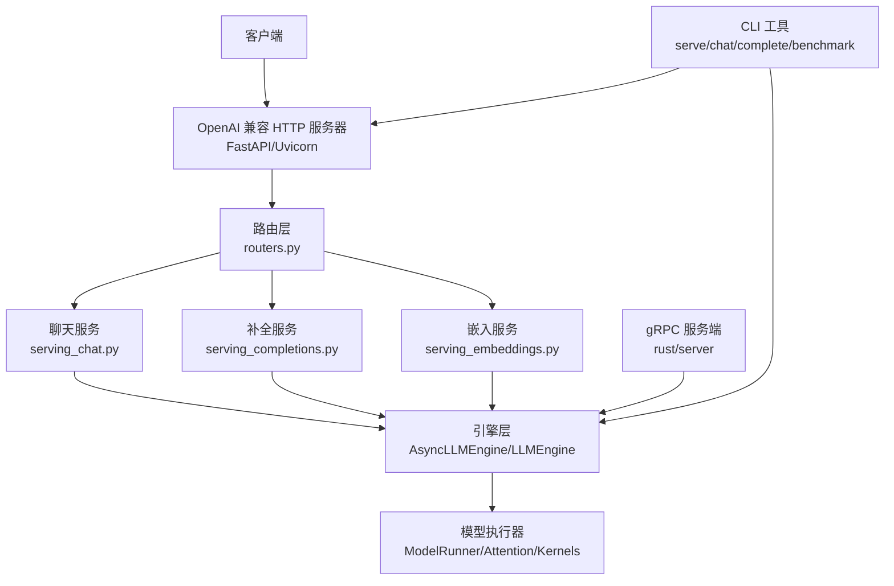
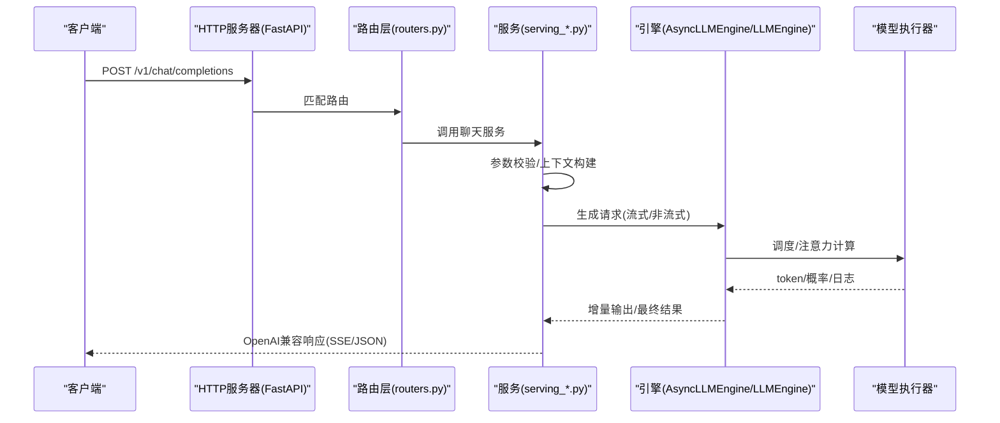
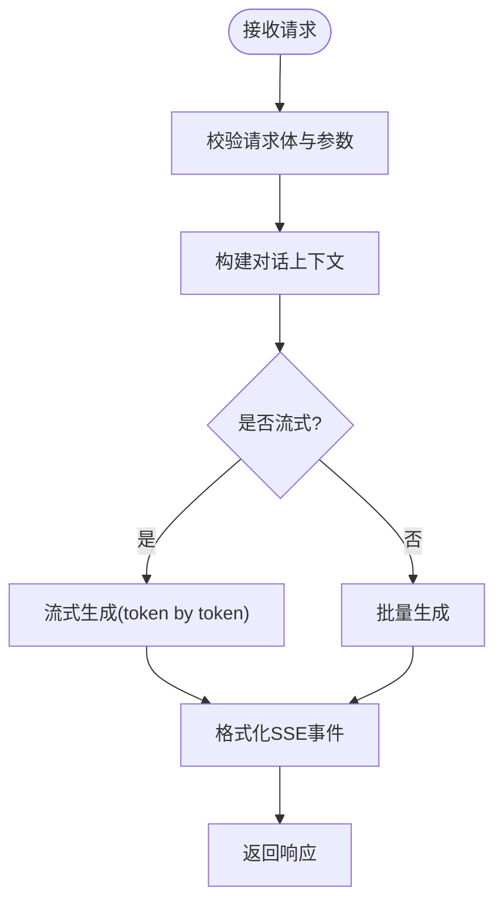
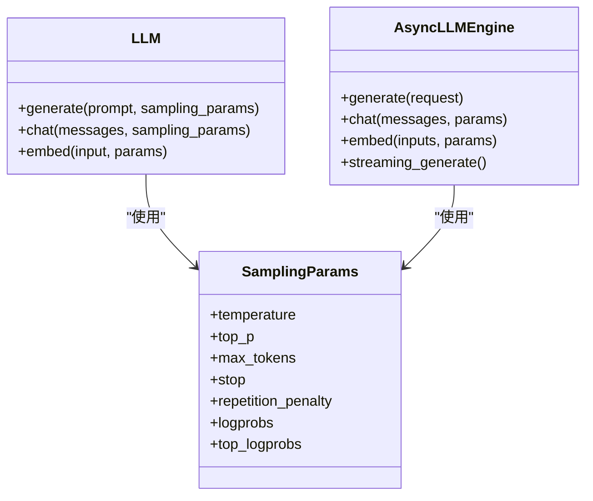
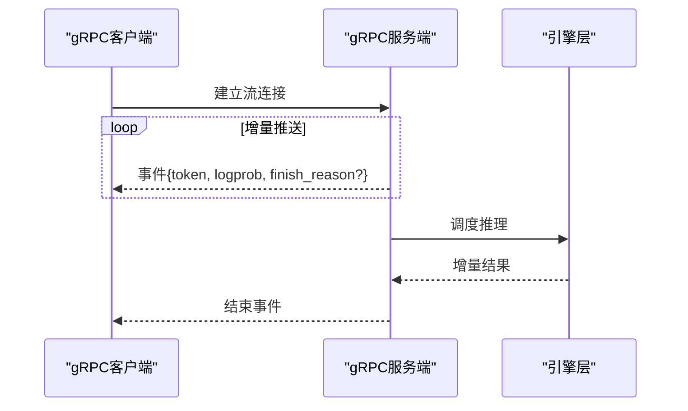
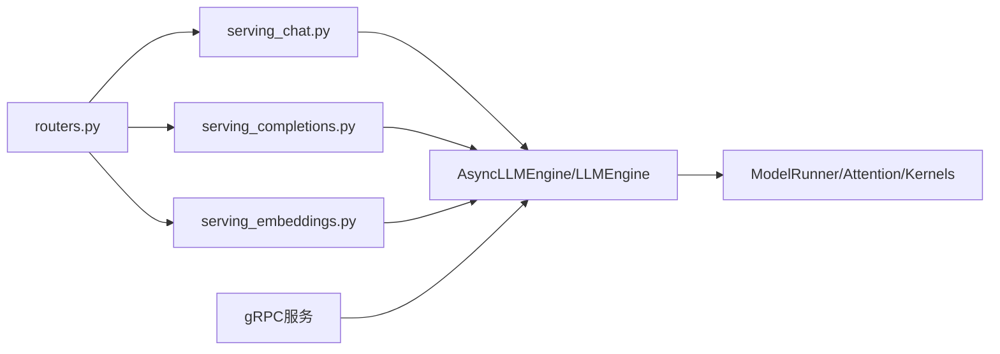

# API参考

<cite>
**本文档引用的文件**   
- [vllm/entrypoints/openai/api_server.py](file://vllm/entrypoints/openai/api_server.py)
- [vllm/entrypoints/openai/serving_chat.py](file://vllm/entrypoints/openai/serving_chat.py)
- [vllm/entrypoints/openai/serving_completions.py](file://vllm/entrypoints/openai/serving_completions.py)
- [vllm/entrypoints/openai/serving_embeddings.py](file://vllm/entrypoints/openai/serving_embeddings.py)
- [vllm/entrypoints/openai/serving_models.py](file://vllm/entrypoints/openai/serving_models.py)
- [vllm/entrypoints/openai/serving_tokenizer.py](file://vllm/entrypoints/openai/serving_tokenizer.py)
- [vllm/entrypoints/openai/routers.py](file://vllm/entrypoints/openai/routers.py)
- [vllm/engine/async_llm_engine.py](file://vllm/engine/async_llm_engine.py)
- [vllm/engine/llm_engine.py](file://vllm/engine/llm_engine.py)
- [vllm/sampling_params.py](file://vllm/sampling_params.py)
- [vllm/outputs.py](file://vllm/outputs.py)
- [vllm/config.py](file://vllm/config.py)
- [vllm/version.py](file://vllm/version.py)
- [rust/proto/vllm_grpc.proto](file://rust/proto/vllm_grpc.proto)
- [vllm/exceptions.py](file://vllm/exceptions.py)
- [docs/cli/chat.md](file://docs/cli/chat.md)
- [docs/cli/complete.md](file://docs/cli/complete.md)
- [docs/cli/serve.md](file://docs/cli/serve.md)
- [benchmarks/benchmark_serving.py](file://benchmarks/benchmark_serving.py)
</cite>

## 目录
1. [简介](#简介)
2. [项目结构](#项目结构)
3. [核心组件](#核心组件)
4. [架构总览](#架构总览)
5. [详细组件分析](#详细组件分析)
6. [依赖关系分析](#依赖关系分析)
7. [性能考虑](#性能考虑)
8. [故障排查指南](#故障排查指南)
9. [结论](#结论)
10. [附录](#附录)

## 简介
本文件为 vLLM 的完整 API 参考，覆盖 OpenAI 兼容 REST API、Python SDK（含异步接口）、gRPC 高性能通信协议以及 CLI 工具命令。文档面向不同技术背景的读者，提供从高层架构到代码级细节的分层说明，并包含错误处理策略、速率限制与版本兼容性信息，以及客户端实现指南和性能优化技巧。

## 项目结构
vLLM 的对外接口主要分布在以下模块：
- OpenAI 兼容 REST API：由 entrypoints/openai 下的服务与路由器实现，暴露 /chat/completions、/completions、/embeddings 等端点。
- Python SDK：通过 engine 层的 LLM/AsyncLLMEngine 暴露同步与异步编程接口。
- gRPC：在 rust/proto 中定义消息格式与服务契约，用于高性能流式交互。
- CLI：通过 docs/cli 与入口脚本提供 serve、chat、complete、benchmark 等子命令。

图表来源
- [vllm/entrypoints/openai/api_server.py](file://vllm/entrypoints/openai/api_server.py)
- [vllm/entrypoints/openai/routers.py](file://vllm/entrypoints/openai/routers.py)
- [vllm/entrypoints/openai/serving_chat.py](file://vllm/entrypoints/openai/serving_chat.py)
- [vllm/entrypoints/openai/serving_completions.py](file://vllm/entrypoints/openai/serving_completions.py)
- [vllm/entrypoints/openai/serving_embeddings.py](file://vllm/entrypoints/openai/serving_embeddings.py)
- [vllm/engine/async_llm_engine.py](file://vllm/engine/async_llm_engine.py)
- [vllm/engine/llm_engine.py](file://vllm/engine/llm_engine.py)
- [rust/proto/vllm_grpc.proto](file://rust/proto/vllm_grpc.proto)

章节来源
- [vllm/entrypoints/openai/api_server.py](file://vllm/entrypoints/openai/api_server.py)
- [vllm/entrypoints/openai/routers.py](file://vllm/entrypoints/openai/routers.py)
- [vllm/engine/async_llm_engine.py](file://vllm/engine/async_llm_engine.py)
- [vllm/engine/llm_engine.py](file://vllm/engine/llm_engine.py)

## 核心组件
- OpenAI 兼容 REST 服务器：基于 FastAPI/Uvicorn 启动，注册路由与中间件，统一请求解析、鉴权、限流与响应序列化。
- 服务层：按功能划分 chat、completions、embeddings、models、tokenizer 等服务，封装业务逻辑与参数校验。
- 引擎层：LLMEngine（同步）与 AsyncLLMEngine（异步）负责调度、批处理、KV Cache 管理与采样。
- gRPC 服务：定义高效二进制协议与事件流，支持低延迟与高吞吐场景。
- CLI：提供 serve、chat、complete、benchmark 等命令，便于本地调试与压测。

章节来源
- [vllm/entrypoints/openai/api_server.py](file://vllm/entrypoints/openai/api_server.py)
- [vllm/entrypoints/openai/serving_chat.py](file://vllm/entrypoints/openai/serving_chat.py)
- [vllm/entrypoints/openai/serving_completions.py](file://vllm/entrypoints/openai/serving_completions.py)
- [vllm/entrypoints/openai/serving_embeddings.py](file://vllm/entrypoints/openai/serving_embeddings.py)
- [vllm/engine/async_llm_engine.py](file://vllm/engine/async_llm_engine.py)
- [vllm/engine/llm_engine.py](file://vllm/engine/llm_engine.py)
- [rust/proto/vllm_grpc.proto](file://rust/proto/vllm_grpc.proto)

## 架构总览
OpenAI 兼容 API 的请求路径如下：
- 客户端发起 HTTP 请求至 FastAPI 服务器。
- 路由层根据 URL 分发到对应服务（聊天、补全、嵌入等）。
- 服务层进行参数校验、上下文构建，调用引擎层生成或嵌入。
- 引擎层协调模型执行器完成推理，返回结果给服务层。
- 服务层序列化为 OpenAI 兼容格式返回客户端。

图表来源
- [vllm/entrypoints/openai/api_server.py](file://vllm/entrypoints/openai/api_server.py)
- [vllm/entrypoints/openai/routers.py](file://vllm/entrypoints/openai/routers.py)
- [vllm/entrypoints/openai/serving_chat.py](file://vllm/entrypoints/openai/serving_chat.py)
- [vllm/engine/async_llm_engine.py](file://vllm/engine/async_llm_engine.py)

## 详细组件分析

### OpenAI 兼容 REST API
- 基础路径：/v1
- 认证方法：通常通过请求头 Authorization: Bearer <token> 传递密钥；服务器可配置鉴权中间件。
- 速率限制：可通过中间件或反向代理（如 Nginx/网关）实现；也可在服务层对并发与队列长度进行控制。

#### /chat/completions
- HTTP 方法：POST
- URL 模式：/v1/chat/completions
- 请求体字段：model、messages、stream、temperature、top_p、n、max_tokens、stop、presence_penalty、frequency_penalty、logprobs、top_logprobs、tools、tool_choice、response_format、seed、extra_body 等。
- 响应体字段：id、object、created、model、choices[]（message、finish_reason、index、logprobs）、usage（prompt_tokens、completion_tokens、total_tokens）等。
- 流式模式：当 stream=true 时，使用 Server-Sent Events（SSE）逐 token 推送增量响应。

图表来源
- [vllm/entrypoints/openai/serving_chat.py](file://vllm/entrypoints/openai/serving_chat.py)
- [vllm/engine/async_llm_engine.py](file://vllm/engine/async_llm_engine.py)

章节来源
- [vllm/entrypoints/openai/serving_chat.py](file://vllm/entrypoints/openai/serving_chat.py)
- [vllm/engine/async_llm_engine.py](file://vllm/engine/async_llm_engine.py)

#### /completions
- HTTP 方法：POST
- URL 模式：/v1/completions
- 请求体字段：model、prompt、suffix、max_tokens、temperature、top_p、n、stream、logprobs、echo、stop、presence_penalty、frequency_penalty、best_of、seed、extra_body 等。
- 响应体字段：id、object、created、model、choices[]（text、index、logprobs、finish_reason）、usage 等。
- 流式模式：同 chat/completions，支持 SSE 增量输出。

章节来源
- [vllm/entrypoints/openai/serving_completions.py](file://vllm/entrypoints/openai/serving_completions.py)
- [vllm/engine/async_llm_engine.py](file://vllm/engine/async_llm_engine.py)

#### /embeddings
- HTTP 方法：POST
- URL 模式：/v1/embeddings
- 请求体字段：model、input（字符串或数组）、encoding_format（float/int）、dimensions、user 等。
- 响应体字段：object、data[]（embedding、index、object）、model、usage 等。
- 注意：输入可为单条或多条文本，返回对应向量表示。

章节来源
- [vllm/entrypoints/openai/serving_embeddings.py](file://vllm/entrypoints/openai/serving_embeddings.py)
- [vllm/engine/async_llm_engine.py](file://vllm/engine/async_llm_engine.py)

#### /models
- HTTP 方法：GET
- URL 模式：/v1/models
- 描述：列出可用模型及其元数据（id、object、created、owned_by、root）。

章节来源
- [vllm/entrypoints/openai/serving_models.py](file://vllm/entrypoints/openai/serving_models.py)

#### /tokenizer
- HTTP 方法：POST
- URL 模式：/v1/tokenizers/estimate_total_tokens
- 描述：估算给定输入的 token 数量，便于计费与配额管理。

章节来源
- [vllm/entrypoints/openai/serving_tokenizer.py](file://vllm/entrypoints/openai/serving_tokenizer.py)

### Python SDK（同步与异步）
- LLM 类：同步接口，适合简单脚本与离线推理。常用方法包括 generate、chat、embed 等（具体以实际实现为准）。
- AsyncLLMEngine：异步接口，适合高并发与流式场景。支持异步生成与流式读取。
- 配置选项：sampling_params（温度、top-p、最大生成长度、停止词、重复惩罚等）、engine_args（并行度、量化、缓存策略等）。

图表来源
- [vllm/engine/async_llm_engine.py](file://vllm/engine/async_llm_engine.py)
- [vllm/sampling_params.py](file://vllm/sampling_params.py)

章节来源
- [vllm/engine/async_llm_engine.py](file://vllm/engine/async_llm_engine.py)
- [vllm/sampling_params.py](file://vllm/sampling_params.py)
- [vllm/outputs.py](file://vllm/outputs.py)

### gRPC 接口
- 协议定义：位于 rust/proto/vllm_grpc.proto，定义服务方法与消息类型。
- 消息格式：包含请求体（模型名、输入、采样参数）、响应体（token、概率、日志、结束原因）等。
- 事件类型：支持增量事件（token 流）、状态事件（开始、结束、错误）等。
- 实时交互：通过双向流或服务器推送实现低延迟流式推理。

图表来源
- [rust/proto/vllm_grpc.proto](file://rust/proto/vllm_grpc.proto)
- [vllm/engine/async_llm_engine.py](file://vllm/engine/async_llm_engine.py)

章节来源
- [rust/proto/vllm_grpc.proto](file://rust/proto/vllm_grpc.proto)

### CLI 工具
- serve：启动 OpenAI 兼容服务器，支持端口、模型、并行度、量化、缓存等参数。
- chat：交互式聊天，支持多轮对话与流式输出。
- complete：文本补全，支持采样参数与停止条件。
- benchmark：基准测试，评估吞吐与延迟。

章节来源
- [docs/cli/serve.md](file://docs/cli/serve.md)
- [docs/cli/chat.md](file://docs/cli/chat.md)
- [docs/cli/complete.md](file://docs/cli/complete.md)
- [benchmarks/benchmark_serving.py](file://benchmarks/benchmark_serving.py)

## 依赖关系分析
- 路由层依赖服务层，服务层依赖引擎层，引擎层依赖模型执行器。
- OpenAI 兼容 API 与 gRPC 共享引擎能力，但传输与序列化方式不同。
- CLI 可直接调用引擎或服务，便于本地开发与压测。

图表来源
- [vllm/entrypoints/openai/routers.py](file://vllm/entrypoints/openai/routers.py)
- [vllm/engine/async_llm_engine.py](file://vllm/engine/async_llm_engine.py)

章节来源
- [vllm/entrypoints/openai/routers.py](file://vllm/entrypoints/openai/routers.py)
- [vllm/engine/async_llm_engine.py](file://vllm/engine/async_llm_engine.py)

## 性能考虑
- 批处理与 KV Cache：合理设置 batch_size、max_num_seqs、cache_block_size 以提升吞吐。
- 流式输出：优先使用 SSE/gRPC 流减少首字延迟。
- 量化与编译：启用 FP8/INT8 量化与 TorchCompile 提升速度。
- 资源隔离：通过 GPU/CPU 内存池与 offload 避免 OOM。
- 监控与指标：暴露 Prometheus/Grafana 指标，观察排队长度、延迟分布与显存占用。

[本节为通用指导，不直接分析具体文件]

## 故障排查指南
- 常见错误：参数校验失败、模型加载异常、显存不足、超时与中断。
- 错误处理策略：统一抛出异常并返回标准错误码；记录详细日志以便定位。
- 诊断工具：启用详细日志、导出指标、使用 profiling 工具分析热点。
- 版本兼容性：检查 vLLM 版本与依赖库（Torch、CUDA、TrtLLM等）兼容性。

章节来源
- [vllm/exceptions.py](file://vllm/exceptions.py)
- [vllm/version.py](file://vllm/version.py)

## 结论
vLLM 提供了完整的 OpenAI 兼容 API、高效的 Python SDK、高性能 gRPC 协议与便捷的 CLI 工具。通过分层架构与模块化设计，用户可根据场景选择合适接口，并通过参数调优与监控手段获得稳定、高吞吐的服务体验。

[本节为总结性内容，不直接分析具体文件]

## 附录
- 客户端实现指南：
  - HTTP：使用 requests/httpx 发送 JSON 请求，处理 SSE 流。
  - Python SDK：导入 LLM/AsyncLLMEngine，配置 sampling_params 与 engine_args。
  - gRPC：使用生成的 stub 调用流式方法，处理事件回调。
- 性能优化技巧：
  - 调整采样参数以减少无效生成。
  - 使用 prefix caching 与结构化输出降低重复计算。
  - 结合负载均衡与水平扩展提升可用性。

[本节为补充信息，不直接分析具体文件]