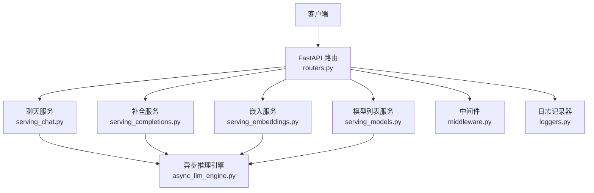
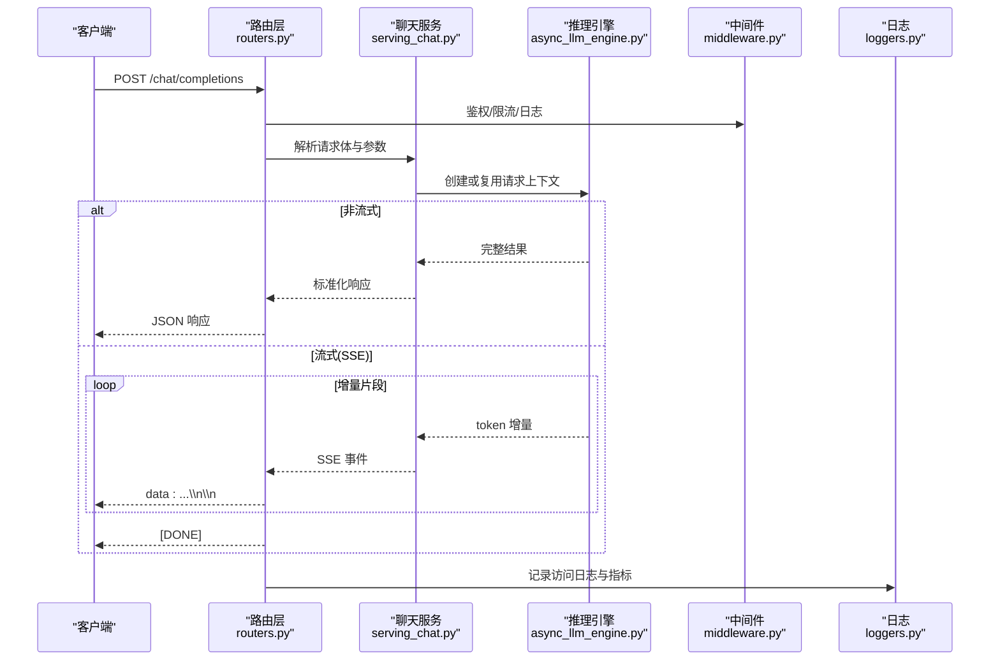
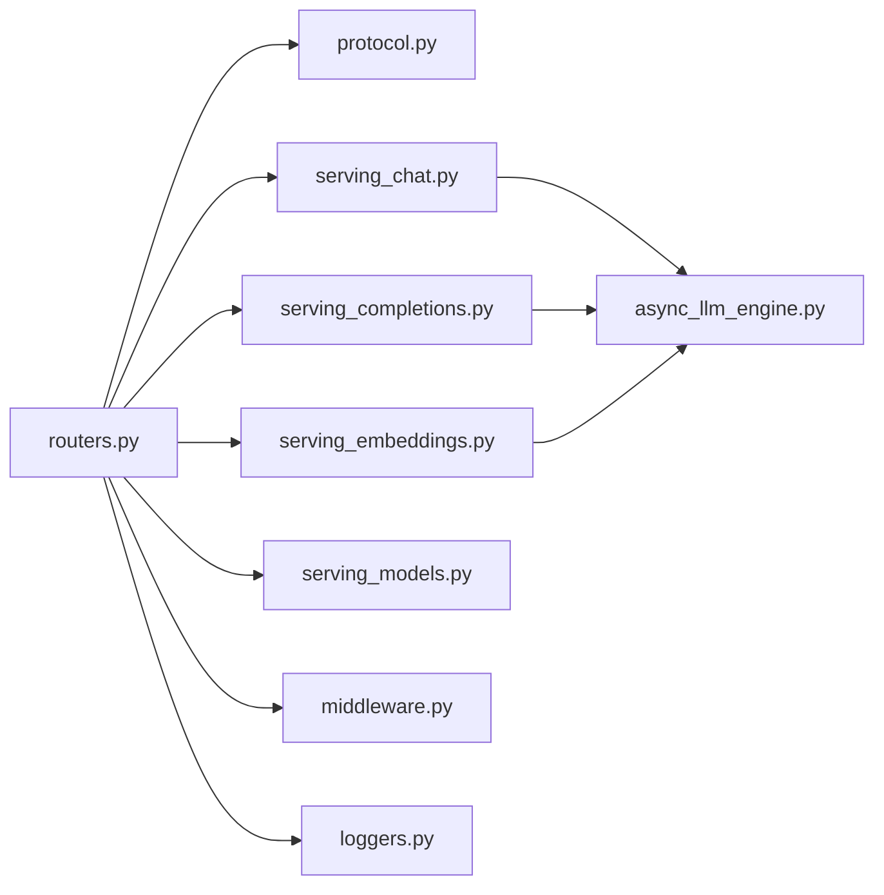

# OpenAI兼容REST API

<cite>
**本文档引用的文件**   
- [vllm/entrypoints/openai/api_server.py](file://vllm/entrypoints/openai/api_server.py)
- [vllm/entrypoints/openai/protocol.py](file://vllm/entrypoints/openai/protocol.py)
- [vllm/entrypoints/openai/routers.py](file://vllm/entrypoints/openai/routers.py)
- [vllm/entrypoints/openai/serving_chat.py](file://vllm/entrypoints/openai/serving_chat.py)
- [vllm/entrypoints/openai/serving_completions.py](file://vllm/entrypoints/openai/serving_completions.py)
- [vllm/entrypoints/openai/serving_embeddings.py](file://vllm/entrypoints/openai/serving_embeddings.py)
- [vllm/entrypoints/openai/serving_models.py](file://vllm/entrypoints/openai/serving_models.py)
- [vllm/entrypoints/openai/middleware.py](file://vllm/entrypoints/openai/middleware.py)
- [vllm/entrypoints/openai/loggers.py](file://vllm/entrypoints/openai/loggers.py)
- [vllm/config.py](file://vllm/config.py)
- [vllm/engine/async_llm_engine.py](file://vllm/engine/async_llm_engine.py)
</cite>

## 目录
1. [简介](#简介)
2. [项目结构](#项目结构)
3. [核心组件](#核心组件)
4. [架构总览](#架构总览)
5. [详细端点规范](#详细端点规范)
6. [依赖关系分析](#依赖关系分析)
7. [性能与流式响应](#性能与流式响应)
8. [故障排查指南](#故障排查指南)
9. [结论](#结论)
10. [附录：JSON Schema与示例](#附录json-schema与示例)

## 简介
本文件为 vLLM 提供的 OpenAI 兼容 REST API 的完整技术文档。内容覆盖以下端点的规范与实现细节：POST /chat/completions、POST /completions、POST /embeddings、GET /models，以及认证、参数校验、错误码与状态码、流式响应（SSE）、速率限制策略、版本兼容性与迁移指南。读者可据此快速集成与调试，并了解内部处理流程与扩展点。

## 项目结构
OpenAI 兼容接口由 FastAPI 应用承载，路由层将请求分发至对应的服务模块，服务模块负责参数校验、调用推理引擎、组装响应与流式输出。关键路径如下：
- 路由注册与中间件：routers.py、middleware.py
- 协议与数据模型：protocol.py
- 业务服务：serving_chat.py、serving_completions.py、serving_embeddings.py、serving_models.py
- 日志与指标：loggers.py
- 配置与引擎：config.py、engine/async_llm_engine.py

图表来源
- [vllm/entrypoints/openai/routers.py](file://vllm/entrypoints/openai/routers.py)
- [vllm/entrypoints/openai/serving_chat.py](file://vllm/entrypoints/openai/serving_chat.py)
- [vllm/entrypoints/openai/serving_completions.py](file://vllm/entrypoints/openai/serving_completions.py)
- [vllm/entrypoints/openai/serving_embeddings.py](file://vllm/entrypoints/openai/serving_embeddings.py)
- [vllm/entrypoints/openai/serving_models.py](file://vllm/entrypoints/openai/serving_models.py)
- [vllm/entrypoints/openai/middleware.py](file://vllm/entrypoints/openai/middleware.py)
- [vllm/entrypoints/openai/loggers.py](file://vllm/entrypoints/openai/loggers.py)
- [vllm/engine/async_llm_engine.py](file://vllm/engine/async_llm_engine.py)

章节来源
- [vllm/entrypoints/openai/api_server.py](file://vllm/entrypoints/openai/api_server.py)
- [vllm/entrypoints/openai/routers.py](file://vllm/entrypoints/openai/routers.py)

## 核心组件
- 路由层：统一挂载 OpenAI 兼容端点，注入中间件（鉴权、限流、日志）。
- 协议层：定义请求/响应的 Pydantic 模型，确保字段校验与默认值。
- 服务层：封装具体业务逻辑，包括消息编排、采样参数、流式生成、嵌入计算与模型元信息。
- 引擎层：异步 LLM 引擎提供统一的推理接口，支持并发与流式返回。
- 配置层：集中管理端口、模型加载、并行度、缓存等运行参数。

章节来源
- [vllm/entrypoints/openai/protocol.py](file://vllm/entrypoints/openai/protocol.py)
- [vllm/entrypoints/openai/serving_chat.py](file://vllm/entrypoints/openai/serving_chat.py)
- [vllm/entrypoints/openai/serving_completions.py](file://vllm/entrypoints/openai/serving_completions.py)
- [vllm/entrypoints/openai/serving_embeddings.py](file://vllm/entrypoints/openai/serving_embeddings.py)
- [vllm/entrypoints/openai/serving_models.py](file://vllm/entrypoints/openai/serving_models.py)
- [vllm/engine/async_llm_engine.py](file://vllm/engine/async_llm_engine.py)
- [vllm/config.py](file://vllm/config.py)

## 架构总览
下图展示一次聊天补全请求从客户端到推理引擎的完整调用链，包含流式与非流式两种路径。

图表来源
- [vllm/entrypoints/openai/routers.py](file://vllm/entrypoints/openai/routers.py)
- [vllm/entrypoints/openai/serving_chat.py](file://vllm/entrytopens/openai/serving_chat.py)
- [vllm/engine/async_llm_engine.py](file://vllm/engine/async_llm_engine.py)
- [vllm/entrypoints/openai/middleware.py](file://vllm/entrypoints/openai/middleware.py)
- [vllm/entrypoints/openai/loggers.py](file://vllm/entrypoints/openai/loggers.py)

## 详细端点规范

### 通用说明
- 基础路径：/v1（若部署时未自定义前缀）
- 认证：通过 HTTP 头部 Authorization: Bearer <TOKEN> 传递密钥；服务端根据配置进行校验与配额控制。
- 内容类型：application/json
- 字符集：UTF-8
- 版本兼容性：遵循 OpenAI API 语义，部分字段可能以 vLLM 扩展形式存在；详见各端点说明与附录。

章节来源
- [vllm/entrypoints/openai/api_server.py](file://vllm/entrypoints/openai/api_server.py)
- [vllm/entrypoints/openai/middleware.py](file://vllm/entrypoints/openai/middleware.py)

### GET /v1/models
- 方法：GET
- 路径：/v1/models
- 认证：可选（取决于部署配置）
- 请求头：Authorization（可选）
- 请求体：无
- 响应体：包含可用模型列表及元信息（如 id、object、created、owned_by 等）
- 状态码：200 OK
- 错误码：401 未授权、500 服务器错误

章节来源
- [vllm/entrypoints/openai/routers.py](file://vllm/entrypoints/openai/routers.py)
- [vllm/entrypoints/openai/serving_models.py](file://vllm/entrypoints/openai/serving_models.py)

### POST /v1/chat/completions
- 方法：POST
- 路径：/v1/chat/completions
- 认证：必需（Authorization: Bearer <TOKEN>）
- 请求头：Content-Type: application/json, Authorization
- 请求体关键字段（节选）：
  - model: 字符串，必填
  - messages: 数组，消息列表，每项含 role、content，可选 tools/tool_choice
  - temperature/top_p/n_max_tokens/repetition_penalty/frequency_penalty/presence_penalty: 采样相关参数
  - stream: 布尔，是否启用流式响应
  - stop: 字符串或数组，停止条件
  - seed: 随机种子（可选）
  - response_format: 结构化输出（可选）
  - logprobs/top_logprobs: 对数概率（可选）
- 响应体（非流式）：包含 choices、usage、id、object、created 等字段
- 响应体（流式）：SSE 事件，逐 token 推送增量片段，最后发送 [DONE]
- 状态码：200 OK、400 参数错误、401 未授权、429 速率限制、500 服务器错误

章节来源
- [vllm/entrypoints/openai/routers.py](file://vllm/entrypoints/openai/routers.py)
- [vllm/entrypoints/openai/protocol.py](file://vllm/entrypoints/openai/protocol.py)
- [vllm/entrypoints/openai/serving_chat.py](file://vllm/entrypoints/openai/serving_chat.py)

### POST /v1/completions
- 方法：POST
- 路径：/v1/completions
- 认证：必需
- 请求头：Content-Type: application/json, Authorization
- 请求体关键字段（节选）：
  - model: 字符串，必填
  - prompt: 字符串或字符串数组，提示文本
  - max_tokens: 整数，最大生成长度
  - temperature/top_p/n: 采样参数
  - stream: 布尔，是否流式
  - stop: 停止条件
  - logprobs/top_logprobs: 对数概率
- 响应体（非流式）：choices、usage、id、object、created
- 响应体（流式）：SSE 事件，增量片段与 [DONE]
- 状态码：同 /chat/completions

章节来源
- [vllm/entrypoints/openai/routers.py](file://vllm/entrypoints/openai/routers.py)
- [vllm/entrypoints/openai/protocol.py](file://vllm/entrypoints/openai/protocol.py)
- [vllm/entrypoints/openai/serving_completions.py](file://vllm/entrypoints/openai/serving_completions.py)

### POST /v1/embeddings
- 方法：POST
- 路径：/v1/embeddings
- 认证：必需
- 请求头：Content-Type: application/json, Authorization
- 请求体关键字段（节选）：
  - model: 字符串，必填
  - input: 字符串或字符串数组，待嵌入文本
  - encoding_format: 编码格式（如 float）
  - user: 用户标识（可选）
- 响应体：data 数组，每项含 embedding、index、object；包含 usage
- 状态码：200 OK、400 参数错误、401 未授权、429 速率限制、500 服务器错误

章节来源
- [vllm/entrypoints/openai/routers.py](file://vllm/entrypoints/openai/routers.py)
- [vllm/entrypoints/openai/protocol.py](file://vllm/entrypoints/openai/protocol.py)
- [vllm/entrypoints/openai/serving_embeddings.py](file://vllm/entrypoints/openai/serving_embeddings.py)

### 流式响应（SSE）
- 触发方式：在请求体中设置 stream=true
- 事件格式：text/event-stream
- 事件类型：
  - data: 增量 JSON 片段（包含 delta 或 text 等）
  - event: 可选事件名（如 message、chunk）
  - [DONE]: 流结束标记
- 客户端需按顺序拼接增量，并在收到 [DONE] 后完成聚合

章节来源
- [vllm/entrypoints/openai/serving_chat.py](file://vllm/entrypoints/openai/serving_chat.py)
- [vllm/entrypoints/openai/serving_completions.py](file://vllm/entrypoints/openai/serving_completions.py)

### 认证与鉴权
- 使用 Authorization: Bearer <TOKEN> 头部传递密钥
- 服务端校验令牌有效性，并关联配额与审计日志
- 未提供或无效令牌将返回 401

章节来源
- [vllm/entrypoints/openai/middleware.py](file://vllm/entrypoints/openai/middleware.py)
- [vllm/entrypoints/openai/loggers.py](file://vllm/entrypoints/openai/loggers.py)

### 参数验证规则
- 必填字段缺失或类型不匹配将返回 400 错误
- 数值范围越界（如 n_max_tokens<=0）将被拒绝
- 冲突参数组合（如同时指定互斥选项）将报错
- 校验失败响应包含错误详情与字段定位

章节来源
- [vllm/entrypoints/openai/protocol.py](file://vllm/entrypoints/openai/protocol.py)

### 错误代码与状态码
- 200：成功
- 400：请求参数错误
- 401：未授权
- 403：禁止访问（配额不足或权限不足）
- 404：资源不存在
- 429：速率限制
- 500：服务器内部错误
- 503：服务不可用（模型未加载或引擎忙）

章节来源
- [vllm/entrypoints/openai/routers.py](file://vllm/entrypoints/openai/routers.py)
- [vllm/entrypoints/openai/loggers.py](file://vllm/entrypoints/openai/loggers.py)

## 依赖关系分析
- 路由层依赖协议模型与服务模块
- 服务模块依赖异步推理引擎
- 中间件与日志贯穿所有端点
- 配置影响模型加载、并发与缓存策略

图表来源
- [vllm/entrypoints/openai/routers.py](file://vllm/entrypoints/openai/routers.py)
- [vllm/entrypoints/openai/protocol.py](file://vllm/entrypoints/openai/protocol.py)
- [vllm/entrypoints/openai/serving_chat.py](file://vllm/entrypoints/openai/serving_chat.py)
- [vllm/entrypoints/openai/serving_completions.py](file://vllm/entrypoints/openai/serving_completions.py)
- [vllm/entrypoints/openai/serving_embeddings.py](file://vllm/entrypoints/openai/serving_embeddings.py)
- [vllm/entrypoints/openai/serving_models.py](file://vllm/entrypoints/openai/serving_models.py)
- [vllm/entrypoints/openai/middleware.py](file://vllm/entrypoints/openai/middleware.py)
- [vllm/entrypoints/openai/loggers.py](file://vllm/entrypoints/openai/loggers.py)
- [vllm/engine/async_llm_engine.py](file://vllm/engine/async_llm_engine.py)

章节来源
- [vllm/entrypoints/openai/routers.py](file://vllm/entrypoints/openai/routers.py)
- [vllm/engine/async_llm_engine.py](file://vllm/engine/async_llm_engine.py)

## 性能与流式响应
- 流式响应降低首字延迟，适合交互式对话
- 并发与批处理由引擎层调度，受配置项影响（如 batch_size、max_num_seqs）
- 建议开启 prefix caching 以提升重复前缀命中
- 采样参数（temperature、top_p）影响生成质量与稳定性
- 监控指标：QPS、延迟分布、显存占用、KV Cache 命中率

章节来源
- [vllm/engine/async_llm_engine.py](file://vllm/engine/async_llm_engine.py)
- [vllm/config.py](file://vllm/config.py)

## 故障排查指南
- 401 未授权：检查 Authorization 头部与令牌有效性
- 400 参数错误：核对必填字段与取值范围，参考协议模型
- 429 速率限制：降低请求频率或提升配额上限
- 500/503：确认模型已正确加载，引擎处于就绪状态
- 流式中断：检查网络与客户端 SSE 解析逻辑

章节来源
- [vllm/entrypoints/openai/middleware.py](file://vllm/entrypoints/openai/middleware.py)
- [vllm/entrypoints/openai/loggers.py](file://vllm/entrypoints/openai/loggers.py)

## 结论
vLLM 的 OpenAI 兼容 REST API 提供了稳定、高性能且可扩展的接口，覆盖聊天、补全与嵌入三大核心场景。通过清晰的协议定义、完善的中间件与日志体系，以及灵活的配置项，开发者可快速集成并优化生产环境。建议结合流式响应与缓存策略以获得更佳的用户体验与吞吐表现。

## 附录：JSON Schema与示例

### GET /v1/models 响应 Schema（节选）
- object: string
- data: array of models
  - id: string
  - object: string
  - created: integer
  - owned_by: string

章节来源
- [vllm/entrypoints/openai/serving_models.py](file://vllm/entrypoints/openai/serving_models.py)

### POST /v1/chat/completions 请求 Schema（节选）
- model: string
- messages: array of messages
  - role: enum("system","user","assistant")
  - content: string
- temperature: number
- top_p: number
- n_max_tokens: integer
- repetition_penalty: number
- frequency_penalty: number
- presence_penalty: number
- stream: boolean
- stop: string|array
- seed: integer
- response_format: object
- logprobs: boolean
- top_logprobs: integer

章节来源
- [vllm/entrypoints/openai/protocol.py](file://vllm/entrypoints/openai/protocol.py)
- [vllm/entrypoints/openai/serving_chat.py](file://vllm/entrypoints/openai/serving_chat.py)

### POST /v1/completions 请求 Schema（节选）
- model: string
- prompt: string|array
- max_tokens: integer
- temperature: number
- top_p: number
- n: integer
- stream: boolean
- stop: string|array
- logprobs: boolean
- top_logprobs: integer

章节来源
- [vllm/entrypoints/openai/protocol.py](file://vllm/entrypoints/openai/protocol.py)
- [vllm/entrypoints/openai/serving_completions.py](file://vllm/entrypoints/openai/serving_completions.py)

### POST /v1/embeddings 请求 Schema（节选）
- model: string
- input: string|array
- encoding_format: string
- user: string

章节来源
- [vllm/entrypoints/openai/protocol.py](file://vllm/entrypoints/openai/protocol.py)
- [vllm/entrypoints/openai/serving_embeddings.py](file://vllm/entrypoints/openai/serving_embeddings.py)

### 流式响应事件格式（SSE）
- 事件类型：data
- 事件内容：增量 JSON 片段（包含 delta/text 等）
- 结束事件：[DONE]

章节来源
- [vllm/entrypoints/openai/serving_chat.py](file://vllm/entrypoints/openai/serving_chat.py)
- [vllm/entrypoints/openai/serving_completions.py](file://vllm/entrypoints/openai/serving_completions.py)

### 示例请求与响应（描述性）
- 聊天补全（非流式）：
  - 请求：包含 model、messages、temperature、n_max_tokens 等
  - 响应：包含 choices（message 与 finish_reason）、usage（prompt_tokens、completion_tokens、total_tokens）
- 聊天补全（流式）：
  - 请求：stream=true
  - 响应：多次 data 事件推送增量，最后 [DONE]
- 补全：
  - 请求：model、prompt、max_tokens、stop
  - 响应：choices（text、finish_reason）、usage
- 嵌入：
  - 请求：model、input、encoding_format
  - 响应：data（embedding、index、object）、usage

章节来源
- [vllm/entrypoints/openai/protocol.py](file://vllm/entrypoints/openai/protocol.py)
- [vllm/entrypoints/openai/serving_chat.py](file://vllm/entrypoints/openai/serving_chat.py)
- [vllm/entrypoints/openai/serving_completions.py](file://vllm/entrypoints/openai/serving_completions.py)
- [vllm/entrypoints/openai/serving_embeddings.py](file://vllm/entrypoints/openai/serving_embeddings.py)

### 速率限制策略
- 基于令牌桶或固定窗口算法，按密钥维度限制 QPS 与并发
- 超限返回 429，并附带重试建议（Retry-After）
- 可通过配置调整全局与单密钥限额

章节来源
- [vllm/entrypoints/openai/middleware.py](file://vllm/entrypoints/openai/middleware.py)

### 版本兼容性与迁移指南
- 保持 OpenAI API 语义一致，新增字段以向后兼容方式引入
- 废弃字段将在下个主版本移除，提前发布弃用公告
- 迁移建议：优先使用 /chat/completions，逐步替换旧版 /completions；嵌入接口保持稳定

章节来源
- [vllm/entrypoints/openai/routers.py](file://vllm/entrypoints/openai/routers.py)
- [vllm/entrypoints/openai/protocol.py](file://vllm/entrypoints/openai/protocol.py)