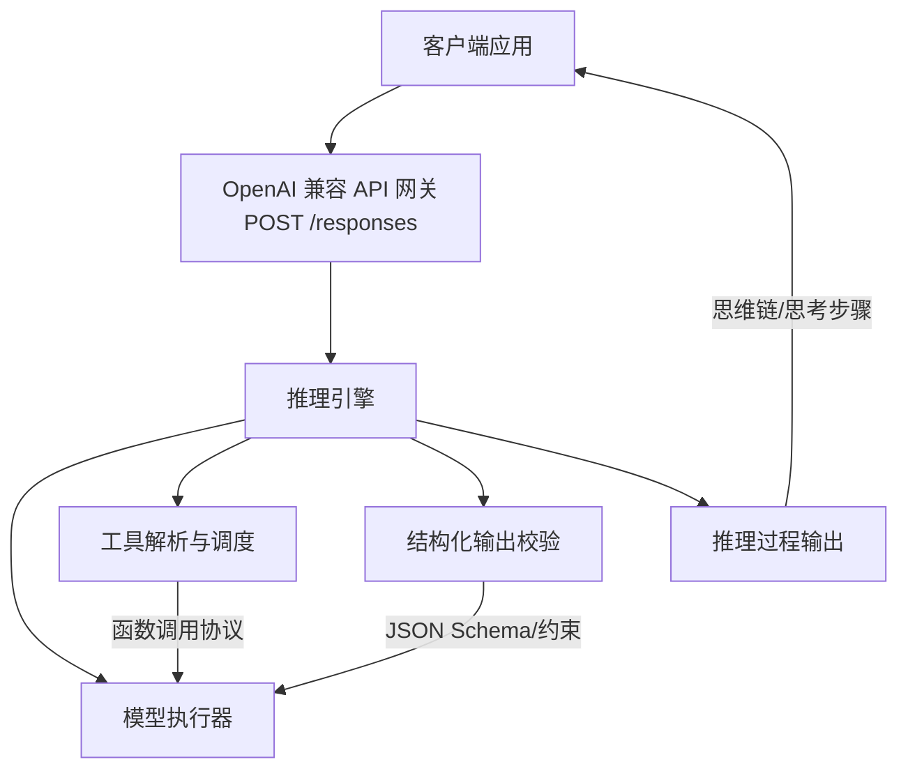
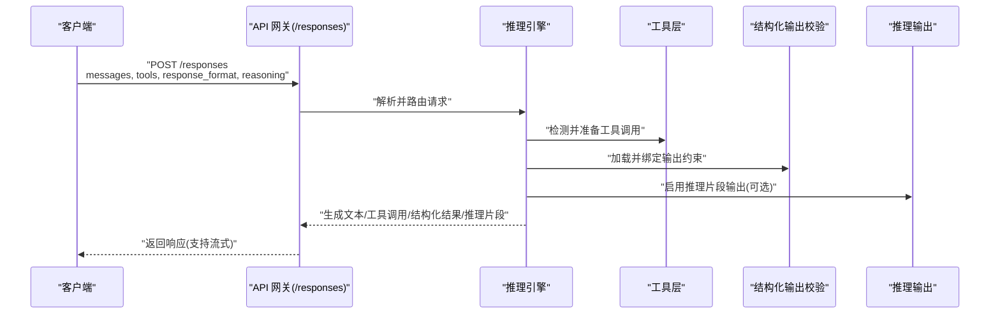
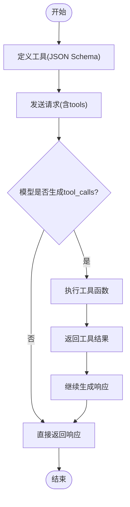
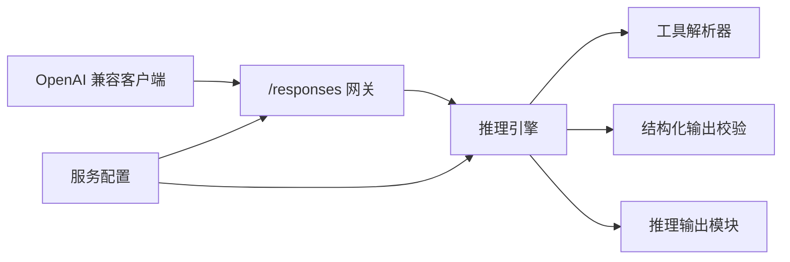

# 响应处理API

<cite>
**本文档引用的文件**   
- [openai_responses_client.py](file://examples/reasoning/openai_responses_client.py)
- [openai_responses_client_with_tools.py](file://examples/tool_calling/openai_responses_client_with_tools.py)
- [openai_responses_client_with_mcp_tools.py](file://examples/tool_calling/openai_responses_client_with_mcp_tools.py)
- [tool_calling.md](file://docs/features/tool_calling.md)
- [structured_outputs.md](file://docs/features/structured_outputs.md)
- [reasoning_outputs.md](file://docs/features/reasoning_outputs.md)
- [serve_args.md](file://docs/configuration/serve_args.md)
- [v1_guide.md](file://docs/usage/v1_guide.md)
- [troubleshooting.md](file://docs/usage/troubleshooting.md)
</cite>

## 目录
1. [简介](#简介)
2. [项目结构](#项目结构)
3. [核心组件](#核心组件)
4. [架构总览](#架构总览)
5. [详细组件分析](#详细组件分析)
6. [依赖关系分析](#依赖关系分析)
7. [性能考量](#性能考量)
8. [故障排查指南](#故障排查指南)
9. [结论](#结论)
10. [附录](#附录)

## 简介
本文件面向需要集成与使用 vLLM 的“响应处理 API”（POST /responses）的开发者，系统化说明请求-响应协议、结构化输出、工具调用、推理过程控制、多轮对话与上下文保持、错误恢复与重试策略、超时处理，以及复杂业务场景下的响应模板与自定义处理器开发要点。文档以仓库中的示例客户端与特性文档为依据，确保内容与实际实现一致。

## 项目结构
围绕 POST /responses 的响应处理主要涉及以下层面：
- 示例客户端：演示如何构造请求、携带工具定义、流式与非流式响应、推理过程输出等。
- 特性文档：阐述工具调用、结构化输出、推理输出的规范与行为。
- 服务配置与使用指南：涵盖服务端参数、V1 接口使用方式与常见问题。

图表来源 
- [openai_responses_client.py](file://examples/reasoning/openai_responses_client.py)
- [openai_responses_client_with_tools.py](file://examples/tool_calling/openai_responses_client_with_tools.py)
- [openai_responses_client_with_mcp_tools.py](file://examples/tool_calling/openai_responses_client_with_mcp_tools.py)
- [tool_calling.md](file://docs/features/tool_calling.md)
- [structured_outputs.md](file://docs/features/structured_outputs.md)
- [reasoning_outputs.md](file://docs/features/reasoning_outputs.md)

章节来源
- [openai_responses_client.py](file://examples/reasoning/openai_responses_client.py)
- [openai_responses_client_with_tools.py](file://examples/tool_calling/openai_responses_client_with_tools.py)
- [openai_responses_client_with_mcp_tools.py](file://examples/tool_calling/openai_responses_client_with_mcp_tools.py)
- [tool_calling.md](file://docs/features/tool_calling.md)
- [structured_outputs.md](file://docs/features/structured_outputs.md)
- [reasoning_outputs.md](file://docs/features/reasoning_outputs.md)

## 核心组件
- 请求构造与发送：通过 OpenAI 兼容客户端发起 POST /responses 请求，支持消息列表、工具定义、结构化输出模式、推理开关等。
- 响应解析：统一解析文本、工具调用、结构化结果与推理片段；支持流式增量返回。
- 工具调用协议：基于函数签名与参数 JSON 的工具调用，支持同步与异步执行、结果回传。
- 结构化输出：基于 JSON Schema 或约束的强类型输出，自动校验与修复。
- 推理过程控制：可开启/关闭推理片段输出，便于调试与审计。
- 多轮对话与上下文：维护会话历史、系统提示与工具状态，保证跨轮一致性。

章节来源
- [openai_responses_client.py](file://examples/reasoning/openai_responses_client.py)
- [openai_responses_client_with_tools.py](file://examples/tool_calling/openai_responses_client_with_tools.py)
- [openai_responses_client_with_mcp_tools.py](file://examples/tool_calling/openai_responses_client_with_mcp_tools.py)
- [tool_calling.md](file://docs/features/tool_calling.md)
- [structured_outputs.md](file://docs/features/structured_outputs.md)
- [reasoning_outputs.md](file://docs/features/reasoning_outputs.md)

## 架构总览
下图展示了从客户端到引擎的核心交互路径，包括工具调用、结构化输出与推理输出在响应中的组织方式。

图表来源 
- [openai_responses_client.py](file://examples/reasoning/openai_responses_client.py)
- [openai_responses_client_with_tools.py](file://examples/tool_calling/openai_responses_client_with_tools.py)
- [openai_responses_client_with_mcp_tools.py](file://examples/tool_calling/openai_responses_client_with_mcp_tools.py)
- [tool_calling.md](file://docs/features/tool_calling.md)
- [structured_outputs.md](file://docs/features/structured_outputs.md)
- [reasoning_outputs.md](file://docs/features/reasoning_outputs.md)

## 详细组件分析

### 端点规范：POST /responses
- 方法：POST
- 路径：/responses
- 认证：按部署配置（通常为密钥或无鉴权本地模式）
- 请求体关键字段（依据示例与特性文档归纳）：
  - messages：对话消息数组，包含 role 与 content，支持系统/用户/助手/工具角色
  - tools：工具定义数组，声明函数名、描述、参数 JSON Schema
  - response_format：结构化输出格式，如 JSON Schema 或指定模式
  - reasoning：是否输出推理片段（思维链），用于调试与审计
  - stream：是否流式返回
  - 其他采样参数：temperature、top_p、max_tokens 等（依服务端实现）
- 响应体关键字段：
  - id：请求标识
  - created：时间戳
  - model：模型名称
  - choices：结果数组，包含 message、tool_calls、structured_output、reasoning 等
  - usage：token 用量统计
  - error：错误信息（失败时）

章节来源
- [openai_responses_client.py](file://examples/reasoning/openai_responses_client.py)
- [openai_responses_client_with_tools.py](file://examples/tool_calling/openai_responses_client_with_tools.py)
- [openai_responses_client_with_mcp_tools.py](file://examples/tool_calling/openai_responses_client_with_mcp_tools.py)
- [tool_calling.md](file://docs/features/tool_calling.md)
- [structured_outputs.md](file://docs/features/structured_outputs.md)
- [reasoning_outputs.md](file://docs/features/reasoning_outputs.md)

### 结构化响应格式
- 文本响应：普通字符串或分片增量（流式）
- 工具调用响应：包含 tool_calls 数组，每个元素含函数名、参数 JSON、调用 ID
- 结构化输出：根据 response_format 返回严格符合约束的数据对象
- 推理输出：当启用 reasoning，返回推理片段数组或字段，便于追踪模型思考过程

章节来源
- [structured_outputs.md](file://docs/features/structured_outputs.md)
- [reasoning_outputs.md](file://docs/features/reasoning_outputs.md)
- [openai_responses_client.py](file://examples/reasoning/openai_responses_client.py)

### 工具调用协议
- 工具定义：函数名、描述、参数 JSON Schema（必填字段、类型、枚举等）
- 调用流程：
  - 客户端提交 tools 定义
  - 模型生成 tool_calls
  - 客户端执行工具函数，将结果作为工具消息回传
  - 引擎继续生成最终响应
- MCP 工具：支持通过 MCP 协议接入外部工具集（示例中提供客户端用法）

图表来源 
- [openai_responses_client_with_tools.py](file://examples/tool_calling/openai_responses_client_with_tools.py)
- [openai_responses_client_with_mcp_tools.py](file://examples/tool_calling/openai_responses_client_with_mcp_tools.py)
- [tool_calling.md](file://docs/features/tool_calling.md)

章节来源
- [openai_responses_client_with_tools.py](file://examples/tool_calling/openai_responses_client_with_tools.py)
- [openai_responses_client_with_mcp_tools.py](file://examples/tool_calling/openai_responses_client_with_mcp_tools.py)
- [tool_calling.md](file://docs/features/tool_calling.md)

### 推理过程控制
- 开关：通过 reasoning 参数控制是否输出推理片段
- 用途：调试、审计、合规审查
- 影响：可能增加延迟与 token 消耗，需权衡开启范围

章节来源
- [reasoning_outputs.md](file://docs/features/reasoning_outputs.md)
- [openai_responses_client.py](file://examples/reasoning/openai_responses_client.py)

### 多轮对话管理与上下文保持
- 消息历史：维护 system/user/assistant/tool 角色序列
- 上下文窗口：注意 max_tokens 与模型上下文长度限制
- 工具状态：在多轮中保持一致性，必要时重置或更新工具定义
- 会话隔离：为不同会话分配独立上下文，避免交叉污染

章节来源
- [openai_responses_client_with_tools.py](file://examples/tool_calling/openai_responses_client_with_tools.py)
- [openai_responses_client_with_mcp_tools.py](file://examples/tool_calling/openai_responses_client_with_mcp_tools.py)

### 响应格式化、错误恢复、重试策略与超时处理
- 响应格式化：
  - 非流式：一次性返回完整响应
  - 流式：按增量块返回，客户端需拼接与解析
- 错误恢复：
  - 网络错误：指数退避重试
  - 模型错误：降级策略（切换模型或回退到默认响应）
  - 工具执行错误：捕获异常并返回错误消息，允许重新调用
- 重试策略：
  - 幂等性：仅对 GET/安全操作或明确幂等的 POST 进行重试
  - 最大重试次数与间隔上限
- 超时处理：
  - 连接超时、读取超时分别设置
  - 长任务建议流式返回，避免阻塞

章节来源
- [troubleshooting.md](file://docs/usage/troubleshooting.md)
- [v1_guide.md](file://docs/usage/v1_guide.md)

### 复杂业务场景的响应模板
- 查询+工具调用：先返回工具调用，再结合工具结果生成结构化答案
- 多步推理：启用 reasoning，输出逐步推导过程，最后给出结论
- 强类型输出：使用 response_format 约束返回结构，便于下游系统消费
- 流式增强：边生成边渲染，提升用户体验

章节来源
- [structured_outputs.md](file://docs/features/structured_outputs.md)
- [reasoning_outputs.md](file://docs/features/reasoning_outputs.md)
- [openai_responses_client.py](file://examples/reasoning/openai_responses_client.py)

### 自定义处理器开发指南
- 目标：扩展响应处理逻辑（如日志、审计、缓存、指标上报）
- 步骤：
  - 在 API 网关层拦截请求与响应
  - 解析并验证输入（messages、tools、response_format）
  - 注入中间件（如限流、配额检查）
  - 包装响应（追加元数据、脱敏敏感字段）
  - 错误标准化（统一错误码与消息）
- 注意事项：
  - 保持 OpenAI 兼容语义，避免破坏客户端兼容性
  - 流式处理需逐块转发，避免缓冲过大
  - 工具调用与结构化输出需在中间件中透传或适配

章节来源
- [v1_guide.md](file://docs/usage/v1_guide.md)
- [serve_args.md](file://docs/configuration/serve_args.md)

## 依赖关系分析
- 客户端依赖 OpenAI 兼容 SDK，封装请求构造与响应解析
- 引擎依赖工具解析器、结构化输出校验器、推理输出模块
- 服务配置影响行为（如是否启用工具、结构化输出、推理输出）

图表来源 
- [openai_responses_client.py](file://examples/reasoning/openai_responses_client.py)
- [openai_responses_client_with_tools.py](file://examples/tool_calling/openai_responses_client_with_tools.py)
- [openai_responses_client_with_mcp_tools.py](file://examples/tool_calling/openai_responses_client_with_mcp_tools.py)
- [tool_calling.md](file://docs/features/tool_calling.md)
- [structured_outputs.md](file://docs/features/structured_outputs.md)
- [reasoning_outputs.md](file://docs/features/reasoning_outputs.md)
- [serve_args.md](file://docs/configuration/serve_args.md)

章节来源
- [serve_args.md](file://docs/configuration/serve_args.md)
- [v1_guide.md](file://docs/usage/v1_guide.md)

## 性能考量
- 流式响应降低首字节延迟，适合长文本与工具调用场景
- 结构化输出与推理输出会增加计算与内存开销，按需开启
- 工具调用串行执行可能成为瓶颈，考虑并行化与缓存
- 合理设置 max_tokens 与 temperature，避免过度生成

[本节为通用指导，不直接分析具体文件]

## 故障排查指南
- 常见错误：
  - 参数缺失或类型错误：检查 messages、tools、response_format 的完整性与格式
  - 工具执行失败：确认函数签名与参数匹配，查看返回值结构
  - 超时：调整超时阈值，评估模型长度与并发
  - 结构化输出校验失败：修正 JSON Schema 或客户端构造
- 诊断手段：
  - 启用 reasoning 输出定位问题
  - 使用流式响应观察生成过程
  - 查看服务端日志与指标

章节来源
- [troubleshooting.md](file://docs/usage/troubleshooting.md)
- [reasoning_outputs.md](file://docs/features/reasoning_outputs.md)

## 结论
POST /responses 提供了统一的响应处理入口，支持工具调用、结构化输出与推理过程控制，适用于复杂业务场景。通过合理的请求构造、错误恢复与性能优化，可实现稳定高效的 LLM 服务集成。

[本节为总结性内容，不直接分析具体文件]

## 附录
- 参考示例：
  - 基础响应客户端：[openai_responses_client.py](file://examples/reasoning/openai_responses_client.py)
  - 工具调用客户端：[openai_responses_client_with_tools.py](file://examples/tool_calling/openai_responses_client_with_tools.py)
  - MCP 工具客户端：[openai_responses_client_with_mcp_tools.py](file://examples/tool_calling/openai_responses_client_with_mcp_tools.py)
- 特性文档：
  - 工具调用：[tool_calling.md](file://docs/features/tool_calling.md)
  - 结构化输出：[structured_outputs.md](file://docs/features/structured_outputs.md)
  - 推理输出：[reasoning_outputs.md](file://docs/features/reasoning_outputs.md)
- 服务配置与使用：
  - 服务参数：[serve_args.md](file://docs/configuration/serve_args.md)
  - V1 使用指南：[v1_guide.md](file://docs/usage/v1_guide.md)
  - 故障排查：[troubleshooting.md](file://docs/usage/troubleshooting.md)