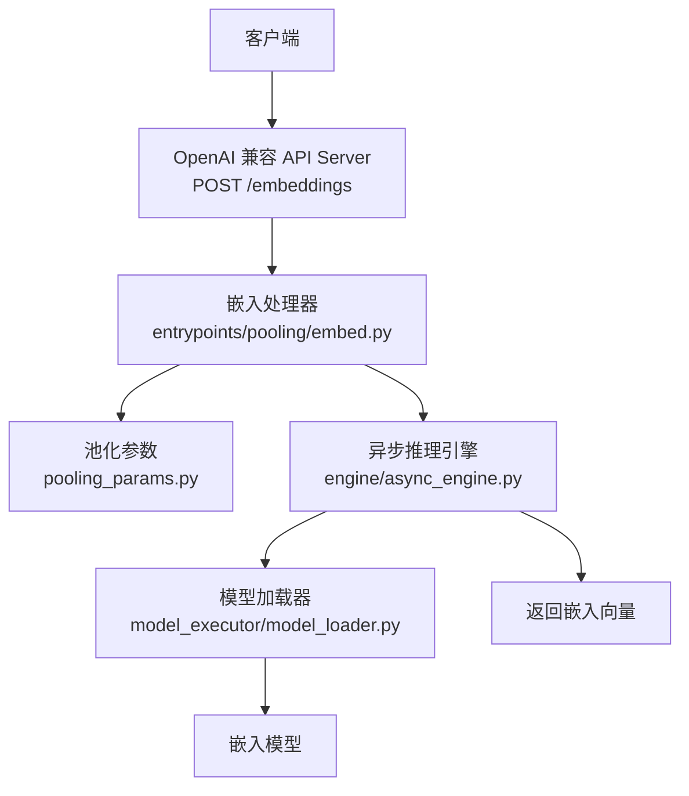
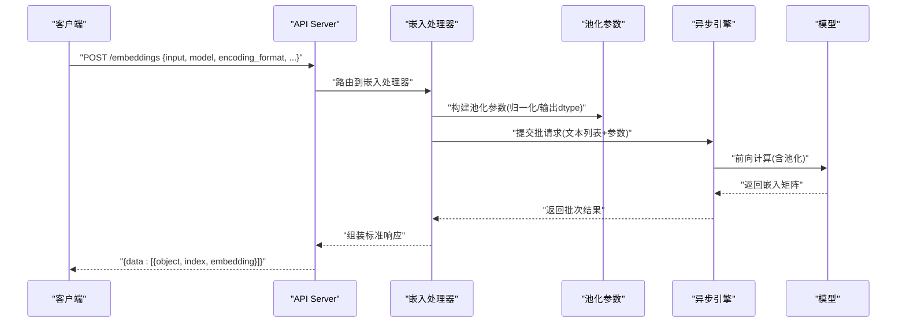
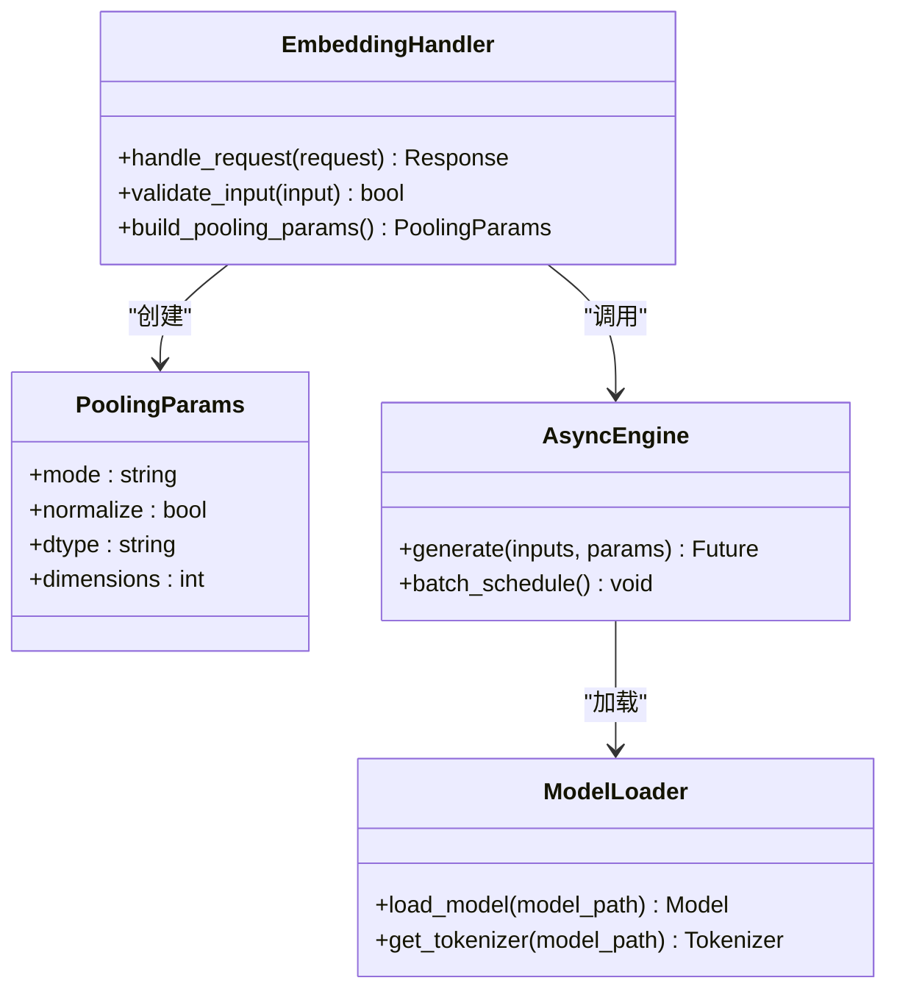

# 嵌入向量API

<cite>
**本文引用的文件**   
- [vllm/pooling_params.py](file://vllm/pooling_params.py)
- [vllm/entrypoints/pooling/embed.py](file://vllm/entrypoints/pooling/embed.py)
- [examples/pooling/embed/main.py](file://examples/pooling/embed/main.py)
- [examples/pooling/embed/openai_api_server.py](file://examples/pooling/embed/openai_api_server.py)
- [tests/entrypoints/pooling/test_embed.py](file://tests/entrypoints/pooling/test_embed.py)
- [vllm/config.py](file://vllm/config.py)
- [vllm/engine/async_engine.py](file://vllm/engine/async_engine.py)
- [vllm/model_executor/model_loader.py](file://vllm/model_executor/model_loader.py)
</cite>

## 目录
1. [简介](#简介)
2. [项目结构](#项目结构)
3. [核心组件](#核心组件)
4. [架构总览](#架构总览)
5. [详细组件分析](#详细组件分析)
6. [依赖关系分析](#依赖关系分析)
7. [性能考虑](#性能考虑)
8. [故障排查指南](#故障排查指南)
9. [结论](#结论)
10. [附录](#附录)

## 简介
本文件面向需要调用 vLLM 嵌入向量（Embedding）能力的开发者，提供 POST /embeddings 端点的完整规范与最佳实践。内容涵盖输入文本处理、模型配置、编码格式选择、响应数据结构、维度与归一化选项、批量处理能力；并给出向量相似度计算示例、语义搜索应用场景与性能调优建议，以及与主流向量数据库的集成方式。

## 项目结构
vLLM 的嵌入能力由“池化（Pooling）”子系统提供，并通过 OpenAI 兼容的 API Server 暴露 /embeddings 接口。关键路径如下：
- 参数定义：pooling_params.py
- 服务端入口：entrypoints/pooling/embed.py
- 示例服务：examples/pooling/embed/openai_api_server.py
- 端到端测试：tests/entrypoints/pooling/test_embed.py
- 引擎与加载：engine/async_engine.py、model_executor/model_loader.py

图表来源
- [vllm/entrypoints/pooling/embed.py](file://vllm/entrypoints/pooling/embed.py)
- [vllm/pooling_params.py](file://vllm/pooling_params.py)
- [vllm/engine/async_engine.py](file://vllm/engine/async_engine.py)
- [vllm/model_executor/model_loader.py](file://vllm/model_executor/model_loader.py)

章节来源
- [vllm/pooling_params.py](file://vllm/pooling_params.py)
- [vllm/entrypoints/pooling/embed.py](file://vllm/entrypoints/pooling/embed.py)
- [examples/pooling/embed/openai_api_server.py](file://examples/pooling/embed/openai_api_server.py)
- [tests/entrypoints/pooling/test_embed.py](file://tests/entrypoints/pooling/test_embed.py)

## 核心组件
- 池化参数对象：用于描述 pooling 模式、归一化、输出 dtype 等。
- 嵌入处理器：解析请求体、校验参数、构造池化参数、调用引擎执行、组装响应。
- 异步引擎：负责批调度、内存管理、模型前向与结果回传。
- 模型加载器：按模型类型与配置加载权重与 tokenizer。

章节来源
- [vllm/pooling_params.py](file://vllm/pooling_params.py)
- [vllm/entrypoints/pooling/embed.py](file://vllm/entrypoints/pooling/embed.py)
- [vllm/engine/async_engine.py](file://vllm/engine/async_engine.py)
- [vllm/model_executor/model_loader.py](file://vllm/model_executor/model_loader.py)

## 架构总览
下图展示了从 HTTP 请求到向量输出的关键流程，以及各模块间的职责边界。

图表来源
- [vllm/entrypoints/pooling/embed.py](file://vllm/entrypoints/pooling/embed.py)
- [vllm/pooling_params.py](file://vllm/pooling_params.py)
- [vllm/engine/async_engine.py](file://vllm/engine/async_engine.py)

## 详细组件分析

### POST /embeddings 端点规范
- 方法：POST
- 路径：/embeddings
- 鉴权：遵循 OpenAI 兼容鉴权头（如 Authorization），若未启用鉴权则忽略
- 请求体字段（常用）：
  - input: string | list<string>（必填）支持单条或批量文本
  - model: string（必填）模型名称或路径
  - encoding_format: string（可选）值通常为 float 或 base64；默认 float
  - user: string（可选）用户标识，透传到日志与追踪
  - dimensions: int（可选）对支持截断/投影的模型生效
  - normalize: bool（可选）是否对输出向量做 L2 归一化
  - prompt: string（可选）部分模型需要显式提示词模板
- 成功响应（200）：
  - object: string（固定为 "list"）
  - data: array<object>
    - object: string（固定为 "embedding"）
    - index: int（输入索引）
    - embedding: number[] | string（数值数组或 base64 字符串）
  - usage: object
    - prompt_tokens: int
    - total_tokens: int
- 错误响应：
  - 400 参数错误（如 input 为空、encoding_format 非法）
  - 404 模型不存在
  - 422 校验失败（字段类型不合法）
  - 500 服务器内部错误

章节来源
- [vllm/entrypoints/pooling/embed.py](file://vllm/entrypoints/pooling/embed.py)
- [tests/entrypoints/pooling/test_embed.py](file://tests/entrypoints/pooling/test_embed.py)

### 输入文本处理
- 输入类型：
  - 字符串：自动包装为单元素列表
  - 字符串数组：直接作为批量输入
- 预处理：
  - 去除空字符串与空白行（视实现而定）
  - 长度限制：受模型上下文窗口与后端批大小约束
  - Tokenizer：根据模型自动选择，支持多语言与特殊 token
- 提示词模板：
  - 某些模型需通过 prompt 字段注入模板或系统指令
  - 模板缺失可能导致向量质量下降

章节来源
- [vllm/entrypoints/pooling/embed.py](file://vllm/entrypoints/pooling/embed.py)
- [examples/pooling/embed/main.py](file://examples/pooling/embed/main.py)

### 模型配置与池化参数
- 池化模式：
  - last_token：取最后一个 token 的隐藏状态
  - mean_pooling：对所有 token 隐藏状态求平均
  - cls_token：取 [CLS] 位置（若存在）
- 归一化：
  - normalize=true 时对每个向量进行 L2 归一化，便于余弦相似度比较
- 输出精度：
  - 可通过 dtype 控制输出精度（float32 默认，部分后端支持 float16/bfloat16）
- 维度控制：
  - 当模型支持时，可指定 dimensions 进行截断或线性投影

章节来源
- [vllm/pooling_params.py](file://vllm/pooling_params.py)

### 编码格式选择
- encoding_format=float：
  - embedding 字段返回浮点数组，适合本地计算与调试
- encoding_format=base64：
  - embedding 字段返回 base64 字符串，降低网络传输体积
  - 客户端解码后得到浮点数组

章节来源
- [vllm/entrypoints/pooling/embed.py](file://vllm/entrypoints/pooling/embed.py)

### 响应数据结构
- 标准 OpenAI 兼容结构：
  - data[].index 对应输入顺序
  - data[].embedding 为向量数据
  - usage.prompt_tokens/total_tokens 统计 token 用量
- 批量一致性：
  - 返回数组长度等于输入数组长度
  - 乱序或错位将视为错误

章节来源
- [tests/entrypoints/pooling/test_embed.py](file://tests/entrypoints/pooling/test_embed.py)

### 批量处理能力
- 批大小：
  - 由后端动态调度，受 GPU 显存与序列长度影响
  - 大 batch 可能触发分片或降级策略
- 吞吐优化：
  - 合理设置 max_num_seqs、max_model_len
  - 使用连续批与 KV Cache 提升吞吐

章节来源
- [vllm/engine/async_engine.py](file://vllm/engine/async_engine.py)

### 向量相似度与语义搜索
- 相似度度量：
  - 若 normalize=true，可直接用点积或余弦相似度
  - 未归一化时建议使用余弦相似度
- 典型流程：
  - 将查询与文档分别编码为向量
  - 在向量数据库中检索 Top-K
  - 结合重排或过滤提升召回质量

章节来源
- [vllm/pooling_params.py](file://vllm/pooling_params.py)
- [examples/pooling/embed/openai_api_server.py](file://examples/pooling/embed/openai_api_server.py)

## 依赖关系分析
- 组件耦合：
  - 嵌入处理器依赖池化参数与异步引擎
  - 异步引擎依赖模型加载器与底层算子
- 外部依赖：
  - OpenAI 兼容协议（请求/响应结构）
  - 模型权重与 tokenizer（HuggingFace 或本地路径）

图表来源
- [vllm/entrypoints/pooling/embed.py](file://vllm/entrypoints/pooling/embed.py)
- [vllm/pooling_params.py](file://vllm/pooling_params.py)
- [vllm/engine/async_engine.py](file://vllm/engine/async_engine.py)
- [vllm/model_executor/model_loader.py](file://vllm/model_executor/model_loader.py)

章节来源
- [vllm/entrypoints/pooling/embed.py](file://vllm/entrypoints/pooling/embed.py)
- [vllm/pooling_params.py](file://vllm/pooling_params.py)
- [vllm/engine/async_engine.py](file://vllm/engine/async_engine.py)
- [vllm/model_executor/model_loader.py](file://vllm/model_executor/model_loader.py)

## 性能考虑
- 批大小与序列长度：
  - 增大 max_num_seqs 可提升吞吐，但需监控 OOM
  - 缩短 max_model_len 可降低延迟
- 精度与内存：
  - 使用 float16/bfloat16 可减少显存占用
  - base64 编码可降低带宽
- 归一化开销：
  - 仅在需要余弦相似度时开启
- 缓存与复用：
  - 启用 prefix caching（若可用）减少重复前缀计算
- 资源隔离：
  - 不同租户/任务使用独立实例或队列

章节来源
- [vllm/engine/async_engine.py](file://vllm/engine/async_engine.py)
- [vllm/config.py](file://vllm/config.py)

## 故障排查指南
- 常见错误：
  - 400 参数错误：检查 input 是否为空、encoding_format 是否合法
  - 404 模型不存在：确认 model 名称或路径正确
  - 422 校验失败：核对字段类型与取值范围
  - 500 内部错误：查看日志与显存占用
- 诊断步骤：
  - 缩小 batch 与序列长度验证稳定性
  - 关闭归一化排除额外计算问题
  - 切换 encoding_format=float 定位传输问题
  - 使用最小可复现用例定位模型加载问题

章节来源
- [tests/entrypoints/pooling/test_embed.py](file://tests/entrypoints/pooling/test_embed.py)
- [vllm/entrypoints/pooling/embed.py](file://vllm/entrypoints/pooling/embed.py)

## 结论
POST /embeddings 提供了稳定、可扩展的嵌入向量生成能力。通过合理的池化参数、编码格式与批调度策略，可在多种场景下获得高吞吐与低延迟。结合向量数据库可实现高效的语义搜索与检索增强生成（RAG）。

## 附录

### 向量相似度计算示例
- 余弦相似度（推荐）：
  - 若未归一化：cos(a,b) = dot(a,b) / (||a|| * ||b||)
  - 若已归一化：cos(a,b) = dot(a,b)
- 点积近似：
  - 仅适用于已归一化的向量

### 语义搜索应用场景
- 文档检索：将查询与文档分别编码，Top-K 召回
- 去重与聚类：基于相似度阈值合并相似片段
- RAG 管道：先召回候选，再重排与精炼

### 与主流向量数据库的集成方式
- Milvus：
  - 使用 vLLM 生成向量后写入 Milvus Collection
  - 查询时以向量作为 query，设置 top_k 与 metric=IP/COSINE
- Pinecone：
  - 将向量与元数据插入 Index
  - 使用 similarity search 获取 Top-K
- Weaviate：
  - 导入向量与属性，使用 near_vector 查询
- Qdrant：
  - 上传向量集合，使用 search 接口进行相似度检索
- FAISS：
  - 本地内存或磁盘索引，适合离线或单机部署

### 最佳实践
- 统一归一化策略：训练与推理保持一致
- 控制输入长度：避免超长导致截断或溢出
- 监控指标：QPS、延迟、OOM 率、token 用量
- 灰度发布：新模型与参数逐步放量