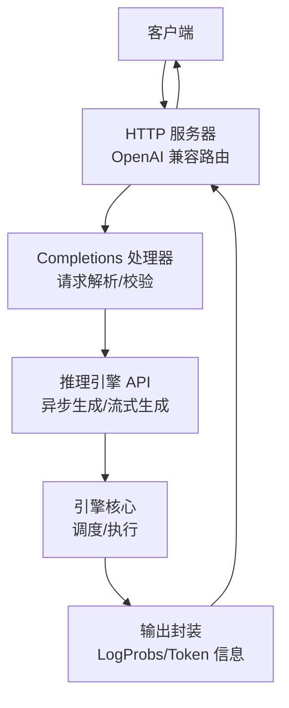
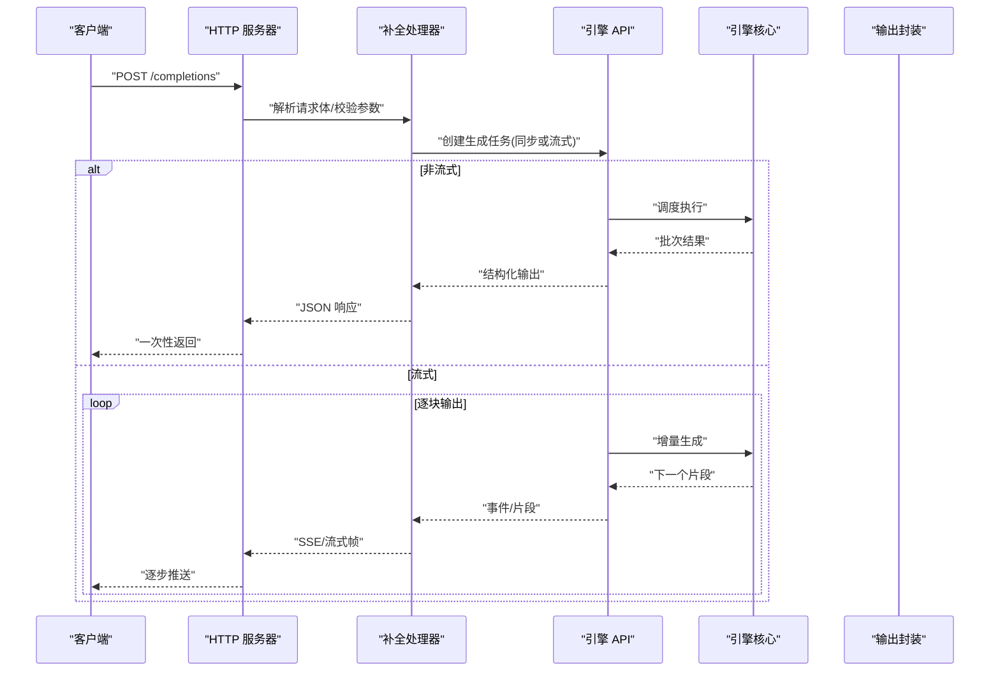
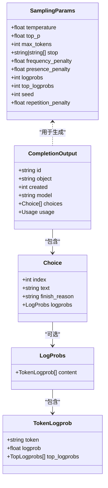
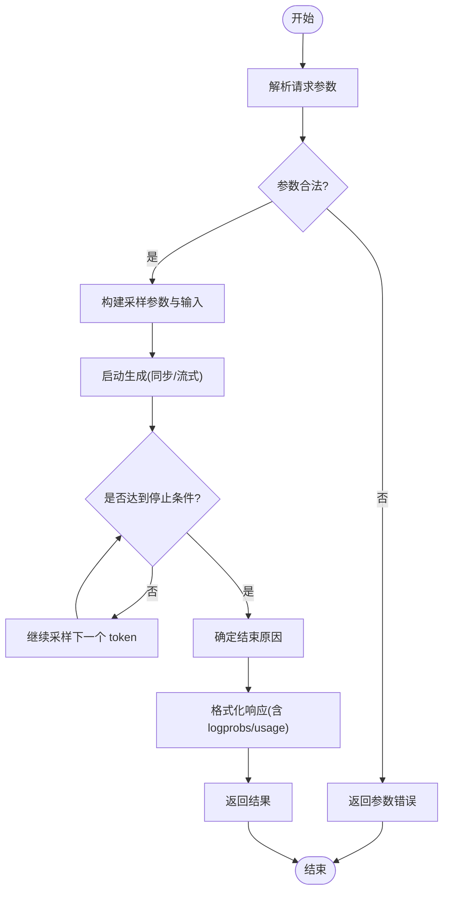
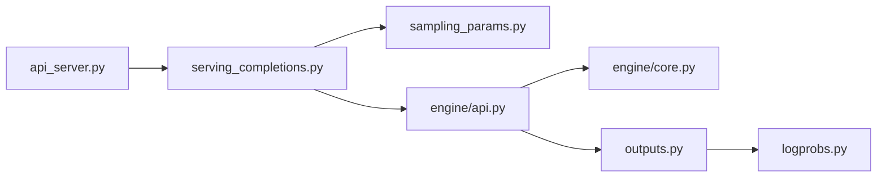

# 文本补全API

<cite>
**本文引用的文件**   
- [vllm/entrypoints/openai/api_server.py](file://vllm/entrypoints/openai/api_server.py)
- [vllm/entrypoints/openai/serving_completions.py](file://vllm/entrypoints/openai/serving_completions.py)
- [vllm/sampling_params.py](file://vllm/sampling_params.py)
- [vllm/engine/api.py](file://vllm/engine/api.py)
- [vllm/engine/core.py](file://vllm/engine/core.py)
- [vllm/outputs.py](file://vllm/outputs.py)
- [vllm/logprobs.py](file://vllm/logprobs.py)
- [tests/entrypoints/openai/test_serve_openai_api.py](file://tests/entrypoints/openai/test_serve_openai_api.py)
- [benchmarks/benchmark_serving.py](file://benchmarks/benchmark_serving.py)
</cite>

## 目录
1. [简介](#简介)
2. [项目结构](#项目结构)
3. [核心组件](#核心组件)
4. [架构总览](#架构总览)
5. [详细组件分析](#详细组件分析)
6. [依赖关系分析](#依赖关系分析)
7. [性能考量](#性能考量)
8. [故障排查指南](#故障排查指南)
9. [结论](#结论)
10. [附录](#附录)

## 简介
本文件面向使用 vLLM 提供的 OpenAI 兼容“文本补全”接口（POST /completions）的开发者，系统化说明请求参数、模型选择、采样控制、停止条件、频率与存在惩罚、响应格式、错误处理策略，以及批量处理与流式响应的实现方式。文档同时给出端到端调用时序图与关键数据结构的类图，帮助读者快速定位实现位置并理解内部流转。

## 项目结构
与 POST /completions 相关的核心代码主要分布在以下模块：
- OpenAI API 服务入口与路由注册
- 补全请求解析与校验
- 采样参数定义与验证
- 引擎调用与输出封装
- 日志概率与输出数据结构
- 测试与基准脚本

图表来源
- [vllm/entrypoints/openai/api_server.py](file://vllm/entrypoints/openai/api_server.py)
- [vllm/entrypoints/openai/serving_completions.py](file://vllm/entrypoints/openai/serving_completions.py)
- [vllm/engine/api.py](file://vllm/engine/api.py)
- [vllm/engine/core.py](file://vllm/engine/core.py)
- [vllm/outputs.py](file://vllm/outputs.py)

章节来源
- [vllm/entrypoints/openai/api_server.py](file://vllm/entrypoints/openai/api_server.py)
- [vllm/entrypoints/openai/serving_completions.py](file://vllm/entrypoints/openai/serving_completions.py)

## 核心组件
- 路由与服务层：负责接收 HTTP 请求、鉴权、限流、路由到具体处理器。
- 补全处理器：将 OpenAI 兼容的请求体转换为内部采样参数与输入对象，调用引擎进行生成。
- 采样参数：temperature、top_p、max_tokens、stop、frequency_penalty、presence_penalty、logprobs/top_logprobs、seed、repetition_penalty 等。
- 引擎 API：提供同步与异步（含流式）生成能力。
- 输出封装：将 token、text、logprobs、finish_reason 等统一为响应结构。

章节来源
- [vllm/entrypoints/openai/serving_completions.py](file://vllm/entrypoints/openai/serving_completions.py)
- [vllm/sampling_params.py](file://vllm/sampling_params.py)
- [vllm/engine/api.py](file://vllm/engine/api.py)
- [vllm/outputs.py](file://vllm/outputs.py)

## 架构总览
下图展示了从 HTTP 请求到模型推理再到返回响应的完整链路，包括流式与非流式两种路径。

图表来源
- [vllm/entrypoints/openai/api_server.py](file://vllm/entrypoints/openai/api_server.py)
- [vllm/entrypoints/openai/serving_completions.py](file://vllm/entrypoints/openai/serving_completions.py)
- [vllm/engine/api.py](file://vllm/engine/api.py)
- [vllm/engine/core.py](file://vllm/engine/core.py)

## 详细组件分析

### 端点规范：POST /completions
- 功能：基于给定 prompt 生成文本补全，支持多种采样策略与输出选项。
- 请求体关键字段（OpenAI 兼容）：
  - model：字符串，指定模型名称或路径。
  - prompt：字符串或字符串数组，单条或多条提示。
  - suffix：可选后缀（部分模型支持）。
  - temperature：浮点数，采样温度；默认值由服务端配置决定。
  - top_p：浮点数，核采样阈值。
  - n：整数，每个 prompt 生成的候选数。
  - stream：布尔值，是否启用流式响应。
  - max_tokens：整数，最大生成长度。
  - stop：字符串或字符串数组，停止序列。
  - frequency_penalty：浮点数，频率惩罚。
  - presence_penalty：浮点数，存在惩罚。
  - logprobs：整数，返回 top-k 词元对数概率的数量。
  - top_logprobs：整数，返回 top-k 词元及其对数概率（若 logprobs 开启）。
  - seed：整数，随机种子（可复现性）。
  - repetition_penalty：浮点数，重复惩罚。
  - response_format：可选，限制输出格式（如 JSON Schema）。
  - tools/tool_choice/function_call：工具调用相关字段（若启用工具调用）。
- 响应体关键字段：
  - id：请求唯一标识。
  - object：通常为字符串，表示对象类型。
  - created：时间戳。
  - model：实际使用的模型名。
  - choices：数组，包含若干候选项：
    - index：索引。
    - text：生成的文本。
    - finish_reason：结束原因（如 length、stop、tool_calls 等）。
    - logprobs：当开启时返回的词元级对数概率信息。
  - usage：统计信息（prompt_tokens、completion_tokens、total_tokens 等）。

章节来源
- [vllm/entrypoints/openai/serving_completions.py](file://vllm/entrypoints/openai/serving_completions.py)
- [vllm/outputs.py](file://vllm/outputs.py)

### 采样参数与行为
- temperature：控制采样的随机性；值越大越发散，越小越确定。
- top_p：累积概率阈值，截断低概率词元。
- max_tokens：限制生成长度，达到上限会触发 finish_reason=length。
- stop：匹配到任意停止序列即终止，触发 finish_reason=stop。
- frequency_penalty：降低已出现词元的概率，抑制重复。
- presence_penalty：鼓励新词元出现，减少停滞。
- logprobs/top_logprobs：返回词元级别的对数概率，便于分析与调试。
- seed：固定随机种子，保证相同输入产生相同输出。
- repetition_penalty：通用重复惩罚，与 frequency/presence 共同作用时的优先级由实现决定。

章节来源
- [vllm/sampling_params.py](file://vllm/sampling_params.py)

### 停止条件与结束原因
- 常见结束原因：
  - length：达到 max_tokens。
  - stop：命中 stop 序列。
  - tool_calls：工具调用完成（若启用）。
  - eos_token：遇到模型内置结束符。
- 多 stop 序列：按顺序检测，首个命中的序列决定结束。

章节来源
- [vllm/outputs.py](file://vllm/outputs.py)

### 频率惩罚与存在惩罚机制
- frequency_penalty：对历史中出现过的词元施加负向偏置，数值越大抑制越强。
- presence_penalty：只要词元在上下文中出现过就施加偏置，鼓励多样性。
- 两者叠加效果：通常先应用 presence，再应用 frequency，具体顺序以实现为准。
- 与 repetition_penalty 的关系：后者作用于更通用的重复抑制，三者可同时使用但需避免过度惩罚导致退化。

章节来源
- [vllm/sampling_params.py](file://vllm/sampling_params.py)

### 响应结构与 LogProbs
- choices[].text：生成的文本片段或完整结果。
- choices[].logprobs：当开启时，包含 token、logprob、top_logprobs 等信息。
- usage：统计 prompt/completion/total tokens，便于计费与监控。

章节来源
- [vllm/outputs.py](file://vllm/outputs.py)
- [vllm/logprobs.py](file://vllm/logprobs.py)

### 批量处理与并发
- 批量输入：prompt 可为字符串数组，服务端会将多个 prompt 合并为批次执行，提升吞吐。
- n 参数：同一 prompt 生成多个候选，内部通过并行采样或多次解码实现。
- 流式响应：stream=true 时，服务端按 token 或小块推送，降低首字延迟。

章节来源
- [vllm/entrypoints/openai/serving_completions.py](file://vllm/entrypoints/openai/serving_completions.py)
- [vllm/engine/api.py](file://vllm/engine/api.py)

### 流式响应实现
- 协议：通常采用 SSE（Server-Sent Events）或自定义分块传输。
- 事件：每次增量生成推送一个事件，包含文本片段与可能的中间状态。
- 客户端：需要按事件顺序拼接文本，并在收到结束事件后处理最终结果。

章节来源
- [vllm/entrypoints/openai/api_server.py](file://vllm/entrypoints/openai/api_server.py)
- [vllm/entrypoints/openai/serving_completions.py](file://vllm/entrypoints/openai/serving_completions.py)

### 错误处理策略
- 参数校验失败：返回明确的错误码与消息（如非法 temperature、超出 max_tokens 范围）。
- 模型加载失败：返回 5xx 错误，附带诊断信息。
- 资源不足（显存/内存）：返回限流或重试建议，客户端应退避重试。
- 超时：根据服务端配置返回超时错误，客户端应设置合理超时与重试策略。

章节来源
- [vllm/entrypoints/openai/api_server.py](file://vllm/entrypoints/openai/api_server.py)
- [vllm/entrypoints/openai/serving_completions.py](file://vllm/entrypoints/openai/serving_completions.py)

### 类图：采样参数与输出结构

图表来源
- [vllm/sampling_params.py](file://vllm/sampling_params.py)
- [vllm/outputs.py](file://vllm/outputs.py)
- [vllm/logprobs.py](file://vllm/logprobs.py)

### 流程图：采样与停止逻辑

图表来源
- [vllm/entrypoints/openai/serving_completions.py](file://vllm/entrypoints/openai/serving_completions.py)
- [vllm/sampling_params.py](file://vllm/sampling_params.py)
- [vllm/outputs.py](file://vllm/outputs.py)

## 依赖关系分析
- 路由层依赖补全处理器，处理器依赖引擎 API 与采样参数定义。
- 引擎核心负责调度与执行，输出封装统一返回结构。
- 日志概率模块提供词元级概率信息。

图表来源
- [vllm/entrypoints/openai/api_server.py](file://vllm/entrypoints/openai/api_server.py)
- [vllm/entrypoints/openai/serving_completions.py](file://vllm/entrypoints/openai/serving_completions.py)
- [vllm/sampling_params.py](file://vllm/sampling_params.py)
- [vllm/engine/api.py](file://vllm/engine/api.py)
- [vllm/engine/core.py](file://vllm/engine/core.py)
- [vllm/outputs.py](file://vllm/outputs.py)
- [vllm/logprobs.py](file://vllm/logprobs.py)

章节来源
- [vllm/entrypoints/openai/api_server.py](file://vllm/entrypoints/openai/api_server.py)
- [vllm/entrypoints/openai/serving_completions.py](file://vllm/entrypoints/openai/serving_completions.py)
- [vllm/sampling_params.py](file://vllm/sampling_params.py)
- [vllm/engine/api.py](file://vllm/engine/api.py)
- [vllm/engine/core.py](file://vllm/engine/core.py)
- [vllm/outputs.py](file://vllm/outputs.py)
- [vllm/logprobs.py](file://vllm/logprobs.py)

## 性能考量
- 批处理：尽量使用数组 prompt 与合适的 batch size，提高 GPU 利用率。
- 流式响应：降低首字延迟，适合交互式场景。
- 采样参数调优：temperature 与 top_p 的组合影响质量与速度；过高的 temperature 可能增加解码步数。
- 缓存与复用：利用前缀缓存（若启用）减少重复计算。
- 资源监控：关注显存占用与队列长度，动态调整并发与超时。

章节来源
- [benchmarks/benchmark_serving.py](file://benchmarks/benchmark_serving.py)

## 故障排查指南
- 常见问题：
  - 参数非法：检查 temperature、top_p、max_tokens、stop 等取值范围。
  - 模型未找到：确认 model 名称或路径正确且已加载。
  - 显存不足：减小 batch size、max_tokens 或并发度。
  - 流式不生效：确认 stream=true 且客户端正确处理事件。
- 调试建议：
  - 开启详细日志，观察请求解析与引擎调用过程。
  - 使用最小化示例复现问题，逐步添加参数定位。
  - 参考测试用例对比请求与响应结构。

章节来源
- [tests/entrypoints/openai/test_serve_openai_api.py](file://tests/entrypoints/openai/test_serve_openai_api.py)

## 结论
POST /completions 提供了灵活而强大的文本补全能力，覆盖丰富的采样控制与输出选项。通过合理的批处理、流式响应与参数调优，可在保证质量的同时获得高吞吐与低延迟。建议结合日志与监控持续优化，确保稳定可靠的在线服务。

## 附录
- 请求示例（概念性描述）：
  - 基本补全：model、prompt、max_tokens、temperature、top_p、stop。
  - 带 logprobs：logprobs=5，top_logprobs=3。
  - 流式：stream=true，客户端按事件拼接。
  - 批量：prompt 为字符串数组，n=2 生成多个候选。
- 响应示例（概念性描述）：
  - 非流式：一次性返回 choices 数组与 usage。
  - 流式：多次推送事件，最后一条包含 finish_reason 与最终统计。

[本节为概念性说明，不直接分析具体文件]