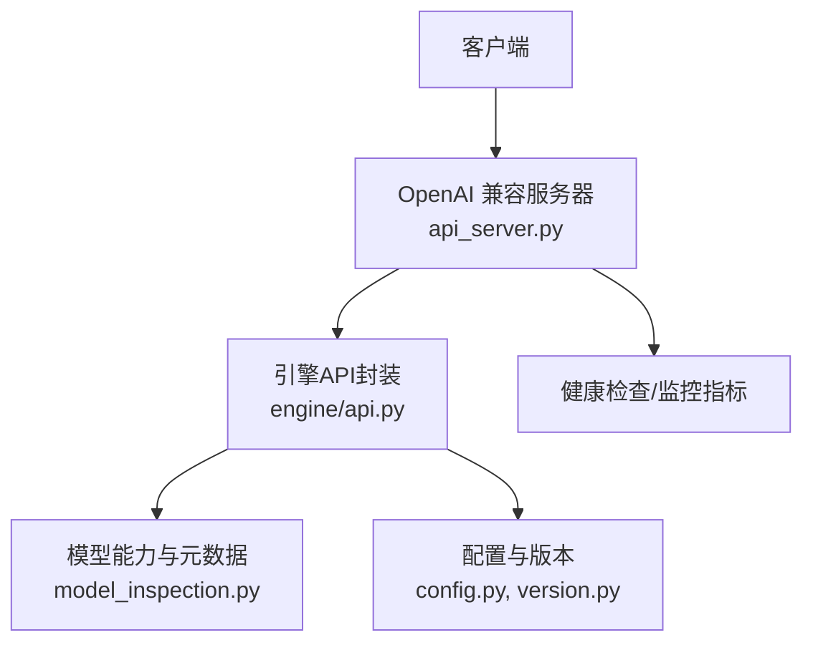
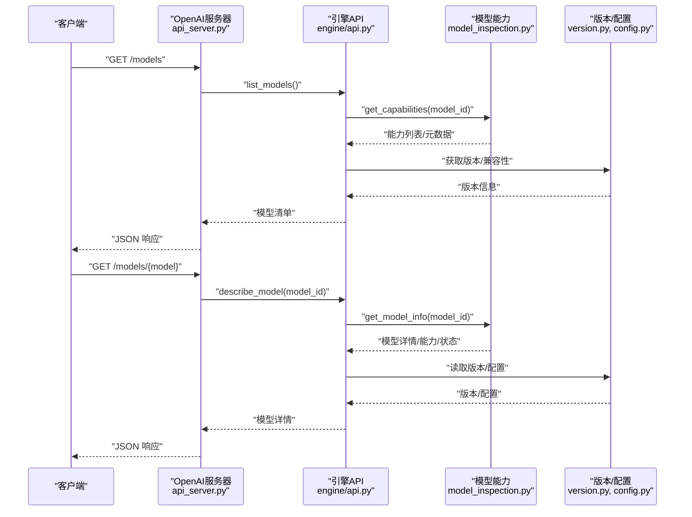
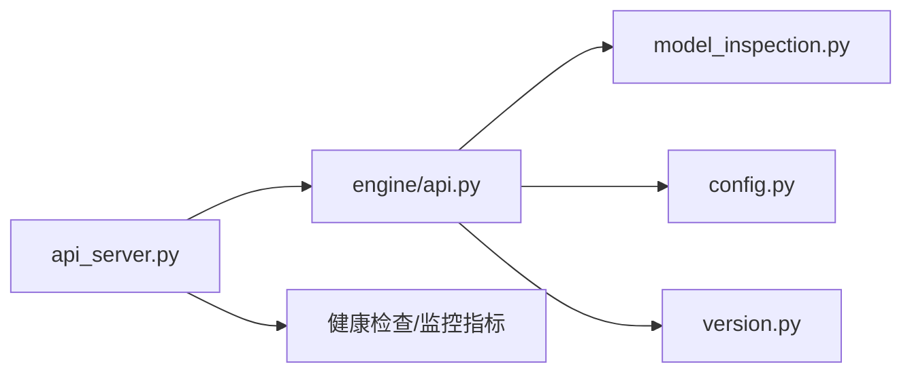
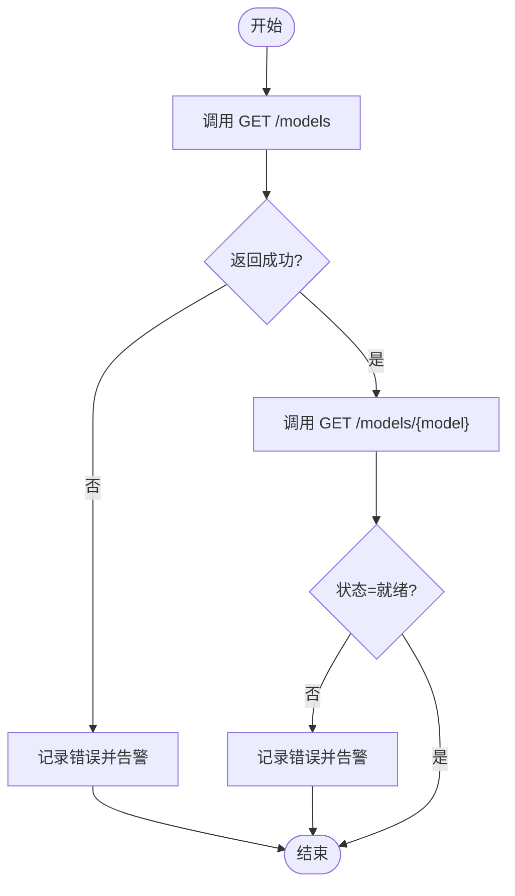
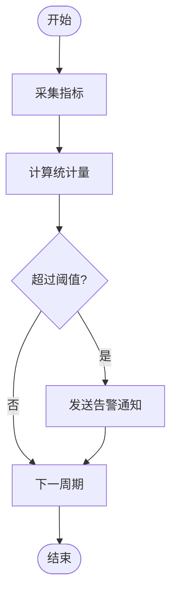
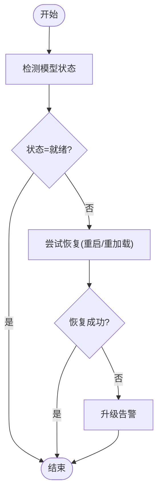

# 模型管理API

<cite>
**本文引用的文件**   
- [vllm/entrypoints/openai/api_server.py](file://vllm/entrypoints/openai/api_server.py)
- [vllm/engine/api.py](file://vllm/engine/api.py)
- [vllm/model_inspection.py](file://vllm/model_inspection.py)
- [vllm/config.py](file://vllm/config.py)
- [vllm/version.py](file://vllm/version.py)
- [examples/applications/api_server/main.py](file://examples/applications/api_server/main.py)
- [tests/entrypoints/openai/test_api_server.py](file://tests/entrypoints/openai/test_api_server.py)
</cite>

## 目录
1. [简介](#简介)
2. [项目结构](#项目结构)
3. [核心组件](#核心组件)
4. [架构总览](#架构总览)
5. [详细组件分析](#详细组件分析)
6. [依赖关系分析](#依赖关系分析)
7. [性能与可观测性](#性能与可观测性)
8. [故障排查指南](#故障排查指南)
9. [结论](#结论)
10. [附录：API规范与脚本示例](#附录api规范与脚本示例)

## 简介
本文件面向模型管理与服务化运维，聚焦 vLLM 的 OpenAI 兼容 API 中的“模型管理”能力。内容涵盖：
- 模型信息查询：GET /models、GET /models/{model}
- 能力列表与元数据：模型能力、版本兼容性、部署状态
- 权限验证与访问控制
- 资源状态监控与健康检查
- 模型热重载、动态加载与卸载（基于 vLLM 引擎能力）
- 自动化脚本示例：健康检查、性能监控、故障恢复

说明：
- 本仓库为 vLLM 源码工程，OpenAI 兼容接口由 entrypoints/openai 提供；模型注册、能力与版本信息来源于 model_inspection 与 config/version 模块。
- “模型热重载/动态加载/卸载”在 vLLM 中通常通过重新初始化引擎或切换模型实例实现，具体行为取决于部署方式（单进程/多进程/Ray）。

## 项目结构
与模型管理API直接相关的代码主要位于以下位置：
- OpenAI 兼容服务端入口与路由定义：vllm/entrypoints/openai/api_server.py
- 引擎对外API封装：vllm/engine/api.py
- 模型能力与元数据查询：vllm/model_inspection.py
- 配置与版本信息：vllm/config.py、vllm/version.py
- 示例应用启动：examples/applications/api_server/main.py
- 相关测试用例：tests/entrypoints/openai/test_api_server.py

图表来源
- [vllm/entrypoints/openai/api_server.py](file://vllm/entrypoints/openai/api_server.py)
- [vllm/engine/api.py](file://vllm/engine/api.py)
- [vllm/model_inspection.py](file://vllm/model_inspection.py)
- [vllm/config.py](file://vllm/config.py)
- [vllm/version.py](file://vllm/version.py)

章节来源
- [vllm/entrypoints/openai/api_server.py](file://vllm/entrypoints/openai/api_server.py)
- [vllm/engine/api.py](file://vllm/engine/api.py)
- [vllm/model_inspection.py](file://vllm/model_inspection.py)
- [vllm/config.py](file://vllm/config.py)
- [vllm/version.py](file://vllm/version.py)
- [examples/applications/api_server/main.py](file://examples/applications/api_server/main.py)
- [tests/entrypoints/openai/test_api_server.py](file://tests/entrypoints/openai/test_api_server.py)

## 核心组件
- OpenAI 兼容服务器（api_server.py）
  - 负责HTTP路由、请求解析、鉴权、限流、日志与指标上报
  - 暴露 /models、/models/{model} 等端点，返回模型清单与详情
- 引擎API（engine/api.py）
  - 封装模型加载、能力探测、上下文管理、并发调度
  - 提供查询模型能力、版本、运行态状态的内部接口
- 模型能力与元数据（model_inspection.py）
  - 统一抽象模型能力（如文本生成、视觉、工具调用等）
  - 输出标准化能力列表与元数据格式
- 配置与版本（config.py, version.py）
  - 提供运行时配置项、默认值、版本字符串与兼容性矩阵

章节来源
- [vllm/entrypoints/openai/api_server.py](file://vllm/entrypoints/openai/api_server.py)
- [vllm/engine/api.py](file://vllm/engine/api.py)
- [vllm/model_inspection.py](file://vllm/model_inspection.py)
- [vllm/config.py](file://vllm/config.py)
- [vllm/version.py](file://vllm/version.py)

## 架构总览
下图展示从客户端到模型元数据查询的关键调用链，以及健康检查与监控指标的采集路径。

图表来源
- [vllm/entrypoints/openai/api_server.py](file://vllm/entrypoints/openai/api_server.py)
- [vllm/engine/api.py](file://vllm/engine/api.py)
- [vllm/model_inspection.py](file://vllm/model_inspection.py)
- [vllm/config.py](file://vllm/config.py)
- [vllm/version.py](file://vllm/version.py)

## 详细组件分析

### OpenAI 兼容服务器（/models 与 /models/{model}）
- GET /models
  - 作用：返回当前服务已加载/可用的模型清单
  - 输入：无
  - 输出：模型ID列表及基础元数据（名称、能力标签、版本等）
  - 鉴权：按服务配置的鉴权策略校验（如API Key、租户隔离）
  - 错误码：401/403（鉴权失败）、500（内部错误）
- GET /models/{model}
  - 作用：返回指定模型的详细信息
  - 输入：路径参数 model（模型ID）
  - 输出：模型能力列表、元数据、版本兼容性、部署状态
  - 鉴权：同 /models
  - 错误码：404（模型不存在）、500（内部错误）

章节来源
- [vllm/entrypoints/openai/api_server.py](file://vllm/entrypoints/openai/api_server.py)
- [tests/entrypoints/openai/test_api_server.py](file://tests/entrypoints/openai/test_api_server.py)

### 引擎API（模型能力与状态）
- list_models()
  - 聚合已加载模型ID与基础信息，供 /models 使用
- describe_model(model_id)
  - 查询模型能力、元数据、运行态状态（就绪/加载中/异常）
- 能力探测
  - 基于 model_inspection 的能力枚举，返回标准化的功能集合
- 版本与兼容性
  - 读取版本信息与配置，判断模型与后端能力的兼容性

章节来源
- [vllm/engine/api.py](file://vllm/engine/api.py)
- [vllm/model_inspection.py](file://vllm/model_inspection.py)
- [vllm/config.py](file://vllm/config.py)
- [vllm/version.py](file://vllm/version.py)

### 模型能力与元数据（model_inspection）
- 能力类型
  - 文本生成、多模态（图像/音频）、工具调用、结构化输出等
- 元数据字段
  - 模型ID、名称、厂商、版本、能力标签、支持的最大上下文长度、量化/加速特性
- 兼容性矩阵
  - 与硬件后端（CUDA/ROCm/CPU/XPU）、编译选项、推理后端的兼容性

章节来源
- [vllm/model_inspection.py](file://vllm/model_inspection.py)
- [vllm/config.py](file://vllm/config.py)
- [vllm/version.py](file://vllm/version.py)

### 配置与版本（config, version）
- 配置项
  - 模型加载路径、并行度、KV缓存策略、显存优化开关
- 版本信息
  - 库版本、引擎版本、兼容的最小/最大后端版本
- 环境变量
  - 用于覆盖默认配置、启用调试与诊断

章节来源
- [vllm/config.py](file://vllm/config.py)
- [vllm/version.py](file://vllm/version.py)

## 依赖关系分析
- 路由层依赖引擎API进行模型查询与状态获取
- 引擎API依赖 model_inspection 获取能力与元数据
- 版本与配置模块被多处引用，确保一致的版本与兼容性判断
- 健康检查与监控指标由服务器层统一收集并暴露

图表来源
- [vllm/entrypoints/openai/api_server.py](file://vllm/entrypoints/openai/api_server.py)
- [vllm/engine/api.py](file://vllm/engine/api.py)
- [vllm/model_inspection.py](file://vllm/model_inspection.py)
- [vllm/config.py](file://vllm/config.py)
- [vllm/version.py](file://vllm/version.py)

章节来源
- [vllm/entrypoints/openai/api_server.py](file://vllm/entrypoints/openai/api_server.py)
- [vllm/engine/api.py](file://vllm/engine/api.py)
- [vllm/model_inspection.py](file://vllm/model_inspection.py)
- [vllm/config.py](file://vllm/config.py)
- [vllm/version.py](file://vllm/version.py)

## 性能与可观测性
- 指标采集
  - 请求QPS、延迟分布、GPU/内存占用、KV缓存命中率
- 健康检查
  - 进程存活、端口可达、模型就绪状态、依赖服务可用性
- 监控建议
  - 结合Prometheus/Grafana采集指标，设置告警阈值
  - 对模型加载耗时、能力探测耗时进行追踪

[本节为通用指导，不直接分析具体文件]

## 故障排查指南
- 常见问题
  - 404：模型ID不存在或未加载
  - 500：模型能力探测失败、版本不兼容、后端不可用
- 排查步骤
  - 检查 /models 是否返回预期清单
  - 查看 /models/{model} 的状态字段是否为“就绪”
  - 核对版本与兼容性矩阵
  - 检查日志与指标（GPU/内存/KV缓存）
- 恢复策略
  - 重启服务或重新加载模型
  - 调整配置（并行度、显存上限）
  - 回滚至兼容版本

章节来源
- [tests/entrypoints/openai/test_api_server.py](file://tests/entrypoints/openai/test_api_server.py)

## 结论
- vLLM 的 OpenAI 兼容接口提供了完善的模型管理能力，包括模型清单、详情、能力与版本信息
- 通过 engine/api 与 model_inspection 的组合，可实现稳定的能力探测与状态查询
- 健康检查与监控是保障服务稳定性的关键，建议纳入CI/CD与生产运维流程

[本节为总结，不直接分析具体文件]

## 附录：API规范与脚本示例

### API 规范摘要
- GET /models
  - 描述：列出可用模型
  - 成功响应：包含模型ID、名称、能力标签、版本等
  - 错误：401/403/500
- GET /models/{model}
  - 描述：查询模型详情
  - 成功响应：能力列表、元数据、版本兼容性、部署状态
  - 错误：404/500

[本节为规范摘要，不直接分析具体文件]

### 健康检查脚本示例（概念性）
- 目标：周期性检查服务健康与模型就绪状态
- 步骤：
  - 调用 /models 获取清单
  - 调用 /models/{model} 检查状态字段
  - 若状态非“就绪”，触发告警或自动恢复（重启/重加载）
- 注意：以下为概念性流程，实际实现需根据部署环境调整

[本图为概念性流程图，不映射具体代码文件]

### 性能监控脚本示例（概念性）
- 目标：采集QPS、延迟、GPU/内存、KV缓存命中率
- 步骤：
  - 定期抓取指标（Prometheus/Grafana）
  - 计算分位数延迟与吞吐
  - 设置阈值告警（如延迟>阈值、GPU利用率>阈值）
- 注意：以下为概念性流程，实际实现需根据监控系统对接

[本图为概念性流程图，不映射具体代码文件]

### 故障恢复脚本示例（概念性）
- 目标：当模型状态异常时自动恢复
- 步骤：
  - 检测 /models/{model} 状态
  - 若异常，尝试重启服务或重新加载模型
  - 重试N次，仍失败则升级告警
- 注意：以下为概念性流程，实际实现需考虑幂等性与安全

[本图为概念性流程图，不映射具体代码文件]