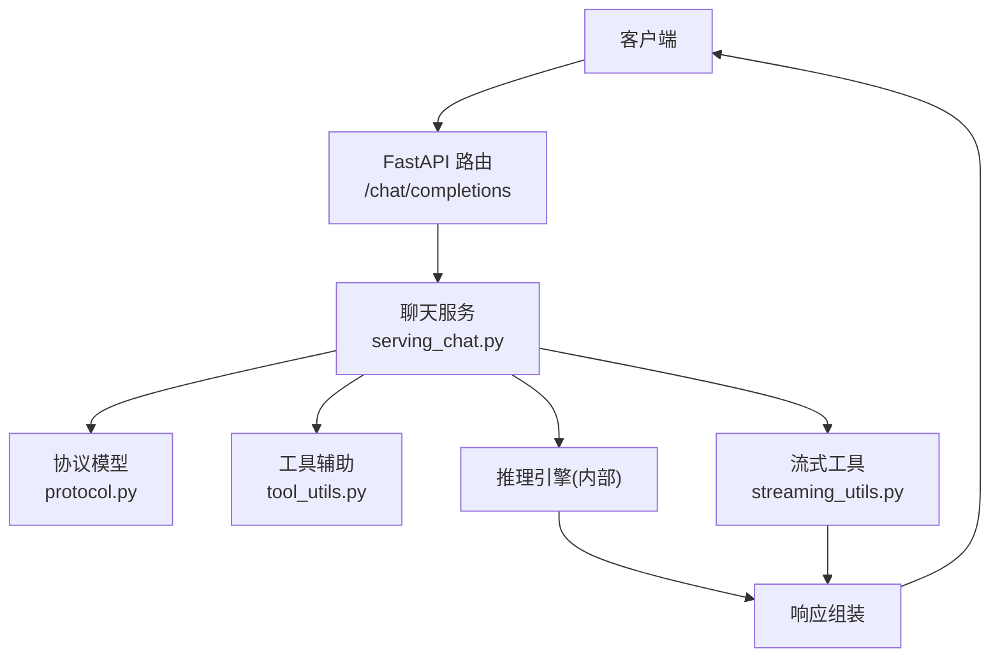
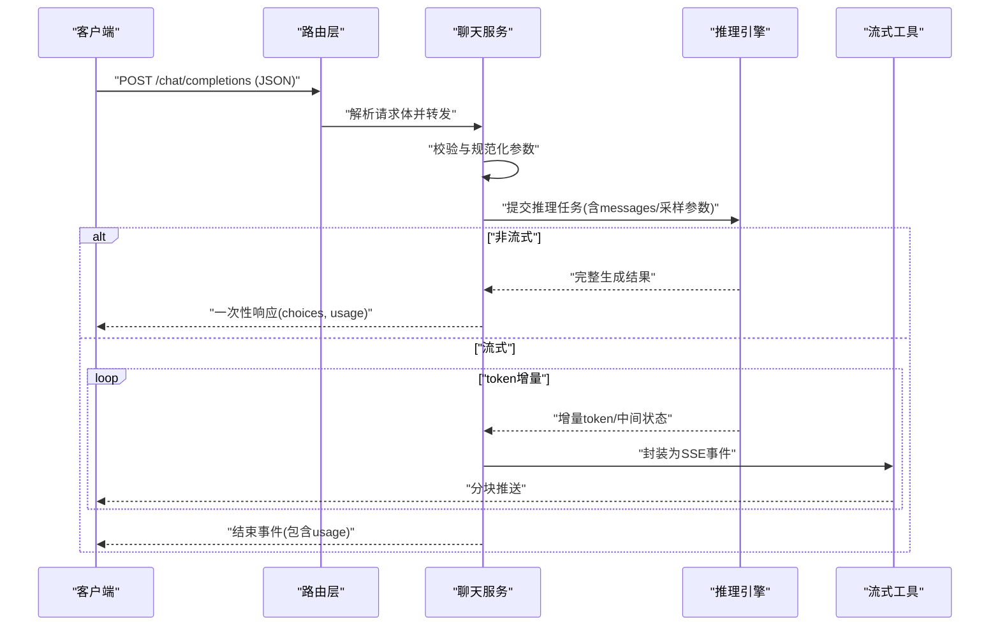
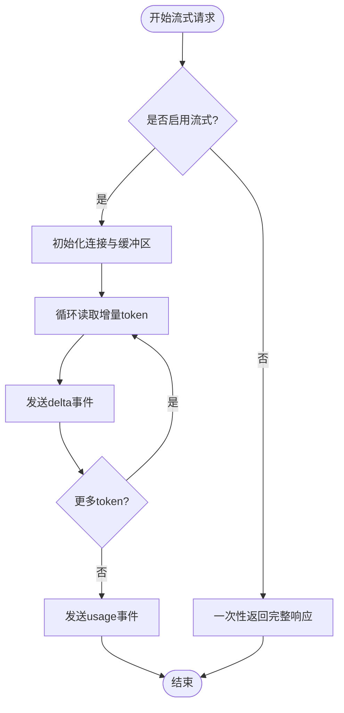
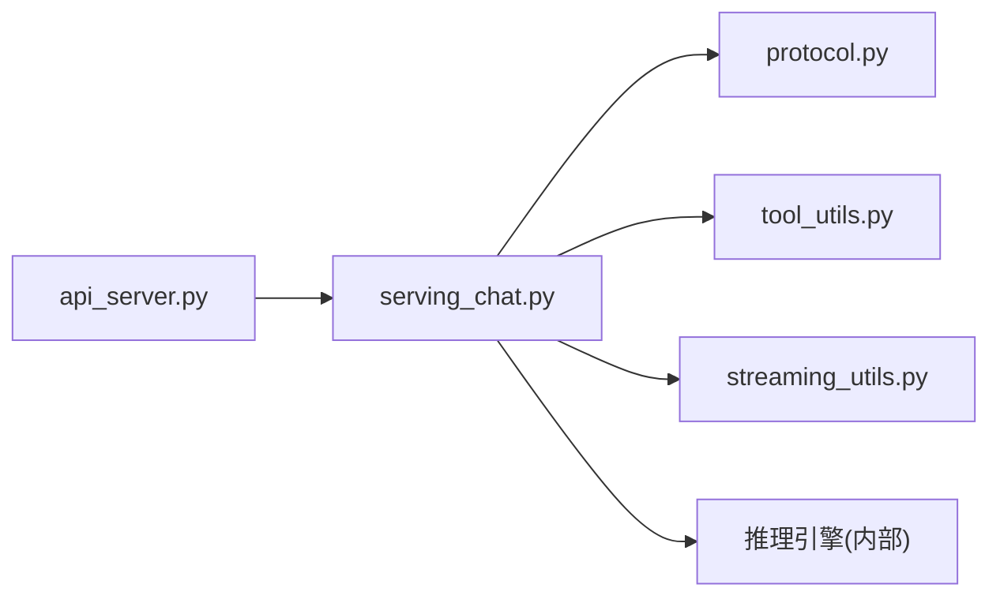

# 聊天完成API

<cite>
**本文引用的文件**   
- [vllm/entrypoints/openai/api_server.py](file://vllm/entrypoints/openai/api_server.py)
- [vllm/entrypoints/openai/serving_chat.py](file://vllm/entrypoints/openai/serving_chat.py)
- [vllm/entrypoints/openai/serving_completions.py](file://vllm/entrypoints/openai/serving_completions.py)
- [vllm/entrypoints/openai/protocol.py](file://vllm/entrypoints/openai/protocol.py)
- [vllm/entrypoints/openai/tool_utils.py](file://vllm/entrypoints/openai/tool_utils.py)
- [vllm/entrypoints/openai/streaming_utils.py](file://vllm/entrypoints/openai/streaming_utils.py)
- [examples/reasoning/openai_chat_completion_with_reasoning_streaming.py](file://examples/reasoning/openai_chat_completion_with_reasoning_streaming.py)
- [examples/tool_calling/openai_chat_completion_client_with_tools.py](file://examples/tool_calling/openai_chat_completion_client_with_tools.py)
</cite>

## 目录
1. [简介](#简介)
2. [项目结构](#项目结构)
3. [核心组件](#核心组件)
4. [架构总览](#架构总览)
5. [详细组件分析](#详细组件分析)
6. [依赖关系分析](#依赖关系分析)
7. [性能考量](#性能考量)
8. [故障排查指南](#故障排查指南)
9. [结论](#结论)
10. [附录](#附录)

## 简介
本文件为 vLLM 的 OpenAI 兼容“聊天完成”API（POST /chat/completions）的详细规范与实现说明。内容涵盖请求体结构、响应格式、流式响应处理、消息格式、系统提示词、采样参数（温度、最大生成长度等）、JSON Schema、错误处理与状态码，以及 Python 客户端示例与最佳实践。

## 项目结构
vLLM 的 OpenAI 兼容接口位于 entrypoints/openai 模块中，主要职责如下：
- API 路由与服务启动：定义 /chat/completions 端点并挂载到 FastAPI 应用
- 请求协议与响应模型：使用 Pydantic 定义请求/响应结构
- 聊天服务编排：解析请求、构造内部输入、调用推理引擎、组装响应
- 工具调用与结构化输出：支持函数调用、工具描述、结构化约束
- 流式响应：基于 SSE 的分块响应生成与传输

**图示来源** 
- [vllm/entrypoints/openai/api_server.py](file://vllm/entrypoints/openai/api_server.py)
- [vllm/entrypoints/openai/serving_chat.py](file://vllm/entrypoints/openai/serving_chat.py)
- [vllm/entrypoints/openai/protocol.py](file://vllm/entrypoints/openai/protocol.py)
- [vllm/entrypoints/openai/tool_utils.py](file://vllm/entrypoints/openai/tool_utils.py)
- [vllm/entrypoints/openai/streaming_utils.py](file://vllm/entrypoints/openai/streaming_utils.py)

**章节来源**
- [vllm/entrypoints/openai/api_server.py](file://vllm/entrypoints/openai/api_server.py)
- [vllm/entrypoints/openai/serving_chat.py](file://vllm/entrypoints/openai/serving_chat.py)
- [vllm/entrypoints/openai/protocol.py](file://vllm/entrypoints/openai/protocol.py)

## 核心组件
- 路由层：注册 POST /chat/completions，接收 JSON 请求体，返回同步或流式响应
- 协议层：Pydantic 模型定义 messages、model、stream、temperature、max_tokens、top_p、n、stop、presence_penalty、frequency_penalty、logprobs、top_logprobs、response_format、tools、tool_choice、parallel_tool_calls、seed、user、extra_body 等字段
- 聊天服务层：校验与规范化输入，构建内部请求对象，调用推理引擎，处理工具调用与结构化输出，组装 choices、usage、finish_reason 等
- 流式层：将 token 增量以事件流形式推送给客户端
- 工具辅助层：解析 tools/tool_choice、函数签名、参数校验、结构化输出约束

**章节来源**
- [vllm/entrypoints/openai/protocol.py](file://vllm/entrypoints/openai/protocol.py)
- [vllm/entrypoints/openai/serving_chat.py](file://vllm/entrypoints/openai/serving_chat.py)
- [vllm/entrypoints/openai/tool_utils.py](file://vllm/entrypoints/openai/tool_utils.py)
- [vllm/entrypoints/openai/streaming_utils.py](file://vllm/entrypoints/openai/streaming_utils.py)

## 架构总览
聊天完成请求从客户端进入 FastAPI 路由，交由聊天服务进行参数校验与上下文构建，随后调用推理引擎执行预填充与解码。若启用流式模式，通过流式工具按 token 增量推送；否则一次性返回完整结果。工具调用与结构化输出在响应组装阶段统一处理。

**图示来源** 
- [vllm/entrypoints/openai/api_server.py](file://vllm/entrypoints/openai/api_server.py)
- [vllm/entrypoints/openai/serving_chat.py](file://vllm/entrypoints/openai/serving_chat.py)
- [vllm/entrypoints/openai/streaming_utils.py](file://vllm/entrypoints/openai/streaming_utils.py)

## 详细组件分析

### 端点与路由
- 方法：POST
- 路径：/chat/completions
- 内容类型：application/json
- 功能：根据 messages 数组与 model 参数生成对话回复，支持流式与非流式两种模式

**章节来源**
- [vllm/entrypoints/openai/api_server.py](file://vllm/entrypoints/openai/api_server.py)

### 请求体规范（messages、model、stream 等）
- model：字符串，指定要使用的模型名称
- messages：数组，元素为消息对象，包含 role 与 content 字段
  - role：system、user、assistant、function（或 tool）等
  - content：字符串或对象（当存在工具调用时）
- stream：布尔值，是否启用流式响应
- temperature：浮点数，控制随机性
- top_p：浮点数，核采样阈值
- n：整数，生成候选数
- max_tokens：整数，最大生成长度
- stop：字符串或字符串数组，停止条件
- presence_penalty/frequency_penalty：浮点数，惩罚项
- logprobs/top_logprobs：布尔/整数，开启日志概率与Top-K
- response_format：对象，用于结构化输出（如 JSON Schema）
- tools：数组，工具描述（函数签名、参数Schema等）
- tool_choice：字符串或对象，强制或自动选择工具
- parallel_tool_calls：布尔，是否允许并行工具调用
- seed：整数，随机种子
- user：字符串，用户标识
- extra_body：任意扩展字段

**章节来源**
- [vllm/entrypoints/openai/protocol.py](file://vllm/entrypoints/openai/protocol.py)
- [vllm/entrypoints/openai/serving_chat.py](file://vllm/entrypoints/openai/serving_chat.py)

### 消息格式（role、content）
- role：
  - system：系统提示词，设定模型行为与约束
  - user：用户输入
  - assistant：助手回复
  - function/tool：工具调用结果或函数返回
- content：
  - 文本字符串
  - 当涉及工具调用时，可能包含函数名与参数对象

**章节来源**
- [vllm/entrypoints/openai/protocol.py](file://vllm/entrypoints/openai/protocol.py)
- [vllm/entrypoints/openai/tool_utils.py](file://vllm/entrypoints/openai/tool_utils.py)

### 系统提示词设置
- 通过 messages 中的第一条 role=system 的消息设置
- 可用于角色设定、输出格式约束、安全策略等

**章节来源**
- [vllm/entrypoints/openai/serving_chat.py](file://vllm/entrypoints/openai/serving_chat.py)

### 采样参数控制（temperature、top_p、max_tokens 等）
- temperature：影响输出的多样性，值越高越随机
- top_p：累积概率阈值，限制候选集大小
- max_tokens：限制生成长度，避免过长输出
- stop：提前终止条件
- presence_penalty/frequency_penalty：抑制重复与鼓励新话题

**章节来源**
- [vllm/entrypoints/openai/protocol.py](file://vllm/entrypoints/openai/protocol.py)
- [vllm/entrypoints/openai/serving_chat.py](file://vllm/entrypoints/openai/serving_chat.py)

### 响应格式（choices、usage、finish_reason）
- choices：数组，每个元素包含 index、message（role/content）、finish_reason
- usage：统计信息，包括 prompt_tokens、completion_tokens、total_tokens
- finish_reason：停止原因（如 length、stop、tool_calls 等）

**章节来源**
- [vllm/entrypoints/openai/protocol.py](file://vllm/entrypoints/openai/protocol.py)
- [vllm/entrypoints/openai/serving_chat.py](file://vllm/entrypoints/openai/serving_chat.py)

### 流式响应处理（SSE）
- 当 stream=true 时，服务端按 token 增量推送事件
- 事件类型通常包含 delta（增量消息片段）与 usage（最终统计）
- 客户端需维护累积状态，拼接完整回复

**图示来源** 
- [vllm/entrypoints/openai/streaming_utils.py](file://vllm/entrypoints/openai/streaming_utils.py)
- [vllm/entrypoints/openai/serving_chat.py](file://vllm/entrypoints/openai/serving_chat.py)

**章节来源**
- [vllm/entrypoints/openai/streaming_utils.py](file://vllm/entrypoints/openai/streaming_utils.py)
- [vllm/entrypoints/openai/serving_chat.py](file://vllm/entrypoints/openai/serving_chat.py)

### 工具调用与结构化输出
- tools：声明可用函数及其参数Schema
- tool_choice：控制是否强制调用工具或自动选择
- parallel_tool_calls：允许一次请求中调用多个工具
- response_format：可指定 JSON Schema 约束输出结构

**章节来源**
- [vllm/entrypoints/openai/tool_utils.py](file://vllm/entrypoints/openai/tool_utils.py)
- [vllm/entrypoints/openai/protocol.py](file://vllm/entrypoints/openai/protocol.py)

### JSON Schema 定义（请求体）
以下为请求体的关键结构与类型说明（概念性描述，具体字段以协议模型为准）：
- 根对象：
  - model: string
  - messages: array of message objects
  - stream: boolean
  - temperature: number
  - top_p: number
  - n: integer
  - max_tokens: integer
  - stop: string | array of strings
  - presence_penalty: number
  - frequency_penalty: number
  - logprobs: boolean
  - top_logprobs: integer
  - response_format: object (可选)
  - tools: array of tool definitions (可选)
  - tool_choice: string | object (可选)
  - parallel_tool_calls: boolean (可选)
  - seed: integer (可选)
  - user: string (可选)
  - extra_body: object (可选)
- message 对象：
  - role: enum("system","user","assistant","function"/"tool")
  - content: string | object
- tool 定义：
  - type: "function"
  - function: { name, description, parameters(JSON Schema) }

注意：以上为概念性 Schema 描述，实际字段与约束请参考协议模型定义。

**章节来源**
- [vllm/entrypoints/openai/protocol.py](file://vllm/entrypoints/openai/protocol.py)
- [vllm/entrypoints/openai/tool_utils.py](file://vllm/entrypoints/openai/tool_utils.py)

### 错误处理机制与状态码
- 常见状态码：
  - 200：成功
  - 400：请求体无效或缺少必填字段
  - 401/403：认证失败（如未配置鉴权）
  - 404：端点不存在
  - 429：限流
  - 500：服务器内部错误（模型加载失败、引擎异常等）
- 错误体：包含 error.code、error.message、error.type 等字段
- 流式错误：在事件流中返回错误事件，客户端应中断处理

**章节来源**
- [vllm/entrypoints/openai/api_server.py](file://vllm/entrypoints/openai/api_server.py)
- [vllm/entrypoints/openai/serving_chat.py](file://vllm/entrypoints/openai/serving_chat.py)

### Python 客户端示例与最佳实践
- 基本用法：构造 messages 数组，设置 model 与 temperature，获取 choices[0].message.content
- 流式用法：迭代事件流，累积 delta.content，最后汇总 usage
- 工具调用：提供 tools 与 tool_choice，处理 assistant 消息中的 tool_calls 字段
- 结构化输出：使用 response_format 指定 JSON Schema，确保输出符合预期

参考示例文件：
- 流式推理示例：[examples/reasoning/openai_chat_completion_with_reasoning_streaming.py](file://examples/reasoning/openai_chat_completion_with_reasoning_streaming.py)
- 工具调用示例：[examples/tool_calling/openai_chat_completion_client_with_tools.py](file://examples/tool_calling/openai_chat_completion_client_with_tools.py)

**章节来源**
- [examples/reasoning/openai_chat_completion_with_reasoning_streaming.py](file://examples/reasoning/openai_chat_completion_with_reasoning_streaming.py)
- [examples/tool_calling/openai_chat_completion_client_with_tools.py](file://examples/tool_calling/openai_chat_completion_client_with_tools.py)

## 依赖关系分析
聊天完成 API 的依赖链如下：
- 路由层依赖 FastAPI 框架
- 聊天服务依赖协议模型、工具辅助、流式工具与推理引擎
- 工具辅助依赖 JSON Schema 解析与函数签名验证
- 流式工具依赖 SSE 事件封装与传输

**图示来源** 
- [vllm/entrypoints/openai/api_server.py](file://vllm/entrypoints/openai/api_server.py)
- [vllm/entrypoints/openai/serving_chat.py](file://vllm/entrypoints/openai/serving_chat.py)
- [vllm/entrypoints/openai/protocol.py](file://vllm/entrypoints/openai/protocol.py)
- [vllm/entrypoints/openai/tool_utils.py](file://vllm/entrypoints/openai/tool_utils.py)
- [vllm/entrypoints/openai/streaming_utils.py](file://vllm/entrypoints/openai/streaming_utils.py)

**章节来源**
- [vllm/entrypoints/openai/api_server.py](file://vllm/entrypoints/openai/api_server.py)
- [vllm/entrypoints/openai/serving_chat.py](file://vllm/entrypoints/openai/serving_chat.py)

## 性能考量
- 流式响应可降低首字延迟，提升交互体验
- 合理设置 max_tokens 与 stop 避免过长生成
- 使用 presence_penalty/frequency_penalty 减少重复
- 批量请求与缓存（如前缀缓存）提升吞吐
- 监控 usage 统计优化资源分配

[本节为通用指导，不直接分析具体文件]

## 故障排查指南
- 检查 messages 数组是否为空或 role 非法
- 确认 model 名称正确且已加载
- 验证 temperature、top_p、max_tokens 等参数范围
- 查看错误体中的 code/message/type 定位问题
- 流式模式下检查事件流是否正常结束

**章节来源**
- [vllm/entrypoints/openai/serving_chat.py](file://vllm/entrypoints/openai/serving_chat.py)
- [vllm/entrypoints/openai/api_server.py](file://vllm/entrypoints/openai/api_server.py)

## 结论
vLLM 的聊天完成 API 提供了完整的 OpenAI 兼容接口，支持丰富的采样参数、工具调用与结构化输出，并通过流式响应优化用户体验。开发者可通过协议模型与示例代码快速集成，结合最佳实践获得稳定高效的对话生成能力。

[本节为总结，不直接分析具体文件]

## 附录
- 相关文档与示例：
  - 流式推理示例：[examples/reasoning/openai_chat_completion_with_reasoning_streaming.py](file://examples/reasoning/openai_chat_completion_with_reasoning_streaming.py)
  - 工具调用示例：[examples/tool_calling/openai_chat_completion_client_with_tools.py](file://examples/tool_calling/openai_chat_completion_client_with_tools.py)
- 协议与实现文件：
  - 协议模型：[vllm/entrypoints/openai/protocol.py](file://vllm/entrypoints/openai/protocol.py)
  - 聊天服务：[vllm/entrypoints/openai/serving_chat.py](file://vllm/entrypoints/openai/serving_chat.py)
  - 路由与服务：[vllm/entrypoints/openai/api_server.py](file://vllm/entrypoints/openai/api_server.py)
  - 工具辅助：[vllm/entrypoints/openai/tool_utils.py](file://vllm/entrypoints/openai/tool_utils.py)
  - 流式工具：[vllm/entrypoints/openai/streaming_utils.py](file://vllm/entrypoints/openai/streaming_utils.py)