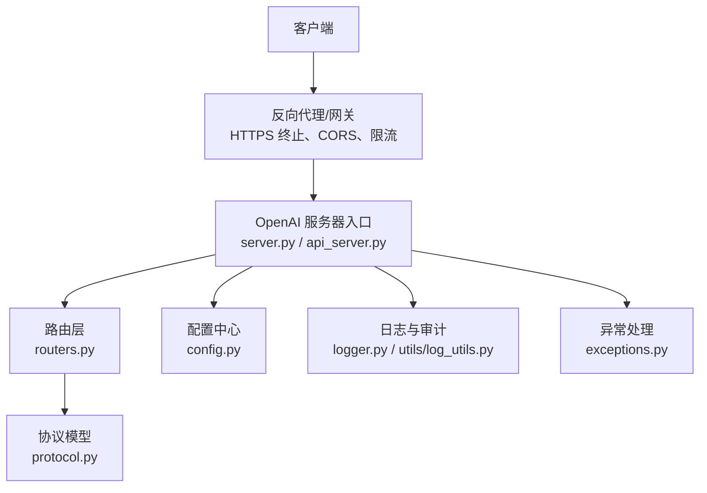
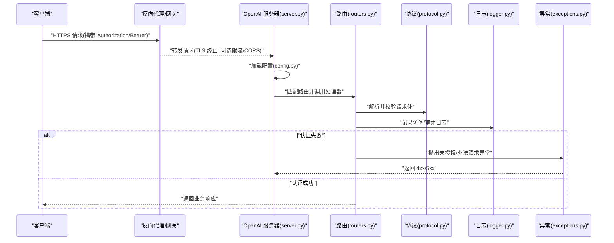
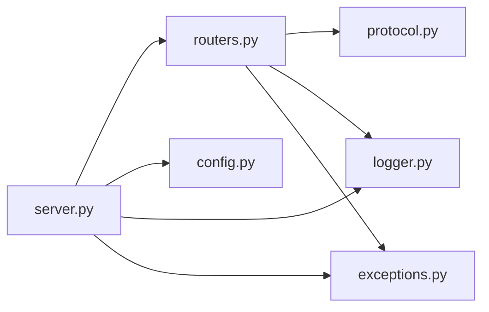

# 认证与安全

<cite>
**本文引用的文件**   
- [vllm/entrypoints/openai/server.py](file://vllm/entrypoints/openai/server.py)
- [vllm/entrypoints/openai/api_server.py](file://vllm/entrypoints/openai/api_server.py)
- [vllm/entrypoints/openai/routers.py](file://vllm/entrypoints/openai/routers.py)
- [vllm/entrypoints/openai/protocol.py](file://vllm/entrypoints/openai/protocol.py)
- [vllm/config.py](file://vllm/config.py)
- [vllm/logger.py](file://vllm/logger.py)
- [vllm/utils/log_utils.py](file://vllm/utils/log_utils.py)
- [vllm/exceptions.py](file://vllm/exceptions.py)
- [docs/usage/security.md](file://docs/usage/security.md)
- [examples/applications/api_server/example_openai_api_server.py](file://examples/applications/api_server/example_openai_api_server.py)
</cite>

## 目录
1. [简介](#简介)
2. [项目结构](#项目结构)
3. [核心组件](#核心组件)
4. [架构总览](#架构总览)
5. [详细组件分析](#详细组件分析)
6. [依赖关系分析](#依赖关系分析)
7. [性能考虑](#性能考虑)
8. [故障排查指南](#故障排查指南)
9. [结论](#结论)
10. [附录](#附录)

## 简介
本文件聚焦于 vLLM 的 OpenAI 兼容 API 在认证与安全方面的实现与最佳实践，涵盖：
- API 密钥验证（OpenAI 风格）
- Bearer Token 认证流程
- CORS 配置与跨域安全
- HTTPS/TLS 支持
- 访问控制策略、IP 白名单、速率限制与请求签名验证
- 安全最佳实践、常见攻击防护、日志审计与合规性要求
- 企业级部署的安全配置示例与第三方认证系统集成方案

## 项目结构
OpenAI 兼容 API 相关代码主要位于 entrypoints/openai 目录，配合全局配置与日志模块完成认证与安全能力。关键路径如下：
- 服务启动与中间件装配：server.py、api_server.py
- 路由与协议定义：routers.py、protocol.py
- 配置项与参数校验：config.py
- 日志与审计：logger.py、utils/log_utils.py
- 异常处理：exceptions.py
- 使用示例与文档：examples/applications/api_server/example_openai_api_server.py、docs/usage/security.md

图表来源
- [vllm/entrypoints/openai/server.py](file://vllm/entrypoints/openai/server.py)
- [vllm/entrypoints/openai/api_server.py](file://vllm/entrypoints/openai/api_server.py)
- [vllm/entrypoints/openai/routers.py](file://vllm/entrypoints/openai/routers.py)
- [vllm/entrypoints/openai/protocol.py](file://vllm/entrypoints/openai/protocol.py)
- [vllm/config.py](file://vllm/config.py)
- [vllm/logger.py](file://vllm/logger.py)
- [vllm/utils/log_utils.py](file://vllm/utils/log_utils.py)
- [vllm/exceptions.py](file://vllm/exceptions.py)

章节来源
- [vllm/entrypoints/openai/server.py](file://vllm/entrypoints/openai/server.py)
- [vllm/entrypoints/openai/api_server.py](file://vllm/entrypoints/openai/api_server.py)
- [vllm/entrypoints/openai/routers.py](file://vllm/entrypoints/openai/routers.py)
- [vllm/entrypoints/openai/protocol.py](file://vllm/entrypoints/openai/protocol.py)
- [vllm/config.py](file://vllm/config.py)
- [vllm/logger.py](file://vllm/logger.py)
- [vllm/utils/log_utils.py](file://vllm/utils/log_utils.py)
- [vllm/exceptions.py](file://vllm/exceptions.py)

## 核心组件
- OpenAI 服务器入口：负责启动 HTTP 服务、注册中间件（鉴权、CORS、日志等）、挂载路由。
- 路由层：将 OpenAI 兼容端点映射到具体处理器，统一入参出参格式。
- 协议模型：定义请求/响应数据结构，确保字段校验与类型安全。
- 配置中心：集中管理认证、CORS、TLS、限流等开关与参数。
- 日志与审计：记录访问日志、错误日志与审计事件，便于追踪与合规。
- 异常处理：标准化错误码与消息，避免泄露内部细节。

章节来源
- [vllm/entrypoints/openai/server.py](file://vllm/entrypoints/openai/server.py)
- [vllm/entrypoints/openai/routers.py](file://vllm/entrypoints/openai/routers.py)
- [vllm/entrypoints/openai/protocol.py](file://vllm/entrypoints/openai/protocol.py)
- [vllm/config.py](file://vllm/config.py)
- [vllm/logger.py](file://vllm/logger.py)
- [vllm/utils/log_utils.py](file://vllm/utils/log_utils.py)
- [vllm/exceptions.py](file://vllm/exceptions.py)

## 架构总览
下图展示从客户端到服务端的请求链路，以及认证、CORS、HTTPS、限流等安全能力的介入点。

图表来源
- [vllm/entrypoints/openai/server.py](file://vllm/entrypoints/openai/server.py)
- [vllm/entrypoints/openai/routers.py](file://vllm/entrypoints/openai/routers.py)
- [vllm/entrypoints/openai/protocol.py](file://vllm/entrypoints/openai/protocol.py)
- [vllm/config.py](file://vllm/config.py)
- [vllm/logger.py](file://vllm/logger.py)
- [vllm/exceptions.py](file://vllm/exceptions.py)

## 详细组件分析

### API 密钥与 Bearer Token 认证
- 认证方式
  - OpenAI 风格 API Key：通过请求头 Authorization: Bearer <API_KEY> 传递。
  - 服务端校验：在服务入口或中间件中读取并校验 API Key，拒绝无效或缺失的请求。
- 实现要点
  - 从请求头提取令牌并进行非空校验。
  - 与配置的密钥集合进行比对，支持多租户或多环境密钥隔离。
  - 对认证失败请求返回标准错误码，避免泄露系统细节。
- 建议
  - 在生产环境强制启用 HTTPS，防止令牌明文传输。
  - 结合网关层做二次校验与审计。

章节来源
- [vllm/entrypoints/openai/server.py](file://vllm/entrypoints/openai/server.py)
- [vllm/entrypoints/openai/api_server.py](file://vllm/entrypoints/openai/api_server.py)
- [vllm/config.py](file://vllm/config.py)

### CORS 配置与跨域安全
- 功能说明
  - 允许指定来源域名访问 API，限制方法、头部与凭据。
  - 预检请求（OPTIONS）快速响应，减少浏览器跨域开销。
- 配置项
  - 允许的源（白名单）、允许的方法、允许的头部、是否允许凭据。
- 安全建议
  - 严格限定 Allowed Origins，避免使用通配符。
  - 谨慎开启 Allow Credentials，仅当确有必要且受控时启用。

章节来源
- [vllm/entrypoints/openai/server.py](file://vllm/entrypoints/openai/server.py)
- [vllm/config.py](file://vllm/config.py)

### HTTPS/TLS 支持
- 功能说明
  - 支持在服务端启用 TLS，提供证书与私钥路径配置。
  - 推荐由反向代理（如 Nginx/Ingress）终止 TLS，后端仅处理内网流量。
- 配置项
  - 证书路径、私钥路径、协议版本与加密套件选择。
- 安全建议
  - 禁用过时协议（如 TLS1.0/1.1），启用强加密套件。
  - 定期轮换证书，监控证书过期。

章节来源
- [vllm/entrypoints/openai/server.py](file://vllm/entrypoints/openai/server.py)
- [vllm/config.py](file://vllm/config.py)

### 访问控制策略与 IP 白名单
- 访问控制
  - 基于角色或租户的访问控制，结合 API Key 与路由权限。
- IP 白名单
  - 在网关或服务端对来源 IP 进行过滤，仅允许可信网络访问。
- 实现建议
  - 优先在网关层实现 IP 白名单与访问控制，降低应用层负担。
  - 对越权访问进行审计与告警。

章节来源
- [vllm/entrypoints/openai/server.py](file://vllm/entrypoints/openai/server.py)
- [vllm/config.py](file://vllm/config.py)

### 速率限制与请求签名验证
- 速率限制
  - 按用户/IP/租户维度限制 QPS 或并发数，防止滥用与资源耗尽。
  - 建议在网关层实现，支持滑动窗口或令牌桶算法。
- 请求签名验证
  - 对敏感操作启用请求签名（HMAC 等），确保请求完整性与不可抵赖。
  - 服务端校验签名时间戳与随机数，防重放攻击。

章节来源
- [vllm/entrypoints/openai/server.py](file://vllm/entrypoints/openai/server.py)
- [vllm/config.py](file://vllm/config.py)

### 日志审计与合规性
- 访问日志
  - 记录请求时间、来源 IP、用户标识、接口路径、状态码、耗时等。
- 审计日志
  - 对认证失败、越权访问、异常行为进行审计记录。
- 合规性
  - 遵循最小化原则，避免记录敏感数据（如密钥、完整请求体）。
  - 日志脱敏与留存周期符合企业合规要求。

章节来源
- [vllm/logger.py](file://vllm/logger.py)
- [vllm/utils/log_utils.py](file://vllm/utils/log_utils.py)
- [docs/usage/security.md](file://docs/usage/security.md)

### 异常处理与错误响应
- 标准化错误
  - 统一错误码与消息，避免泄露内部堆栈与敏感信息。
- 分类处理
  - 区分认证失败、权限不足、参数校验失败、服务异常等场景。
- 建议
  - 对外只返回必要信息，内部记录详细上下文用于排障。

章节来源
- [vllm/exceptions.py](file://vllm/exceptions.py)

## 依赖关系分析
OpenAI 服务器的认证与安全能力依赖于路由、协议、配置、日志与异常处理模块。下图展示关键依赖关系。

图表来源
- [vllm/entrypoints/openai/server.py](file://vllm/entrypoints/openai/server.py)
- [vllm/entrypoints/openai/routers.py](file://vllm/entrypoints/openai/routers.py)
- [vllm/entrypoints/openai/protocol.py](file://vllm/entrypoints/openai/protocol.py)
- [vllm/config.py](file://vllm/config.py)
- [vllm/logger.py](file://vllm/logger.py)
- [vllm/exceptions.py](file://vllm/exceptions.py)

章节来源
- [vllm/entrypoints/openai/server.py](file://vllm/entrypoints/openai/server.py)
- [vllm/entrypoints/openai/routers.py](file://vllm/entrypoints/openai/routers.py)
- [vllm/entrypoints/openai/protocol.py](file://vllm/entrypoints/openai/protocol.py)
- [vllm/config.py](file://vllm/config.py)
- [vllm/logger.py](file://vllm/logger.py)
- [vllm/exceptions.py](file://vllm/exceptions.py)

## 性能考虑
- 认证开销
  - 尽量在网关层完成鉴权与限流，减少应用层 CPU 消耗。
- 日志写入
  - 异步写入与批量落盘，避免阻塞请求路径。
- 连接池与超时
  - 合理设置连接池大小与超时，避免资源耗尽。
- 缓存策略
  - 对静态配置（如白名单、CORS 规则）进行内存缓存，减少重复计算。

[本节为通用指导，不直接分析具体文件]

## 故障排查指南
- 常见问题
  - 认证失败：检查 Authorization 头是否正确、API Key 是否有效。
  - CORS 错误：确认 Allowed Origins、方法与头部配置。
  - HTTPS 问题：核对证书与私钥路径、权限与协议版本。
  - 限流触发：查看网关与应用层的限流阈值与统计。
- 诊断步骤
  - 查看访问日志与审计日志，定位失败原因。
  - 使用抓包工具验证请求头与响应内容。
  - 逐步关闭中间件以缩小问题范围。

章节来源
- [vllm/logger.py](file://vllm/logger.py)
- [vllm/utils/log_utils.py](file://vllm/utils/log_utils.py)
- [vllm/exceptions.py](file://vllm/exceptions.py)

## 结论
vLLM 的 OpenAI 兼容 API 在认证与安全方面提供了基础而实用的能力，包括 API Key/Bearer Token 认证、CORS、HTTPS、日志审计与异常处理。企业级部署应结合网关层实现更完善的访问控制、IP 白名单、速率限制与请求签名验证，并遵循安全最佳实践与合规要求，确保服务稳定与数据安全。

[本节为总结性内容，不直接分析具体文件]

## 附录

### 企业级部署安全配置示例
- 反向代理（Nginx/Ingress）
  - 终止 TLS，启用强加密套件与 HSTS。
  - 配置 CORS 白名单与预检响应。
  - 实现 IP 白名单与速率限制。
- 应用层（vLLM OpenAI 服务器）
  - 启用 API Key 校验与 Bearer Token 认证。
  - 配置严格的 CORS 策略与最小化日志。
  - 使用环境变量或配置文件管理密钥与证书路径。

章节来源
- [examples/applications/api_server/example_openai_api_server.py](file://examples/applications/api_server/example_openai_api_server.py)
- [docs/usage/security.md](file://docs/usage/security.md)

### 第三方认证系统集成方案
- OAuth2/OIDC
  - 通过网关或应用层集成 OIDC 提供者，校验 JWT 并注入用户上下文。
- SAML/LDAP
  - 在企业内网通过网关或身份代理进行单点登录与会话管理。
- 自定义签名验证
  - 对敏感接口启用 HMAC 签名，服务端校验签名与时间戳，防重放。

章节来源
- [vllm/entrypoints/openai/server.py](file://vllm/entrypoints/openai/server.py)
- [vllm/config.py](file://vllm/config.py)
- [docs/usage/security.md](file://docs/usage/security.md)