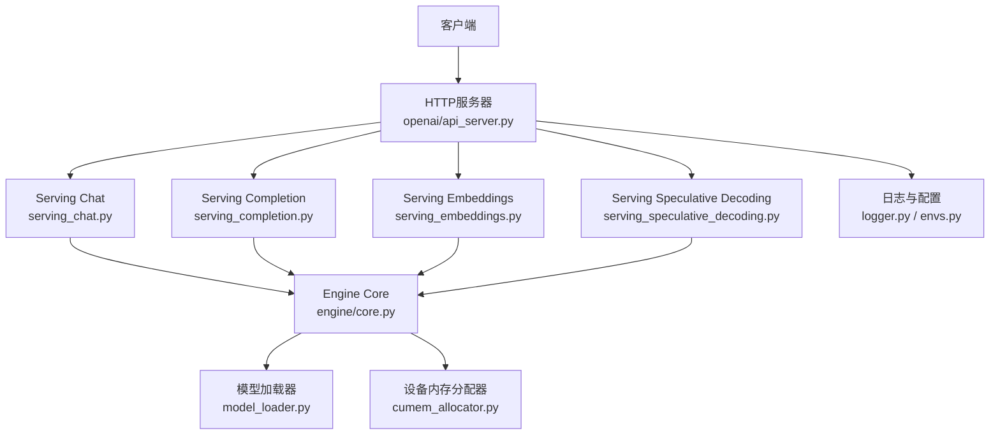
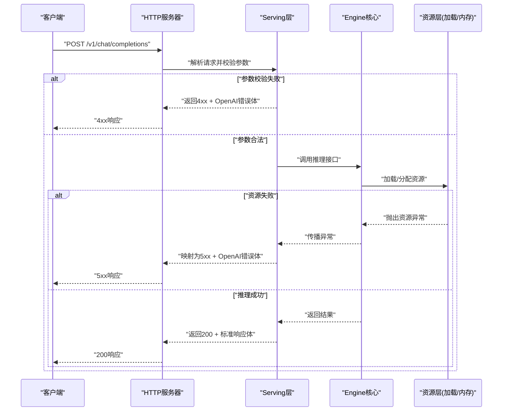
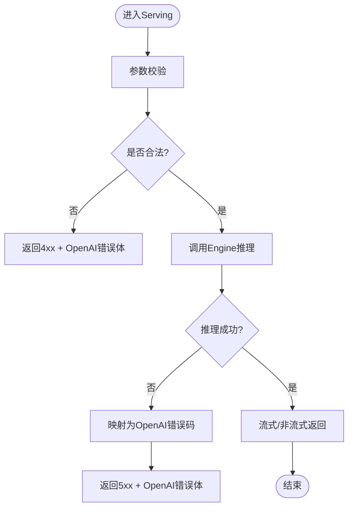
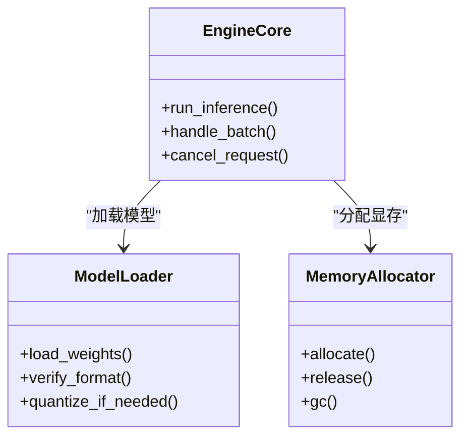
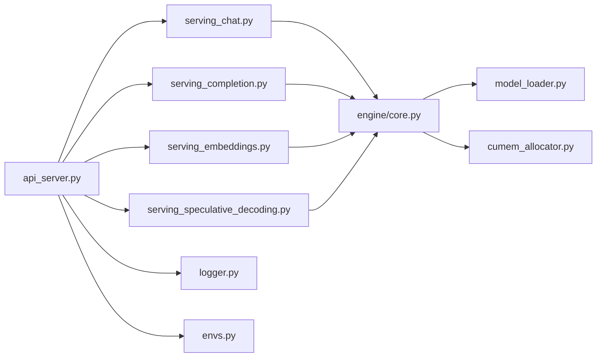

# 错误处理与调试

<cite>
**本文引用的文件**   
- [vllm/exceptions.py](file://vllm/exceptions.py)
- [vllm/logger.py](file://vllm/logger.py)
- [vllm/envs.py](file://vllm/envs.py)
- [vllm/entrypoints/openai/api_server.py](file://vllm/entrypoints/openai/api_server.py)
- [vllm/entrypoints/openai/serving_chat.py](file://vllm/entrypoints/openai/serving_chat.py)
- [vllm/entrypoints/openai/serving_completion.py](file://vllm/entrypoints/openai/serving_completion.py)
- [vllm/entrypoints/openai/serving_embeddings.py](file://vllm/entrypoints/openai/serving_embeddings.py)
- [vllm/entrypoints/openai/serving_speculative_decoding.py](file://vllm/entrypoints/openai/serving_speculative_decoding.py)
- [vllm/engine/core.py](file://vllm/engine/core.py)
- [vllm/model_executor/model_loader.py](file://vllm/model_executor/model_loader.py)
- [vllm/device_allocator/cumem_allocator.py](file://vllm/device_allocator/cumem_allocator.py)
- [vllm/config/engine_args.py](file://vllm/config/engine_args.py)
- [vllm/utils/__init__.py](file://vllm/utils/__init__.py)
- [tests/entrypoints/openai/test_api_server.py](file://tests/entrypoints/openai/test_api_server.py)
- [tests/entrypoints/openai/test_serving_chat.py](file://tests/entrypoints/openai/test_serving_chat.py)
- [tests/entrypoints/openai/test_serving_completion.py](file://tests/entrypoints/openai/test_serving_completion.py)
- [examples/observability/prometheus_grafana/grafana_dashboard.json](file://examples/observability/prometheus_grafana/grafana_dashboard.json)
</cite>

## 目录
1. [简介](#简介)
2. [项目结构](#项目结构)
3. [核心组件](#核心组件)
4. [架构总览](#架构总览)
5. [详细组件分析](#详细组件分析)
6. [依赖关系分析](#依赖关系分析)
7. [性能考虑](#性能考虑)
8. [故障排查指南](#故障排查指南)
9. [结论](#结论)
10. [附录](#附录)

## 简介
本文件面向OpenAI兼容API的错误处理与调试，系统性梳理HTTP状态码、错误响应格式、异常类型分类与错误码映射；覆盖请求验证失败、模型加载错误、内存不足、超时等常见错误的诊断方法；并提供日志配置、调试工具使用、性能分析与故障排查流程；最后给出错误监控告警、自动恢复机制与降级策略的实现指南。

## 项目结构
围绕OpenAI兼容API的入口与错误处理，代码主要分布在以下模块：
- OpenAI API服务器与路由：负责HTTP层、参数校验、统一错误封装与返回
- Serving层（chat/completion/embeddings/speculative decoding）：业务逻辑与引擎调用
- Engine核心：推理执行、资源管理、错误向上抛出
- 模型加载器：权重加载、设备分配、初始化阶段错误
- 设备内存分配器：显存/内存不足时的异常与恢复
- 日志与配置：结构化日志、环境变量开关、可观测性指标

**图表来源** 
- [vllm/entrypoints/openai/api_server.py](file://vllm/entrypoints/openai/api_server.py)
- [vllm/entrypoints/openai/serving_chat.py](file://vllm/entrypoints/openai/serving_chat.py)
- [vllm/entrypoints/openai/serving_completion.py](file://vllm/entrypoints/openai/serving_completion.py)
- [vllm/entrypoints/openai/serving_embeddings.py](file://vllm/entrypoints/openai/serving_embeddings.py)
- [vllm/entrypoints/openai/serving_speculative_decoding.py](file://vllm/entrypoints/openai/serving_speculative_decoding.py)
- [vllm/engine/core.py](file://vllm/engine/core.py)
- [vllm/model_executor/model_loader.py](file://vllm/model_executor/model_loader.py)
- [vllm/device_allocator/cumem_allocator.py](file://vllm/device_allocator/cumem_allocator.py)
- [vllm/logger.py](file://vllm/logger.py)
- [vllm/envs.py](file://vllm/envs.py)

**章节来源**
- [vllm/entrypoints/openai/api_server.py](file://vllm/entrypoints/openai/api_server.py)
- [vllm/logger.py](file://vllm/logger.py)
- [vllm/envs.py](file://vllm/envs.py)

## 核心组件
- 统一异常体系：集中定义OpenAI兼容错误类型与消息结构，便于上层捕获并转换为标准HTTP错误响应
- HTTP中间件与全局异常处理器：拦截未处理异常，统一记录日志、统计指标、返回标准化错误体
- Serving层校验与错误转换：对请求参数进行严格校验，将业务异常转换为OpenAI错误码
- Engine与底层资源：在推理执行、模型加载、内存分配等阶段抛出具体异常，由上层统一处理
- 日志与可观测性：结构化日志、指标暴露、分布式追踪，支撑问题定位与容量规划

**章节来源**
- [vllm/exceptions.py](file://vllm/exceptions.py)
- [vllm/entrypoints/openai/api_server.py](file://vllm/entrypoints/openai/api_server.py)
- [vllm/entrypoints/openai/serving_chat.py](file://vllm/entrypoints/openai/serving_chat.py)
- [vllm/entrypoints/openai/serving_completion.py](file://vllm/entrypoints/openai/serving_completion.py)
- [vllm/entrypoints/openai/serving_embeddings.py](file://vllm/entrypoints/openai/serving_embeddings.py)
- [vllm/entrypoints/openai/serving_speculative_decoding.py](file://vllm/entrypoints/openai/serving_speculative_decoding.py)
- [vllm/engine/core.py](file://vllm/engine/core.py)
- [vllm/model_executor/model_loader.py](file://vllm/model_executor/model_loader.py)
- [vllm/device_allocator/cumem_allocator.py](file://vllm/device_allocator/cumem_allocator.py)

## 架构总览
OpenAI兼容API的错误处理采用“分层捕获+统一封装”的架构：
- HTTP层：全局异常处理器捕获所有未处理异常，输出标准错误JSON，附带trace_id与时间戳
- Serving层：参数校验失败直接返回4xx；业务异常转换为OpenAI错误码（如模型不存在、上下文长度超限）
- Engine层：抛出运行时异常（如CUDA OOM、内核错误），由Serving层捕获并映射为合适的HTTP状态码
- 资源层：模型加载与内存分配失败时，提供明确的错误原因与恢复建议

**图表来源** 
- [vllm/entrypoints/openai/api_server.py](file://vllm/entrypoints/openai/api_server.py)
- [vllm/entrypoints/openai/serving_chat.py](file://vllm/entrypoints/openai/serving_chat.py)
- [vllm/engine/core.py](file://vllm/engine/core.py)
- [vllm/model_executor/model_loader.py](file://vllm/model_executor/model_loader.py)
- [vllm/device_allocator/cumem_allocator.py](file://vllm/device_allocator/cumem_allocator.py)

## 详细组件分析

### 统一异常体系与错误码映射
- 异常类型分类：
  - 请求类错误（4xx）：参数缺失、格式错误、模型名无效、上下文长度超限、采样参数非法
  - 服务类错误（5xx）：模型加载失败、内核崩溃、通信失败、未知内部错误
  - 资源类错误（5xx）：显存不足、磁盘空间不足、权限错误
- 错误码映射：
  - 400 Bad Request：请求校验失败
  - 404 Not Found：模型不存在或端点未启用
  - 422 Unprocessable Entity：参数语义不合法（如temperature越界）
  - 500 Internal Server Error：内部异常
  - 503 Service Unavailable：资源不可用（如OOM、模型加载中）
  - 504 Gateway Timeout：请求超时
- 错误响应格式：
  - 包含error.code、error.message、error.type、request_id、timestamp等字段，便于客户端重试与上报

**章节来源**
- [vllm/exceptions.py](file://vllm/exceptions.py)
- [vllm/entrypoints/openai/api_server.py](file://vllm/entrypoints/openai/api_server.py)

### HTTP服务器与全局异常处理
- 全局异常处理器：
  - 捕获未处理异常，记录结构化日志（含堆栈、请求ID、耗时）
  - 将异常映射为OpenAI兼容错误体，设置对应HTTP状态码
  - 暴露Prometheus指标（错误计数、延迟分布）
- 请求生命周期：
  - 进入路由前进行基础校验（路径、方法、鉴权）
  - 进入Serving层后执行业务校验与推理
  - 任何阶段抛出的异常均被统一处理器捕获

**章节来源**
- [vllm/entrypoints/openai/api_server.py](file://vllm/entrypoints/openai/api_server.py)

### Serving层：Chat/Completion/Embeddings/Speculative Decoding
- 参数校验：
  - 必填字段检查、枚举值校验、范围校验（如max_tokens、top_p）
  - 多模态输入校验（图像/音频token限制）
- 错误转换：
  - 将Engine抛出的异常转换为OpenAI错误码
  - 对超时、取消请求进行友好提示
- 流式响应：
  - 支持增量返回，异常发生时立即终止流并返回错误事件

**图表来源** 
- [vllm/entrypoints/openai/serving_chat.py](file://vllm/entrypoints/openai/serving_chat.py)
- [vllm/entrypoints/openai/serving_completion.py](file://vllm/entrypoints/openai/serving_completion.py)
- [vllm/entrypoints/openai/serving_embeddings.py](file://vllm/entrypoints/openai/serving_embeddings.py)
- [vllm/entrypoints/openai/serving_speculative_decoding.py](file://vllm/entrypoints/openai/serving_speculative_decoding.py)

**章节来源**
- [vllm/entrypoints/openai/serving_chat.py](file://vllm/entrypoints/openai/serving_chat.py)
- [vllm/entrypoints/openai/serving_completion.py](file://vllm/entrypoints/openai/serving_completion.py)
- [vllm/entrypoints/openai/serving_embeddings.py](file://vllm/entrypoints/openai/serving_embeddings.py)
- [vllm/entrypoints/openai/serving_speculative_decoding.py](file://vllm/entrypoints/openai/serving_speculative_decoding.py)

### Engine核心与资源层错误
- Engine核心：
  - 调度批处理、注意力计算、解码循环
  - 抛出运行时异常（如CUDA错误、NCCL通信失败）
- 模型加载器：
  - 权重下载、分片合并、量化加载
  - 失败时返回明确原因（网络中断、权限不足、格式不匹配）
- 设备内存分配器：
  - 显存碎片整理、缓存回收
  - OOM时触发回退策略（降低batch size、切换后端）

**图表来源** 
- [vllm/engine/core.py](file://vllm/engine/core.py)
- [vllm/model_executor/model_loader.py](file://vllm/model_executor/model_loader.py)
- [vllm/device_allocator/cumem_allocator.py](file://vllm/device_allocator/cumem_allocator.py)

**章节来源**
- [vllm/engine/core.py](file://vllm/engine/core.py)
- [vllm/model_executor/model_loader.py](file://vllm/model_executor/model_loader.py)
- [vllm/device_allocator/cumem_allocator.py](file://vllm/device_allocator/cumem_allocator.py)

### 日志配置与调试工具
- 日志级别与格式：
  - 支持DEBUG/INFO/WARNING/ERROR，结构化JSON输出
  - 包含请求ID、用户ID、模型名、耗时、错误码
- 环境变量开关：
  - 控制日志输出、指标采集、追踪采样率
- 调试工具：
  - 内置健康检查端点（/health、/metrics）
  - Prometheus/Grafana集成，可视化错误率与延迟

**章节来源**
- [vllm/logger.py](file://vllm/logger.py)
- [vllm/envs.py](file://vllm/envs.py)
- [examples/observability/prometheus_grafana/grafana_dashboard.json](file://examples/observability/prometheus_grafana/grafana_dashboard.json)

## 依赖关系分析
- 低耦合高内聚：Serving层仅依赖Engine接口，异常通过统一类型传递
- 外部依赖：
  - HTTP框架（FastAPI/Starlette）用于路由与中间件
  - 指标库（Prometheus client）用于暴露错误计数
  - 追踪库（OpenTelemetry）用于分布式链路追踪
- 潜在循环依赖：
  - 避免Serving层直接依赖底层实现，通过Engine抽象隔离

**图表来源** 
- [vllm/entrypoints/openai/api_server.py](file://vllm/entrypoints/openai/api_server.py)
- [vllm/entrypoints/openai/serving_chat.py](file://vllm/entrypoints/openai/serving_chat.py)
- [vllm/entrypoints/openai/serving_completion.py](file://vllm/entrypoints/openai/serving_completion.py)
- [vllm/entrypoints/openai/serving_embeddings.py](file://vllm/entrypoints/openai/serving_embeddings.py)
- [vllm/entrypoints/openai/serving_speculative_decoding.py](file://vllm/entrypoints/openai/serving_speculative_decoding.py)
- [vllm/engine/core.py](file://vllm/engine/core.py)
- [vllm/model_executor/model_loader.py](file://vllm/model_executor/model_loader.py)
- [vllm/device_allocator/cumem_allocator.py](file://vllm/device_allocator/cumem_allocator.py)
- [vllm/logger.py](file://vllm/logger.py)
- [vllm/envs.py](file://vllm/envs.py)

**章节来源**
- [vllm/entrypoints/openai/api_server.py](file://vllm/entrypoints/openai/api_server.py)
- [vllm/engine/core.py](file://vllm/engine/core.py)

## 性能考虑
- 错误处理的开销：
  - 异常捕获与日志记录应异步化，避免阻塞主路径
  - 使用连接池与批量日志减少I/O开销
- 内存与GPU利用率：
  - OOM时快速失败，避免长时间占用资源
  - 动态调整batch size与序列长度上限
- 超时与重试：
  - 合理设置请求超时，避免长尾请求拖垮系统
  - 客户端侧实现指数退避重试

[本节为通用指导，无需特定文件引用]

## 故障排查指南

### 请求验证失败（4xx）
- 常见原因：
  - 缺少必填字段（如messages、model）
  - 参数类型错误或范围越界（如temperature<0）
  - 多模态输入格式不正确
- 诊断步骤：
  - 检查请求体结构与字段类型
  - 查看Serving层校验日志
  - 使用测试用例对比正确请求格式

**章节来源**
- [tests/entrypoints/openai/test_serving_chat.py](file://tests/entrypoints/openai/test_serving_chat.py)
- [tests/entrypoints/openai/test_serving_completion.py](file://tests/entrypoints/openai/test_serving_completion.py)

### 模型加载错误（5xx）
- 常见原因：
  - 模型路径不存在或权限不足
  - 权重文件格式不匹配（如量化版本不一致）
  - 网络下载中断
- 诊断步骤：
  - 检查模型存储路径与权限
  - 验证权重完整性（哈希校验）
  - 查看ModelLoader日志中的下载进度与错误信息

**章节来源**
- [vllm/model_executor/model_loader.py](file://vllm/model_executor/model_loader.py)

### 内存不足（OOM）（503）
- 常见原因：
  - batch size过大或序列过长
  - 显存碎片化严重
  - 并发请求过多
- 诊断步骤：
  - 监控GPU显存使用率与碎片率
  - 降低并发度或最大序列长度
  - 触发GC或重启进程释放碎片

**章节来源**
- [vllm/device_allocator/cumem_allocator.py](file://vllm/device_allocator/cumem_allocator.py)

### 超时处理（504）
- 常见原因：
  - 推理任务过长（长文本生成）
  - GPU资源争用导致调度延迟
  - 网络传输慢（流式响应）
- 诊断步骤：
  - 设置合理的超时阈值
  - 监控Engine队列长度与等待时间
  - 优化批处理策略与KV缓存命中率

**章节来源**
- [vllm/engine/core.py](file://vllm/engine/core.py)

### 日志与指标分析
- 关键日志字段：
  - request_id、user_id、model_name、error_code、latency_ms
- 指标看板：
  - 错误率（按错误码分组）
  - P95/P99延迟
  - 显存使用率与碎片率

**章节来源**
- [vllm/logger.py](file://vllm/logger.py)
- [examples/observability/prometheus_grafana/grafana_dashboard.json](file://examples/observability/prometheus_grafana/grafana_dashboard.json)

## 结论
通过统一的异常体系、分层错误处理与完善的可观测性，vLLM的OpenAI兼容API能够稳定地处理各类错误场景。结合日志、指标与自动化恢复机制，可有效提升系统的鲁棒性与可维护性。

[本节为总结性内容，无需特定文件引用]

## 附录

### HTTP状态码与错误响应格式
- 状态码含义：
  - 400：请求参数错误
  - 404：模型不存在
  - 422：参数语义不合法
  - 500：内部错误
  - 503：服务不可用（资源不足）
  - 504：请求超时
- 错误响应体字段：
  - error.code：错误码（字符串）
  - error.message：人类可读的错误描述
  - error.type：错误类型（如invalid_request_error、server_error）
  - request_id：请求唯一标识
  - timestamp：错误发生时间

**章节来源**
- [vllm/exceptions.py](file://vllm/exceptions.py)
- [vllm/entrypoints/openai/api_server.py](file://vllm/entrypoints/openai/api_server.py)

### 错误监控告警与自动恢复
- 监控告警：
  - 基于Prometheus规则，当错误率超过阈值时触发告警
  - 关键指标：5xx比例、OOM次数、模型加载失败次数
- 自动恢复：
  - 健康检查失败时自动重启实例
  - 显存不足时动态降低并发度
  - 模型加载失败时回退到备用模型

**章节来源**
- [examples/observability/prometheus_grafana/grafana_dashboard.json](file://examples/observability/prometheus_grafana/grafana_dashboard.json)
- [vllm/device_allocator/cumem_allocator.py](file://vllm/device_allocator/cumem_allocator.py)

### 降级策略
- 功能降级：
  - 关闭流式响应以降低内存占用
  - 禁用高级特性（如speculative decoding）
- 流量降级：
  - 限流保护，拒绝超出容量的请求
  - 优先保障核心模型的服务质量

**章节来源**
- [vllm/config/engine_args.py](file://vllm/config/engine_args.py)
- [vllm/utils/__init__.py](file://vllm/utils/__init__.py)