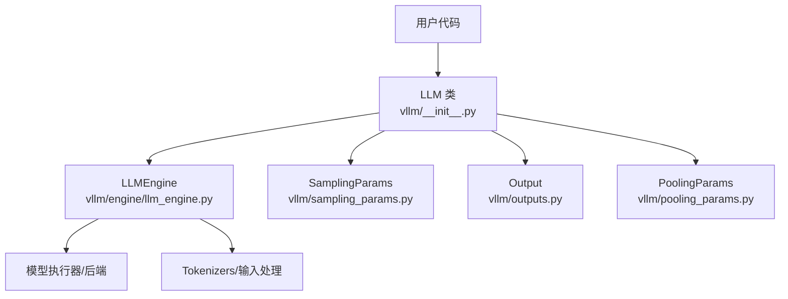
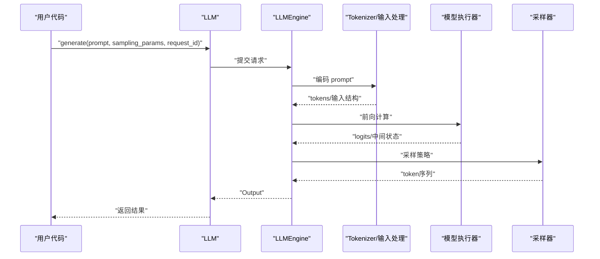
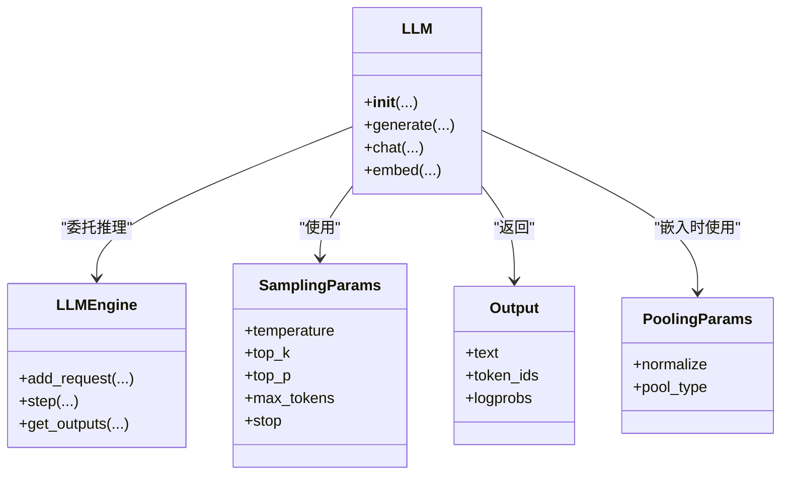

# LLM类核心接口

<cite>
**本文档引用的文件**   
- [vllm/__init__.py](file://vllm/__init__.py)
- [vllm/engine/llm_engine.py](file://vllm/engine/llm_engine.py)
- [vllm/sampling_params.py](file://vllm/sampling_params.py)
- [vllm/outputs.py](file://vllm/outputs.py)
- [vllm/pooling_params.py](file://vllm/pooling_params.py)
- [examples/basic/offline_inference/offline_inference.py](file://examples/basic/offline_inference/offline_inference.py)
- [examples/tool_calling/chat_with_tools_offline.py](file://examples/tool_calling/chat_with_tools_offline.py)
- [examples/reasoning/openai_chat_completion_with_reasoning_streaming.py](file://examples/reasoning/openai_chat_completion_with_reasoning_streaming.py)
- [tests/entrypoints/llm/test_llm.py](file://tests/entrypoints/llm/test_llm.py)
</cite>

## 目录
1. [简介](#简介)
2. [项目结构](#项目结构)
3. [核心组件](#核心组件)
4. [架构总览](#架构总览)
5. [详细组件分析](#详细组件分析)
6. [依赖关系分析](#依赖关系分析)
7. [性能考虑](#性能考虑)
8. [故障排查指南](#故障排查指南)
9. [结论](#结论)
10. [附录](#附录)

## 简介
本文件面向使用 vLLM 的开发者，系统化梳理 LLM 类的 API 与行为，包括：
- 初始化参数、配置选项与生命周期管理
- generate() 方法的完整参数说明（prompt、sampling_params、request_id 等）
- chat() 方法用于对话交互的接口规范（messages 格式、工具调用支持、流式响应）
- embed() 方法用于文本嵌入的功能与用法
- 典型使用场景的代码示例路径（基本生成、多轮对话、批量处理、流式输出）
- 错误处理模式与异常类型说明

## 项目结构
围绕 LLM 类及其相关接口的关键位置如下：
- 入口与导出：vllm/__init__.py
- 引擎核心：vllm/engine/llm_engine.py
- 采样参数：vllm/sampling_params.py
- 输出对象：vllm/outputs.py
- 池化参数（用于嵌入）：vllm/pooling_params.py
- 示例与测试：examples 与 tests 目录下对应脚本

图表来源
- [vllm/__init__.py](file://vllm/__init__.py)
- [vllm/engine/llm_engine.py](file://vllm/engine/llm_engine.py)
- [vllm/sampling_params.py](file://vllm/sampling_params.py)
- [vllm/outputs.py](file://vllm/outputs.py)
- [vllm/pooling_params.py](file://vllm/pooling_params.py)

章节来源
- [vllm/__init__.py](file://vllm/__init__.py)
- [vllm/engine/llm_engine.py](file://vllm/engine/llm_engine.py)

## 核心组件
- LLM 类：对外暴露的统一推理接口，封装模型加载、请求调度、结果组装。
- LLMEngine：内部引擎，负责批调度、KV Cache、采样、并行策略等。
- SamplingParams：控制采样行为的参数集合（如温度、top_k/top_p、最大长度、停止词等）。
- Output：封装单次生成的结果（文本、token 信息、元数据等）。
- PoolingParams：控制嵌入/池化行为的参数集合（如归一化、维度选择等）。

章节来源
- [vllm/engine/llm_engine.py](file://vllm/engine/llm_engine.py)
- [vllm/sampling_params.py](file://vllm/sampling_params.py)
- [vllm/outputs.py](file://vllm/outputs.py)
- [vllm/pooling_params.py](file://vllm/pooling_params.py)

## 架构总览
LLM 类作为门面，将上层调用转交给 LLMEngine；Engine 再协调 Tokenizer、模型执行器、采样器等子系统进行推理。

图表来源
- [vllm/engine/llm_engine.py](file://vllm/engine/llm_engine.py)
- [vllm/sampling_params.py](file://vllm/sampling_params.py)
- [vllm/outputs.py](file://vllm/outputs.py)

## 详细组件分析

### LLM 类概览
- 职责
  - 统一入口：提供 generate()/chat()/embed() 等方法
  - 生命周期：模型加载、资源释放、上下文切换
  - 参数校验与默认值合并
- 关键点
  - 构造阶段完成模型与引擎初始化
  - 推理阶段委托 Engine 执行
  - 结果阶段封装为 Output 或迭代器（流式）

章节来源
- [vllm/__init__.py](file://vllm/__init__.py)
- [vllm/engine/llm_engine.py](file://vllm/engine/llm_engine.py)

### 初始化参数与配置选项
- 常见参数类别
  - 模型标识：模型名称或本地路径
  - 硬件与并行：设备、张量并行、流水线并行、上下文并行等
  - 内存与缓存：KV Cache 大小、量化、显存占用策略
  - 运行时开关：编译优化、日志级别、指标采集
- 配置优先级
  - 构造函数参数 > 环境变量 > 配置文件默认值
- 生命周期
  - 构造：加载权重、初始化引擎、预热必要组件
  - 运行：并发请求、批调度、流式输出
  - 销毁：释放显存、关闭进程内资源

章节来源
- [vllm/engine/llm_engine.py](file://vllm/engine/llm_engine.py)

### generate() 方法
- 作用
  - 基于给定 prompt 进行文本生成，支持多种采样策略与请求标识
- 主要参数
  - prompt：字符串或结构化提示（具体类型由实现决定）
  - sampling_params：SamplingParams 实例，控制采样行为
  - request_id：可选的请求标识，便于追踪与调试
  - 其他：是否流式、是否返回 logprobs、停止条件等（以实现为准）
- 返回值
  - 非流式：单个 Output 对象
  - 流式：可迭代对象，逐 token 或分块返回增量内容
- 注意事项
  - 长上下文需关注 KV Cache 与内存占用
  - 并发请求建议设置合理 batch_size 与超时

章节来源
- [vllm/engine/llm_engine.py](file://vllm/engine/llm_engine.py)
- [vllm/sampling_params.py](file://vllm/sampling_params.py)
- [vllm/outputs.py](file://vllm/outputs.py)

### chat() 方法
- 作用
  - 多轮对话接口，接收消息列表并返回助手回复
- 输入格式
  - messages：按角色组织的历史消息（如 system/user/assistant），包含文本与可选工具调用信息
- 工具调用支持
  - 可在消息中声明可用工具，或在系统提示中指定工具定义
  - 模型可返回函数调用指令，客户端据此执行并追加结果继续对话
- 流式响应
  - 支持增量返回对话片段，适合实时交互
- 典型流程
  - 构建 messages → 调用 chat() → 解析回复（含工具调用）→ 执行工具 → 追加结果 → 继续下一轮

章节来源
- [vllm/engine/llm_engine.py](file://vllm/engine/llm_engine.py)
- [examples/tool_calling/chat_with_tools_offline.py](file://examples/tool_calling/chat_with_tools_offline.py)

### embed() 方法
- 作用
  - 对文本进行嵌入表示，常用于检索、相似度计算等
- 输入
  - 文本或文本列表
- 参数
  - pooling_params：PoolingParams 实例，控制归一化、维度裁剪等
- 输出
  - 向量或向量列表，形状与模型配置相关

章节来源
- [vllm/engine/llm_engine.py](file://vllm/engine/llm_engine.py)
- [vllm/pooling_params.py](file://vllm/pooling_params.py)

### 使用示例（代码路径）
- 基本文本生成
  - [examples/basic/offline_inference/offline_inference.py](file://examples/basic/offline_inference/offline_inference.py)
- 多轮对话与工具调用
  - [examples/tool_calling/chat_with_tools_offline.py](file://examples/tool_calling/chat_with_tools_offline.py)
- 流式输出（OpenAI 风格）
  - [examples/reasoning/openai_chat_completion_with_reasoning_streaming.py](file://examples/reasoning/openai_chat_completion_with_reasoning_streaming.py)
- 单元测试参考
  - [tests/entrypoints/llm/test_llm.py](file://tests/entrypoints/llm/test_llm.py)

章节来源
- [examples/basic/offline_inference/offline_inference.py](file://examples/basic/offline_inference/offline_inference.py)
- [examples/tool_calling/chat_with_tools_offline.py](file://examples/tool_calling/chat_with_tools_offline.py)
- [examples/reasoning/openai_chat_completion_with_reasoning_streaming.py](file://examples/reasoning/openai_chat_completion_with_reasoning_streaming.py)
- [tests/entrypoints/llm/test_llm.py](file://tests/entrypoints/llm/test_llm.py)

### 错误处理与异常
- 常见异常类型
  - 输入校验失败（非法 prompt/messages）
  - 资源不足（显存溢出、KV Cache 耗尽）
  - 超时与取消（请求长时间未返回）
  - 模型加载失败（权重缺失、版本不兼容）
- 处理建议
  - 捕获并分类异常，记录请求 ID 与上下文
  - 对资源类错误实施退避与降级策略
  - 对超时请求设置合理的超时与重试上限

章节来源
- [vllm/engine/llm_engine.py](file://vllm/engine/llm_engine.py)
- [tests/entrypoints/llm/test_llm.py](file://tests/entrypoints/llm/test_llm.py)

## 依赖关系分析
LLM 类与其核心依赖的关系如下：

图表来源
- [vllm/__init__.py](file://vllm/__init__.py)
- [vllm/engine/llm_engine.py](file://vllm/engine/llm_engine.py)
- [vllm/sampling_params.py](file://vllm/sampling_params.py)
- [vllm/outputs.py](file://vllm/outputs.py)
- [vllm/pooling_params.py](file://vllm/pooling_params.py)

章节来源
- [vllm/__init__.py](file://vllm/__init__.py)
- [vllm/engine/llm_engine.py](file://vllm/engine/llm_engine.py)

## 性能考虑
- 批处理与并发
  - 合理设置 batch_size 与并发度，避免显存抖动
  - 使用流式输出降低首字延迟
- 内存与缓存
  - 调整 KV Cache 大小与复用策略
  - 启用量化与编译优化以降低内存与提升吞吐
- 采样与解码
  - 根据任务调优 temperature/top_k/top_p
  - 合理使用 stop 条件减少无效生成

[本节为通用指导，不直接分析具体文件]

## 故障排查指南
- 常见问题定位
  - 检查模型路径与权限
  - 确认 GPU/CPU 环境匹配
  - 查看日志中的 OOM、超时、输入校验错误
- 诊断步骤
  - 缩小 prompt 长度验证基础链路
  - 逐步放宽采样参数定位不稳定问题
  - 使用 request_id 追踪请求全链路
- 恢复策略
  - 重启引擎或进程
  - 降低并发与 batch_size
  - 清理残留临时文件与缓存

章节来源
- [tests/entrypoints/llm/test_llm.py](file://tests/entrypoints/llm/test_llm.py)
- [vllm/engine/llm_engine.py](file://vllm/engine/llm_engine.py)

## 结论
LLM 类提供了统一的推理入口，覆盖生成、对话与嵌入三大能力。通过 SamplingParams 与 PoolingParams 精细控制行为，借助 LLMEngine 高效调度底层资源。遵循本文档的参数说明、示例与排错建议，可快速构建稳定高效的 LLM 应用。

[本节为总结性内容，不直接分析具体文件]

## 附录
- 术语表
  - Prompt：输入提示
  - SamplingParams：采样参数
  - Output：生成结果对象
  - PoolingParams：池化/嵌入参数
- 参考链接
  - 示例与测试见各文件路径

[本节为补充信息，不直接分析具体文件]