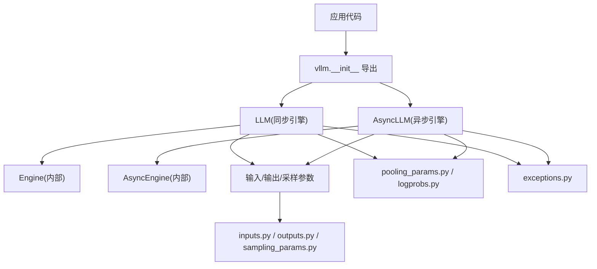
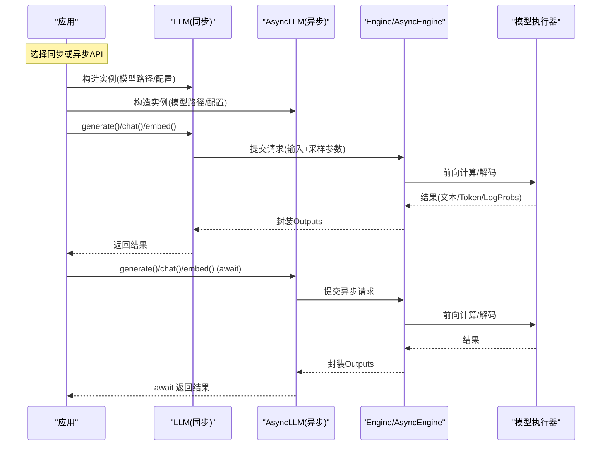
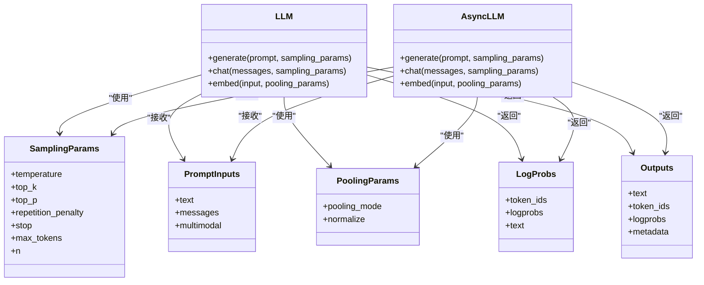

# Python SDK接口

<cite>
**本文引用的文件**   
- [vllm/__init__.py](file://vllm/__init__.py)
- [vllm/engine/async_llm_engine.py](file://vllm/engine/async_llm_engine.py)
- [vllm/engine/llm_engine.py](file://vllm/engine/llm_engine.py)
- [vllm/sampling_params.py](file://vllm/sampling_params.py)
- [vllm/inputs.py](file://vllm/inputs.py)
- [vllm/outputs.py](file://vllm/outputs.py)
- [vllm/pooling_params.py](file://vllm/pooling_params.py)
- [vllm/logprobs.py](file://vllm/logprobs.py)
- [vllm/exceptions.py](file://vllm/exceptions.py)
- [examples/basic/offline_inference/generate.py](file://examples/basic/offline_inference/generate.py)
- [examples/basic/offline_inference/chat.py](file://examples/basic/offline_inference/chat.py)
- [examples/basic/offline_inference/embedding.py](file://examples/basic/offline_inference/embedding.py)
- [examples/basic/offline_inference/batch_generate.py](file://examples/basic/offline_inference/batch_generate.py)
- [examples/basic/offline_inference/multimodal.py](file://examples/basic/offline_inference/multimodal.py)
</cite>

## 目录
1. [简介](#简介)
2. [项目结构](#项目结构)
3. [核心组件](#核心组件)
4. [架构总览](#架构总览)
5. [详细组件分析](#详细组件分析)
6. [依赖关系分析](#依赖关系分析)
7. [性能注意事项](#性能注意事项)
8. [故障排查指南](#故障排查指南)
9. [结论](#结论)
10. [附录](#附录)

## 简介
本文件面向使用 vLLM Python SDK 的开发者，系统化梳理 LLM 类的编程接口与使用模式，覆盖同步与异步 API、关键数据类（SamplingParams、PromptInputs 等）、常见场景示例（文本生成、对话交互、批量处理、嵌入向量），以及与 PyTorch 张量的集成和内存管理最佳实践。文档同时提供错误处理与调试技巧，帮助你在生产环境中稳定高效地使用 vLLM。

## 项目结构
vLLM 的 Python SDK 主要位于 vllm 包内，核心入口包括：
- 顶层导出与版本信息：vllm/__init__.py
- 引擎实现：vllm/engine/llm_engine.py（同步）与 vllm/engine/async_llm_engine.py（异步）
- 输入输出与采样参数：vllm/inputs.py、vllm/outputs.py、vllm/sampling_params.py
- 池化参数与日志概率：vllm/pooling_params.py、vllm/logprobs.py
- 异常类型：vllm/exceptions.py
- 示例脚本：examples/basic/offline_inference/*

图表来源
- [vllm/__init__.py](file://vllm/__init__.py)
- [vllm/engine/llm_engine.py](file://vllm/engine/llm_engine.py)
- [vllm/engine/async_llm_engine.py](file://vllm/engine/async_llm_engine.py)
- [vllm/inputs.py](file://vllm/inputs.py)
- [vllm/outputs.py](file://vllm/outputs.py)
- [vllm/sampling_params.py](file://vllm/sampling_params.py)
- [vllm/pooling_params.py](file://vllm/pooling_params.py)
- [vllm/logprobs.py](file://vllm/logprobs.py)
- [vllm/exceptions.py](file://vllm/exceptions.py)

章节来源
- [vllm/__init__.py](file://vllm/__init__.py)
- [vllm/engine/llm_engine.py](file://vllm/engine/llm_engine.py)
- [vllm/engine/async_llm_engine.py](file://vllm/engine/async_llm_engine.py)

## 核心组件
- LLM（同步）：封装模型加载、推理调度与结果返回，适合一次性或批处理调用。
- AsyncLLM（异步）：基于异步事件循环的高吞吐接口，支持流式与非阻塞调用。
- SamplingParams：控制采样策略（如温度、top-k/top-p、重复惩罚、停止条件等）。
- PromptInputs：统一描述提示输入（字符串、消息列表、多模态对象等）。
- PoolingParams：用于嵌入/分类等池化任务的参数。
- LogProbs：对数概率相关数据结构，便于解析 token 级别置信度。
- Outputs：推理结果封装（文本、token IDs、中间状态等）。

章节来源
- [vllm/engine/llm_engine.py](file://vllm/engine/llm_engine.py)
- [vllm/engine/async_llm_engine.py](file://vllm/engine/async_llm_engine.py)
- [vllm/sampling_params.py](file://vllm/sampling_params.py)
- [vllm/inputs.py](file://vllm/inputs.py)
- [vllm/pooling_params.py](file://vllm/pooling_params.py)
- [vllm/logprobs.py](file://vllm/logprobs.py)
- [vllm/outputs.py](file://vllm/outputs.py)

## 架构总览
下图展示了从应用层到引擎层的调用路径，以及输入/输出在同步与异步两种模式下的流转。

图表来源
- [vllm/engine/llm_engine.py](file://vllm/engine/llm_engine.py)
- [vllm/engine/async_llm_engine.py](file://vllm/engine/async_llm_engine.py)
- [vllm/outputs.py](file://vllm/outputs.py)

## 详细组件分析

### LLM（同步引擎）
- 初始化参数与配置
  - 模型路径/名称、并行度、量化选项、注意力后端、缓存策略等通过构造参数传入。
  - 可通过环境变量或配置文件覆盖部分默认行为。
- 常用方法
  - generate(prompt, sampling_params=None, **kwargs)：文本生成，返回单条或多条结果。
  - chat(messages, sampling_params=None, **kwargs)：对话式生成，支持系统/用户/助手角色。
  - embed(input, pooling_params=None, **kwargs)：提取嵌入向量，适用于检索/相似度任务。
- 返回值
  - 通常为 Outputs 对象集合，包含文本、token IDs、logprobs、中间状态等字段。
- 使用模式
  - 单次生成：直接调用 generate()。
  - 批量生成：传入多个 prompt 或 messages，配合合理的 batch_size 与 max_num_seqs。
  - 对话交互：使用 chat() 维护历史消息上下文。
  - 嵌入任务：使用 embed() 并设置合适的 pooling 策略。

章节来源
- [vllm/engine/llm_engine.py](file://vllm/engine/llm_engine.py)
- [vllm/outputs.py](file://vllm/outputs.py)

### AsyncLLM（异步引擎）
- 初始化参数与配置
  - 与 LLM 类似，但内部基于异步事件循环，适合高并发与流式场景。
- 常用方法
  - generate()/chat()/embed()：均支持 await，返回协程结果。
  - 可结合 asyncio.gather 进行并发请求。
- 返回值
  - 与同步一致，为 Outputs 对象集合。
- 使用模式
  - 并发请求：将多个 generate()/chat() 放入 gather。
  - 流式输出：若底层支持流式，可按 token 增量消费。

章节来源
- [vllm/engine/async_llm_engine.py](file://vllm/engine/async_llm_engine.py)
- [vllm/outputs.py](file://vllm/outputs.py)

### SamplingParams（采样参数）
- 作用
  - 控制生成质量与多样性，包括温度、top-k、top-p、重复惩罚、停止词、最大长度等。
- 关键字段（示例）
  - temperature：采样温度，越大越随机。
  - top_k/top_p：核采样参数。
  - repetition_penalty：重复惩罚系数。
  - stop：停止序列或字符串。
  - max_tokens：最大生成长度。
  - n：每次请求生成的候选数量。
- 使用建议
  - 文本创作：适当提高 temperature 与 top_p。
  - 事实性回答：降低 temperature，使用 top_k 限制候选集。
  - 长文生成：合理设置 max_tokens 与 stop 避免过长输出。

章节来源
- [vllm/sampling_params.py](file://vllm/sampling_params.py)

### PromptInputs（提示输入）
- 作用
  - 统一表示不同形式的提示输入，支持纯文本、结构化消息、多模态对象等。
- 常见形式
  - 字符串：直接传入 prompt。
  - 消息列表：messages=[{"role":"system","content":"..."}, {"role":"user","content":"..."}]。
  - 多模态：包含图像/音频等多媒体对象的字典或对象。
- 使用建议
  - 对话场景优先使用 messages 格式，便于模板渲染。
  - 多模态需确保输入结构与模型期望一致。

章节来源
- [vllm/inputs.py](file://vllm/inputs.py)

### PoolingParams（池化参数）
- 作用
  - 控制嵌入/分类等任务的池化方式（如 mean、cls、last token 等）。
- 关键字段（示例）
  - pooling_mode：池化模式。
  - normalize：是否归一化输出向量。
- 使用建议
  - 检索任务：通常使用 mean 或 cls 池化，并进行 L2 归一化。
  - 分类任务：根据模型设计选择合适的池化与激活函数。

章节来源
- [vllm/pooling_params.py](file://vllm/pooling_params.py)

### LogProbs（对数概率）
- 作用
  - 提供 token 级别的概率信息，便于分析生成质量与不确定性。
- 关键字段（示例）
  - token_ids：token ID 列表。
  - logprobs：对应 log 概率。
  - text：可选的文本片段。
- 使用建议
  - 过滤低置信度 token 以优化输出。
  - 结合 beam search 或 guided decoding 提升可控性。

章节来源
- [vllm/logprobs.py](file://vllm/logprobs.py)

### Outputs（输出结果）
- 作用
  - 封装推理结果，包含文本、token IDs、logprobs、中间状态等。
- 关键字段（示例）
  - text：生成的文本。
  - token_ids：token ID 列表。
  - logprobs：对数概率对象。
  - metadata：额外元数据（耗时、资源占用等）。
- 使用建议
  - 解析 text 字段获取最终输出。
  - 利用 metadata 进行性能分析与监控。

章节来源
- [vllm/outputs.py](file://vllm/outputs.py)

### 异常与错误处理
- 常见异常类型
  - 模型加载失败、输入格式错误、资源不足（显存/内存）、超时等。
- 处理建议
  - 捕获特定异常并记录日志。
  - 重试机制：对瞬时错误（如网络抖动）进行有限次重试。
  - 降级策略：当资源紧张时自动降低并发或 batch_size。

章节来源
- [vllm/exceptions.py](file://vllm/exceptions.py)

## 依赖关系分析

图表来源
- [vllm/engine/llm_engine.py](file://vllm/engine/llm_engine.py)
- [vllm/engine/async_llm_engine.py](file://vllm/engine/async_llm_engine.py)
- [vllm/sampling_params.py](file://vllm/sampling_params.py)
- [vllm/inputs.py](file://vllm/inputs.py)
- [vllm/pooling_params.py](file://vllm/pooling_params.py)
- [vllm/logprobs.py](file://vllm/logprobs.py)
- [vllm/outputs.py](file://vllm/outputs.py)

## 性能注意事项
- 批处理优化
  - 合理设置 batch_size 与 max_num_seqs，避免显存溢出。
  - 使用动态批处理（dynamic batching）提升吞吐。
- 内存管理
  - 及时释放不需要的张量与中间结果。
  - 使用 GPU 内存监控工具定位泄漏。
- 并发与异步
  - 高并发场景优先使用 AsyncLLM。
  - 结合 asyncio.gather 并发请求，注意限流与背压。
- 编译与内核优化
  - 启用 torch.compile 或自定义算子以提升性能。
  - 选择合适的注意力后端（如 flash attention）。

## 故障排查指南
- 常见问题
  - 模型加载失败：检查路径、权限与依赖库版本。
  - 显存不足：减小 batch_size、max_num_seqs 或启用量化。
  - 输入格式错误：验证 PromptInputs 结构与模板要求。
  - 超时或卡死：检查资源竞争与锁竞争。
- 调试技巧
  - 开启详细日志（logging level=DEBUG）。
  - 使用 profiling 工具（如 py-spy、torch.profiler）定位瓶颈。
  - 逐步简化输入与参数，隔离问题根源。

章节来源
- [vllm/exceptions.py](file://vllm/exceptions.py)

## 结论
vLLM Python SDK 提供了简洁高效的 LLM 推理接口，支持同步与异步两种模式，覆盖文本生成、对话交互、嵌入向量等常见场景。通过合理使用 SamplingParams、PromptInputs、PoolingParams 等数据类，并结合错误处理与性能优化策略，开发者可以在生产环境中构建稳定、高性能的 AI 应用。

## 附录

### 常见使用场景示例（参考路径）
- 文本生成
  - [examples/basic/offline_inference/generate.py](file://examples/basic/offline_inference/generate.py)
- 对话交互
  - [examples/basic/offline_inference/chat.py](file://examples/basic/offline_inference/chat.py)
- 嵌入向量
  - [examples/basic/offline_inference/embedding.py](file://examples/basic/offline_inference/embedding.py)
- 批量处理
  - [examples/basic/offline_inference/batch_generate.py](file://examples/basic/offline_inference/batch_generate.py)
- 多模态输入
  - [examples/basic/offline_inference/multimodal.py](file://examples/basic/offline_inference/multimodal.py)

### 与 PyTorch 张量集成与内存管理最佳实践
- 张量转换
  - 将 NumPy 数组转换为 torch.Tensor 后传入模型。
  - 注意设备一致性（CPU/GPU）。
- 内存管理
  - 使用 with 语句或显式 del 释放临时张量。
  - 避免在循环中创建大量大对象。
- 性能优化
  - 使用 contiguous() 确保内存连续。
  - 启用梯度检查点以减少显存占用（训练场景）。