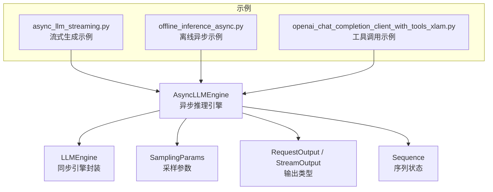
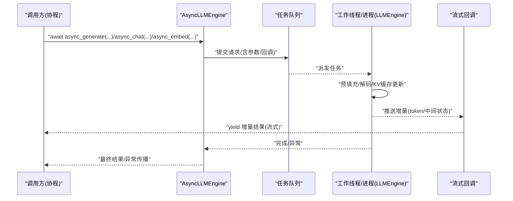
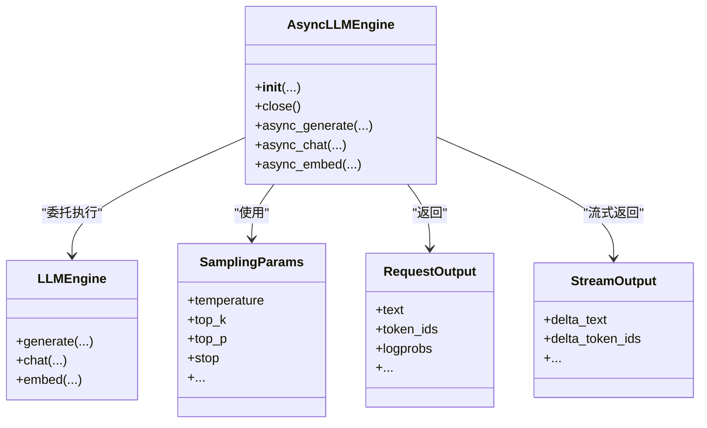
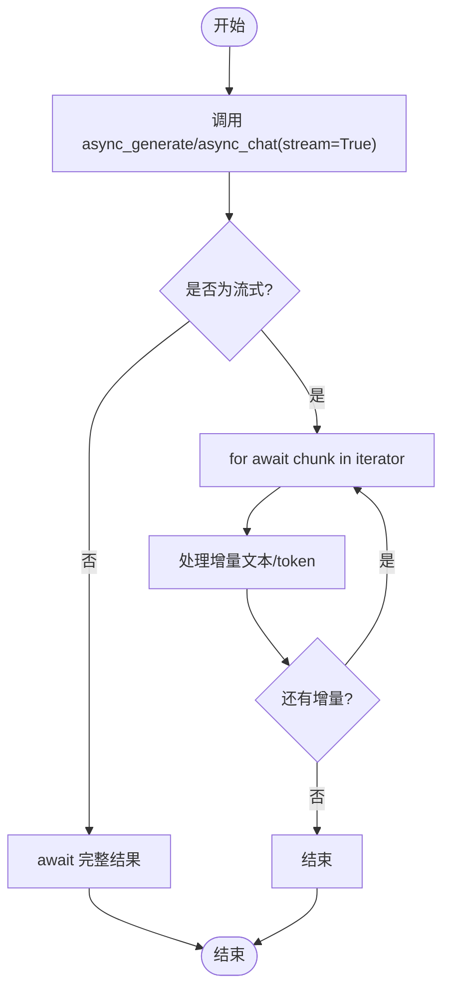
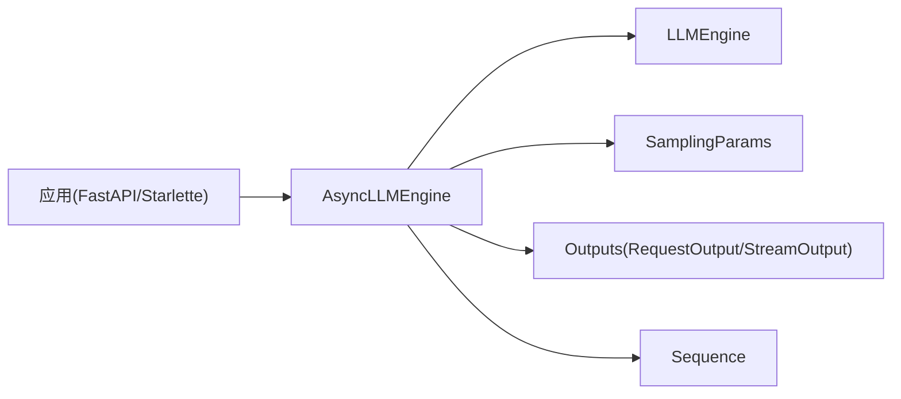

# 异步API接口

<cite>
**本文引用的文件**   
- [vllm/engine/async_llm_engine.py](file://vllm/engine/async_llm_engine.py)
- [examples/deployment/async_llm_streaming.py](file://examples/deployment/async_llm_streaming.py)
- [vllm/engine/llm_engine.py](file://vllm/engine/llm_engine.py)
- [vllm/sampling_params.py](file://vllm/sampling_params.py)
- [vllm/outputs.py](file://vllm/outputs.py)
- [vllm/sequence.py](file://vllm/sequence.py)
- [examples/basic/offline_inference/offline_inference_async.py](file://examples/basic/offline_inference/offline_inference_async.py)
- [examples/tool_calling/openai_chat_completion_client_with_tools_xlam.py](file://examples/tool_calling/openai_chat_completion_client_with_tools_xlam.py)
</cite>

## 目录
1. [简介](#简介)
2. [项目结构](#项目结构)
3. [核心组件](#核心组件)
4. [架构总览](#架构总览)
5. [详细组件分析](#详细组件分析)
6. [依赖关系分析](#依赖关系分析)
7. [性能考虑](#性能考虑)
8. [故障排查指南](#故障排查指南)
9. [结论](#结论)
10. [附录](#附录)

## 简介
本文件面向使用 vLLM 的开发者，系统化梳理 AsyncLLMEngine 的异步 API 设计与用法，重点覆盖：
- 异步初始化与资源管理（启动、关闭、上下文管理）
- 核心异步方法：async_generate()、async_chat()、async_embed() 的参数、返回值与流式输出
- 协程对象处理：await 语法、异步上下文、并发控制
- 高并发请求处理、流式响应与错误恢复实践
- 与 FastAPI、Starlette 等异步框架的集成方式
- 性能优化建议与内存管理最佳实践

## 项目结构
围绕 AsyncLLMEngine 的关键代码主要位于 engine 模块，示例与集成参考位于 examples 目录。下图展示了与异步引擎相关的核心文件及其职责。

图表来源
- [vllm/engine/async_llm_engine.py:1-200](file://vllm/engine/async_llm_engine.py#L1-L200)
- [vllm/engine/llm_engine.py:1-120](file://vllm/engine/llm_engine.py#L1-L120)
- [vllm/sampling_params.py:1-120](file://vllm/sampling_params.py#L1-L120)
- [vllm/outputs.py:1-120](file://vllm/outputs.py#L1-L120)
- [vllm/sequence.py:1-120](file://vllm/sequence.py#L1-L120)
- [examples/deployment/async_llm_streaming.py:1-120](file://examples/deployment/async_llm_streaming.py#L1-L120)
- [examples/basic/offline_inference/offline_inference_async.py:1-120](file://examples/basic/offline_inference/offline_inference_async.py#L1-L120)
- [examples/tool_calling/openai_chat_completion_client_with_tools_xlam.py:1-120](file://examples/tool_calling/openai_chat_completion_client_with_tools_xlam.py#L1-L120)

章节来源
- [vllm/engine/async_llm_engine.py:1-200](file://vllm/engine/async_llm_engine.py#L1-L200)
- [vllm/engine/llm_engine.py:1-120](file://vllm/engine/llm_engine.py#L1-L120)

## 核心组件
- AsyncLLMEngine：提供异步化的 LLM 推理入口，封装了模型加载、调度、KV Cache 管理与批处理，暴露 async_generate、async_chat、async_embed 等协程方法，支持流式输出与并发控制。
- LLMEngine：底层同步实现，被 AsyncLLMEngine 在事件循环中通过线程或进程隔离的方式调用，避免阻塞事件循环。
- SamplingParams：定义采样策略（温度、top-k/top-p、重复惩罚、停止词等），影响生成质量与速度。
- 输出类型：包括非流式结果对象与流式迭代器，便于逐步消费 token 增量。
- Sequence：表示一次推理请求的内部状态机，用于跟踪预填充、解码阶段与结束条件。

章节来源
- [vllm/engine/async_llm_engine.py:1-200](file://vllm/engine/async_llm_engine.py#L1-L200)
- [vllm/sampling_params.py:1-120](file://vllm/sampling_params.py#L1-L120)
- [vllm/outputs.py:1-120](file://vllm/outputs.py#L1-L120)
- [vllm/sequence.py:1-120](file://vllm/sequence.py#L1-L120)

## 架构总览
AsyncLLMEngine 将用户协程请求转换为内部任务队列，由工作线程/进程驱动 LLMEngine 执行，并通过回调将增量结果以流式形式返回给调用方。下图展示典型调用链与数据流向。

图表来源
- [vllm/engine/async_llm_engine.py:1-200](file://vllm/engine/async_llm_engine.py#L1-L200)
- [vllm/engine/llm_engine.py:1-120](file://vllm/engine/llm_engine.py#L1-L120)

## 详细组件分析

### AsyncLLMEngine 类概览
- 异步初始化与资源管理
  - 构造函数负责加载模型、初始化 KV Cache、配置并行策略与后端。
  - 提供 close()/shutdown() 等方法释放 GPU/CPU 资源，确保事件循环退出时不泄漏句柄。
  - 推荐结合异步上下文管理器使用，保证资源生命周期可控。
- 核心异步方法
  - async_generate(prompt, sampling_params, request_id=None, stream=False, ...)
    - 用途：文本生成（补全/对话轮次）。
    - 返回值：当 stream=False 时返回完整结果对象；当 stream=True 时返回可 await 的流式迭代器，逐块产出增量。
  - async_chat(messages, sampling_params, request_id=None, stream=False, ...)
    - 用途：基于消息列表的对话式生成，内部会按模板组装 prompt。
    - 返回值：同 async_generate，支持流式与非流式。
  - async_embed(inputs, pooling_params=None, request_id=None, ...)
    - 用途：文本嵌入向量计算。
    - 返回值：嵌入矩阵或单条向量，视输入形状而定。
- 并发与限流
  - 可通过内置队列容量、最大并发数、令牌桶/信号量等方式限制并发，避免 OOM 与背压不足。
  - 建议在网关层配合连接池与超时控制。

章节来源
- [vllm/engine/async_llm_engine.py:1-200](file://vllm/engine/async_llm_engine.py#L1-L200)

#### 类图（概念映射到源码）

图表来源
- [vllm/engine/async_llm_engine.py:1-200](file://vllm/engine/async_llm_engine.py#L1-L200)
- [vllm/engine/llm_engine.py:1-120](file://vllm/engine/llm_engine.py#L1-L120)
- [vllm/sampling_params.py:1-120](file://vllm/sampling_params.py#L1-L120)
- [vllm/outputs.py:1-120](file://vllm/outputs.py#L1-L120)

### async_generate() 用法与返回值
- 参数要点
  - prompt：字符串或结构化输入（取决于模型与模板）。
  - sampling_params：采样策略对象。
  - stream：是否启用流式输出。
  - request_id：可选的请求标识，便于追踪与日志。
- 行为说明
  - 非流式：一次性返回聚合后的完整结果。
  - 流式：返回一个异步迭代器，每次 yield 包含增量文本/token 等信息，适合实时展示。
- 返回值类型
  - 非流式：完整结果对象（包含文本、token IDs、logprobs 等字段）。
  - 流式：异步迭代器，元素为增量输出对象。

章节来源
- [vllm/engine/async_llm_engine.py:1-200](file://vllm/engine/async_llm_engine.py#L1-L200)
- [vllm/outputs.py:1-120](file://vllm/outputs.py#L1-L120)

### async_chat() 用法与返回值
- 参数要点
  - messages：消息列表（角色+内容），内部会按模板拼接成 prompt。
  - sampling_params：同上。
  - stream/request_id：同上。
- 行为说明
  - 与 async_generate 类似，但更适合多轮对话场景。
- 返回值类型
  - 非流式：完整结果对象。
  - 流式：异步迭代器，增量输出。

章节来源
- [vllm/engine/async_llm_engine.py:1-200](file://vllm/engine/async_llm_engine.py#L1-L200)

### async_embed() 用法与返回值
- 参数要点
  - inputs：单条或多条文本。
  - pooling_params：池化策略（如 mean/pooling 模式）。
- 行为说明
  - 计算文本嵌入向量，支持批量输入。
- 返回值类型
  - 嵌入矩阵或向量（根据输入维度决定）。

章节来源
- [vllm/engine/async_llm_engine.py:1-200](file://vllm/engine/async_llm_engine.py#L1-L200)

### 协程对象处理与并发控制
- await 语法
  - 所有异步方法均返回协程对象，必须使用 await 获取结果或迭代器。
- 异步上下文管理
  - 建议使用 with 语句或 try/finally 确保引擎正确关闭。
- 并发控制
  - 使用 asyncio.Semaphore 或 asyncio.TaskGroup 限制并发度。
  - 对长耗时任务设置超时，避免挂起。
  - 结合背压机制（如队列大小上限）防止内存暴涨。

章节来源
- [vllm/engine/async_llm_engine.py:1-200](file://vllm/engine/async_llm_engine.py#L1-L200)

### 流式响应处理流程

图表来源
- [examples/deployment/async_llm_streaming.py:1-120](file://examples/deployment/async_llm_streaming.py#L1-L120)

### 高并发请求处理示例
- 使用 asyncio.gather 或 TaskGroup 并发发起多个请求。
- 通过 Semaphore 限制同时运行的任务数量。
- 对每个任务设置超时与重试逻辑，提升鲁棒性。

章节来源
- [examples/basic/offline_inference/offline_inference_async.py:1-120](file://examples/basic/offline_inference/offline_inference_async.py#L1-L120)

### 错误恢复机制
- 常见异常
  - 网络/IO 超时、GPU 显存不足、模型加载失败、参数校验错误。
- 处理策略
  - 捕获具体异常类型，区分可重试与不可重试错误。
  - 对可重试错误实施指数退避重试。
  - 记录详细上下文（request_id、prompt 长度、采样参数）。

章节来源
- [vllm/engine/async_llm_engine.py:1-200](file://vllm/engine/async_llm_engine.py#L1-L200)

### 与 FastAPI/Starlette 集成
- 路由层
  - 使用 FastAPI 的异步路由函数接收请求，直接 await AsyncLLMEngine 的方法。
- 流式响应
  - 使用 StreamingResponse 将 async generator 的输出逐块写入 HTTP 响应。
- 并发与限流
  - 在应用层使用速率限制中间件或信号量控制并发。
- 健康检查与优雅关闭
  - 提供 /health 端点；服务关闭时调用引擎 close()。

章节来源
- [examples/tool_calling/openai_chat_completion_client_with_tools_xlam.py:1-120](file://examples/tool_calling/openai_chat_completion_client_with_tools_xlam.py#L1-L120)

## 依赖关系分析
- 组件耦合
  - AsyncLLMEngine 依赖 LLMEngine 进行实际计算，依赖 SamplingParams 控制生成策略，依赖输出类型进行结果封装。
- 外部依赖
  - 事件循环（asyncio）、可能的分布式通信库（如 NCCL/Ray，视部署配置）。
- 潜在循环依赖
  - 通过分层设计避免：engine 层不反向依赖上层应用。

图表来源
- [vllm/engine/async_llm_engine.py:1-200](file://vllm/engine/async_llm_engine.py#L1-L200)
- [vllm/engine/llm_engine.py:1-120](file://vllm/engine/llm_engine.py#L1-L120)
- [vllm/sampling_params.py:1-120](file://vllm/sampling_params.py#L1-L120)
- [vllm/outputs.py:1-120](file://vllm/outputs.py#L1-L120)
- [vllm/sequence.py:1-120](file://vllm/sequence.py#L1-L120)

章节来源
- [vllm/engine/async_llm_engine.py:1-200](file://vllm/engine/async_llm_engine.py#L1-L200)
- [vllm/engine/llm_engine.py:1-120](file://vllm/engine/llm_engine.py#L1-L120)

## 性能考虑
- 批处理与吞吐
  - 合理设置 batch_size、max_num_seqs，利用 vLLM 的 PagedAttention 与连续批处理提升吞吐。
- 延迟优化
  - 调整 temperature/top_k/top_p 以减少采样开销；使用合适的 stop 词减少无效生成。
- 内存管理
  - 监控 KV Cache 占用，必要时启用 offload 或压缩策略。
  - 及时关闭引擎与释放临时张量，避免内存碎片。
- I/O 与网络
  - 在网关层启用连接复用与超时；对大响应使用分块传输。
- 并发控制
  - 使用信号量限制并发，避免过载；对慢请求进行降级或熔断。

[本节为通用指导，无需特定文件引用]

## 故障排查指南
- 常见问题定位
  - 显存不足：降低 batch_size、缩短 prompt 长度、启用量化或 offload。
  - 超时：检查网络、GPU 负载、模型编译时间。
  - 输出异常：核对 sampling_params 与模板配置。
- 调试技巧
  - 开启详细日志，记录 request_id、输入长度、关键参数。
  - 使用最小复现用例隔离问题。
- 恢复策略
  - 自动重试（指数退避）、熔断与降级、优雅重启。

章节来源
- [vllm/engine/async_llm_engine.py:1-200](file://vllm/engine/async_llm_engine.py#L1-L200)

## 结论
AsyncLLMEngine 提供了高效、可扩展的异步推理能力，适用于高并发、低延迟的在线服务场景。通过合理的并发控制、流式输出与错误恢复机制，可以在保证稳定性的同时最大化吞吐。与 FastAPI/Starlette 的集成使得构建现代异步 API 变得简单可靠。

[本节为总结，无需特定文件引用]

## 附录
- 快速上手
  - 参考示例：async_llm_streaming.py（流式）、offline_inference_async.py（离线异步）、openai_chat_completion_client_with_tools_xlam.py（工具调用）。
- 最佳实践清单
  - 始终 await 异步方法；使用上下文管理器管理引擎生命周期；限制并发与超时；监控显存与延迟指标；对可重试错误实施退避策略。

章节来源
- [examples/deployment/async_llm_streaming.py:1-120](file://examples/deployment/async_llm_streaming.py#L1-L120)
- [examples/basic/offline_inference/offline_inference_async.py:1-120](file://examples/basic/offline_inference/offline_inference_async.py#L1-L120)
- [examples/tool_calling/openai_chat_completion_client_with_tools_xlam.py:1-120](file://examples/tool_calling/openai_chat_completion_client_with_tools_xlam.py#L1-L120)