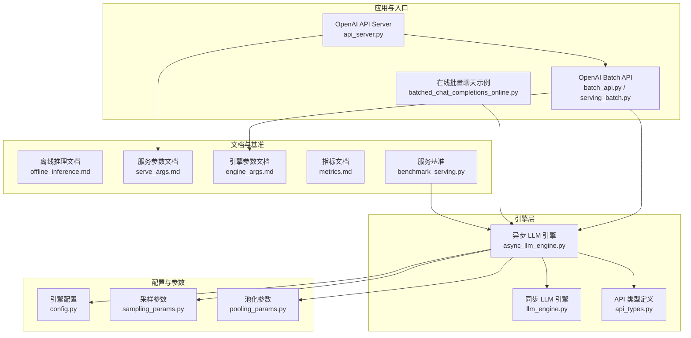
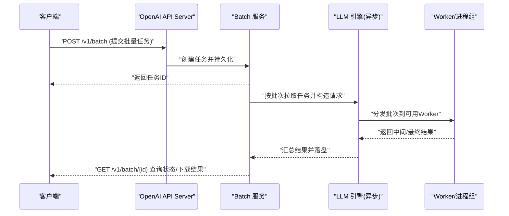
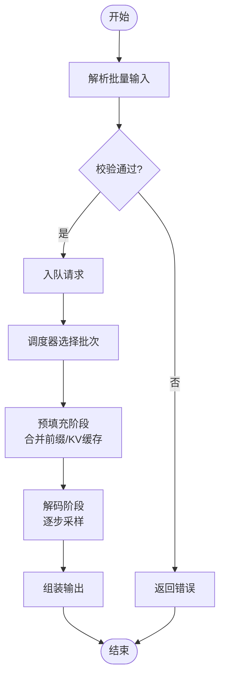
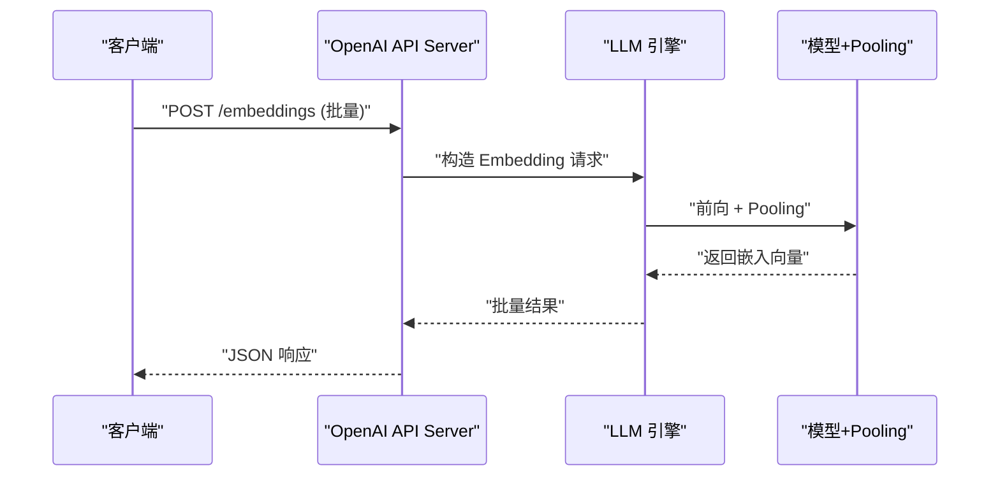
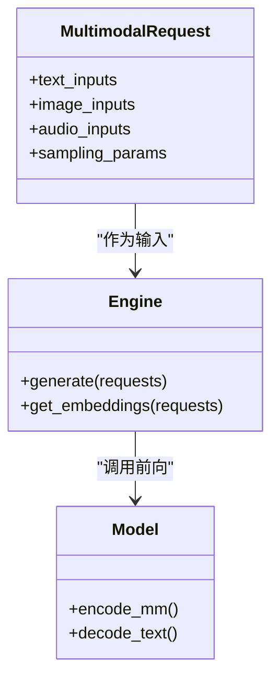
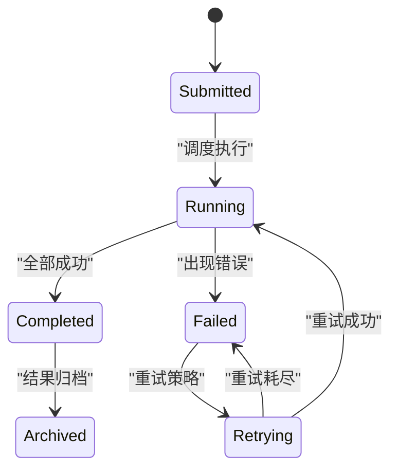
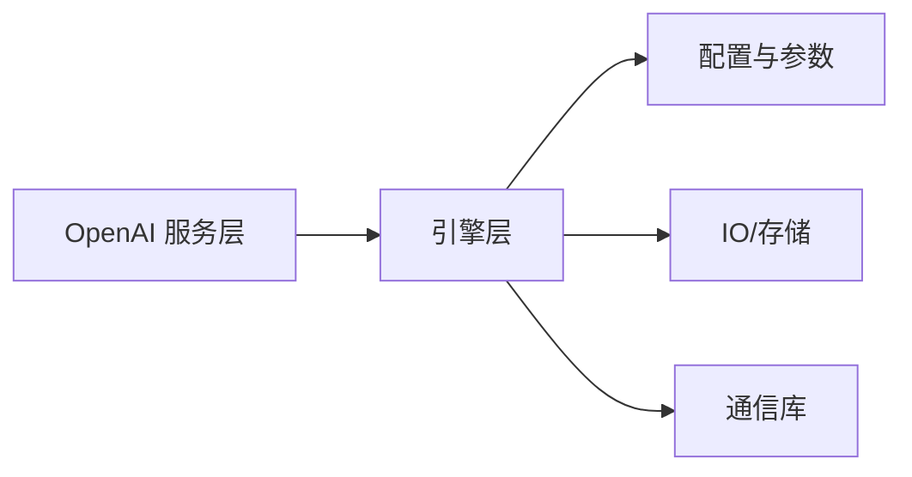

# 批量处理接口

<cite>
**本文引用的文件**   
- [vllm/engine/async_llm_engine.py](file://vllm/engine/async_llm_engine.py)
- [vllm/engine/llm_engine.py](file://vllm/engine/llm_engine.py)
- [vllm/engine/api_types.py](file://vllm/engine/api_types.py)
- [vllm/entrypoints/openai/api_server.py](file://vllm/entrypoints/openai/api_server.py)
- [vllm/entrypoints/openai/batch_api.py](file://vllm/entrypoints/openai/batch_api.py)
- [vllm/entrypoints/openai/serving_batch.py](file://vllm/entrypoints/openai/serving_batch.py)
- [vllm/config.py](file://vllm/config.py)
- [vllm/sampling_params.py](file://vllm/sampling_params.py)
- [vllm/pooling_params.py](file://vllm/pooling_params.py)
- [benchmarks/benchmark_serving.py](file://benchmarks/benchmark_serving.py)
- [examples/generate/batched_chat_completions_online.py](file://examples/generate/batched_chat_completions_online.py)
- [examples/pooling/embed/embedding_client.py](file://examples/pooling/embed/embedding_client.py)
- [examples/generate/multimodal/vlm_example.py](file://examples/generate/multimodal/vlm_example.py)
- [docs/configuration/engine_args.md](file://docs/configuration/engine_args.md)
- [docs/configuration/serve_args.md](file://docs/configuration/serve_args.md)
- [docs/usage/metrics.md](file://docs/usage/metrics.md)
- [docs/design/multiprocessing.md](file://docs/design/multiprocessing.md)
- [docs/serving/offline_inference.md](file://docs/serving/offline_inference.md)
</cite>

## 目录
1. [简介](#简介)
2. [项目结构](#项目结构)
3. [核心组件](#核心组件)
4. [架构总览](#架构总览)
5. [详细组件分析](#详细组件分析)
6. [依赖关系分析](#依赖关系分析)
7. [性能考量](#性能考量)
8. [故障排查指南](#故障排查指南)
9. [结论](#结论)
10. [附录](#附录)

## 简介
本文件面向需要在 vLLM 中实现“批量生成与推理”的用户，系统性说明：
- 批量输入数据的组织格式与批处理参数配置
- 批处理大小调优策略与内存使用优化技巧
- 调度机制与资源分配策略
- 完整示例：文本批量生成、嵌入计算、多模态数据处理
- 批处理性能指标与监控方法
- 错误处理与重试机制的实现方案
- 与分布式批处理的集成方式

## 项目结构
围绕批量处理的关键代码分布在引擎层、OpenAI 服务层、配置与参数定义、以及示例与基准脚本中。下图给出与批量处理相关的主要模块及其职责概览。

图表来源
- [vllm/entrypoints/openai/api_server.py](file://vllm/entrypoints/openai/api_server.py)
- [vllm/entrypoints/openai/batch_api.py](file://vllm/entrypoints/openai/batch_api.py)
- [vllm/entrypoints/openai/serving_batch.py](file://vllm/entrypoints/openai/serving_batch.py)
- [vllm/engine/async_llm_engine.py](file://vllm/engine/async_llm_engine.py)
- [vllm/engine/llm_engine.py](file://vllm/engine/llm_engine.py)
- [vllm/engine/api_types.py](file://vllm/engine/api_types.py)
- [vllm/config.py](file://vllm/config.py)
- [vllm/sampling_params.py](file://vllm/sampling_params.py)
- [vllm/pooling_params.py](file://vllm/pooling_params.py)
- [docs/serving/offline_inference.md](file://docs/serving/offline_inference.md)
- [docs/configuration/serve_args.md](file://docs/configuration/serve_args.md)
- [docs/configuration/engine_args.md](file://docs/configuration/engine_args.md)
- [docs/usage/metrics.md](file://docs/usage/metrics.md)
- [benchmarks/benchmark_serving.py](file://benchmarks/benchmark_serving.py)

章节来源
- [vllm/engine/async_llm_engine.py](file://vllm/engine/async_llm_engine.py)
- [vllm/engine/llm_engine.py](file://vllm/engine/llm_engine.py)
- [vllm/entrypoints/openai/api_server.py](file://vllm/entrypoints/openai/api_server.py)
- [vllm/entrypoints/openai/batch_api.py](file://vllm/entrypoints/openai/batch_api.py)
- [vllm/entrypoints/openai/serving_batch.py](file://vllm/entrypoints/openai/serving_batch.py)
- [vllm/config.py](file://vllm/config.py)
- [vllm/sampling_params.py](file://vllm/sampling_params.py)
- [vllm/pooling_params.py](file://vllm/pooling_params.py)
- [docs/serving/offline_inference.md](file://docs/serving/offline_inference.md)
- [docs/configuration/serve_args.md](file://docs/configuration/serve_args.md)
- [docs/configuration/engine_args.md](file://docs/configuration/engine_args.md)
- [docs/usage/metrics.md](file://docs/usage/metrics.md)
- [benchmarks/benchmark_serving.py](file://benchmarks/benchmark_serving.py)

## 核心组件
- 引擎层（Engine）
  - 异步引擎负责请求入队、调度、分块执行、结果回传；同步引擎提供阻塞式调用。
  - 两者均通过统一的 API 类型进行输入输出建模，屏蔽底层差异。
- OpenAI 服务层
  - API Server 暴露 REST 接口，将 HTTP 请求转换为引擎可消费的请求对象。
  - Batch API 提供异步批量任务提交、状态查询与结果下载能力。
- 配置与参数
  - 引擎参数控制并行度、KV 缓存、量化、CUDA Graph 等关键性能选项。
  - 采样参数控制生成质量与速度；池化参数控制嵌入/打分等任务的归一化与聚合。

章节来源
- [vllm/engine/async_llm_engine.py](file://vllm/engine/async_llm_engine.py)
- [vllm/engine/llm_engine.py](file://vllm/engine/llm_engine.py)
- [vllm/engine/api_types.py](file://vllm/engine/api_types.py)
- [vllm/entrypoints/openai/api_server.py](file://vllm/entrypoints/openai/api_server.py)
- [vllm/entrypoints/openai/batch_api.py](file://vllm/entrypoints/openai/batch_api.py)
- [vllm/entrypoints/openai/serving_batch.py](file://vllm/entrypoints/openai/serving_batch.py)
- [vllm/config.py](file://vllm/config.py)
- [vllm/sampling_params.py](file://vllm/sampling_params.py)
- [vllm/pooling_params.py](file://vllm/pooling_params.py)

## 架构总览
下图展示从客户端到引擎的批量处理主流程，包括 OpenAI Batch 任务的生命周期与引擎内部调度。

图表来源
- [vllm/entrypoints/openai/api_server.py](file://vllm/entrypoints/openai/api_server.py)
- [vllm/entrypoints/openai/batch_api.py](file://vllm/entrypoints/openai/batch_api.py)
- [vllm/entrypoints/openai/serving_batch.py](file://vllm/entrypoints/openai/serving_batch.py)
- [vllm/engine/async_llm_engine.py](file://vllm/engine/async_llm_engine.py)

章节来源
- [vllm/entrypoints/openai/api_server.py](file://vllm/entrypoints/openai/api_server.py)
- [vllm/entrypoints/openai/batch_api.py](file://vllm/entrypoints/openai/batch_api.py)
- [vllm/entrypoints/openai/serving_batch.py](file://vllm/entrypoints/openai/serving_batch.py)
- [vllm/engine/async_llm_engine.py](file://vllm/engine/async_llm_engine.py)

## 详细组件分析

### 批量生成（文本）
- 输入组织
  - 单条请求包含 prompt、可选的多模态数据、采样参数等；批量即多条请求的集合。
  - 对于 Chat 场景，消息列表需遵循统一的消息格式规范。
- 批处理参数
  - 采样参数：温度、top-k/top-p、重复惩罚、停止条件、最大生成长度等。
  - 引擎参数：max_num_seqs、max_num_batched_tokens、kv_cache_dtype、num_scheduler_steps 等。
- 调度与执行
  - 引擎将请求放入队列，按 token 级或步长级调度，合并相同前缀以复用 KV 缓存。
  - 支持 CUDA Graph、Paged Attention、Prefix Cache 等加速手段。
- 结果返回
  - 逐条返回生成结果，支持流式与非流式两种模式。

图表来源
- [vllm/engine/async_llm_engine.py](file://vllm/engine/async_llm_engine.py)
- [vllm/engine/api_types.py](file://vllm/engine/api_types.py)
- [vllm/sampling_params.py](file://vllm/sampling_params.py)

章节来源
- [vllm/engine/async_llm_engine.py](file://vllm/engine/async_llm_engine.py)
- [vllm/engine/api_types.py](file://vllm/engine/api_types.py)
- [vllm/sampling_params.py](file://vllm/sampling_params.py)
- [examples/generate/batched_chat_completions_online.py](file://examples/generate/batched_chat_completions_online.py)

### 嵌入计算（Pooling）
- 输入组织
  - 文本或图像等多模态输入，配合池化参数（如 pooling_mode、normalize 等）。
- 批处理参数
  - 池化参数决定如何聚合 token 向量得到句向量；采样参数通常不适用。
- 执行路径
  - 模型前向后进入 pooling 层，按请求维度聚合，返回固定维度的嵌入向量。

图表来源
- [vllm/entrypoints/openai/api_server.py](file://vllm/entrypoints/openai/api_server.py)
- [vllm/engine/async_llm_engine.py](file://vllm/engine/async_llm_engine.py)
- [vllm/pooling_params.py](file://vllm/pooling_params.py)

章节来源
- [vllm/pooling_params.py](file://vllm/pooling_params.py)
- [examples/pooling/embed/embedding_client.py](file://examples/pooling/embed/embedding_client.py)

### 多模态数据处理
- 输入组织
  - 文本与图像/音频等模态组合，需在请求中明确各模态的数据结构与顺序。
- 批处理要点
  - 不同模态的预处理与对齐会影响批内效率；建议尽量保持模态一致以减少动态形状。
- 执行路径
  - 多模态编码器与语言模型协同，注意显存峰值与序列长度上限。

图表来源
- [vllm/engine/api_types.py](file://vllm/engine/api_types.py)
- [vllm/engine/async_llm_engine.py](file://vllm/engine/async_llm_engine.py)
- [examples/generate/multimodal/vlm_example.py](file://examples/generate/multimodal/vlm_example.py)

章节来源
- [vllm/engine/api_types.py](file://vllm/engine/api_types.py)
- [vllm/engine/async_llm_engine.py](file://vllm/engine/async_llm_engine.py)
- [examples/generate/multimodal/vlm_example.py](file://examples/generate/multimodal/vlm_example.py)

### OpenAI Batch API（异步批量任务）
- 任务生命周期
  - 提交任务 -> 排队 -> 执行 -> 结果落盘 -> 查询/下载。
- 批处理策略
  - 服务端根据资源情况对任务进行分片与重排，避免 OOM 与长时间阻塞。
- 监控与诊断
  - 通过状态码与日志定位失败原因，结合指标面板观察吞吐与延迟。

图表来源
- [vllm/entrypoints/openai/batch_api.py](file://vllm/entrypoints/openai/batch_api.py)
- [vllm/entrypoints/openai/serving_batch.py](file://vllm/entrypoints/openai/serving_batch.py)

章节来源
- [vllm/entrypoints/openai/batch_api.py](file://vllm/entrypoints/openai/batch_api.py)
- [vllm/entrypoints/openai/serving_batch.py](file://vllm/entrypoints/openai/serving_batch.py)

## 依赖关系分析
- 组件耦合
  - OpenAI 服务层依赖引擎层提供的生成/嵌入接口；引擎层依赖配置与参数定义。
- 外部依赖
  - GPU/CPU 设备、通信库（NCCL 等）、存储（结果落盘）等。
- 潜在循环依赖
  - 通过接口抽象与分层设计避免循环依赖。

图表来源
- [vllm/entrypoints/openai/api_server.py](file://vllm/entrypoints/openai/api_server.py)
- [vllm/engine/async_llm_engine.py](file://vllm/engine/async_llm_engine.py)
- [vllm/config.py](file://vllm/config.py)

章节来源
- [vllm/entrypoints/openai/api_server.py](file://vllm/entrypoints/openai/api_server.py)
- [vllm/engine/async_llm_engine.py](file://vllm/engine/async_llm_engine.py)
- [vllm/config.py](file://vllm/config.py)

## 性能考量
- 批处理大小调优
  - 依据显存容量、序列长度分布与模型复杂度调整 max_num_seqs 与 max_num_batched_tokens。
  - 短序列密集时优先增大 batch size；长序列混合时采用动态批或分桶策略。
- 内存优化
  - 启用 KV 缓存压缩、量化（FP8/INT8）、CUDA Graph、Paged Attention。
  - 合理设置 offload 与共享内存，降低峰值显存。
- 调度与并行
  - 使用多进程/分布式并行（张量并行、流水线并行、专家并行）提升吞吐。
  - 利用 Prefix Cache 减少重复计算。
- 监控与基准
  - 采集吞吐、延迟、显存占用、GPU 利用率等指标；使用基准脚本进行回归测试。

章节来源
- [docs/configuration/engine_args.md](file://docs/configuration/engine_args.md)
- [docs/configuration/serve_args.md](file://docs/configuration/serve_args.md)
- [docs/usage/metrics.md](file://docs/usage/metrics.md)
- [benchmarks/benchmark_serving.py](file://benchmarks/benchmark_serving.py)
- [docs/design/multiprocessing.md](file://docs/design/multiprocessing.md)

## 故障排查指南
- 常见问题
  - OOM：降低批大小、启用量化、关闭不必要的特性（如 CUDA Graph）。
  - 超时：增加超时阈值、检查网络与存储 IO。
  - 结果不一致：检查随机种子、采样参数与模型版本。
- 错误处理与重试
  - 在 Batch API 层实现幂等提交与自动重试；记录失败明细以便人工干预。
  - 引擎层捕获异常并回传结构化错误信息。
- 诊断工具
  - 查看服务日志、Prometheus/Grafana 指标、内核 profiling 工具。

章节来源
- [vllm/entrypoints/openai/batch_api.py](file://vllm/entrypoints/openai/batch_api.py)
- [vllm/entrypoints/openai/serving_batch.py](file://vllm/entrypoints/openai/serving_batch.py)
- [docs/usage/metrics.md](file://docs/usage/metrics.md)

## 结论
vLLM 提供了完善的批量处理基础设施，覆盖文本生成、嵌入计算与多模态场景。通过合理的批大小调优、内存优化与分布式并行，可在保证稳定性的前提下最大化吞吐。借助 OpenAI Batch API 与完善的监控体系，可实现高可靠的离线批量推理。

## 附录
- 完整示例
  - 文本批量生成：参考在线批量聊天示例。
  - 嵌入计算：参考嵌入客户端示例。
  - 多模态数据处理：参考 VLM 示例。
- 离线推理
  - 参考离线推理文档了解无服务模式的批量处理用法。

章节来源
- [examples/generate/batched_chat_completions_online.py](file://examples/generate/batched_chat_completions_online.py)
- [examples/pooling/embed/embedding_client.py](file://examples/pooling/embed/embedding_client.py)
- [examples/generate/multimodal/vlm_example.py](file://examples/generate/multimodal/vlm_example.py)
- [docs/serving/offline_inference.md](file://docs/serving/offline_inference.md)