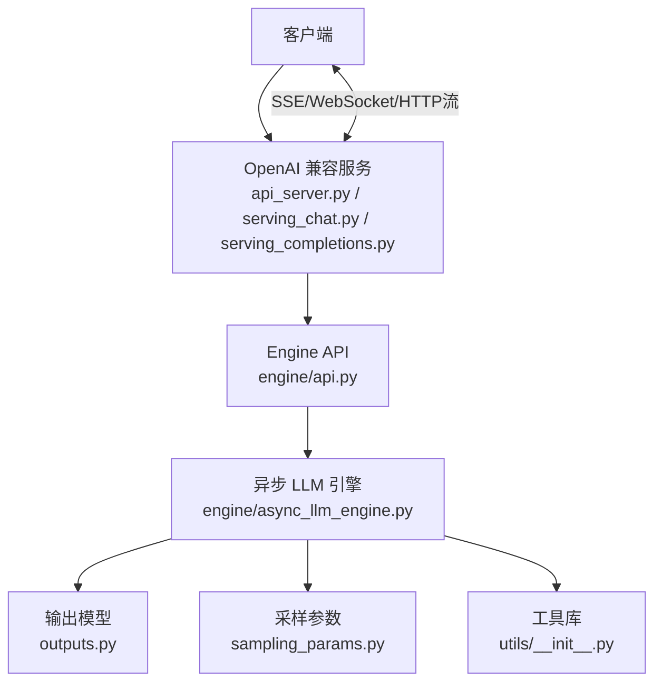
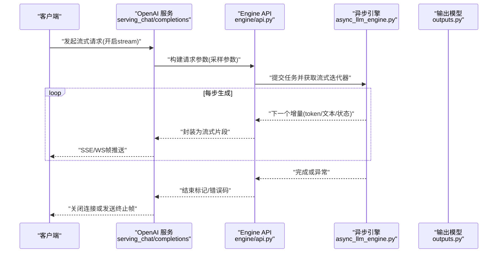
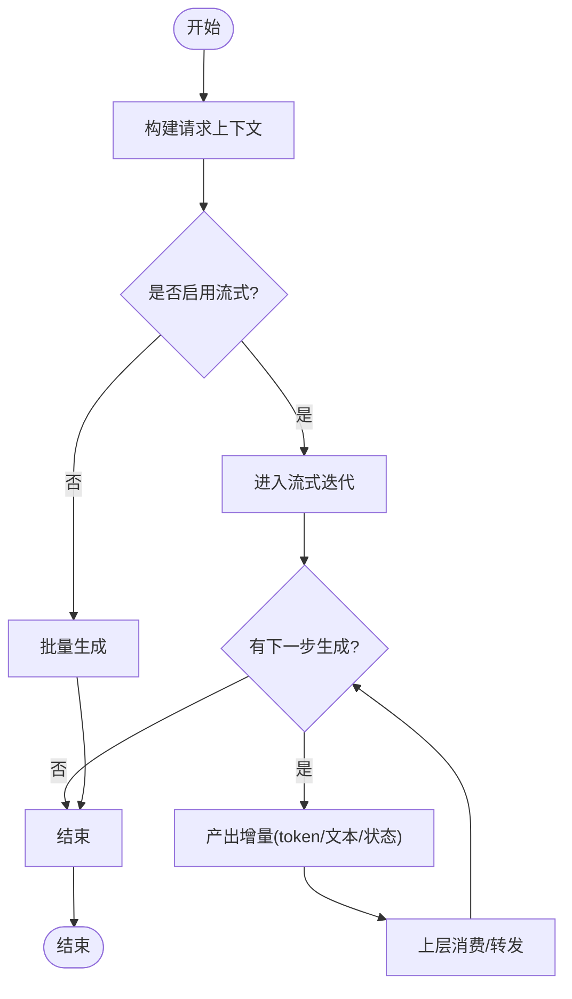
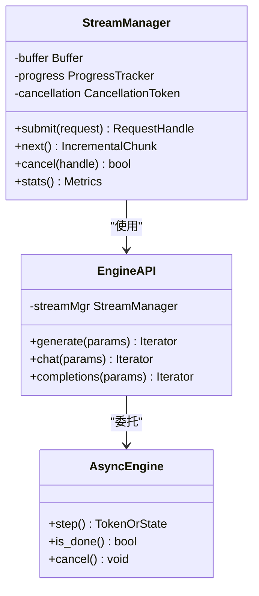
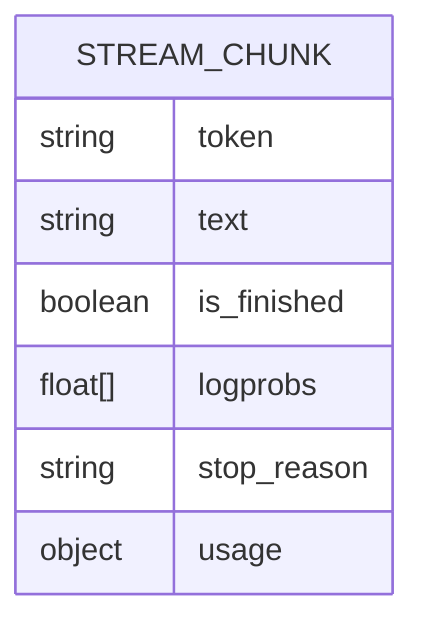
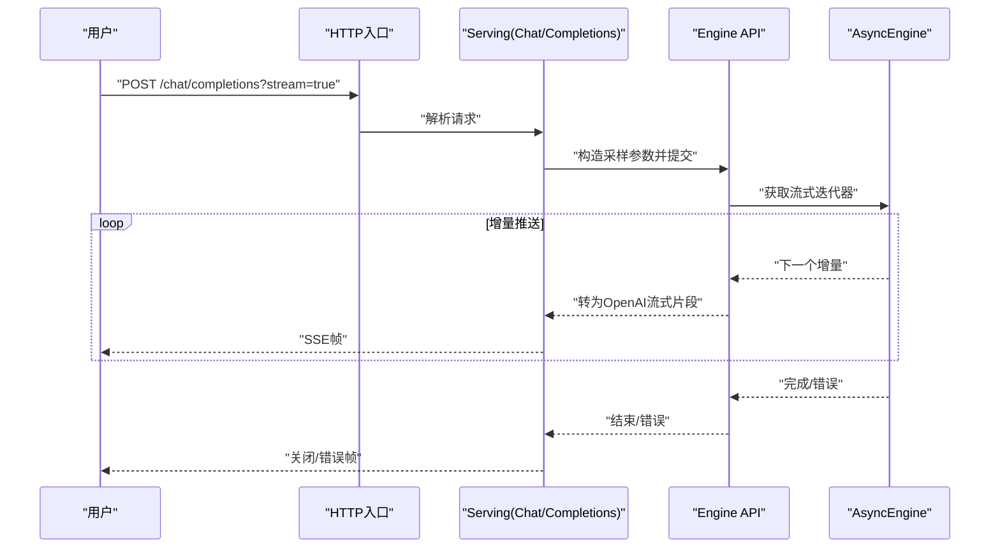
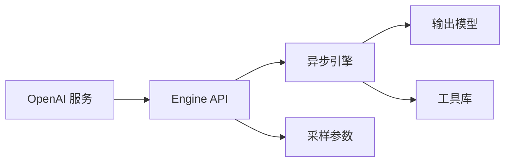

# 流式输出接口

<cite>
**本文引用的文件**   
- [vllm/engine/async_llm_engine.py](file://vllm/engine/async_llm_engine.py)
- [vllm/engine/api.py](file://vllm/engine/api.py)
- [vllm/outputs.py](file://vllm/outputs.py)
- [vllm/sampling_params.py](file://vllm/sampling_params.py)
- [examples/deployment/async_llm_streaming.py](file://examples/deployment/async_llm_streaming.py)
- [vllm/entrypoints/openai/api_server.py](file://vllm/entrypoints/openai/api_server.py)
- [vllm/entrypoints/openai/serving_chat.py](file://vllm/entrypoints/openai/serving_chat.py)
- [vllm/entrypoints/openai/serving_completions.py](file://vllm/entrypoints/openai/serving_completions.py)
- [vllm/utils/__init__.py](file://vllm/utils/__init__.py)
</cite>

## 目录
1. [简介](#简介)
2. [项目结构](#项目结构)
3. [核心组件](#核心组件)
4. [架构总览](#架构总览)
5. [详细组件分析](#详细组件分析)
6. [依赖关系分析](#依赖关系分析)
7. [性能考虑](#性能考虑)
8. [故障排查指南](#故障排查指南)
9. [结论](#结论)
10. [附录](#附录)

## 简介
本文件面向需要在 vLLM 中实现“流式输出”的开发者，系统性阐述增量 token 生成与推送机制、StreamManager 的使用方式、流式响应数据结构、端到端示例（实时文本、进度跟踪、中断处理）、性能优化与缓冲区管理策略、与 WebSockets/Server-Sent Events 的集成方案、错误处理与重连机制，以及监控与调试方法。文档以仓库中的异步引擎、OpenAI 兼容服务、输出模型和示例脚本为依据，确保内容与实际实现一致。

## 项目结构
与流式输出相关的关键位置：
- 异步推理引擎与流式调度：vllm/engine/async_llm_engine.py
- 高层 API 封装：vllm/engine/api.py
- 输出数据模型（含流式片段）：vllm/outputs.py
- 采样参数（控制流式行为）：vllm/sampling_params.py
- 流式示例脚本：examples/deployment/async_llm_streaming.py
- OpenAI 兼容服务端（支持流式 Chat/Completions）：vllm/entrypoints/openai/api_server.py, serving_chat.py, serving_completions.py
- 通用工具（如事件循环、协程辅助等）：vllm/utils/__init__.py

图表来源
- [vllm/entrypoints/openai/api_server.py](file://vllm/entrypoints/openai/api_server.py)
- [vllm/entrypoints/openai/serving_chat.py](file://vllm/entrypoints/openai/serving_chat.py)
- [vllm/entrypoints/openai/serving_completions.py](file://vllm/entrypoints/openai/serving_completions.py)
- [vllm/engine/api.py](file://vllm/engine/api.py)
- [vllm/engine/async_llm_engine.py](file://vllm/engine/async_llm_engine.py)
- [vllm/outputs.py](file://vllm/outputs.py)
- [vllm/sampling_params.py](file://vllm/sampling_params.py)
- [vllm/utils/__init__.py](file://vllm/utils/__init__.py)

章节来源
- [vllm/engine/async_llm_engine.py](file://vllm/engine/async_llm_engine.py)
- [vllm/engine/api.py](file://vllm/engine/api.py)
- [vllm/outputs.py](file://vllm/outputs.py)
- [vllm/sampling_params.py](file://vllm/sampling_params.py)
- [examples/deployment/async_llm_streaming.py](file://examples/deployment/async_llm_streaming.py)
- [vllm/entrypoints/openai/api_server.py](file://vllm/entrypoints/openai/api_server.py)
- [vllm/entrypoints/openai/serving_chat.py](file://vllm/entrypoints/openai/serving_chat.py)
- [vllm/entrypoints/openai/serving_completions.py](file://vllm/entrypoints/openai/serving_completions.py)
- [vllm/utils/__init__.py](file://vllm/utils/__init__.py)

## 核心组件
- 异步 LLM 引擎：提供基于协程的增量生成能力，按步产出 token 并允许上层按需消费。
- Engine API：对引擎进行统一封装，暴露流式迭代接口与请求生命周期管理。
- 输出模型：定义流式片段的字段结构（如 token、累积文本、完成标志、日志概率等）。
- 采样参数：控制是否启用流式、最大生成长度、停止条件、温度等。
- OpenAI 兼容服务：将 HTTP/SSE/WebSocket 请求转换为引擎调用，并以流式协议返回增量结果。
- 工具库：提供事件循环、超时、取消、缓冲等基础能力。

章节来源
- [vllm/engine/async_llm_engine.py](file://vllm/engine/async_llm_engine.py)
- [vllm/engine/api.py](file://vllm/engine/api.py)
- [vllm/outputs.py](file://vllm/outputs.py)
- [vllm/sampling_params.py](file://vllm/sampling_params.py)
- [vllm/entrypoints/openai/api_server.py](file://vllm/entrypoints/openai/api_server.py)
- [vllm/entrypoints/openai/serving_chat.py](file://vllm/entrypoints/openai/serving_chat.py)
- [vllm/entrypoints/openai/serving_completions.py](file://vllm/entrypoints/openai/serving_completions.py)
- [vllm/utils/__init__.py](file://vllm/utils/__init__.py)

## 架构总览
下图展示了从客户端到引擎再到输出的完整流式链路，包括 OpenAI 兼容层如何将流式协议映射为引擎的增量 token 推送。

图表来源
- [vllm/entrypoints/openai/serving_chat.py](file://vllm/entrypoints/openai/serving_chat.py)
- [vllm/entrypoints/openai/serving_completions.py](file://vllm/entrypoints/openai/serving_completions.py)
- [vllm/engine/api.py](file://vllm/engine/api.py)
- [vllm/engine/async_llm_engine.py](file://vllm/engine/async_llm_engine.py)
- [vllm/outputs.py](file://vllm/outputs.py)

## 详细组件分析

### 异步 LLM 引擎与流式迭代
- 引擎通过协程驱动解码过程，逐步产出 token 或文本片段。
- 上层可通过迭代器或回调消费增量，避免等待全部生成完毕。
- 支持在生成过程中响应取消信号，及时释放资源。

图表来源
- [vllm/engine/async_llm_engine.py](file://vllm/engine/async_llm_engine.py)

章节来源
- [vllm/engine/async_llm_engine.py](file://vllm/engine/async_llm_engine.py)

### Engine API 与 StreamManager
- Engine API 负责将用户请求转换为引擎可执行的流式任务，并提供统一的迭代接口。
- StreamManager（概念性组件）用于管理单个请求的生命周期、缓冲、进度追踪、中断与重试。
- 典型职责：
  - 维护请求队列与优先级
  - 管理增量缓冲与背压
  - 处理取消/超时/错误恢复
  - 统计吞吐、延迟、token 数等指标

图表来源
- [vllm/engine/api.py](file://vllm/engine/api.py)
- [vllm/engine/async_llm_engine.py](file://vllm/engine/async_llm_engine.py)

章节来源
- [vllm/engine/api.py](file://vllm/engine/api.py)
- [vllm/engine/async_llm_engine.py](file://vllm/engine/async_llm_engine.py)

### 流式响应数据结构
- 增量片段通常包含：
  - token 或文本片段
  - 累计文本
  - 完成标志（是否结束）
  - 可选的 logprobs、stop_reason、usage 统计等
- 这些字段由输出模型统一定义，保证各层一致性。

图表来源
- [vllm/outputs.py](file://vllm/outputs.py)

章节来源
- [vllm/outputs.py](file://vllm/outputs.py)

### 采样参数与流式控制
- 关键参数：
  - stream: 是否启用流式
  - max_tokens: 最大生成长度
  - stop: 停止字符串/序列
  - temperature/top_p/top_k: 采样策略
- 这些参数影响流式产出的粒度与终止条件。

章节来源
- [vllm/sampling_params.py](file://vllm/sampling_params.py)

### OpenAI 兼容服务的流式实现
- 服务层接收 HTTP 请求，根据 stream 标志选择流式或非流式路径。
- 对于流式请求，采用 SSE 或 WebSocket 逐帧推送增量片段。
- 将引擎的增量片段映射为 OpenAI 风格的流式响应格式。

图表来源
- [vllm/entrypoints/openai/api_server.py](file://vllm/entrypoints/openai/api_server.py)
- [vllm/entrypoints/openai/serving_chat.py](file://vllm/entrypoints/openai/serving_chat.py)
- [vllm/entrypoints/openai/serving_completions.py](file://vllm/entrypoints/openai/serving_completions.py)
- [vllm/engine/api.py](file://vllm/engine/api.py)
- [vllm/engine/async_llm_engine.py](file://vllm/engine/async_llm_engine.py)

章节来源
- [vllm/entrypoints/openai/api_server.py](file://vllm/entrypoints/openai/api_server.py)
- [vllm/entrypoints/openai/serving_chat.py](file://vllm/entrypoints/openai/serving_chat.py)
- [vllm/entrypoints/openai/serving_completions.py](file://vllm/entrypoints/openai/serving_completions.py)

### 完整流式处理示例
- 参考示例脚本展示如何：
  - 启动异步引擎
  - 设置采样参数（启用流式）
  - 迭代增量片段并打印/转发
  - 处理中断与异常
  - 统计进度与耗时

章节来源
- [examples/deployment/async_llm_streaming.py](file://examples/deployment/async_llm_streaming.py)

## 依赖关系分析
- 服务层依赖 Engine API 与输出模型，Engine API 依赖异步引擎。
- 采样参数贯穿全链路，决定流式行为与终止条件。
- 工具库提供事件循环、取消、缓冲等基础设施。

图表来源
- [vllm/entrypoints/openai/api_server.py](file://vllm/entrypoints/openai/api_server.py)
- [vllm/engine/api.py](file://vllm/engine/api.py)
- [vllm/engine/async_llm_engine.py](file://vllm/engine/async_llm_engine.py)
- [vllm/outputs.py](file://vllm/outputs.py)
- [vllm/sampling_params.py](file://vllm/sampling_params.py)
- [vllm/utils/__init__.py](file://vllm/utils/__init__.py)

章节来源
- [vllm/entrypoints/openai/api_server.py](file://vllm/entrypoints/openai/api_server.py)
- [vllm/engine/api.py](file://vllm/engine/api.py)
- [vllm/engine/async_llm_engine.py](file://vllm/engine/async_llm_engine.py)
- [vllm/outputs.py](file://vllm/outputs.py)
- [vllm/sampling_params.py](file://vllm/sampling_params.py)
- [vllm/utils/__init__.py](file://vllm/utils/__init__.py)

## 性能考虑
- 增量缓冲策略：
  - 合理设置缓冲大小，避免频繁 I/O 与内存抖动
  - 使用零拷贝或最小化序列化开销
- 背压与限流：
  - 当客户端消费慢时，暂停上游生成或丢弃低优先级请求
- 并发与批处理：
  - 合并小批次请求，提高 GPU 利用率
  - 控制并发上限，防止过载
- 网络传输：
  - 优先使用 SSE/WS，减少握手与头部开销
  - 压缩可选，但需权衡 CPU 成本
- 资源回收：
  - 及时释放 KV Cache、张量与句柄
  - 在取消/异常路径上确保清理

[本节为通用指导，不直接分析具体文件]

## 故障排查指南
- 常见问题定位：
  - 流卡住：检查迭代器是否被正确消费、是否存在死锁或阻塞 I/O
  - 内存泄漏：确认增量缓冲未持续增长、对象未被引用
  - 中断无效：验证取消信号是否正确传递至引擎
  - 错误恢复：记录错误码与堆栈，区分网络错误与引擎内部错误
- 监控与调试：
  - 采集吞吐、延迟、token 数、失败率等指标
  - 使用结构化日志记录关键节点（提交、产出、结束、错误）
  - 结合分布式追踪（如 OpenTelemetry）串联跨进程调用链

章节来源
- [vllm/utils/__init__.py](file://vllm/utils/__init__.py)

## 结论
vLLM 的流式输出通过异步引擎与统一 API 层协作，配合输出模型与采样参数，实现了高效、可控的增量 token 推送。OpenAI 兼容服务将流式协议无缝映射到引擎能力，便于上层快速集成。通过合理的缓冲、背压、并发与资源管理策略，可在高负载下保持低延迟与高吞吐。完善的错误处理、监控与调试手段有助于在生产环境中稳定运行。

[本节为总结，不直接分析具体文件]

## 附录
- 与 WebSockets 集成要点：
  - 建立双向通道，服务端按增量推送帧，客户端可发送取消/心跳
  - 处理断线重连与消息顺序
- 与 Server-Sent Events 集成要点：
  - 使用 SSE 单向推送，服务端维持长连接
  - 处理客户端断开与重试逻辑
- 最佳实践清单：
  - 始终设置合理的 max_tokens 与 stop 条件
  - 启用超时与取消，避免僵尸任务
  - 采集关键指标并设置告警阈值
  - 在测试环境验证极端场景（大输入、长输出、高并发）

[本节为补充说明，不直接分析具体文件]