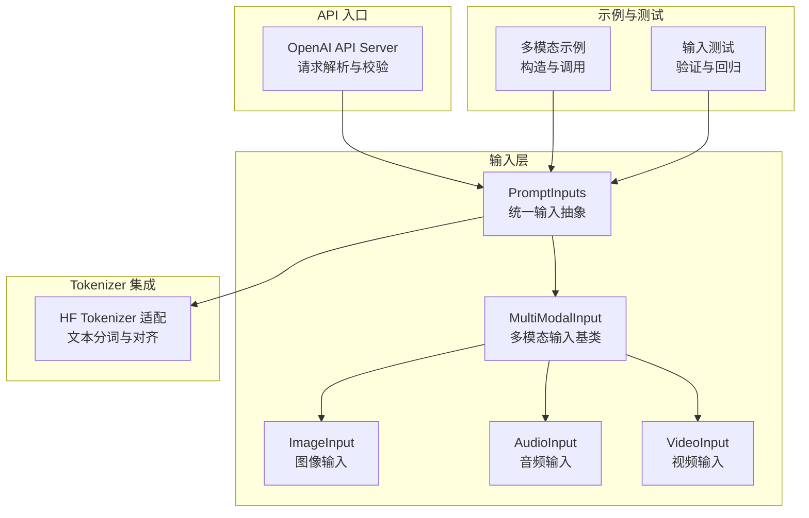
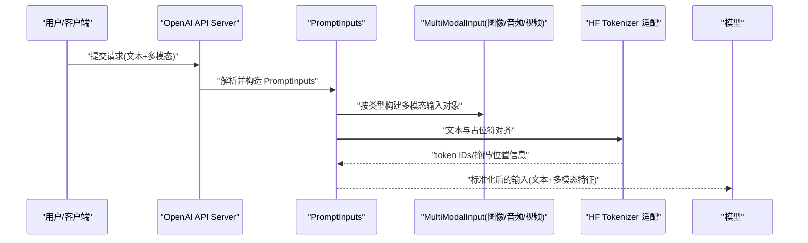
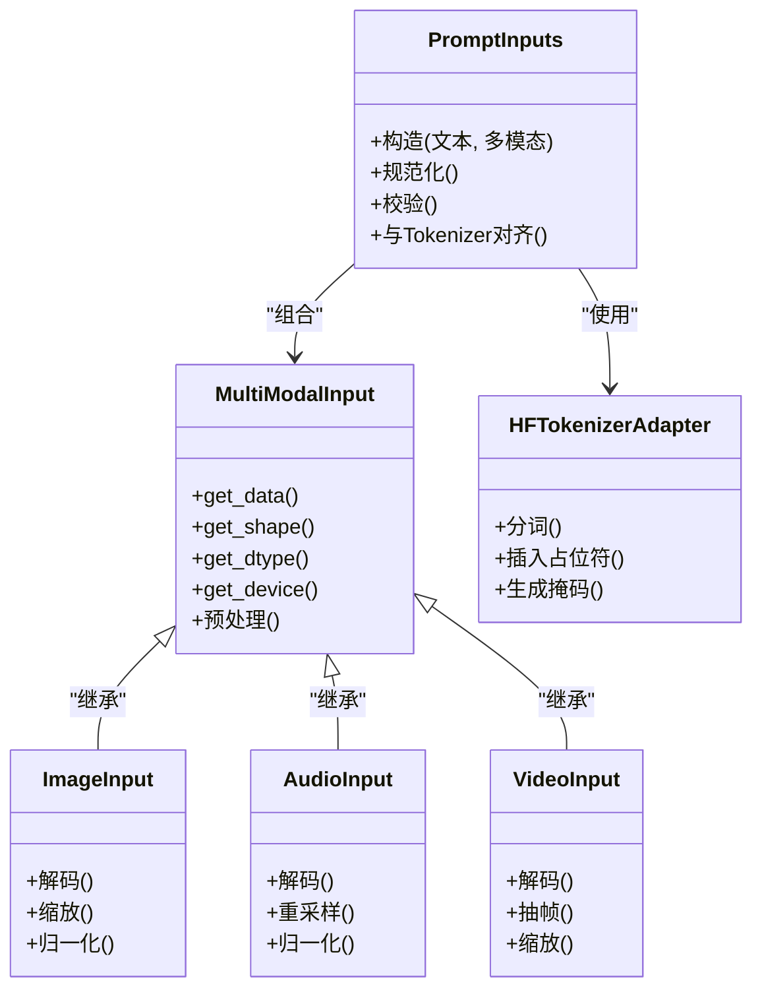

# 输入数据类型

<cite>
**本文引用的文件**   
- [vllm/inputs/__init__.py](file://vllm/inputs/__init__.py)
- [vllm/multimodal/base.py](file://vllm/multimodal/base.py)
- [vllm/multimodal/image.py](file://vllm/multimodal/image.py)
- [vllm/multimodal/audio.py](file://vllm/multimodal/audio.py)
- [vllm/multimodal/video.py](file://vllm/multimodal/video.py)
- [vllm/tokenizers/hf_tokenizer.py](file://vllm/tokenizers/hf_tokenizer.py)
- [vllm/entrypoints/openai/api_server.py](file://vllm/entrypoints/openai/api_server.py)
- [examples/generate/multimodal/multimodal_example.py](file://examples/generate/multimodal/multimodal_example.py)
- [tests/test_inputs.py](file://tests/test_inputs.py)
</cite>

## 目录
1. [简介](#简介)
2. [项目结构](#项目结构)
3. [核心组件](#核心组件)
4. [架构总览](#架构总览)
5. [详细组件分析](#详细组件分析)
6. [依赖关系分析](#依赖关系分析)
7. [性能考虑](#性能考虑)
8. [故障排查指南](#故障排查指南)
9. [结论](#结论)
10. [附录](#附录)

## 简介
本文件系统性梳理 vLLM 的输入数据类型与多模态输入处理机制，覆盖 PromptInputs、MultiModalInput、AudioInput、ImageInput 等数据类的结构与用途；说明字符串、字典、张量等多种输入形式的格式要求与转换规则；详细描述图像、音频、视频等多模态数据的组织方式、编码格式与预处理要求；提供从原始数据到模型输入的完整构造示例；并给出输入验证规则、常见错误处理方法以及与 HuggingFace Tokenizer 的集成方式。

## 项目结构
围绕输入类型与多模态处理的关键代码主要分布在以下模块：
- inputs：统一输入抽象与解析（PromptInputs 等）
- multimodal：多模态输入基类与具体类型（图像、音频、视频）
- tokenizers：与 HuggingFace Tokenizer 的集成
- entrypoints/openai：OpenAI 风格 API 对输入的解析与校验
- examples/generate/multimodal：多模态输入端到端示例
- tests/test_inputs：输入类型与转换的单元测试

图表来源
- [vllm/inputs/__init__.py](file://vllm/inputs/__init__.py)
- [vllm/multimodal/base.py](file://vllm/multimodal/base.py)
- [vllm/multimodal/image.py](file://vllm/multimodal/image.py)
- [vllm/multimodal/audio.py](file://vllm/multimodal/audio.py)
- [vllm/multimodal/video.py](file://vllm/multimodal/video.py)
- [vllm/tokenizers/hf_tokenizer.py](file://vllm/tokenizers/hf_tokenizer.py)
- [vllm/entrypoints/openai/api_server.py](file://vllm/entrypoints/openai/api_server.py)
- [examples/generate/multimodal/multimodal_example.py](file://examples/generate/multimodal/multimodal_example.py)
- [tests/test_inputs.py](file://tests/test_inputs.py)

章节来源
- [vllm/inputs/__init__.py](file://vllm/inputs/__init__.py)
- [vllm/multimodal/base.py](file://vllm/multimodal/base.py)
- [vllm/multimodal/image.py](file://vllm/multimodal/image.py)
- [vllm/multimodal/audio.py](file://vllm/multimodal/audio.py)
- [vllm/multimodal/video.py](file://vllm/multimodal/video.py)
- [vllm/tokenizers/hf_tokenizer.py](file://vllm/tokenizers/hf_tokenizer.py)
- [vllm/entrypoints/openai/api_server.py](file://vllm/entrypoints/openai/api_server.py)
- [examples/generate/multimodal/multimodal_example.py](file://examples/generate/multimodal/multimodal_example.py)
- [tests/test_inputs.py](file://tests/test_inputs.py)

## 核心组件
- PromptInputs：统一的输入抽象，承载文本与多模态内容，支持多种构造形式（字符串、字典、张量等），并在内部完成规范化与校验。
- MultiModalInput：多模态输入基类，定义通用接口（如元数据、形状、设备、dtype 等），供 ImageInput、AudioInput、VideoInput 继承实现。
- ImageInput/AudioInput/VideoInput：具体多模态类型，封装各自的数据格式、预处理步骤与约束（分辨率、采样率、帧数等）。
- HF Tokenizer 集成：将文本部分与多模态占位符进行对齐，生成模型所需的 token IDs 与注意力掩码等。

章节来源
- [vllm/inputs/__init__.py](file://vllm/inputs/__init__.py)
- [vllm/multimodal/base.py](file://vllm/multimodal/base.py)
- [vllm/multimodal/image.py](file://vllm/multimodal/image.py)
- [vllm/multimodal/audio.py](file://vllm/multimodal/audio.py)
- [vllm/multimodal/video.py](file://vllm/multimodal/video.py)
- [vllm/tokenizers/hf_tokenizer.py](file://vllm/tokenizers/hf_tokenizer.py)

## 架构总览
下图展示从用户输入到模型推理前的关键流程：用户通过 OpenAI API 或 Python SDK 提交输入，系统将其解析为 PromptInputs，再根据多模态类型构建相应的 MultiModalInput 实例，最后与 HF Tokenizer 协作完成文本与多模态占位的对齐，输出模型可消费的输入结构。

图表来源
- [vllm/entrypoints/openai/api_server.py](file://vllm/entrypoints/openai/api_server.py)
- [vllm/inputs/__init__.py](file://vllm/inputs/__init__.py)
- [vllm/multimodal/base.py](file://vllm/multimodal/base.py)
- [vllm/tokenizers/hf_tokenizer.py](file://vllm/tokenizers/hf_tokenizer.py)

## 详细组件分析

### PromptInputs：统一输入抽象
- 职责
  - 接收多种输入形式（字符串、字典、张量、混合结构），并进行规范化。
  - 维护文本与多模态内容的映射关系，确保后续分词与对齐正确。
  - 提供校验逻辑（长度、维度、类型一致性等）与错误提示。
- 典型构造路径
  - 字符串：自动识别是否包含多模态占位符，必要时结合上下文模板。
  - 字典：键值明确指定文本与多模态字段，便于批量与结构化输入。
  - 张量：直接传入已预处理的特征张量，需附带元数据（形状、设备、dtype）。
- 与 Tokenizer 的协作
  - 将文本与多模态占位符拼接后交由 HF Tokenizer 分词，保证 token 序列与多模态块一一对应。
- 常见校验规则
  - 文本非空且类型合法。
  - 多模态字段存在性与类型匹配。
  - 多模态张量的维度与 dtype 符合模型期望。
  - 批次维度一致，避免混用不同长度的多模态样本。

章节来源
- [vllm/inputs/__init__.py](file://vllm/inputs/__init__.py)
- [tests/test_inputs.py](file://tests/test_inputs.py)

### MultiModalInput：多模态输入基类
- 职责
  - 定义多模态输入的统一接口（如 get_data()、get_shape()、get_dtype()、get_device() 等）。
  - 提供通用的元数据管理（如通道数、采样率、帧率、分辨率等）。
  - 规范预处理流程（归一化、重采样、裁剪等）与校验。
- 扩展点
  - 子类需实现具体的数据加载与预处理逻辑，并保持接口稳定。
  - 支持在批处理中合并与对齐多模态数据。

章节来源
- [vllm/multimodal/base.py](file://vllm/multimodal/base.py)

### ImageInput：图像输入
- 数据结构
  - 像素张量（H×W×C 或 C×H×W，依实现而定）、分辨率、色彩空间、归一化参数。
- 格式与预处理
  - 支持的图像格式（JPEG/PNG 等），解码为张量后进行尺寸缩放、中心裁剪、归一化。
  - 可选增强（翻转、旋转）通常不在推理阶段执行。
- 约束
  - 分辨率上限、最小边长、通道数限制。
  - 批次内图像尺寸需对齐或填充至统一形状。

章节来源
- [vllm/multimodal/image.py](file://vllm/multimodal/image.py)

### AudioInput：音频输入
- 数据结构
  - 波形张量（时间步）、采样率、声道数、时长。
- 格式与预处理
  - 支持的音频格式（WAV/MP3 等），解码为浮点波形，必要时重采样至目标采样率。
  - 可选静音检测、分段、归一化。
- 约束
  - 最大时长、采样率范围、单声道/立体声约定。
  - 批次内时长对齐策略（截断/填充）。

章节来源
- [vllm/multimodal/audio.py](file://vllm/multimodal/audio.py)

### VideoInput：视频输入
- 数据结构
  - 帧序列张量（T×H×W×C 或 T×C×H×W）、帧率、时长、分辨率。
- 格式与预处理
  - 支持的容器/编码（MP4/H.264 等），解码为帧序列，按固定帧率抽帧。
  - 尺寸缩放、时序采样（均匀/关键帧）、归一化。
- 约束
  - 最大帧数、分辨率上限、帧率范围。
  - 批次内帧数与尺寸对齐策略。

章节来源
- [vllm/multimodal/video.py](file://vllm/multimodal/video.py)

### 与 HuggingFace Tokenizer 的集成
- 角色
  - 负责文本分词、特殊 token 处理、以及文本与多模态占位符的对齐。
- 关键点
  - 占位符插入：在多模态位置插入占位 token，保持与多模态块的顺序一致。
  - 注意力掩码与位置 ID：生成正确的 attention_mask 与位置编码。
  - 兼容不同模型的 tokenizer 配置（如 bos/eos/pad token）。
- 常见问题
  - 占位符数量与多模态块不一致导致对齐失败。
  - 文本长度超过模型上下文窗口。
  - 特殊 token 未正确处理导致序列非法。

章节来源
- [vllm/tokenizers/hf_tokenizer.py](file://vllm/tokenizers/hf_tokenizer.py)

### 输入构造示例（端到端流程）
- 场景一：纯文本
  - 输入：字符串或字符串列表
  - 处理：PromptInputs 规范化 → HF Tokenizer 分词 → 模型输入
- 场景二：文本 + 图像
  - 输入：字符串 + 图像路径/张量
  - 处理：PromptInputs 解析 → ImageInput 构建与预处理 → 占位符对齐 → 模型输入
- 场景三：文本 + 音频
  - 输入：字符串 + 音频路径/张量
  - 处理：PromptInputs 解析 → AudioInput 构建与预处理 → 占位符对齐 → 模型输入
- 场景四：文本 + 视频
  - 输入：字符串 + 视频路径/张量
  - 处理：PromptInputs 解析 → VideoInput 构建与预处理 → 占位符对齐 → 模型输入

章节来源
- [examples/generate/multimodal/multimodal_example.py](file://examples/generate/multimodal/multimodal_example.py)
- [vllm/entrypoints/openai/api_server.py](file://vllm/entrypoints/openai/api_server.py)

## 依赖关系分析
- 组件耦合
  - PromptInputs 依赖 MultiModalInput 及其子类以处理多模态数据。
  - PromptInputs 依赖 HF Tokenizer 完成文本与占位符的对齐。
  - OpenAI API Server 依赖 PromptInputs 进行请求解析与校验。
- 外部依赖
  - 图像处理库（解码、缩放、归一化）
  - 音频/视频解码库（解码、重采样、抽帧）
  - HuggingFace Transformers 的 Tokenizer

图表来源
- [vllm/inputs/__init__.py](file://vllm/inputs/__init__.py)
- [vllm/multimodal/base.py](file://vllm/multimodal/base.py)
- [vllm/multimodal/image.py](file://vllm/multimodal/image.py)
- [vllm/multimodal/audio.py](file://vllm/multimodal/audio.py)
- [vllm/multimodal/video.py](file://vllm/multimodal/video.py)
- [vllm/tokenizers/hf_tokenizer.py](file://vllm/tokenizers/hf_tokenizer.py)

章节来源
- [vllm/inputs/__init__.py](file://vllm/inputs/__init__.py)
- [vllm/multimodal/base.py](file://vllm/multimodal/base.py)
- [vllm/multimodal/image.py](file://vllm/multimodal/image.py)
- [vllm/multimodal/audio.py](file://vllm/multimodal/audio.py)
- [vllm/multimodal/video.py](file://vllm/multimodal/video.py)
- [vllm/tokenizers/hf_tokenizer.py](file://vllm/tokenizers/hf_tokenizer.py)

## 性能考虑
- 预处理优化
  - 图像/视频解码与缩放尽量使用 GPU 加速（如适用），减少 CPU/GPU 数据传输。
  - 音频重采样与归一化可在批内并行执行。
- 内存与带宽
  - 控制批次大小以避免显存溢出；对大分辨率图像/长视频采用分块或降采样。
  - 复用中间张量，避免不必要的拷贝。
- 对齐与分词
  - 提前计算占位符位置，减少重复计算。
  - 缓存常用 tokenizer 结果（如相同模板与特殊 token 配置）。

[本节为通用指导，不直接分析具体文件]

## 故障排查指南
- 常见错误与处理
  - 多模态占位符数量与多模态块不一致：检查 PromptInputs 构造时文本中的占位符与多模态列表长度是否匹配。
  - 张量维度或 dtype 不符：确认 ImageInput/AudioInput/VideoInput 的输出形状与模型期望一致。
  - 文本超长：缩短输入或启用上下文截断策略。
  - 解码失败：检查文件格式与解码库支持情况。
- 调试建议
  - 打印 PromptInputs 的规范化结果与多模态元数据。
  - 使用单元测试用例（tests/test_inputs.py）逐步定位问题。
  - 在 OpenAI API Server 中开启更详细的日志输出。

章节来源
- [tests/test_inputs.py](file://tests/test_inputs.py)
- [vllm/entrypoints/openai/api_server.py](file://vllm/entrypoints/openai/api_server.py)

## 结论
vLLM 的输入类型体系以 PromptInputs 为核心，配合 MultiModalInput 及其子类实现对文本、图像、音频、视频的统一抽象与处理。通过与 HuggingFace Tokenizer 的深度集成，系统在分词与多模态占位对齐方面提供了稳定可靠的支撑。遵循本文的格式要求、预处理规范与校验规则，可有效避免常见错误并提升推理性能。

[本节为总结性内容，不直接分析具体文件]

## 附录
- 快速参考
  - 字符串输入：适用于纯文本或含占位符的模板文本。
  - 字典输入：适合结构化批量请求，明确指定文本与多模态字段。
  - 张量输入：适用于已预处理的特征，需附带元数据。
- 最佳实践
  - 统一预处理管线，确保跨批次一致性。
  - 合理设置批次大小与分辨率/采样率，平衡吞吐与延迟。
  - 利用单元测试与示例代码验证输入构造的正确性。

[本节为补充信息，不直接分析具体文件]