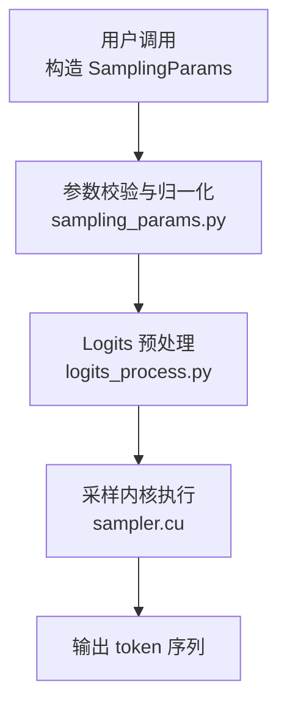
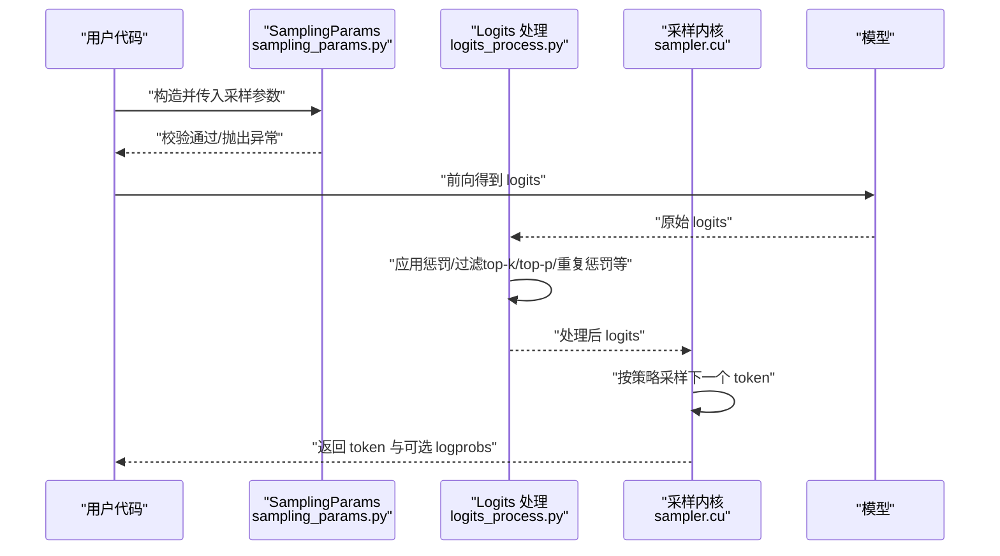
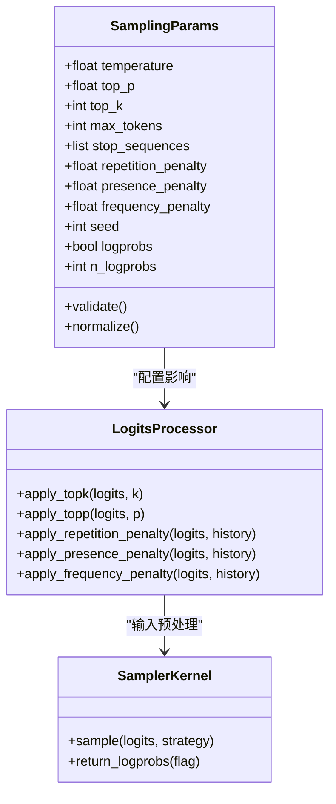

# 采样参数配置

<cite>
**本文引用的文件**   
- [sampling_params.py](file://vllm/sampling_params.py)
- [test_sampling_params.py](file://tests/test_sampling_params.py)
- [sampler.cu](file://csrc/cuda_utils_kernels.cu)
- [logits_process.py](file://vllm/logits_process.py)
- [benchmark_topk_topp.py](file://benchmarks/benchmark_topk_topp.py)
</cite>

## 目录
1. [简介](#简介)
2. [项目结构](#项目结构)
3. [核心组件](#核心组件)
4. [架构总览](#架构总览)
5. [详细组件分析](#详细组件分析)
6. [依赖分析](#依赖分析)
7. [性能考虑](#性能考虑)
8. [故障排查指南](#故障排查指南)
9. [结论](#结论)
10. [附录](#附录)

## 简介
本文件为 vLLM 中 SamplingParams 类的完整配置文档，聚焦于文本生成时的采样相关参数。内容涵盖：
- 所有采样参数的含义、取值范围与默认行为
- 不同采样策略（贪婪解码、随机采样、核采样等）的配置方式与适用场景
- 高级惩罚参数（重复惩罚、存在惩罚、频率惩罚）的作用机制与调参建议
- 丰富的配置示例，展示不同生成效果的参数组合
- 参数验证规则与最佳实践
- 与不同模型架构的参数兼容性说明

## 项目结构
SamplingParams 定义位于 Python 层，负责解析和校验用户传入的采样参数；在推理阶段由采样内核与 logits 处理器协同执行具体采样逻辑。关键文件关系如下：
- 参数定义与校验：vllm/sampling_params.py
- 单元测试与边界用例：tests/test_sampling_params.py
- 采样内核实现（CUDA）：csrc/.../sampler.cu（或对应 CUDA 源）
- logits 处理（惩罚项等）：vllm/logits_process.py
- 基准测试（top-k/top-p 行为）：benchmarks/benchmark_topk_topp.py

图表来源 
- [sampling_params.py](file://vllm/sampling_params.py)
- [logits_process.py](file://vllm/logits_process.py)
- [sampler.cu](file://csrc/cuda_utils_kernels.cu)

章节来源
- [sampling_params.py](file://vllm/sampling_params.py)
- [test_sampling_params.py](file://tests/test_sampling_params.py)

## 核心组件
SamplingParams 是控制生成行为的“单一事实来源”，其字段通常包括：
- temperature：温度，控制概率分布的平滑程度
- top_p：核采样阈值，累积概率截断
- top_k：Top-K 采样，仅保留概率最高的 K 个候选
- max_tokens：最大生成长度
- stop_sequences：停止序列集合，命中即终止
- repetition_penalty：重复惩罚，抑制已出现 token 的概率
- presence_penalty：存在惩罚，鼓励新词出现
- frequency_penalty：频率惩罚，根据历史频次降低概率
- seed：随机种子，保证可复现性
- logprobs/n_logprobs：是否返回每个位置的词表对数概率及 Top-N 列表
- other model-specific flags：如 min_tokens、ignore_eos、best_of、n 等（取决于版本）

这些字段在构造时进行类型与范围校验，并在推理前被标准化为内核可消费的形式。

章节来源
- [sampling_params.py](file://vllm/sampling_params.py)
- [test_sampling_params.py](file://tests/test_sampling_params.py)

## 架构总览
下图展示了从参数到采样的端到端流程，以及各模块的职责边界。

图表来源 
- [sampling_params.py](file://vllm/sampling_params.py)
- [logits_process.py](file://vllm/logits_process.py)
- [sampler.cu](file://csrc/cuda_utils_kernels.cu)

## 详细组件分析

### 参数详解与用法
- temperature
  - 作用：对 logits 进行缩放，值越大越随机，越小越确定
  - 典型范围：(0, +∞)，常用 (0.1, 1.5)
  - 行为：temperature=0 等价于贪婪解码（取 argmax）
  - 注意：过小可能导致数值不稳定；过大可能产生无意义输出
- top_p
  - 作用：核采样，保留累积概率达到 p 的最小候选集
  - 典型范围：[0, 1]，常用 (0.8, 0.95)
  - 行为：p 越小越保守，p=1 退化为全词表采样
  - 注意：与 temperature 共同作用，需联合调参
- top_k
  - 作用：仅保留概率最高的 k 个候选
  - 典型范围：正整数，常用 [1, 50]
  - 行为：k=1 退化为贪婪解码（配合 temperature=0）
  - 注意：与 top_p 同时设置时，先 top-k 再 top-p
- max_tokens
  - 作用：限制单次生成的最大 token 数
  - 典型范围：正整数
  - 行为：达到上限后强制停止
- stop_sequences
  - 作用：遇到任意一个停止序列即终止
  - 类型：字符串或字符串列表
  - 行为：优先于 max_tokens 生效
- repetition_penalty
  - 作用：对已出现 token 的概率施加除法缩放，抑制重复
  - 典型范围：(0, +∞)，常用 (1.0, 1.2)
  - 行为：>1 抑制重复，<1 鼓励重复
- presence_penalty
  - 作用：对已出现的 token 增加负偏置，鼓励新词
  - 典型范围：[-2, 2]，常用 [0, 1]
  - 行为：正值鼓励多样性，负值倾向重复
- frequency_penalty
  - 作用：根据 token 历史频次施加负偏置
  - 典型范围：[-2, 2]，常用 [-1, 1]
  - 行为：正值抑制高频词，负值鼓励高频词
- seed
  - 作用：固定随机种子以复现实验结果
  - 类型：非负整数
- logprobs/n_logprobs
  - 作用：返回每个位置的对数概率与 Top-N 列表
  - 用途：调试、评估、可控生成

章节来源
- [sampling_params.py](file://vllm/sampling_params.py)
- [logits_process.py](file://vllm/logits_process.py)
- [test_sampling_params.py](file://tests/test_sampling_params.py)

### 采样策略与适用场景
- 贪婪解码（deterministic）
  - 配置：temperature=0 或 top_k=1
  - 特点：确定性最高，适合需要稳定输出的任务（如代码补全、格式化输出）
  - 风险：容易陷入重复或单调
- 随机采样（random）
  - 配置：temperature>0，top_k/top_p 不限制或较大
  - 特点：多样性高，适合创意写作、头脑风暴
  - 风险：可能偏离主题或产生噪声
- 核采样（nucleus sampling）
  - 配置：top_p∈[0.8, 0.95]，temperature∈[0.7, 1.2]
  - 特点：平衡质量与多样性，通用性强
  - 风险：需与 temperature 联合调参
- Top-K 采样
  - 配置：top_k∈[1, 20]，temperature∈[0.7, 1.2]
  - 特点：简单直观，适合中等创造性任务
  - 风险：固定数量候选可能不适合长尾分布
- 组合策略
  - 常见：top_k + top_p + temperature
  - 建议：先定 top_k，再调 top_p，最后微调 temperature

章节来源
- [sampling_params.py](file://vllm/sampling_params.py)
- [benchmark_topk_topp.py](file://benchmarks/benchmark_topk_topp.py)

### 高级惩罚参数机制
- repetition_penalty
  - 机制：将已出现 token 的概率除以 penalty，避免重复
  - 建议：从 1.0 起步，逐步增大至 1.1~1.2
- presence_penalty
  - 机制：对已出现 token 添加负偏置，鼓励新词
  - 建议：0~0.5 较安全，>1 需谨慎
- frequency_penalty
  - 机制：根据历史频次线性衰减概率
  - 建议：-0.5~0.5，视语料风格调整

章节来源
- [logits_process.py](file://vllm/logits_process.py)
- [sampling_params.py](file://vllm/sampling_params.py)

### 参数验证规则与边界条件
- 类型检查：确保数值类型为 float/int，字符串为合法编码
- 范围校验：如 temperature>0，top_p∈[0,1]，top_k≥1
- 互斥/优先级：top_k 与 top_p 同时存在时的顺序（先 k 后 p）
- 停止序列：空串或非法字符的处理
- 长度限制：max_tokens 为正整数
- 随机种子：seed≥0

章节来源
- [test_sampling_params.py](file://tests/test_sampling_params.py)
- [sampling_params.py](file://vllm/sampling_params.py)

### 与模型架构的兼容性
- 通用性：上述参数适用于大多数自回归语言模型（Llama、Qwen、GPT 系列等）
- 特殊架构：MoE、多模态模型通常兼容，但需注意：
  - 某些模型对 temperature=0 的实现差异（数值稳定性）
  - 部分模型不支持某些惩罚项或对其语义有差异
- 建议：在目标模型上运行最小化回归测试，确认行为一致

章节来源
- [sampling_params.py](file://vllm/sampling_params.py)

### 配置示例（描述性）
- 高质量确定性输出
  - 配置要点：temperature=0，top_k=1，max_tokens 合理上限，stop_sequences 明确
  - 适用：代码生成、结构化数据抽取
- 创意写作
  - 配置要点：temperature≈1.0，top_p≈0.9，presence_penalty≈0.2，frequency_penalty≈0.1
  - 适用：故事创作、文案撰写
- 对话系统
  - 配置要点：temperature≈0.7~0.9，top_p≈0.85~0.95，repetition_penalty≈1.1
  - 适用：客服、助手类对话
- 严格格式约束
  - 配置要点：temperature=0，stop_sequences 包含结束符，n_logprobs=0
  - 适用：JSON/XML 输出、SQL 生成

章节来源
- [sampling_params.py](file://vllm/sampling_params.py)
- [benchmark_topk_topp.py](file://benchmarks/benchmark_topk_topp.py)

## 依赖分析
SamplingParams 与下游模块的依赖关系如下：
- 参数校验与归一化：sampling_params.py
- Logits 处理：logits_process.py（惩罚、top-k/top-p）
- 采样内核：sampler.cu（实际采样决策）
- 测试与基准：tests/test_sampling_params.py、benchmarks/benchmark_topk_topp.py

图表来源 
- [sampling_params.py](file://vllm/sampling_params.py)
- [logits_process.py](file://vllm/logits_process.py)
- [sampler.cu](file://csrc/cuda_utils_kernels.cu)

章节来源
- [sampling_params.py](file://vllm/sampling_params.py)
- [logits_process.py](file://vllm/logits_process.py)
- [sampler.cu](file://csrc/cuda_utils_kernels.cu)

## 性能考虑
- temperature=0 或 top_k=1 会退化为确定性路径，减少分支开销
- top_p 与 top_k 同时启用会增加额外过滤步骤，轻微延迟
- 大 batch 下，惩罚项计算与历史统计会带来额外内存与计算
- 开启 logprobs 会显著增加 I/O 与内存占用，仅在调试或评测时启用
- 建议：生产环境关闭 logprobs，合理设置 top_k/top_p，避免过大的候选集

章节来源
- [logits_process.py](file://vllm/logits_process.py)
- [sampling_params.py](file://vllm/sampling_params.py)

## 故障排查指南
- 输出重复严重
  - 检查 repetition_penalty 是否过低或 presence/frequency 惩罚未启用
  - 适当提高 repetition_penalty 或 presence_penalty
- 输出过于发散
  - 降低 temperature，缩小 top_p，或减小 top_k
- 提前停止
  - 检查 stop_sequences 是否误配，或 max_tokens 过小
- 数值不稳定
  - temperature 过小导致除零或溢出，建议不低于 0.1
- 不可复现
  - 未设置 seed，或不同设备/后端导致随机性差异

章节来源
- [test_sampling_params.py](file://tests/test_sampling_params.py)
- [sampling_params.py](file://vllm/sampling_params.py)

## 结论
SamplingParams 提供了灵活且强大的采样控制能力。通过合理组合 temperature、top_p、top_k 与各类惩罚参数，可在质量与多样性之间取得平衡。生产环境中应遵循参数验证与最佳实践，结合目标模型特性进行回归测试，确保生成效果稳定可靠。

## 附录
- 快速对照表
  - 贪婪解码：temperature=0 或 top_k=1
  - 核采样：top_p∈[0.8, 0.95]，temperature∈[0.7, 1.2]
  - 随机采样：temperature≈1.0，top_p≈1.0，top_k 较大
  - 抑制重复：repetition_penalty>1，presence_penalty>0，frequency_penalty>0
- 推荐调参顺序
  - 先定 top_k，再调 top_p，最后微调 temperature
  - 若出现重复，提升 repetition_penalty/presence_penalty
  - 若发散，降低 temperature/top_p/top_k

章节来源
- [sampling_params.py](file://vllm/sampling_params.py)
- [benchmark_topk_topp.py](file://benchmarks/benchmark_topk_topp.py)