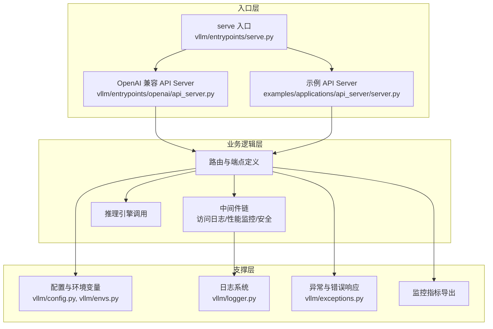
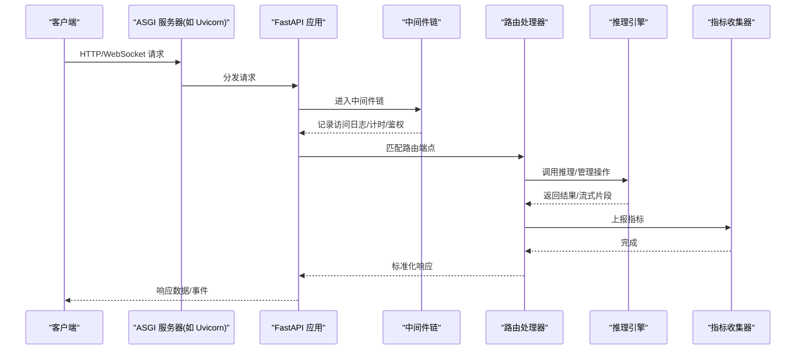
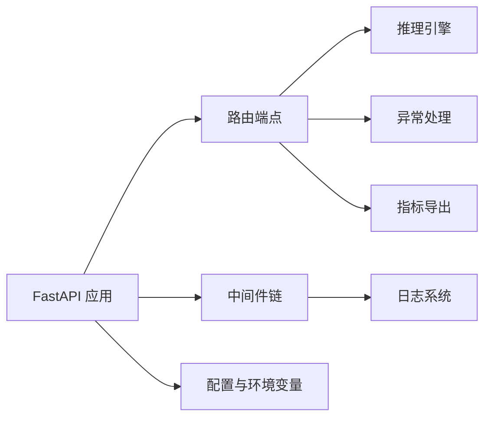

# Web服务器API

<cite>
**本文档引用的文件**   
- [vllm/entrypoints/openai/api_server.py](file://vllm/entrypoints/openai/api_server.py)
- [vllm/entrypoints/serve.py](file://vllm/entrypoints/serve.py)
- [vllm/config.py](file://vllm/config.py)
- [vllm/envs.py](file://vllm/envs.py)
- [vllm/logger.py](file://vllm/logger.py)
- [vllm/exceptions.py](file://vllm/exceptions.py)
- [examples/applications/api_server/server.py](file://examples/applications/api_server/server.py)
- [examples/applications/api_server/client.py](file://examples/applications/api_server/client.py)
- [docs/configuration/serve_args.md](file://docs/configuration/serve_args.md)
- [docs/configuration/env_vars.md](file://docs/configuration/env_vars.md)
- [docs/usage/metrics.md](file://docs/usage/metrics.md)
- [docs/deployment/nginx.md](file://docs/deployment/nginx.md)
- [docs/usage/security.md](file://docs/usage/security.md)
- [tests/test_access_log_filter.py](file://tests/test_access_log_filter.py)
</cite>

## 目录
1. [简介](#简介)
2. [项目结构](#项目结构)
3. [核心组件](#核心组件)
4. [架构总览](#架构总览)
5. [详细组件分析](#详细组件分析)
6. [依赖关系分析](#依赖关系分析)
7. [性能考虑](#性能考虑)
8. [故障排查指南](#故障排查指南)
9. [结论](#结论)
10. [附录](#附录)

## 简介
本文件面向使用 vLLM 的开发者与运维人员，系统化梳理基于 FastAPI 的 Web 服务器内部 API。内容覆盖健康检查、监控指标、管理接口等路由端点；中间件（访问日志、性能监控、安全防护）的配置与使用；WebSocket 连接建立与消息协议；配置管理与环境变量、动态参数调整；API 网关集成与负载均衡最佳实践；安全考量、CORS 设置与认证授权机制；错误响应格式与调试信息输出。文档力求在技术深度与可读性之间取得平衡，既适合快速上手，也便于深入定制。

## 项目结构
vLLM 的 Web 服务入口位于 entrypoints 目录，OpenAI 兼容接口由独立的 FastAPI 应用提供，同时存在通用 serve 入口用于统一启动。示例中提供了最小化的 API Server 实现与客户端脚本，便于理解请求-响应流程。配置与环境变量集中在 config 与 envs 模块，日志与异常处理分别由 logger 与 exceptions 模块负责。部署与运维相关说明分布在 docs 下的 deployment、configuration、usage 等章节。

图表来源
- [vllm/entrypoints/serve.py](file://vllm/entrypoints/serve.py)
- [vllm/entrypoints/openai/api_server.py](file://vllm/entrypoints/openai/api_server.py)
- [examples/applications/api_server/server.py](file://examples/applications/api_server/server.py)

章节来源
- [vllm/entrypoints/serve.py](file://vllm/entrypoints/serve.py)
- [vllm/entrypoints/openai/api_server.py](file://vllm/entrypoints/openai/api_server.py)
- [examples/applications/api_server/server.py](file://examples/applications/api_server/server.py)

## 核心组件
- FastAPI 应用实例：创建并挂载路由、中间件、生命周期钩子。
- 路由端点：健康检查、模型状态查询、推理接口、管理接口、指标导出等。
- 中间件：访问日志、请求耗时统计、限流与鉴权、CORS 与安全头。
- WebSocket：实时通信通道，支持流式输出或事件推送。
- 配置与环境变量：运行时参数、模型加载选项、性能调优开关。
- 日志与异常：结构化日志、错误码与标准化响应体。
- 监控与指标：Prometheus/OpenMetrics 指标暴露，关键路径耗时与吞吐。

章节来源
- [vllm/entrypoints/openai/api_server.py](file://vllm/entrypoints/openai/api_server.py)
- [vllm/entrypoints/serve.py](file://vllm/entrypoints/serve.py)
- [vllm/config.py](file://vllm/config.py)
- [vllm/envs.py](file://vllm/envs.py)
- [vllm/logger.py](file://vllm/logger.py)
- [vllm/exceptions.py](file://vllm/exceptions.py)

## 架构总览
下图展示了从客户端到推理引擎的请求链路，以及中间件与监控指标的接入点。

图表来源
- [vllm/entrypoints/openai/api_server.py](file://vllm/entrypoints/openai/api_server.py)
- [vllm/entrypoints/serve.py](file://vllm/entrypoints/serve.py)

## 详细组件分析

### FastAPI 应用与路由端点
- 健康检查与健康探针：提供轻量级 GET 端点，用于存活与就绪探测。
- 模型状态与管理：查看模型加载状态、上下文长度、缓存命中率等。
- 推理接口：文本生成、对话补全、批处理与流式输出。
- 指标导出：Prometheus 格式的指标端点。
- 管理接口：重启、热更新、配置刷新、队列清理等。

建议通过以下文件定位具体端点定义与参数校验：
- [vllm/entrypoints/openai/api_server.py](file://vllm/entrypoints/openai/api_server.py)
- [examples/applications/api_server/server.py](file://examples/applications/api_server/server.py)

章节来源
- [vllm/entrypoints/openai/api_server.py](file://vllm/entrypoints/openai/api_server.py)
- [examples/applications/api_server/server.py](file://examples/applications/api_server/server.py)

### 中间件配置与使用
- 访问日志：记录请求方法、路径、状态码、耗时、用户代理与来源 IP。
- 性能监控：请求耗时直方图、吞吐计数、慢请求告警。
- 安全防护：CORS、CSRF、速率限制、请求大小限制、敏感头过滤。
- 认证授权：Bearer Token、API Key、OAuth2 等策略接入。

参考实现与测试：
- [vllm/logger.py](file://vllm/logger.py)
- [tests/test_access_log_filter.py](file://tests/test_access_log_filter.py)
- [docs/usage/security.md](file://docs/usage/security.md)

章节来源
- [vllm/logger.py](file://vllm/logger.py)
- [tests/test_access_log_filter.py](file://tests/test_access_log_filter.py)
- [docs/usage/security.md](file://docs/usage/security.md)

### WebSocket 连接与消息协议
- 连接建立：/ws 或 /ws/stream 等端点，支持查询参数与握手头。
- 消息协议：JSON 帧或二进制帧，包含命令、会话 ID、载荷与状态码。
- 流式输出：增量 token 推送、心跳保活、断线重连策略。
- 错误处理：网络异常、引擎超时、权限拒绝的统一错误帧。

参考示例与客户端：
- [examples/applications/api_server/client.py](file://examples/applications/api_server/client.py)
- [vllm/entrypoints/openai/api_server.py](file://vllm/entrypoints/openai/api_server.py)

章节来源
- [examples/applications/api_server/client.py](file://examples/applications/api_server/client.py)
- [vllm/entrypoints/openai/api_server.py](file://vllm/entrypoints/openai/api_server.py)

### 配置管理、环境变量与动态参数
- 配置文件：YAML/JSON 或命令行参数，覆盖模型、并行度、量化、缓存等。
- 环境变量：通过 envs 模块集中读取，支持运行时重载。
- 动态参数：在线调整批大小、采样参数、限速阈值、日志级别。

参考文档与模块：
- [docs/configuration/serve_args.md](file://docs/configuration/serve_args.md)
- [docs/configuration/env_vars.md](file://docs/configuration/env_vars.md)
- [vllm/config.py](file://vllm/config.py)
- [vllm/envs.py](file://vllm/envs.py)

章节来源
- [docs/configuration/serve_args.md](file://docs/configuration/serve_args.md)
- [docs/configuration/env_vars.md](file://docs/configuration/env_vars.md)
- [vllm/config.py](file://vllm/config.py)
- [vllm/envs.py](file://vllm/envs.py)

### API 网关集成与负载均衡
- 反向代理：Nginx 作为入口，转发 HTTP/WebSocket，启用压缩与缓冲。
- 负载均衡：多实例横向扩展，健康检查与优雅退出。
- 超时与重试：合理设置上游超时、连接池与重试策略。
- 安全加固：TLS 终止、WAF、IP 白名单、请求签名。

参考部署指南：
- [docs/deployment/nginx.md](file://docs/deployment/nginx.md)

章节来源
- [docs/deployment/nginx.md](file://docs/deployment/nginx.md)

### 安全考量、CORS 与认证授权
- CORS：限定来源域名、允许方法与头、凭证模式。
- 认证：Token 校验、API Key 白名单、短期令牌与轮换。
- 授权：角色与资源粒度控制、审计日志。
- 输入校验：严格 Schema、长度限制、类型转换与脱敏。

参考安全文档：
- [docs/usage/security.md](file://docs/usage/security.md)

章节来源
- [docs/usage/security.md](file://docs/usage/security.md)

### 错误响应格式与调试信息
- 标准错误体：包含 code、message、details、trace_id。
- 状态码约定：4xx 客户端错误、5xx 服务端错误、429 限流。
- 调试信息：结构化日志、请求追踪、堆栈摘要（生产环境脱敏）。
- 异常映射：自定义异常到 HTTP 状态的统一转换。

参考模块：
- [vllm/exceptions.py](file://vllm/exceptions.py)
- [vllm/logger.py](file://vllm/logger.py)

章节来源
- [vllm/exceptions.py](file://vllm/exceptions.py)
- [vllm/logger.py](file://vllm/logger.py)

## 依赖关系分析
FastAPI 应用依赖路由、中间件、配置与环境变量、日志与异常处理、指标导出与推理引擎。各模块职责清晰，耦合度低，便于替换与扩展。

图表来源
- [vllm/entrypoints/openai/api_server.py](file://vllm/entrypoints/openai/api_server.py)
- [vllm/entrypoints/serve.py](file://vllm/entrypoints/serve.py)
- [vllm/config.py](file://vllm/config.py)
- [vllm/envs.py](file://vllm/envs.py)
- [vllm/logger.py](file://vllm/logger.py)
- [vllm/exceptions.py](file://vllm/exceptions.py)

章节来源
- [vllm/entrypoints/openai/api_server.py](file://vllm/entrypoints/openai/api_server.py)
- [vllm/entrypoints/serve.py](file://vllm/entrypoints/serve.py)
- [vllm/config.py](file://vllm/config.py)
- [vllm/envs.py](file://vllm/envs.py)
- [vllm/logger.py](file://vllm/logger.py)
- [vllm/exceptions.py](file://vllm/exceptions.py)

## 性能考虑
- 批处理与并发：合理设置 batch size、worker 数与线程池。
- 内存与缓存：KV Cache、分页注意力、显存优化开关。
- 指标观测：延迟分位、吞吐、队列长度、GPU 利用率。
- 冷启动优化：模型预热、懒加载、按需初始化。

参考指标文档：
- [docs/usage/metrics.md](file://docs/usage/metrics.md)

章节来源
- [docs/usage/metrics.md](file://docs/usage/metrics.md)

## 故障排查指南
- 访问日志过滤：确认日志字段、采样率与敏感信息过滤规则。
- 指标缺失：检查指标端点是否启用、采集器配置与端口可达性。
- 超时与限流：调整上游超时、重试次数与速率限制阈值。
- 认证失败：核对 Token/Key、签名算法与时间同步。
- WebSocket 断线：检查心跳间隔、重连策略与代理超时。

章节来源
- [tests/test_access_log_filter.py](file://tests/test_access_log_filter.py)
- [vllm/logger.py](file://vllm/logger.py)
- [vllm/exceptions.py](file://vllm/exceptions.py)

## 结论
vLLM 的 Web 服务器以 FastAPI 为核心，提供完善的 API 端点、中间件、WebSocket 支持与丰富的配置项。通过合理的网关集成、安全策略与指标观测，可在生产环境中稳定高效地提供服务。建议结合本文档与官方部署指南进行落地，并根据业务需求定制中间件与端点。

## 附录
- 常用环境变量与参数：参见环境变量与 serve 参数文档。
- 示例代码：参考 examples 中的最小化 API Server 与客户端。
- 监控面板：结合 Prometheus/Grafana 构建可视化看板。