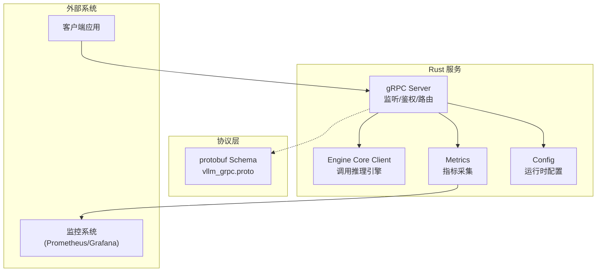
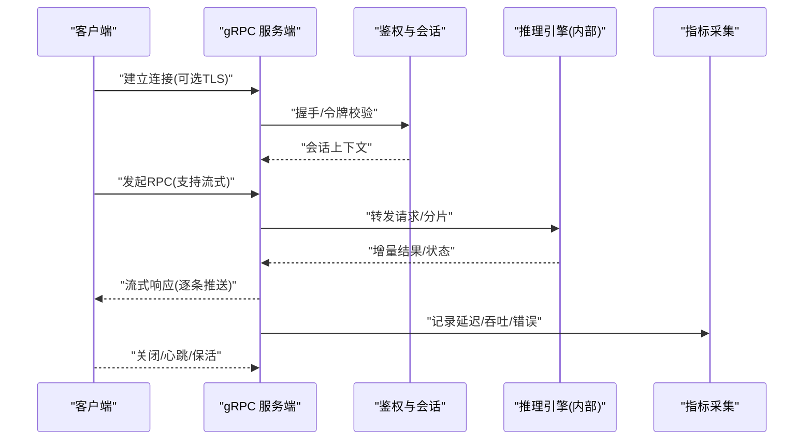
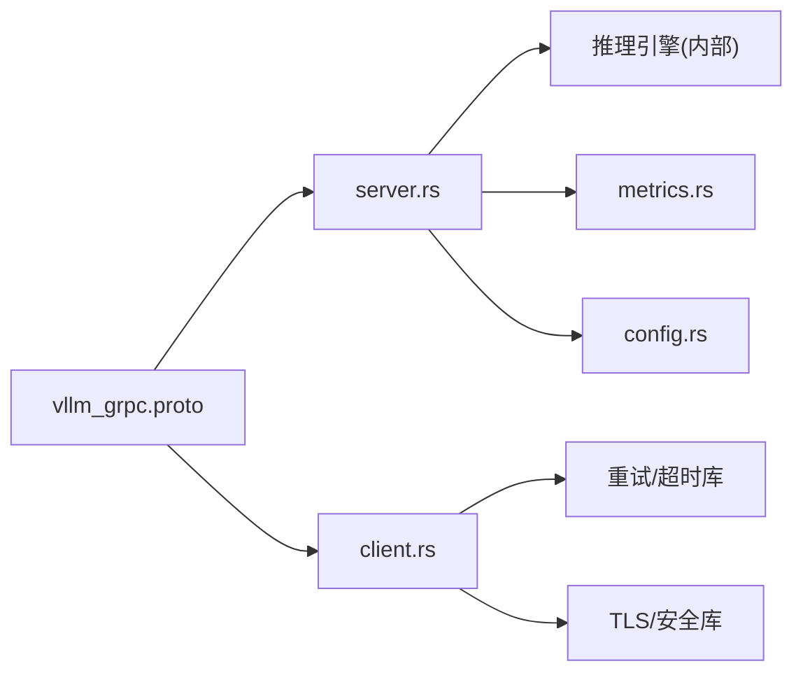

# gRPC高性能接口

<cite>
**本文档引用的文件**   
- [vllm_grpc.proto](file://rust/proto/vllm_grpc.proto)
- [server.rs](file://rust/src/server/server.rs)
- [client.rs](file://rust/src/engine-core-client/client.rs)
- [metrics.rs](file://rust/src/metrics/metrics.rs)
- [config.rs](file://rust/src/server/config.rs)
- [error.rs](file://rust/src/server/error.rs)
- [README.md](file://README.md)
</cite>

## 目录
1. [简介](#简介)
2. [项目结构](#项目结构)
3. [核心组件](#核心组件)
4. [架构总览](#架构总览)
5. [详细组件分析](#详细组件分析)
6. [依赖关系分析](#依赖关系分析)
7. [性能考虑](#性能考虑)
8. [故障排查指南](#故障排查指南)
9. [结论](#结论)
10. [附录](#附录)

## 简介
本文件面向需要在 vLLM 中集成或扩展 gRPC 高性能通信接口的开发者，系统性说明 protobuf 消息定义、连接与认证、会话管理、RPC 方法调用（含双向流式）、序列化与压缩、网络传输优化、客户端与服务端实现要点、错误处理与重试、超时配置、性能调优、监控指标以及故障排查。文档同时对比 gRPC 与 REST API 的差异与选型建议，帮助读者在工程实践中做出合理选择。

## 项目结构
vLLM 的 gRPC 相关能力主要集中在 Rust 子模块中：
- proto 定义位于 rust/proto/vllm_grpc.proto，统一描述请求、响应与流式消息的 Schema。
- 服务端实现位于 rust/src/server，负责监听端口、鉴权、路由、流式处理与指标上报。
- 客户端示例位于 rust/src/engine-core-client，展示如何建立连接、发送请求、处理流式响应与错误。
- 指标与配置分别由 metrics 和 config 模块提供。

图表来源 
- [vllm_grpc.proto](file://rust/proto/vllm_grpc.proto)
- [server.rs](file://rust/src/server/server.rs)
- [client.rs](file://rust/src/engine-core-client/client.rs)
- [metrics.rs](file://rust/src/metrics/metrics.rs)
- [config.rs](file://rust/src/server/config.rs)

章节来源
- [README.md](file://README.md)

## 核心组件
- 协议定义（proto）：集中描述所有 RPC 方法与消息类型，包括请求、响应与流式消息字段、语义与约束。
- gRPC 服务端：实现鉴权、会话管理、请求路由、流式输出、指标统计与错误码映射。
- gRPC 客户端：封装连接管理、重试策略、超时控制、流式读取与错误处理。
- 指标与可观测性：暴露关键性能与健康指标，便于接入监控系统。
- 配置中心：集中管理端口、TLS、鉴权、压缩、并发与流控等参数。

章节来源
- [vllm_grpc.proto](file://rust/proto/vllm_grpc.proto)
- [server.rs](file://rust/src/server/server.rs)
- [client.rs](file://rust/src/engine-core-client/client.rs)
- [metrics.rs](file://rust/src/metrics/metrics.rs)
- [config.rs](file://rust/src/server/config.rs)

## 架构总览
下图展示了从客户端到服务端的端到端交互流程，包含鉴权、流式响应与指标上报的关键路径。

图表来源 
- [server.rs](file://rust/src/server/server.rs)
- [client.rs](file://rust/src/engine-core-client/client.rs)
- [metrics.rs](file://rust/src/metrics/metrics.rs)

## 详细组件分析

### 协议定义（protobuf Schema）
- 请求消息：包含模型标识、输入文本/多模态数据、采样参数、上下文信息、追踪ID等。
- 响应消息：包含生成文本片段、token概率、停止原因、元数据与指标。
- 流式消息：用于长时任务的分块返回，如增量 token、进度事件、错误事件。
- 枚举与常量：定义错误码、采样策略、压缩算法等。

建议关注点
- 字段版本兼容性与向后兼容性策略。
- 流式消息的边界条件（空流、中断、重连）。
- 大消息体拆分与合并策略。

章节来源
- [vllm_grpc.proto](file://rust/proto/vllm_grpc.proto)

### 连接建立与认证机制
- 连接建立：支持 TLS 加密通道、HTTP/2 特性、KeepAlive 心跳。
- 认证方式：支持基于令牌（Token）的鉴权、证书校验、网关前置鉴权。
- 会话管理：为每个连接维护会话上下文（用户、租户、配额、限流）。

章节来源
- [server.rs](file://rust/src/server/server.rs)
- [config.rs](file://rust/src/server/config.rs)

### RPC 方法调用与双向流式
- 单向 RPC：适用于短请求快速响应场景。
- 服务端流式：适用于长任务增量输出（如逐 token 返回）。
- 客户端流式：适用于批量上传或分片写入。
- 双向流式：适用于实时对话、交互式生成、持续状态同步。

章节来源
- [vllm_grpc.proto](file://rust/proto/vllm_grpc.proto)
- [client.rs](file://rust/src/engine-core-client/client.rs)

### 消息序列化与压缩
- 序列化格式：默认使用 protobuf 二进制编码，高效且跨语言。
- 压缩选项：支持 gzip、snappy 等压缩算法，权衡带宽与CPU开销。
- 批处理与零拷贝：在服务端与客户端侧进行缓冲与内存复用，减少分配与拷贝。

章节来源
- [config.rs](file://rust/src/server/config.rs)
- [metrics.rs](file://rust/src/metrics/metrics.rs)

### 客户端实现要点
- 连接池与重试：指数退避、幂等性判断、熔断与降级。
- 超时配置：连接超时、请求超时、流式读超时。
- 错误处理：区分网络错误、业务错误、超时与取消。
- 流式读取：背压控制、缓冲区上限、异常恢复。

章节来源
- [client.rs](file://rust/src/engine-core-client/client.rs)

### 服务端实现要点
- 鉴权与授权：统一拦截器、权限校验、租户隔离。
- 流式处理：背压、限流、资源清理、优雅关闭。
- 指标与日志：结构化日志、关键指标埋点、分布式追踪。
- 错误映射：将内部错误映射为标准 gRPC 错误码与消息。

章节来源
- [server.rs](file://rust/src/server/server.rs)
- [error.rs](file://rust/src/server/error.rs)
- [metrics.rs](file://rust/src/metrics/metrics.rs)

### 错误处理与重试机制
- 错误分类：网络层、协议层、业务层、资源限制。
- 重试策略：仅对幂等方法启用，结合退避与熔断。
- 超时与取消：全局与局部超时、上下文取消传播。

章节来源
- [error.rs](file://rust/src/server/error.rs)
- [client.rs](file://rust/src/engine-core-client/client.rs)

### 监控指标与可观测性
- 关键指标：QPS、延迟分布、错误率、吞吐、资源占用、流式速率。
- 指标导出：Prometheus 暴露端点、OpenTelemetry 集成。
- 告警规则：阈值与趋势告警、容量规划依据。

章节来源
- [metrics.rs](file://rust/src/metrics/metrics.rs)

## 依赖关系分析
gRPC 服务依赖 proto 定义、内部推理引擎、指标系统与配置模块；客户端依赖连接管理与重试库。

图表来源 
- [vllm_grpc.proto](file://rust/proto/vllm_grpc.proto)
- [server.rs](file://rust/src/server/server.rs)
- [client.rs](file://rust/src/engine-core-client/client.rs)
- [metrics.rs](file://rust/src/metrics/metrics.rs)
- [config.rs](file://rust/src/server/config.rs)

章节来源
- [vllm_grpc.proto](file://rust/proto/vllm_grpc.proto)
- [server.rs](file://rust/src/server/server.rs)
- [client.rs](file://rust/src/engine-core-client/client.rs)
- [metrics.rs](file://rust/src/metrics/metrics.rs)
- [config.rs](file://rust/src/server/config.rs)

## 性能考虑
- 连接复用：保持 HTTP/2 连接池，避免频繁握手。
- 压缩策略：根据负载与CPU预算选择合适压缩算法。
- 流式优先：长任务采用流式降低首字节延迟与内存峰值。
- 批处理：聚合小请求，提升吞吐。
- 资源隔离：按租户/模型隔离队列与线程池。
- 背压控制：防止下游过载导致雪崩。
- 缓存与预热：热点模型与KV缓存命中优化。
- 监控驱动：以指标为依据动态调参。

[本节为通用指导，不直接分析具体文件]

## 故障排查指南
- 连接失败：检查端口、防火墙、TLS 证书与域名解析。
- 鉴权失败：核对令牌有效期、签名算法与权限范围。
- 超时问题：区分连接/请求/流式读超时，调整阈值与后端耗时。
- 流式中断：检查背压、缓冲区上限、客户端取消与服务器关闭。
- 错误码定位：对照标准 gRPC 错误码与自定义错误映射。
- 指标异常：查看 QPS、延迟、错误率与资源占用曲线。

章节来源
- [error.rs](file://rust/src/server/error.rs)
- [metrics.rs](file://rust/src/metrics/metrics.rs)
- [config.rs](file://rust/src/server/config.rs)

## 结论
通过统一的 proto 定义、健壮的服务端实现与完善的客户端实践，vLLM 的 gRPC 接口能够支撑高吞吐、低延迟的推理服务。结合压缩、流式、重试与监控，可在复杂生产环境中获得稳定与高效的通信体验。建议在大规模部署中优先采用流式与批处理，并以指标驱动持续调优。

[本节为总结性内容，不直接分析具体文件]

## 附录

### gRPC 与 REST API 差异与选型建议
- 性能：gRPC 基于 HTTP/2 与二进制协议，通常具备更低延迟与更高吞吐。
- 流式：gRPC 原生支持多种流式模式，适合实时交互与增量输出。
- 强类型：proto 定义带来强类型契约，利于前后端协作与演进。
- 生态：REST 生态成熟、易调试；gRPC 更适合微服务与高性能场景。
- 选型建议：
  - 对外开放与简单场景：REST。
  - 内部服务与高性能需求：gRPC。
  - 混合架构：REST 作为网关入口，内部走 gRPC。

[本节为概念性内容，不直接分析具体文件]