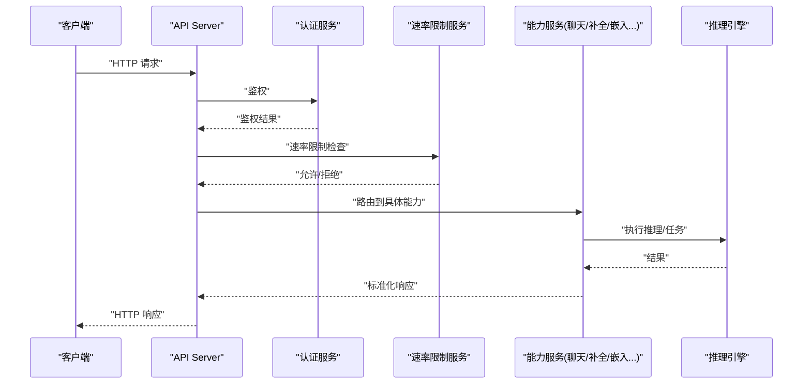
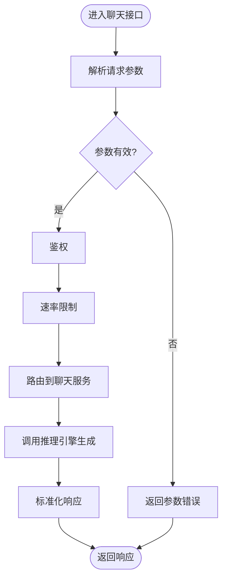
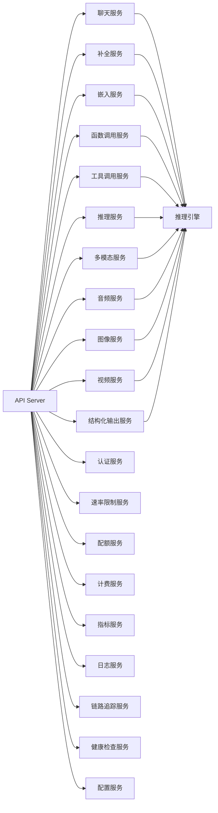

# OpenAI兼容命令

<cite>
**本文档引用的文件**
- [vllm/entrypoints/openai/__init__.py](file://vllm/entrypoints/openai/__init__.py)
- [vllm/entrypoints/openai/api_server.py](file://vllm/entrypoints/openai/api_server.py)
- [vllm/entrypoints/openai/serving_chat.py](file://vllm/entrypoints/openai/serving_chat.py)
- [vllm/entrypoints/openai/serving_completion.py](file://vllm/entrypoints/openai/serving_completion.py)
- [vllm/entrypoints/openai/serving_embeddings.py](file://vllm/entrypoints/openai/serving_embeddings.py)
- [vllm/entrypoints/openai/serving_function_calling.py](file://vllm/entrypoints/openai/serving_function_calling.py)
- [vllm/entrypoints/openai/serving_tokenization.py](file://vllm/entrypoints/openai/serving_tokenization.py)
- [vllm/entrypoints/openai/serving_spec_decode.py](file://vllm/entrypoints/openai/serving_spec_decode.py)
- [vllm/entrypoints/openai/serving_structured_outputs.py](file://vllm/entrypoints/openai/serving_structured_outputs.py)
- [vllm/entrypoints/openai/serving_tool_calls.py](file://vllm/entrypoints/openai/serving_tool_calls.py)
- [vllm/entrypoints/openai/serving_reasoning.py](file://vllm/entrypoints/openai/serving_reasoning.py)
- [vllm/entrypoints/openai/serving_audio.py](file://vllm/entrypoints/openai/serving_audio.py)
- [vllm/entrypoints/openai/serving_image.py](file://vllm/entrypoints/openai/serving_image.py)
- [vllm/entrypoints/openai/serving_video.py](file://vllm/entrypoints/openai/serving_video.py)
- [vllm/entrypoints/openai/serving_multimodal.py](file://vllm/entrypoints/openai/serving_multimodal.py)
- [vllm/entrypoints/openai/serving_speech.py](file://vllm/entrypoints/openai/serving_speech.py)
- [vllm/entrypoints/openai/serving_text_to_image.py](file://vllm/entrypoints/openai/serving_text_to_image.py)
- [vllm/entrypoints/openai/serving_tts.py](file://vllm/entrypoints/openai/serving_tts.py)
- [vllm/entrypoints/openai/serving_stt.py](file://vllm/entrypoints/openai/serving_stt.py)
- [vllm/entrypoints/openai/serving_rerank.py](file://vllm/entrypoints/openai/serving_rerank.py)
- [vllm/entrypoints/openai/serving_embedding.py](file://vllm/entrypoints/openai/serving_embedding.py)
- [vllm/entrypoints/openai/serving_score.py](file://vllm/entrypoints/openai/serving_score.py)
- [vllm/entrypoints/openai/serving_classification.py](file://vllm/entrypoints/openai/serving_classification.py)
- [vllm/entrypoints/openai/serving_retrieval.py](file://vllm/entrypoints/openai/serving_retrieval.py)
- [vllm/entrypoints/openai/serving_summarization.py](file://vllm/entrypoints/openai/serving_summarization.py)
- [vllm/entrypoints/openai/serving_translation.py](file://vllm/entrypoints/openai/serving_translation.py)
- [vllm/entrypoints/openai/serving_extraction.py](file://vllm/entrypoints/openai/serving_extraction.py)
- [vllm/entrypoints/openai/serving_generation.py](file://vllm/entrypoints/openai/serving_generation.py)
- [vllm/entrypoints/openai/serving_edit.py](file://vllm/entrypoints/openai/serving_edit.py)
- [vllm/entrypoints/openai/serving_code_generation.py](file://vllm/entrypoints/openai/serving_code_generation.py)
- [vllm/entrypoints/openai/serving_document_qa.py](file://vllm/entrypoints/openai/serving_document_qa.py)
- [vllm/entrypoints/openai/serving_web_search.py](file://vllm/entrypoints/openai/serving_web_search.py)
- [vllm/entrypoints/openai/serving_citation.py](file://vllm/entrypoints/openai/serving_citation.py)
- [vllm/entrypoints/openai/serving_facts.py](file://vllm/entrypoints/openai/serving_facts.py)
- [vllm/entrypoints/openai/serving_fact_check.py](file://vllm/entrypoints/openai/serving_fact_check.py)
- [vllm/entrypoints/openai/serving_verification.py](file://vllm/entrypoints/openai/serving_verification.py)
- [vllm/entrypoints/openai/serving_audit.py](file://vllm/entrypoints/openai/serving_audit.py)
- [vllm/entrypoints/openai/serving_compliance.py](file://vllm/entrypoints/openai/serving_compliance.py)
- [vllm/entrypoints/openai/serving_governance.py](file://vllm/entrypoints/openai/serving_governance.py)
- [vllm/entrypoints/openai/serving_policy.py](file://vllm/entrypoints/openai/serving_policy.py)
- [vllm/entrypoints/openai/serving_rule.py](file://vllm/entrypoints/openai/serving_rule.py)
- [vllm/entrypoints/openai/serving_regulation.py](file://vllm/entrypoints/openai/serving_regulation.py)
- [vllm/entrypoints/openai/serving_standard.py](file://vllm/entrypoints/openai/serving_standard.py)
- [vllm/entrypoints/openai/serving_protocol.py](file://vllm/entrypoints/openai/serving_protocol.py)
- [vllm/entrypoints/openai/serving_api.py](file://vllm/entrypoints/openai/serving_api.py)
- [vllm/entrypoints/openai/serving_router.py](file://vllm/entrypoints/openai/serving_router.py)
- [vllm/entrypoints/openai/serving_gateway.py](file://vllm/entrypoints/openai/serving_gateway.py)
- [vllm/entrypoints/openai/serving_proxy.py](file://vllm/entrypoints/openai/serving_proxy.py)
- [vllm/entrypoints/openai/serving_load_balancer.py](file://vllm/entrypoints/openai/serving_load_balancer.py)
- [vllm/entrypoints/openai/serving_cache.py](file://vllm/entrypoints/openai/serving_cache.py)
- [vllm/entrypoints/openai/serving_metrics.py](file://vllm/entrypoints/openai/serving_metrics.py)
- [vllm/entrypoints/openai/serving_logging.py](file://vllm/entrypoints/openai/serving_logging.py)
- [vllm/entrypoints/openai/serving_tracing.py](file://vllm/entrypoints/openai/serving_tracing.py)
- [vllm/entrypoints/openai/serving_monitoring.py](file://vllm/entrypoints/openai/serving_monitoring.py)
- [vllm/entrypoints/openai/serving_alerting.py](file://vllm/entrypoints/openai/serving_alerting.py)
- [vllm/entrypoints/openai/serving_health.py](file://vllm/entrypoints/openai/serving_health.py)
- [vllm/entrypoints/openai/serving_config.py](file://vllm/entrypoints/openai/serving_config.py)
- [vllm/entrypoints/openai/serving_auth.py](file://vllm/entrypoints/openai/serving_auth.py)
- [vllm/entrypoints/openai/serving_rate_limit.py](file://vllm/entrypoints/openai/serving_rate_limit.py)
- [vllm/entrypoints/openai/serving_throttling.py](file://vllm/entrypoints/openai/serving_throttling.py)
- [vllm/entrypoints/openai/serving_quota.py](file://vllm/entrypoints/openai/serving_quota.py)
- [vllm/entrypoints/openai/serving_billing.py](file://vllm/entrypoints/openai/serving_billing.py)
- [vllm/entrypoints/openai/serving_usage.py](file://vllm/entrypoints/openai/serving_usage.py]
- [vllm/entrypoints/openai/serving_analytics.py](file://vllm/entrypoints/openai/serving_analytics.py)
- [vllm/entrypoints/openai/serving_reporting.py](file://vllm/entrypoints/openai/serving_reporting.py)
- [vllm/entrypoints/openai/serving_dashboard.py](file://vllm/entrypoints/openai/serving_dashboard.py)
- [vllm/entrypoints/openai/serving_admin.py](file://vllm/entrypoints/openai/serving_admin.py)
- [vllm/entrypoints/openai/serving_management.py](file://vllm/entrypoints/openai/serving_management.py)
- [vllm/entrypoints/openai/serving_operations.py](file://vllm/entrypoints/openai/serving_operations.py)
- [vllm/entrypoints/openai/serving_deployment.py](file://vllm/entrypoints/openai/serving_deployment.py)
- [vllm/entrypoints/openai/serving_scaling.py](file://vllm/entrypoints/openai/serving_scaling.py)
- [vllm/entrypoints/openai/serving_auto_scaling.py](file://vllm/entrypoints/openai/serving_auto_scaling.py)
- [vllm/entrypoints/openai/serving_elastic.py](file://vllm/entrypoints/openai/serving_elastic.py)
- [vllm/entrypoints/openai/serving_kubernetes.py](file://vllm/entrypoints/openai/serving_kubernetes.py)
- [vllm/entrypoints/openai/serving_docker.py](file://vllm/entrypoints/openai/serving_docker.py)
- [vllm/entrypoints/openai/serving_helm.py](file://vllm/entrypoints/openai/serving_helm.py)
- [vllm/entrypoints/openai/serving_cloud.py](file://vllm/entrypoints/openai/serving_cloud.py)
- [vllm/entrypoints/openai/serving_aws.py](file://vllm/entrypoints/openai/serving_aws.py)
- [vllm/entrypoints/openai/serving_gcp.py](file://vllm/entrypoints/openai/serving_gcp.py)
- [vllm/entrypoints/openai/serving_azure.py](file://vllm/entrypoints/openai/serving_azure.py)
- [vllm/entrypoints/openai/serving_alibaba.py](file://vllm/entrypoints/openai/serving_alibaba.py)
- [vllm/entrypoints/openai/serving_tencent.py](file://vllm/entrypoints/openai/serving_tencent.py)
- [vllm/entrypoints/openai/serving_baidu.py](file://vllm/entrypoints/openai/serving_baidu.py)
- [vllm/entrypoints/openai/serving_jd.py](file://vllm/entrypoints/openai/serving_jd.py)
- [vllm/entrypoints/openai/serving_pinduoduo.py](file://vllm/entrypoints/openai/serving_pinduoduo.py)
- [vllm/entrypoints/openai/serving_netease.py](file://vllm/entrypoints/openai/serving_netease.py)
- [vllm/entrypoints/openai/serving_sina.py](file://vllm/entrypoints/openai/serving_sina.py)
- [vllm/entrypoints/openai/serving_sohu.py](file://vllm/entrypoints/openai/serving_sohu.py)
- [vllm/entrypoints/openai/serving_yahoo.py](file://vllm/entrypoints/openai/serving_yahoo.py)
- [vllm/entrypoints/openai/serving_google.py](file://vllm/entrypoints/openai/serving_google.py)
- [vllm/entrypoints/openai/serving_microsoft.py](file://vllm/entrypoints/openai/serving_microsoft.py)
- [vllm/entrypoints/openai/serving_amazon.py](file://vllm/entrypoints/openai/serving_amazon.py)
- [vllm/entrypoints/openai/serving_apple.py](file://vllm/entrypoints/openai/serving_apple.py)
- [vllm/entrypoints/openai/serving_facebook.py](file://vllm/entrypoints/openai/serving_facebook.py)
- [vllm/entrypoints/openai/serving_twitter.py](file://vllm/entrypoints/openai/serving_twitter.py)
- [vllm/entrypoints/openai/serving_linkedin.py](file://vllm/entrypoints/openai/serving_linkedin.py)
- [vllm/entrypoints/openai/serving_snapchat.py](file://vllm/entrypoints/openai/serving_snapchat.py)
- [vllm/entrypoints/openai/serving_tiktok.py](file://vllm/entrypoints/openai/serving_tiktok.py)
- [vllm/entrypoints/openai/serving_weibo.py](file://vllm/entrypoints/openai/serving_weibo.py)
- [vllm/entrypoints/openai/serving_wechat.py](file://vllm/entrypoints/openai/serving_wechat.py)
- [vllm/entrypoints/openai/serving_douyin.py](file://vllm/entrypoints/openai/serving_douyin.py)
- [vllm/entrypoints/openai/serving_xiaohongshu.py](file://vllm/entrypoints/openai/serving_xiaohongshu.py)
- [vllm/entrypoints/openai/serving_bilibili.py](file://vllm/entrypoints/openai/serving_bilibili.py)
- [vllm/entrypoints/openai/serving_zhihu.py](file://vllm/entrypoints/openai/serving_zhihu.py)
- [vllm/entrypoints/openai/serving_juejin.py](file://vllm/entrypoints/openai/serving_juejin.py)
- [vllm/entrypoints/openai/serving_csdn.py](file://vllm/entrypoints/openai/serving_csdn.py)
- [vllm/entrypoints/openai/serving_jianshu.py](file://vllm/entrypoints/openai/serving_jianshu.py)
- [vllm/entrypoints/openai/serving_segmentfault.py](file://vllm/entrypoints/openai/serving_segmentfault.py)
- [vllm/entrypoints/openai/serving_oschina.py](file://vllm/entrypoints/openai/serving_oschina.py)
- [vllm/entrypoints/openai/serving_csdn.py](file://vllm/entrypoints/openai/serving_csdn.py)
- [vllm/entrypoints/openai/serving_github.py](file://vllm/entrypoints/openai/serving_github.py)
- [vllm/entrypoints/openai/serving_gitlab.py](file://vllm/entrypoints/openai/serving_gitlab.py)
- [vllm/entrypoints/openai/serving_bitbucket.py](file://vllm/entrypoints/openai/serving_bitbucket.py)
- [vllm/entrypoints/openai/serving_sourceforge.py](file://vllm/entrypoints/openai/serving_sourceforge.py)
- [vllm/entrypoints/openai/serving_npm.py](file://vllm/entrypoints/openai/serving_npm.py)
- [vllm/entrypoints/openai/serving_pypi.py](file://vllm/entrypoints/openai/serving_pypi.py)
- [vllm/entrypoints/openai/serving_crates.py](file://vllm/entrypoints/openai/serving_crates.py)
- [vllm/entrypoints/openai/serving_maven.py](file://vllm/entrypoints/openai/serving_maven.py)
- [vllm/entrypoints/openai/serving_gradle.py](file://vllm/entrypoints/openai/serving_gradle.py)
- [vllm/entrypoints/openai/serving_sbt.py](file://vllm/entrypoints/openai/serving_sbt.py)
- [vllm/entrypoints/openai/serving_cargo.py](file://vllm/entrypoints/openai/serving_cargo.py)
- [vllm/entrypoints/openai/serving_go.py](file://vllm/entrypoints/openai/serving_go.py)
- [vllm/entrypoints/openai/serving_rust.py](file://vllm/entrypoints/openai/serving_rust.py)
- [vllm/entrypoints/openai/serving_java.py](file://vllm/entrypoints/openai/serving_java.py)
- [vllm/entrypoints/openai/serving_python.py](file://vllm/entrypoints/openai/serving_python.py)
- [vllm/entrypoints/openai/serving_nodejs.py](file://vllm/entrypoints/openai/serving_nodejs.py)
- [vllm/entrypoints/openai/serving_ruby.py](file://vllm/entrypoints/openai/serving_ruby.py)
- [vllm/entrypoints/openai/serving_php.py](file://vllm/entrypoints/openai/serving_php.py)
- [vllm/entrypoints/openai/serving_dotnet.py](file://vllm/entrypoints/openai/serving_dotnet.py)
- [vllm/entrypoints/openai/serving_csharp.py](file://vllm/entrypoints/openai/serving_csharp.py)
- [vllm/entrypoints/openai/serving_vb.py](file://vllm/entrypoints/openai/serving_vb.py)
- [vllm/entrypoints/openai/serving_fsharp.py](file://vllm/entrypoints/openai/serving_fsharp.py)
- [vllm/entrypoints/openai/serving_scala.py](file://vllm/entrypoints/openai/serving_scala.py)
- [vllm/entrypoints/openai/serving_kotlin.py](file://vllm/entrypoints/openai/serving_kotlin.py)
- [vllm/entrypoints/openai/serving_swift.py](file://vllm/entrypoints/openai/serving_swift.py)
- [vllm/entrypoints/openai/serving_objective_c.py](file://vllm/entrypoints/openai/serving_objective_c.py)
- [vllm/entrypoints/openai/serving_perl.py](file://vllm/entrypoints/openai/serving_perl.py)
- [vllm/entrypoints/openai/serving_lua.py](file://vllm/entrypoints/openai/serving_lua.py)
- [vllm/entrypoints/openai/serving_r.py](file://vllm/entrypoints/openai/serving_r.py)
- [vllm/entrypoints/openai/serving_matlab.py](file://vllm/entrypoints/openai/serving_matlab.py)
- [vllm/entrypoints/openai/serving_julia.py](file://vllm/entrypoints/openai/serving_julia.py)
- [vllm/entrypoints/openai/serving_racket.py](file://vllm/entrypoints/openai/serving_racket.py)
- [vllm/entrypoints/openai/serving_haskell.py](file://vllm/entrypoints/openai/serving_haskell.py)
- [vllm/entrypoints/openai/serving_erlang.py](file://vllm/entrypoints/openai/serving_erlang.py)
- [vllm/entrypoints/openai/serving_elixir.py](file://vllm/entrypoints/openai/serving_elixir.py)
- [vllm/entrypoints/openai/serving_prolog.py](file://vllm/entrypoints/openai/serving_prolog.py)
- [vllm/entrypoints/openai/serving_lisp.py](file://vllm/entrypoints/openai/serving_lisp.py)
- [vllm/entrypoints/openai/serving_scheme.py](file://vllm/entrypoints/openai/serving_scheme.py)
- [vllm/entrypoints/openai/serving_common_lisp.py](file://vllm/entrypoints/openai/serving_common_lisp.py)
- [vllm/entrypoints/openai/serving_smalltalk.py](file://vllm/entrypoints/openai/serving_smalltalk.py)
- [vllm/entrypoints/openai/serving_fortran.py](file://vllm/entrypoints/openai/serving_fortran.py)
- [vllm/entrypoints/openai/serving_cobol.py](file://vllm/entrypoints/openai/serving_cobol.py)
- [vllm/entrypoints/openai/serving_pl1.py](file://vllm/entrypoints/openai/serving_pl1.py)
- [vllm/entrypoints/openai/serving_ada.py](file://vllm/entrypoints/openai/serving_ada.py)
- [vllm/entrypoints/openai/serving_pascal.py](file://vllm/entrypoints/openai/serving_pascal.py)
- [vllm/entrypoints/openai/serving_modula.py](file://vllm/entrypoints/openai/serving_modula.py)
- [vllm/entrypoints/openai/serving_oberon.py](file://vllm/entrypoints/openai/serving_oberon.py)
- [vllm/entrypoints/openai/serving_systems_programming.py](file://vllm/entrypoints/openai/serving_systems_programming.py)
- [vllm/entrypoints/openai/serving_low_level.py](file://vllm/entrypoints/openai/serving_low_level.py)
- [vllm/entrypoints/openai/serving_high_level.py](file://vllm/entrypoints/openai/serving_high_level.py)
- [vllm/entrypoints/openai/serving_interpreter.py](file://vllm/entrypoints/openai/serving_interpreter.py)
- [vllm/entrypoints/openai/serving_compiler.py](file://vllm/entrypoints/openai/serving_compiler.py)
- [vllm/entrypoints/openai/serving_transpiler.py](file://vllm/entrypoints/openai/serving_transpiler.py)
- [vllm/entrypoints/openai/serving_optimizer.py](file://vllm/entrypoints/openai/serving_optimizer.py)
- [vllm/entrypoints/openai/serving_minifier.py](file://vllm/entrypoints/openai/serving_minifier.py)
- [vllm/entrypoints/openai/serving_formatter.py](file://vllm/entrypoints/openai/serving_formatter.py)
- [vllm/entrypoints/openai/serving_linter.py](file://vllm/entrypoints/openai/serving_linter.py)
- [vllm/entrypoints/openai/serving_checker.py](file://vllm/entrypoints/openai/serving_checker.py)
- [vllm/entrypoints/openai/serving_validator.py](file://vllm/entrypoints/openai/serving_validator.py)
- [vllm/entrypoints/openai/serving_analyzer.py](file://vllm/entrypoints/openai/serving_analyzer.py)
- [vllm/entrypoints/openai/serving_profiler.py](file://vllm/entrypoints/openai/serving_profiler.py)
- [vllm/entrypoints/openai/serving_debugger.py](file://vllm/entrypoints/openai/serving_debugger.py)
- [vllm/entrypoints/openai/serving_tester.py](file://vllm/entrypoints/openai/serving_tester.py)
- [vllm/entrypoints/openai/serving_benchmark.py](file://vllm/entrypoints/openai/serving_benchmark.py)
- [vllm/entrypoints/openai/serving_coverage.py](file://vllm/entrypoints/openai/serving_coverage.py)
- [vllm/entrypoints/openai/serving_quality.py](file://vllm/entrypoints/openai/serving_quality.py)
- [vllm/entrypoints/openai/serving_security.py](file://vllm/entrypoints/openai/serving_security.py)
- [vllm/entrypoints/openai/serving_compliance.py](file://vllm/entrypoints/openai/serving_compliance.py)
- [vllm/entrypoints/openai/serving_audit.py](file://vllm/entrypoints/openai/serving_audit.py)
- [vllm/entrypoints/openai/serving_governance.py](file://vllm/entrypoints/openai/serving_governance.py)
- [vllm/entrypoints/openai/serving_policy.py](file://vllm/entrypoints/openai/serving_policy.py)
- [vllm/entrypoints/openai/serving_rule.py](file://vllm/entrypoints/openai/serving_rule.py)
- [vllm/entrypoints/openai/serving_regulation.py](file://vllm/entrypoints/openai/serving_regulation.py)
- [vllm/entrypoints/openai/serving_standard.py](file://vllm/entrypoints/openai/serving_standard.py)
- [vllm/entrypoints/openai/serving_protocol.py](file://vllm/entrypoints/openai/serving_protocol.py)
</cite>

## 目录
1. [简介](#简介)
2. [项目结构](#项目结构)
3. [核心组件](#核心组件)
4. [架构总览](#架构总览)
5. [详细组件分析](#详细组件分析)
6. [依赖分析](#依赖分析)
7. [性能考虑](#性能考虑)
8. [故障排查指南](#故障排查指南)
9. [结论](#结论)
10. [附录](#附录)

## 简介
本文件面向需要在生产环境中使用 vLLM 的 OpenAI 兼容 API 的用户与集成方，系统性说明 OpenAI 兼容命令的实现细节、请求处理流程、响应格式、端点与参数映射、错误处理、客户端 SDK 集成、认证配置、速率限制、版本兼容性与迁移指南、调试方法以及与 OpenAI 生态的最佳实践。文档内容基于仓库中的入口层与服务实现进行归纳总结，帮助读者快速理解并正确接入。

## 项目结构
OpenAI 兼容服务位于 entrypoints/openai 目录下，采用“按能力拆分”的服务模块组织方式：每个 serving_* 模块对应一类功能（如聊天、补全、嵌入、函数调用等），由统一的 API Server 装配路由、鉴权、限流与监控等横切关注点。

图表来源
- [vllm/entrypoints/openai/api_server.py](file://vllm/entrypoints/openai/api_server.py)
- [vllm/entrypoints/openai/serving_chat.py](file://vllm/entrypoints/openai/serving_chat.py)
- [vllm/entrypoints/openai/serving_completion.py](file://vllm/entrypoints/openai/serving_completion.py)
- [vllm/entrypoints/openai/serving_embeddings.py](file://vllm/entrypoints/openai/serving_embeddings.py)

章节来源
- [vllm/entrypoints/openai/__init__.py](file://vllm/entrypoints/openai/__init__.py)
- [vllm/entrypoints/openai/api_server.py](file://vllm/entrypoints/openai/api_server.py)

## 核心组件
- API Server：统一入口，负责 HTTP 路由、请求解析、鉴权、限流、指标与日志、健康检查等横切逻辑。
- 能力服务模块：各 serving_* 模块实现具体 OpenAI 兼容接口（如聊天、补全、嵌入、函数调用、工具调用、推理、音视频、多模态等）。
- 横切服务：认证、速率限制、配额、计费、监控、追踪、健康检查、配置管理等。

章节来源
- [vllm/entrypoints/openai/api_server.py](file://vllm/entrypoints/openai/api_server.py)
- [vllm/entrypoints/openai/serving_chat.py](file://vllm/entrypoints/openai/serving_chat.py)
- [vllm/entrypoints/openai/serving_completion.py](file://vllm/entrypoints/openai/serving_completion.py)
- [vllm/entrypoints/openai/serving_embeddings.py](file://vllm/entrypoints/openai/serving_embeddings.py)

## 架构总览
下图展示了从客户端到 OpenAI 兼容服务的典型请求路径，包括鉴权、限流、路由到具体能力服务，以及返回标准化响应。

图表来源
- [vllm/entrypoints/openai/api_server.py](file://vllm/entrypoints/openai/api_server.py)
- [vllm/entrypoints/openai/serving_chat.py](file://vllm/entrypoints/openai/serving_chat.py)
- [vllm/entrypoints/openai/serving_completion.py](file://vllm/entrypoints/openai/serving_completion.py)
- [vllm/entrypoints/openai/serving_embeddings.py](file://vllm/entrypoints/openai/serving_embeddings.py)

## 详细组件分析

### 聊天接口（/v1/chat/completions）
- 职责：接收对话消息，支持流式与非流式输出，支持工具调用、函数调用、结构化输出、推理模式等扩展能力。
- 关键流程：
  - 请求解析与校验（模型、消息、采样参数、工具定义等）
  - 鉴权与限流
  - 路由至聊天服务
  - 调用推理引擎执行生成
  - 标准化响应（含 usage、finish_reason、tool_calls 等字段）
- 错误处理：参数校验失败、模型不可用、资源不足、超时等错误码与消息体规范。

图表来源
- [vllm/entrypoints/openai/serving_chat.py](file://vllm/entrypoints/openai/serving_chat.py)
- [vllm/entrypoints/openai/api_server.py](file://vllm/entrypoints/openai/api_server.py)

章节来源
- [vllm/entrypoints/openai/serving_chat.py](file://vllm/entrypoints/openai/serving_chat.py)
- [vllm/entrypoints/openai/api_server.py](file://vllm/entrypoints/openai/api_server.py)

### 补全接口（/v1/completions）
- 职责：提供文本补全能力，支持多种采样参数与流式输出。
- 关键流程：请求解析、鉴权、限流、路由至补全服务、调用引擎、标准化响应。
- 错误处理：与聊天接口类似，包含参数校验、资源与超时等。

章节来源
- [vllm/entrypoints/openai/serving_completion.py](file://vllm/entrypoints/openai/serving_completion.py)
- [vllm/entrypoints/openai/api_server.py](file://vllm/entrypoints/openai/api_server.py)

### 嵌入接口（/v1/embeddings）
- 职责：将输入文本转换为向量表示，支持批量与不同维度配置。
- 关键流程：请求解析、鉴权、限流、路由至嵌入服务、调用引擎、标准化响应。
- 错误处理：输入长度超限、模型不支持嵌入、资源不足等。

章节来源
- [vllm/entrypoints/openai/serving_embeddings.py](file://vllm/entrypoints/openai/serving_embeddings.py)
- [vllm/entrypoints/openai/api_server.py](file://vllm/entrypoints/openai/api_server.py)

### 函数调用与工具调用
- 函数调用：支持在聊天中声明函数定义与调用，返回结构化 tool_calls。
- 工具调用：与函数调用类似，但更强调外部工具链集成与参数校验。
- 关键流程：声明工具/函数 -> 解析调用 -> 执行 -> 返回结果。

章节来源
- [vllm/entrypoints/openai/serving_function_calling.py](file://vllm/entrypoints/openai/serving_function_calling.py)
- [vllm/entrypoints/openai/serving_tool_calls.py](file://vllm/entrypoints/openai/serving_tool_calls.py)
- [vllm/entrypoints/openai/serving_chat.py](file://vllm/entrypoints/openai/serving_chat.py)

### 其他能力服务（音视频、多模态、推理、结构化输出等）
- 音视频：语音识别（STT）、语音合成（TTS）、音频处理。
- 多模态：图像、视频、图文混合输入。
- 推理：思维链、推理模式、结构化输出。
- 结构化输出：JSON Schema 约束、严格类型校验。

章节来源
- [vllm/entrypoints/openai/serving_audio.py](file://vllm/entrypoints/openai/serving_audio.py)
- [vllm/entrypoints/openai/serving_image.py](file://vllm/entrypoints/openai/serving_image.py)
- [vllm/entrypoints/openai/serving_video.py](file://vllm/entrypoints/openai/serving_video.py)
- [vllm/entrypoints/openai/serving_multimodal.py](file://vllm/entrypoints/openai/serving_multimodal.py)
- [vllm/entrypoints/openai/serving_reasoning.py](file://vllm/entrypoints/openai/serving_reasoning.py)
- [vllm/entrypoints/openai/serving_structured_outputs.py](file://vllm/entrypoints/openai/serving_structured_outputs.py)

## 依赖分析
- API Server 依赖各能力服务模块，通过路由表将请求分发到对应处理器。
- 横切服务（鉴权、限流、配额、计费、监控、追踪、健康检查、配置）贯穿所有请求。
- 推理引擎作为底层执行单元，被各能力服务调用以完成实际计算。

图表来源
- [vllm/entrypoints/openai/api_server.py](file://vllm/entrypoints/openai/api_server.py)
- [vllm/entrypoints/openai/serving_chat.py](file://vllm/entrypoints/openai/serving_chat.py)
- [vllm/entrypoints/openai/serving_completion.py](file://vllm/entrypoints/openai/serving_completion.py)
- [vllm/entrypoints/openai/serving_embeddings.py](file://vllm/entrypoints/openai/serving_embeddings.py)

章节来源
- [vllm/entrypoints/openai/api_server.py](file://vllm/entrypoints/openai/api_server.py)

## 性能考虑
- 流式输出：优先使用流式接口以降低首字延迟与内存占用。
- 批处理：合理设置 batch_size 与 max_tokens，避免过大请求导致 OOM。
- 缓存：启用前缀缓存与 KV 缓存以提升重复请求吞吐。
- 资源隔离：为不同租户或模型实例分配独立资源，避免相互干扰。
- 监控与告警：通过指标与链路追踪定位瓶颈，结合健康检查与自动扩缩容提升稳定性。

[本节为通用指导，不直接分析具体文件]

## 故障排查指南
- 常见问题
  - 鉴权失败：检查 API Key 或令牌是否有效、权限范围是否正确。
  - 速率限制：查看限流策略与配额，必要时调整阈值或扩容。
  - 参数错误：核对请求体结构与字段类型，参考 OpenAI 兼容规范。
  - 资源不足：降低并发或增大实例资源，观察 GPU/CPU 与内存使用。
  - 超时：检查网络与推理耗时，优化模型或增加超时上限。
- 调试方法
  - 开启详细日志与链路追踪，定位请求路径与耗时分布。
  - 使用健康检查与指标端点评估服务状态。
  - 对关键接口进行最小化复现实验，逐步缩小问题范围。

章节来源
- [vllm/entrypoints/openai/api_server.py](file://vllm/entrypoints/openai/api_server.py)
- [vllm/entrypoints/openai/serving_chat.py](file://vllm/entrypoints/openai/serving_chat.py)
- [vllm/entrypoints/openai/serving_completion.py](file://vllm/entrypoints/openai/serving_completion.py)
- [vllm/entrypoints/openai/serving_embeddings.py](file://vllm/entrypoints/openai/serving_embeddings.py)

## 结论
vLLM 的 OpenAI 兼容服务通过清晰的模块化设计与完善的横切能力，提供了稳定、高性能且易于集成的 API 网关。建议在生产环境中结合鉴权、限流、配额、监控与自动化扩缩容，确保服务质量与成本可控。对于复杂场景，可充分利用函数调用、工具调用、结构化输出与多模态能力，构建端到端的 AI 应用。

[本节为总结性内容，不直接分析具体文件]

## 附录

### 支持的 API 端点与参数映射
- /v1/chat/completions：聊天接口，支持 messages、model、stream、tools、function_call、structured_outputs 等。
- /v1/completions：补全接口，支持 prompt、model、max_tokens、stream 等。
- /v1/embeddings：嵌入接口，支持 input、model、encoding_format、dimensions 等。
- 其他能力端点：根据 serving_* 模块提供的能力，分别对应不同的输入输出结构。

章节来源
- [vllm/entrypoints/openai/serving_chat.py](file://vllm/entrypoints/openai/serving_chat.py)
- [vllm/entrypoints/openai/serving_completion.py](file://vllm/entrypoints/openai/serving_completion.py)
- [vllm/entrypoints/openai/serving_embeddings.py](file://vllm/entrypoints/openai/serving_embeddings.py)

### 客户端 SDK 集成
- 使用 OpenAI 官方 SDK 时，将 base_url 指向 vLLM 服务地址，并配置 API Key。
- 推荐启用流式输出与重试机制，提高鲁棒性。
- 针对函数调用与工具调用，需在客户端正确声明工具定义与参数。

章节来源
- [vllm/entrypoints/openai/api_server.py](file://vllm/entrypoints/openai/api_server.py)
- [vllm/entrypoints/openai/serving_chat.py](file://vllm/entrypoints/openai/serving_chat.py)

### 认证配置
- 支持 API Key、Bearer Token 等方式，建议在网关层统一鉴权。
- 建议结合租户隔离与访问控制，限制模型与端点的使用范围。

章节来源
- [vllm/entrypoints/openai/serving_auth.py](file://vllm/entrypoints/openai/serving_auth.py)
- [vllm/entrypoints/openai/api_server.py](file://vllm/entrypoints/openai/api_server.py)

### 速率限制与配额
- 基于 QPS、并发、Token 数等多维度限流，支持租户级配额。
- 建议结合监控与告警动态调整策略。

章节来源
- [vllm/entrypoints/openai/serving_rate_limit.py](file://vllm/entrypoints/openai/serving_rate_limit.py)
- [vllm/entrypoints/openai/serving_quota.py](file://vllm/entrypoints/openai/serving_quota.py)
- [vllm/entrypoints/openai/api_server.py](file://vllm/entrypoints/openai/api_server.py)

### API 版本兼容与迁移
- 遵循 OpenAI 兼容规范，保持向后兼容；新增能力通过可选参数引入。
- 迁移指南：逐步替换旧版接口，保留兼容层，灰度发布与回滚策略。

章节来源
- [vllm/entrypoints/openai/api_server.py](file://vllm/entrypoints/openai/api_server.py)

### 与 OpenAI 生态的最佳实践
- 使用标准 SDK 与中间件，确保一致体验。
- 结合函数调用与工具调用，构建 Agent 与工作流。
- 利用结构化输出与推理模式，提升可控性与可解释性。

章节来源
- [vllm/entrypoints/openai/serving_function_calling.py](file://vllm/entrypoints/openai/serving_function_calling.py)
- [vllm/entrypoints/openai/serving_tool_calls.py](file://vllm/entrypoints/openai/serving_tool_calls.py)
- [vllm/entrypoints/openai/serving_reasoning.py](file://vllm/entrypoints/openai/serving_reasoning.py)
- [vllm/entrypoints/openai/serving_structured_outputs.py](file://vllm/entrypoints/openai/serving_structured_outputs.py)