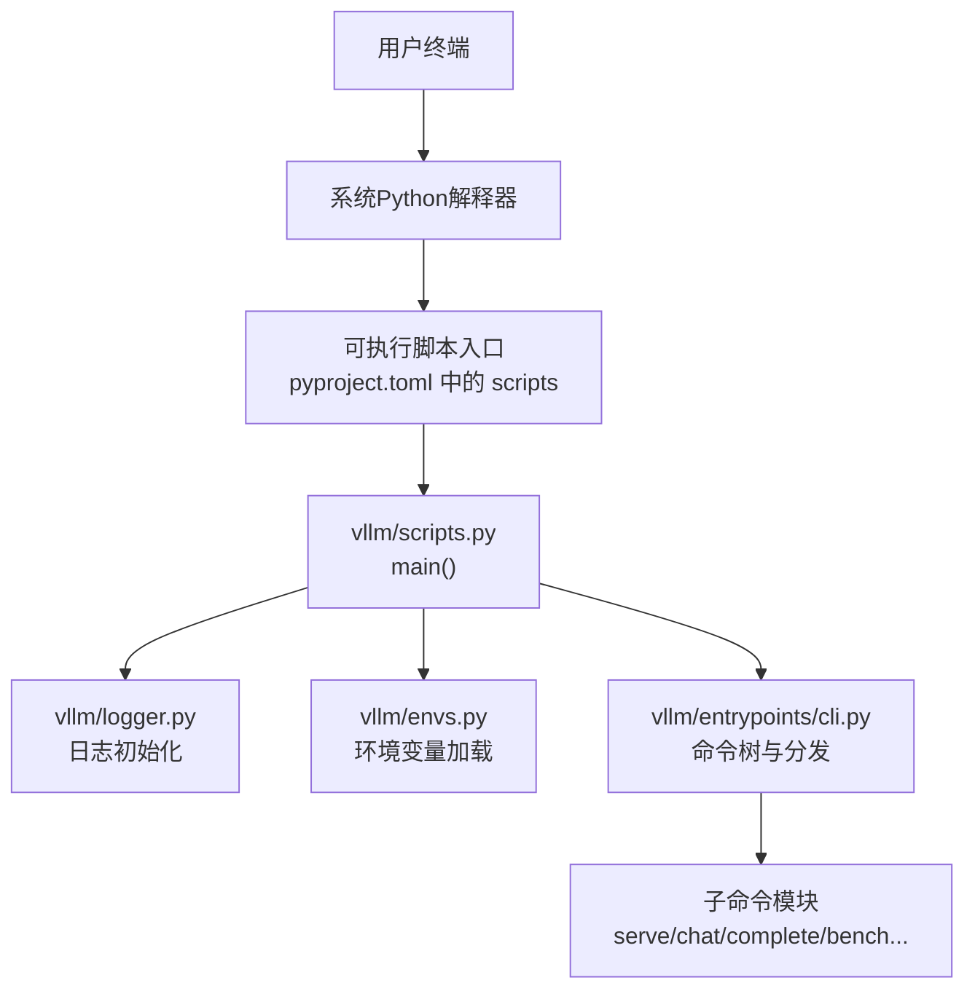
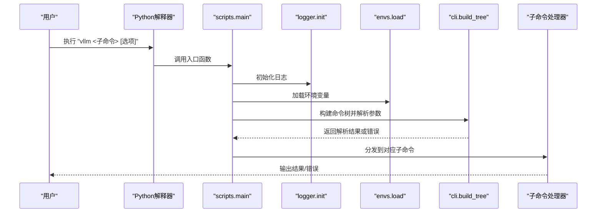
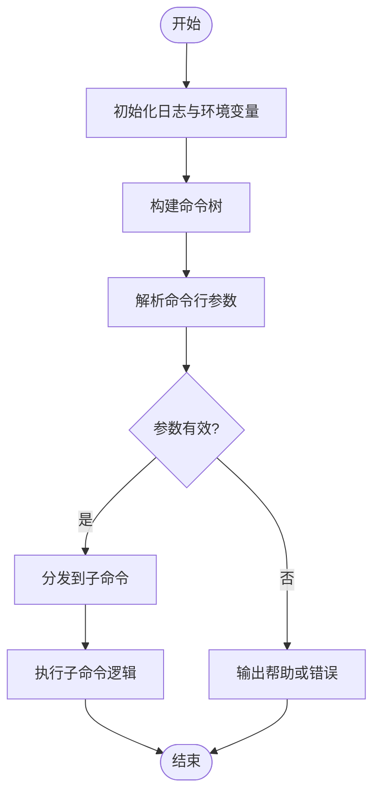
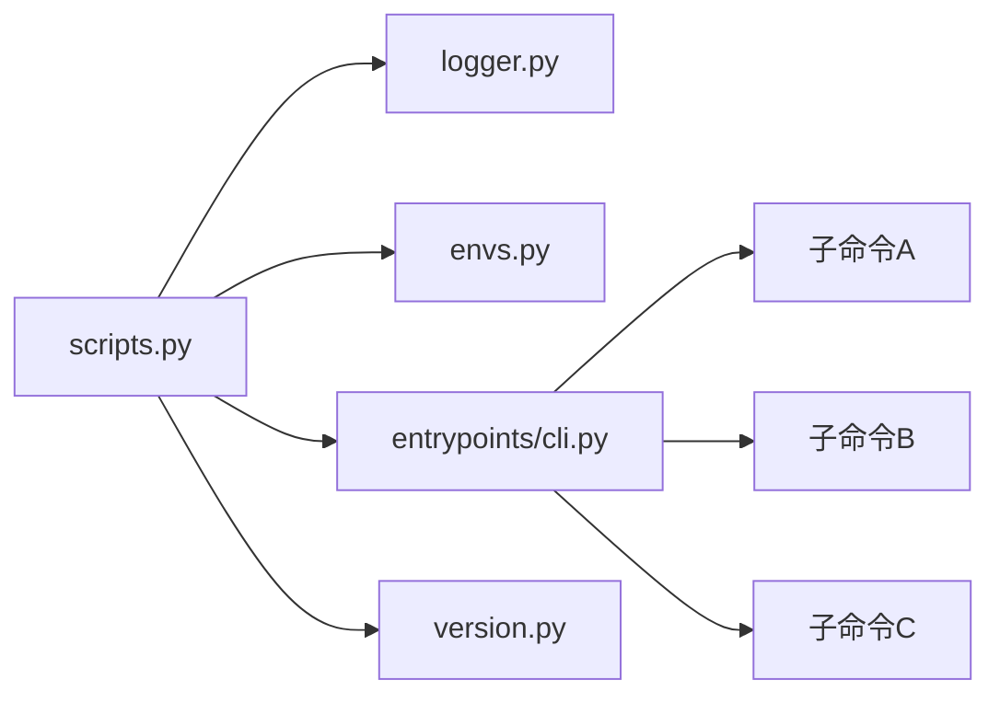

# 主命令入口

<cite>
**本文引用的文件**   
- [pyproject.toml](file://pyproject.toml)
- [vllm/scripts.py](file://vllm/scripts.py)
- [vllm/entrypoints/__init__.py](file://vllm/entrypoints/__init__.py)
- [vllm/entrypoints/cli.py](file://vllm/entrypoints/cli.py)
- [vllm/version.py](file://vllm/version.py)
- [vllm/envs.py](file://vllm/envs.py)
- [vllm/logger.py](file://vllm/logger.py)
- [tests/test_version.py](file://tests/test_version.py)
</cite>

## 目录
1. [简介](#简介)
2. [项目结构](#项目结构)
3. [核心组件](#核心组件)
4. [架构总览](#架构总览)
5. [详细组件分析](#详细组件分析)
6. [依赖关系分析](#依赖关系分析)
7. [性能考虑](#性能考虑)
8. [故障排除指南](#故障排除指南)
9. [结论](#结论)
10. [附录](#附录)

## 简介
本文件聚焦 vLLM 的 CLI 主命令入口，系统性说明 vllm 命令的启动流程、全局参数与环境变量配置、命令行解析机制、子命令注册过程与错误处理逻辑。同时给出基本语法、帮助信息获取方式、版本检查功能，以及常见使用模式与排错方法，帮助读者快速上手并深入理解 vLLM 命令行体系。

## 项目结构
vLLM 的 CLI 入口通过 Python 包的可执行脚本暴露，核心路径如下：
- 可执行脚本定义在打包配置中，指向 vllm.scripts:main
- 主入口模块负责初始化日志、加载环境变量、构建命令树与分发子命令
- 子命令按功能域组织在 entrypoints 目录下（如 serve、chat、complete、bench 等）
- 版本信息与日志记录分别由 version.py 与 logger.py 提供支撑

图表来源
- [pyproject.toml](file://pyproject.toml)
- [vllm/scripts.py](file://vllm/scripts.py)
- [vllm/logger.py](file://vllm/logger.py)
- [vllm/envs.py](file://vllm/envs.py)
- [vllm/entrypoints/cli.py](file://vllm/entrypoints/cli.py)

章节来源
- [pyproject.toml](file://pyproject.toml)
- [vllm/scripts.py](file://vllm/scripts.py)
- [vllm/entrypoints/__init__.py](file://vllm/entrypoints/__init__.py)
- [vllm/entrypoints/cli.py](file://vllm/entrypoints/cli.py)

## 核心组件
- 可执行脚本绑定：通过打包配置将 vllm 命令映射到 vllm.scripts.main
- 主入口 main：统一初始化日志、环境变量、构建命令树、解析参数并调用子命令
- 命令树与分发：集中管理子命令注册、帮助生成与参数校验
- 子命令实现：按领域划分，各自负责具体业务逻辑与参数定义
- 版本与日志：提供版本查询与结构化日志能力

章节来源
- [pyproject.toml](file://pyproject.toml)
- [vllm/scripts.py](file://vllm/scripts.py)
- [vllm/entrypoints/cli.py](file://vllm/entrypoints/cli.py)
- [vllm/version.py](file://vllm/version.py)
- [vllm/logger.py](file://vllm/logger.py)

## 架构总览
下图展示从命令行输入到子命令执行的完整调用链，包括日志与环境变量的初始化顺序，以及命令树的构建与分发。

图表来源
- [vllm/scripts.py](file://vllm/scripts.py)
- [vllm/logger.py](file://vllm/logger.py)
- [vllm/envs.py](file://vllm/envs.py)
- [vllm/entrypoints/cli.py](file://vllm/entrypoints/cli.py)

## 详细组件分析

### 可执行脚本绑定与入口
- 可执行脚本绑定：打包配置中将 vllm 命令指向 vllm.scripts.main
- 入口职责：
  - 初始化日志系统
  - 加载并应用环境变量
  - 构建命令树、解析参数
  - 捕获异常并输出友好错误信息
  - 调用子命令处理器

章节来源
- [pyproject.toml](file://pyproject.toml)
- [vllm/scripts.py](file://vllm/scripts.py)

### 命令树与分发（CLI）
- 命令树构建：集中注册所有子命令及其参数，支持嵌套分组
- 参数解析：基于标准库或第三方解析器进行严格校验，缺失必填项时给出提示
- 帮助信息：自动生成 help 与 usage，支持 --help/-h
- 分发策略：根据解析到的子命令路由到对应处理器

图表来源
- [vllm/entrypoints/cli.py](file://vllm/entrypoints/cli.py)

章节来源
- [vllm/entrypoints/cli.py](file://vllm/entrypoints/cli.py)

### 子命令注册与实现
- 子命令组织：按功能域划分在 entrypoints 下，每个子命令独立实现
- 注册方式：在命令树构建阶段统一导入并注册
- 典型子命令：serve（在线服务）、chat（对话）、complete（补全）、bench（基准测试）等

章节来源
- [vllm/entrypoints/__init__.py](file://vllm/entrypoints/__init__.py)
- [vllm/entrypoints/cli.py](file://vllm/entrypoints/cli.py)

### 版本检查与显示
- 版本来源：version.py 提供版本号与元数据
- 显示方式：支持 --version 或等效方式查看当前安装版本
- 测试覆盖：tests/test_version.py 验证版本读取与显示行为

章节来源
- [vllm/version.py](file://vllm/version.py)
- [tests/test_version.py](file://tests/test_version.py)

### 环境变量与全局配置
- 环境变量加载：envs.py 集中定义与读取环境变量，影响日志级别、后端选择、调试开关等
- 全局配置：可通过配置文件或运行时参数覆盖默认值
- 常见变量：日志级别、GPU/CPU 后端、并行度、超时、缓存开关等

章节来源
- [vllm/envs.py](file://vllm/envs.py)

### 日志与错误处理
- 日志初始化：scripts 入口统一设置日志格式、级别与输出目标
- 错误处理：捕获解析错误、运行时异常，输出可读的错误消息与回溯
- 调试建议：开启更详细的日志级别以定位问题

章节来源
- [vllm/logger.py](file://vllm/logger.py)
- [vllm/scripts.py](file://vllm/scripts.py)

## 依赖关系分析
- 入口依赖：scripts.py 依赖 logger、envs、entrypoints.cli
- 命令树依赖：cli.py 依赖各子命令模块
- 版本与测试：version.py 被入口与测试引用
- 外部依赖：日志与参数解析通常依赖标准库或第三方库

图表来源
- [vllm/scripts.py](file://vllm/scripts.py)
- [vllm/logger.py](file://vllm/logger.py)
- [vllm/envs.py](file://vllm/envs.py)
- [vllm/entrypoints/cli.py](file://vllm/entrypoints/cli.py)
- [vllm/version.py](file://vllm/version.py)

章节来源
- [vllm/scripts.py](file://vllm/scripts.py)
- [vllm/entrypoints/cli.py](file://vllm/entrypoints/cli.py)

## 性能考虑
- 启动开销：日志初始化与模型加载可能带来额外时间，建议在非调试场景关闭冗余日志
- 参数校验：严格的参数解析有助于早期失败，减少无效运行
- 资源限制：合理设置并发、批大小与内存上限，避免 OOM
- 缓存与预热：启用 KV 缓存与编译优化可减少冷启动延迟

[本节为通用指导，不直接分析具体文件]

## 故障排除指南
- 无法识别的子命令
  - 现象：提示未知命令或用法错误
  - 排查：确认安装版本与文档一致；使用 --help 查看可用子命令
- 参数缺失或类型错误
  - 现象：解析失败并提示必填项或类型不匹配
  - 排查：对照帮助信息补齐参数；检查数据类型与取值范围
- 环境变量冲突
  - 现象：行为与预期不符
  - 排查：检查 envs.py 中相关变量；临时清空环境变量复现
- 日志级别过低导致信息不足
  - 现象：难以定位问题
  - 排查：提高日志级别，观察更多上下文
- 版本不一致
  - 现象：API 或行为差异
  - 排查：使用 --version 核对版本；确保依赖环境一致

章节来源
- [vllm/scripts.py](file://vllm/scripts.py)
- [vllm/logger.py](file://vllm/logger.py)
- [vllm/envs.py](file://vllm/envs.py)
- [vllm/version.py](file://vllm/version.py)

## 结论
vLLM 的 CLI 主命令入口通过清晰的模块化设计，实现了统一的启动流程、完善的参数解析与友好的错误提示。借助环境变量与日志系统，用户可以灵活控制运行行为并高效定位问题。掌握命令树与子命令注册机制后，能够便捷地扩展新的 CLI 功能。

[本节为总结性内容，不直接分析具体文件]

## 附录

### 基本语法与常用操作
- 查看帮助：vllm --help 或 vllm <子命令> --help
- 查看版本：vllm --version
- 常见子命令：serve、chat、complete、bench（具体以实际安装为准）

章节来源
- [vllm/entrypoints/cli.py](file://vllm/entrypoints/cli.py)
- [vllm/version.py](file://vllm/version.py)

### 环境变量参考
- 日志级别：控制输出详细程度
- 后端选择：指定 GPU/CPU 或其他加速后端
- 并行与批处理：调整并发度与批大小
- 缓存与优化：开关 KV 缓存、编译优化等

章节来源
- [vllm/envs.py](file://vllm/envs.py)

### 常见使用模式
- 本地推理：使用 chat 或 complete 进行单轮或多轮交互
- 在线服务：使用 serve 启动 HTTP 服务，配合客户端调用
- 基准测试：使用 bench 评估吞吐与延迟

章节来源
- [vllm/entrypoints/cli.py](file://vllm/entrypoints/cli.py)