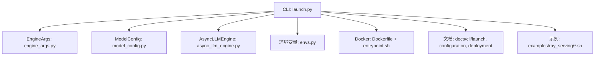
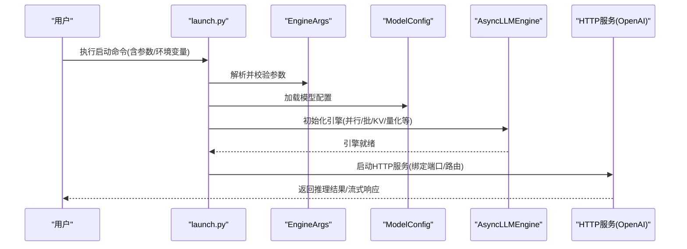
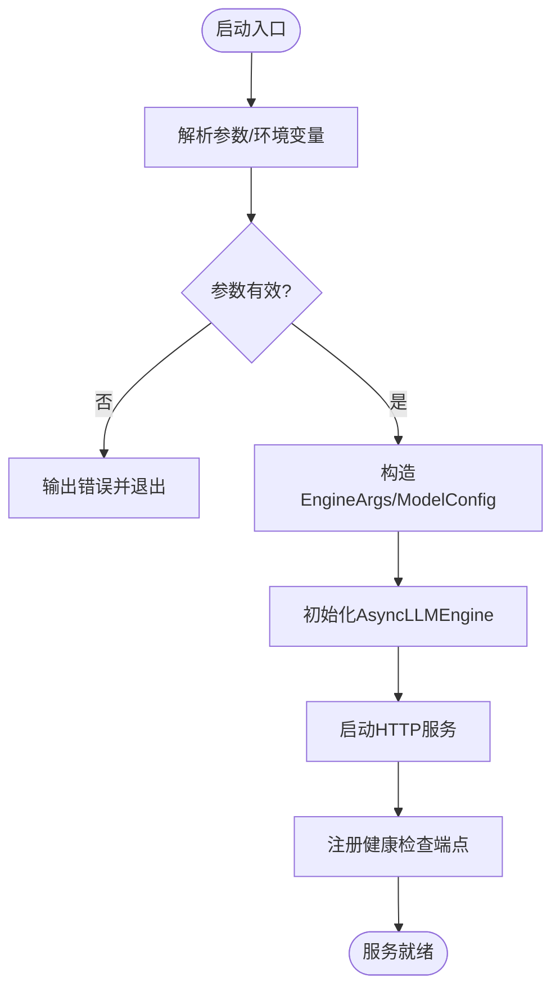
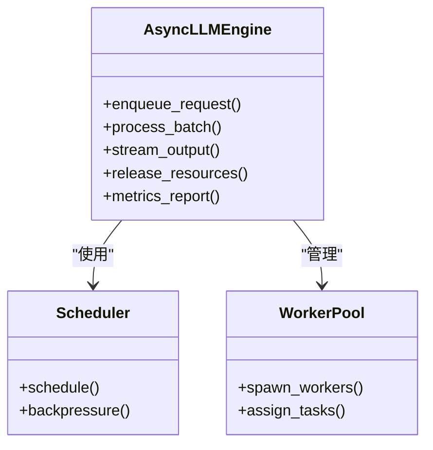
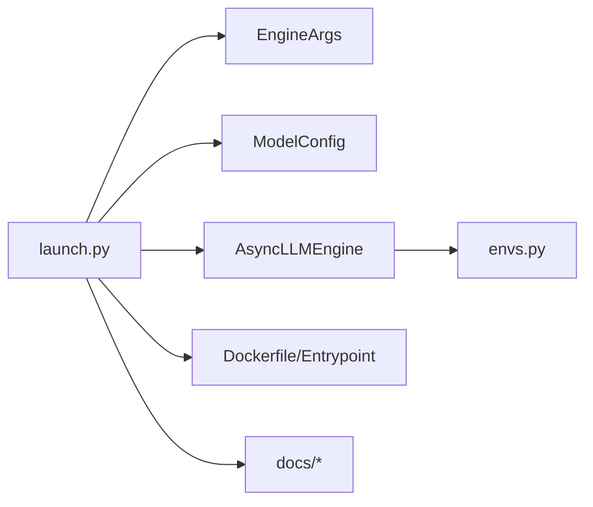

# 启动器命令

<cite>
**本文引用的文件**   
- [vllm/entrypoints/launch.py](file://vllm/entrypoints/launch.py)
- [vllm/engine/async_llm_engine.py](file://vllm/engine/async_llm_engine.py)
- [vllm/config/model_config.py](file://vllm/config/model_config.py)
- [vllm/config/engine_args.py](file://vllm/config/engine_args.py)
- [vllm/envs.py](file://vllm/envs.py)
- [docker/Dockerfile](file://docker/Dockerfile)
- [docker/entrypoints/vllm-nonroot-entrypoint.sh](file://docker/entrypoints/vllm-nonroot-entrypoint.sh)
- [docs/cli/launch/README.md](file://docs/cli/launch/README.md)
- [docs/configuration/engine_args.md](file://docs/configuration/engine_args.md)
- [docs/configuration/env_vars.md](file://docs/configuration/env_vars.md)
- [docs/deployment/docker.md](file://docs/deployment/docker.md)
- [docs/deployment/k8s.md](file://docs/deployment/k8s.md)
- [examples/ray_serving/multi-node-serving.sh](file://examples/ray_serving/multi-node-serving.sh)
- [examples/ray_serving/run_cluster.sh](file://examples/ray_serving/run_cluster.sh)
</cite>

## 目录
1. [简介](#简介)
2. [项目结构](#项目结构)
3. [核心组件](#核心组件)
4. [架构总览](#架构总览)
5. [详细组件分析](#详细组件分析)
6. [依赖关系分析](#依赖关系分析)
7. [性能与资源管理](#性能与资源管理)
8. [故障排查指南](#故障排查指南)
9. [结论](#结论)
10. [附录](#附录)

## 简介
本文件面向使用 vLLM 的“启动器命令”（launch）的用户与运维工程师，系统性说明模型启动器的配置选项、进程管理与资源分配策略，覆盖多进程启动、GPU 分配、内存管理、容器化部署、环境变量传递、日志收集、集群部署、健康检查与服务发现、故障恢复、自动扩缩容以及监控告警等关键主题。文档以代码与官方文档为依据，提供可操作的实践建议与可视化流程图，帮助读者快速搭建稳定高效的推理服务。

## 项目结构
围绕 launch 命令的关键实现与文档分布如下：
- CLI 入口与参数解析：entrypoints/launch.py
- 引擎初始化与异步执行：engine/async_llm_engine.py
- 模型与引擎配置：config/model_config.py、config/engine_args.py
- 环境变量定义：envs.py
- 容器镜像与入口脚本：docker/Dockerfile、docker/entrypoints/*.sh
- 用户文档：docs/cli/launch/README.md、docs/configuration/*.md、docs/deployment/*.md
- 多节点示例脚本：examples/ray_serving/*.sh

图表来源
- [vllm/entrypoints/launch.py](file://vllm/entrypoints/launch.py)
- [vllm/config/engine_args.py](file://vllm/config/engine_args.py)
- [vllm/config/model_config.py](file://vllm/config/model_config.py)
- [vllm/engine/async_llm_engine.py](file://vllm/engine/async_llm_engine.py)
- [vllm/envs.py](file://vllm/envs.py)
- [docker/Dockerfile](file://docker/Dockerfile)
- [docker/entrypoints/vllm-nonroot-entrypoint.sh](file://docker/entrypoints/vllm-nonroot-entrypoint.sh)
- [docs/cli/launch/README.md](file://docs/cli/launch/README.md)
- [docs/configuration/engine_args.md](file://docs/configuration/engine_args.md)
- [docs/configuration/env_vars.md](file://docs/configuration/env_vars.md)
- [docs/deployment/docker.md](file://docs/deployment/docker.md)
- [docs/deployment/k8s.md](file://docs/deployment/k8s.md)
- [examples/ray_serving/multi-node-serving.sh](file://examples/ray_serving/multi-node-serving.sh)
- [examples/ray_serving/run_cluster.sh](file://examples/ray_serving/run_cluster.sh)

章节来源
- [docs/cli/launch/README.md](file://docs/cli/launch/README.md)
- [docs/configuration/engine_args.md](file://docs/configuration/engine_args.md)
- [docs/configuration/env_vars.md](file://docs/configuration/env_vars.md)
- [docs/deployment/docker.md](file://docs/deployment/docker.md)
- [docs/deployment/k8s.md](file://docs/deployment/k8s.md)

## 核心组件
- 启动器 CLI（launch）
  - 负责解析命令行参数、加载配置、设置环境变量、创建并启动引擎实例，最终暴露 HTTP API（OpenAI 兼容接口）。
- 引擎参数（EngineArgs）
  - 集中管理推理引擎的核心参数，如并行度、批大小、KV 缓存、量化、注意力后端、分布式通信等。
- 模型配置（ModelConfig）
  - 描述模型架构、权重路径、精度、分片策略、特殊 token 等。
- 异步引擎（AsyncLLMEngine）
  - 封装请求调度、批处理、流式输出、并发控制与资源管理。
- 环境变量（envs.py）
  - 统一声明运行时环境变量，影响日志、调试、性能调优与硬件特性开关。
- 容器与入口脚本
  - 提供标准镜像构建与运行方式，支持非 root 运行、端口映射、卷挂载与环境变量注入。

章节来源
- [vllm/entrypoints/launch.py](file://vllm/entrypoints/launch.py)
- [vllm/config/engine_args.py](file://vllm/config/engine_args.py)
- [vllm/config/model_config.py](file://vllm/config/model_config.py)
- [vllm/engine/async_llm_engine.py](file://vllm/engine/async_llm_engine.py)
- [vllm/envs.py](file://vllm/envs.py)
- [docker/Dockerfile](file://docker/Dockerfile)
- [docker/entrypoints/vllm-nonroot-entrypoint.sh](file://docker/entrypoints/vllm-nonroot-entrypoint.sh)

## 架构总览
下图展示了从 CLI 到引擎与服务的整体调用链路与数据流向。

图表来源
- [vllm/entrypoints/launch.py](file://vllm/entrypoints/launch.py)
- [vllm/config/engine_args.py](file://vllm/config/engine_args.py)
- [vllm/config/model_config.py](file://vllm/config/model_config.py)
- [vllm/engine/async_llm_engine.py](file://vllm/engine/async_llm_engine.py)

## 详细组件分析

### 启动器 CLI（launch）
- 功能要点
  - 参数解析与校验：将命令行参数转换为 EngineArgs/ModelConfig。
  - 环境变量注入：根据参数或默认值设置运行时环境变量。
  - 引擎生命周期：创建 AsyncLLMEngine，启动 HTTP 服务，监听端口。
  - 进程管理：在单机多卡或多进程场景下，按 GPU/设备数量派生子进程。
- 关键流程
  - 参数合并优先级：命令行 > 配置文件 > 环境变量 > 默认值。
  - 健康检查：服务启动后暴露健康端点，供编排系统探测。
  - 日志与指标：集成结构化日志与指标采集（Prometheus/OpenTelemetry）。

图表来源
- [vllm/entrypoints/launch.py](file://vllm/entrypoints/launch.py)
- [vllm/engine/async_llm_engine.py](file://vllm/engine/async_llm_engine.py)

章节来源
- [vllm/entrypoints/launch.py](file://vllm/entrypoints/launch.py)
- [docs/cli/launch/README.md](file://docs/cli/launch/README.md)

### 引擎参数（EngineArgs）与模型配置（ModelConfig）
- EngineArgs
  - 并行与分布式：张量并行、流水线并行、上下文并行、专家并行等。
  - 批处理与调度：最大批大小、动态批、队列长度、超时策略。
  - KV 缓存与显存：块大小、缓存管理器、水位线、卸载策略。
  - 量化与精度：INT8/FP8/混合精度、量化后端选择。
  - 注意力与内核：FlashAttention、自定义算子、编译优化。
- ModelConfig
  - 模型元信息：名称、权重路径、分片、特殊 token、对齐策略。
  - 输入输出：最大上下文长度、采样参数、模板与格式。
- 典型配置项参考
  - 详见引擎参数与模型配置文档。

章节来源
- [vllm/config/engine_args.py](file://vllm/config/engine_args.py)
- [vllm/config/model_config.py](file://vllm/config/model_config.py)
- [docs/configuration/engine_args.md](file://docs/configuration/engine_args.md)

### 异步引擎（AsyncLLMEngine）
- 职责
  - 请求入队与调度、批处理合并、流式生成、并发限流、资源回收。
- 关键行为
  - 背压与队列：当负载过高时进行排队与丢弃策略。
  - 资源隔离：按 worker/进程隔离显存与计算资源。
  - 指标上报：吞吐、延迟、队列长度、失败率等。

图表来源
- [vllm/engine/async_llm_engine.py](file://vllm/engine/async_llm_engine.py)

章节来源
- [vllm/engine/async_llm_engine.py](file://vllm/engine/async_llm_engine.py)

### 环境变量（envs.py）
- 作用
  - 控制日志级别、调试开关、性能优化、硬件特性、分布式通信后端等。
- 常见类别
  - 日志与追踪：日志等级、采样率、OTel 导出。
  - 性能与内核：注意力后端、编译开关、内存池大小。
  - 分布式与通信：NCCL/RDMA 相关、进程间通信模式。
  - 安全与权限：非 root 运行、文件访问限制。

章节来源
- [vllm/envs.py](file://vllm/envs.py)
- [docs/configuration/env_vars.md](file://docs/configuration/env_vars.md)

### 容器化部署与入口脚本
- Dockerfile
  - 基础镜像选择、依赖安装、CUDA/ROCm/XPU 适配、工作目录与端口暴露。
- 入口脚本
  - 非 root 用户运行、环境变量注入、端口绑定、健康检查、优雅关闭。
- 最佳实践
  - 只读根文件系统、最小化镜像、卷挂载模型权重、网络策略与安全组。

章节来源
- [docker/Dockerfile](file://docker/Dockerfile)
- [docker/entrypoints/vllm-nonroot-entrypoint.sh](file://docker/entrypoints/vllm-nonroot-entrypoint.sh)
- [docs/deployment/docker.md](file://docs/deployment/docker.md)

### 多进程与多节点启动
- 单机多进程
  - 通过 launch 参数指定进程数/GPU 数，每个进程绑定独立设备。
- 多节点集群
  - 基于 Ray 或其他编排框架，使用示例脚本协调主节点与工作节点。
- 关键要点
  - 进程间通信后端选择、端口规划、共享存储路径一致性。

章节来源
- [examples/ray_serving/multi-node-serving.sh](file://examples/ray_serving/multi-node-serving.sh)
- [examples/ray_serving/run_cluster.sh](file://examples/ray_serving/run_cluster.sh)
- [docs/deployment/k8s.md](file://docs/deployment/k8s.md)

## 依赖关系分析
- 模块耦合
  - launch.py 依赖 EngineArgs/ModelConfig 完成参数装配，再驱动 AsyncLLMEngine 启动服务。
  - envs.py 为各模块提供统一的运行时开关。
- 外部依赖
  - 分布式通信库（NCCL/RDMA）、容器运行时（Docker/K8s）、指标采集（Prometheus/OTel）。
- 潜在风险
  - 参数不一致导致启动失败；环境变量冲突；端口/资源竞争。

图表来源
- [vllm/entrypoints/launch.py](file://vllm/entrypoints/launch.py)
- [vllm/config/engine_args.py](file://vllm/config/engine_args.py)
- [vllm/config/model_config.py](file://vllm/config/model_config.py)
- [vllm/engine/async_llm_engine.py](file://vllm/engine/async_llm_engine.py)
- [vllm/envs.py](file://vllm/envs.py)
- [docker/Dockerfile](file://docker/Dockerfile)
- [docker/entrypoints/vllm-nonroot-entrypoint.sh](file://docker/entrypoints/vllm-nonroot-entrypoint.sh)

## 性能与资源管理
- GPU 分配策略
  - 每进程绑定单卡；跨进程避免显存争用；合理设置 CUDA_VISIBLE_DEVICES。
- 内存管理
  - KV 缓存块大小与数量、水位线与换出策略、CPU 卸载阈值。
- 批处理与并发
  - 动态批大小、请求队列长度、超时与重试策略。
- 量化与内核
  - 选择合适的量化后端与注意力内核，开启编译优化。
- 监控与指标
  - 暴露 Prometheus 指标，采集吞吐、延迟、队列、错误率。

章节来源
- [vllm/config/engine_args.py](file://vllm/config/engine_args.py)
- [vllm/config/model_config.py](file://vllm/config/model_config.py)
- [vllm/engine/async_llm_engine.py](file://vllm/engine/async_llm_engine.py)
- [docs/configuration/engine_args.md](file://docs/configuration/engine_args.md)

## 故障排查指南
- 常见问题
  - 端口占用：检查端口冲突与防火墙规则。
  - 显存不足：降低批大小、减少并行度、调整 KV 缓存。
  - 环境变量冲突：核对 envs.py 与容器注入的环境变量。
  - 分布式通信失败：确认 NCCL/RDMA 配置与网络连通性。
- 诊断手段
  - 查看启动日志与结构化日志；启用调试开关；抓取指标与堆栈。
- 恢复策略
  - 自动重启与健康检查；滚动更新与回滚；优雅关闭与状态持久化。

章节来源
- [vllm/envs.py](file://vllm/envs.py)
- [docker/entrypoints/vllm-nonroot-entrypoint.sh](file://docker/entrypoints/vllm-nonroot-entrypoint.sh)
- [docs/deployment/docker.md](file://docs/deployment/docker.md)
- [docs/deployment/k8s.md](file://docs/deployment/k8s.md)

## 结论
launch 命令是 vLLM 推理服务的关键入口，贯穿参数解析、引擎初始化、服务启动与资源管理。通过合理的 EngineArgs/ModelConfig 配置、环境变量控制与容器化部署，可实现高效稳定的多进程/多节点推理服务。结合健康检查、监控告警与自动扩缩容，可在生产环境中获得高可用与弹性伸缩能力。

## 附录
- 常用命令参考
  - 单机单卡/多卡启动、端口映射、模型权重挂载、环境变量注入。
- 集群部署清单
  - 节点规划、网络拓扑、共享存储、负载均衡、服务发现。
- 监控告警模板
  - 指标采集、仪表盘、告警规则与通知渠道。