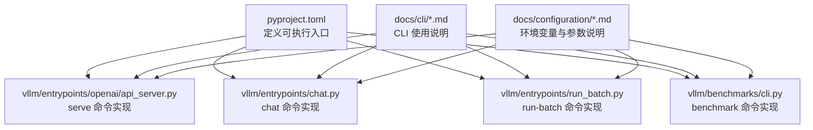
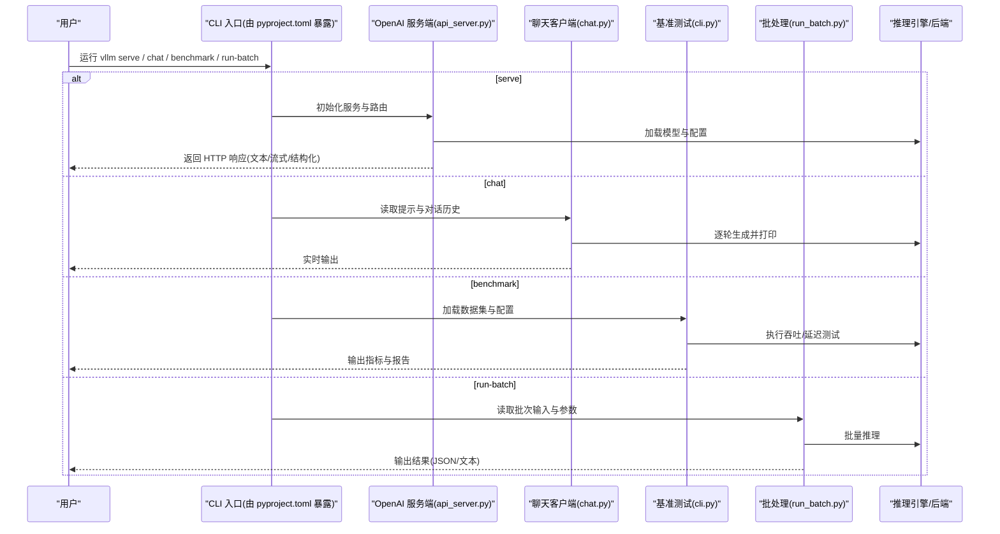
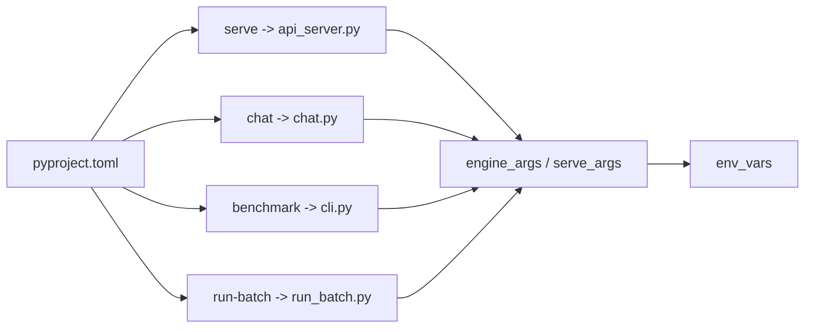

# 命令行工具

<cite>
**本文引用的文件**   
- [vllm/entrypoints/chat.py](file://vllm/entrypoints/chat.py)
- [vllm/entrypoints/run_batch.py](file://vllm/entrypoints/run_batch.py)
- [vllm/entrypoints/openai/api_server.py](file://vllm/entrypoints/openai/api_server.py)
- [vllm/benchmarks/cli.py](file://vllm/benchmarks/cli.py)
- [docs/cli/serve.md](file://docs/cli/serve.md)
- [docs/cli/chat.md](file://docs/cli/chat.md)
- [docs/cli/run-batch.md](file://docs/cli/run-batch.md)
- [docs/cli/complete.md](file://docs/cli/complete.md)
- [docs/configuration/env_vars.md](file://docs/configuration/env_vars.md)
- [docs/configuration/engine_args.md](file://docs/configuration/engine_args.md)
- [docs/configuration/serve_args.md](file://docs/configuration/serve_args.md)
- [pyproject.toml](file://pyproject.toml)
</cite>

## 目录
1. [简介](#简介)
2. [项目结构](#项目结构)
3. [核心组件](#核心组件)
4. [架构总览](#架构总览)
5. [详细组件分析](#详细组件分析)
6. [依赖关系分析](#依赖关系分析)
7. [性能考虑](#性能考虑)
8. [故障排除指南](#故障排除指南)
9. [结论](#结论)
10. [附录](#附录)

## 简介
本参考文档面向使用 vLLM 命令行工具的用户与工程师，系统梳理 serve、chat、benchmark、run-batch 等子命令的语法、参数与选项，说明适用场景、配置文件格式与环境变量设置，并提供丰富的命令行示例、输出格式说明、日志级别与调试选项、脚本化最佳实践、自动化集成方法以及与其他工具的集成和管道操作。同时给出常见问题与排障建议，帮助用户在生产与测试环境中高效使用 vLLM CLI。

## 项目结构
vLLM 的 CLI 入口主要位于 Python 包 vllm 的 entrypoints 与 benchmarks 模块中，并通过 pyproject.toml 暴露可执行命令。文档侧在 docs/cli 下提供各子命令的使用说明，配置相关的环境变量与引擎/服务参数在 docs/configuration 中集中描述。

图表来源
- [pyproject.toml](file://pyproject.toml)
- [vllm/entrypoints/openai/api_server.py](file://vllm/entrypoints/openai/api_server.py)
- [vllm/entrypoints/chat.py](file://vllm/entrypoints/chat.py)
- [vllm/entrypoints/run_batch.py](file://vllm/entrypoints/run_batch.py)
- [vllm/benchmarks/cli.py](file://vllm/benchmarks/cli.py)
- [docs/cli/serve.md](file://docs/cli/serve.md)
- [docs/cli/chat.md](file://docs/cli/chat.md)
- [docs/cli/run-batch.md](file://docs/cli/run-batch.md)
- [docs/cli/complete.md](file://docs/cli/complete.md)
- [docs/configuration/env_vars.md](file://docs/configuration/env_vars.md)
- [docs/configuration/engine_args.md](file://docs/configuration/engine_args.md)
- [docs/configuration/serve_args.md](file://docs/configuration/serve_args.md)

章节来源
- [pyproject.toml](file://pyproject.toml)
- [docs/cli/serve.md](file://docs/cli/serve.md)
- [docs/cli/chat.md](file://docs/cli/chat.md)
- [docs/cli/run-batch.md](file://docs/cli/run-batch.md)
- [docs/cli/complete.md](file://docs/cli/complete.md)
- [docs/configuration/env_vars.md](file://docs/configuration/env_vars.md)
- [docs/configuration/engine_args.md](file://docs/configuration/engine_args.md)
- [docs/configuration/serve_args.md](file://docs/configuration/serve_args.md)

## 核心组件
- serve：启动 OpenAI 兼容的服务端，支持在线推理、流式输出、结构化输出、多模态输入等。常用于部署模型为 HTTP API。
- chat：交互式聊天客户端，适合快速验证模型效果、调试提示词与采样参数。
- benchmark：基准测试套件，用于评估吞吐、延迟、显存占用等指标，支持多种数据集与后端。
- run-batch：离线批处理推理，适合批量生成、评测、数据增强等场景。

章节来源
- [docs/cli/serve.md](file://docs/cli/serve.md)
- [docs/cli/chat.md](file://docs/cli/chat.md)
- [docs/cli/run-batch.md](file://docs/cli/run-batch.md)
- [docs/cli/complete.md](file://docs/cli/complete.md)

## 架构总览
下图展示了 CLI 命令到内部组件的调用关系与数据流向。用户通过命令行触发对应入口函数，解析参数后构建引擎或服务实例，随后进入请求处理或批处理流程。

图表来源
- [vllm/entrypoints/openai/api_server.py](file://vllm/entrypoints/openai/api_server.py)
- [vllm/entrypoints/chat.py](file://vllm/entrypoints/chat.py)
- [vllm/benchmarks/cli.py](file://vllm/benchmarks/cli.py)
- [vllm/entrypoints/run_batch.py](file://vllm/entrypoints/run_batch.py)

## 详细组件分析

### serve（OpenAI 兼容服务）
- 用途：将模型以 OpenAI 兼容接口对外提供服务，支持 chat/completions、completions、embeddings 等端点，支持流式输出、结构化输出、多模态输入。
- 典型参数类别：
  - 模型与权重：模型路径、量化方式、LoRA 适配器、张量并行度、上下文长度等。
  - 服务配置：监听端口、主机地址、API 密钥、CORS、访问控制、日志级别、指标导出等。
  - 运行时优化：KV Cache 策略、GPU 内存利用率、CUDA Graph、编译选项、调度策略等。
- 输出格式：遵循 OpenAI API 规范，支持 JSON 与流式事件；结构化输出可通过 schema 约束。
- 日志与调试：支持不同日志级别、访问日志、性能指标、分布式调试信息。
- 常见用法：单机单卡/多卡、容器化部署、Kubernetes/Helm、反向代理(Nginx)。

章节来源
- [docs/cli/serve.md](file://docs/cli/serve.md)
- [docs/configuration/serve_args.md](file://docs/configuration/serve_args.md)
- [docs/configuration/engine_args.md](file://docs/configuration/engine_args.md)
- [vllm/entrypoints/openai/api_server.py](file://vllm/entrypoints/openai/api_server.py)

### chat（交互式聊天）
- 用途：本地交互式对话，便于快速验证模型能力、调试提示词模板与采样参数。
- 典型参数类别：
  - 模型与权重：同 serve。
  - 会话控制：最大生成长度、温度、top-p、重复惩罚、停止词、系统提示等。
  - 输入模式：纯文本、多模态（图片/音频）、工具调用、结构化输出。
- 输出格式：逐 token 或分段输出，支持流式显示。
- 日志与调试：控制台日志、错误回显、异常堆栈。
- 常见用法：本地开发、教学演示、Prompt 工程迭代。

章节来源
- [docs/cli/chat.md](file://docs/cli/chat.md)
- [docs/configuration/engine_args.md](file://docs/configuration/engine_args.md)
- [vllm/entrypoints/chat.py](file://vllm/entrypoints/chat.py)

### benchmark（基准测试）
- 用途：评估模型在不同负载下的吞吐、延迟、显存占用与稳定性，支持多种数据集与后端。
- 典型参数类别：
  - 数据集：随机数据、真实语料、多模态数据、自定义数据集。
  - 负载配置：并发数、请求大小、序列长度分布、请求速率。
  - 后端与优化：注意力后端、量化、CUDA Graph、编译选项、度量采集。
- 输出格式：指标表格、CSV/JSON 报告、可视化图表。
- 日志与调试：详细日志、性能剖析、失败重试与断点续测。
- 常见用法：硬件选型、模型对比、回归测试、CI 流水线。

章节来源
- [docs/benchmarking/cli.md](file://docs/benchmarking/cli.md)
- [vllm/benchmarks/cli.py](file://vllm/benchmarks/cli.py)

### run-batch（离线批处理）
- 用途：对大量输入进行离线推理，适用于评测、数据增强、批量生成任务。
- 典型参数类别：
  - 输入：JSON Lines、CSV、文本文件、多模态输入。
  - 输出：JSON、文本、结构化结果。
  - 批处理：批大小、分片、重试、超时、并发。
  - 模型与采样：同 chat/serve。
- 输出格式：每行一条记录，包含输入标识与生成结果，便于后续处理。
- 日志与调试：进度条、错误统计、失败重试、断点续跑。
- 常见用法：评测集生成、数据清洗、离线 RAG 索引构建。

章节来源
- [docs/cli/run-batch.md](file://docs/cli/run-batch.md)
- [vllm/entrypoints/run_batch.py](file://vllm/entrypoints/run_batch.py)

### complete（补全）
- 用途：传统文本补全接口，适合代码补全、摘要生成等场景。
- 典型参数类别：模型、采样参数、输出长度、停止条件、多模态输入（如适用）。
- 输出格式：文本或结构化输出。
- 日志与调试：控制台日志、错误回显。

章节来源
- [docs/cli/complete.md](file://docs/cli/complete.md)

## 依赖关系分析
CLI 命令通过 pyproject.toml 暴露可执行入口，分别指向对应的 Python 模块。各命令共享统一的配置体系（环境变量与引擎/服务参数），并在运行时组合不同的后端与优化选项。

图表来源
- [pyproject.toml](file://pyproject.toml)
- [vllm/entrypoints/openai/api_server.py](file://vllm/entrypoints/openai/api_server.py)
- [vllm/entrypoints/chat.py](file://vllm/entrypoints/chat.py)
- [vllm/benchmarks/cli.py](file://vllm/benchmarks/cli.py)
- [vllm/entrypoints/run_batch.py](file://vllm/entrypoints/run_batch.py)
- [docs/configuration/engine_args.md](file://docs/configuration/engine_args.md)
- [docs/configuration/serve_args.md](file://docs/configuration/serve_args.md)
- [docs/configuration/env_vars.md](file://docs/configuration/env_vars.md)

章节来源
- [pyproject.toml](file://pyproject.toml)
- [docs/configuration/engine_args.md](file://docs/configuration/engine_args.md)
- [docs/configuration/serve_args.md](file://docs/configuration/serve_args.md)
- [docs/configuration/env_vars.md](file://docs/configuration/env_vars.md)

## 性能考虑
- 选择合适的数据类型与量化策略，平衡精度与速度。
- 调整 KV Cache 管理策略与 GPU 内存利用率，避免 OOM。
- 启用 CUDA Graph、编译优化与注意力后端加速。
- 合理设置批大小、并发度与请求长度分布，提升吞吐。
- 使用指标与日志定位瓶颈，结合 profiling 工具分析热点。

[本节为通用指导，不直接分析具体文件]

## 故障排除指南
- 启动失败：检查端口占用、权限、CUDA/ROCm 环境、模型路径与权限。
- 显存不足：降低批大小、减少上下文长度、启用量化或 CPU 卸载。
- 输出异常：确认采样参数、停止词、模板与多模态输入格式。
- 性能退化：检查后端选择、编译选项、网络与磁盘 I/O。
- 日志与调试：提高日志级别，收集访问日志与指标，复现问题。

章节来源
- [docs/configuration/env_vars.md](file://docs/configuration/env_vars.md)
- [docs/configuration/engine_args.md](file://docs/configuration/engine_args.md)
- [docs/configuration/serve_args.md](file://docs/configuration/serve_args.md)

## 结论
vLLM CLI 提供了从在线服务到离线批处理的完整工具链，配合统一配置与环境变量，能够灵活适配不同场景与硬件平台。通过合理的参数调优与监控诊断，可在生产与测试环境中获得稳定高效的推理体验。

[本节为总结性内容，不直接分析具体文件]

## 附录

### 常用命令速查
- 启动服务：vllm serve --model <模型路径> --port <端口>
- 交互聊天：vllm chat --model <模型路径>
- 基准测试：vllm benchmark --dataset <数据集> --concurrency <并发>
- 离线批处理：vllm run-batch --input <输入文件> --output <输出文件>

章节来源
- [docs/cli/serve.md](file://docs/cli/serve.md)
- [docs/cli/chat.md](file://docs/cli/chat.md)
- [docs/cli/run-batch.md](file://docs/cli/run-batch.md)
- [docs/cli/complete.md](file://docs/cli/complete.md)

### 环境变量与配置要点
- 环境变量：控制日志级别、设备选择、分布式通信、性能开关等。
- 引擎参数：模型加载、并行策略、KV Cache、采样与解码策略。
- 服务参数：监听地址、认证、CORS、指标与访问日志。

章节来源
- [docs/configuration/env_vars.md](file://docs/configuration/env_vars.md)
- [docs/configuration/engine_args.md](file://docs/configuration/engine_args.md)
- [docs/configuration/serve_args.md](file://docs/configuration/serve_args.md)

### 脚本化与自动化集成
- 在 CI/CD 中使用 benchmark 与 run-batch 进行回归测试与质量门禁。
- 通过环境变量与配置文件驱动不同环境的部署与测试。
- 使用管道与 JSON Lines 格式对接数据处理流水线。

章节来源
- [docs/benchmarking/cli.md](file://docs/benchmarking/cli.md)
- [docs/cli/run-batch.md](file://docs/cli/run-batch.md)

### 与其他工具的集成
- 与 Nginx/反向代理集成，提供负载均衡与 HTTPS 终止。
- 与 Prometheus/Grafana 集成，采集指标与可视化监控。
- 与向量数据库/RAG 框架集成，构建检索增强生成链路。

章节来源
- [docs/deployment/nginx.md](file://docs/deployment/nginx.md)
- [docs/observability/prometheus_grafana/README.md](file://docs/observability/prometheus_grafana/README.md)