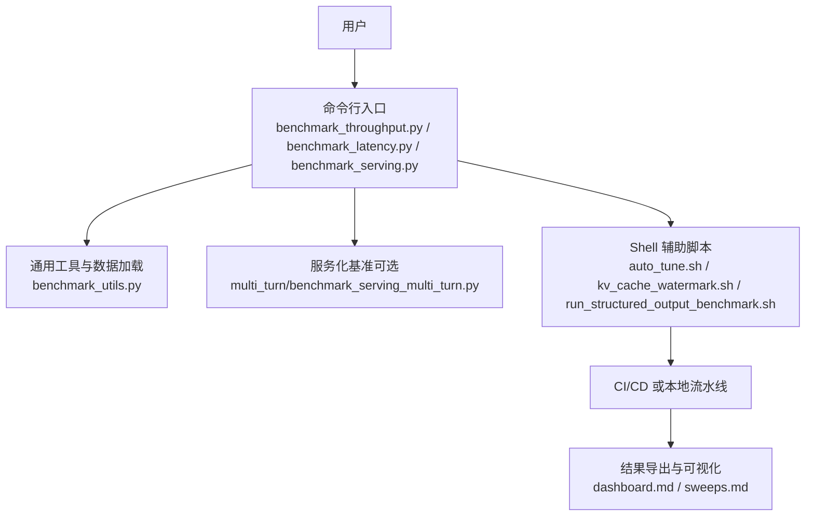
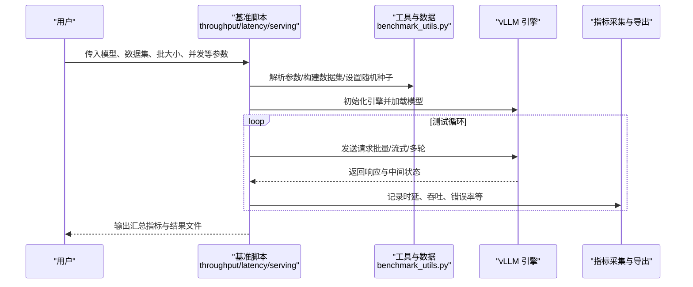
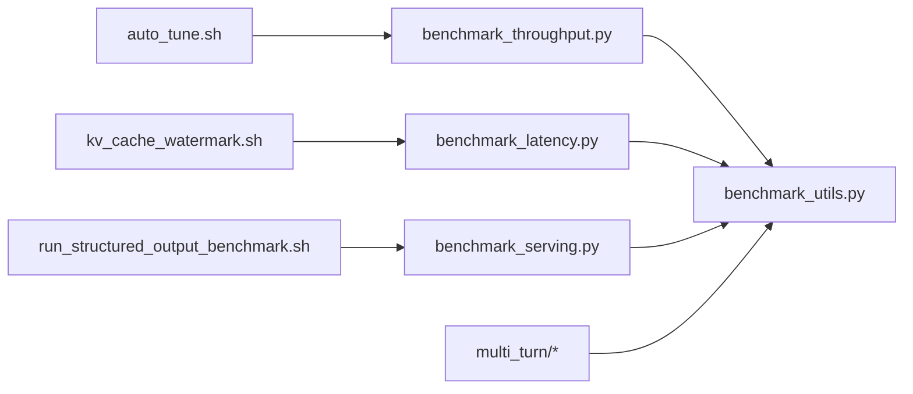

# 基准测试命令

<cite>
**本文引用的文件**   
- [benchmarks/README.md](file://benchmarks/README.md)
- [benchmarks/benchmark_throughput.py](file://benchmarks/benchmark_throughput.py)
- [benchmarks/benchmark_latency.py](file://benchmarks/benchmark_latency.py)
- [benchmarks/benchmark_serving.py](file://benchmarks/benchmark_serving.py)
- [benchmarks/benchmark_utils.py](file://benchmarks/benchmark_utils.py)
- [benchmarks/multi_turn/benchmark_serving_multi_turn.py](file://benchmarks/multi_turn/benchmark_serving_multi_turn.py)
- [benchmarks/multi_turn/bench_dataset.py](file://benchmarks/multi_turn/bench_dataset.py)
- [benchmarks/multi_turn/bench_utils.py](file://benchmarks/multi_turn/bench_utils.py)
- [benchmarks/auto_tune/auto_tune.sh](file://benchmarks/auto_tune/auto_tune.sh)
- [benchmarks/kv_cache_watermark.sh](file://benchmarks/kv_cache_watermark.sh)
- [benchmarks/run_structured_output_benchmark.sh](file://benchmarks/run_structured_output_benchmark.sh)
- [docs/benchmarking/README.md](file://docs/benchmarking/README.md)
- [docs/benchmarking/cli.md](file://docs/benchmarking/cli.md)
- [docs/benchmarking/dashboard.md](file://docs/benchmarking/dashboard.md)
- [docs/benchmarking/sweeps.md](file://docs/benchmarking/sweeps.md)
- [tests/benchmarks/test_throughput_cli.py](file://tests/benchmarks/test_throughput_cli.py)
- [tests/benchmarks/test_latency_cli.py](file://tests/benchmarks/test_latency_cli.py)
</cite>

## 目录
1. [简介](#简介)
2. [项目结构](#项目结构)
3. [核心组件](#核心组件)
4. [架构总览](#架构总览)
5. [详细组件分析](#详细组件分析)
6. [依赖关系分析](#依赖关系分析)
7. [性能考量](#性能考量)
8. [故障排查指南](#故障排查指南)
9. [结论](#结论)
10. [附录](#附录)

## 简介
本文件面向使用 vLLM 进行模型推理性能评估的工程师与研究者，系统化说明“基准测试命令”的使用方法与最佳实践。内容覆盖：
- 吞吐量、延迟、并发三类典型场景的配置与运行
- 测试数据集配置与结果指标收集
- 自定义测试脚本编写方法
- 硬件配置检查与性能对比分析
- 自动化流水线集成与报告生成
- 不同模型与量化方案的基准测试建议

## 项目结构
vLLM 的基准测试能力集中在 benchmarks 目录与 docs/benchmarking 文档中，CLI 入口由 Python 脚本提供，配套 Shell 脚本用于参数扫描、KV Cache 水位线检测与结构化输出评测。

图表来源
- [benchmarks/benchmark_throughput.py](file://benchmarks/benchmark_throughput.py)
- [benchmarks/benchmark_latency.py](file://benchmarks/benchmark_latency.py)
- [benchmarks/benchmark_serving.py](file://benchmarks/benchmark_serving.py)
- [benchmarks/benchmark_utils.py](file://benchmarks/benchmark_utils.py)
- [benchmarks/multi_turn/benchmark_serving_multi_turn.py](file://benchmarks/multi_turn/benchmark_serving_multi_turn.py)
- [benchmarks/auto_tune/auto_tune.sh](file://benchmarks/auto_tune/auto_tune.sh)
- [benchmarks/kv_cache_watermark.sh](file://benchmarks/kv_cache_watermark.sh)
- [benchmarks/run_structured_output_benchmark.sh](file://benchmarks/run_structured_output_benchmark.sh)
- [docs/benchmarking/dashboard.md](file://docs/benchmarking/dashboard.md)
- [docs/benchmarking/sweeps.md](file://docs/benchmarking/sweeps.md)

章节来源
- [benchmarks/README.md](file://benchmarks/README.md)
- [docs/benchmarking/README.md](file://docs/benchmarking/README.md)

## 核心组件
- 吞吐量基准：通过批量请求驱动引擎，统计吞吐（tokens/s、requests/s）、时延分布与资源占用。
- 延迟基准：以固定批次与采样策略测量端到端时延，关注 P50/P90/P99 等分位指标。
- 服务化基准：模拟在线服务请求模式，支持多轮对话与 OpenAI 风格接口调用。
- 工具与数据：统一的数据集构造、随机种子控制、指标采集与结果导出。
- 自动化脚本：参数扫描、KV Cache 水位线探测、结构化输出评测。

章节来源
- [benchmarks/benchmark_throughput.py](file://benchmarks/benchmark_throughput.py)
- [benchmarks/benchmark_latency.py](file://benchmarks/benchmark_latency.py)
- [benchmarks/benchmark_serving.py](file://benchmarks/benchmark_serving.py)
- [benchmarks/benchmark_utils.py](file://benchmarks/benchmark_utils.py)

## 架构总览
下图展示从 CLI 到引擎执行与指标采集的整体流程。

图表来源
- [benchmarks/benchmark_throughput.py](file://benchmarks/benchmark_throughput.py)
- [benchmarks/benchmark_latency.py](file://benchmarks/benchmark_latency.py)
- [benchmarks/benchmark_serving.py](file://benchmarks/benchmark_serving.py)
- [benchmarks/benchmark_utils.py](file://benchmarks/benchmark_utils.py)

## 详细组件分析

### 吞吐量基准（benchmark_throughput.py）
- 目标：在稳定负载下测量最大吞吐与稳态时延分布。
- 关键配置：
  - 模型与后端：模型路径/名称、注意力后端、并行策略、dtype、量化方案等
  - 数据集：文本长度分布、输入 token 数、采样策略、随机种子
  - 负载：并发度、请求间隔、预热轮次、运行时长
  - 指标：吞吐（tokens/s、req/s）、P50/P90/P99 时延、GPU/CPU/内存占用
- 使用方法要点：
  - 先预热引擎，再进入正式测试阶段
  - 根据显存容量调整 batch size 与上下文长度
  - 固定随机种子保证可复现实验
- 结果解读：
  - 吞吐峰值对应的批大小即为系统瓶颈点
  - 长尾时延受调度、I/O 与 GC 影响较大，需结合日志定位

章节来源
- [benchmarks/benchmark_throughput.py](file://benchmarks/benchmark_throughput.py)
- [benchmarks/benchmark_utils.py](file://benchmarks/benchmark_utils.py)
- [tests/benchmarks/test_throughput_cli.py](file://tests/benchmarks/test_throughput_cli.py)

### 延迟基准（benchmark_latency.py）
- 目标：在可控负载下测量端到端时延的分位指标。
- 关键配置：
  - 请求规模：固定 batch 或逐条请求
  - 采样参数：temperature/top_p/top_k、max_tokens
  - 统计窗口：预热后统计区间、重复次数
- 使用方法要点：
  - 确保无外部抖动（关闭无关进程、锁定 CPU/GPU 频率）
  - 多次运行取稳健估计（如中位数或 trimmed mean）
- 结果解读：
  - P90/P99 对用户体验更敏感，应重点优化
  - 时延突刺常与 KV Cache 分配、GC、编译图重编译相关

章节来源
- [benchmarks/benchmark_latency.py](file://benchmarks/benchmark_latency.py)
- [benchmarks/benchmark_utils.py](file://benchmarks/benchmark_utils.py)
- [tests/benchmarks/test_latency_cli.py](file://tests/benchmarks/test_latency_cli.py)

### 服务化基准（benchmark_serving.py 与 multi-turn）
- 目标：模拟真实线上服务流量，评估 QPS、时延与稳定性。
- 关键配置：
  - 接口：OpenAI 兼容或内部协议
  - 并发模型：固定并发、指数增长、泊松到达
  - 多轮对话：会话长度、消息数量、缓存策略
- 使用方法要点：
  - 使用独立服务实例与客户端分离，避免耦合
  - 监控服务端指标（GPU 利用率、显存、队列长度）
- 结果解读：
  - QPS 与时延权衡曲线指导容量规划
  - 多轮场景下 KV Cache 命中率是关键

章节来源
- [benchmarks/benchmark_serving.py](file://benchmarks/benchmark_serving.py)
- [benchmarks/multi_turn/benchmark_serving_multi_turn.py](file://benchmarks/multi_turn/benchmark_serving_multi_turn.py)
- [benchmarks/multi_turn/bench_dataset.py](file://benchmarks/multi_turn/bench_dataset.py)
- [benchmarks/multi_turn/bench_utils.py](file://benchmarks/multi_turn/bench_utils.py)

### 自动调参与 KV Cache 水位线
- auto_tune.sh：遍历批大小、序列长度、并行度等超参，输出最优配置与对应指标。
- kv_cache_watermark.sh：探测 KV Cache 阈值与溢出风险，辅助容量规划。
- run_structured_output_benchmark.sh：针对结构化输出的专项评测（JSON Schema、约束解码）。

章节来源
- [benchmarks/auto_tune/auto_tune.sh](file://benchmarks/auto_tune/auto_tune.sh)
- [benchmarks/kv_cache_watermark.sh](file://benchmarks/kv_cache_watermark.sh)
- [benchmarks/run_structured_output_benchmark.sh](file://benchmarks/run_structured_output_benchmark.sh)

### 数据与指标
- 数据集构造：支持随机文本、ShareGPT/OpenAI 格式、多模态扩展
- 指标采集：吞吐、时延分位、错误率、资源占用、KV Cache 命中率
- 结果导出：CSV/JSON 与可视化看板（见 dashboard 文档）

章节来源
- [benchmarks/benchmark_utils.py](file://benchmarks/benchmark_utils.py)
- [docs/benchmarking/dashboard.md](file://docs/benchmarking/dashboard.md)

## 依赖关系分析
- CLI 脚本依赖统一的工具模块与引擎接口
- Shell 脚本作为编排层，串联多个基准任务与参数扫描
- 测试结果可通过 CI/CD 或本地脚本聚合为报告

图表来源
- [benchmarks/benchmark_throughput.py](file://benchmarks/benchmark_throughput.py)
- [benchmarks/benchmark_latency.py](file://benchmarks/benchmark_latency.py)
- [benchmarks/benchmark_serving.py](file://benchmarks/benchmark_serving.py)
- [benchmarks/benchmark_utils.py](file://benchmarks/benchmark_utils.py)
- [benchmarks/multi_turn/benchmark_serving_multi_turn.py](file://benchmarks/multi_turn/benchmark_serving_multi_turn.py)
- [benchmarks/auto_tune/auto_tune.sh](file://benchmarks/auto_tune/auto_tune.sh)
- [benchmarks/kv_cache_watermark.sh](file://benchmarks/kv_cache_watermark.sh)
- [benchmarks/run_structured_output_benchmark.sh](file://benchmarks/run_structured_output_benchmark.sh)

## 性能考量
- 硬件与环境
  - GPU 型号与驱动版本、CUDA/ROCm 栈一致性
  - CPU 核数、NUMA 拓扑、内存带宽
  - 网络 I/O（分布式通信、远程权重加载）
- 模型与量化
  - 精度选择（FP16/BF16/FP8/INT8/INT4）对吞吐与时延的影响
  - 量化方案（AWQ/GPTQ/SmoothQuant/NVFP4 等）的校准与验证
  - MoE/LoRA/Speculative Decoding 等特性的开关组合
- 系统与内核
  - CUDA Graph、Torch Compile、FlashAttention 等加速开关
  - 分页注意力、KV Cache 管理、预取与缓存策略
- 负载建模
  - 请求长度分布、到达过程（均匀/泊松/突发）
  - 多轮对话比例与缓存命中预期

[本节为通用指导，不直接分析具体文件]

## 故障排查指南
- 常见症状
  - 吞吐低且时延抖动大：检查 GPU 利用率、GC、编译重跑、I/O 阻塞
  - OOM：降低 batch size、上下文长度或启用 KV Offload
  - 结果不可复现：确认随机种子、数据顺序、环境库版本
- 定位手段
  - 开启详细日志与性能事件追踪
  - 使用 KV Cache 水位线脚本识别溢出风险
  - 对比不同量化/后端配置的基线差异
- 参考用例
  - 吞吐量 CLI 测试用例与延迟 CLI 测试用例可作为回归与冒烟测试模板

章节来源
- [tests/benchmarks/test_throughput_cli.py](file://tests/benchmarks/test_throughput_cli.py)
- [tests/benchmarks/test_latency_cli.py](file://tests/benchmarks/test_latency_cli.py)
- [benchmarks/kv_cache_watermark.sh](file://benchmarks/kv_cache_watermark.sh)

## 结论
vLLM 的基准测试体系覆盖了从离线吞吐/延迟到在线服务化的完整链路。通过统一的工具与脚本，用户可以快速搭建可复现实验、自动化扫描与报告生成流程。建议在持续集成中固化关键基线，并结合量化与加速特性进行系统性对比，形成稳定的性能基线与优化闭环。

[本节为总结性内容，不直接分析具体文件]

## 附录

### 常用命令速查
- 吞吐量基准
  - 基本用法：指定模型、数据集、批大小、并发与运行时长
  - 结果导出：CSV/JSON，便于后续分析与看板展示
- 延迟基准
  - 固定批/逐条请求，统计分位时延
  - 多次运行取稳健估计
- 服务化基准
  - 模拟 OpenAI 接口或多轮对话
  - 监控 QPS、时延与资源占用
- 自动化脚本
  - 参数扫描：auto_tune.sh
  - KV Cache 水位线：kv_cache_watermark.sh
  - 结构化输出评测：run_structured_output_benchmark.sh

章节来源
- [benchmarks/benchmark_throughput.py](file://benchmarks/benchmark_throughput.py)
- [benchmarks/benchmark_latency.py](file://benchmarks/benchmark_latency.py)
- [benchmarks/benchmark_serving.py](file://benchmarks/benchmark_serving.py)
- [benchmarks/auto_tune/auto_tune.sh](file://benchmarks/auto_tune/auto_tune.sh)
- [benchmarks/kv_cache_watermark.sh](file://benchmarks/kv_cache_watermark.sh)
- [benchmarks/run_structured_output_benchmark.sh](file://benchmarks/run_structured_output_benchmark.sh)

### 数据集配置要点
- 文本长度分布：按实际业务分布抽样，避免极端值主导
- 采样策略：温度、top-p、top-k 与 max_tokens 的组合
- 多轮对话：会话长度、消息数量与缓存命中预期
- 随机种子：确保实验可复现

章节来源
- [benchmarks/benchmark_utils.py](file://benchmarks/benchmark_utils.py)
- [benchmarks/multi_turn/bench_dataset.py](file://benchmarks/multi_turn/bench_dataset.py)

### 指标与报告
- 核心指标：吞吐（tokens/s、req/s）、时延分位（P50/P90/P99）、错误率、资源占用、KV Cache 命中率
- 报告生成：结合 dashboard 与 sweeps 文档，将多组实验结果可视化与对比

章节来源
- [docs/benchmarking/dashboard.md](file://docs/benchmarking/dashboard.md)
- [docs/benchmarking/sweeps.md](file://docs/benchmarking/sweeps.md)

### 最佳实践清单
- 明确目标：吞吐优先还是时延优先
- 固定环境：锁版本、锁依赖、锁硬件
- 合理负载：贴近真实分布，避免过拟合
- 多次运行：消除抖动，稳健估计
- 分层对比：不同模型/量化/后端逐项对比
- 持续基线：纳入 CI，跟踪回归

[本节为通用指导，不直接分析具体文件]