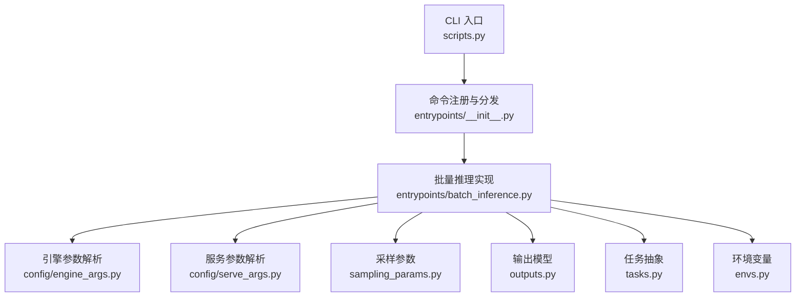
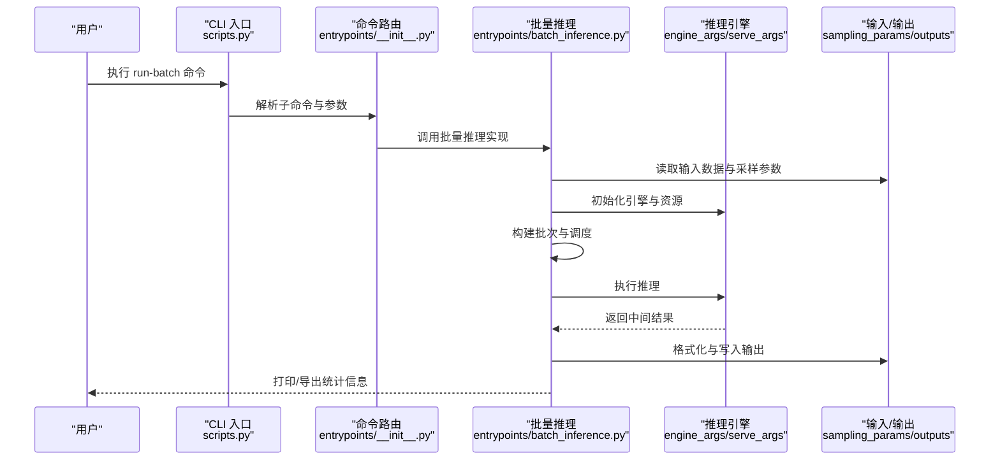
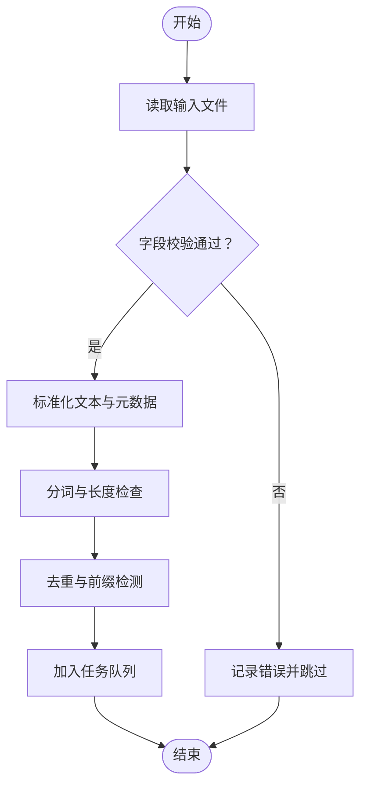
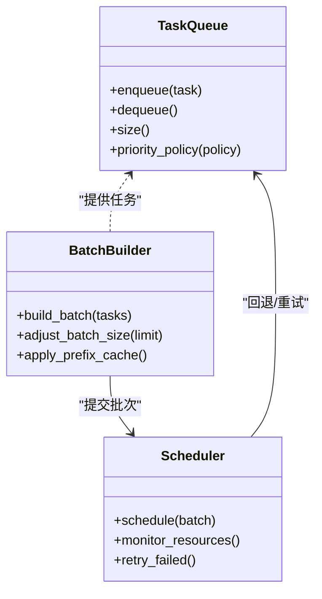
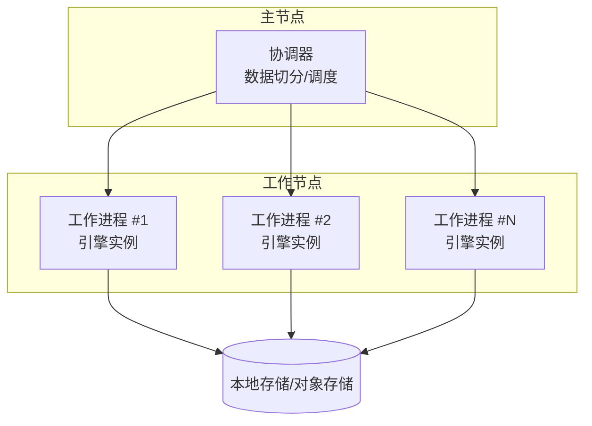
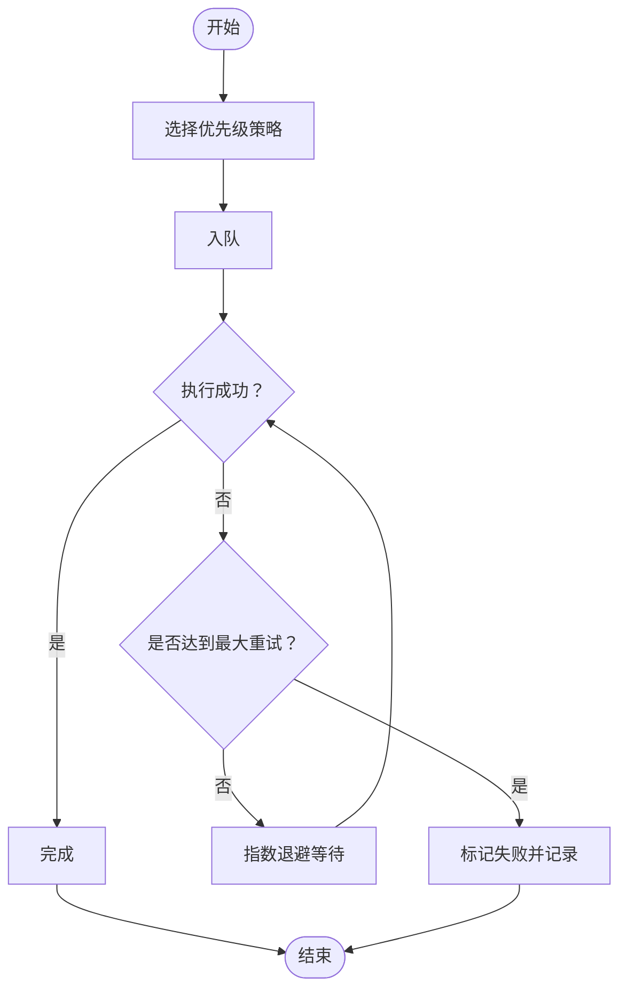
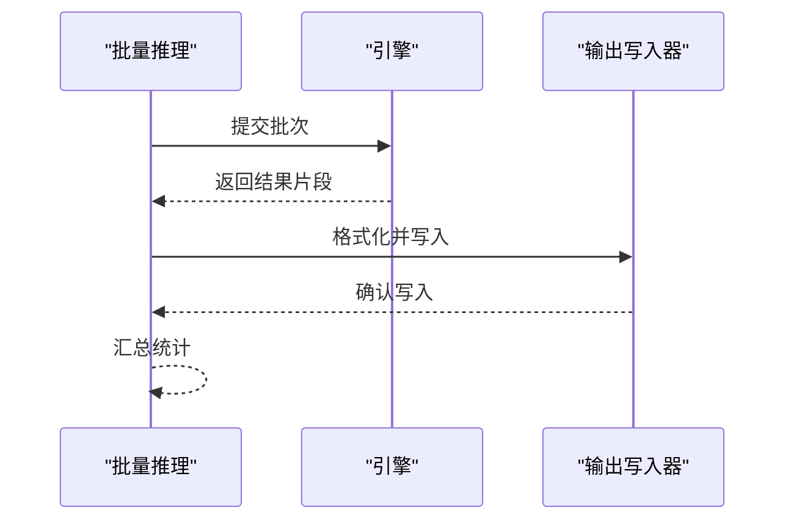
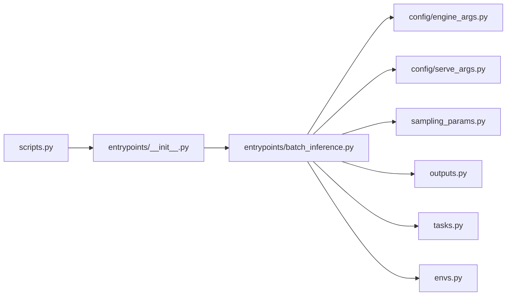

# 批处理命令

<cite>
**本文引用的文件**   
- [run-batch.md](file://docs/cli/run-batch.md)
- [scripts.py](file://vllm/scripts.py)
- [entrypoints.py](file://vllm/entrypoints/__init__.py)
- [batch_inference.py](file://vllm/entrypoints/batch_inference.py)
- [engine_args.py](file://vllm/config/engine_args.py)
- [serve_args.py](file://vllm/config/serve_args.py)
- [sampling_params.py](file://vllm/sampling_params.py)
- [outputs.py](file://vllm/outputs.py)
- [tasks.py](file://vllm/tasks.py)
- [envs.py](file://vllm/envs.py)
</cite>

## 目录
1. [简介](#简介)
2. [项目结构](#项目结构)
3. [核心组件](#核心组件)
4. [架构总览](#架构总览)
5. [详细组件分析](#详细组件分析)
6. [依赖关系分析](#依赖关系分析)
7. [性能考量](#性能考量)
8. [故障排查指南](#故障排查指南)
9. [结论](#结论)
10. [附录](#附录)

## 简介
本文件面向使用 vLLM 的 run-batch 命令进行离线批量推理的用户与工程师，系统说明以下主题：
- 任务配置方法（输入数据格式、采样参数、输出格式）
- 任务队列管理与资源调度（并发、批大小、内存与显存管理）
- 批处理策略（批大小自适应、前缀缓存、KV 缓存）
- 分布式批处理（多进程/多节点并行）
- 任务优先级与失败重试机制
- 与其他批处理系统的集成方式
- 大规模数据处理最佳实践与性能优化建议

## 项目结构
run-batch 命令由 CLI 入口、参数解析、引擎初始化与执行器共同构成。关键路径如下：
- CLI 文档与使用说明：docs/cli/run-batch.md
- CLI 注册与分发：vllm/scripts.py、vllm/entrypoints/__init__.py
- 批量推理实现：vllm/entrypoints/batch_inference.py
- 引擎与运行参数：vllm/config/engine_args.py、vllm/config/serve_args.py
- 采样与输出：vllm/sampling_params.py、vllm/outputs.py
- 任务抽象与环境变量：vllm/tasks.py、vllm/envs.py

**图示来源** 
- [scripts.py](file://vllm/scripts.py)
- [entrypoints.py](file://vllm/entrypoints/__init__.py)
- [batch_inference.py](file://vllm/entrypoints/batch_inference.py)
- [engine_args.py](file://vllm/config/engine_args.py)
- [serve_args.py](file://vllm/config/serve_args.py)
- [sampling_params.py](file://vllm/sampling_params.py)
- [outputs.py](file://vllm/outputs.py)
- [tasks.py](file://vllm/tasks.py)
- [envs.py](file://vllm/envs.py)

**章节来源**
- [run-batch.md](file://docs/cli/run-batch.md)
- [scripts.py](file://vllm/scripts.py)
- [entrypoints.py](file://vllm/entrypoints/__init__.py)
- [batch_inference.py](file://vllm/entrypoints/batch_inference.py)

## 核心组件
- 命令行接口与参数解析
  - 通过 scripts.py 注册 run-batch 子命令，entrypoints/__init__.py 将命令路由到具体实现。
  - 参数来源于 engine_args.py 与 serve_args.py，覆盖模型加载、并行度、内存与设备管理等。
- 批量推理执行器
  - batch_inference.py 负责读取输入数据集、构造请求、组织批次、调用引擎并收集结果。
- 采样与输出
  - sampling_params.py 定义采样相关参数（如 top-k/top-p、温度、重复惩罚等）。
  - outputs.py 定义输出数据结构与序列化格式。
- 任务抽象与环境控制
  - tasks.py 提供任务抽象与生命周期钩子。
  - envs.py 暴露影响行为的环境变量（如日志级别、性能开关、超时等）。

**章节来源**
- [scripts.py](file://vllm/scripts.py)
- [entrypoints.py](file://vllm/entrypoints/__init__.py)
- [batch_inference.py](file://vllm/entrypoints/batch_inference.py)
- [engine_args.py](file://vllm/config/engine_args.py)
- [serve_args.py](file://vllm/config/serve_args.py)
- [sampling_params.py](file://vllm/sampling_params.py)
- [outputs.py](file://vllm/outputs.py)
- [tasks.py](file://vllm/tasks.py)
- [envs.py](file://vllm/envs.py)

## 架构总览
下图展示 run-batch 从 CLI 到引擎执行的端到端流程，包括输入解析、批构建、引擎调用与结果落盘。

**图示来源** 
- [scripts.py](file://vllm/scripts.py)
- [entrypoints.py](file://vllm/entrypoints/__init__.py)
- [batch_inference.py](file://vllm/entrypoints/batch_inference.py)
- [engine_args.py](file://vllm/config/engine_args.py)
- [serve_args.py](file://vllm/config/serve_args.py)
- [sampling_params.py](file://vllm/sampling_params.py)
- [outputs.py](file://vllm/outputs.py)

## 详细组件分析

### 输入数据格式与预处理
- 输入数据通常以结构化文件形式提供（例如 JSON/JSONL），每条记录包含文本或指令字段，以及可选的元数据（如 ID、权重、优先级）。
- 预处理阶段会校验字段完整性、类型与长度限制，并将原始文本转换为模型可接受的 token 序列。
- 支持批量去重与公共前缀识别，以便启用前缀缓存减少重复计算。

**图示来源** 
- [batch_inference.py](file://vllm/entrypoints/batch_inference.py)
- [sampling_params.py](file://vllm/sampling_params.py)

**章节来源**
- [batch_inference.py](file://vllm/entrypoints/batch_inference.py)
- [sampling_params.py](file://vllm/sampling_params.py)

### 批处理策略与队列管理
- 批大小与动态调整：根据可用显存与延迟目标动态调整批大小，避免 OOM 并提升吞吐。
- 任务队列：采用先进先出为主、可插拔优先级的队列；支持按优先级或权重排序。
- 资源调度：基于引擎内部调度器分配 GPU/CPU 资源，结合 KV 缓存与分页注意力降低内存碎片。
- 并发与并行：支持线程级并发与进程级并行，配合分布式后端实现跨节点扩展。

**图示来源** 
- [batch_inference.py](file://vllm/entrypoints/batch_inference.py)
- [engine_args.py](file://vllm/config/engine_args.py)

**章节来源**
- [batch_inference.py](file://vllm/entrypoints/batch_inference.py)
- [engine_args.py](file://vllm/config/engine_args.py)

### 分布式批处理
- 多进程/多节点：通过 torchrun 或 Ray 启动多个工作进程，每个进程持有独立引擎实例。
- 数据切分：按任务 ID 哈希或范围切分数据集，确保负载均衡。
- 通信与同步：使用 NCCL/RDMA 等后端进行梯度/权重同步（若涉及训练或 LoRA 合并），推理阶段主要共享模型权重。
- 容错与弹性：支持节点故障检测与任务迁移，保证整体作业完成。

**图示来源** 
- [batch_inference.py](file://vllm/entrypoints/batch_inference.py)
- [engine_args.py](file://vllm/config/engine_args.py)

**章节来源**
- [batch_inference.py](file://vllm/entrypoints/batch_inference.py)
- [engine_args.py](file://vllm/config/engine_args.py)

### 任务优先级设置与失败重试
- 优先级策略：支持 FIFO、加权随机、截止时间优先等策略，可通过配置文件或输入元数据指定。
- 失败重试：对网络抖动、临时资源不足导致的失败进行指数退避重试，支持最大重试次数与超时控制。
- 幂等性：任务设计为幂等，便于安全重试与断点续跑。

**图示来源** 
- [batch_inference.py](file://vllm/entrypoints/batch_inference.py)
- [tasks.py](file://vllm/tasks.py)

**章节来源**
- [batch_inference.py](file://vllm/entrypoints/batch_inference.py)
- [tasks.py](file://vllm/tasks.py)

### 输出结果处理
- 输出格式：支持 JSON/JSONL/CSV 等格式，包含生成文本、token 数、耗时、logprobs（可选）等字段。
- 流式与批式：默认批式写入，可按需开启流式输出以减少内存占用。
- 后处理：可选解码优化、去重、过滤与聚合操作。

**图示来源** 
- [batch_inference.py](file://vllm/entrypoints/batch_inference.py)
- [outputs.py](file://vllm/outputs.py)

**章节来源**
- [batch_inference.py](file://vllm/entrypoints/batch_inference.py)
- [outputs.py](file://vllm/outputs.py)

## 依赖关系分析
- CLI 层依赖 entrypoints 路由，再调用 batch_inference 实现。
- batch_inference 依赖 engine_args/serve_args 进行引擎初始化，依赖 sampling_params/outputs 进行采样与输出。
- tasks 提供任务抽象，envs 提供运行时环境变量控制。

**图示来源** 
- [scripts.py](file://vllm/scripts.py)
- [entrypoints.py](file://vllm/entrypoints/__init__.py)
- [batch_inference.py](file://vllm/entrypoints/batch_inference.py)
- [engine_args.py](file://vllm/config/engine_args.py)
- [serve_args.py](file://vllm/config/serve_args.py)
- [sampling_params.py](file://vllm/sampling_params.py)
- [outputs.py](file://vllm/outputs.py)
- [tasks.py](file://vllm/tasks.py)
- [envs.py](file://vllm/envs.py)

**章节来源**
- [scripts.py](file://vllm/scripts.py)
- [entrypoints.py](file://vllm/entrypoints/__init__.py)
- [batch_inference.py](file://vllm/entrypoints/batch_inference.py)
- [engine_args.py](file://vllm/config/engine_args.py)
- [serve_args.py](file://vllm/config/serve_args.py)
- [sampling_params.py](file://vllm/sampling_params.py)
- [outputs.py](file://vllm/outputs.py)
- [tasks.py](file://vllm/tasks.py)
- [envs.py](file://vllm/envs.py)

## 性能考量
- 批大小调优：在显存允许范围内增大批大小以提升吞吐，同时监控延迟与 OOM 风险。
- 前缀缓存与 KV 缓存：对重复前缀启用缓存，显著降低重复计算与内存占用。
- 量化与编译：启用模型量化与 Torch/Triton 编译选项，加速推理。
- I/O 优化：使用高效序列化与并行读写，减少磁盘瓶颈。
- 资源隔离：合理设置 CPU/GPU 利用率上限，避免争用。

[本节为通用指导，不直接分析具体文件]

## 故障排查指南
- 常见问题
  - OOM：减小批大小、启用 KV 缓存压缩、关闭不必要的 logprobs。
  - 超时：增加超时阈值、优化输入长度、启用异步 I/O。
  - 数据错误：校验输入字段、统一编码、去除非法字符。
  - 分布式不一致：检查网络连通性与 NCCL 后端、确保权重一致。
- 诊断工具
  - 日志级别：通过环境变量提高日志详细程度。
  - 指标采集：启用性能指标与追踪，定位热点。
  - 断点续跑：利用任务 ID 与状态文件恢复中断作业。

**章节来源**
- [envs.py](file://vllm/envs.py)
- [batch_inference.py](file://vllm/entrypoints/batch_inference.py)

## 结论
run-batch 命令提供了完整的离线批量推理能力，涵盖输入预处理、批构建、资源调度、分布式执行与结果输出。通过合理的批大小、缓存策略与并行配置，可在大规模场景下获得高吞吐与低延迟。结合优先级与重试机制，能够保障作业的稳定性与可恢复性。

[本节为总结性内容，不直接分析具体文件]

## 附录
- 参考文档
  - CLI 使用说明：docs/cli/run-batch.md
  - 引擎与服务参数：vllm/config/engine_args.py、vllm/config/serve_args.py
  - 采样与输出：vllm/sampling_params.py、vllm/outputs.py
  - 任务与环境：vllm/tasks.py、vllm/envs.py

[本节为参考列表，不直接分析具体文件]