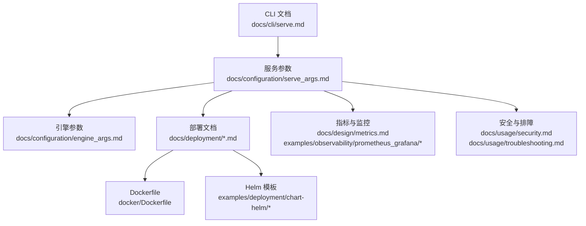
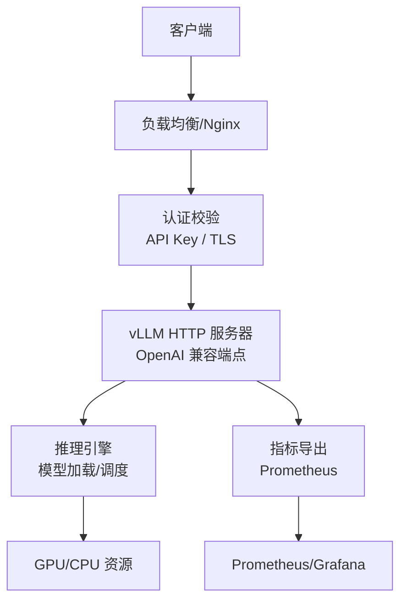
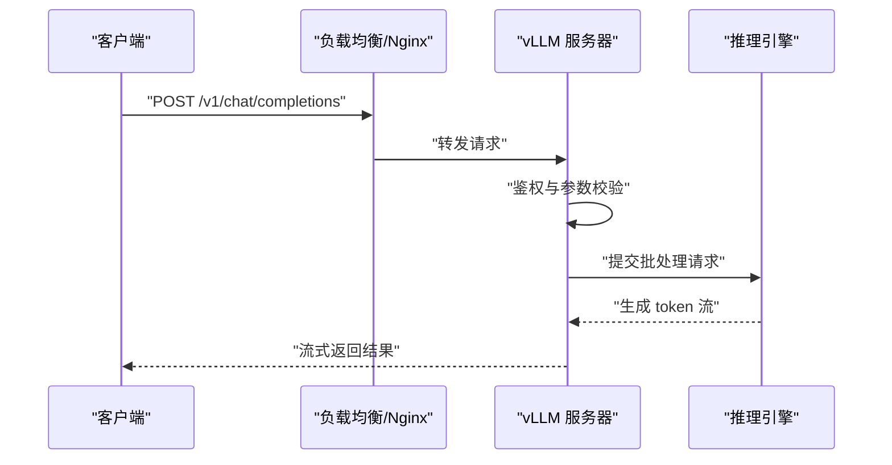
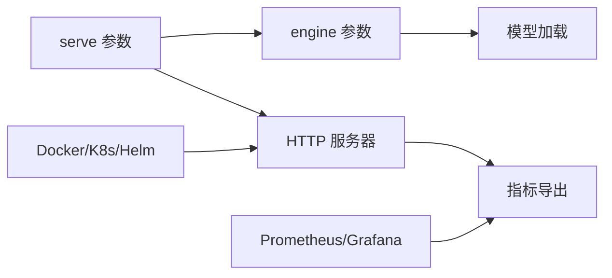

# 服务部署命令

<cite>
**本文引用的文件**   
- [serve.md](file://docs/cli/serve.md)
- [serve_args.md](file://docs/configuration/serve_args.md)
- [engine_args.md](file://docs/configuration/engine_args.md)
- [docker.md](file://docs/deployment/docker.md)
- [k8s.md](file://docs/deployment/k8s.md)
- [nginx.md](file://docs/deployment/nginx.md)
- [metrics.md](file://docs/design/metrics.md)
- [usage_stats.md](file://docs/usage/usage_stats.md)
- [security.md](file://docs/usage/security.md)
- [troubleshooting.md](file://docs/usage/troubleshooting.md)
- [Dockerfile](file://docker/Dockerfile)
- [vllm-nonroot-entrypoint.sh](file://docker/entrypoints/vllm-nonroot-entrypoint.sh)
- [test_vllm_nonroot_entrypoint.sh](file://docker/entrypoints/test_vllm_nonroot_entrypoint.sh)
- [chart-helm/Chart.yaml](file://examples/deployment/chart-helm/Chart.yaml)
- [chart-helm/values.yaml](file://examples/deployment/chart-helm/values.yaml)
- [chart-helm/templates/deployment.yaml](file://examples/deployment/chart-helm/templates/deployment.yaml)
- [chart-helm/templates/service.yaml](file://examples/deployment/chart-helm/templates/service.yaml)
- [chart-helm/templates/configmap.yaml](file://examples/deployment/chart-helm/templates/configmap.yaml)
- [prometheus_grafana/prometheus.yml](file://examples/observability/prometheus_grafana/prometheus.yml)
- [prometheus_grafana/grafana-dashboards.json](file://examples/observability/prometheus_grafana/grafana-dashboards.json)
</cite>

## 目录
1. [简介](#简介)
2. [项目结构](#项目结构)
3. [核心组件](#核心组件)
4. [架构总览](#架构总览)
5. [详细组件分析](#详细组件分析)
6. [依赖关系分析](#依赖关系分析)
7. [性能考虑](#性能考虑)
8. [故障排查指南](#故障排查指南)
9. [结论](#结论)
10. [附录](#附录)

## 简介
本文件面向使用 vLLM 的 OpenAI 兼容 API 服务器的运维与开发者，系统化说明 serve 命令的启动参数、模型加载选项、网络与安全配置，以及生产环境部署、性能调优与监控集成。内容覆盖 HTTP 服务器配置、端口设置、SSL/TLS 支持、负载均衡方案，并提供 Docker 与 Kubernetes 的部署示例与模板。

## 项目结构
围绕 serve 命令的相关文档与配置集中在以下位置：
- CLI 与服务参数文档：docs/cli/serve.md、docs/configuration/serve_args.md
- 引擎参数（影响模型加载与推理）：docs/configuration/engine_args.md
- 部署与编排：docs/deployment/docker.md、docs/deployment/k8s.md、docs/deployment/nginx.md
- 可观测性与指标：docs/design/metrics.md、examples/observability/prometheus_grafana/*
- 安全与排障：docs/usage/security.md、docs/usage/troubleshooting.md
- 容器镜像与入口脚本：docker/Dockerfile、docker/entrypoints/*
- Helm 模板：examples/deployment/chart-helm/*

**图示来源** 
- [serve.md](file://docs/cli/serve.md)
- [serve_args.md](file://docs/configuration/serve_args.md)
- [engine_args.md](file://docs/configuration/engine_args.md)
- [docker.md](file://docs/deployment/docker.md)
- [k8s.md](file://docs/deployment/k8s.md)
- [nginx.md](file://docs/deployment/nginx.md)
- [metrics.md](file://docs/design/metrics.md)
- [security.md](file://docs/usage/security.md)
- [troubleshooting.md](file://docs/usage/troubleshooting.md)
- [Dockerfile](file://docker/Dockerfile)
- [chart-helm/Chart.yaml](file://examples/deployment/chart-helm/Chart.yaml)
- [chart-helm/values.yaml](file://examples/deployment/chart-helm/values.yaml)
- [prometheus_grafana/prometheus.yml](file://examples/observability/prometheus_grafana/prometheus.yml)

**章节来源**
- [serve.md](file://docs/cli/serve.md)
- [serve_args.md](file://docs/configuration/serve_args.md)
- [engine_args.md](file://docs/configuration/engine_args.md)
- [docker.md](file://docs/deployment/docker.md)
- [k8s.md](file://docs/deployment/k8s.md)
- [nginx.md](file://docs/deployment/nginx.md)
- [metrics.md](file://docs/design/metrics.md)
- [security.md](file://docs/usage/security.md)
- [troubleshooting.md](file://docs/usage/troubleshooting.md)
- [Dockerfile](file://docker/Dockerfile)
- [chart-helm/Chart.yaml](file://examples/deployment/chart-helm/Chart.yaml)
- [chart-helm/values.yaml](file://examples/deployment/chart-helm/values.yaml)
- [prometheus_grafana/prometheus.yml](file://examples/observability/prometheus_grafana/prometheus.yml)

## 核心组件
- 命令行入口与参数解析：serve 命令及其参数定义
- 模型加载与引擎初始化：基于引擎参数的模型权重、并行度、量化等配置
- HTTP 服务器：OpenAI 兼容接口、请求路由、流式响应
- 认证与安全：API Key、TLS、反向代理鉴权
- 可观测性：Prometheus 指标暴露、Grafana 看板、日志采集
- 部署编排：Docker 镜像、Kubernetes Deployment/Service/ConfigMap、Helm Chart

**章节来源**
- [serve_args.md](file://docs/configuration/serve_args.md)
- [engine_args.md](file://docs/configuration/engine_args.md)
- [metrics.md](file://docs/design/metrics.md)
- [security.md](file://docs/usage/security.md)
- [docker.md](file://docs/deployment/docker.md)
- [k8s.md](file://docs/deployment/k8s.md)

## 架构总览
下图展示了从客户端到 vLLM 服务的关键交互路径，包括反向代理、认证、HTTP 路由、模型推理与指标导出。

**图示来源** 
- [serve_args.md](file://docs/configuration/serve_args.md)
- [metrics.md](file://docs/design/metrics.md)
- [nginx.md](file://docs/deployment/nginx.md)
- [security.md](file://docs/usage/security.md)

## 详细组件分析

### 启动参数与模型加载
- 启动参数：端口、主机绑定、工作进程数、并发限制、超时、日志级别、调试开关等
- 模型加载：模型名称或本地路径、分片并行、张量并行、流水线并行、上下文长度、KV Cache 管理、量化格式、LoRA 适配器等
- 运行时优化：CUDA Graph、编译优化、批处理策略、内存池大小、预取策略

建议在生产环境中明确指定模型路径与并行策略，避免默认值带来的不确定性；结合资源配额与亲和性规则确保 GPU 分配稳定。

**章节来源**
- [serve_args.md](file://docs/configuration/serve_args.md)
- [engine_args.md](file://docs/configuration/engine_args.md)

### HTTP 服务器与网络配置
- 监听地址与端口：支持自定义 host/port，便于多实例部署与端口隔离
- SSL/TLS：证书与私钥路径、协议版本、加密套件选择
- 反向代理：Nginx 配置示例，含健康检查、超时、缓冲、限流与缓存策略
- 负载均衡：多副本 Service、会话保持、连接复用、后端健康探测

生产环境推荐启用 TLS 终止于反向代理层，并在代理层实施速率限制与访问控制。

**章节来源**
- [serve_args.md](file://docs/configuration/serve_args.md)
- [nginx.md](file://docs/deployment/nginx.md)

### 认证机制与安全配置
- API Key：服务端校验、请求头注入、白名单/黑名单
- TLS：端到端加密、证书轮换、最小化协议版本
- 访问控制：IP 白名单、CORS、请求体大小限制、审计日志
- 密钥管理：环境变量注入、Secret 管理、最小权限原则

**章节来源**
- [security.md](file://docs/usage/security.md)
- [serve_args.md](file://docs/configuration/serve_args.md)

### 可观测性与监控集成
- 指标暴露：Prometheus 端点、关键指标（吞吐、延迟、队列长度、错误率）
- 看板与告警：Grafana 模板、阈值告警、容量规划
- 日志与追踪：结构化日志、采样策略、分布式追踪（可选）

**章节来源**
- [metrics.md](file://docs/design/metrics.md)
- [prometheus_grafana/prometheus.yml](file://examples/observability/prometheus_grafana/prometheus.yml)
- [prometheus_grafana/grafana-dashboards.json](file://examples/observability/prometheus_grafana/grafana-dashboards.json)

### Docker 部署
- 基础镜像：官方 Dockerfile 构建，支持多架构
- 入口脚本：非 root 用户运行、健康检查、优雅退出
- 环境变量：通过环境变量注入配置，避免硬编码
- 卷挂载：模型权重持久化、日志输出、临时目录隔离

**章节来源**
- [docker.md](file://docs/deployment/docker.md)
- [Dockerfile](file://docker/Dockerfile)
- [vllm-nonroot-entrypoint.sh](file://docker/entrypoints/vllm-nonroot-entrypoint.sh)
- [test_vllm_nonroot_entrypoint.sh](file://docker/entrypoints/test_vllm_nonroot_entrypoint.sh)

### Kubernetes 部署与 Helm 模板
- Deployment：副本数、资源限制、探针、滚动更新
- Service：ClusterIP/NodePort/LoadBalancer、端口映射
- ConfigMap/Secret：配置与密钥分离
- Helm Chart：values.yaml 参数化、命名空间隔离、依赖管理

**章节来源**
- [k8s.md](file://docs/deployment/k8s.md)
- [chart-helm/Chart.yaml](file://examples/deployment/chart-helm/Chart.yaml)
- [chart-helm/values.yaml](file://examples/deployment/chart-helm/values.yaml)
- [chart-helm/templates/deployment.yaml](file://examples/deployment/chart-helm/templates/deployment.yaml)
- [chart-helm/templates/service.yaml](file://examples/deployment/chart-helm/templates/service.yaml)
- [chart-helm/templates/configmap.yaml](file://examples/deployment/chart-helm/templates/configmap.yaml)

### API 端点与调用流程
- OpenAI 兼容端点：聊天补全、文本生成、嵌入、批量任务
- 请求生命周期：鉴权→路由→批处理→推理→解码→返回
- 流式响应：增量输出、中断处理、错误回传

**图示来源** 
- [serve_args.md](file://docs/configuration/serve_args.md)
- [metrics.md](file://docs/design/metrics.md)

## 依赖关系分析
- 参数依赖：serve 参数与 engine 参数共同决定模型加载与运行时行为
- 部署依赖：Docker/K8s/Helm 提供一致的部署抽象，便于迁移与扩缩容
- 监控依赖：Prometheus/Grafana 依赖指标端点与抓取配置

**图示来源** 
- [serve_args.md](file://docs/configuration/serve_args.md)
- [engine_args.md](file://docs/configuration/engine_args.md)
- [metrics.md](file://docs/design/metrics.md)
- [docker.md](file://docs/deployment/docker.md)
- [k8s.md](file://docs/deployment/k8s.md)

**章节来源**
- [serve_args.md](file://docs/configuration/serve_args.md)
- [engine_args.md](file://docs/configuration/engine_args.md)
- [metrics.md](file://docs/design/metrics.md)
- [docker.md](file://docs/deployment/docker.md)
- [k8s.md](file://docs/deployment/k8s.md)

## 性能考虑
- 批处理与并发：合理设置最大批次、并发请求数、队列长度
- 内存与显存：调整 KV Cache、分页注意力、内存池大小
- 编译与图优化：启用 CUDA Graph、Torch Compile、内核融合
- I/O 与网络：减少序列化开销、启用连接复用、压缩传输
- 资源隔离：CPU/GPU 亲和性、NUMA 感知、独占设备

**章节来源**
- [engine_args.md](file://docs/configuration/engine_args.md)
- [serve_args.md](file://docs/configuration/serve_args.md)
- [metrics.md](file://docs/design/metrics.md)

## 故障排查指南
- 启动失败：检查端口占用、证书路径、模型权重可读性
- 推理异常：查看日志级别、错误码、堆栈信息、资源不足告警
- 性能退化：分析指标趋势、瓶颈定位（CPU/GPU/IO）、GC 与锁竞争
- 网络问题：代理配置、超时设置、TLS 握手失败、DNS 解析

**章节来源**
- [troubleshooting.md](file://docs/usage/troubleshooting.md)
- [security.md](file://docs/usage/security.md)
- [metrics.md](file://docs/design/metrics.md)

## 结论
serve 命令是 vLLM OpenAI 兼容 API 服务的核心入口，通过合理的参数配置、安全的网络与认证、完善的监控与部署编排，可在生产环境获得高可用、高性能与大模型推理能力。建议遵循最小权限、分层防御、可观测优先的原则进行设计与迭代。

## 附录
- 使用统计与用量计量：[usage_stats.md](file://docs/usage/usage_stats.md)
- Prometheus 抓取配置示例：[prometheus.yml](file://examples/observability/prometheus_grafana/prometheus.yml)
- Grafana 看板模板：[grafana-dashboards.json](file://examples/observability/prometheus_grafana/grafana-dashboards.json)
- Helm Chart 元数据与值模板：[Chart.yaml](file://examples/deployment/chart-helm/Chart.yaml)、[values.yaml](file://examples/deployment/chart-helm/values.yaml)