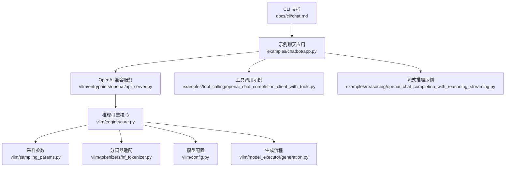
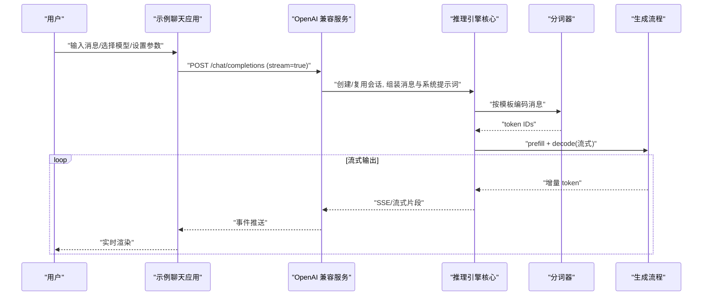
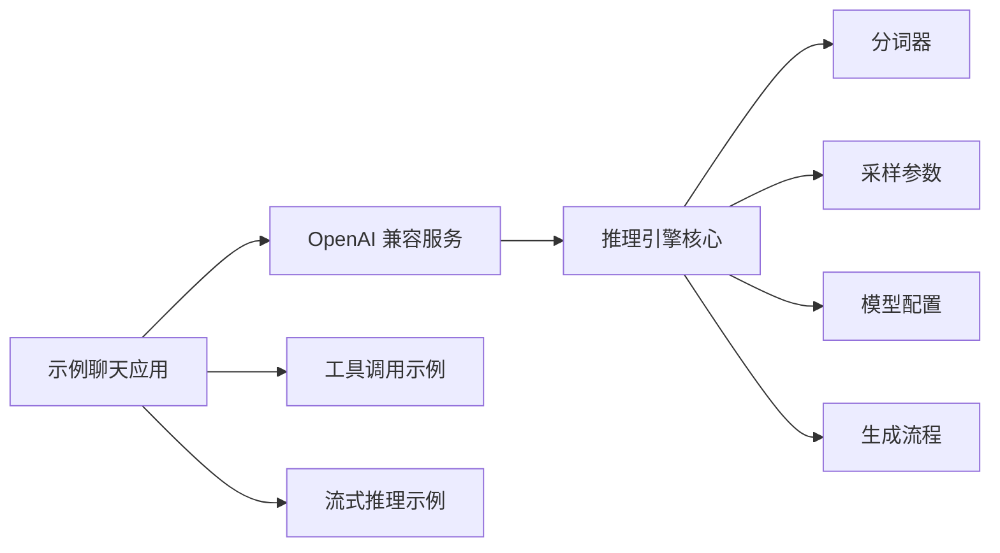

# 聊天交互命令

<cite>
**本文引用的文件**   
- [docs/cli/chat.md](file://docs/cli/chat.md)
- [examples/chatbot/app.py](file://examples/chatbot/app.py)
- [examples/chatbot/requirements.txt](file://examples/chatbot/requirements.txt)
- [vllm/entrypoints/openai/api_server.py](file://vllm/entrypoints/openai/api_server.py)
- [vllm/engine/core.py](file://vllm/engine/core.py)
- [vllm/sampling_params.py](file://vllm/sampling_params.py)
- [vllm/tokenizers/hf_tokenizer.py](file://vllm/tokenizers/hf_tokenizer.py)
- [vllm/config.py](file://vllm/config.py)
- [vllm/model_executor/generation.py](file://vllm/model_executor/generation.py)
- [examples/tool_calling/openai_chat_completion_client_with_tools.py](file://examples/tool_calling/openai_chat_completion_client_with_tools.py)
- [examples/reasoning/openai_chat_completion_with_reasoning_streaming.py](file://examples/reasoning/openai_chat_completion_with_reasoning_streaming.py)
</cite>

## 目录
1. [简介](#简介)
2. [项目结构](#项目结构)
3. [核心组件](#核心组件)
4. [架构总览](#架构总览)
5. [详细组件分析](#详细组件分析)
6. [依赖关系分析](#依赖关系分析)
7. [性能考虑](#性能考虑)
8. [故障排查指南](#故障排查指南)
9. [结论](#结论)
10. [附录](#附录)

## 简介
本文件面向使用 vLLM 进行“聊天”交互的用户与开发者，系统化说明交互式聊天界面的使用方法、对话管理与上下文保持、消息格式与系统提示词配置、用户输入处理、流式输出、多轮对话与历史记录管理、聊天模板定制、工具调用集成与实时响应配置，以及与不同模型的兼容性设置和参数调整。文档同时给出架构图、序列图与流程图，帮助快速定位关键实现与扩展点。

## 项目结构
围绕“聊天”能力，仓库中与 CLI 文档、示例应用、OpenAI 兼容服务、推理引擎、采样参数、分词器、模型配置与生成流程等密切相关。下图概览了从命令行到推理引擎的关键路径。

图表来源 
- [docs/cli/chat.md](file://docs/cli/chat.md)
- [examples/chatbot/app.py](file://examples/chatbot/app.py)
- [vllm/entrypoints/openai/api_server.py](file://vllm/entrypoints/openai/api_server.py)
- [vllm/engine/core.py](file://vllm/engine/core.py)
- [vllm/sampling_params.py](file://vllm/sampling_params.py)
- [vllm/tokenizers/hf_tokenizer.py](file://vllm/tokenizers/hf_tokenizer.py)
- [vllm/config.py](file://vllm/config.py)
- [vllm/model_executor/generation.py](file://vllm/model_executor/generation.py)

章节来源
- [docs/cli/chat.md](file://docs/cli/chat.md)
- [examples/chatbot/app.py](file://examples/chatbot/app.py)

## 核心组件
- 聊天 CLI 文档：提供命令行用法、参数说明与常见场景指引。
- 示例聊天应用：基于 OpenAI 兼容接口构建的交互式聊天界面，支持流式输出与多轮对话。
- OpenAI 兼容服务：将聊天请求转换为内部引擎调用，统一消息格式、系统提示词与采样参数。
- 推理引擎核心：负责会话状态、KV Cache、批调度与流式生成。
- 采样参数：控制温度、Top-K、Top-P、重复惩罚、停止条件等。
- 分词器：按模型模板对消息进行编码，支持 ChatML 等格式。
- 模型配置：加载模型权重、注意力后端、并行策略等。
- 生成流程：预填充与解码阶段、流式 token 输出、工具调用与思维链（reasoning）输出。

章节来源
- [docs/cli/chat.md](file://docs/cli/chat.md)
- [examples/chatbot/app.py](file://examples/chatbot/app.py)
- [vllm/entrypoints/openai/api_server.py](file://vllm/entrypoints/openai/api_server.py)
- [vllm/engine/core.py](file://vllm/engine/core.py)
- [vllm/sampling_params.py](file://vllm/sampling_params.py)
- [vllm/tokenizers/hf_tokenizer.py](file://vllm/tokenizers/hf_tokenizer.py)
- [vllm/config.py](file://vllm/config.py)
- [vllm/model_executor/generation.py](file://vllm/model_executor/generation.py)

## 架构总览
聊天交互的整体数据流如下：用户在 CLI 或示例应用中输入消息，OpenAI 兼容服务解析并标准化为内部消息格式，引擎维护会话上下文（历史消息、系统提示词、工具定义），通过分词器编码后进入模型执行器，采用流式方式逐 token 返回结果。

图表来源 
- [examples/chatbot/app.py](file://examples/chatbot/app.py)
- [vllm/entrypoints/openai/api_server.py](file://vllm/entrypoints/openai/api_server.py)
- [vllm/engine/core.py](file://vllm/engine/core.py)
- [vllm/tokenizers/hf_tokenizer.py](file://vllm/tokenizers/hf_tokenizer.py)
- [vllm/model_executor/generation.py](file://vllm/model_executor/generation.py)

## 详细组件分析

### 聊天 CLI 文档与用法
- 功能要点：命令行启动聊天、选择模型、设置采样参数、启用流式输出、切换对话模式、查看帮助与示例。
- 典型参数：模型名称、最大生成长度、温度、Top-P、Top-K、随机种子、是否流式、系统提示词、工具定义等。
- 使用建议：首次运行先以非流式验证模型与参数；稳定后再开启流式提升交互体验。

章节来源
- [docs/cli/chat.md](file://docs/cli/chat.md)

### 示例聊天应用（交互式界面）
- 功能要点：基于 OpenAI 兼容接口的本地聊天界面，支持多轮对话、流式渲染、错误提示与重试。
- 对话管理：维护会话 ID、历史消息列表、系统提示词与工具定义；在每轮请求中携带必要上下文。
- 流式输出：通过 SSE/流式读取逐步渲染，降低首字延迟。
- 工具调用：可传入函数定义，服务端返回结构化调用指令，客户端按需执行并回写结果。

章节来源
- [examples/chatbot/app.py](file://examples/chatbot/app.py)
- [examples/chatbot/requirements.txt](file://examples/chatbot/requirements.txt)

### OpenAI 兼容服务（消息格式与系统提示词）
- 消息格式：遵循 OpenAI Chat Completions 规范，支持 system、user、assistant 角色，以及 tool 相关字段。
- 系统提示词：作为 system 角色注入，影响模型行为与风格。
- 参数映射：将 temperature、top_p、top_k、max_tokens、stop、seed 等映射到内部采样参数。
- 流式响应：开启 stream 时，服务端按 token 推送增量内容，便于前端即时渲染。

章节来源
- [vllm/entrypoints/openai/api_server.py](file://vllm/entrypoints/openai/api_server.py)

### 推理引擎核心（会话与上下文保持）
- 会话管理：维护会话 ID、历史消息、KV Cache、工具定义与采样参数。
- 上下文保持：在多轮对话中累积上下文，必要时裁剪或压缩以保持长度限制。
- 批调度：合并多个请求以提升吞吐，保证低延迟。
- 流式生成：prefill 完成后逐 token 解码并返回，支持中断与超时。

章节来源
- [vllm/engine/core.py](file://vllm/engine/core.py)

### 采样参数（温度、Top-K、Top-P、停止条件等）
- 温度：控制随机性，较低更确定，较高更多样。
- Top-K/Top-P：过滤候选 token，平衡质量与多样性。
- 停止条件：支持字符串或 token 列表，命中即结束生成。
- 其他：重复惩罚、频率惩罚、最小生成长度、随机种子等。

章节来源
- [vllm/sampling_params.py](file://vllm/sampling_params.py)

### 分词器（模板与消息编码）
- 模板支持：ChatML、Llama、Qwen 等常见模板，自动拼接 system/user/assistant。
- 特殊 token：正确处理 BOS/EOS、分隔符与工具标记。
- 多模态：如需图文输入，需配合对应分词器与预处理。

章节来源
- [vllm/tokenizers/hf_tokenizer.py](file://vllm/tokenizers/hf_tokenizer.py)

### 模型配置（兼容性设置）
- 模型类型：文本生成、视觉语言、语音转文本等。
- 并行策略：张量并行、流水线并行、上下文并行等。
- 注意力后端：FlashAttention、自定义内核等。
- 量化与编译：INT8/FP8、Torch Compile、CUDA Graph 等。

章节来源
- [vllm/config.py](file://vllm/config.py)

### 生成流程（预填充与解码、流式输出）
- 预填充：一次性处理完整 prompt，构建 KV Cache。
- 解码：逐 token 生成，结合采样参数与停止条件。
- 流式：增量返回 token，前端实时渲染。
- 工具调用：在生成过程中检测工具调用指令，返回结构化结果。

章节来源
- [vllm/model_executor/generation.py](file://vllm/model_executor/generation.py)

### 工具调用集成
- 工具定义：以函数签名描述工具能力，服务端校验并生成调用指令。
- 调用流程：模型返回工具调用 -> 客户端执行 -> 将结果回写继续生成。
- 流式支持：工具调用指令可在流式片段中返回，减少端到端延迟。

章节来源
- [examples/tool_calling/openai_chat_completion_client_with_tools.py](file://examples/tool_calling/openai_chat_completion_client_with_tools.py)

### 思维链（Reasoning）与流式
- 思维链：允许模型输出中间推理过程，便于调试与解释。
- 流式渲染：将推理步骤与最终答案分段返回，提升可读性与响应速度。

章节来源
- [examples/reasoning/openai_chat_completion_with_reasoning_streaming.py](file://examples/reasoning/openai_chat_completion_with_reasoning_streaming.py)

### 多轮对话与历史记录管理
- 会话 ID：用于区分不同对话，避免上下文污染。
- 历史裁剪：根据上下文窗口长度动态裁剪旧消息，保留关键信息。
- 系统提示词：固定于会话开头，确保一致的行为约束。
- 工具上下文：工具定义与调用结果在会话内持久化。

章节来源
- [vllm/engine/core.py](file://vllm/engine/core.py)

### 聊天模板定制
- 内置模板：ChatML、Llama、Qwen、Gemma 等。
- 自定义模板：通过 Jinja 模板或配置文件替换默认拼接逻辑。
- 工具模板：针对特定模型的工具调用格式进行适配。

章节来源
- [vllm/tokenizers/hf_tokenizer.py](file://vllm/tokenizers/hf_tokenizer.py)

### 实时响应配置
- 流式开关：开启后按 token 推送，适合交互式界面。
- 缓冲策略：控制增量大小与刷新频率，平衡带宽与体验。
- 超时与重试：网络异常时的自动重试与降级策略。

章节来源
- [vllm/entrypoints/openai/api_server.py](file://vllm/entrypoints/openai/api_server.py)

### 与不同模型的兼容性设置
- 模型选择：通过模型名称或路径指定，自动匹配分词器与模板。
- 参数调优：不同模型对温度、Top-P、Top-K 的敏感度不同，需实验调参。
- 后端选择：根据硬件选择最佳注意力后端与并行策略。

章节来源
- [vllm/config.py](file://vllm/config.py)
- [vllm/model_executor/generation.py](file://vllm/model_executor/generation.py)

## 依赖关系分析
聊天交互涉及多层依赖：应用层（示例聊天应用）依赖 OpenAI 兼容服务，服务依赖引擎核心，引擎核心依赖分词器、采样参数、模型配置与生成流程。下图展示关键依赖关系。

图表来源 
- [examples/chatbot/app.py](file://examples/chatbot/app.py)
- [vllm/entrypoints/openai/api_server.py](file://vllm/entrypoints/openai/api_server.py)
- [vllm/engine/core.py](file://vllm/engine/core.py)
- [vllm/tokenizers/hf_tokenizer.py](file://vllm/tokenizers/hf_tokenizer.py)
- [vllm/sampling_params.py](file://vllm/sampling_params.py)
- [vllm/config.py](file://vllm/config.py)
- [vllm/model_executor/generation.py](file://vllm/model_executor/generation.py)
- [examples/tool_calling/openai_chat_completion_client_with_tools.py](file://examples/tool_calling/openai_chat_completion_client_with_tools.py)
- [examples/reasoning/openai_chat_completion_with_reasoning_streaming.py](file://examples/reasoning/openai_chat_completion_with_reasoning_streaming.py)

章节来源
- [examples/chatbot/app.py](file://examples/chatbot/app.py)
- [vllm/entrypoints/openai/api_server.py](file://vllm/entrypoints/openai/api_server.py)
- [vllm/engine/core.py](file://vllm/engine/core.py)

## 性能考虑
- 流式输出：显著降低首字延迟，提升交互体验。
- KV Cache 复用：多轮对话中复用已计算缓存，减少重复开销。
- 批调度：合并相似请求，提高 GPU 利用率。
- 采样参数调优：合理设置温度、Top-P、Top-K，平衡质量与速度。
- 注意力后端：选择高性能内核（如 FlashAttention）提升吞吐。
- 量化与编译：在精度可接受范围内启用量化与编译优化。

[本节为通用指导，不直接分析具体文件]

## 故障排查指南
- 连接失败：检查 OpenAI 兼容服务端口、防火墙与网络连通性。
- 上下文溢出：缩短历史消息或启用上下文裁剪策略。
- 生成异常：检查采样参数是否合理，确认停止条件未过早触发。
- 工具调用失败：核对工具定义与返回值格式，确保客户端正确解析。
- 流式卡顿：调整缓冲大小与刷新频率，检查网络带宽。

章节来源
- [vllm/entrypoints/openai/api_server.py](file://vllm/entrypoints/openai/api_server.py)
- [vllm/engine/core.py](file://vllm/engine/core.py)

## 结论
vLLM 的聊天交互能力以 OpenAI 兼容服务为入口，结合灵活的模板与采样参数，提供高效、可扩展的多轮对话与流式输出。通过合理的上下文管理、工具调用集成与性能调优，可在多种模型与硬件上获得稳定的交互体验。

[本节为总结性内容，不直接分析具体文件]

## 附录
- 常用命令参考：见 CLI 文档中的参数说明与示例。
- 示例代码：参考示例聊天应用与工具调用/思维链示例。
- 配置项：查阅模型配置与采样参数文档以获取完整选项。

[本节为补充信息，不直接分析具体文件]