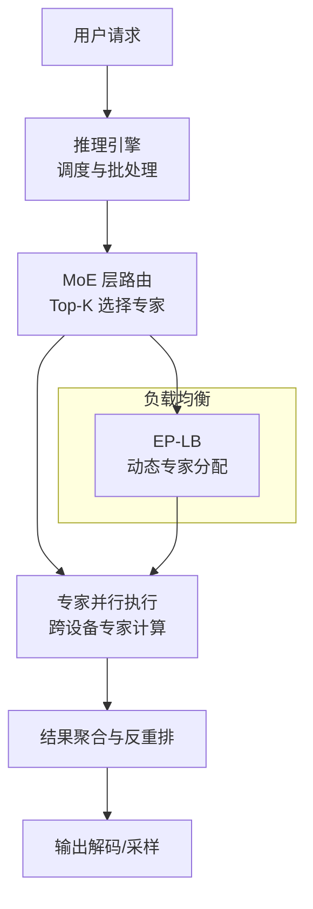
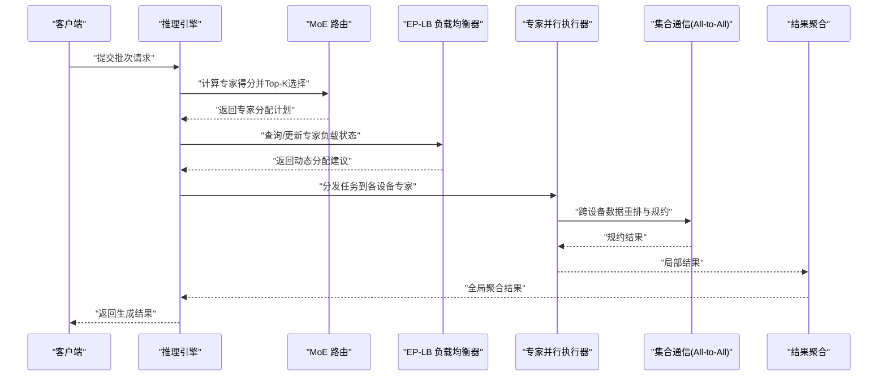
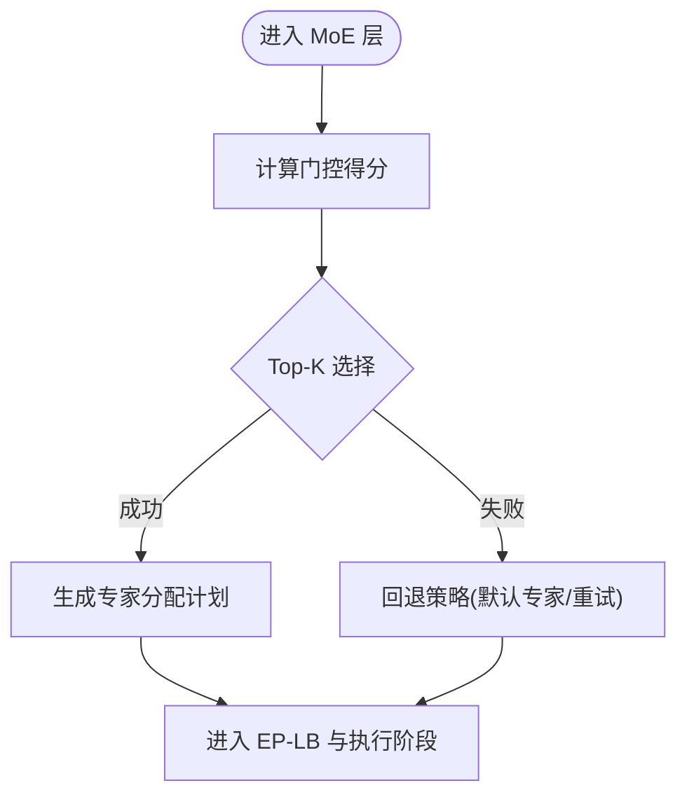
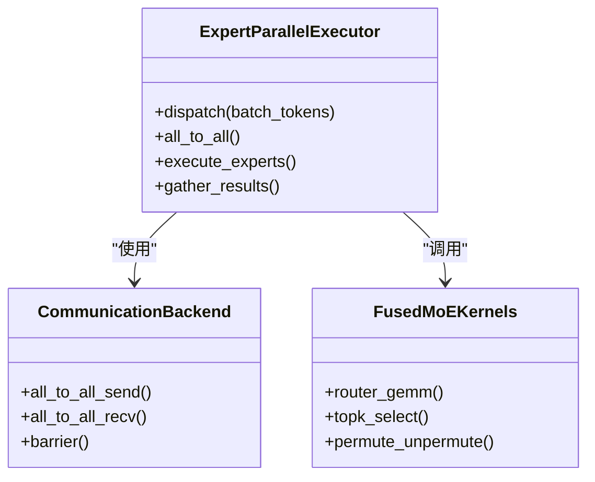
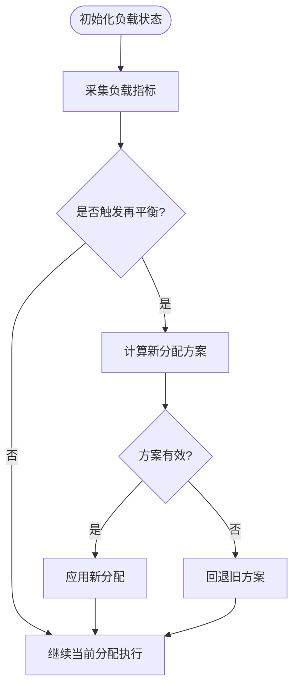
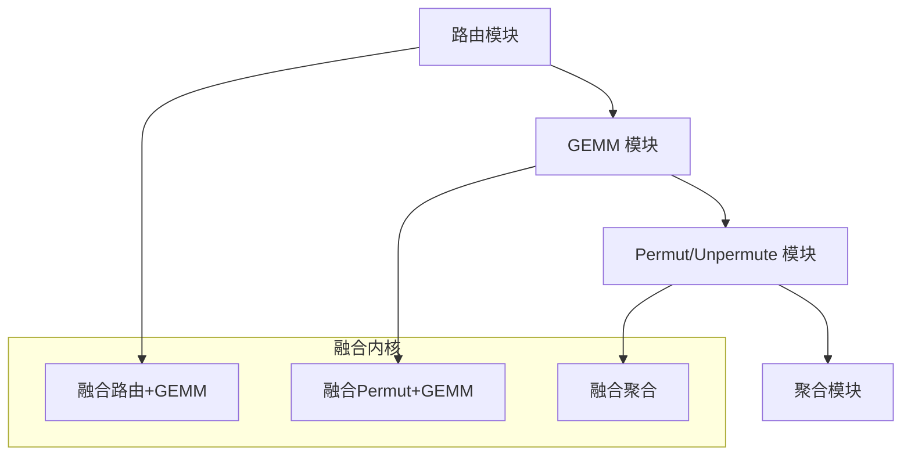
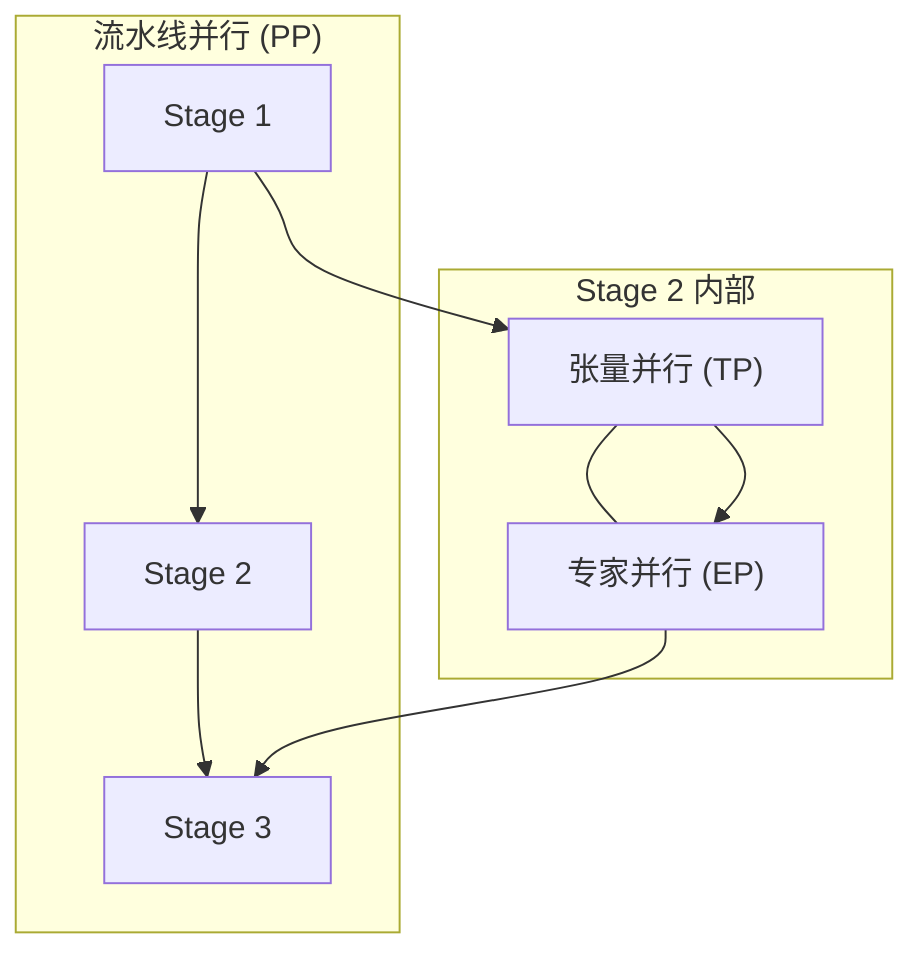
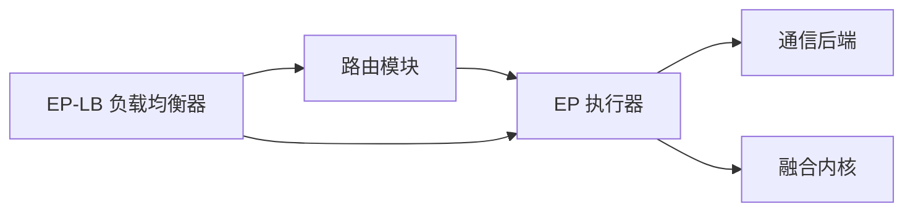

# 专家并行

<cite>
**本文引用的文件**   
- [expert_parallel_deployment.md](file://docs/serving/expert_parallel_deployment.md)
- [moe_kernel_features.md](file://docs/design/moe_kernel_features.md)
- [fused_moe_modular_kernel.md](file://docs/design/fused_moe_modular_kernel.md)
- [test_expert_parallel.py](file://tests/distributed/test_expert_parallel.py)
- [test_eplb_algo.py](file://tests/distributed/test_eplb_algo.py)
- [test_eplb_execute.py](file://tests/distributed/test_eplb_execute.py)
- [test_eplb_fused_moe_layer.py](file://tests/distributed/test_eplb_fused_moe_layer.py)
- [test_eplb_spec_decode.py](file://tests/distributed/test_eplb_spec_decode.py)
- [test_eplb_utils.py](file://tests/distributed/test_eplb_utils.py)
- [epb_utils.py](file://tests/distributed/epb_utils.py)
- [parallelism_scaling.md](file://docs/serving/parallelism_scaling.md)
- [distributed_troubleshooting.md](file://docs/serving/distributed_troubleshooting.md)
</cite>

## 目录
1. [简介](#简介)
2. [项目结构](#项目结构)
3. [核心组件](#核心组件)
4. [架构总览](#架构总览)
5. [详细组件分析](#详细组件分析)
6. [依赖关系分析](#依赖关系分析)
7. [性能考量](#性能考量)
8. [故障诊断指南](#故障诊断指南)
9. [结论](#结论)
10. [附录](#附录)

## 简介
本文件系统性阐述 vLLM 中专家并行（Expert Parallel, EP）的实现机制与配置方法，重点覆盖 MoE（Mixture of Experts）模型在分布式环境下的专家路由、负载平衡策略、动态专家分配算法与负载均衡器（EP-LB）的工作原理。同时提供不同规模 MoE 模型的专家并行配置示例（专家数量、路由策略、通信优化），并给出性能监控工具与故障诊断方法，以及与张量并行（TP）、流水线并行（PP）组合使用的最佳实践。

## 项目结构
围绕专家并行，vLLM 的关键文档与测试分布在以下位置：
- 部署与使用文档：serving/expert_parallel_deployment.md
- 设计文档：design/moe_kernel_features.md、design/fused_moe_modular_kernel.md
- 并行扩展文档：serving/parallelism_scaling.md
- 分布式排障文档：serving/distributed_troubleshooting.md
- 单元测试与集成测试：tests/distributed 下与 EP、EP-LB、MoE 层相关的测试文件

[本图为概念性流程示意，不直接映射具体源码文件]

## 核心组件
- 专家路由与 Top-K 选择：根据输入 token 的隐藏表示计算专家得分，选取 Top-K 个专家进行计算。
- 专家并行执行：将选中的专家按设备维度切分，跨设备执行专家前向，并通过 All-to-All 等集合通信完成数据重排与结果汇聚。
- 动态专家分配与负载均衡（EP-LB）：基于运行时统计与预测，动态调整各设备上专家的数量与权重，避免热点专家导致的负载倾斜。
- 融合 MoE 内核：将路由、GEMM、归约等操作融合，减少内核启动开销与内存访问，提升吞吐。
- 与 TP/PP 的组合：在张量并行与流水线并行基础上叠加专家并行，形成多维并行策略。

**章节来源**
- [moe_kernel_features.md](file://docs/design/moe_kernel_features.md)
- [fused_moe_modular_kernel.md](file://docs/design/fused_moe_modular_kernel.md)
- [expert_parallel_deployment.md](file://docs/serving/expert_parallel_deployment.md)

## 架构总览
下图展示了 vLLM 中 MoE 推理路径与 EP-LB 的交互关系，以及其与 TP/PP 的协同方式。

**图表来源**
- [moe_kernel_features.md](file://docs/design/moe_kernel_features.md)
- [fused_moe_modular_kernel.md](file://docs/design/fused_moe_modular_kernel.md)
- [expert_parallel_deployment.md](file://docs/serving/expert_parallel_deployment.md)

**章节来源**
- [parallelism_scaling.md](file://docs/serving/parallelism_scaling.md)

## 详细组件分析

### 专家路由与 Top-K 选择
- 路由策略：支持多种路由函数（如 softmax/gumbel-topk），通过门控网络为每个 token 计算专家得分，并选择 Top-K 个专家。
- 稀疏激活：仅对选中专家执行计算，降低算力消耗；需配合高效的 permut/unpermute 操作以对齐批次维度。
- 数值稳定性：引入温度缩放、平滑或截断策略，避免极端分布导致的路由失衡。

**图表来源**
- [moe_kernel_features.md](file://docs/design/moe_kernel_features.md)

**章节来源**
- [moe_kernel_features.md](file://docs/design/moe_kernel_features.md)

### 专家并行执行与通信
- 数据重排：依据 Top-K 分配计划，将输入 token 按目标专家重排，跨设备 All-to-All 传输至持有对应专家的 GPU。
- 专家计算：各设备本地执行专家前向（GEMM/激活/归一化等），可结合融合内核减少开销。
- 结果汇聚：将各设备的输出按原始 token 顺序反重排并聚合，得到 MoE 层输出。

**图表来源**
- [fused_moe_modular_kernel.md](file://docs/design/fused_moe_modular_kernel.md)

**章节来源**
- [fused_moe_modular_kernel.md](file://docs/design/fused_moe_modular_kernel.md)

### 动态专家分配与 EP-LB 负载均衡器
- 目标：最小化最大设备负载（makespan），避免热点专家造成拥塞。
- 策略：基于历史统计、实时队列长度与预测模型，动态调整各设备上的专家数量与权重。
- 实现要点：
  - 维护每设备专家负载指标（如待处理 token 数、延迟、显存占用）。
  - 周期性或事件驱动触发再平衡，输出新的专家分配计划。
  - 与路由模块协作，限制每次调整的幅度，保证稳定性。

**图表来源**
- [test_eplb_algo.py](file://tests/distributed/test_eplb_algo.py)
- [test_eplb_execute.py](file://tests/distributed/test_eplb_execute.py)
- [test_eplb_utils.py](file://tests/distributed/test_eplb_utils.py)
- [epb_utils.py](file://tests/distributed/epb_utils.py)

**章节来源**
- [test_eplb_algo.py](file://tests/distributed/test_eplb_algo.py)
- [test_eplb_execute.py](file://tests/distributed/test_eplb_execute.py)
- [test_eplb_utils.py](file://tests/distributed/test_eplb_utils.py)
- [epb_utils.py](file://tests/distributed/epb_utils.py)

### 融合 MoE 内核与模块化设计
- 模块化：将路由、GEMM、permut/unpermute、规约等子操作封装为独立模块，便于替换与优化。
- 融合策略：将多个小内核合并为大内核，减少 kernel launch 与内存读写次数，提高带宽利用率。
- 精度与量化：支持 FP8/NVFP4 等量化格式，结合量化感知训练与校准，兼顾精度与性能。

**图表来源**
- [fused_moe_modular_kernel.md](file://docs/design/fused_moe_modular_kernel.md)

**章节来源**
- [fused_moe_modular_kernel.md](file://docs/design/fused_moe_modular_kernel.md)

### 与张量并行（TP）和流水线并行（PP）的组合
- 组合模式：
  - TP 负责层内参数切分（如注意力头、FFN 矩阵），EP 负责专家维度切分。
  - PP 负责层间流水线切分，EP 可在 PP 的某 stage 内进一步做专家并行。
- 注意事项：
  - 通信拓扑与带宽：All-to-All 与 All-reduce 的叠加需考虑拓扑最优。
  - 资源隔离：确保 TP/PP/EP 的显存与计算资源互不干扰。
  - 调度协同：在多并行维度下统一调度，避免瓶颈集中在某一维度。

**图表来源**
- [parallelism_scaling.md](file://docs/serving/parallelism_scaling.md)

**章节来源**
- [parallelism_scaling.md](file://docs/serving/parallelism_scaling.md)

## 依赖关系分析
- 组件耦合：
  - 路由模块依赖门控网络与 Top-K 选择逻辑。
  - EP 执行器依赖通信后端与融合内核。
  - EP-LB 依赖负载指标采集与调度策略。
- 外部依赖：
  - 集合通信库（NCCL/RDMA 等）。
  - 高性能 GEMM 与量化内核（Cutlass/Triton 等）。
- 潜在循环依赖：应避免路由与 EP-LB 之间的强耦合，采用事件驱动与接口抽象解耦。

**图表来源**
- [moe_kernel_features.md](file://docs/design/moe_kernel_features.md)
- [fused_moe_modular_kernel.md](file://docs/design/fused_moe_modular_kernel.md)

**章节来源**
- [moe_kernel_features.md](file://docs/design/moe_kernel_features.md)
- [fused_moe_modular_kernel.md](file://docs/design/fused_moe_modular_kernel.md)

## 性能考量
- 路由开销：Top-K 选择的复杂度与 batch size、专家数量相关，应控制 K 值与门控网络规模。
- 通信开销：All-to-All 的带宽与延迟是关键，需结合拓扑优化与算子融合。
- 内存访问：permut/unpermute 的访存模式影响带宽利用率，建议使用连续内存布局与融合内核。
- 量化与精度：FP8/NVFP4 可降低带宽与显存占用，但需关注数值稳定性与校准质量。
- 负载均衡：EP-LB 的动态调整频率与幅度需权衡稳定性与响应速度。

[本节为通用指导，不直接分析具体文件]

## 故障诊断指南
- 常见问题：
  - 路由失衡：部分专家过载，其他空闲。检查 Top-K 策略与温度参数。
  - 通信瓶颈：All-to-All 延迟高。检查拓扑设置与通信后端配置。
  - 显存不足：专家数量过多或 batch 过大。调整专家切分与批大小。
  - 数值不稳定：输出发散或 NaN。检查量化校准与门控数值稳定策略。
- 诊断步骤：
  - 启用性能计数器与日志，观察路由分布、通信耗时与显存占用。
  - 逐步关闭融合内核与量化，定位问题来源。
  - 使用 EP-LB 的监控指标评估负载均衡效果。

**章节来源**
- [distributed_troubleshooting.md](file://docs/serving/distributed_troubleshooting.md)

## 结论
vLLM 的专家并行通过高效的路由、融合内核与 EP-LB 负载均衡器，实现了大规模 MoE 模型的高吞吐与低延迟推理。与 TP/PP 的组合使用进一步提升了可扩展性。实际部署中需关注路由策略、通信拓扑、量化精度与负载均衡调优，以获得最佳性能。

[本节为总结性内容，不直接分析具体文件]

## 附录

### 专家并行配置示例（不同规模 MoE）
- 小规模（例如 8 专家，K=2）：
  - 专家数量：8，Top-K：2
  - 路由策略：softmax + 温度缩放
  - 通信优化：All-to-All 合并，融合 permut/unpermute
  - 适用场景：中小批量、低延迟服务
- 中等规模（例如 32 专家，K=4）：
  - 专家数量：32，Top-K：4
  - 路由策略：gumbel-topk + 平滑
  - 通信优化：拓扑感知 All-to-All，量化 FP8
  - 适用场景：中大批量、高吞吐服务
- 大规模（例如 128 专家，K=8）：
  - 专家数量：128，Top-K：8
  - 路由策略：自适应 Top-K + 热点抑制
  - 通信优化：RDMA 加速，融合内核最大化
  - 适用场景：超大批量、极致吞吐

[本节为概念性配置示例，不直接分析具体文件]

### 性能监控工具与指标
- 关键指标：
  - 路由分布：各专家被选中频率
  - 通信耗时：All-to-All 平均/尾延迟
  - 显存占用：各设备专家权重与激活内存
  - 吞吐与延迟：每秒 token 数与端到端延迟
- 工具建议：
  - 内置性能计数器与日志
  - 外部监控（Prometheus/Grafana）
  - 分布式追踪（OpenTelemetry）

[本节为通用指导，不直接分析具体文件]

### 与 TP/PP 组合的最佳实践
- 分层切分：PP 切分层间，TP 切分层内，EP 切分专家维度。
- 通信拓扑：优先选择带宽更高的链路用于 All-to-All。
- 资源隔离：为不同并行维度分配独立的 GPU 或 NUMA 节点。
- 调度协同：统一调度器协调多并行维度的批处理与流水线。

**章节来源**
- [parallelism_scaling.md](file://docs/serving/parallelism_scaling.md)