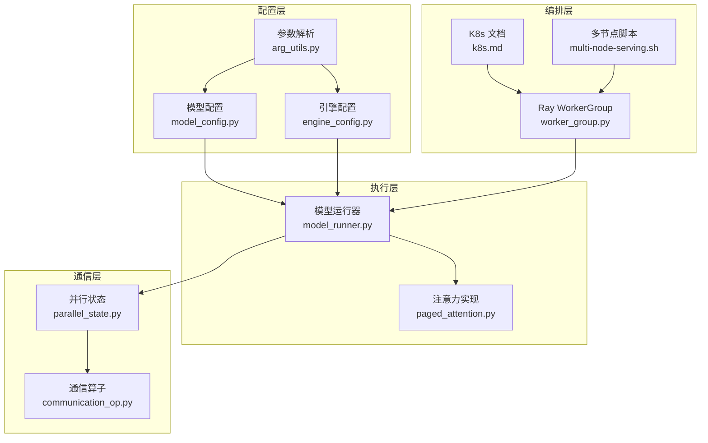
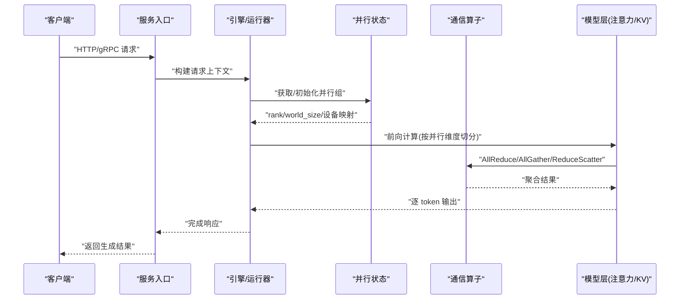
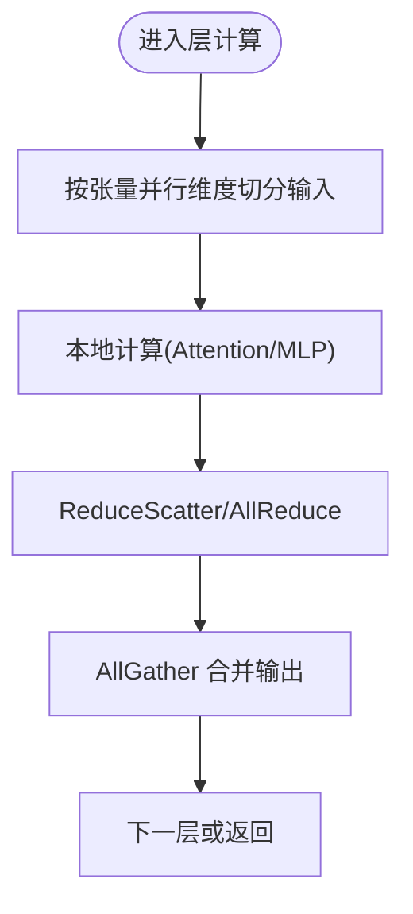
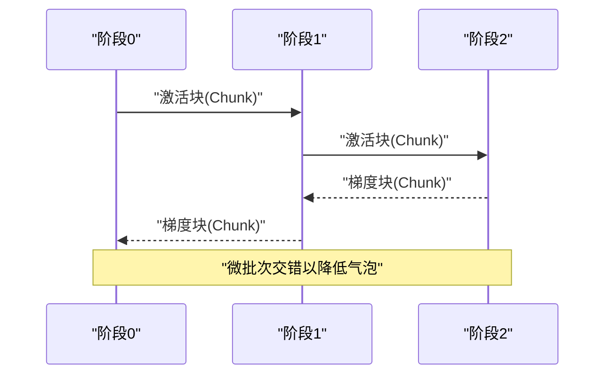
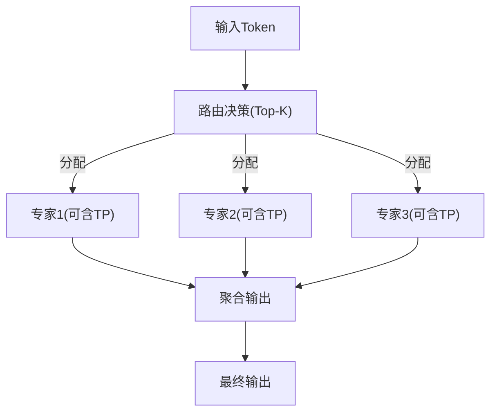
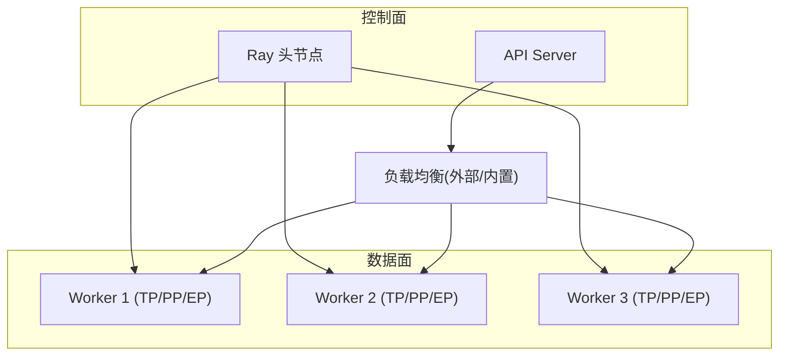
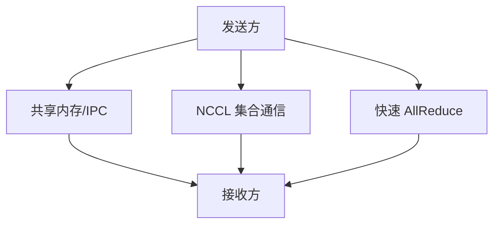
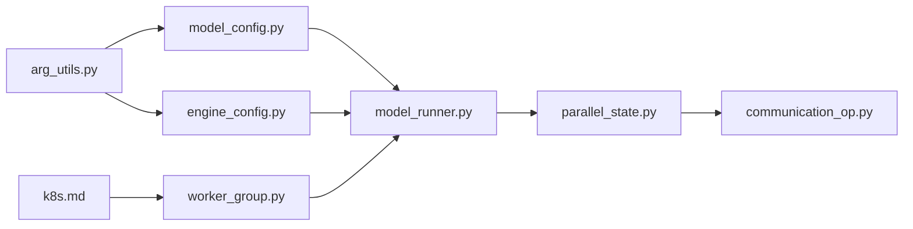

# 分布式推理

<cite>
**本文引用的文件**   
- [vllm/distributed/__init__.py](file://vllm/distributed/__init__.py)
- [vllm/distributed/parallel_state.py](file://vllm/distributed/parallel_state.py)
- [vllm/distributed/communication_op.py](file://vllm/distributed/communication_op.py)
- [vllm/engine/arg_utils.py](file://vllm/engine/arg_utils.py)
- [vllm/config/model_config.py](file://vllm/config/model_config.py)
- [vllm/config/engine_config.py](file://vllm/config/engine_config.py)
- [vllm/model_executor/model_runner.py](file://vllm/model_executor/model_runner.py)
- [vllm/model_executor/layers/attention/paged_attention.py](file://vllm/model_executor/layers/attention/paged_attention.py)
- [vllm/ray/worker_group.py](file://vllm/ray/worker_group.py)
- [examples/ray_serving/multi-node-serving.sh](file://examples/ray_serving/multi-node-serving.sh)
- [docs/deployment/k8s.md](file://docs/deployment/k8s.md)
- [docs/serving/data_parallel_deployment.md](file://docs/serving/data_parallel_deployment.md)
- [docs/serving/expert_parallel_deployment.md](file://docs/serving/expert_parallel_deployment.md)
- [docs/serving/context_parallel_deployment.md](file://docs/serving/context_parallel_deployment.md)
- [docs/serving/parallelism_scaling.md](file://docs/serving/parallelism_scaling.md)
- [tests/distributed/test_pipeline_parallel.py](file://tests/distributed/test_pipeline_parallel.py)
- [tests/distributed/test_expert_parallel.py](file://tests/distributed/test_expert_parallel.py)
- [tests/distributed/test_context_parallel.py](file://tests/distributed/test_context_parallel.py)
- [tests/distributed/test_nccl_symm_mem.py](file://tests/distributed/test_nccl_symm_mem.py)
- [tests/distributed/test_shm_broadcast.py](file://tests/distributed/test_shm_broadcast.py)
- [tests/distributed/test_quick_all_reduce.py](file://tests/distributed/test_quick_all_reduce.py)
- [benchmarks/benchmark_throughput.py](file://benchmarks/benchmark_throughput.py)
- [docs/configuration/env_vars.md](file://docs/configuration/env_vars.md)
</cite>

## 目录
1. [简介](#简介)
2. [项目结构](#项目结构)
3. [核心组件](#核心组件)
4. [架构总览](#架构总览)
5. [详细组件分析](#详细组件分析)
6. [依赖关系分析](#依赖关系分析)
7. [性能考量](#性能考量)
8. [故障排查指南](#故障排查指南)
9. [结论](#结论)
10. [附录](#附录)

## 简介
本文件面向希望在生产环境中使用 vLLM 进行分布式推理的工程师与运维人员，系统阐述多 GPU、多节点集群下的张量并行（TP）、流水线并行（PP）与专家并行（EP）配置方法；介绍基于 Ray 与 Kubernetes 的部署架构与负载均衡策略；解释 NCCL、共享内存与进程间通信等分布式通信机制；给出弹性扩缩容与故障恢复的配置要点；并总结网络拓扑优化、带宽利用与延迟优化的最佳实践，以及监控与调试工具的使用方法。

## 项目结构
vLLM 的分布式能力由“配置层—执行层—通信层—编排层”构成：
- 配置层：模型与引擎参数解析，决定并行维度与后端选择。
- 执行层：模型加载、分片、调度与 KV 缓存管理。
- 通信层：NCCL 集合通信、快速 AllReduce、共享内存缓冲。
- 编排层：Ray WorkerGroup、Kubernetes 部署脚本与示例。

图表来源
- [vllm/config/model_config.py](file://vllm/config/model_config.py)
- [vllm/config/engine_config.py](file://vllm/config/engine_config.py)
- [vllm/engine/arg_utils.py](file://vllm/engine/arg_utils.py)
- [vllm/model_executor/model_runner.py](file://vllm/model_executor/model_runner.py)
- [vllm/model_executor/layers/attention/paged_attention.py](file://vllm/model_executor/layers/attention/paged_attention.py)
- [vllm/distributed/parallel_state.py](file://vllm/distributed/parallel_state.py)
- [vllm/distributed/communication_op.py](file://vllm/distributed/communication_op.py)
- [vllm/ray/worker_group.py](file://vllm/ray/worker_group.py)
- [docs/deployment/k8s.md](file://docs/deployment/k8s.md)
- [examples/ray_serving/multi-node-serving.sh](file://examples/ray_serving/multi-node-serving.sh)

章节来源
- [vllm/config/model_config.py](file://vllm/config/model_config.py)
- [vllm/config/engine_config.py](file://vllm/config/engine_config.py)
- [vllm/engine/arg_utils.py](file://vllm/engine/arg_utils.py)
- [vllm/model_executor/model_runner.py](file://vllm/model_executor/model_runner.py)
- [vllm/distributed/parallel_state.py](file://vllm/distributed/parallel_state.py)
- [vllm/distributed/communication_op.py](file://vllm/distributed/communication_op.py)
- [vllm/ray/worker_group.py](file://vllm/ray/worker_group.py)
- [docs/deployment/k8s.md](file://docs/deployment/k8s.md)
- [examples/ray_serving/multi-node-serving.sh](file://examples/ray_serving/multi-node-serving.sh)

## 核心组件
- 并行状态与分组管理：负责初始化分布式环境、创建进程组、维护 TP/PP/CP/EP 的 rank/world_size 映射。
- 通信算子封装：对 NCCL AllReduce/AllGather/ReduceScatter 等进行统一接口封装，并提供快速路径与对称内存优化。
- 模型运行器：根据配置将模型权重与计算图切分到不同并行维度，协调 KV 缓存与注意力计算。
- Ray WorkerGroup：在多进程/多节点场景下调度 vLLM 工作进程，支持动态扩缩容与任务分发。
- 配置解析：从 CLI/环境变量/配置文件解析出并行度、后端、KV 缓存策略等关键参数。

章节来源
- [vllm/distributed/parallel_state.py](file://vllm/distributed/parallel_state.py)
- [vllm/distributed/communication_op.py](file://vllm/distributed/communication_op.py)
- [vllm/model_executor/model_runner.py](file://vllm/model_executor/model_runner.py)
- [vllm/ray/worker_group.py](file://vllm/ray/worker_group.py)
- [vllm/engine/arg_utils.py](file://vllm/engine/arg_utils.py)

## 架构总览
下图展示一次分布式推理请求在 vLLM 中的端到端流程，涵盖客户端、服务入口、并行状态初始化、模型执行与通信调用。

图表来源
- [vllm/model_executor/model_runner.py](file://vllm/model_executor/model_runner.py)
- [vllm/distributed/parallel_state.py](file://vllm/distributed/parallel_state.py)
- [vllm/distributed/communication_op.py](file://vllm/distributed/communication_op.py)
- [vllm/model_executor/layers/attention/paged_attention.py](file://vllm/model_executor/layers/attention/paged_attention.py)

## 详细组件分析

### 张量并行（TP）
- 配置要点：设置张量并行度（如 tensor_parallel_size），确保模型权重与中间激活按列/行切分，注意力头与 MLP 层需对齐。
- 通信模式：每层前向/反向涉及 AllGather/ReduceScatter/AllReduce 等集合通信。
- 注意事项：GPU 拓扑与 NVLink 带宽影响显著；建议开启快速 AllReduce 与对称内存优化。

图表来源
- [vllm/distributed/communication_op.py](file://vllm/distributed/communication_op.py)
- [vllm/model_executor/model_runner.py](file://vllm/model_executor/model_runner.py)

章节来源
- [vllm/distributed/communication_op.py](file://vllm/distributed/communication_op.py)
- [vllm/model_executor/model_runner.py](file://vllm/model_executor/model_runner.py)

### 流水线并行（PP）
- 配置要点：设置流水线并行度（pipeline_parallel_size），将模型层划分为若干阶段，跨阶段通过消息传递同步激活。
- 微批次与气泡：合理设置 micro_batch 与 chunk 大小以平衡吞吐与延迟。
- 验证方式：参考测试用例覆盖 PP 的前向/反向与 CUDA Graph 兼容性。

图表来源
- [tests/distributed/test_pipeline_parallel.py](file://tests/distributed/test_pipeline_parallel.py)

章节来源
- [tests/distributed/test_pipeline_parallel.py](file://tests/distributed/test_pipeline_parallel.py)

### 专家并行（EP）
- 配置要点：设置专家并行度（expert_parallel_size），路由层将 token 分配到不同专家，专家内部可结合张量并行。
- 路由与均衡：Top-K 路由与负载再平衡策略影响吞吐与尾延迟。
- 验证方式：参考 EP 测试与 EPLB（专家负载均衡）相关用例。

图表来源
- [tests/distributed/test_expert_parallel.py](file://tests/distributed/test_expert_parallel.py)

章节来源
- [tests/distributed/test_expert_parallel.py](file://tests/distributed/test_expert_parallel.py)

### 上下文并行（CP）
- 适用场景：超长上下文序列的注意力计算，沿序列维度切分以减少显存峰值。
- 通信模式：跨分片的 KV 与注意力掩码交换，通常使用 AllGather/AllReduce。
- 验证方式：参考 CP 测试用例。

章节来源
- [tests/distributed/test_context_parallel.py](file://tests/distributed/test_context_parallel.py)

### 多节点集群部署（Ray 与 Kubernetes）
- Ray 集群：通过 WorkerGroup 启动多进程/多节点 vLLM 实例，支持动态扩缩容与任务分发。
- Kubernetes：使用官方文档与 Helm Chart 部署，配合 Service/Ingress 做负载均衡与滚动更新。
- 负载均衡策略：基于请求路由、队列长度与资源利用率进行调度，避免热点节点。

图表来源
- [vllm/ray/worker_group.py](file://vllm/ray/worker_group.py)
- [docs/deployment/k8s.md](file://docs/deployment/k8s.md)
- [examples/ray_serving/multi-node-serving.sh](file://examples/ray_serving/multi-node-serving.sh)

章节来源
- [vllm/ray/worker_group.py](file://vllm/ray/worker_group.py)
- [docs/deployment/k8s.md](file://docs/deployment/k8s.md)
- [examples/ray_serving/multi-node-serving.sh](file://examples/ray_serving/multi-node-serving.sh)

### 分布式通信机制（NCCL、共享内存与 IPC）
- NCCL 集合通信：AllReduce/AllGather/ReduceScatter 是 TP/CP/EP 的核心原语。
- 快速 AllReduce：针对特定拓扑与带宽优化，降低延迟。
- 共享内存与 IPC：跨进程广播与缓冲区复用，减少拷贝开销。
- 对称内存优化：提升 NCCL 操作效率，适合大张量传输。

图表来源
- [vllm/distributed/communication_op.py](file://vllm/distributed/communication_op.py)
- [tests/distributed/test_nccl_symm_mem.py](file://tests/distributed/test_nccl_symm_mem.py)
- [tests/distributed/test_shm_broadcast.py](file://tests/distributed/test_shm_broadcast.py)
- [tests/distributed/test_quick_all_reduce.py](file://tests/distributed/test_quick_all_reduce.py)

章节来源
- [vllm/distributed/communication_op.py](file://vllm/distributed/communication_op.py)
- [tests/distributed/test_nccl_symm_mem.py](file://tests/distributed/test_nccl_symm_mem.py)
- [tests/distributed/test_shm_broadcast.py](file://tests/distributed/test_shm_broadcast.py)
- [tests/distributed/test_quick_all_reduce.py](file://tests/distributed/test_quick_all_reduce.py)

### 弹性扩展与故障恢复
- 动态扩缩容：Ray WorkerGroup 支持运行时增加/减少 worker，vLLM 引擎可热插拔部分组件。
- 故障恢复：检测 worker 失败后自动重建，重试失败请求，保证服务可用性。
- 配置要点：设置超时、重试次数与健康检查间隔，结合外部负载均衡器进行流量切换。

章节来源
- [vllm/ray/worker_group.py](file://vllm/ray/worker_group.py)
- [docs/serving/parallelism_scaling.md](file://docs/serving/parallelism_scaling.md)

### 分布式训练与推理的协调策略
- 权重一致性：训练侧生成的权重需与推理侧的分片策略一致（TP/PP/EP 维度对齐）。
- 加载优化：使用高效权重加载器与分片读取，避免全量拷贝。
- 版本兼容：确保训练与推理的模型格式与量化策略一致。

章节来源
- [vllm/config/model_config.py](file://vllm/config/model_config.py)
- [vllm/model_executor/model_runner.py](file://vllm/model_executor/model_runner.py)

## 依赖关系分析
- 配置到执行：arg_utils 解析参数，model_config 与 engine_config 驱动 model_runner 初始化。
- 执行到通信：model_runner 依赖 parallel_state 获取并行组，调用 communication_op 进行集合通信。
- 编排到执行：ray worker_group 管理 vLLM 进程生命周期，k8s 文档提供部署模板。

图表来源
- [vllm/engine/arg_utils.py](file://vllm/engine/arg_utils.py)
- [vllm/config/model_config.py](file://vllm/config/model_config.py)
- [vllm/config/engine_config.py](file://vllm/config/engine_config.py)
- [vllm/model_executor/model_runner.py](file://vllm/model_executor/model_runner.py)
- [vllm/distributed/parallel_state.py](file://vllm/distributed/parallel_state.py)
- [vllm/distributed/communication_op.py](file://vllm/distributed/communication_op.py)
- [vllm/ray/worker_group.py](file://vllm/ray/worker_group.py)
- [docs/deployment/k8s.md](file://docs/deployment/k8s.md)

章节来源
- [vllm/engine/arg_utils.py](file://vllm/engine/arg_utils.py)
- [vllm/config/model_config.py](file://vllm/config/model_config.py)
- [vllm/config/engine_config.py](file://vllm/config/engine_config.py)
- [vllm/model_executor/model_runner.py](file://vllm/model_executor/model_runner.py)
- [vllm/distributed/parallel_state.py](file://vllm/distributed/parallel_state.py)
- [vllm/distributed/communication_op.py](file://vllm/distributed/communication_op.py)
- [vllm/ray/worker_group.py](file://vllm/ray/worker_group.py)
- [docs/deployment/k8s.md](file://docs/deployment/k8s.md)

## 性能考量
- 网络拓扑优化：优先使用 NVLink/InfiniBand 拓扑，调整 NCCL 拓扑感知参数。
- 带宽利用：启用快速 AllReduce、对称内存与批量集合通信，减少小消息开销。
- 延迟优化：合理设置 micro_batch、chunk 大小与 KV 缓存策略，避免过度序列化。
- 基准测试：使用吞吐量与延迟基准脚本评估不同并行度与后端组合。

章节来源
- [benchmarks/benchmark_throughput.py](file://benchmarks/benchmark_throughput.py)
- [docs/configuration/env_vars.md](file://docs/configuration/env_vars.md)

## 故障排查指南
- 常见问题定位：检查 NCCL 环境变量、GPU 可见性、端口冲突与防火墙规则。
- 日志与指标：启用详细日志，采集 Prometheus/Grafana 指标，关注队列长度与错误率。
- 复现与隔离：使用最小化用例与单节点复现，逐步引入并行维度定位瓶颈。
- 工具推荐：使用 vLLM 内置 profiling、NVIDIA Nsight Systems/TI 与 PyTorch Profiler。

章节来源
- [docs/configuration/env_vars.md](file://docs/configuration/env_vars.md)

## 结论
vLLM 的分布式推理能力通过清晰的配置层、高效的执行层、健壮的通信层与灵活的编排层协同工作，支持 TP/PP/EP/CP 等多种并行模式，适配多节点集群与云原生部署。通过合理的网络拓扑优化、通信路径调优与弹性扩缩容策略，可在大规模生产环境中获得高吞吐与低延迟的推理服务。

## 附录
- 多 GPU 推理配置速查：
  - 张量并行：设置 tensor_parallel_size，确保权重与注意力头对齐。
  - 流水线并行：设置 pipeline_parallel_size，调整 micro_batch 与 chunk。
  - 专家并行：设置 expert_parallel_size，结合 Top-K 路由与负载均衡。
  - 上下文并行：设置 context_parallel_size，优化长序列注意力。
- 多节点部署要点：
  - Ray：使用 WorkerGroup 管理进程，配置 head/node 地址与资源配额。
  - Kubernetes：使用官方文档与 Helm Chart，配置 Service/Ingress 与 HPA。
- 通信与环境变量：
  - NCCL：设置 NCCL_DEBUG、NCCL_IB_DISABLE、NCCL_SHM_DISABLE 等。
  - 共享内存：调整 shm 大小与 IPC 通道数量。
- 监控与调试：
  - 指标：QPS、延迟分布、GPU 利用率、通信带宽。
  - 工具：Prometheus/Grafana、Nsight、PyTorch Profiler。

章节来源
- [docs/serving/data_parallel_deployment.md](file://docs/serving/data_parallel_deployment.md)
- [docs/serving/expert_parallel_deployment.md](file://docs/serving/expert_parallel_deployment.md)
- [docs/serving/context_parallel_deployment.md](file://docs/serving/context_parallel_deployment.md)
- [docs/serving/parallelism_scaling.md](file://docs/serving/parallelism_scaling.md)
- [docs/deployment/k8s.md](file://docs/deployment/k8s.md)
- [docs/configuration/env_vars.md](file://docs/configuration/env_vars.md)