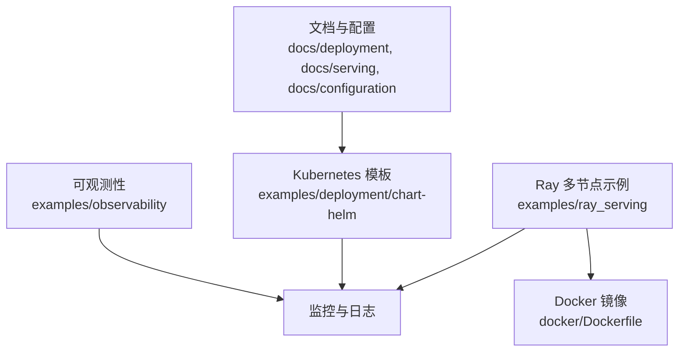
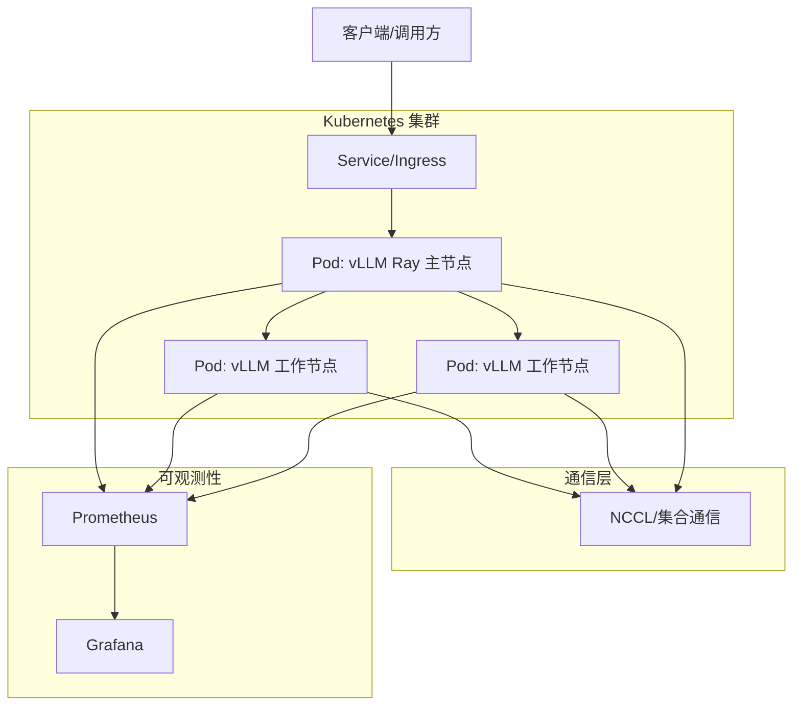
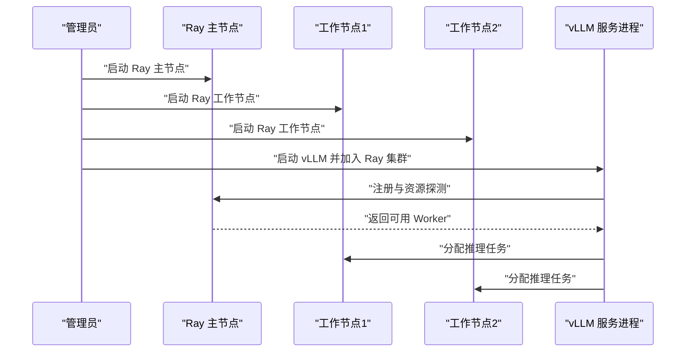
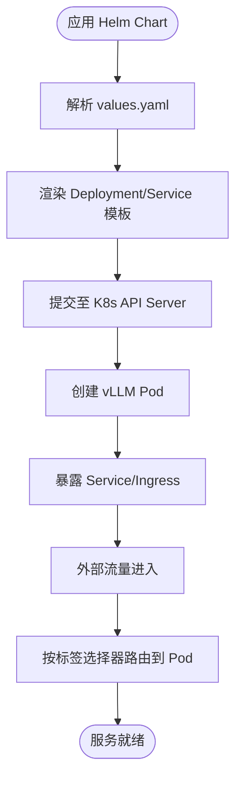
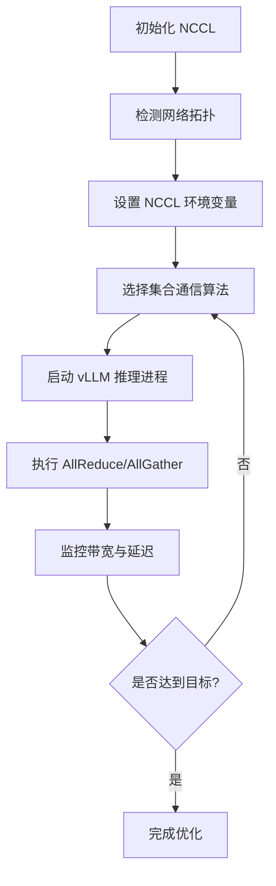
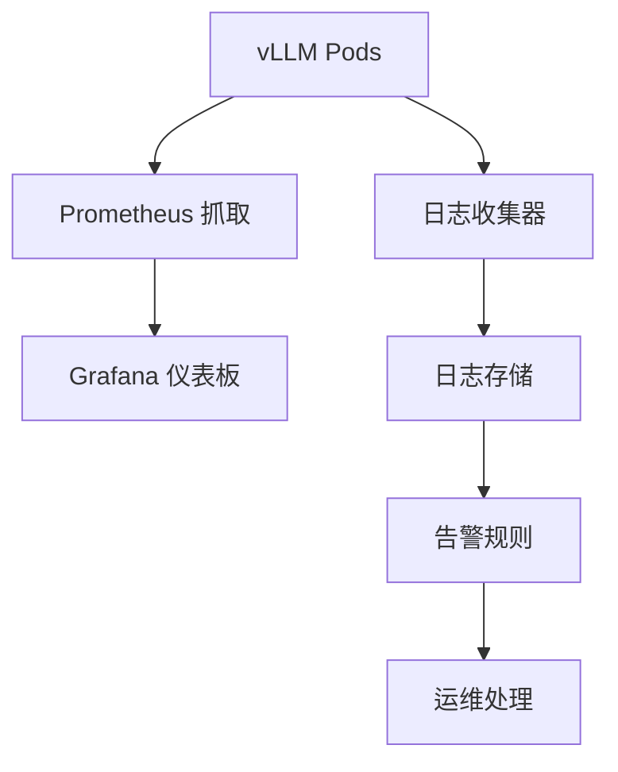
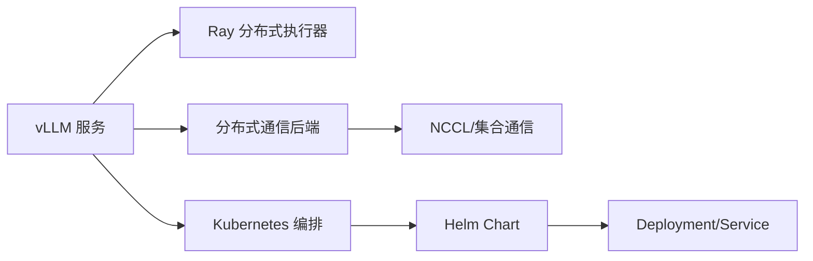

# 多节点部署

<cite>
**本文引用的文件**   
- [README.md](file://README.md)
- [docker/Dockerfile](file://docker/Dockerfile)
- [examples/deployment/chart-helm/Chart.yaml](file://examples/deployment/chart-helm/Chart.yaml)
- [examples/deployment/chart-helm/values.yaml](file://examples/deployment/chart-helm/values.yaml)
- [examples/deployment/chart-helm/templates/service.yaml](file://examples/deployment/chart-helm/templates/service.yaml)
- [examples/deployment/chart-helm/templates/deployment.yaml](file://examples/deployment/chart-helm/templates/deployment.yaml)
- [examples/ray_serving/multi-node-serving.sh](file://examples/ray_serving/multi-node-serving.sh)
- [examples/ray_serving/run_cluster.sh](file://examples/ray_serving/run_cluster.sh)
- [vllm/ray/__init__.py](file://vllm/ray/__init__.py)
- [vllm/distributed/__init__.py](file://vllm/distributed/__init__.py)
- [docs/deployment/k8s.md](file://docs/deployment/k8s.md)
- [docs/serving/data_parallel_deployment.md](file://docs/serving/data_parallel_deployment.md)
- [docs/serving/context_parallel_deployment.md](file://docs/serving/context_parallel_deployment.md)
- [docs/serving/expert_parallel_deployment.md](file://docs/serving/expert_parallel_deployment.md)
- [docs/serving/parallelism_scaling.md](file://docs/serving/parallelism_scaling.md)
- [docs/configuration/env_vars.md](file://docs/configuration/env_vars.md)
- [docs/benchmarking/dashboard.md](file://docs/benchmarking/dashboard.md)
- [examples/observability/prometheus_grafana/grafana-dashboards/vLLM.json](file://examples/observability/prometheus_grafana/grafana-dashboards/vLLM.json)
</cite>

## 目录
1. [简介](#简介)
2. [项目结构](#项目结构)
3. [核心组件](#核心组件)
4. [架构总览](#架构总览)
5. [详细组件分析](#详细组件分析)
6. [依赖关系分析](#依赖关系分析)
7. [性能考虑](#性能考虑)
8. [故障排查指南](#故障排查指南)
9. [结论](#结论)
10. [附录](#附录)

## 简介
本文件面向在多节点环境下部署 vLLM 的工程师与运维人员，系统阐述基于 Ray 的分布式集群搭建、Kubernetes 容器化部署（含 Helm Chart）、不同云平台与裸机环境的模板与脚本、多节点通信优化（NCCL、网络拓扑感知、带宽优化），以及监控、日志收集与故障恢复的最佳实践。内容以仓库中的部署文档、示例脚本与 Helm Chart 为依据，帮助读者快速落地生产级推理集群。

## 项目结构
与多节点部署直接相关的代码与文档主要分布在以下位置：
- 部署文档与配置说明：docs/deployment、docs/serving、docs/configuration
- Kubernetes 部署模板：examples/deployment/chart-helm
- Ray 多节点示例：examples/ray_serving
- Docker 镜像构建：docker
- 可观测性与监控：examples/observability

图表来源
- [docs/deployment/k8s.md](file://docs/deployment/k8s.md)
- [examples/deployment/chart-helm/Chart.yaml](file://examples/deployment/chart-helm/Chart.yaml)
- [examples/ray_serving/multi-node-serving.sh](file://examples/ray_serving/multi-node-serving.sh)
- [docker/Dockerfile](file://docker/Dockerfile)

章节来源
- [README.md](file://README.md)
- [docs/deployment/k8s.md](file://docs/deployment/k8s.md)
- [examples/deployment/chart-helm/Chart.yaml](file://examples/deployment/chart-helm/Chart.yaml)
- [examples/ray_serving/multi-node-serving.sh](file://examples/ray_serving/multi-node-serving.sh)
- [docker/Dockerfile](file://docker/Dockerfile)

## 核心组件
- Ray 分布式执行器：通过 vLLM 的 Ray 集成在集群中调度 Worker，实现跨进程/跨节点的并行推理。
- 分布式通信后端：底层使用 NCCL 等集合通信库进行张量/参数同步与 KV 缓存共享。
- Kubernetes 编排：Helm Chart 提供 Deployment、Service 等资源定义，支持服务发现与负载均衡。
- 可观测性：Prometheus/Grafana 指标采集与可视化，结合结构化日志便于定位问题。

章节来源
- [vllm/ray/__init__.py](file://vllm/ray/__init__.py)
- [vllm/distributed/__init__.py](file://vllm/distributed/__init__.py)
- [examples/deployment/chart-helm/values.yaml](file://examples/deployment/chart-helm/values.yaml)
- [examples/observability/prometheus_grafana/grafana-dashboards/vLLM.json](file://examples/observability/prometheus_grafana/grafana-dashboards/vLLM.json)

## 架构总览
下图展示多节点 vLLM 的典型架构：客户端请求经 K8s Service 进入 vLLM 服务，Ray 主节点负责集群协调与资源分配，工作节点承载推理进程；节点间通过 NCCL 进行通信，指标与日志由 Prometheus/Grafana 统一采集。

图表来源
- [examples/deployment/chart-helm/templates/service.yaml](file://examples/deployment/chart-helm/templates/service.yaml)
- [examples/deployment/chart-helm/templates/deployment.yaml](file://examples/deployment/chart-helm/templates/deployment.yaml)
- [vllm/distributed/__init__.py](file://vllm/distributed/__init__.py)
- [examples/observability/prometheus_grafana/grafana-dashboards/vLLM.json](file://examples/observability/prometheus_grafana/grafana-dashboards/vLLM.json)

## 详细组件分析

### 基于 Ray 的多节点集群搭建
- 主节点与工作节点角色划分：Ray 主节点负责集群初始化与任务分发，工作节点运行推理进程并参与集合通信。
- 启动流程：通过示例脚本在多个主机或容器中分别启动 Ray 主节点与工作节点，随后启动 vLLM 服务进程加入集群。
- 资源管理：依据 GPU/CPU 资源声明与亲和性策略，确保每个工作节点获得所需算力。

图表来源
- [examples/ray_serving/multi-node-serving.sh](file://examples/ray_serving/multi-node-serving.sh)
- [examples/ray_serving/run_cluster.sh](file://examples/ray_serving/run_cluster.sh)
- [vllm/ray/__init__.py](file://vllm/ray/__init__.py)

章节来源
- [examples/ray_serving/multi-node-serving.sh](file://examples/ray_serving/multi-node-serving.sh)
- [examples/ray_serving/run_cluster.sh](file://examples/ray_serving/run_cluster.sh)
- [vllm/ray/__init__.py](file://vllm/ray/__init__.py)

### Kubernetes 容器化部署（Helm）
- Chart 结构：包含 Chart 元数据、Values 配置、Deployment 与 Service 模板。
- 服务发现与负载均衡：Service 暴露端口，Ingress 或 LoadBalancer 将流量路由到 vLLM Pod。
- 扩缩容：通过调整副本数与资源限制，动态扩展推理能力。

图表来源
- [examples/deployment/chart-helm/Chart.yaml](file://examples/deployment/chart-helm/Chart.yaml)
- [examples/deployment/chart-helm/values.yaml](file://examples/deployment/chart-helm/values.yaml)
- [examples/deployment/chart-helm/templates/deployment.yaml](file://examples/deployment/chart-helm/templates/deployment.yaml)
- [examples/deployment/chart-helm/templates/service.yaml](file://examples/deployment/chart-helm/templates/service.yaml)

章节来源
- [examples/deployment/chart-helm/Chart.yaml](file://examples/deployment/chart-helm/Chart.yaml)
- [examples/deployment/chart-helm/values.yaml](file://examples/deployment/chart-helm/values.yaml)
- [examples/deployment/chart-helm/templates/deployment.yaml](file://examples/deployment/chart-helm/templates/deployment.yaml)
- [examples/deployment/chart-helm/templates/service.yaml](file://examples/deployment/chart-helm/templates/service.yaml)
- [docs/deployment/k8s.md](file://docs/deployment/k8s.md)

### 不同平台与裸机部署模板
- 云平台：通常通过 K8s 托管集群（EKS/AKS/GKE）配合 Helm 部署，利用云厂商的网络与存储特性。
- 裸机环境：可直接使用 Ray 脚本在各节点上拉起主/工作节点，或通过容器运行时（如 containerd）运行 vLLM 镜像。
- 镜像构建：基于 docker/Dockerfile 定制镜像，确保 CUDA/NCCL/Torch 版本匹配。

章节来源
- [docker/Dockerfile](file://docker/Dockerfile)
- [examples/ray_serving/multi-node-serving.sh](file://examples/ray_serving/multi-node-serving.sh)
- [docs/deployment/k8s.md](file://docs/deployment/k8s.md)

### 多节点通信优化（NCCL、拓扑感知、带宽优化）
- NCCL 配置：设置环境变量以启用高性能路径（如 GPUDirect RDMA、IB/RoCE），并根据网络拓扑调整 allreduce 算法。
- 拓扑感知：通过 NCCL 拓扑探测与亲和性策略，减少跨交换机通信。
- 带宽优化：合理批大小、避免频繁小消息、开启零拷贝与内存池，降低序列化开销。

图表来源
- [docs/configuration/env_vars.md](file://docs/configuration/env_vars.md)
- [vllm/distributed/__init__.py](file://vllm/distributed/__init__.py)

章节来源
- [docs/configuration/env_vars.md](file://docs/configuration/env_vars.md)
- [vllm/distributed/__init__.py](file://vllm/distributed/__init__.py)

### 监控、日志与故障恢复
- 指标采集：通过 Prometheus 抓取 vLLM 暴露的指标，Grafana 可视化关键指标（吞吐、延迟、显存占用）。
- 日志收集：集中式日志（如 ELK/Loki）聚合各 Pod 输出，便于检索与告警。
- 故障恢复：利用 K8s 健康检查与重启策略，结合 Ray 自动重连机制提升鲁棒性。

图表来源
- [examples/observability/prometheus_grafana/grafana-dashboards/vLLM.json](file://examples/observability/prometheus_grafana/grafana-dashboards/vLLM.json)
- [docs/benchmarking/dashboard.md](file://docs/benchmarking/dashboard.md)

章节来源
- [examples/observability/prometheus_grafana/grafana-dashboards/vLLM.json](file://examples/observability/prometheus_grafana/grafana-dashboards/vLLM.json)
- [docs/benchmarking/dashboard.md](file://docs/benchmarking/dashboard.md)

## 依赖关系分析
- vLLM 对 Ray 的依赖体现在分布式执行器的初始化与 Worker 调度。
- 分布式通信依赖 NCCL 等底层库，需与硬件和网络驱动匹配。
- K8s 部署依赖 Helm Chart 模板与 Values 配置，确保资源与网络正确编排。

图表来源
- [vllm/ray/__init__.py](file://vllm/ray/__init__.py)
- [vllm/distributed/__init__.py](file://vllm/distributed/__init__.py)
- [examples/deployment/chart-helm/Chart.yaml](file://examples/deployment/chart-helm/Chart.yaml)
- [examples/deployment/chart-helm/templates/deployment.yaml](file://examples/deployment/chart-helm/templates/deployment.yaml)
- [examples/deployment/chart-helm/templates/service.yaml](file://examples/deployment/chart-helm/templates/service.yaml)

章节来源
- [vllm/ray/__init__.py](file://vllm/ray/__init__.py)
- [vllm/distributed/__init__.py](file://vllm/distributed/__init__.py)
- [examples/deployment/chart-helm/Chart.yaml](file://examples/deployment/chart-helm/Chart.yaml)
- [examples/deployment/chart-helm/templates/deployment.yaml](file://examples/deployment/chart-helm/templates/deployment.yaml)
- [examples/deployment/chart-helm/templates/service.yaml](file://examples/deployment/chart-helm/templates/service.yaml)

## 性能考虑
- 并行度选择：根据模型规模与集群规模选择合适的张量并行、上下文并行与专家并行策略。
- 批大小与序列长度：调优批大小与最大序列长度以平衡吞吐与延迟。
- 内存与显存：合理设置 KV Cache 与分页注意力，避免 OOM。
- 网络与 I/O：启用高带宽网络与高效序列化，减少跨节点通信开销。

章节来源
- [docs/serving/data_parallel_deployment.md](file://docs/serving/data_parallel_deployment.md)
- [docs/serving/context_parallel_deployment.md](file://docs/serving/context_parallel_deployment.md)
- [docs/serving/expert_parallel_deployment.md](file://docs/serving/expert_parallel_deployment.md)
- [docs/serving/parallelism_scaling.md](file://docs/serving/parallelism_scaling.md)

## 故障排查指南
- 常见问题：Ray 节点无法加入集群、NCCL 初始化失败、K8s Pod 启动失败、指标未上报。
- 排查步骤：检查环境变量与网络连通性、查看事件与日志、验证资源配额与亲和性、确认镜像与依赖版本。
- 恢复策略：重启故障 Pod、回滚配置、调整资源限制、切换通信后端或算法。

章节来源
- [docs/deployment/k8s.md](file://docs/deployment/k8s.md)
- [docs/configuration/env_vars.md](file://docs/configuration/env_vars.md)
- [examples/ray_serving/multi-node-serving.sh](file://examples/ray_serving/multi-node-serving.sh)

## 结论
通过 Ray 与 K8s 的组合，vLLM 能够在多节点环境中高效、可扩展地部署。借助 Helm 模板与示例脚本，可以快速在不同平台落地；结合 NCCL 优化与完善的监控体系，可实现稳定且高性能的推理服务。建议在生产环境中持续监控与调优，确保满足业务 SLA。

## 附录
- 参考文档与示例：
  - K8s 部署指南：[docs/deployment/k8s.md](file://docs/deployment/k8s.md)
  - 并行策略说明：[docs/serving/data_parallel_deployment.md](file://docs/serving/data_parallel_deployment.md)、[docs/serving/context_parallel_deployment.md](file://docs/serving/context_parallel_deployment.md)、[docs/serving/expert_parallel_deployment.md](file://docs/serving/expert_parallel_deployment.md)、[docs/serving/parallelism_scaling.md](file://docs/serving/parallelism_scaling.md)
  - 环境变量与配置：[docs/configuration/env_vars.md](file://docs/configuration/env_vars.md)
  - Helm Chart 模板：[examples/deployment/chart-helm/Chart.yaml](file://examples/deployment/chart-helm/Chart.yaml)、[examples/deployment/chart-helm/values.yaml](file://examples/deployment/chart-helm/values.yaml)、[examples/deployment/chart-helm/templates/deployment.yaml](file://examples/deployment/chart-helm/templates/deployment.yaml)、[examples/deployment/chart-helm/templates/service.yaml](file://examples/deployment/chart-helm/templates/service.yaml)
  - Ray 多节点示例：[examples/ray_serving/multi-node-serving.sh](file://examples/ray_serving/multi-node-serving.sh)、[examples/ray_serving/run_cluster.sh](file://examples/ray_serving/run_cluster.sh)
  - 可观测性：[examples/observability/prometheus_grafana/grafana-dashboards/vLLM.json](file://examples/observability/prometheus_grafana/grafana-dashboards/vLLM.json)、[docs/benchmarking/dashboard.md](file://docs/benchmarking/dashboard.md)
  - 镜像构建：[docker/Dockerfile](file://docker/Dockerfile)