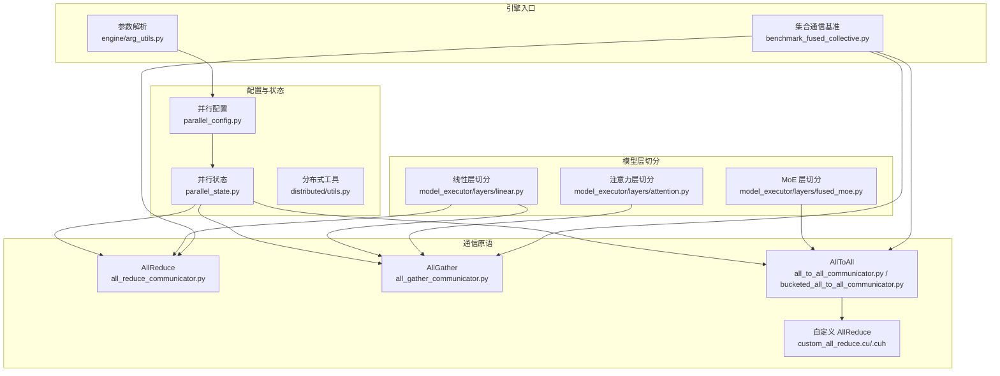
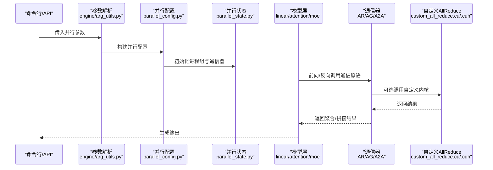
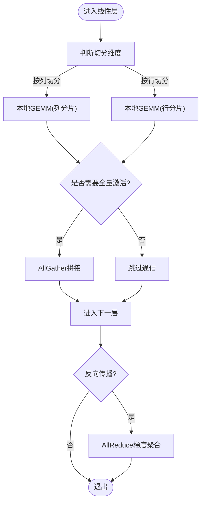
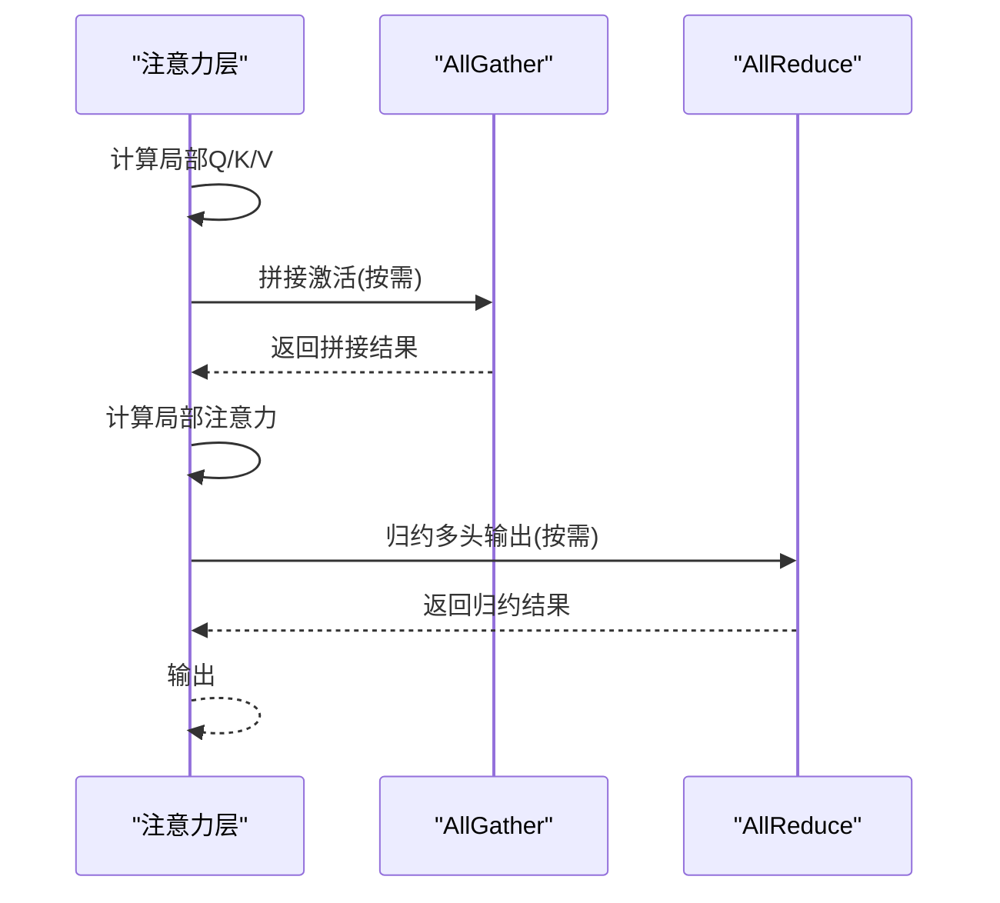
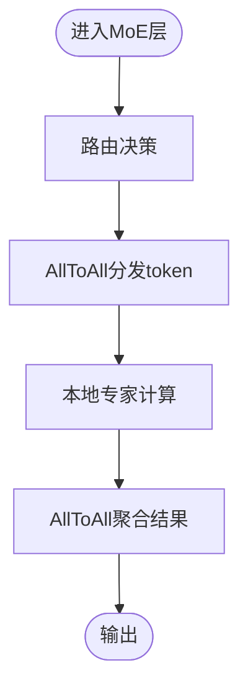
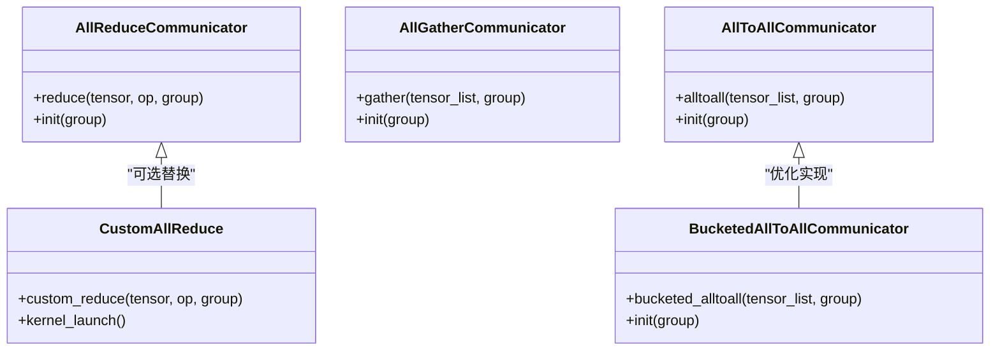
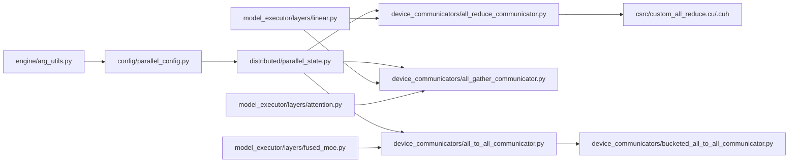

# 张量并行

<cite>
**本文引用的文件**   
- [vllm/config/parallel_config.py](file://vllm/config/parallel_config.py)
- [vllm/distributed/parallel_state.py](file://vllm/distributed/parallel_state.py)
- [vllm/model_executor/layers/linear.py](file://vllm/model_executor/layers/linear.py)
- [vllm/model_executor/layers/attention.py](file://vllm/model_executor/layers/attention.py)
- [vllm/model_executor/layers/fused_moe.py](file://vllm/model_executor/layers/fused_moe.py)
- [csrc/custom_all_reduce.cu](file://csrc/custom_all_reduce.cu)
- [csrc/custom_all_reduce.cuh](file://csrc/custom_all_reduce.cuh)
- [vllm/distributed/device_communicators/all_to_all_communicator.py](file://vllm/distributed/device_communicators/all_to_all_communicator.py)
- [vllm/distributed/device_communicators/all_gather_communicator.py](file://vllm/distributed/device_communicators/all_gather_communicator.py)
- [vllm/distributed/device_communicators/all_reduce_communicator.py](file://vllm/distributed/device_communicators/all_reduce_communicator.py)
- [vllm/distributed/device_communicators/bucketed_all_to_all_communicator.py](file://vllm/distributed/device_communicators/bucketed_all_to_all_communicator.py)
- [vllm/distributed/utils.py](file://vllm/distributed/utils.py)
- [vllm/engine/arg_utils.py](file://vllm/engine/arg_utils.py)
- [benchmarks/benchmark_fused_collective.py](file://benchmarks/benchmark_fused_collective.py)
</cite>

## 目录
1. [简介](#简介)
2. [项目结构](#项目结构)
3. [核心组件](#核心组件)
4. [架构总览](#架构总览)
5. [详细组件分析](#详细组件分析)
6. [依赖关系分析](#依赖关系分析)
7. [性能考虑](#性能考虑)
8. [故障排查指南](#故障排查指南)
9. [结论](#结论)
10. [附录](#附录)

## 简介
本文件系统性阐述 vLLM 中张量并行的实现原理与配置方法，重点覆盖：
- 模型层在多个 GPU 上的水平分割策略（注意力层、线性层、MoE 层）
- 通信开销与优化技术（AllReduce、AllGather、AllToAll、分桶与融合）
- 梯度同步机制与通信后端选择
- 不同规模模型的张量并行配置示例（2 卡到多卡集群）
- 性能调优参数（分片大小、通信后端、内存优化技巧）
- 与其他并行策略的组合使用（数据并行、流水线并行、专家并行等）

## 项目结构
围绕张量并行的关键代码分布在以下模块：
- 配置与状态管理：并行配置、分布式进程组与通信器初始化
- 模型层切分：线性层、注意力层、MoE 层的权重与激活切分
- 通信原语：AllReduce/AllGather/AllToAll 的封装与优化
- 引擎入口：命令行与 API 中的并行参数解析与校验

图表来源
- [vllm/config/parallel_config.py](file://vllm/config/parallel_config.py)
- [vllm/distributed/parallel_state.py](file://vllm/distributed/parallel_state.py)
- [vllm/model_executor/layers/linear.py](file://vllm/model_executor/layers/linear.py)
- [vllm/model_executor/layers/attention.py](file://vllm/model_executor/layers/attention.py)
- [vllm/model_executor/layers/fused_moe.py](file://vllm/model_executor/layers/fused_moe.py)
- [vllm/distributed/device_communicators/all_reduce_communicator.py](file://vllm/distributed/device_communicators/all_reduce_communicator.py)
- [vllm/distributed/device_communicators/all_gather_communicator.py](file://vllm/distributed/device_communicators/all_gather_communicator.py)
- [vllm/distributed/device_communicators/all_to_all_communicator.py](file://vllm/distributed/device_communicators/all_to_all_communicator.py)
- [vllm/distributed/device_communicators/bucketed_all_to_all_communicator.py](file://vllm/distributed/device_communicators/bucketed_all_to_all_communicator.py)
- [csrc/custom_all_reduce.cu](file://csrc/custom_all_reduce.cu)
- [csrc/custom_all_reduce.cuh](file://csrc/custom_all_reduce.cuh)
- [vllm/engine/arg_utils.py](file://vllm/engine/arg_utils.py)
- [benchmarks/benchmark_fused_collective.py](file://benchmarks/benchmark_fused_collective.py)

章节来源
- [vllm/config/parallel_config.py](file://vllm/config/parallel_config.py)
- [vllm/distributed/parallel_state.py](file://vllm/distributed/parallel_state.py)
- [vllm/model_executor/layers/linear.py](file://vllm/model_executor/layers/linear.py)
- [vllm/model_executor/layers/attention.py](file://vllm/model_executor/layers/attention.py)
- [vllm/model_executor/layers/fused_moe.py](file://vllm/model_executor/layers/fused_moe.py)
- [vllm/distributed/device_communicators/all_reduce_communicator.py](file://vllm/distributed/device_communicators/all_reduce_communicator.py)
- [vllm/distributed/device_communicators/all_gather_communicator.py](file://vllm/distributed/device_communicators/all_gather_communicator.py)
- [vllm/distributed/device_communicators/all_to_all_communicator.py](file://vllm/distributed/device_communicators/all_to_all_communicator.py)
- [vllm/distributed/device_communicators/bucketed_all_to_all_communicator.py](file://vllm/distributed/device_communicators/bucketed_all_to_all_communicator.py)
- [csrc/custom_all_reduce.cu](file://csrc/custom_all_reduce.cu)
- [csrc/custom_all_reduce.cuh](file://csrc/custom_all_reduce.cuh)
- [vllm/engine/arg_utils.py](file://vllm/engine/arg_utils.py)
- [benchmarks/benchmark_fused_collective.py](file://benchmarks/benchmark_fused_collective.py)

## 核心组件
- 并行配置与状态
  - 并行配置对象负责解析用户输入的张量并行度、是否启用梯度同步、通信后端选择等。
  - 并行状态维护进程组、通信器实例以及当前 rank/world_size 信息，供各层查询与调用。
- 模型层切分
  - 线性层：按列或行对权重矩阵进行分片，前向时局部计算，反向时通过 AllReduce 聚合梯度。
  - 注意力层：Q/K/V 投影与输出投影按特征维度切分，KV Cache 可跨设备广播或分区存储。
  - MoE 层：专家权重按专家维度切分，路由阶段使用 AllToAll 将 token 分发至对应专家，再聚合结果。
- 通信原语
  - AllReduce：用于梯度同步与某些激活归约，支持自定义内核加速。
  - AllGather：用于拼接分片权重或激活以完成后续操作。
  - AllToAll：用于 MoE 路由与重排，支持分桶以减少小消息开销。
- 引擎入口
  - 参数解析模块将命令行/API 参数映射为并行配置，并进行一致性检查与默认值填充。

章节来源
- [vllm/config/parallel_config.py](file://vllm/config/parallel_config.py)
- [vllm/distributed/parallel_state.py](file://vllm/distributed/parallel_state.py)
- [vllm/model_executor/layers/linear.py](file://vllm/model_executor/layers/linear.py)
- [vllm/model_executor/layers/attention.py](file://vllm/model_executor/layers/attention.py)
- [vllm/model_executor/layers/fused_moe.py](file://vllm/model_executor/layers/fused_moe.py)
- [vllm/distributed/device_communicators/all_reduce_communicator.py](file://vllm/distributed/device_communicators/all_reduce_communicator.py)
- [vllm/distributed/device_communicators/all_gather_communicator.py](file://vllm/distributed/device_communicators/all_gather_communicator.py)
- [vllm/distributed/device_communicators/all_to_all_communicator.py](file://vllm/distributed/device_communicator.py)
- [vllm/distributed/device_communicators/bucketed_all_to_all_communicator.py](file://vllm/distributed/device_communicators/bucketed_all_to_all_communicator.py)
- [vllm/engine/arg_utils.py](file://vllm/engine/arg_utils.py)

## 架构总览
下图展示从引擎参数解析到模型层执行与通信的端到端流程。

图表来源
- [vllm/engine/arg_utils.py](file://vllm/engine/arg_utils.py)
- [vllm/config/parallel_config.py](file://vllm/config/parallel_config.py)
- [vllm/distributed/parallel_state.py](file://vllm/distributed/parallel_state.py)
- [vllm/model_executor/layers/linear.py](file://vllm/model_executor/layers/linear.py)
- [vllm/model_executor/layers/attention.py](file://vllm/model_executor/layers/attention.py)
- [vllm/model_executor/layers/fused_moe.py](file://vllm/model_executor/layers/fused_moe.py)
- [vllm/distributed/device_communicators/all_reduce_communicator.py](file://vllm/distributed/device_communicators/all_reduce_communicator.py)
- [vllm/distributed/device_communicators/all_gather_communicator.py](file://vllm/distributed/device_communicators/all_gather_communicator.py)
- [vllm/distributed/device_communicators/all_to_all_communicator.py](file://vllm/distributed/device_communicators/all_to_all_communicator.py)
- [csrc/custom_all_reduce.cu](file://csrc/custom_all_reduce.cu)
- [csrc/custom_all_reduce.cuh](file://csrc/custom_all_reduce.cuh)

## 详细组件分析

### 线性层张量并行
- 切分策略
  - 权重矩阵按列或行切分，使每个 rank 持有部分权重与激活。
  - 前向：本地 GEMM 计算；如需全量激活则 AllGather 拼接。
  - 反向：梯度按相同维度切分，使用 AllReduce 聚合。
- 通信模式
  - AllGather：用于拼接激活或权重。
  - AllReduce：用于梯度求和。
- 优化点
  - 融合通信与算子以减少 kernel 启动开销。
  - 调整分片粒度匹配硬件带宽。

图表来源
- [vllm/model_executor/layers/linear.py](file://vllm/model_executor/layers/linear.py)
- [vllm/distributed/device_communicators/all_gather_communicator.py](file://vllm/distributed/device_communicators/all_gather_communicator.py)
- [vllm/distributed/device_communicators/all_reduce_communicator.py](file://vllm/distributed/device_communicators/all_reduce_communicator.py)

章节来源
- [vllm/model_executor/layers/linear.py](file://vllm/model_executor/layers/linear.py)
- [vllm/distributed/device_communicators/all_gather_communicator.py](file://vllm/distributed/device_communicators/all_gather_communicator.py)
- [vllm/distributed/device_communicators/all_reduce_communicator.py](file://vllm/distributed/device_communicators/all_reduce_communicator.py)

### 注意力层张量并行
- 切分策略
  - Q/K/V 投影与输出投影按特征维度切分，每个 rank 计算局部注意力。
  - KV Cache 可选择分区存储或广播，避免重复通信。
- 通信模式
  - AllGather：拼接 Q/K/V 或输出激活。
  - AllReduce：在某些变体中用于多头注意力的归约。
- 优化点
  - 结合 FlashAttention 等高效内核减少显存访问。
  - 合理设置序列长度与头数，平衡计算与通信。

图表来源
- [vllm/model_executor/layers/attention.py](file://vllm/model_executor/layers/attention.py)
- [vllm/distributed/device_communicators/all_gather_communicator.py](file://vllm/distributed/device_communicators/all_gather_communicator.py)
- [vllm/distributed/device_communicators/all_reduce_communicator.py](file://vllm/distributed/device_communicators/all_reduce_communicator.py)

章节来源
- [vllm/model_executor/layers/attention.py](file://vllm/model_executor/layers/attention.py)
- [vllm/distributed/device_communicators/all_gather_communicator.py](file://vllm/distributed/device_communicators/all_gather_communicator.py)
- [vllm/distributed/device_communicators/all_reduce_communicator.py](file://vllm/distributed/device_communicators/all_reduce_communicator.py)

### MoE 层张量并行
- 切分策略
  - 专家权重按专家维度切分，每个 rank 持有部分专家。
  - 路由阶段使用 AllToAll 将 token 分发到对应专家，计算后再聚合。
- 通信模式
  - AllToAll：token 路由与结果聚合。
  - 分桶 AllToAll：合并小消息以降低开销。
- 优化点
  - 路由稀疏性利用，减少不必要通信。
  - 融合路由与 GEMM 提升吞吐。

图表来源
- [vllm/model_executor/layers/fused_moe.py](file://vllm/model_executor/layers/fused_moe.py)
- [vllm/distributed/device_communicators/all_to_all_communicator.py](file://vllm/distributed/device_communicators/all_to_all_communicator.py)
- [vllm/distributed/device_communicators/bucketed_all_to_all_communicator.py](file://vllm/distributed/device_communicators/bucketed_all_to_all_communicator.py)

章节来源
- [vllm/model_executor/layers/fused_moe.py](file://vllm/model_executor/layers/fused_moe.py)
- [vllm/distributed/device_communicators/all_to_all_communicator.py](file://vllm/distributed/device_communicators/all_to_all_communicator.py)
- [vllm/distributed/device_communicators/bucketed_all_to_all_communicator.py](file://vllm/distributed/device_communicators/bucketed_all_to_all_communicator.py)

### 通信原语与自定义内核
- AllReduce
  - 标准 AllReduce 用于梯度同步与激活归约。
  - 自定义内核（NCCL替代或增强）可降低延迟、提高带宽利用率。
- AllGather/AllToAll
  - AllGather 用于拼接分片张量。
  - AllToAll 用于 MoE 路由与重排，分桶策略提升小消息效率。
- 后端选择
  - 根据硬件与网络拓扑选择 NCCL、自定义 AllReduce 或其他后端。

图表来源
- [vllm/distributed/device_communicators/all_reduce_communicator.py](file://vllm/distributed/device_communicators/all_reduce_communicator.py)
- [vllm/distributed/device_communicators/all_gather_communicator.py](file://vllm/distributed/device_communicators/all_gather_communicator.py)
- [vllm/distributed/device_communicators/all_to_all_communicator.py](file://vllm/distributed/device_communicators/all_to_all_communicator.py)
- [vllm/distributed/device_communicators/bucketed_all_to_all_communicator.py](file://vllm/distributed/device_communicators/bucketed_all_to_all_communicator.py)
- [csrc/custom_all_reduce.cu](file://csrc/custom_all_reduce.cu)
- [csrc/custom_all_reduce.cuh](file://csrc/custom_all_reduce.cuh)

章节来源
- [vllm/distributed/device_communicators/all_reduce_communicator.py](file://vllm/distributed/device_communicators/all_reduce_communicator.py)
- [vllm/distributed/device_communicators/all_gather_communicator.py](file://vllm/distributed/device_communicators/all_gather_communicator.py)
- [vllm/distributed/device_communicators/all_to_all_communicator.py](file://vllm/distributed/device_communicators/all_to_all_communicator.py)
- [vllm/distributed/device_communicators/bucketed_all_to_all_communicator.py](file://vllm/distributed/device_communicators/bucketed_all_to_all_communicator.py)
- [csrc/custom_all_reduce.cu](file://csrc/custom_all_reduce.cu)
- [csrc/custom_all_reduce.cuh](file://csrc/custom_all_reduce.cuh)

## 依赖关系分析
- 配置到状态
  - 并行配置对象被并行状态初始化时使用，创建进程组与通信器。
- 层到通信器
  - 线性/注意力/MoE 层依赖对应的通信器进行前向/反向通信。
- 通信器到内核
  - AllReduce 可能调用自定义内核以提升性能。
- 引擎到配置
  - 引擎参数解析模块将用户输入转换为并行配置。

图表来源
- [vllm/engine/arg_utils.py](file://vllm/engine/arg_utils.py)
- [vllm/config/parallel_config.py](file://vllm/config/parallel_config.py)
- [vllm/distributed/parallel_state.py](file://vllm/distributed/parallel_state.py)
- [vllm/distributed/device_communicators/all_reduce_communicator.py](file://vllm/distributed/device_communicators/all_reduce_communicator.py)
- [vllm/distributed/device_communicators/all_gather_communicator.py](file://vllm/distributed/device_communicators/all_gather_communicator.py)
- [vllm/distributed/device_communicators/all_to_all_communicator.py](file://vllm/distributed/device_communicators/all_to_all_communicator.py)
- [vllm/distributed/device_communicators/bucketed_all_to_all_communicator.py](file://vllm/distributed/device_communicators/bucketed_all_to_all_communicator.py)
- [csrc/custom_all_reduce.cu](file://csrc/custom_all_reduce.cu)
- [csrc/custom_all_reduce.cuh](file://csrc/custom_all_reduce.cuh)
- [vllm/model_executor/layers/linear.py](file://vllm/model_executor/layers/linear.py)
- [vllm/model_executor/layers/attention.py](file://vllm/model_executor/layers/attention.py)
- [vllm/model_executor/layers/fused_moe.py](file://vllm/model_executor/layers/fused_moe.py)

章节来源
- [vllm/engine/arg_utils.py](file://vllm/engine/arg_utils.py)
- [vllm/config/parallel_config.py](file://vllm/config/parallel_config.py)
- [vllm/distributed/parallel_state.py](file://vllm/distributed/parallel_state.py)
- [vllm/distributed/device_communicators/all_reduce_communicator.py](file://vllm/distributed/device_communicators/all_reduce_communicator.py)
- [vllm/distributed/device_communicators/all_gather_communicator.py](file://vllm/distributed/device_communicators/all_gather_communicator.py)
- [vllm/distributed/device_communicators/all_to_all_communicator.py](file://vllm/distributed/device_communicators/all_to_all_communicator.py)
- [vllm/distributed/device_communicators/bucketed_all_to_all_communicator.py](file://vllm/distributed/device_communicators/bucketed_all_to_all_communicator.py)
- [csrc/custom_all_reduce.cu](file://csrc/custom_all_reduce.cu)
- [csrc/custom_all_reduce.cuh](file://csrc/custom_all_reduce.cuh)
- [vllm/model_executor/layers/linear.py](file://vllm/model_executor/layers/linear.py)
- [vllm/model_executor/layers/attention.py](file://vllm/model_executor/layers/attention.py)
- [vllm/model_executor/layers/fused_moe.py](file://vllm/model_executor/layers/fused_moe.py)

## 性能考虑
- 通信开销与优化
  - AllReduce：优先使用高带宽后端（如 NCCL），必要时启用自定义内核。
  - AllGather/AllToAll：增大分片大小、使用分桶 AllToAll 减少小消息开销。
  - 融合算子：将通信与计算融合，降低 kernel 启动与内存拷贝成本。
- 内存优化
  - 合理设置分片大小，避免显存碎片。
  - 复用缓冲区，减少频繁分配。
  - 选择性广播/分区存储 KV Cache，降低冗余传输。
- 后端选择
  - 根据拓扑选择最优通信后端，必要时切换自定义 AllReduce。
- 基准测试
  - 使用集合通信基准脚本评估不同参数下的吞吐与延迟。

章节来源
- [benchmarks/benchmark_fused_collective.py](file://benchmarks/benchmark_fused_collective.py)
- [vllm/distributed/device_communicators/all_reduce_communicator.py](file://vllm/distributed/device_communicators/all_reduce_communicator.py)
- [vllm/distributed/device_communicators/all_gather_communicator.py](file://vllm/distributed/device_communicators/all_gather_communicator.py)
- [vllm/distributed/device_communicators/all_to_all_communicator.py](file://vllm/distributed/device_communicators/all_to_all_communicator.py)
- [vllm/distributed/device_communicators/bucketed_all_to_all_communicator.py](file://vllm/distributed/device_communicators/bucketed_all_to_all_communicator.py)
- [csrc/custom_all_reduce.cu](file://csrc/custom_all_reduce.cu)

## 故障排查指南
- 常见问题
  - 进程组初始化失败：检查 rank/world_size 与后端环境变量。
  - 通信超时：调整超时阈值，检查网络拓扑与带宽。
  - 显存不足：减小分片大小或批大小，启用内存复用。
  - MoE 路由异常：检查路由稀疏性与分桶参数。
- 调试建议
  - 启用日志与指标收集，定位瓶颈。
  - 使用基准脚本验证通信后端性能。
  - 逐步简化并行配置，隔离问题来源。

章节来源
- [vllm/distributed/utils.py](file://vllm/distributed/utils.py)
- [vllm/distributed/parallel_state.py](file://vllm/distributed/parallel_state.py)
- [benchmarks/benchmark_fused_collective.py](file://benchmarks/benchmark_fused_collective.py)

## 结论
vLLM 的张量并行通过灵活的层切分与高效的通信原语，实现了在大模型推理与训练中的可扩展性。合理配置并行度、选择合适的通信后端与优化参数，可在不同规模的硬件上获得稳定且高性能的表现。结合其他并行策略（数据并行、流水线并行、专家并行），可进一步扩展系统能力。

## 附录
- 配置示例（概念性说明）
  - 2 卡部署：设置张量并行度为 2，启用必要的梯度同步，选择 NCCL 后端。
  - 4 卡及以上：根据拓扑调整通信分组，启用分桶 AllToAll，优化 KV Cache 存储策略。
  - 多节点集群：确保进程间通信正确配置，必要时使用自定义 AllReduce 提升跨节点性能。
- 组合并行
  - 数据并行 + 张量并行：复制模型副本并在副本间同步梯度。
  - 流水线并行 + 张量并行：在层间划分流水，层内再进行张量切分。
  - 专家并行 + 张量并行：专家维度与特征维度共同切分，最大化资源利用率。