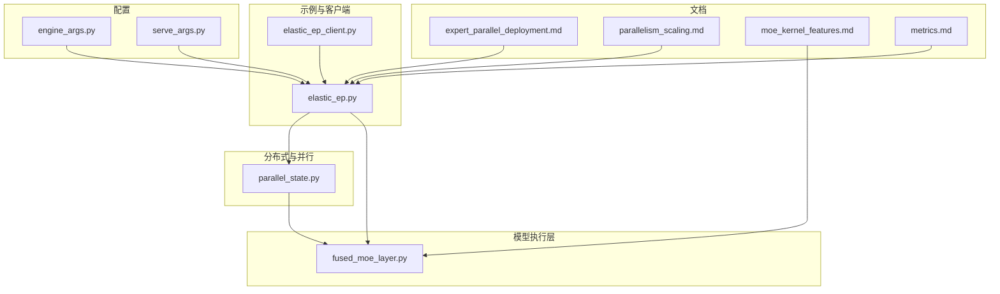
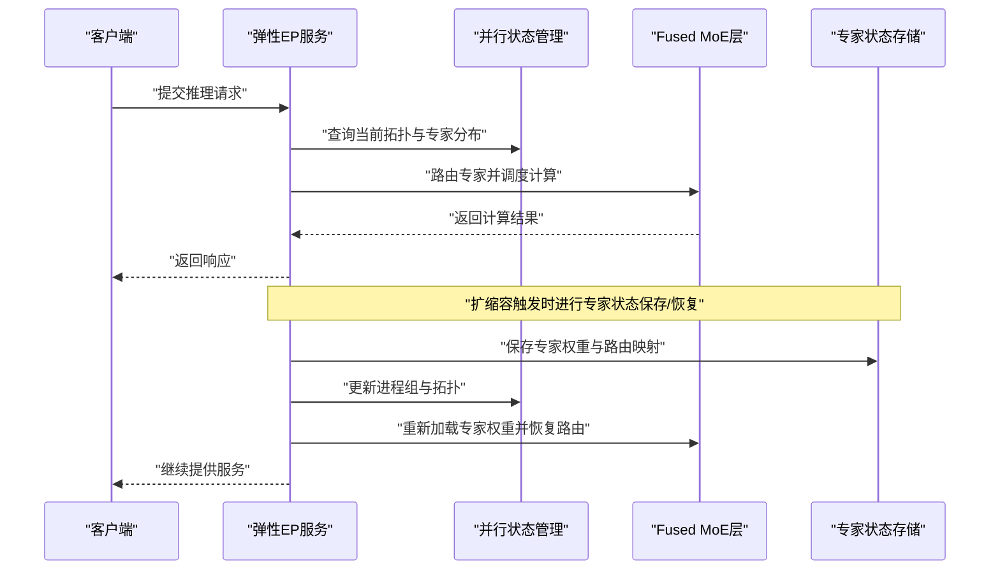
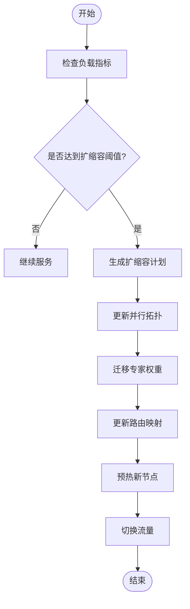
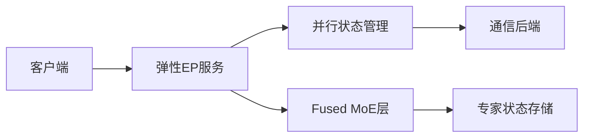

# 弹性扩缩容

<cite>
**本文引用的文件**   
- [vllm/ray_serving/elastic_ep/README.md](file://examples/ray_serving/elastic_ep/README.md)
- [vllm/ray_serving/elastic_ep/elastic_ep.py](file://examples/ray_serving/elastic_ep/elastic_ep.py)
- [vllm/ray_serving/elastic_ep/elastic_ep_client.py](file://examples/ray_serving/elastic_ep/elastic_ep_client.py)
- [tests/distributed/test_elastic_ep.py](file://tests/distributed/test_elastic_ep.py)
- [tests/distributed/test_eplb_algo.py](file://tests/distributed/test_eplb_algo.py)
- [tests/distributed/test_eplb_execute.py](file://tests/distributed/test_eplb_execute.py)
- [tests/distributed/test_eplb_fused_moe_layer.py](file://tests/distributed/test_eplb_fused_moe_layer.py)
- [tests/distributed/test_eplb_spec_decode.py](file://tests/distributed/test_eplb_spec_decode.py)
- [tests/distributed/test_eplb_utils.py](file://tests/distributed/test_eplb_utils.py)
- [tests/distributed/test_expert_parallel.py](file://tests/distributed/test_expert_parallel.py)
- [tests/distributed/test_expert_placement.py](file://tests/distributed/test_expert_placement.py)
- [vllm/config/engine_args.py](file://vllm/config/engine_args.py)
- [vllm/config/serve_args.py](file://vllm/config/serve_args.py)
- [vllm/distributed/parallel_state.py](file://vllm/distributed/parallel_state.py)
- [vllm/model_executor/layers/fused_moe/fused_moe_layer.py](file://vllm/model_executor/layers/fused_moe/fused_moe_layer.py)
- [docs/serving/expert_parallel_deployment.md](file://docs/serving/expert_parallel_deployment.md)
- [docs/serving/parallelism_scaling.md](file://docs/serving/parallelism_scaling.md)
- [docs/design/moe_kernel_features.md](file://docs/design/moe_kernel_features.md)
- [docs/design/multiprocessing.md](file://docs/design/multiprocessing.md)
- [docs/usage/metrics.md](file://docs/usage/metrics.md)
</cite>

## 目录
1. [简介](#简介)
2. [项目结构](#项目结构)
3. [核心组件](#核心组件)
4. [架构总览](#架构总览)
5. [详细组件分析](#详细组件分析)
6. [依赖关系分析](#依赖关系分析)
7. [性能考量与优化](#性能考量与优化)
8. [监控指标与告警配置](#监控指标与告警配置)
9. [故障处理与恢复最佳实践](#故障处理与恢复最佳实践)
10. [结论](#结论)

## 简介
本文件系统性阐述 vLLM 的弹性扩缩容能力与实现机制，重点覆盖：
- 动态添加/移除工作节点的状态迁移、负载均衡与服务连续性保证
- 弹性专家并行（Elastic EP）的工作原理与专家状态保存/恢复
- 自动扩缩容的配置策略（基于负载指标的规则与阈值）
- 扩缩容过程中的性能影响与优化策略
- 扩缩容监控指标与告警配置
- 扩缩容故障处理与恢复的最佳实践

## 项目结构
围绕弹性扩缩容与弹性专家并行的关键代码与文档分布如下：
- 示例与客户端：examples/ray_serving/elastic_ep 提供弹性 EP 的使用示例与客户端交互
- 分布式测试：tests/distributed 下包含大量针对 EP、EPLB（专家并行负载均衡）、Fused MoE 层、Speculative Decoding 的端到端与单元测试
- 配置与参数：vllm/config 下的 engine_args.py、serve_args.py 等定义推理引擎与服务的可配置项
- 分布式与并行：vllm/distributed/parallel_state.py 管理进程组与并行拓扑
- 模型执行层：vllm/model_executor/layers/fused_moe/fused_moe_layer.py 实现 Fused MoE 层，支撑专家路由与计算
- 文档：docs/serving/expert_parallel_deployment.md、docs/serving/parallelism_scaling.md、docs/design/moe_kernel_features.md、docs/usage/metrics.md 等提供部署与特性说明

图表来源
- [examples/ray_serving/elastic_ep/elastic_ep.py](file://examples/ray_serving/elastic_ep/elastic_ep.py)
- [examples/ray_serving/elastic_ep/elastic_ep_client.py](file://examples/ray_serving/elastic_ep/elastic_ep_client.py)
- [vllm/distributed/parallel_state.py](file://vllm/distributed/parallel_state.py)
- [vllm/model_executor/layers/fused_moe/fused_moe_layer.py](file://vllm/model_executor/layers/fused_moe/fused_moe_layer.py)
- [vllm/config/engine_args.py](file://vllm/config/engine_args.py)
- [vllm/config/serve_args.py](file://vllm/config/serve_args.py)
- [docs/serving/expert_parallel_deployment.md](file://docs/serving/expert_parallel_deployment.md)
- [docs/serving/parallelism_scaling.md](file://docs/serving/parallelism_scaling.md)
- [docs/design/moe_kernel_features.md](file://docs/design/moe_kernel_features.md)
- [docs/usage/metrics.md](file://docs/usage/metrics.md)

章节来源
- [docs/serving/expert_parallel_deployment.md](file://docs/serving/expert_parallel_deployment.md)
- [docs/serving/parallelism_scaling.md](file://docs/serving/parallelism_scaling.md)
- [docs/design/moe_kernel_features.md](file://docs/design/moe_kernel_features.md)

## 核心组件
- 弹性 EP 服务与客户端
  - elastic_ep.py：启动与管理弹性 EP 服务，协调节点加入/退出、专家分配与负载均衡
  - elastic_ep_client.py：客户端调用接口，提交请求并观察扩缩容效果
- 分布式并行状态管理
  - parallel_state.py：维护进程组、设备拓扑与通信原语，支撑扩缩容时的拓扑重建
- Fused MoE 层
  - fused_moe_layer.py：实现专家路由、Top-K 选择、专家权重加载与计算融合，是弹性 EP 的核心执行单元
- 配置与参数
  - engine_args.py、serve_args.py：定义推理引擎与服务端的扩缩容相关参数（如并行度、专家数、路由策略等）

章节来源
- [examples/ray_serving/elastic_ep/elastic_ep.py](file://examples/ray_serving/elastic_ep/elastic_ep.py)
- [examples/ray_serving/elastic_ep/elastic_ep_client.py](file://examples/ray_serving/elastic_ep/elastic_ep_client.py)
- [vllm/distributed/parallel_state.py](file://vllm/distributed/parallel_state.py)
- [vllm/model_executor/layers/fused_moe/fused_moe_layer.py](file://vllm/model_executor/layers/fused_moe/fused_moe_layer.py)
- [vllm/config/engine_args.py](file://vllm/config/engine_args.py)
- [vllm/config/serve_args.py](file://vllm/config/serve_args.py)

## 架构总览
弹性扩缩容的整体流程由“控制面”和“数据面”组成：
- 控制面：负责扩缩容决策、拓扑更新、专家重分配、状态同步
- 数据面：Fused MoE 层在运行时根据路由结果执行专家计算，保障吞吐与延迟

图表来源
- [examples/ray_serving/elastic_ep/elastic_ep.py](file://examples/ray_serving/elastic_ep/elastic_ep.py)
- [vllm/distributed/parallel_state.py](file://vllm/distributed/parallel_state.py)
- [vllm/model_executor/layers/fused_moe/fused_moe_layer.py](file://vllm/model_executor/layers/fused_moe/fused_moe_layer.py)

## 详细组件分析

### 弹性 EP 服务与客户端
- 功能要点
  - 动态扩缩容：支持在线增加/减少工作节点，保持服务不中断
  - 专家重分配：根据新拓扑重新划分专家到不同节点，确保负载均衡
  - 状态一致性：通过持久化或共享存储完成专家权重与路由映射的保存/恢复
- 关键流程
  - 扩缩容触发：基于负载指标或外部控制器指令
  - 拓扑重建：更新进程组与设备映射
  - 专家迁移：将部分专家权重从旧节点迁移到新节点
  - 路由更新：调整 Top-K 路由策略以适配新的专家分布
  - 服务恢复：新节点就绪后，逐步切流，避免抖动

章节来源
- [examples/ray_serving/elastic_ep/elastic_ep.py](file://examples/ray_serving/elastic_ep/elastic_ep.py)
- [examples/ray_serving/elastic_ep/elastic_ep_client.py](file://examples/ray_serving/elastic_ep/elastic_ep_client.py)

### 分布式并行状态管理
- 职责
  - 维护进程组、设备拓扑、通信后端（如 NCCL）
  - 在扩缩容过程中重建拓扑，确保所有节点一致
- 关键点
  - 原子性：拓扑更新需保证所有节点同时切换，避免不一致
  - 容错：网络分区或节点失败时需回滚或重试
  - 可扩展：支持大规模节点与高带宽通信

章节来源
- [vllm/distributed/parallel_state.py](file://vllm/distributed/parallel_state.py)

### Fused MoE 层与专家路由
- 职责
  - 实现专家选择（Top-K）、权重加载、计算融合
  - 支持动态专家数量与路由策略调整
- 关键点
  - 路由稳定性：扩缩容期间避免频繁路由变化导致抖动
  - 权重对齐：新节点加载的专家权重需与全局一致
  - 性能优化：利用内核融合减少内存访问与通信开销

章节来源
- [vllm/model_executor/layers/fused_moe/fused_moe_layer.py](file://vllm/model_executor/layers/fused_moe/fused_moe_layer.py)
- [docs/design/moe_kernel_features.md](file://docs/design/moe_kernel_features.md)

### 配置与参数
- 引擎与服务参数
  - 并行度设置：张量并行、流水线并行、专家并行规模
  - 专家路由策略：Top-K、门控函数、负载均衡权重
  - 扩缩容阈值：CPU/GPU 利用率、队列长度、延迟分位数
- 建议
  - 根据模型规模与硬件资源合理设置专家数与并行度
  - 使用渐进式扩缩容避免突发流量冲击

章节来源
- [vllm/config/engine_args.py](file://vllm/config/engine_args.py)
- [vllm/config/serve_args.py](file://vllm/config/serve_args.py)
- [docs/serving/parallelism_scaling.md](file://docs/serving/parallelism_scaling.md)

## 依赖关系分析
- 组件耦合
  - 弹性 EP 服务依赖并行状态管理与 Fused MoE 层
  - 客户端通过 API 与服务交互，不直接依赖底层实现
- 外部依赖
  - 通信后端（NCCL/RDMA）用于跨节点专家权重同步
  - 存储系统用于专家权重的持久化与恢复

图表来源
- [examples/ray_serving/elastic_ep/elastic_ep.py](file://examples/ray_serving/elastic_ep/elastic_ep.py)
- [vllm/distributed/parallel_state.py](file://vllm/distributed/parallel_state.py)
- [vllm/model_executor/layers/fused_moe/fused_moe_layer.py](file://vllm/model_executor/layers/fused_moe/fused_moe_layer.py)

章节来源
- [examples/ray_serving/elastic_ep/elastic_ep.py](file://examples/ray_serving/elastic_ep/elastic_ep.py)
- [vllm/distributed/parallel_state.py](file://vllm/distributed/parallel_state.py)
- [vllm/model_executor/layers/fused_moe/fused_moe_layer.py](file://vllm/model_executor/layers/fused_moe/fused_moe_layer.py)

## 性能考量与优化
- 扩缩容期间的性能影响
  - 专家权重迁移可能引起短暂延迟峰值
  - 路由策略调整可能导致短期负载不均
- 优化策略
  - 渐进式扩缩容：逐步迁移专家与切换流量
  - 预取与缓存：提前加载常用专家权重
  - 路由平滑：使用指数移动平均平滑路由概率
  - 批处理优化：合并小批次请求，提高 GPU 利用率

章节来源
- [tests/distributed/test_eplb_execute.py](file://tests/distributed/test_eplb_execute.py)
- [tests/distributed/test_eplb_fused_moe_layer.py](file://tests/distributed/test_eplb_fused_moe_layer.py)
- [docs/design/moe_kernel_features.md](file://docs/design/moe_kernel_features.md)

## 监控指标与告警配置
- 关键指标
  - 负载指标：GPU 利用率、CPU 利用率、请求队列长度、P99 延迟
  - 扩缩容指标：扩缩容事件次数、专家迁移耗时、路由变更频率
  - 错误指标：通信失败、权重加载失败、节点失联
- 告警规则
  - 当 GPU 利用率持续高于阈值（如 85%）超过 N 分钟，触发扩容
  - 当 P99 延迟超过 SLA（如 500ms），触发紧急扩容或限流
  - 当专家迁移失败率超过阈值，触发告警并回滚

章节来源
- [docs/usage/metrics.md](file://docs/usage/metrics.md)
- [tests/distributed/test_eplb_algo.py](file://tests/distributed/test_eplb_algo.py)

## 故障处理与恢复最佳实践
- 常见故障
  - 节点网络分区：导致拓扑不一致
  - 专家权重损坏：导致推理失败
  - 路由策略异常：导致负载倾斜
- 恢复策略
  - 健康检查：定期检测节点与通信状态
  - 自动回滚：检测到不一致时回滚到上一稳定拓扑
  - 权重校验：加载前校验专家权重完整性
  - 优雅降级：在极端情况下降低并发或关闭非核心功能

章节来源
- [tests/distributed/test_elastic_ep.py](file://tests/distributed/test_elastic_ep.py)
- [tests/distributed/test_expert_parallel.py](file://tests/distributed/test_expert_parallel.py)
- [tests/distributed/test_expert_placement.py](file://tests/distributed/test_expert_placement.py)

## 结论
vLLM 的弹性扩缩容能力通过弹性 EP 服务、分布式并行状态管理与 Fused MoE 层的协同实现，支持动态节点管理、专家权重迁移与路由策略调整。结合合理的配置策略、监控告警与故障恢复机制，可在保证服务连续性的同时提升资源利用率与系统稳定性。实际部署中应根据业务负载特征与硬件条件调优参数，并建立完善的观测与应急体系。