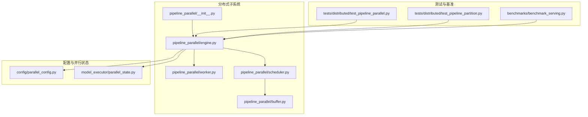
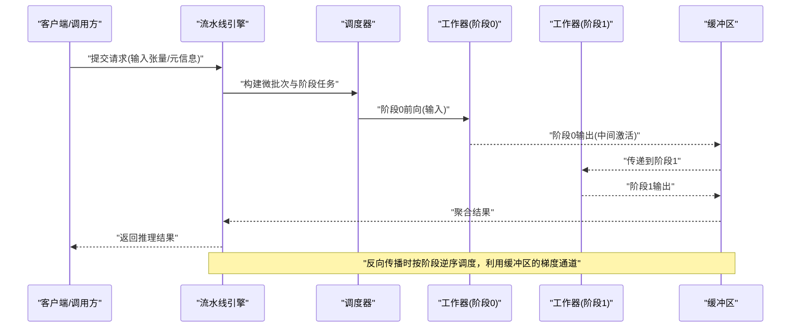
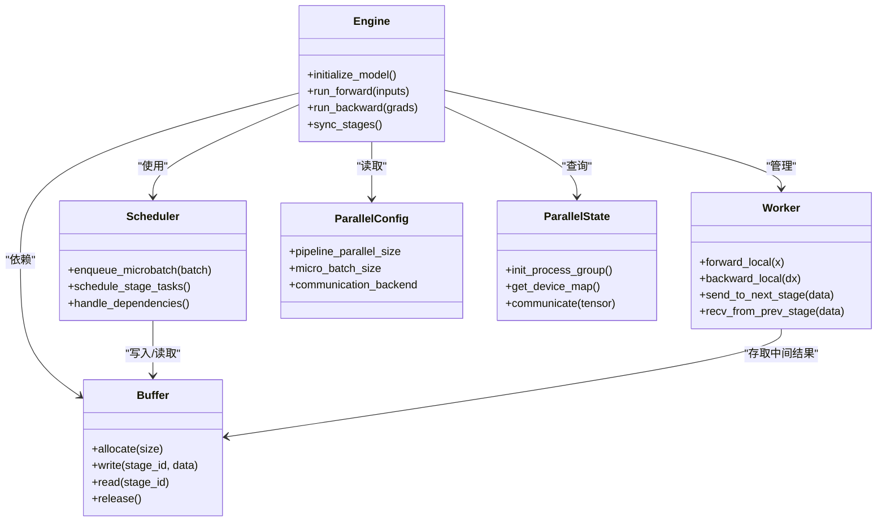

# 流水线并行

<cite>
**本文引用的文件**   
- [vllm/distributed/pipeline_parallel/__init__.py](file://vllm/distributed/pipeline_parallel/__init__.py)
- [vllm/distributed/pipeline_parallel/engine.py](file://vllm/distributed/pipeline_parallel/engine.py)
- [vllm/distributed/pipeline_parallel/worker.py](file://vllm/distributed/pipeline_parallel/worker.py)
- [vllm/distributed/pipeline_parallel/scheduler.py](file://vllm/distributed/pipeline_parallel/scheduler.py)
- [vllm/distributed/pipeline_parallel/buffer.py](file://vllm/distributed/pipeline_parallel/buffer.py)
- [vllm/config/parallel_config.py](file://vllm/config/parallel_config.py)
- [vllm/model_executor/parallel_state.py](file://vllm/model_executor/parallel_state.py)
- [tests/distributed/test_pipeline_parallel.py](file://tests/distributed/test_pipeline_parallel.py)
- [tests/distributed/test_pipeline_partition.py](file://tests/distributed/test_pipeline_partition.py)
- [benchmarks/benchmark_serving.py](file://benchmarks/benchmark_serving.py)
- [docs/design/arch_overview.md](file://docs/design/arch_overview.md)
- [docs/serving/parallelism_scaling.md](file://docs/serving/parallelism_scaling.md)
</cite>

## 目录
1. [简介](#简介)
2. [项目结构](#项目结构)
3. [核心组件](#核心组件)
4. [架构总览](#架构总览)
5. [详细组件分析](#详细组件分析)
6. [依赖关系分析](#依赖关系分析)
7. [性能考量](#性能考量)
8. [故障排查指南](#故障排查指南)
9. [结论](#结论)
10. [附录](#附录)

## 简介
本文件系统性阐述 vLLM 中“流水线并行”（Pipeline Parallelism, PP）的工作原理与配置方法，覆盖以下关键主题：
- 模型层切分与跨 GPU 分配策略
- 前向传播与反向传播的流水线调度机制
- 气泡时间优化与微批次（micro-batch）处理策略
- 不同架构模型的流水线并行配置示例（Transformer、MoE、多模态）
- 流水线并行与张量并行的组合使用及负载均衡策略
- 性能监控指标与调试工具使用方法

## 项目结构
vLLM 的流水线并行实现位于分布式子系统中，核心代码集中在 distributed/pipeline_parallel 目录，并通过配置模块与并行状态管理进行集成。测试与基准脚本用于验证行为与性能。

图表来源
- [vllm/distributed/pipeline_parallel/__init__.py](file://vllm/distributed/pipeline_parallel/__init__.py)
- [vllm/distributed/pipeline_parallel/engine.py](file://vllm/distributed/pipeline_parallel/engine.py)
- [vllm/distributed/pipeline_parallel/worker.py](file://vllm/distributed/pipeline_parallel/worker.py)
- [vllm/distributed/pipeline_parallel/scheduler.py](file://vllm/distributed/pipeline_parallel/scheduler.py)
- [vllm/distributed/pipeline_parallel/buffer.py](file://vllm/distributed/pipeline_parallel/buffer.py)
- [vllm/config/parallel_config.py](file://vllm/config/parallel_config.py)
- [vllm/model_executor/parallel_state.py](file://vllm/model_executor/parallel_state.py)
- [tests/distributed/test_pipeline_parallel.py](file://tests/distributed/test_pipeline_parallel.py)
- [tests/distributed/test_pipeline_partition.py](file://tests/distributed/test_pipeline_partition.py)
- [benchmarks/benchmark_serving.py](file://benchmarks/benchmark_serving.py)

章节来源
- [docs/design/arch_overview.md](file://docs/design/arch_overview.md)
- [docs/serving/parallelism_scaling.md](file://docs/serving/parallelism_scaling.md)

## 核心组件
- 引擎（Engine）：负责编排流水线执行、阶段划分、通信协调与生命周期管理。
- 工作器（Worker）：承载具体层的计算与本地缓存，按阶段执行前向/反向。
- 调度器（Scheduler）：组织微批次与阶段任务，控制数据在阶段间的流转顺序，减少气泡。
- 缓冲区（Buffer）：提供阶段间中间结果的暂存与复用，支持异步拷贝与融合。
- 配置（ParallelConfig）：声明式定义流水线深度、微批次大小、通信后端等参数。
- 并行状态（ParallelState）：维护进程组、设备拓扑、张量/上下文并行维度等信息。

章节来源
- [vllm/distributed/pipeline_parallel/engine.py](file://vllm/distributed/pipeline_parallel/engine.py)
- [vllm/distributed/pipeline_parallel/worker.py](file://vllm/distributed/pipeline_parallel/worker.py)
- [vllm/distributed/pipeline_parallel/scheduler.py](file://vllm/distributed/pipeline_parallel/scheduler.py)
- [vllm/distributed/pipeline_parallel/buffer.py](file://vllm/distributed/pipeline_parallel/buffer.py)
- [vllm/config/parallel_config.py](file://vllm/config/parallel_config.py)
- [vllm/model_executor/parallel_state.py](file://vllm/model_executor/parallel_state.py)

## 架构总览
流水线并行的整体架构由“引擎-调度器-工作器-缓冲区”构成，配合配置与并行状态完成跨 GPU 的层切分与数据流调度。

图表来源
- [vllm/distributed/pipeline_parallel/engine.py](file://vllm/distributed/pipeline_parallel/engine.py)
- [vllm/distributed/pipeline_parallel/scheduler.py](file://vllm/distributed/pipeline_parallel/scheduler.py)
- [vllm/distributed/pipeline_parallel/worker.py](file://vllm/distributed/pipeline_parallel/worker.py)
- [vllm/distributed/pipeline_parallel/buffer.py](file://vllm/distributed/pipeline_parallel/buffer.py)

## 详细组件分析

### 引擎（Engine）
职责：
- 解析模型图，生成阶段划分（Stage Partition）。
- 管理微批次的生命周期，协调各阶段的启动与同步。
- 处理前后向传播的调度顺序，确保依赖正确性。
- 与并行状态交互，获取进程组与设备映射。

关键点：
- 阶段划分需考虑层粒度与通信开销。
- 微批次大小影响吞吐与显存占用。
- 错误恢复与重试策略需在引擎层统一处理。

章节来源
- [vllm/distributed/pipeline_parallel/engine.py](file://vllm/distributed/pipeline_parallel/engine.py)
- [vllm/model_executor/parallel_state.py](file://vllm/model_executor/parallel_state.py)

### 工作器（Worker）
职责：
- 加载所属阶段的权重与算子。
- 执行局部前向/反向计算，读写本地缓存。
- 与缓冲区交互，发送/接收阶段间数据。

关键点：
- 工作器应最小化跨阶段通信，优先本地计算。
- 支持多种数据类型与量化格式。
- 异常隔离，避免单个工作器失败影响全局。

章节来源
- [vllm/distributed/pipeline_parallel/worker.py](file://vllm/distributed/pipeline_parallel/worker.py)

### 调度器（Scheduler）
职责：
- 将请求拆分为微批次，生成阶段任务队列。
- 控制任务入队与出队顺序，最大化流水线利用率。
- 处理动态形状与变长序列的调度约束。

关键点：
- 采用“阶段内并行+阶段间串行”的策略。
- 通过“气泡填充”技术减少空闲等待。
- 支持优先级与抢占策略以应对突发负载。

章节来源
- [vllm/distributed/pipeline_parallel/scheduler.py](file://vllm/distributed/pipeline_parallel/scheduler.py)

### 缓冲区（Buffer）
职责：
- 存储阶段间中间激活与梯度。
- 提供异步拷贝与内存池，降低延迟。
- 支持多路并发访问与引用计数管理。

关键点：
- 缓冲区大小需与微批次和激活尺寸匹配。
- 避免内存碎片与重复分配。
- 支持零拷贝或共享内存以提升性能。

章节来源
- [vllm/distributed/pipeline_parallel/buffer.py](file://vllm/distributed/pipeline_parallel/buffer.py)

### 配置（ParallelConfig）
关键参数：
- pipeline_parallel_size：流水线深度（阶段数）。
- micro_batch_size：微批次大小。
- communication_backend：通信后端（如 NCCL）。
- enable_overlap：是否启用计算与通信重叠。
- buffer_pool_size：缓冲区池大小。

章节来源
- [vllm/config/parallel_config.py](file://vllm/config/parallel_config.py)

### 并行状态（ParallelState）
职责：
- 初始化进程组、设备拓扑与并行维度。
- 暴露统一的通信接口给各组件。
- 维护运行时状态（如阶段映射、权重分布）。

章节来源
- [vllm/model_executor/parallel_state.py](file://vllm/model_executor/parallel_state.py)

## 依赖关系分析
组件间的依赖关系清晰，引擎作为协调中心，调度器与工作器解耦，缓冲区提供底层数据服务。配置与并行状态为全局基础设施。

图表来源
- [vllm/distributed/pipeline_parallel/engine.py](file://vllm/distributed/pipeline_parallel/engine.py)
- [vllm/distributed/pipeline_parallel/scheduler.py](file://vllm/distributed/pipeline_parallel/scheduler.py)
- [vllm/distributed/pipeline_parallel/worker.py](file://vllm/distributed/pipeline_parallel/worker.py)
- [vllm/distributed/pipeline_parallel/buffer.py](file://vllm/distributed/pipeline_parallel/buffer.py)
- [vllm/config/parallel_config.py](file://vllm/config/parallel_config.py)
- [vllm/model_executor/parallel_state.py](file://vllm/model_executor/parallel_state.py)

章节来源
- [tests/distributed/test_pipeline_parallel.py](file://tests/distributed/test_pipeline_parallel.py)
- [tests/distributed/test_pipeline_partition.py](file://tests/distributed/test_pipeline_partition.py)

## 性能考量
- 气泡时间优化：
  - 采用“微批次流水线”（Micro-batching Pipeline）减少阶段间空闲。
  - 通过“计算-通信重叠”隐藏传输延迟。
  - 动态调整微批次大小以平衡吞吐与延迟。
- 微批次处理策略：
  - 小批量高并发提升 GPU 利用率。
  - 大批次减少调度开销但增加显存压力。
  - 自适应微批次根据负载动态调整。
- 负载均衡：
  - 按层计算复杂度与通信量均衡分配阶段。
  - 支持热点层拆分与专家路由（MoE）优化。
- 监控指标：
  - 阶段利用率、气泡比例、端到端延迟、吞吐量。
  - 显存峰值、带宽占用、通信耗时。

章节来源
- [benchmarks/benchmark_serving.py](file://benchmarks/benchmark_serving.py)
- [docs/serving/parallelism_scaling.md](file://docs/serving/parallelism_scaling.md)

## 故障排查指南
常见问题与解决思路：
- 阶段死锁：检查调度器任务依赖与缓冲区释放逻辑。
- 显存溢出：减小微批次大小或启用梯度检查点。
- 通信超时：确认进程组初始化与网络连通性。
- 精度不一致：核对数据类型转换与量化参数。
- 性能下降：分析气泡比例与阶段负载不均。

调试工具：
- 启用详细日志记录各阶段执行时序。
- 使用性能剖析工具定位瓶颈（如 CUDA Profiler）。
- 可视化流水线执行图辅助诊断。

章节来源
- [tests/distributed/test_pipeline_parallel.py](file://tests/distributed/test_pipeline_parallel.py)
- [tests/distributed/test_pipeline_partition.py](file://tests/distributed/test_pipeline_partition.py)

## 结论
vLLM 的流水线并行通过引擎-调度器-工作器-缓冲器的协同设计，实现了高效的跨 GPU 层切分与数据流调度。结合微批次处理、气泡优化与负载均衡策略，可在 Transformer、MoE 与多模态模型上获得良好性能。合理配置与监控是发挥其潜力的关键。

## 附录

### 配置示例（概念性说明）
- Transformer 模型：
  - 设置 pipeline_parallel_size=4，将 4 层划分为 4 个阶段。
  - micro_batch_size=8，平衡吞吐与显存。
  - 启用计算-通信重叠以减少气泡。
- MoE 模型：
  - 针对专家路由层单独划分阶段，避免路由瓶颈。
  - 调整专家数量与激活稀疏度以优化负载均衡。
- 多模态模型：
  - 将视觉编码器与文本解码器分属不同阶段。
  - 注意模态间数据对齐与类型转换。

### 与张量并行的组合
- 张量并行（TP）在层内切分，流水线并行（PP）在层间切分，二者正交可叠加。
- 组合策略：
  - 先按层切分（PP），再在每层内按参数切分（TP）。
  - 通信路径：PP 使用 AllGather/ReduceScatter，TP 使用 AllReduce。
  - 负载均衡：结合 TP 的权重分布与 PP 的阶段负载进行联合优化。

### 性能监控指标
- 核心指标：
  - 阶段利用率（Stage Utilization）
  - 气泡比例（Bubble Ratio）
  - 端到端延迟（End-to-End Latency）
  - 吞吐量（Tokens/sec）
- 资源指标：
  - 显存峰值（Peak Memory）
  - 带宽占用（Bandwidth Usage）
  - 通信耗时（Comm Time）

### 调试工具使用方法
- 日志级别：
  - DEBUG：记录每个阶段的任务调度与数据流动。
  - INFO：汇总执行统计与性能摘要。
- 剖析工具：
  - 使用 CUDA Profiler 分析 GPU 内核耗时。
  - 使用内存剖析工具检测泄漏与碎片。
- 可视化：
  - 导出执行时序图，直观展示流水线状态。