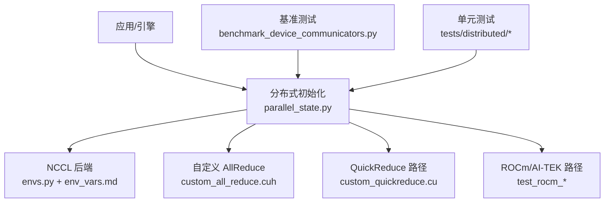
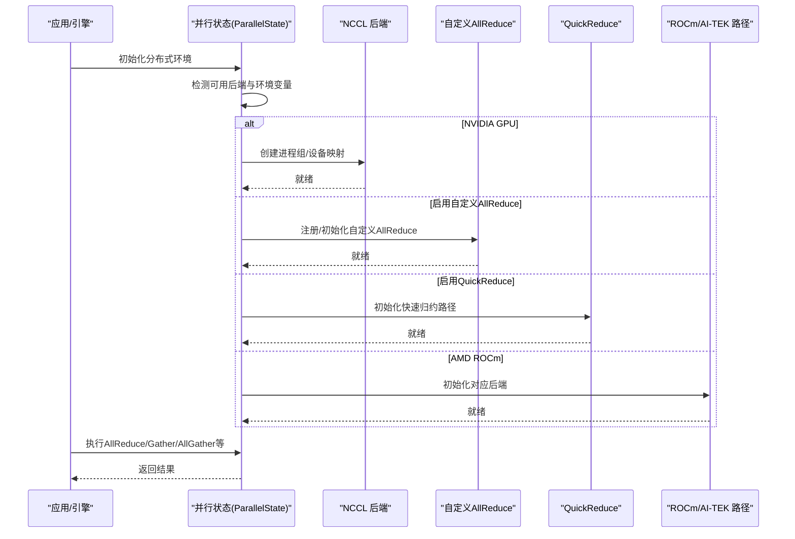
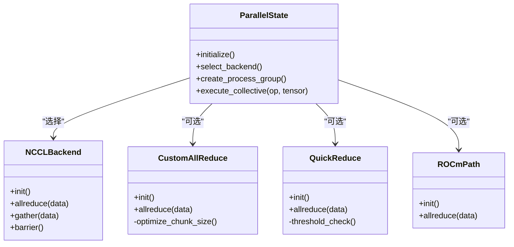

# 通信后端

<cite>
**本文引用的文件**   
- [vllm/distributed/__init__.py](file://vllm/distributed/__init__.py)
- [vllm/distributed/parallel_state.py](file://vllm/distributed/parallel_state.py)
- [vllm/distributed/utils.py](file://vllm/distributed/utils.py)
- [vllm/envs.py](file://vllm/envs.py)
- [csrc/custom_all_reduce.cuh](file://csrc/custom_all_reduce.cuh)
- [csrc/custom_quickreduce.cu](file://csrc/custom_quickreduce.cu)
- [benchmarks/kernels/benchmark_device_communicators.py](file://benchmarks/kernels/benchmark_device_communicators.py)
- [tests/distributed/test_custom_all_reduce.py](file://tests/distributed/test_custom_all_reduce.py)
- [tests/distributed/test_pynccl.py](file://tests/distributed/test_pynccl.py)
- [tests/distributed/test_quick_all_reduce.py](file://tests/distributed/test_quick_all_reduce.py)
- [tests/distributed/test_rocm_aiter_custom_ar.py](file://tests/distributed/test_rocm_aiter_custom_ar.py)
- [tests/distributed/test_rocm_quick_reduce.py](file://tests/distributed/test_rocm_quick_reduce.py)
- [tests/distributed/test_nccl_symm_mem.py](file://tests/distributed/test_nccl_symm_mem.py)
- [tests/distributed/test_torchrun_example.py](file://tests/distributed/test_torchrun_example.py)
- [docs/configuration/env_vars.md](file://docs/configuration/env_vars.md)
- [docs/serving/distributed_troubleshooting.md](file://docs/serving/distributed_troubleshooting.md)
</cite>

## 目录
1. [简介](#简介)
2. [项目结构](#项目结构)
3. [核心组件](#核心组件)
4. [架构总览](#架构总览)
5. [详细组件分析](#详细组件分析)
6. [依赖关系分析](#依赖关系分析)
7. [性能考虑](#性能考虑)
8. [故障排查指南](#故障排查指南)
9. [结论](#结论)
10. [附录](#附录)

## 简介
本文件系统性介绍 vLLM 的分布式通信后端与配置方法，重点覆盖：
- NCCL 通信库的集成与优化（GPU 间、进程间、网络）
- 自定义 AllReduce 的实现原理与性能优化技术
- 不同硬件环境下的通信后端选择指南（NVIDIA GPU、AMD ROCm 及其他加速器）
- 通信后端的基准测试方法与调优参数
- 常见通信问题的诊断与解决方案（网络延迟、带宽瓶颈、连接超时等）

## 项目结构
vLLM 的分布式通信相关代码主要分布在以下位置：
- Python 层：vllm/distributed、vllm/envs.py、docs/configuration/env_vars.md
- C++/CUDA 内核：csrc/custom_all_reduce.cuh、csrc/custom_quickreduce.cu
- 基准与测试：benchmarks/kernels/benchmark_device_communicators.py、tests/distributed/*
- 文档：docs/serving/distributed_troubleshooting.md

图表来源
- [vllm/distributed/parallel_state.py](file://vllm/distributed/parallel_state.py)
- [vllm/envs.py](file://vllm/envs.py)
- [csrc/custom_all_reduce.cuh](file://csrc/custom_all_reduce.cuh)
- [csrc/custom_quickreduce.cu](file://csrc/custom_quickreduce.cu)
- [benchmarks/kernels/benchmark_device_communicators.py](file://benchmarks/kernels/benchmark_device_communicators.py)
- [tests/distributed/test_rocm_aiter_custom_ar.py](file://tests/distributed/test_rocm_aiter_custom_ar.py)

章节来源
- [vllm/distributed/parallel_state.py](file://vllm/distributed/parallel_state.py)
- [vllm/envs.py](file://vllm/envs.py)
- [docs/configuration/env_vars.md](file://docs/configuration/env_vars.md)

## 核心组件
- 分布式状态管理：负责初始化进程组、设备拓扑发现、通信后端选择与生命周期管理。
- 通信后端抽象：统一封装 NCCL、自定义 AllReduce、QuickReduce、ROCm 路径等实现。
- 环境变量与配置：通过集中式环境变量控制后端行为、调试开关与性能参数。
- 内核与算子：C++/CUDA 实现的自定义 AllReduce、快速归约等高性能路径。
- 基准与测试：提供端到端与算子级基准，以及多平台兼容性测试。

章节来源
- [vllm/distributed/parallel_state.py](file://vllm/distributed/parallel_state.py)
- [vllm/distributed/utils.py](file://vllm/distributed/utils.py)
- [vllm/envs.py](file://vllm/envs.py)

## 架构总览
下图展示了 vLLM 在分布式场景中的通信架构与数据流：

图表来源
- [vllm/distributed/parallel_state.py](file://vllm/distributed/parallel_state.py)
- [csrc/custom_all_reduce.cuh](file://csrc/custom_all_reduce.cuh)
- [csrc/custom_quickreduce.cu](file://csrc/custom_quickreduce.cu)
- [tests/distributed/test_rocm_aiter_custom_ar.py](file://tests/distributed/test_rocm_aiter_custom_ar.py)

## 详细组件分析

### NCCL 通信后端集成与优化
- 后端选择与初始化：根据环境与设备能力自动选择 NCCL；支持进程组创建、设备到进程的映射、网络接口选择。
- GPU 间通信：利用 NVLink/NVSwitch 与 PCIe 拓扑，结合 NCCL 的拓扑感知进行最优路由。
- 进程间通信：基于 MPI/进程组，确保跨节点稳定握手与容错。
- 网络通信：支持以太网/RDMA 等，可通过环境变量调整端口、网卡、带宽限制与超时。
- 关键优化点：
  - 使用同步屏障减少多余同步开销
  - 合理设置缓冲区大小与分块策略
  - 开启内存池与零拷贝路径（如适用）
  - 针对大张量与高并发请求优化聚合粒度

章节来源
- [vllm/distributed/parallel_state.py](file://vllm/distributed/parallel_state.py)
- [vllm/envs.py](file://vllm/envs.py)
- [docs/configuration/env_vars.md](file://docs/configuration/env_vars.md)

### 自定义 AllReduce 实现原理与优化
- 设计目标：在特定硬件或拓扑下绕过通用 NCCL 路径，提供更细粒度的控制与更低延迟。
- 核心思路：
  - 将 AllReduce 分解为 Reduce-Scatter 与 All-Gather 两阶段
  - 使用共享内存/显存直连路径降低拷贝开销
  - 按张量形状与带宽自适应切分策略
- 性能优化技术：
  - 融合算子以减少内核启动次数
  - 使用异步流水线隐藏通信延迟
  - 动态调整分块大小以匹配带宽峰值
  - 避免不必要的内存分配与对齐

章节来源
- [csrc/custom_all_reduce.cuh](file://csrc/custom_all_reduce.cuh)
- [tests/distributed/test_custom_all_reduce.py](file://tests/distributed/test_custom_all_reduce.py)

### QuickReduce 快速归约路径
- 适用场景：小规模或中等规模张量的低延迟归约，适合高频小消息通信。
- 实现要点：
  - 预分配缓冲区与固定步长流水线
  - 针对常见形状进行内核特化
  - 与 NCCL 路径互补，按阈值切换
- 调优建议：
  - 根据工作负载分布选择阈值
  - 监控缓存命中率与队列深度

章节来源
- [csrc/custom_quickreduce.cu](file://csrc/custom_quickreduce.cu)
- [tests/distributed/test_quick_all_reduce.py](file://tests/distributed/test_quick_all_reduce.py)

### ROCm/AI-TEK 路径与其他加速器
- AMD ROCm：通过 AI-TEK 或 HIP 后端实现 AllReduce/Gather 等操作，适配 RDNA 架构与 ROCm 生态。
- 其他加速器：XPU/TPU 等通过相应后端插件接入，保持接口一致性。
- 注意事项：
  - 驱动版本与库依赖需严格匹配
  - 网络栈与拓扑探测可能不同于 NVIDIA
  - 某些优化路径仅在特定固件/驱动下生效

章节来源
- [tests/distributed/test_rocm_aiter_custom_ar.py](file://tests/distributed/test_rocm_aiter_custom_ar.py)
- [tests/distributed/test_rocm_quick_reduce.py](file://tests/distributed/test_rocm_quick_reduce.py)

### 通信后端选择指南（按硬件）
- NVIDIA GPU：
  - 首选 NCCL；若存在明显瓶颈可尝试自定义 AllReduce 或 QuickReduce
  - 关注 NVLink/NVSwitch 拓扑与 PCIe 带宽
- AMD ROCm：
  - 使用 AI-TEK/HIP 后端；验证 RDMA 与网卡驱动
  - 关注内核版本与库依赖一致性
- 其他加速器：
  - 优先使用官方推荐后端；必要时定制 AllReduce 路径
  - 注意内存模型与通信原语差异

章节来源
- [docs/configuration/env_vars.md](file://docs/configuration/env_vars.md)
- [tests/distributed/test_rocm_aiter_custom_ar.py](file://tests/distributed/test_rocm_aiter_custom_ar.py)

## 依赖关系分析
- 模块耦合：
  - parallel_state.py 作为入口协调各后端
  - envs.py 提供统一的环境变量访问
  - csrc 内核被 Python 层按需调用
- 外部依赖：
  - NCCL 库与 CUDA 工具链
  - ROCm/HIP 工具链（当启用 AMD 路径）
  - 网络栈（RDMA/以太网）
- 潜在循环依赖：
  - 通过分层与接口隔离避免循环引用
- 接口契约：
  - 统一的通信原语接口（AllReduce/Gather/AllGather/Barrier）
  - 错误码与异常传播规范

图表来源
- [vllm/distributed/parallel_state.py](file://vllm/distributed/parallel_state.py)
- [csrc/custom_all_reduce.cuh](file://csrc/custom_all_reduce.cuh)
- [csrc/custom_quickreduce.cu](file://csrc/custom_quickreduce.cu)
- [tests/distributed/test_rocm_aiter_custom_ar.py](file://tests/distributed/test_rocm_aiter_custom_ar.py)

章节来源
- [vllm/distributed/parallel_state.py](file://vllm/distributed/parallel_state.py)
- [vllm/distributed/utils.py](file://vllm/distributed/utils.py)

## 性能考虑
- 基准测试方法：
  - 使用 benchmark_device_communicators.py 对 AllReduce/Gather/AllGather 进行吞吐与时延测量
  - 在不同张量形状与批量大小下评估性能曲线
  - 对比 NCCL、自定义 AllReduce、QuickReduce 的路径表现
- 关键调优参数：
  - 分块大小与聚合粒度
  - 缓冲区大小与内存池策略
  - 超时与重试参数
  - 网络接口与拓扑选择
- 监控指标：
  - 通信时延分布（P50/P95/P99）
  - 带宽利用率与饱和点
  - 错误率与重传次数

章节来源
- [benchmarks/kernels/benchmark_device_communicators.py](file://benchmarks/kernels/benchmark_device_communicators.py)
- [docs/configuration/env_vars.md](file://docs/configuration/env_vars.md)

## 故障排查指南
- 常见问题与定位：
  - 网络延迟过高：检查网卡驱动、交换机配置、拓扑探测是否正确
  - 带宽瓶颈：确认是否走 PCIe 而非 NVLink；调整分块大小与聚合策略
  - 连接超时：调整超时参数，检查防火墙与端口占用
  - 进程组初始化失败：核对主机名解析、端口分配与权限
- 诊断步骤：
  - 启用详细日志与追踪
  - 运行最小复现实例（单卡/双卡）
  - 使用独立基准脚本隔离问题
- 参考文档：
  - distributed_troubleshooting.md 提供系统化排查流程

章节来源
- [docs/serving/distributed_troubleshooting.md](file://docs/serving/distributed_troubleshooting.md)
- [tests/distributed/test_torchrun_example.py](file://tests/distributed/test_torchrun_example.py)

## 结论
vLLM 的分布式通信后端以 NCCL 为主，辅以自定义 AllReduce 与 QuickReduce 等高性能路径，并兼容 ROCm 等其他加速器。通过统一的环境变量与接口抽象，用户可在不同硬件环境下灵活选择与调优。建议结合基准测试与监控指标持续优化，确保在高并发与大模型推理场景下的稳定性与性能。

## 附录
- 环境变量参考：见 docs/configuration/env_vars.md
- 示例与测试：见 tests/distributed/* 与 benchmarks/kernels/benchmark_device_communicators.py
- 故障排查：见 docs/serving/distributed_troubleshooting.md