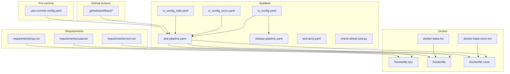
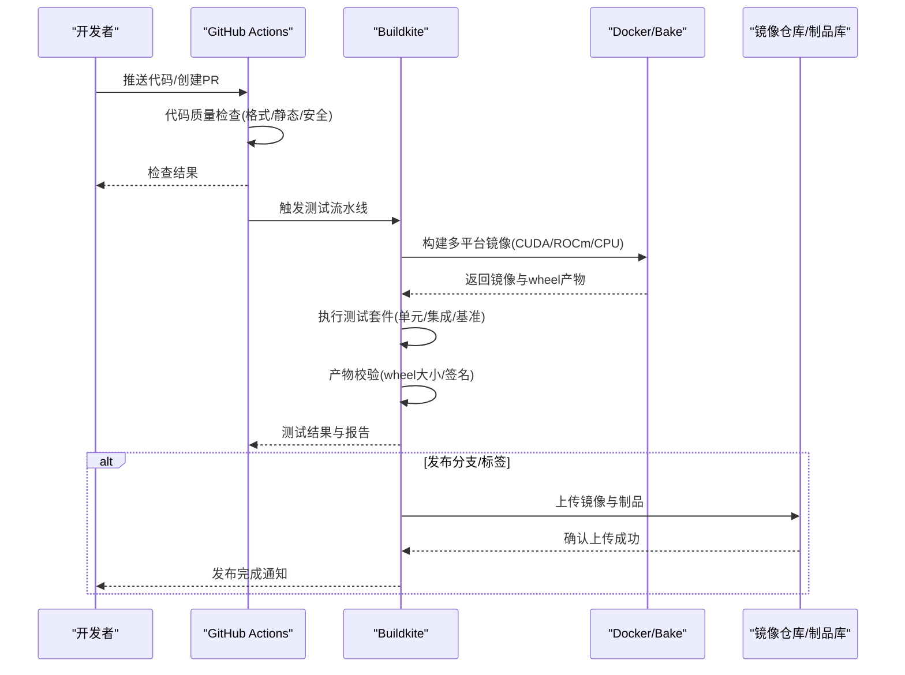
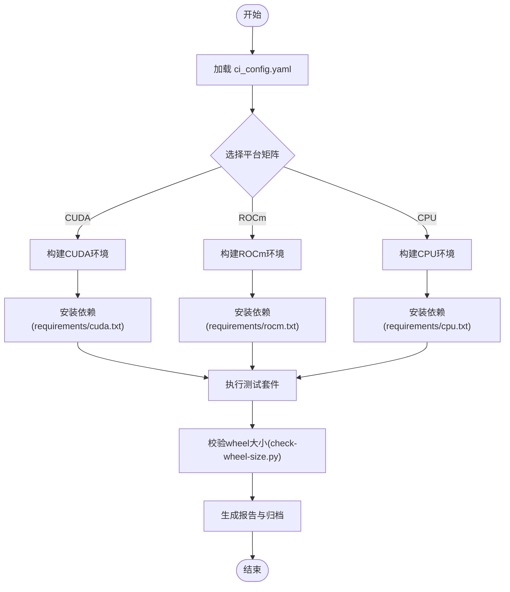
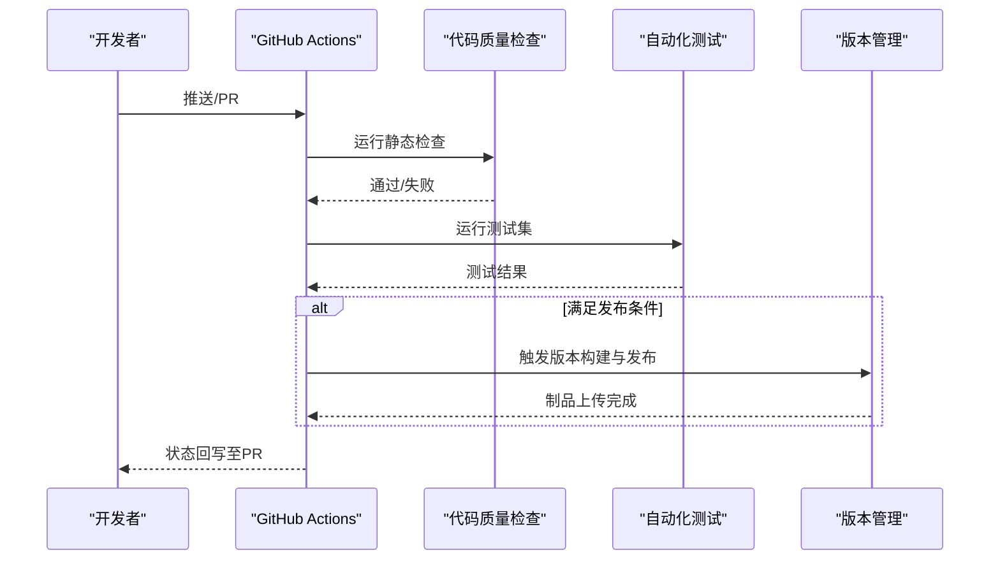
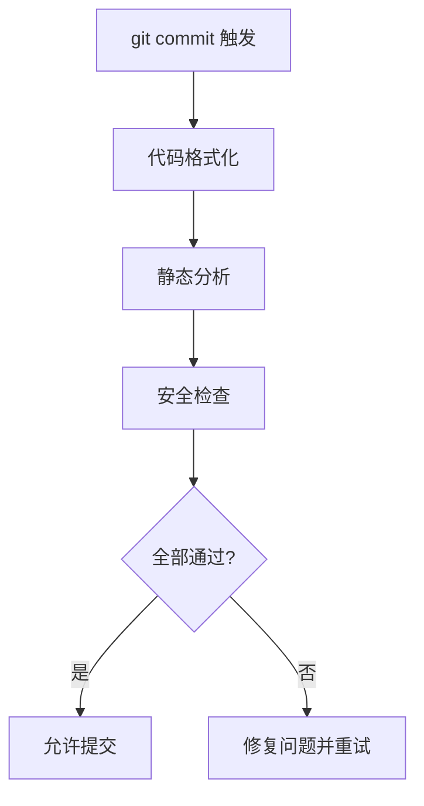
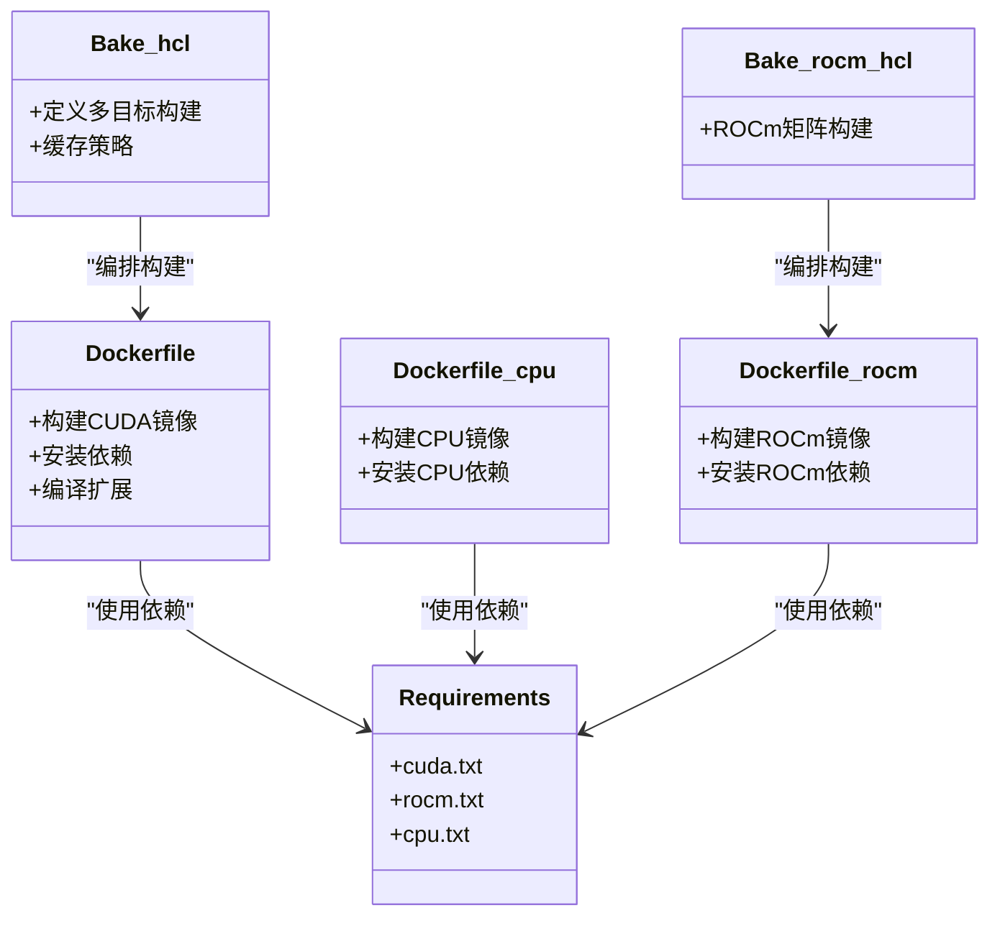
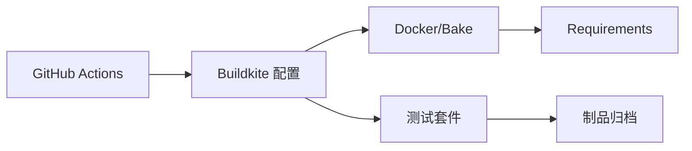

# CI/CD流水线

<cite>
**本文引用的文件**   
- [.buildkite/ci_config.yaml](file://.buildkite/ci_config.yaml)
- [.buildkite/test-pipeline.yaml](file://.buildkite/test-pipeline.yaml)
- [.buildkite/release-pipeline.yaml](file://.buildkite/release-pipeline.yaml)
- [.buildkite/ci_config_rocm.yaml](file://.buildkite/ci_config_rocm.yaml)
- [.buildkite/ci_config_intel.yaml](file://.buildkite/ci_config_intel.yaml)
- [.buildkite/test-amd.yaml](file://.buildkite/test-amd.yaml)
- [.buildkite/check-wheel-size.py](file://.buildkite/check-wheel-size.py)
- [docker/Dockerfile](file://docker/Dockerfile)
- [docker/Dockerfile.cpu](file://docker/Dockerfile.cpu)
- [docker/Dockerfile.rocm](file://docker/Dockerfile.rocm)
- [docker/docker-bake.hcl](file://docker/docker-bake.hcl)
- [docker/docker-bake-rocm.hcl](file://docker/docker-bake-rocm.hcl)
- [requirements/cuda.txt](file://requirements/cuda.txt)
- [requirements/rocm.txt](file://requirements/rocm.txt)
- [requirements/cpu.txt](file://requirements/cpu.txt)
- [.github/workflows](file://.github/workflows)
- [.pre-commit-config.yaml](file://.pre-commit-config.yaml)
</cite>

## 目录
1. [简介](#简介)
2. [项目结构](#项目结构)
3. [核心组件](#核心组件)
4. [架构总览](#架构总览)
5. [详细组件分析](#详细组件分析)
6. [依赖关系分析](#依赖关系分析)
7. [性能考量](#性能考量)
8. [故障排除指南](#故障排除指南)
9. [结论](#结论)
10. [附录](#附录)

## 简介
本文件系统性介绍 vLLM 的持续集成与持续部署（CI/CD）流水线，覆盖 Buildkite 流水线配置、GitHub Actions 工作流、预提交钩子、多平台构建（CUDA、ROCm、CPU）、自定义 CI 任务开发以及常见问题排查。目标是帮助贡献者与运维人员快速理解并高效维护 vLLM 的自动化构建、测试与发布流程。

## 项目结构
vLLM 的 CI/CD 相关资产主要分布在以下位置：
- .buildkite：Buildkite 流水线定义、作业脚本与配置文件
- docker：多平台 Docker 镜像构建定义与 bake 配置
- requirements：不同后端（CUDA/ROCm/CPU）的依赖清单
- .github/workflows：GitHub Actions 工作流（代码质量、测试、版本管理）
- .pre-commit-config.yaml：预提交钩子（格式化、静态检查、安全检查）

图表来源 
- [.buildkite/ci_config.yaml](file://.buildkite/ci_config.yaml)
- [.buildkite/test-pipeline.yaml](file://.buildkite/test-pipeline.yaml)
- [.buildkite/release-pipeline.yaml](file://.buildkite/release-pipeline.yaml)
- [.buildkite/ci_config_rocm.yaml](file://.buildkite/ci_config_rocm.yaml)
- [.buildkite/ci_config_intel.yaml](file://.buildkite/ci_config_intel.yaml)
- [.buildkite/test-amd.yaml](file://.buildkite/test-amd.yaml)
- [.buildkite/check-wheel-size.py](file://.buildkite/check-wheel-size.py)
- [docker/Dockerfile](file://docker/Dockerfile)
- [docker/Dockerfile.cpu](file://docker/Dockerfile.cpu)
- [docker/Dockerfile.rocm](file://docker/Dockerfile.rocm)
- [docker/docker-bake.hcl](file://docker/docker-bake.hcl)
- [docker/docker-bake-rocm.hcl](file://docker/docker-bake-rocm.hcl)
- [requirements/cuda.txt](file://requirements/cuda.txt)
- [requirements/rocm.txt](file://requirements/rocm.txt)
- [requirements/cpu.txt](file://requirements/cpu.txt)
- [.github/workflows](file://.github/workflows)
- [.pre-commit-config.yaml](file://.pre-commit-config.yaml)

章节来源
- [.buildkite/ci_config.yaml](file://.buildkite/ci_config.yaml)
- [.buildkite/test-pipeline.yaml](file://.buildkite/test-pipeline.yaml)
- [.buildkite/release-pipeline.yaml](file://.buildkite/release-pipeline.yaml)
- [.buildkite/ci_config_rocm.yaml](file://.buildkite/ci_config_rocm.yaml)
- [.buildkite/ci_config_intel.yaml](file://.buildkite/ci_config_intel.yaml)
- [.buildkite/test-amd.yaml](file://.buildkite/test-amd.yaml)
- [.buildkite/check-wheel-size.py](file://.buildkite/check-wheel-size.py)
- [docker/Dockerfile](file://docker/Dockerfile)
- [docker/Dockerfile.cpu](file://docker/Dockerfile.cpu)
- [docker/Dockerfile.rocm](file://docker/Dockerfile.rocm)
- [docker/docker-bake.hcl](file://docker/docker-bake.hcl)
- [docker/docker-bake-rocm.hcl](file://docker/docker-bake-rocm.hcl)
- [requirements/cuda.txt](file://requirements/cuda.txt)
- [requirements/rocm.txt](file://requirements/rocm.txt)
- [requirements/cpu.txt](file://requirements/cpu.txt)
- [.github/workflows](file://.github/workflows)
- [.pre-commit-config.yaml](file://.pre-commit-config.yaml)

## 核心组件
- Buildkite 流水线编排
  - 通用配置：ci_config.yaml 定义全局变量、缓存策略、并行度等
  - 测试流水线：test-pipeline.yaml 组织单元测试、集成测试、性能基准
  - 发布流水线：release-pipeline.yaml 负责打包、签名、上传制品
  - 平台特定配置：ci_config_rocm.yaml、ci_config_intel.yaml、test-amd.yaml
  - 产物校验：check-wheel-size.py 用于 wheel 包大小阈值检查
- Docker 多平台构建
  - 基础镜像：Dockerfile、Dockerfile.cpu、Dockerfile.rocm
  - 构建编排：docker-bake.hcl、docker-bake-rocm.hcl
- 依赖管理
  - CUDA/ROCm/CPU 三套 requirements 文件，确保环境一致性
- GitHub Actions
  - 代码质量检查、自动化测试、版本管理与发布触发
- 预提交钩子
  - 统一代码风格、静态分析与安全检查，减少上游失败率

章节来源
- [.buildkite/ci_config.yaml](file://.buildkite/ci_config.yaml)
- [.buildkite/test-pipeline.yaml](file://.buildkite/test-pipeline.yaml)
- [.buildkite/release-pipeline.yaml](file://.buildkite/release-pipeline.yaml)
- [.buildkite/ci_config_rocm.yaml](file://.buildkite/ci_config_rocm.yaml)
- [.buildkite/ci_config_intel.yaml](file://.buildkite/ci_config_intel.yaml)
- [.buildkite/test-amd.yaml](file://.buildkite/test-amd.yaml)
- [.buildkite/check-wheel-size.py](file://.buildkite/check-wheel-size.py)
- [docker/Dockerfile](file://docker/Dockerfile)
- [docker/Dockerfile.cpu](file://docker/Dockerfile.cpu)
- [docker/Dockerfile.rocm](file://docker/Dockerfile.rocm)
- [docker/docker-bake.hcl](file://docker/docker-bake.hcl)
- [docker/docker-bake-rocm.hcl](file://docker/docker-bake-rocm.hcl)
- [requirements/cuda.txt](file://requirements/cuda.txt)
- [requirements/rocm.txt](file://requirements/rocm.txt)
- [requirements/cpu.txt](file://requirements/cpu.txt)
- [.github/workflows](file://.github/workflows)
- [.pre-commit-config.yaml](file://.pre-commit-config.yaml)

## 架构总览
下图展示了从代码提交到制品发布的端到端流程，涵盖 Buildkite 与 GitHub Actions 的协作关系、多平台构建与测试、以及制品校验与发布。

图表来源 
- [.buildkite/test-pipeline.yaml](file://.buildkite/test-pipeline.yaml)
- [.buildkite/release-pipeline.yaml](file://.buildkite/release-pipeline.yaml)
- [docker/docker-bake.hcl](file://docker/docker-bake.hcl)
- [docker/docker-bake-rocm.hcl](file://docker/docker-bake-rocm.hcl)
- [.github/workflows](file://.github/workflows)

## 详细组件分析

### Buildkite 流水线配置
- 通用配置 ci_config.yaml
  - 定义环境变量、缓存键、并行度、重试策略、日志输出等
  - 为不同平台提供条件化参数（如 CUDA/ROCm/CPU）
- 测试流水线 test-pipeline.yaml
  - 分阶段：准备环境、安装依赖、构建内核/扩展、运行测试、收集覆盖率与基准结果
  - 支持按平台矩阵并行执行（CUDA、ROCm、CPU）
- 发布流水线 release-pipeline.yaml
  - 触发条件：特定分支或标签
  - 步骤：构建 wheel、生成签名、上传制品、更新版本元数据
- 平台特定配置
  - ci_config_rocm.yaml：ROCm 工具链、驱动版本、依赖约束
  - ci_config_intel.yaml：Intel 后端（CPU/GPU）相关设置
  - test-amd.yaml：AMD GPU 测试矩阵与资源分配
- 产物校验 check-wheel-size.py
  - 读取 wheel 文件大小并与阈值比较，防止体积膨胀

图表来源 
- [.buildkite/ci_config.yaml](file://.buildkite/ci_config.yaml)
- [.buildkite/test-pipeline.yaml](file://.buildkite/test-pipeline.yaml)
- [.buildkite/ci_config_rocm.yaml](file://.buildkite/ci_config_rocm.yaml)
- [.buildkite/ci_config_intel.yaml](file://.buildkite/ci_config_intel.yaml)
- [.buildkite/test-amd.yaml](file://.buildkite/test-amd.yaml)
- [.buildkite/check-wheel-size.py](file://.buildkite/check-wheel-size.py)
- [requirements/cuda.txt](file://requirements/cuda.txt)
- [requirements/rocm.txt](file://requirements/rocm.txt)
- [requirements/cpu.txt](file://requirements/cpu.txt)

章节来源
- [.buildkite/ci_config.yaml](file://.buildkite/ci_config.yaml)
- [.buildkite/test-pipeline.yaml](file://.buildkite/test-pipeline.yaml)
- [.buildkite/ci_config_rocm.yaml](file://.buildkite/ci_config_rocm.yaml)
- [.buildkite/ci_config_intel.yaml](file://.buildkite/ci_config_intel.yaml)
- [.buildkite/test-amd.yaml](file://.buildkite/test-amd.yaml)
- [.buildkite/check-wheel-size.py](file://.buildkite/check-wheel-size.py)

### GitHub Actions 工作流
- 代码质量检查
  - 使用 linters、类型检查、文档检查等工具进行静态分析
- 自动化测试
  - 在 PR 上触发轻量测试集，快速反馈
- 版本管理
  - 基于标签触发构建与发布，同步制品与变更日志

图表来源 
- [.github/workflows](file://.github/workflows)

章节来源
- [.github/workflows](file://.github/workflows)

### 预提交钩子配置
- 代码格式化
  - 自动格式化 Python/Rust/Shell 等语言
- 静态分析
  - 运行 lint、类型检查、安全扫描
- 安全检查
  - 依赖漏洞扫描、许可证合规检查

图表来源 
- [.pre-commit-config.yaml](file://.pre-commit-config.yaml)

章节来源
- [.pre-commit-config.yaml](file://.pre-commit-config.yaml)

### 多平台构建配置（CUDA、ROCm、CPU）
- Docker 镜像
  - Dockerfile：CUDA 基础镜像与构建步骤
  - Dockerfile.cpu：CPU-only 环境
  - Dockerfile.rocm：ROCm 工具链与依赖
- Bake 编排
  - docker-bake.hcl：定义多目标构建（平台、变体、缓存）
  - docker-bake-rocm.hcl：ROCm 专用构建矩阵
- 依赖隔离
  - requirements/cuda.txt、requirements/rocm.txt、requirements/cpu.txt 分别锁定后端依赖

图表来源 
- [docker/Dockerfile](file://docker/Dockerfile)
- [docker/Dockerfile.cpu](file://docker/Dockerfile.cpu)
- [docker/Dockerfile.rocm](file://docker/Dockerfile.rocm)
- [docker/docker-bake.hcl](file://docker/docker-bake.hcl)
- [docker/docker-bake-rocm.hcl](file://docker/docker-bake-rocm.hcl)
- [requirements/cuda.txt](file://requirements/cuda.txt)
- [requirements/rocm.txt](file://requirements/rocm.txt)
- [requirements/cpu.txt](file://requirements/cpu.txt)

章节来源
- [docker/Dockerfile](file://docker/Dockerfile)
- [docker/Dockerfile.cpu](file://docker/Dockerfile.cpu)
- [docker/Dockerfile.rocm](file://docker/Dockerfile.rocm)
- [docker/docker-bake.hcl](file://docker/docker-bake.hcl)
- [docker/docker-bake-rocm.hcl](file://docker/docker-bake-rocm.hcl)
- [requirements/cuda.txt](file://requirements/cuda.txt)
- [requirements/rocm.txt](file://requirements/rocm.txt)
- [requirements/cpu.txt](file://requirements/cpu.txt)

### 自定义 CI 任务开发指南
- Docker 镜像构建
  - 在 docker/ 下新增或修改 Dockerfile，并在 bake 配置中声明新目标
  - 使用分层缓存优化构建速度
- 依赖管理
  - 在 requirements/ 中按平台拆分依赖，避免跨平台污染
  - 使用锁文件确保可重复构建
- 缓存优化
  - 在 Buildkite 配置中设置缓存键（如依赖哈希、Python 包索引）
  - 利用 Docker 层缓存与远程缓存加速
- 测试与验证
  - 在 test-pipeline.yaml 中添加新任务，定义输入、输出与断言
  - 使用 check-wheel-size.py 等工具进行产物校验

章节来源
- [.buildkite/test-pipeline.yaml](file://.buildkite/test-pipeline.yaml)
- [.buildkite/ci_config.yaml](file://.buildkite/ci_config.yaml)
- [docker/docker-bake.hcl](file://docker/docker-bake.hcl)
- [docker/docker-bake-rocm.hcl](file://docker/docker-bake-rocm.hcl)
- [requirements/cuda.txt](file://requirements/cuda.txt)
- [requirements/rocm.txt](file://requirements/rocm.txt)
- [requirements/cpu.txt](file://requirements/cpu.txt)
- [.buildkite/check-wheel-size.py](file://.buildkite/check-wheel-size.py)

## 依赖关系分析
- 组件耦合
  - Buildkite 流水线强依赖 Docker 构建与 requirements 依赖文件
  - GitHub Actions 与 Buildkite 解耦，前者负责质量门禁，后者负责重型构建与测试
- 外部依赖
  - CUDA/ROCm 驱动与工具链版本需与镜像和依赖一致
  - 包索引与缓存服务影响构建稳定性
- 潜在循环依赖
  - 确保 Docker 构建不反向依赖 CI 配置，避免循环

图表来源 
- [.buildkite/ci_config.yaml](file://.buildkite/ci_config.yaml)
- [.buildkite/test-pipeline.yaml](file://.buildkite/test-pipeline.yaml)
- [docker/docker-bake.hcl](file://docker/docker-bake.hcl)
- [requirements/cuda.txt](file://requirements/cuda.txt)
- [.github/workflows](file://.github/workflows)

章节来源
- [.buildkite/ci_config.yaml](file://.buildkite/ci_config.yaml)
- [.buildkite/test-pipeline.yaml](file://.buildkite/test-pipeline.yaml)
- [docker/docker-bake.hcl](file://docker/docker-bake.hcl)
- [requirements/cuda.txt](file://requirements/cuda.txt)
- [.github/workflows](file://.github/workflows)

## 性能考量
- 构建并行化
  - 使用矩阵并行（CUDA/ROCm/CPU）缩短整体时间
- 缓存策略
  - 依赖缓存、Docker 层缓存、包索引缓存
- I/O 优化
  - 减少不必要的文件复制与下载
- 资源限制
  - 合理分配 CPU/内存/GPU 资源，避免争用

[本节为通用指导，无需引用具体文件]

## 故障排除指南
- 常见构建失败
  - 依赖版本冲突：检查 requirements 与镜像内版本一致性
  - 网络超时：配置镜像源与缓存代理
  - 权限问题：确认仓库密钥与访问令牌
- 测试不稳定
  - 随机失败：增加重试与隔离测试环境
  - 资源不足：调整 runner 规格与并发度
- 制品异常
  - wheel 过大：使用 check-wheel-size.py 定位膨胀原因
  - 签名失败：检查签名工具链与证书有效期
- 调试方法
  - 启用详细日志与中间产物归档
  - 本地复现：使用相同 Docker 镜像与依赖版本

章节来源
- [.buildkite/check-wheel-size.py](file://.buildkite/check-wheel-size.py)
- [.buildkite/ci_config.yaml](file://.buildkite/ci_config.yaml)
- [.buildkite/test-pipeline.yaml](file://.buildkite/test-pipeline.yaml)

## 结论
vLLM 的 CI/CD 体系以 Buildkite 为核心，结合 GitHub Actions 与 Docker 构建，形成覆盖代码质量、多平台测试与制品发布的完整流水线。通过清晰的配置分离、依赖隔离与缓存优化，实现了高可靠与高效率的自动化交付。建议持续完善监控与告警机制，进一步提升问题发现与恢复能力。

[本节为总结性内容，无需引用具体文件]

## 附录
- 术语表
  - Buildkite：分布式 CI/CD 平台
  - GitHub Actions：GitHub 提供的 CI/CD 服务
  - Docker/Bake：容器镜像构建与编排工具
  - Wheel：Python 二进制分发包
- 参考路径
  - Buildkite 配置：.buildkite/*.yaml
  - Docker 构建：docker/*
  - 依赖清单：requirements/*.txt
  - GitHub Actions：.github/workflows/*
  - 预提交钩子：.pre-commit-config.yaml

[本节为补充信息，无需引用具体文件]