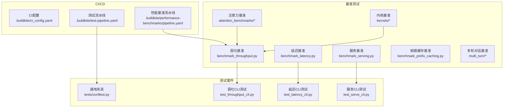
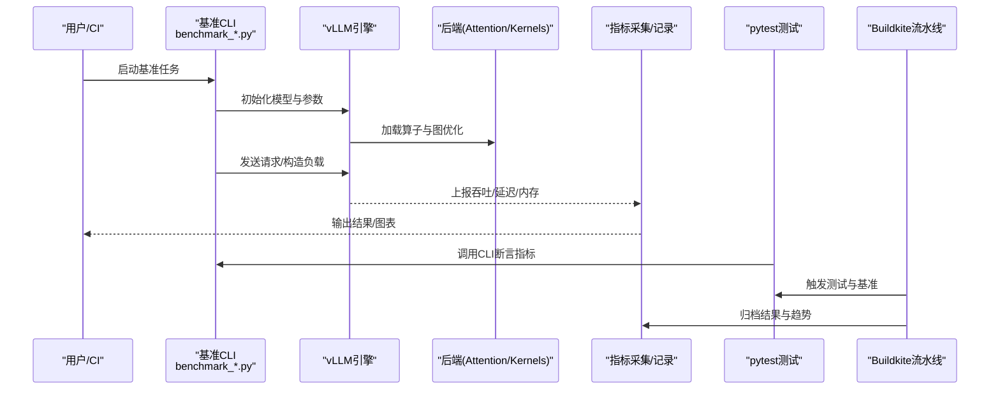
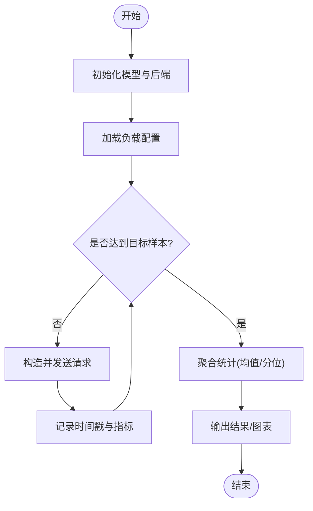
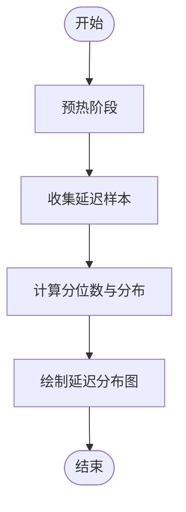
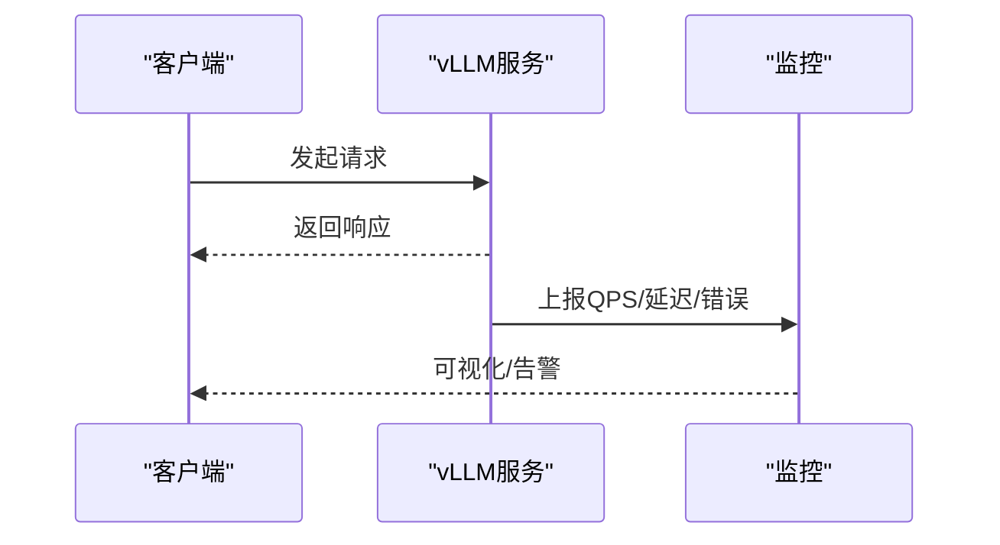
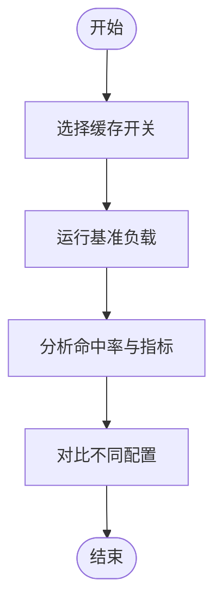
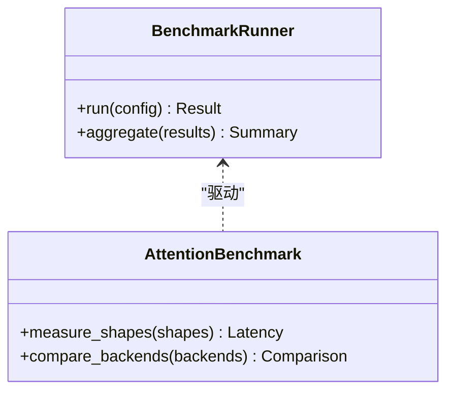
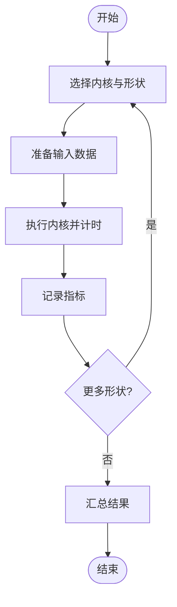
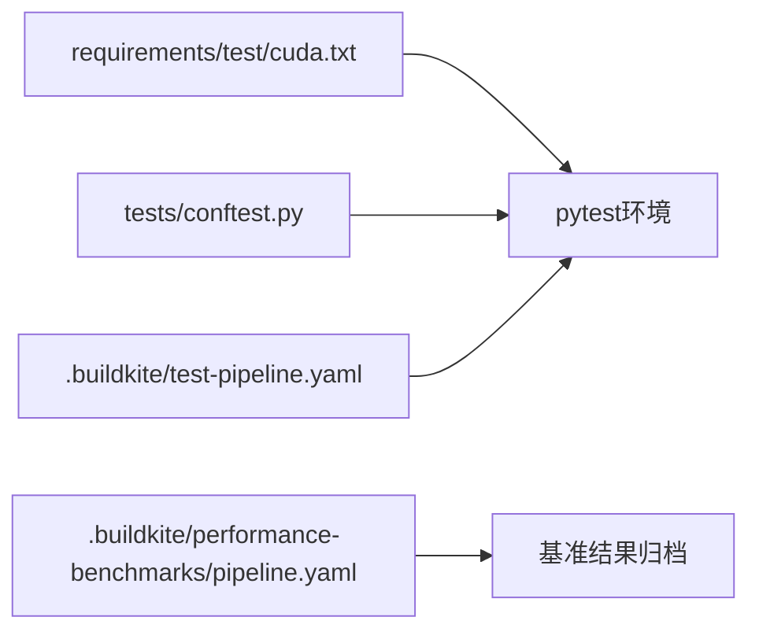

# 基准测试和测试

<cite>
**本文引用的文件**   
- [benchmarks/README.md](file://benchmarks/README.md)
- [benchmarks/benchmark_throughput.py](file://benchmarks/benchmark_throughput.py)
- [benchmarks/benchmark_latency.py](file://benchmarks/benchmark_latency.py)
- [benchmarks/benchmark_serving.py](file://benchmarks/benchmark_serving.py)
- [benchmarks/benchmark_prefix_caching.py](file://benchmarks/benchmark_prefix_caching.py)
- [benchmarks/multi_turn/benchmark_serving_multi_turn.py](file://benchmarks/multi_turn/benchmark_serving_multi_turn.py)
- [benchmarks/kernels/utils.py](file://benchmarks/kernels/utils.py)
- [benchmarks/attention_benchmarks/benchmark.py](file://benchmarks/attention_benchmarks/benchmark.py)
- [benchmarks/attention_benchmarks/runner.py](file://benchmarks/attention_benchmarks/runner.py)
- [tests/conftest.py](file://tests/conftest.py)
- [tests/benchmarks/test_throughput_cli.py](file://tests/benchmarks/test_throughput_cli.py)
- [tests/benchmarks/test_latency_cli.py](file://tests/benchmarks/test_latency_cli.py)
- [tests/benchmarks/test_serve_cli.py](file://tests/benchmarks/test_serve_cli.py)
- [.buildkite/ci_config.yaml](file://.buildkite/ci_config.yaml)
- [.buildkite/test-pipeline.yaml](file://.buildkite/test-pipeline.yaml)
- [.buildkite/performance-benchmarks/pipeline.yaml](file://.buildkite/performance-benchmarks/pipeline.yaml)
- [requirements/test/cuda.txt](file://requirements/test/cuda.txt)
- [docs/benchmarking/README.md](file://docs/benchmarking/README.md)
- [docs/benchmarking/cli.md](file://docs/benchmarking/cli.md)
- [docs/benchmarking/dashboard.md](file://docs/benchmarking/dashboard.md)
</cite>

## 目录
1. [简介](#简介)
2. [项目结构](#项目结构)
3. [核心组件](#核心组件)
4. [架构总览](#架构总览)
5. [详细组件分析](#详细组件分析)
6. [依赖分析](#依赖分析)
7. [性能考量](#性能考量)
8. [故障排查指南](#故障排查指南)
9. [结论](#结论)
10. [附录](#附录)

## 简介
本文件系统性介绍 vLLM 的基准测试与测试框架，覆盖以下方面：
- 性能基准套件：吞吐量、延迟、内存使用、前缀缓存、注意力内核等
- 正确性测试：单元测试、集成测试、端到端测试的执行方法与覆盖范围
- 自定义基准开发：用例编写、结果分析与报告生成
- CI/CD 流水线：自动化测试、代码质量检查、发布流程
- 性能回归检测：基准数据收集与趋势分析
- 压力与稳定性测试：实施方案与注意事项
- 测试环境搭建与数据准备：依赖、容器化、数据集与配置

## 项目结构
vLLM 的基准与测试相关代码主要分布在以下目录：
- benchmarks：各类性能基准脚本与工具（吞吐、延迟、服务、注意力、内核、多轮对话等）
- tests：pytest 测试套件（单元、集成、端到端、编译、内核、分布式等）
- .buildkite：CI/CD 流水线定义（测试、性能基准、发布）
- docs/benchmarking：基准文档（CLI、Dashboard、Sweeps）
- requirements/test：测试依赖清单（CUDA、ROCm、XPU 等）

图表来源 
- [benchmarks/benchmark_throughput.py](file://benchmarks/benchmark_throughput.py)
- [benchmarks/benchmark_latency.py](file://benchmarks/benchmark_latency.py)
- [benchmarks/benchmark_serving.py](file://benchmarks/benchmark_serving.py)
- [benchmarks/benchmark_prefix_caching.py](file://benchmarks/benchmark_prefix_caching.py)
- [benchmarks/attention_benchmarks/benchmark.py](file://benchmarks/attention_benchmarks/benchmark.py)
- [benchmarks/kernels/utils.py](file://benchmarks/kernels/utils.py)
- [tests/conftest.py](file://tests/conftest.py)
- [tests/benchmarks/test_throughput_cli.py](file://tests/benchmarks/test_throughput_cli.py)
- [tests/benchmarks/test_latency_cli.py](file://tests/benchmarks/test_latency_cli.py)
- [tests/benchmarks/test_serve_cli.py](file://tests/benchmarks/test_serve_cli.py)
- [.buildkite/ci_config.yaml](file://.buildkite/ci_config.yaml)
- [.buildkite/test-pipeline.yaml](file://.buildkite/test-pipeline.yaml)
- [.buildkite/performance-benchmarks/pipeline.yaml](file://.buildkite/performance-benchmarks/pipeline.yaml)

章节来源
- [benchmarks/README.md](file://benchmarks/README.md)
- [docs/benchmarking/README.md](file://docs/benchmarking/README.md)

## 核心组件
- 吞吐基准（benchmark_throughput.py）：通过构造不同请求负载与模型参数，测量每秒处理 token 数、并发度、批大小等指标，支持多种采样策略与输出格式。
- 延迟基准（benchmark_latency.py）：聚焦端到端延迟与逐阶段时延，统计 P50/P90/P99 分位，便于定位热点路径。
- 服务基准（benchmark_serving.py）：模拟在线服务场景，评估 QPS、尾延迟、资源占用与稳定性。
- 前缀缓存基准（benchmark_prefix_caching.py）：验证 KV Cache 命中与复用效果，对比开启/关闭缓存时的吞吐与延迟变化。
- 注意力基准（attention_benchmarks/*）：针对注意力算子进行细粒度基准，支持不同形状、精度与后端。
- 内核基准（kernels/*）：对底层算子（GEMM、RMSNorm、RoPE、PagedAttention 等）进行微基准，提供统一工具与形状集。
- 多轮对话基准（multi_turn/*）：模拟长会话与上下文累积，评估多轮交互下的系统表现。

章节来源
- [benchmarks/benchmark_throughput.py](file://benchmarks/benchmark_throughput.py)
- [benchmarks/benchmark_latency.py](file://benchmarks/benchmark_latency.py)
- [benchmarks/benchmark_serving.py](file://benchmarks/benchmark_serving.py)
- [benchmarks/benchmark_prefix_caching.py](file://benchmarks/benchmark_prefix_caching.py)
- [benchmarks/attention_benchmarks/benchmark.py](file://benchmarks/attention_benchmarks/benchmark.py)
- [benchmarks/kernels/utils.py](file://benchmarks/kernels/utils.py)
- [benchmarks/multi_turn/benchmark_serving_multi_turn.py](file://benchmarks/multi_turn/benchmark_serving_multi_turn.py)

## 架构总览
下图展示从 CLI 到引擎执行再到指标采集的整体流程，以及测试与 CI 的集成关系。

图表来源 
- [benchmarks/benchmark_throughput.py](file://benchmarks/benchmark_throughput.py)
- [benchmarks/benchmark_latency.py](file://benchmarks/benchmark_latency.py)
- [benchmarks/benchmark_serving.py](file://benchmarks/benchmark_serving.py)
- [tests/benchmarks/test_throughput_cli.py](file://tests/benchmarks/test_throughput_cli.py)
- [tests/benchmarks/test_latency_cli.py](file://tests/benchmarks/test_latency_cli.py)
- [tests/benchmarks/test_serve_cli.py](file://tests/benchmarks/test_serve_cli.py)
- [.buildkite/test-pipeline.yaml](file://.buildkite/test-pipeline.yaml)
- [.buildkite/performance-benchmarks/pipeline.yaml](file://.buildkite/performance-benchmarks/pipeline.yaml)

## 详细组件分析

### 吞吐基准（benchmark_throughput.py）
- 功能要点
  - 支持多种负载模型（固定长度、随机长度、多模态等）
  - 可调节并发、批大小、采样参数、输出格式
  - 输出关键指标：吞吐（tokens/s）、QPS、GPU/CPU利用率、内存峰值
- 执行方式
  - 命令行直接运行，或通过 pytest 调用以进行断言
- 结果分析
  - 关注吞吐随并发与批大小的变化曲线
  - 结合 GPU 利用率与内存峰值判断瓶颈

图表来源 
- [benchmarks/benchmark_throughput.py](file://benchmarks/benchmark_throughput.py)

章节来源
- [benchmarks/benchmark_throughput.py](file://benchmarks/benchmark_throughput.py)
- [tests/benchmarks/test_throughput_cli.py](file://tests/benchmarks/test_throughput_cli.py)

### 延迟基准（benchmark_latency.py）
- 功能要点
  - 端到端延迟与逐阶段时延统计
  - 支持分位数（P50/P90/P99）与异常值剔除
- 执行方式
  - 命令行或 pytest 调用，支持不同模型与后端
- 结果分析
  - 识别首 token 延迟与后续 token 生成延迟差异
  - 结合系统资源监控定位热点

图表来源 
- [benchmarks/benchmark_latency.py](file://benchmarks/benchmark_latency.py)

章节来源
- [benchmarks/benchmark_latency.py](file://benchmarks/benchmark_latency.py)
- [tests/benchmarks/test_latency_cli.py](file://tests/benchmarks/test_latency_cli.py)

### 服务基准（benchmark_serving.py）
- 功能要点
  - 模拟在线服务请求流，评估 QPS、尾延迟、错误率
  - 支持流式与非流式输出
- 执行方式
  - 命令行或 pytest 调用，可与监控系统集成
- 结果分析
  - 观察高并发下延迟抖动与资源饱和点

图表来源 
- [benchmarks/benchmark_serving.py](file://benchmarks/benchmark_serving.py)

章节来源
- [benchmarks/benchmark_serving.py](file://benchmarks/benchmark_serving.py)
- [tests/benchmarks/test_serve_cli.py](file://tests/benchmarks/test_serve_cli.py)

### 前缀缓存基准（benchmark_prefix_caching.py）
- 功能要点
  - 对比开启/关闭前缀缓存的吞吐与延迟
  - 评估 KV Cache 命中率与复用收益
- 执行方式
  - 命令行切换开关，自动输出对比报告
- 结果分析
  - 关注命中率与吞吐提升比例，识别缓存失效场景

图表来源 
- [benchmarks/benchmark_prefix_caching.py](file://benchmarks/benchmark_prefix_caching.py)

章节来源
- [benchmarks/benchmark_prefix_caching.py](file://benchmarks/benchmark_prefix_caching.py)

### 注意力基准（attention_benchmarks/*）
- 功能要点
  - 针对注意力算子的形状、精度、后端进行基准
  - 支持批量规格扫描与结果汇总
- 执行方式
  - 通过 runner 与 benchmark 模块驱动
- 结果分析
  - 关注不同形状下的性能差异与瓶颈

图表来源 
- [benchmarks/attention_benchmarks/benchmark.py](file://benchmarks/attention_benchmarks/benchmark.py)
- [benchmarks/attention_benchmarks/runner.py](file://benchmarks/attention_benchmarks/runner.py)

章节来源
- [benchmarks/attention_benchmarks/benchmark.py](file://benchmarks/attention_benchmarks/benchmark.py)
- [benchmarks/attention_benchmarks/runner.py](file://benchmarks/attention_benchmarks/runner.py)

### 内核基准（kernels/*）
- 功能要点
  - 对底层算子（GEMM、RMSNorm、RoPE、PagedAttention 等）进行微基准
  - 提供统一工具与形状集，便于横向对比
- 执行方式
  - 通过 utils 与具体 benchmark 脚本组合运行
- 结果分析
  - 关注不同形状与精度下的吞吐与时延

图表来源 
- [benchmarks/kernels/utils.py](file://benchmarks/kernels/utils.py)

章节来源
- [benchmarks/kernels/utils.py](file://benchmarks/kernels/utils.py)

### 多轮对话基准（multi_turn/*）
- 功能要点
  - 模拟长会话与上下文累积，评估多轮交互下的系统表现
- 执行方式
  - 通过 multi_turn 基准脚本与数据集转换工具
- 结果分析
  - 关注上下文增长对延迟与内存的影响

章节来源
- [benchmarks/multi_turn/benchmark_serving_multi_turn.py](file://benchmarks/multi_turn/benchmark_serving_multi_turn.py)

## 依赖分析
- 测试依赖
  - CUDA/ROCm/XPU 等平台的测试依赖在 requirements/test 中管理
- 测试夹具与配置
  - tests/conftest.py 提供全局夹具与共享配置
- CI/CD 依赖
  - .buildkite 中的 YAML 定义测试与基准流水线，协调环境与产物

图表来源 
- [requirements/test/cuda.txt](file://requirements/test/cuda.txt)
- [tests/conftest.py](file://tests/conftest.py)
- [.buildkite/test-pipeline.yaml](file://.buildkite/test-pipeline.yaml)
- [.buildkite/performance-benchmarks/pipeline.yaml](file://.buildkite/performance-benchmarks/pipeline.yaml)

章节来源
- [requirements/test/cuda.txt](file://requirements/test/cuda.txt)
- [tests/conftest.py](file://tests/conftest.py)
- [.buildkite/ci_config.yaml](file://.buildkite/ci_config.yaml)

## 性能考量
- 吞吐与延迟权衡
  - 增大批大小通常提升吞吐但增加延迟；需根据业务需求平衡
- 内存与显存使用
  - 关注 KV Cache 与中间激活的显存占用，避免 OOM
- 后端与算子选择
  - 不同注意力后端与内核在不同形状下表现差异显著，建议按形状扫描
- 预热与稳定期
  - 基准前应进行足够预热，确保 JIT/图编译完成后再统计
- 监控与采样
  - 启用系统监控（GPU/CPU/内存），合理设置采样间隔与样本量

[本节为通用指导，不直接分析具体文件]

## 故障排查指南
- 常见问题
  - 环境依赖缺失：检查 requirements/test 与平台特定依赖
  - 模型加载失败：确认权重路径与权限，检查后端兼容性
  - 内存不足：降低批大小或并发，启用内存优化选项
  - 指标异常：检查预热是否充分，排除冷启动影响
- 调试方法
  - 使用 pytest -v 查看详细日志
  - 通过 CI 日志与产物归档定位问题
  - 结合系统监控与 vLLM 内部指标

章节来源
- [tests/conftest.py](file://tests/conftest.py)
- [.buildkite/test-pipeline.yaml](file://.buildkite/test-pipeline.yaml)

## 结论
vLLM 的基准与测试体系覆盖了从内核到服务的全栈性能与正确性验证。通过统一的 CLI、丰富的基准脚本与完善的 CI/CD 集成，团队可以高效地进行性能回归检测、稳定性评估与持续优化。建议在实际使用中结合业务负载定制基准，建立长期趋势看板，形成闭环的质量保障机制。

[本节为总结，不直接分析具体文件]

## 附录
- 自定义基准开发指南
  - 用例编写：基于现有 benchmark_* 模板，定义负载、指标与输出格式
  - 结果分析：使用内置统计与绘图工具，生成对比报告
  - 报告生成：导出 JSON/CSV，接入 Dashboard 或 BI 工具
- CI/CD 流水线配置
  - 自动化测试：通过 test-pipeline 触发 pytest 与基准任务
  - 代码质量检查：集成 lint、类型检查与安全扫描
  - 发布流程：通过 release-pipeline 构建与分发制品
- 性能回归检测
  - 基准数据收集：定期运行基准并归档结果
  - 趋势分析：对比历史基线，标记显著退化
- 压力与稳定性测试
  - 长时间运行与高并发注入，观察内存泄漏与错误率
- 测试环境搭建与数据准备
  - 依赖安装：requirements/test 与平台特定包
  - 容器化：使用 Docker 镜像保证环境一致性
  - 数据集：准备代表性负载与多模态样例

章节来源
- [docs/benchmarking/cli.md](file://docs/benchmarking/cli.md)
- [docs/benchmarking/dashboard.md](file://docs/benchmarking/dashboard.md)
- [.buildkite/release-pipeline.yaml](file://.buildkite/release-pipeline.yaml)