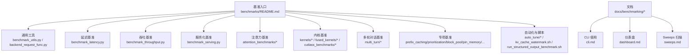
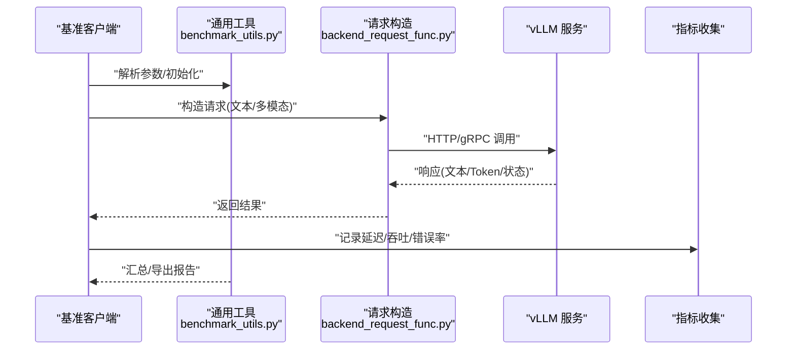
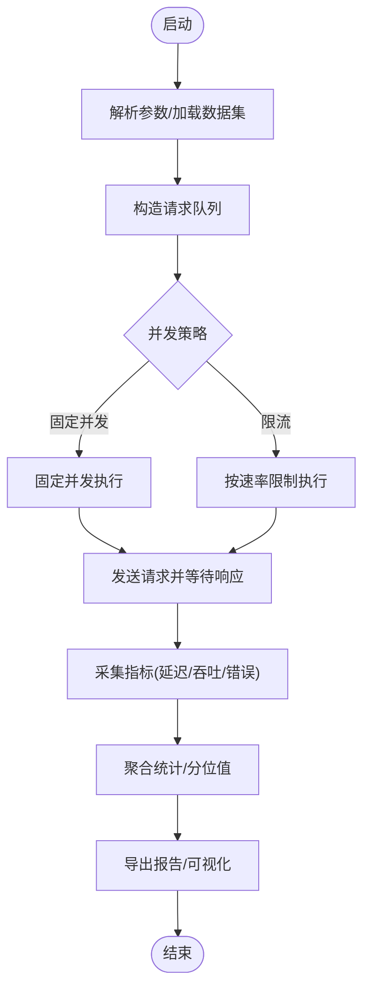
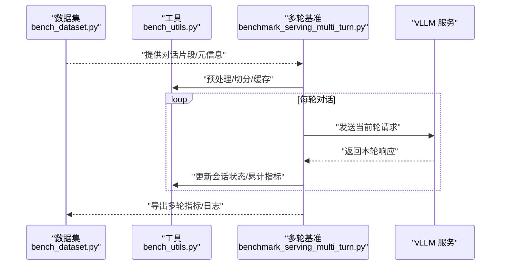
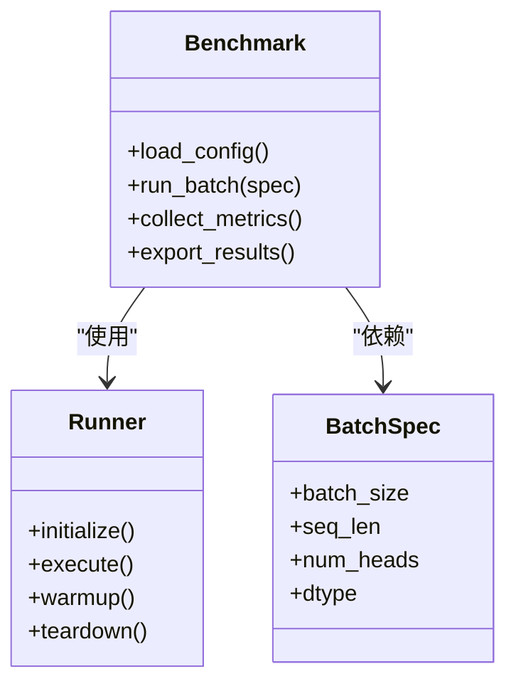
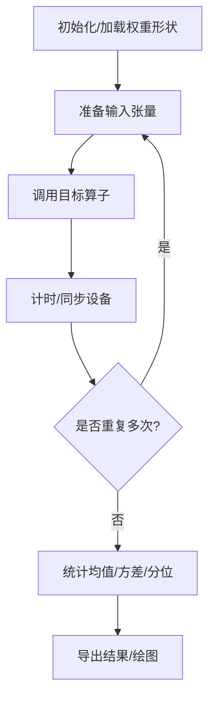
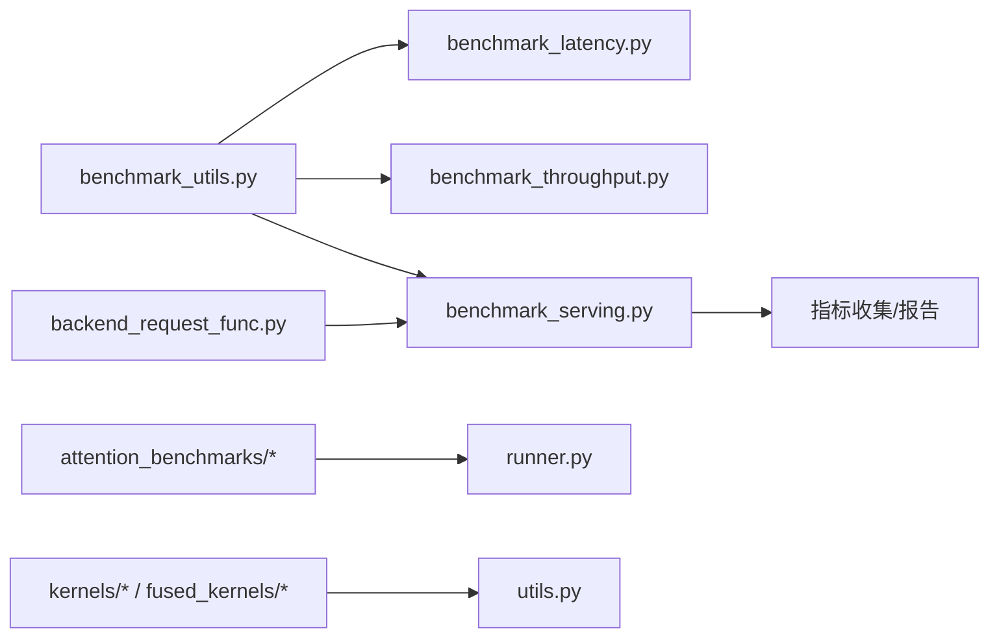

# 基准测试工具

<cite>
**本文档引用的文件**   
- [benchmarks/README.md](file://benchmarks/README.md)
- [benchmarks/benchmark_latency.py](file://benchmarks/benchmark_latency.py)
- [benchmarks/benchmark_throughput.py](file://benchmarks/benchmark_throughput.py)
- [benchmarks/benchmark_serving.py](file://benchmarks/benchmark_serving.py)
- [benchmarks/benchmark_utils.py](file://benchmarks/benchmark_utils.py)
- [benchmarks/backend_request_func.py](file://benchmarks/backend_request_func.py)
- [benchmarks/multi_turn/benchmark_serving_multi_turn.py](file://benchmarks/multi_turn/benchmark_serving_multi_turn.py)
- [benchmarks/multi_turn/bench_dataset.py](file://benchmarks/multi_turn/bench_dataset.py)
- [benchmarks/multi_turn/bench_utils.py](file://benchmarks/multi_turn/bench_utils.py)
- [benchmarks/kernels/utils.py](file://benchmarks/kernels/utils.py)
- [benchmarks/kernels/benchmark_layernorm.py](file://benchmarks/kernels/benchmark_layernorm.py)
- [benchmarks/kernels/benchmark_moe.py](file://benchmarks/kernels/benchmark_moe.py)
- [benchmarks/fused_kernels/layernorm_rms_benchmarks.py](file://benchmarks/fused_kernels/layernorm_rms_benchmarks.py)
- [benchmarks/cutlass_benchmarks/w8a8_benchmarks.py](file://benchmarks/cutlass_benchmarks/w8a8_benchmarks.py)
- [benchmarks/attention_benchmarks/benchmark.py](file://benchmarks/attention_benchmarks/benchmark.py)
- [benchmarks/attention_benchmarks/runner.py](file://benchmarks/attention_benchmarks/runner.py)
- [benchmarks/overheads/benchmark_hashing.py](file://benchmarks/overheads/benchmark_hashing.py)
- [benchmarks/benchmark_prefix_caching.py](file://benchmarks/benchmark_prefix_caching.py)
- [benchmarks/benchmark_prioritization.py](file://benchmarks/benchmark_prioritization.py)
- [benchmarks/benchmark_block_pool.py](file://benchmarks/benchmark_block_pool.py)
- [benchmarks/benchmark_pin_memory.py](file://benchmarks/benchmark_pin_memory.py)
- [benchmarks/benchmark_hidden_state_extraction.py](file://benchmarks/benchmark_hidden_state_extraction.py)
- [benchmarks/benchmark_ngram_proposer.py](file://benchmarks/benchmark_ngram_proposer.py)
- [benchmarks/benchmark_topk_topp.py](file://benchmarks/benchmark_topk_topp.py)
- [benchmarks/benchmark_batch_invariance.py](file://benchmarks/benchmark_batch_invariance.py)
- [benchmarks/benchmark_long_document_qa_throughput.py](file://benchmarks/benchmark_long_document_qa_throughput.py)
- [benchmarks/benchmark_serving_structured_output.py](file://benchmarks/benchmark_serving_structured_output.py)
- [benchmarks/run_structured_output_benchmark.sh](file://benchmarks/run_structured_output_benchmark.sh)
- [benchmarks/auto_tune/auto_tune.sh](file://benchmarks/auto_tune/auto_tune.sh)
- [benchmarks/auto_tune/batch_auto_tune.sh](file://benchmarks/auto_tune/batch_auto_tune.sh)
- [benchmarks/kv_cache_watermark.sh](file://benchmarks/kv_cache_watermark.sh)
- [docs/benchmarking/README.md](file://docs/benchmarking/README.md)
- [docs/benchmarking/cli.md](file://docs/benchmarking/cli.md)
- [docs/benchmarking/dashboard.md](file://docs/benchmarking/dashboard.md)
- [docs/benchmarking/sweeps.md](file://docs/benchmarking/sweeps.md)
</cite>

## 目录
1. [简介](#简介)
2. [项目结构](#项目结构)
3. [核心组件](#核心组件)
4. [架构总览](#架构总览)
5. [详细组件分析](#详细组件分析)
6. [依赖关系分析](#依赖关系分析)
7. [性能注意事项](#性能注意事项)
8. [故障排查指南](#故障排查指南)
9. [结论](#结论)
10. [附录](#附录)

## 简介
本章节概述 vLLM 基准测试工具集的目标与范围，涵盖请求生成、结果收集与报告生成、性能分析（GPU 利用率、内存使用、瓶颈识别）、自定义基准开发、最佳实践以及不同场景的配置示例与优化建议。读者可据此快速定位所需工具并高效开展评测工作。

## 项目结构
vLLM 的基准测试相关代码主要分布在 benchmarks 目录与 docs/benchmarking 文档中：
- benchmarks：包含延迟、吞吐、服务化、注意力内核、融合算子、多轮对话、KV Cache 等丰富的基准脚本与工具。
- docs/benchmarking：提供 CLI 使用、仪表盘与 Sweeps 扫描的说明文档。

图表来源
- [benchmarks/README.md](file://benchmarks/README.md)
- [docs/benchmarking/README.md](file://docs/benchmarking/README.md)

章节来源
- [benchmarks/README.md](file://benchmarks/README.md)
- [docs/benchmarking/README.md](file://docs/benchmarking/README.md)

## 核心组件
- 通用工具与请求生成
  - benchmark_utils.py：提供参数解析、指标统计、结果汇总与可视化辅助函数。
  - backend_request_func.py：封装后端请求构造与调用逻辑，屏蔽不同后端的差异。
- 延迟基准
  - benchmark_latency.py：端到端延迟测量，支持多种采样策略与输出格式。
- 吞吐基准
  - benchmark_throughput.py：QPS/TPS 评估，支持并发度、批大小、模型配置等参数扫描。
- 服务化基准
  - benchmark_serving.py：模拟在线服务负载，支持 OpenAI 兼容接口、流式与非流式。
  - multi_turn/*：多轮对话场景的数据集与工具，便于构建真实交互负载。
- 注意力与内核基准
  - attention_benchmarks/*：注意力实现对比、MLA 运行器与批量规格定义。
  - kernels/*、fused_kernels/*、cutlass_benchmarks/*：针对具体算子或库（如 CUTLASS）的微基准。
- 专项基准
  - prefix_caching、prioritization、block_pool、pin_memory、hidden_state_extraction、ngram_proposer、topk_topp、batch_invariance、long_document_qa_throughput、structured_output 等。
- 自动化与脚本
  - auto_tune/*：自动调参与批量执行。
  - kv_cache_watermark.sh：KV Cache 水位线监控脚本。
  - run_structured_output_benchmark.sh：结构化输出基准一键执行。

章节来源
- [benchmarks/benchmark_utils.py](file://benchmarks/benchmark_utils.py)
- [benchmarks/backend_request_func.py](file://benchmarks/backend_request_func.py)
- [benchmarks/benchmark_latency.py](file://benchmarks/benchmark_latency.py)
- [benchmarks/benchmark_throughput.py](file://benchmarks/benchmark_throughput.py)
- [benchmarks/benchmark_serving.py](file://benchmarks/benchmark_serving.py)
- [benchmarks/multi_turn/benchmark_serving_multi_turn.py](file://benchmarks/multi_turn/benchmark_serving_multi_turn.py)
- [benchmarks/multi_turn/bench_dataset.py](file://benchmarks/multi_turn/bench_dataset.py)
- [benchmarks/multi_turn/bench_utils.py](file://benchmarks/multi_turn/bench_utils.py)
- [benchmarks/attention_benchmarks/benchmark.py](file://benchmarks/attention_benchmarks/benchmark.py)
- [benchmarks/attention_benchmarks/runner.py](file://benchmarks/attention_benchmarks/runner.py)
- [benchmarks/kernels/utils.py](file://benchmarks/kernels/utils.py)
- [benchmarks/kernels/benchmark_layernorm.py](file://benchmarks/kernels/benchmark_layernorm.py)
- [benchmarks/kernels/benchmark_moe.py](file://benchmarks/kernels/benchmark_moe.py)
- [benchmarks/fused_kernels/layernorm_rms_benchmarks.py](file://benchmarks/fused_kernels/layernorm_rms_benchmarks.py)
- [benchmarks/cutlass_benchmarks/w8a8_benchmarks.py](file://benchmarks/cutlass_benchmarks/w8a8_benchmarks.py)
- [benchmarks/benchmark_prefix_caching.py](file://benchmarks/benchmark_prefix_caching.py)
- [benchmarks/benchmark_prioritization.py](file://benchmarks/benchmark_prioritization.py)
- [benchmarks/benchmark_block_pool.py](file://benchmarks/benchmark_block_pool.py)
- [benchmarks/benchmark_pin_memory.py](file://benchmarks/benchmark_pin_memory.py)
- [benchmarks/benchmark_hidden_state_extraction.py](file://benchmarks/benchmark_hidden_state_extraction.py)
- [benchmarks/benchmark_ngram_proposer.py](file://benchmarks/benchmark_ngram_proposer.py)
- [benchmarks/benchmark_topk_topp.py](file://benchmarks/benchmark_topk_topp.py)
- [benchmarks/benchmark_batch_invariance.py](file://benchmarks/benchmark_batch_invariance.py)
- [benchmarks/benchmark_long_document_qa_throughput.py](file://benchmarks/benchmark_long_document_qa_throughput.py)
- [benchmarks/benchmark_serving_structured_output.py](file://benchmarks/benchmark_serving_structured_output.py)
- [benchmarks/run_structured_output_benchmark.sh](file://benchmarks/run_structured_output_benchmark.sh)
- [benchmarks/auto_tune/auto_tune.sh](file://benchmarks/auto_tune/auto_tune.sh)
- [benchmarks/auto_tune/batch_auto_tune.sh](file://benchmarks/auto_tune/batch_auto_tune.sh)
- [benchmarks/kv_cache_watermark.sh](file://benchmarks/kv_cache_watermark.sh)

## 架构总览
下图展示了典型的服务化基准流程：客户端构造请求、通过后端函数发送、服务端处理、指标采集与结果汇总。

图表来源
- [benchmarks/benchmark_serving.py](file://benchmarks/benchmark_serving.py)
- [benchmarks/backend_request_func.py](file://benchmarks/backend_request_func.py)
- [benchmarks/benchmark_utils.py](file://benchmarks/benchmark_utils.py)

章节来源
- [benchmarks/benchmark_serving.py](file://benchmarks/benchmark_serving.py)
- [benchmarks/backend_request_func.py](file://benchmarks/backend_request_func.py)
- [benchmarks/benchmark_utils.py](file://benchmarks/benchmark_utils.py)

## 详细组件分析

### 服务化基准（benchmark_serving.py）
- 功能要点
  - 模拟在线推理服务负载，支持并发控制、请求速率、超时与重试。
  - 支持 OpenAI 兼容接口，便于与现有客户端集成。
  - 内置指标采集：首 token 延迟、端到端延迟、吞吐、错误率、资源占用快照。
- 关键流程
  - 参数解析与数据集加载
  - 请求构造与调度
  - 异步并发执行与结果聚合
  - 指标计算与报告导出（CSV/JSON/可视化）

图表来源
- [benchmarks/benchmark_serving.py](file://benchmarks/benchmark_serving.py)
- [benchmarks/benchmark_utils.py](file://benchmarks/benchmark_utils.py)

章节来源
- [benchmarks/benchmark_serving.py](file://benchmarks/benchmark_serving.py)
- [benchmarks/benchmark_utils.py](file://benchmarks/benchmark_utils.py)

### 多轮对话基准（multi_turn/*）
- 功能要点
  - 基于真实对话数据集构建多轮交互负载，支持会话状态管理与上下文长度增长。
  - 提供数据集转换与工具函数，便于适配不同数据源。
- 关键流程
  - 数据集准备与切片
  - 会话状态维护与消息组装
  - 逐轮请求调度与指标累积
  - 结果分析与报告生成

图表来源
- [benchmarks/multi_turn/benchmark_serving_multi_turn.py](file://benchmarks/multi_turn/benchmark_serving_multi_turn.py)
- [benchmarks/multi_turn/bench_dataset.py](file://benchmarks/multi_turn/bench_dataset.py)
- [benchmarks/multi_turn/bench_utils.py](file://benchmarks/multi_turn/bench_utils.py)

章节来源
- [benchmarks/multi_turn/benchmark_serving_multi_turn.py](file://benchmarks/multi_turn/benchmark_serving_multi_turn.py)
- [benchmarks/multi_turn/bench_dataset.py](file://benchmarks/multi_turn/bench_dataset.py)
- [benchmarks/multi_turn/bench_utils.py](file://benchmarks/multi_turn/bench_utils.py)

### 注意力基准（attention_benchmarks/*）
- 功能要点
  - 针对不同注意力实现进行对比，支持 MLA 运行器与批量规格配置。
  - 提供 runner 框架以统一执行与度量。
- 关键流程
  - 配置加载与规格定义
  - 运行器初始化与预热
  - 多批次执行与指标采集
  - 结果对比与可视化

图表来源
- [benchmarks/attention_benchmarks/benchmark.py](file://benchmarks/attention_benchmarks/benchmark.py)
- [benchmarks/attention_benchmarks/runner.py](file://benchmarks/attention_benchmarks/runner.py)
- [benchmarks/attention_benchmarks/batch_spec.py](file://benchmarks/attention_benchmarks/batch_spec.py)

章节来源
- [benchmarks/attention_benchmarks/benchmark.py](file://benchmarks/attention_benchmarks/benchmark.py)
- [benchmarks/attention_benchmarks/runner.py](file://benchmarks/attention_benchmarks/runner.py)
- [benchmarks/attention_benchmarks/batch_spec.py](file://benchmarks/attention_benchmarks/batch_spec.py)

### 内核与融合算子基准（kernels/*, fused_kernels/*, cutlass_benchmarks/*）
- 功能要点
  - 针对具体算子（如 Layernorm、MoE、量化 GEMM）与库（CUTLASS）进行微基准测试。
  - 提供 utils 与 weight_shapes 等工具，简化形状生成与重复实验。
- 关键流程
  - 形状/权重生成
  - 算子调用与计时
  - 多轮平均与方差统计
  - 结果导出与对比

图表来源
- [benchmarks/kernels/utils.py](file://benchmarks/kernels/utils.py)
- [benchmarks/kernels/benchmark_layernorm.py](file://benchmarks/kernels/benchmark_layernorm.py)
- [benchmarks/kernels/benchmark_moe.py](file://benchmarks/kernels/benchmark_moe.py)
- [benchmarks/fused_kernels/layernorm_rms_benchmarks.py](file://benchmarks/fused_kernels/layernorm_rms_benchmarks.py)
- [benchmarks/cutlass_benchmarks/w8a8_benchmarks.py](file://benchmarks/cutlass_benchmarks/w8a8_benchmarks.py)

章节来源
- [benchmarks/kernels/utils.py](file://benchmarks/kernels/utils.py)
- [benchmarks/kernels/benchmark_layernorm.py](file://benchmarks/kernels/benchmark_layernorm.py)
- [benchmarks/kernels/benchmark_moe.py](file://benchmarks/kernels/benchmark_moe.py)
- [benchmarks/fused_kernels/layernorm_rms_benchmarks.py](file://benchmarks/fused_kernels/layernorm_rms_benchmarks.py)
- [benchmarks/cutlass_benchmarks/w8a8_benchmarks.py](file://benchmarks/cutlass_benchmarks/w8a8_benchmarks.py)

### 专项基准（prefix_caching、prioritization、block_pool、pin_memory 等）
- 功能要点
  - 针对特定子系统或特性进行深度评测，例如 KV Cache 命中率、优先级调度、显存分配策略、隐藏状态提取开销等。
- 关键流程
  - 场景建模与参数空间设计
  - 数据采集与指标计算
  - 对比不同配置下的表现
  - 输出分析报告与建议

章节来源
- [benchmarks/benchmark_prefix_caching.py](file://benchmarks/benchmark_prefix_caching.py)
- [benchmarks/benchmark_prioritization.py](file://benchmarks/benchmark_prioritization.py)
- [benchmarks/benchmark_block_pool.py](file://benchmarks/benchmark_block_pool.py)
- [benchmarks/benchmark_pin_memory.py](file://benchmarks/benchmark_pin_memory.py)
- [benchmarks/benchmark_hidden_state_extraction.py](file://benchmarks/benchmark_hidden_state_extraction.py)
- [benchmarks/benchmark_ngram_proposer.py](file://benchmarks/benchmark_ngram_proposer.py)
- [benchmarks/benchmark_topk_topp.py](file://benchmarks/benchmark_topk_topp.py)
- [benchmarks/benchmark_batch_invariance.py](file://benchmarks/benchmark_batch_invariance.py)
- [benchmarks/benchmark_long_document_qa_throughput.py](file://benchmarks/benchmark_long_document_qa_throughput.py)
- [benchmarks/benchmark_serving_structured_output.py](file://benchmarks/benchmark_serving_structured_output.py)

### 自动化与脚本（auto_tune、kv_cache_watermark、structured_output）
- 功能要点
  - auto_tune/*：自动搜索最优参数组合，批量执行并汇总结果。
  - kv_cache_watermark.sh：监控 KV Cache 水位线，辅助容量规划。
  - run_structured_output_benchmark.sh：一键执行结构化输出基准，便于回归测试。

章节来源
- [benchmarks/auto_tune/auto_tune.sh](file://benchmarks/auto_tune/auto_tune.sh)
- [benchmarks/auto_tune/batch_auto_tune.sh](file://benchmarks/auto_tune/batch_auto_tune.sh)
- [benchmarks/kv_cache_watermark.sh](file://benchmarks/kv_cache_watermark.sh)
- [benchmarks/run_structured_output_benchmark.sh](file://benchmarks/run_structured_output_benchmark.sh)

## 依赖关系分析
- 模块耦合
  - 各基准脚本普遍依赖 benchmark_utils.py 与 backend_request_func.py，形成“工具层+执行层”的解耦结构。
  - 注意力与内核基准通过 runner/utils 抽象出统一的执行与度量接口，降低重复代码。
- 外部依赖
  - 服务化基准依赖 HTTP/gRPC 客户端与服务端通信协议。
  - 内核基准依赖底层算子库（如 CUTLASS、Triton、CUDA）。
- 潜在循环依赖
  - 通过分层设计与工具函数隔离，避免直接循环导入；若新增模块，建议遵循“工具层不依赖执行层”的原则。

图表来源
- [benchmarks/benchmark_utils.py](file://benchmarks/benchmark_utils.py)
- [benchmarks/backend_request_func.py](file://benchmarks/backend_request_func.py)
- [benchmarks/benchmark_latency.py](file://benchmarks/benchmark_latency.py)
- [benchmarks/benchmark_throughput.py](file://benchmarks/benchmark_throughput.py)
- [benchmarks/benchmark_serving.py](file://benchmarks/benchmark_serving.py)
- [benchmarks/attention_benchmarks/runner.py](file://benchmarks/attention_benchmarks/runner.py)
- [benchmarks/kernels/utils.py](file://benchmarks/kernels/utils.py)

章节来源
- [benchmarks/benchmark_utils.py](file://benchmarks/benchmark_utils.py)
- [benchmarks/backend_request_func.py](file://benchmarks/backend_request_func.py)
- [benchmarks/benchmark_latency.py](file://benchmarks/benchmark_latency.py)
- [benchmarks/benchmark_throughput.py](file://benchmarks/benchmark_throughput.py)
- [benchmarks/benchmark_serving.py](file://benchmarks/benchmark_serving.py)
- [benchmarks/attention_benchmarks/runner.py](file://benchmarks/attention_benchmarks/runner.py)
- [benchmarks/kernels/utils.py](file://benchmarks/kernels/utils.py)

## 性能注意事项
- GPU 利用率监控
  - 使用系统级工具（如 nvidia-smi、nvtop）与 vLLM 指标结合，观察 GPU 利用率、显存占用与温度。
  - 在服务化基准中开启细粒度指标采集，区分预填充与解码阶段。
- 内存使用分析
  - 关注 KV Cache 占用、激活内存与临时缓冲区；利用 kv_cache_watermark.sh 监控水位线。
  - 调整 batch_size、max_num_seqs、cache_size 等参数以避免 OOM。
- 瓶颈识别
  - 通过内核基准定位热点算子（如 GEMM、Attention、MoE 路由）。
  - 使用延迟基准分解端到端时延，识别网络、序列化、调度与计算瓶颈。
- 可复现性与稳定性
  - 固定随机种子、禁用无关进程、预热模型与图编译。
  - 多次运行取稳定值，避免冷启动与抖动影响。

[本节为通用指导，不直接分析具体文件]

## 故障排查指南
- 常见问题
  - 请求超时/失败：检查服务端健康、端口占用、网络连通性与认证配置。
  - 指标缺失：确认指标开关与导出路径，确保权限与磁盘空间。
  - OOM：降低并发或序列长度，增加显存上限或启用分页注意力。
- 调试步骤
  - 启用详细日志与追踪，缩小问题范围。
  - 使用最小数据集复现，逐步放大规模。
  - 借助内核基准验证底层算子行为。

章节来源
- [benchmarks/benchmark_utils.py](file://benchmarks/benchmark_utils.py)
- [benchmarks/benchmark_serving.py](file://benchmarks/benchmark_serving.py)
- [benchmarks/kv_cache_watermark.sh](file://benchmarks/kv_cache_watermark.sh)

## 结论
vLLM 基准测试工具覆盖从端到端服务到内核级的全栈评测需求，具备完善的请求生成、指标采集与报告能力。通过合理设计测试场景、准备数据与解读结果，可有效定位性能瓶颈并指导优化。建议结合 CLI 文档与仪表盘，建立持续评测与回归体系。

[本节为总结性内容，不直接分析具体文件]

## 附录
- CLI 使用与仪表盘
  - docs/benchmarking/cli.md：命令行参数、常用命令与输出格式。
  - docs/benchmarking/dashboard.md：指标可视化与看板配置。
  - docs/benchmarking/sweeps.md：参数扫描与批量实验管理。

章节来源
- [docs/benchmarking/cli.md](file://docs/benchmarking/cli.md)
- [docs/benchmarking/dashboard.md](file://docs/benchmarking/dashboard.md)
- [docs/benchmarking/sweeps.md](file://docs/benchmarking/sweeps.md)