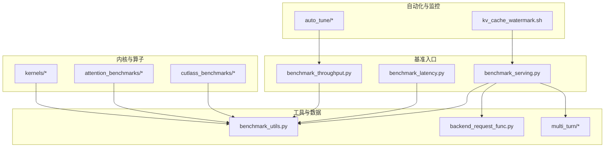
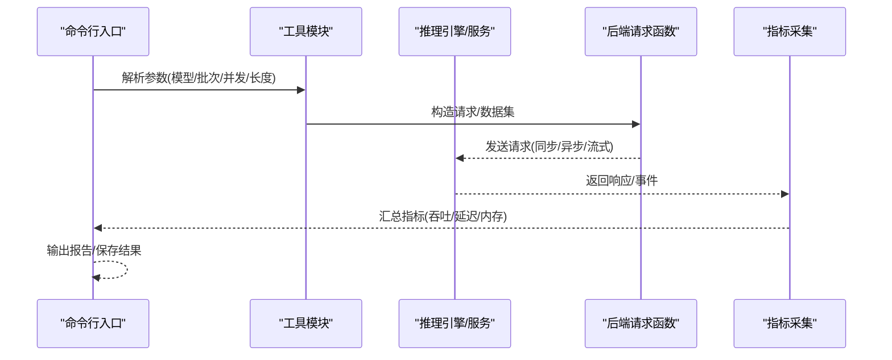
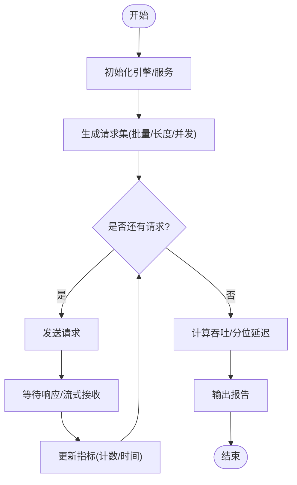
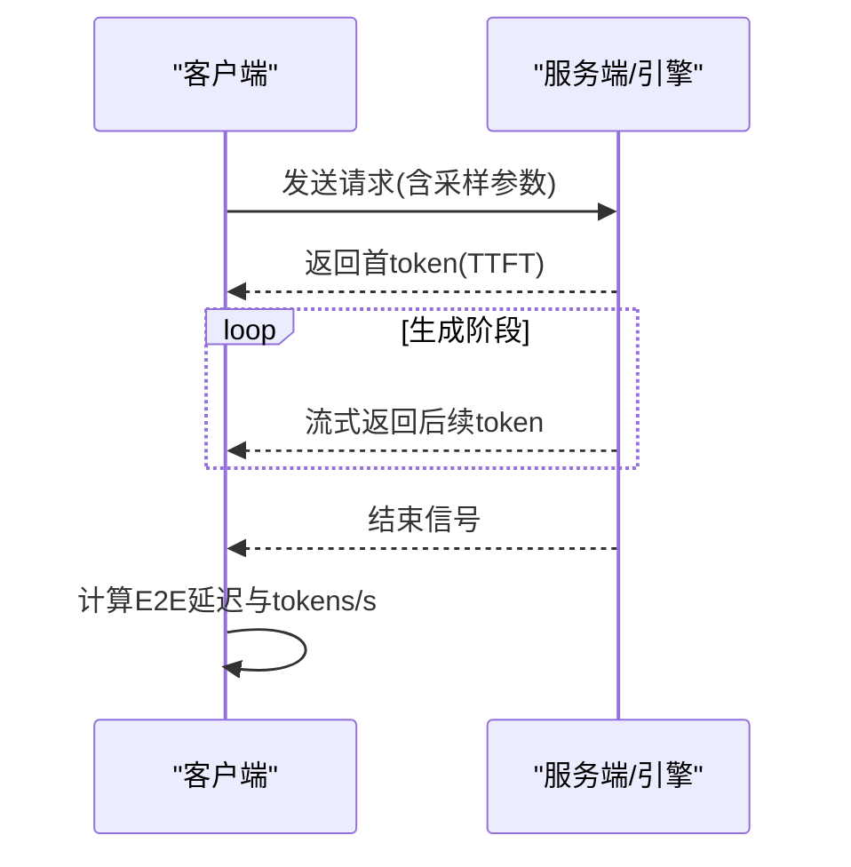
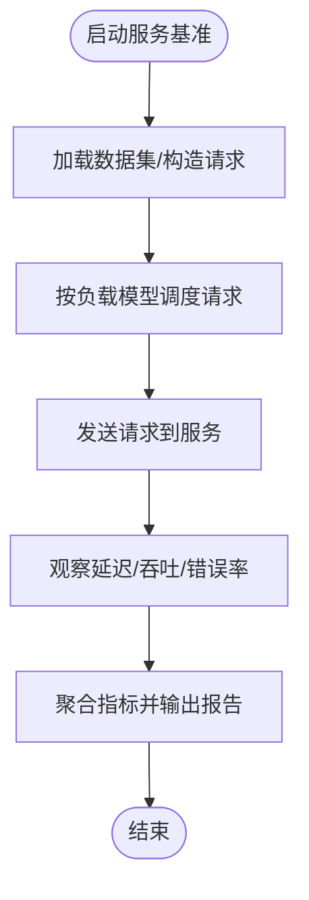
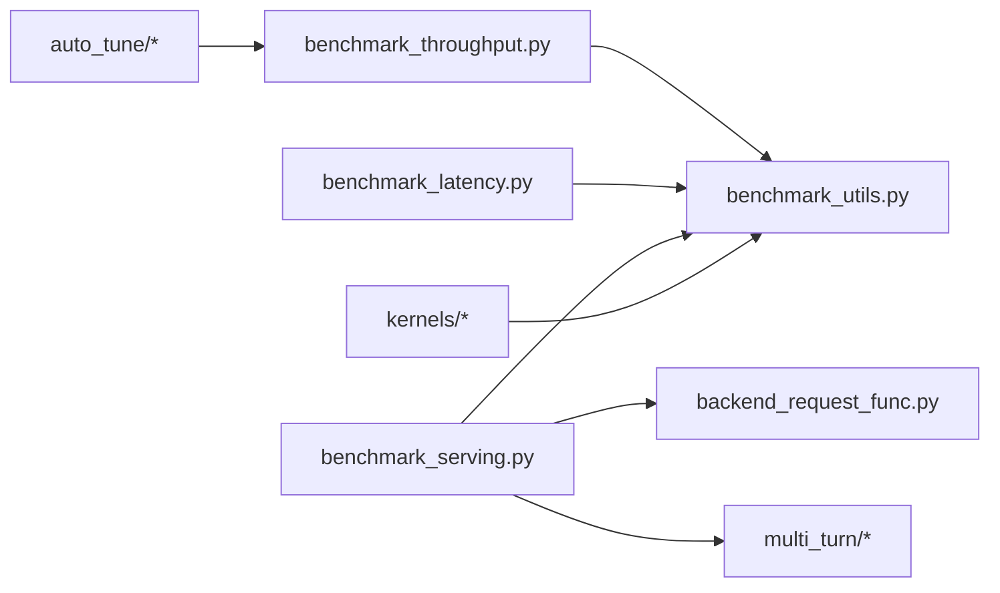

# 性能基准测试

<cite>
**本文引用的文件**   
- [benchmarks/README.md](file://benchmarks/README.md)
- [benchmarks/benchmark_throughput.py](file://benchmarks/benchmark_throughput.py)
- [benchmarks/benchmark_latency.py](file://benchmarks/benchmark_latency.py)
- [benchmarks/benchmark_serving.py](file://benchmarks/benchmark_serving.py)
- [benchmarks/benchmark_utils.py](file://benchmarks/benchmark_utils.py)
- [benchmarks/backend_request_func.py](file://benchmarks/backend_request_func.py)
- [benchmarks/multi_turn/benchmark_serving_multi_turn.py](file://benchmarks/multi_turn/benchmark_serving_multi_turn.py)
- [benchmarks/multi_turn/bench_dataset.py](file://benchmarks/multi_turn/bench_dataset.py)
- [benchmarks/multi_turn/bench_utils.py](file://benchmarks/multi_turn/bench_utils.py)
- [benchmarks/auto_tune/auto_tune.sh](file://benchmarks/auto_tune/auto_tune.sh)
- [benchmarks/auto_tune/batch_auto_tune.sh](file://benchmarks/auto_tune/batch_auto_tune.sh)
- [benchmarks/kv_cache_watermark.sh](file://benchmarks/kv_cache_watermark.sh)
- [benchmarks/benchmark_prefix_caching.py](file://benchmarks/benchmark_prefix_caching.py)
- [benchmarks/benchmark_prioritization.py](file://benchmarks/benchmark_prioritization.py)
- [benchmarks/benchmark_block_pool.py](file://benchmarks/benchmark_block_pool.py)
- [benchmarks/benchmark_hash.py](file://benchmarks/benchmark_hash.py)
- [benchmarks/benchmark_hidden_state_extraction.py](file://benchmarks/benchmark_hidden_state_extraction.py)
- [benchmarks/benchmark_pin_memory.py](file://benchmarks/benchmark_pin_memory.py)
- [benchmarks/benchmark_ngram_proposer.py](file://benchmarks/benchmark_ngram_proposer.py)
- [benchmarks/benchmark_topk_topp.py](file://benchmarks/benchmark_topk_topp.py)
- [benchmarks/benchmark_batch_invariance.py](file://benchmarks/benchmark_batch_invariance.py)
- [benchmarks/benchmark_long_document_qa_throughput.py](file://benchmarks/benchmark_long_document_qa_throughput.py)
- [benchmarks/benchmark_prefix_block_hash.py](file://benchmarks/benchmark_prefix_block_hash.py)
- [benchmarks/fused_kernels/layernorm_rms_benchmarks.py](file://benchmarks/fused_kernels/layernorm_rms_benchmarks.py)
- [benchmarks/fused_kernels/merge_attn_states_benchmarks.py](file://benchmarks/fused_kernels/merge_attn_states_benchmarks.py)
- [benchmarks/fused_kernels/silu_mul_block_quant_benchmark.py](file://benchmarks/fused_kernels/silu_mul_block_quant_benchmark.py)
- [benchmarks/cutlass_benchmarks/w8a8_benchmarks.py](file://benchmarks/cutlass_benchmarks/w8a8_benchmarks.py)
- [benchmarks/cutlass_benchmarks/utils.py](file://benchmarks/cutlass_benchmarks/utils.py)
- [benchmarks/cutlass_benchmarks/weight_shapes.py](file://benchmarks/cutlass_benchmarks/weight_shapes.py)
- [benchmarks/kernels/benchmark_paged_attention.py](file://benchmarks/kernels/benchmark_paged_attention.py)
- [benchmarks/kernels/benchmark_moe.py](file://benchmarks/kernels/benchmark_moe.py)
- [benchmarks/kernels/benchmark_layernorm.py](file://benchmarks/kernels/benchmark_layernorm.py)
- [benchmarks/kernels/benchmark_rope.py](file://benchmarks/kernels/benchmark_rope.py)
- [benchmarks/kernels/benchmark_quant.py](file://benchmarks/kernels/benchmark_quant.py)
- [benchmarks/kernels/benchmark_activation.py](file://benchmarks/kernels/benchmark_activation.py)
- [benchmarks/kernels/benchmark_device_communicators.py](file://benchmarks/kernels/benchmark_device_communicators.py)
- [benchmarks/kernels/benchmark_fused_collective.py](file://benchmarks/kernels/benchmark_fused_collective.py)
- [benchmarks/kernels/benchmark_trtllm_decode_attention.py](file://benchmarks/kernels/benchmark_trtllm_decode_attention.py)
- [benchmarks/kernels/benchmark_trtllm_prefill_attention.py](file://benchmarks/kernels/benchmark_trtllm_prefill_attention.py)
- [benchmarks/kernels/benchmark_mla_k_concat.py](file://benchmarks/kernels/benchmark_mla_k_concat.py)
- [benchmarks/kernels/benchmark_mrope.py](file://benchmarks/kernels/benchmark_mrope.py)
- [benchmarks/kernels/benchmark_reshape_and_cache.py](file://benchmarks/kernels/benchmark_reshape_and_cache.py)
- [benchmarks/kernels/benchmark_reshape_and_cache_flash.py](file://benchmarks/kernels/benchmark_reshape_and_cache_flash.py)
- [benchmarks/kernels/benchmark_vit_bilinear_pos_embed.py](file://benchmarks/kernels/benchmark_vit_bilinear_pos_embed.py)
- [benchmarks/kernels/benchmark_vit_fp8_attn.py](file://benchmarks/kernels/benchmark_vit_fp8_attn.py)
- [benchmarks/kernels/benchmark_w8a8_block_fp8.py](file://benchmarks/kernels/benchmark_w8a8_block_fp8.py)
- [benchmarks/kernels/benchmark_cutlass_moe_fp8.py](file://benchmarks/kernels/benchmark_cutlass_moe_fp8.py)
- [benchmarks/kernels/benchmark_cutlass_moe_nvfp4.py](file://benchmarks/kernels/benchmark_cutlass_moe_nvfp4.py)
- [benchmarks/kernels/benchmark_deepgemm_gemm.py](file://benchmarks/kernels/benchmark_deepgemm_gemm.py)
- [benchmarks/kernels/benchmark_grouped_gemm_cutlass.py](file://benchmarks/kernels/benchmark_grouped_gemm_cutlass.py)
- [benchmarks/kernels/benchmark_int8_gemm.py](file://benchmarks/kernels/benchmark_int8_gemm.py)
- [benchmarks/kernels/benchmark_machete.py](file://benchmarks/kernels/benchmark_machete.py)
- [benchmarks/kernels/benchmark_marlin.py](file://benchmarks/kernels/benchmark_marlin.py)
- [benchmarks/kernels/benchmark_mxfp4_qutlass.py](file://benchmarks/kernels/benchmark_mxfp4_qutlass.py)
- [benchmarks/kernels/benchmark_nvfp4_gemm.py](file://benchmarks/kernels/benchmark_nvfp4_gemm.py)
- [benchmarks/kernels/benchmark_nvfp4_quant.py](file://benchmarks/kernels/benchmark_nvfp4_quant.py)
- [benchmarks/kernels/benchmark_rdna_hybrid_w4a16_gemm.py](file://benchmarks/kernels/benchmark_rdna_hybrid_w4a16_gemm.py)
- [benchmarks/kernels/benchmark_relu_squared.py](file://benchmarks/kernels/benchmark_relu_squared.py)
- [benchmarks/kernels/benchmark_selective_state_update.py](file://benchmarks/kernels/benchmark_selective_state_update.py)
- [benchmarks/kernels/benchmark_router_gemm.py](file://benchmarks/kernels/benchmark_router_gemm.py)
- [benchmarks/kernels/benchmark_silu_mul_fp8_quant.py](file://benchmarks/kernels/benchmark_silu_mul_fp8_quant.py)
- [benchmarks/kernels/benchmark_per_token_group_quant.py](file://benchmarks/kernels/benchmark_per_token_group_quant.py)
- [benchmarks/kernels/benchmark_per_token_quant_fp8.py](file://benchmarks/kernels/benchmark_per_token_quant_fp8.py)
- [benchmarks/kernels/benchmark_moe_align_block_size.py](file://benchmarks/kernels/benchmark_moe_align_block_size.py)
- [benchmarks/kernels/benchmark_moe_defaults.py](file://benchmarks/kernels/benchmark_moe_defaults.py)
- [benchmarks/kernels/benchmark_moe_permute_unpermute.py](file://benchmarks/kernels/benchmark_moe_permute_unpermute.py)
- [benchmarks/kernels/benchmark_flydsl_moe_w4a16.py](file://benchmarks/kernels/benchmark_flydsl_moe_w4a16.py)
- [benchmarks/kernels/benchmark_fused_moe_lora_one_shot.py](file://benchmarks/kernels/benchmark_fused_moe_lora_one_shot.py)
- [benchmarks/kernels/benchmark_cp_gather_fp8.py](file://benchmarks/kernels/benchmark_cp_gather_fp8.py)
- [benchmarks/kernels/benchmark_block_fp8_gemm.py](file://benchmarks/kernels/benchmark_block_fp8_gemm.py)
- [benchmarks/kernels/benchmark_2d_silu_mul_fp8_quant.py](file://benchmarks/kernels/benchmark_2d_silu_mul_fp8_quant.py)
- [benchmarks/kernels/graph_machete_bench.py](file://benchmarks/kernels/graph_machete_bench.py)
- [benchmarks/kernels/utils.py](file://benchmarks/kernels/utils.py)
- [benchmarks/kernels/weight_shapes.py](file://benchmarks/kernels/weight_shapes.py)
- [benchmarks/kernels/cpu/benchmark_cpu_ops.py](file://benchmarks/kernels/cpu/benchmark_cpu_ops.py)
- [benchmarks/kernels/deepgemm/benchmark_deepgemm.py](file://benchmarks/kernels/deepgemm/benchmark_deepgemm.py)
- [benchmarks/kernels/ir/benchmark_ir.py](file://benchmarks/kernels/ir/benchmark_ir.py)
- [benchmarks/attention_benchmarks/benchmark.py](file://benchmarks/attention_benchmarks/benchmark.py)
- [benchmarks/attention_benchmarks/common.py](file://benchmarks/attention_benchmarks/common.py)
- [benchmarks/attention_benchmarks/runner.py](file://benchmarks/attention_benchmarks/runner.py)
- [benchmarks/attention_benchmarks/mla_runner.py](file://benchmarks/attention_benchmarks/mla_runner.py)
- [benchmarks/attention_benchmarks/batch_spec.py](file://benchmarks/attention_benchmarks/batch_spec.py)
- [benchmarks/overheads/benchmark_hashing.py](file://benchmarks/overheads/benchmark_hashing.py)
- [docs/benchmarking/README.md](file://docs/benchmarking/README.md)
- [docs/benchmarking/cli.md](file://docs/benchmarking/cli.md)
- [docs/benchmarking/dashboard.md](file://docs/benchmarking/dashboard.md)
- [docs/benchmarking/sweeps.md](file://docs/benchmarking/sweeps.md)
- [docs/cli/bench/README.md](file://docs/cli/bench/README.md)
- [docs/cli/bench/bench_latency.md](file://docs/cli/bench/bench_latency.md)
- [docs/cli/bench/bench_throughput.md](file://docs/cli/bench/bench_throughput.md)
- [docs/cli/bench/bench_serving.md](file://docs/cli/bench/bench_serving.md)
</cite>

## 目录
1. [简介](#简介)
2. [项目结构](#项目结构)
3. [核心组件](#核心组件)
4. [架构总览](#架构总览)
5. [详细组件分析](#详细组件分析)
6. [依赖关系分析](#依赖关系分析)
7. [性能注意事项](#性能注意事项)
8. [故障排查指南](#故障排查指南)
9. [结论](#结论)
10. [附录](#附录)

## 简介
本文件面向希望系统化开展 vLLM 性能基准测试的工程师与研究者，覆盖以下主题：
- 吞吐量基准测试：批量大小、序列长度、并发度的配置方法与最佳实践
- 延迟基准测试：端到端延迟、首token延迟（TTFT）、生成速度（tokens/s）的测量方法
- 内存使用基准测试：显存占用分析与内存泄漏检测
- 自定义基准开发：脚本编写、参数调优与结果分析
- 性能回归检测：数据收集、趋势分析与对比策略
- 多硬件平台适配：GPU/ROCm/CPU/XPU 等平台的配置与优化建议

## 项目结构
vLLM 的基准测试主要位于 benchmarks 目录，配套文档在 docs/benchmarking 与 docs/cli/bench。关键目录与职责如下：
- benchmarks：通用与专项基准脚本（吞吐、延迟、服务、KV缓存、前缀缓存、哈希、块池、优先级、长文档QA等）
- benchmarks/kernels：底层算子与内核级基准（注意力、MoE、量化、GEMM、通信等）
- benchmarks/attention_benchmarks：注意力相关基准与运行器
- benchmarks/cutlass_benchmarks：Cutlass 相关权重形状与基准
- benchmarks/multi_turn：多轮对话服务基准
- benchmarks/auto_tune：自动调参脚本（批量大小等）
- benchmarks/overheads：开销专项（如哈希）
- docs/benchmarking：基准测试方法论、CLI 说明、仪表盘与扫描（sweeps）
- docs/cli/bench：各基准命令的使用说明

图表来源 
- [benchmarks/benchmark_throughput.py](file://benchmarks/benchmark_throughput.py)
- [benchmarks/benchmark_latency.py](file://benchmarks/benchmark_latency.py)
- [benchmarks/benchmark_serving.py](file://benchmarks/benchmark_serving.py)
- [benchmarks/benchmark_utils.py](file://benchmarks/benchmark_utils.py)
- [benchmarks/backend_request_func.py](file://benchmarks/backend_request_func.py)
- [benchmarks/multi_turn/benchmark_serving_multi_turn.py](file://benchmarks/multi_turn/benchmark_serving_multi_turn.py)
- [benchmarks/kernels/benchmark_paged_attention.py](file://benchmarks/kernels/benchmark_paged_attention.py)
- [benchmarks/attention_benchmarks/benchmark.py](file://benchmarks/attention_benchmarks/benchmark.py)
- [benchmarks/cutlass_benchmarks/w8a8_benchmarks.py](file://benchmarks/cutlass_benchmarks/w8a8_benchmarks.py)
- [benchmarks/auto_tune/auto_tune.sh](file://benchmarks/auto_tune/auto_tune.sh)
- [benchmarks/kv_cache_watermark.sh](file://benchmarks/kv_cache_watermark.sh)

章节来源
- [benchmarks/README.md](file://benchmarks/README.md)
- [docs/benchmarking/README.md](file://docs/benchmarking/README.md)

## 核心组件
- 吞吐量基准（benchmark_throughput.py）：通过构造不同批量大小、序列长度与并发度，驱动引擎进行批处理推理，统计吞吐指标（请求/秒、tokens/s）。
- 延迟基准（benchmark_latency.py）：对单条或多条请求进行端到端计时，并记录首token延迟（TTFT）与生成速度（tokens/s），支持流式与非流式模式。
- 服务基准（benchmark_serving.py）：模拟在线服务场景，结合后端请求函数与数据集，评估QPS、延迟分布与资源利用率。
- 工具与数据（benchmark_utils.py、backend_request_func.py）：提供统一的参数解析、日志、指标采集、请求构造与结果汇总能力。
- 专项基准：KV缓存水位线、前缀缓存命中、哈希开销、块池分配、优先级调度、长文档QA吞吐等。
- 内核与算子基准：注意力、MoE、量化、GEMM、通信等细粒度性能度量。
- 自动调参与扫描：批量大小等超参搜索脚本，以及 sweeps 扫描框架。

章节来源
- [benchmarks/benchmark_throughput.py](file://benchmarks/benchmark_throughput.py)
- [benchmarks/benchmark_latency.py](file://benchmarks/benchmark_latency.py)
- [benchmarks/benchmark_serving.py](file://benchmarks/benchmark_serving.py)
- [benchmarks/benchmark_utils.py](file://benchmarks/benchmark_utils.py)
- [benchmarks/backend_request_func.py](file://benchmarks/backend_request_func.py)
- [benchmarks/kv_cache_watermark.sh](file://benchmarks/kv_cache_watermark.sh)
- [benchmarks/benchmark_prefix_caching.py](file://benchmarks/benchmark_prefix_caching.py)
- [benchmarks/benchmark_hash.py](file://benchmarks/benchmark_hash.py)
- [benchmarks/benchmark_block_pool.py](file://benchmarks/benchmark_block_pool.py)
- [benchmarks/benchmark_prioritization.py](file://benchmarks/benchmark_prioritization.py)
- [benchmarks/benchmark_long_document_qa_throughput.py](file://benchmarks/benchmark_long_document_qa_throughput.py)

## 架构总览
下图展示了典型基准执行流程：命令行入口解析参数，调用工具模块构造请求，驱动引擎或后端服务，采集指标并输出报告。

图表来源 
- [benchmarks/benchmark_throughput.py](file://benchmarks/benchmark_throughput.py)
- [benchmarks/benchmark_latency.py](file://benchmarks/benchmark_latency.py)
- [benchmarks/benchmark_serving.py](file://benchmarks/benchmark_serving.py)
- [benchmarks/benchmark_utils.py](file://benchmarks/benchmark_utils.py)
- [benchmarks/backend_request_func.py](file://benchmarks/backend_request_func.py)

## 详细组件分析

### 吞吐量基准测试
- 目标：在不同批量大小、序列长度与并发度下，评估系统吞吐能力（请求/秒、tokens/s）。
- 关键参数：
  - 批量大小（batch size）：控制单次处理的请求数量
  - 序列长度（prompt/response length）：影响计算与内存占用
  - 并发度（concurrency）：并发请求数或线程/进程数
- 执行流程：
  - 初始化引擎/服务
  - 按配置生成请求集
  - 循环发送请求并统计完成时间
  - 计算吞吐与分位延迟
- 结果输出：CSV/JSON 报告，便于后续分析与可视化

章节来源
- [benchmarks/benchmark_throughput.py](file://benchmarks/benchmark_throughput.py)
- [benchmarks/benchmark_utils.py](file://benchmarks/benchmark_utils.py)

### 延迟基准测试
- 目标：测量端到端延迟、首token延迟（TTFT）与生成速度（tokens/s）。
- 关键参数：
  - 请求类型（单条/多条）
  - 流式与非流式模式
  - 采样参数（temperature/top-k/top-p）
- 执行流程：
  - 构造请求并记录开始时间
  - 接收首个token时记录 TTFT
  - 接收完整响应后记录 E2E 延迟
  - 根据 token 数量计算 tokens/s
- 结果输出：延迟分布、分位数、吞吐与资源指标

章节来源
- [benchmarks/benchmark_latency.py](file://benchmarks/benchmark_latency.py)
- [benchmarks/benchmark_utils.py](file://benchmarks/benchmark_utils.py)

### 服务基准测试（在线场景）
- 目标：模拟真实在线服务负载，评估 QPS、延迟分布与稳定性。
- 关键特性：
  - 支持 OpenAI 兼容接口或自定义后端
  - 可加载数据集（ShareGPT、随机文本等）
  - 多轮对话基准（multi_turn）
- 执行流程：
  - 启动服务或连接远程服务
  - 按负载模型（Poisson/固定间隔）生成请求
  - 统计每请求延迟与吞吐
  - 可选开启内存与GPU监控

章节来源
- [benchmarks/benchmark_serving.py](file://benchmarks/benchmark_serving.py)
- [benchmarks/backend_request_func.py](file://benchmarks/backend_request_func.py)
- [benchmarks/multi_turn/benchmark_serving_multi_turn.py](file://benchmarks/multi_turn/benchmark_serving_multi_turn.py)
- [benchmarks/multi_turn/bench_dataset.py](file://benchmarks/multi_turn/bench_dataset.py)
- [benchmarks/multi_turn/bench_utils.py](file://benchmarks/multi_turn/bench_utils.py)

### 内存使用基准测试
- 目标：分析显存占用、识别潜在内存泄漏，验证 KV 缓存与块池行为。
- 常用手段：
  - 使用 kv_cache_watermark 脚本观察 KV 缓存水位线
  - 监控 GPU 显存曲线与峰值
  - 检查块池分配/回收逻辑
- 建议步骤：
  - 基线测量：空载与最小负载下的显存占用
  - 压力测试：逐步增加并发与序列长度
  - 泄漏检测：长时间运行后显存是否持续增长
  - 结果对比：不同配置下的显存曲线与峰值

章节来源
- [benchmarks/kv_cache_watermark.sh](file://benchmarks/kv_cache_watermark.sh)
- [benchmarks/benchmark_block_pool.py](file://benchmarks/benchmark_block_pool.py)
- [benchmarks/benchmark_prefix_caching.py](file://benchmarks/benchmark_prefix_caching.py)

### 自定义基准测试开发指南
- 脚本编写要点：
  - 复用 benchmark_utils 的参数解析与指标采集
  - 明确输入数据格式与请求构造方式
  - 定义清晰的指标计算逻辑（吞吐、延迟、分位数）
- 参数调优：
  - 使用 auto_tune 脚本进行批量大小等超参搜索
  - 结合 sweeps 框架进行多维参数扫描
- 结果分析：
  - 导出 CSV/JSON 便于绘图与回归比较
  - 关注异常值与不稳定点

章节来源
- [benchmarks/benchmark_utils.py](file://benchmarks/benchmark_utils.py)
- [benchmarks/auto_tune/auto_tune.sh](file://benchmarks/auto_tune/auto_tune.sh)
- [benchmarks/auto_tune/batch_auto_tune.sh](file://benchmarks/auto_tune/batch_auto_tune.sh)
- [docs/benchmarking/sweeps.md](file://docs/benchmarking/sweeps.md)

### 性能回归检测方法
- 数据收集：
  - 固定模型与配置，定期运行基准脚本
  - 保存结果至统一存储（CSV/JSON/数据库）
- 趋势分析：
  - 绘制吞吐/延迟随时间变化曲线
  - 计算滑动平均与置信区间
- 性能对比：
  - 版本间对比（diff）
  - 阈值告警（如吞吐下降超过 X%）

章节来源
- [docs/benchmarking/README.md](file://docs/benchmarking/README.md)
- [docs/benchmarking/sweeps.md](file://docs/benchmarking/sweeps.md)

### 多硬件平台配置与优化建议
- NVIDIA GPU：
  - 启用 CUDA Graph、Flash Attention、TensorRT-LLM 后端
  - 调整 block size 与 cache 管理策略
- AMD ROCm：
  - 使用 ROCm 专用内核与通信库
  - 注意内存对齐与带宽优化
- CPU：
  - 启用多线程与向量化指令
  - 降低精度或使用轻量模型
- XPU：
  - 遵循 Intel 特定优化路径与驱动要求

章节来源
- [benchmarks/kernels/benchmark_device_communicators.py](file://benchmarks/kernels/benchmark_device_communicators.py)
- [benchmarks/kernels/benchmark_trtllm_decode_attention.py](file://benchmarks/kernels/benchmark_trtllm_decode_attention.py)
- [benchmarks/kernels/benchmark_trtllm_prefill_attention.py](file://benchmarks/kernels/benchmark_trtllm_prefill_attention.py)

## 依赖关系分析
基准脚本之间的依赖关系如下：
- benchmark_throughput.py、benchmark_latency.py、benchmark_serving.py 均依赖 benchmark_utils.py
- benchmark_serving.py 依赖 backend_request_func.py 与 multi_turn 模块
- 内核基准脚本独立运行，但共享 weight_shapes 与 utils
- 自动调参与扫描脚本作为上层编排层

图表来源 
- [benchmarks/benchmark_throughput.py](file://benchmarks/benchmark_throughput.py)
- [benchmarks/benchmark_latency.py](file://benchmarks/benchmark_latency.py)
- [benchmarks/benchmark_serving.py](file://benchmarks/benchmark_serving.py)
- [benchmarks/benchmark_utils.py](file://benchmarks/benchmark_utils.py)
- [benchmarks/backend_request_func.py](file://benchmarks/backend_request_func.py)
- [benchmarks/multi_turn/benchmark_serving_multi_turn.py](file://benchmarks/multi_turn/benchmark_serving_multi_turn.py)
- [benchmarks/kernels/benchmark_paged_attention.py](file://benchmarks/kernels/benchmark_paged_attention.py)
- [benchmarks/auto_tune/auto_tune.sh](file://benchmarks/auto_tune/auto_tune.sh)

章节来源
- [benchmarks/README.md](file://benchmarks/README.md)

## 性能注意事项
- 预热与稳定期：确保模型加载与图编译完成后开始计时
- 隔离干扰：关闭无关进程，固定CPU/GPU频率
- 数据一致性：使用相同数据集与随机种子
- 指标选择：优先关注 P50/P95/P99 延迟与吞吐稳定性
- 资源监控：同时记录 GPU 显存、功耗与温度

## 故障排查指南
- 常见问题：
  - OOM：降低批量大小或序列长度，检查 KV 缓存配置
  - 低吞吐：检查通信瓶颈、内核选择与并行策略
  - 高延迟：排查网络延迟、序列化开销与锁竞争
- 调试手段：
  - 启用详细日志与性能剖析
  - 使用 nvprof/nsys 或 ROCm 等价工具
  - 逐步缩小问题范围（单请求 vs 批处理）

章节来源
- [benchmarks/benchmark_utils.py](file://benchmarks/benchmark_utils.py)
- [benchmarks/benchmark_serving.py](file://benchmarks/benchmark_serving.py)

## 结论
vLLM 提供了完善的基准测试套件，覆盖从应用层到内核级的性能评估。通过合理配置批量、序列长度与并发度，结合延迟与内存分析，可有效定位性能瓶颈并指导优化。建议建立自动化回归流程，持续跟踪性能趋势，确保版本迭代质量。

## 附录
- CLI 使用说明：参考 docs/cli/bench 下的各基准命令文档
- 仪表盘与可视化：参考 docs/benchmarking/dashboard.md
- 扫描框架：参考 docs/benchmarking/sweeps.md

章节来源
- [docs/cli/bench/README.md](file://docs/cli/bench/README.md)
- [docs/cli/bench/bench_latency.md](file://docs/cli/bench/bench_latency.md)
- [docs/cli/bench/bench_throughput.md](file://docs/cli/bench/bench_throughput.md)
- [docs/cli/bench/bench_serving.md](file://docs/cli/bench/bench_serving.md)
- [docs/benchmarking/dashboard.md](file://docs/benchmarking/dashboard.md)
- [docs/benchmarking/sweeps.md](file://docs/benchmarking/sweeps.md)