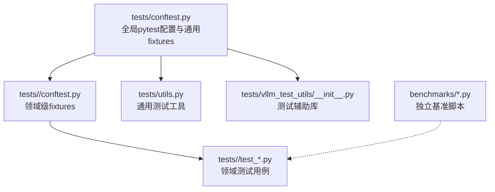
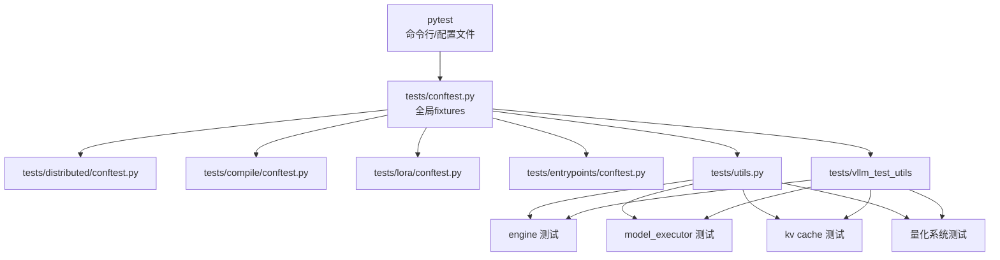
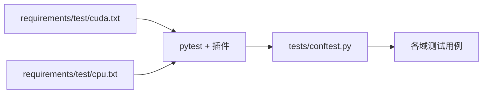

# 单元测试

<cite>
**本文引用的文件**   
- [tests/conftest.py](file://tests/conftest.py)
- [pyproject.toml](file://pyproject.toml)
- [requirements/test/cuda.txt](file://requirements/test/cuda.txt)
- [requirements/test/cpu.txt](file://requirements/test/cpu.txt)
- [tests/utils.py](file://tests/utils.py)
- [tests/vllm_test_utils/__init__.py](file://tests/vllm_test_utils/__init__.py)
- [tests/distributed/conftest.py](file://tests/distributed/conftest.py)
- [tests/compile/conftest.py](file://tests/compile/conftest.py)
- [tests/lora/conftest.py](file://tests/lora/conftest.py)
- [tests/entrypoints/conftest.py](file://tests/entrypoints/conftest.py)
- [benchmarks/benchmark_serving.py](file://benchmarks/benchmark_serving.py)
- [benchmarks/benchmark_latency.py](file://benchmarks/benchmark_latency.py)
- [benchmarks/benchmark_throughput.py](file://benchmarks/benchmark_throughput.py)
- [tests/kernels/test_cache_kernels.py](file://tests/kernels/test_cache_kernels.py)
- [tests/model_executor/test_weight_utils.py](file://tests/model_executor/test_weight_utils.py)
- [tests/quantization/test_quantization.py](file://tests/quantization/test_quantization.py)
</cite>

## 目录
1. [简介](#简介)
2. [项目结构](#项目结构)
3. [核心组件](#核心组件)
4. [架构总览](#架构总览)
5. [详细组件分析](#详细组件分析)
6. [依赖分析](#依赖分析)
7. [性能考虑](#性能考虑)
8. [故障排查指南](#故障排查指南)
9. [结论](#结论)
10. [附录](#附录)

## 简介
本文件系统性梳理 vLLM 的单元测试框架与最佳实践，覆盖测试组织、命名规范、pytest 配置、fixtures 使用与参数化策略；并给出高质量单测编写方法（模拟对象、依赖注入、断言）；同时针对引擎组件、模型执行器、缓存管理与量化系统等核心模块提供测试策略；最后补充测试数据准备与环境隔离、性能测试与内存泄漏检测的实践建议。

## 项目结构
vLLM 的测试代码集中于 tests 目录，按功能域划分：
- 顶层 conftest.py：全局 pytest 配置、插件启用、通用 fixtures、环境隔离开关等
- 子目录 conftest.py：领域级 fixtures 与夹具（如 distributed、compile、lora、entrypoints）
- 各功能域测试文件：engine、model_executor、quantization、kernels、distributed、multimodal、tokenizers 等
- 基准与性能：benchmarks 目录下的独立基准脚本（非 pytest 用例）
- 测试工具：tests/utils.py、tests/vllm_test_utils 提供通用辅助函数与夹具

图表来源
- [tests/conftest.py](file://tests/conftest.py)
- [tests/distributed/conftest.py](file://tests/distributed/conftest.py)
- [tests/compile/conftest.py](file://tests/compile/conftest.py)
- [tests/lora/conftest.py](file://tests/lora/conftest.py)
- [tests/entrypoints/conftest.py](file://tests/entrypoints/conftest.py)
- [tests/utils.py](file://tests/utils.py)
- [tests/vllm_test_utils/__init__.py](file://tests/vllm_test_utils/__init__.py)
- [benchmarks/benchmark_serving.py](file://benchmarks/benchmark_serving.py)

章节来源
- [tests/conftest.py](file://tests/conftest.py)
- [pyproject.toml](file://pyproject.toml)

## 核心组件
- pytest 配置与插件
  - pyproject.toml 中集中声明 pytest 相关选项与插件（例如并行运行、覆盖率、日志级别、标记过滤等）
  - tests/conftest.py 中启用必要的 pytest 插件、设置默认标记、注册全局 fixtures
- 通用 fixtures
  - 设备与后端选择（CPU/CUDA/ROCm/XPU）、随机种子、临时目录、日志级别、进程隔离开关
  - 领域 fixtures：分布式启动、编译上下文、LoRA 管理器、OpenAI 服务端夹具等
- 参数化与标记
  - 通过 pytest.mark.parametrize 进行多组输入输出验证
  - 通过自定义标记（如 @pytest.mark.slow、@pytest.mark.gpu）控制用例执行范围
- 断言与比较
  - 数值比较使用近似断言（allclose、isclose），字符串与结构化输出使用专用断言
  - 对 GPU 张量需先同步或拷贝到 CPU 再断言

章节来源
- [pyproject.toml](file://pyproject.toml)
- [tests/conftest.py](file://tests/conftest.py)
- [tests/distributed/conftest.py](file://tests/distributed/conftest.py)
- [tests/compile/conftest.py](file://tests/compile/conftest.py)
- [tests/lora/conftest.py](file://tests/lora/conftest.py)
- [tests/entrypoints/conftest.py](file://tests/entrypoints/conftest.py)

## 架构总览
下图展示了 vLLM 测试体系的整体架构：pytest 作为统一入口，加载全局与领域 fixtures，驱动具体测试用例；用例调用被测模块（引擎、模型执行器、缓存、量化等），并通过工具库进行断言与资源清理。

图表来源
- [tests/conftest.py](file://tests/conftest.py)
- [tests/distributed/conftest.py](file://tests/distributed/conftest.py)
- [tests/compile/conftest.py](file://tests/compile/conftest.py)
- [tests/lora/conftest.py](file://tests/lora/conftest.py)
- [tests/entrypoints/conftest.py](file://tests/entrypoints/conftest.py)
- [tests/utils.py](file://tests/utils.py)
- [tests/vllm_test_utils/__init__.py](file://tests/vllm_test_utils/__init__.py)

## 详细组件分析

### pytest 配置与插件
- 在 pyproject.toml 中集中管理 pytest 行为（并行、覆盖率、日志、标记过滤）
- tests/conftest.py 中启用插件、设置默认标记、注册全局 fixtures（设备、随机种子、临时目录、日志）
- 推荐做法：
  - 使用 --forked 或进程隔离避免跨用例状态污染
  - 使用 -n 并行加速，但注意 GPU 资源竞争
  - 使用 -m 标记筛选（如 gpu、slow、nightly）

章节来源
- [pyproject.toml](file://pyproject.toml)
- [tests/conftest.py](file://tests/conftest.py)

### 通用 fixtures 与领域 fixtures
- 全局 fixtures：设备初始化、随机种子、临时工作目录、日志级别、进程隔离开关
- 领域 fixtures：
  - distributed：多进程/多卡启动、通信后端、拓扑配置
  - compile：编译上下文、图优化开关、缓存路径
  - lora：LoRA 管理器、权重加载、适配器切换
  - entrypoints：OpenAI/Anthropic 等服务端夹具、请求构造、响应校验
- 推荐做法：
  - 将重型资源（模型、分词器、GPU 上下文）放入 fixture 并按需作用域（function/session）
  - 使用 yield 实现后置清理，确保资源释放

章节来源
- [tests/distributed/conftest.py](file://tests/distributed/conftest.py)
- [tests/compile/conftest.py](file://tests/compile/conftest.py)
- [tests/lora/conftest.py](file://tests/lora/conftest.py)
- [tests/entrypoints/conftest.py](file://tests/entrypoints/conftest.py)

### 参数化测试与标记
- 使用 pytest.mark.parametrize 组织多组输入输出，提升覆盖率
- 使用自定义标记（gpu、slow、nightly、requires_xxx）控制执行条件
- 结合 fixture 的参数化，动态生成测试场景（不同精度、不同后端、不同 batch size）

章节来源
- [tests/conftest.py](file://tests/conftest.py)

### 模拟对象与依赖注入
- 使用 unittest.mock.patch 或 pytest-mock 替换外部依赖（网络、磁盘、硬件接口）
- 通过构造函数或 setter 注入 mock 对象，便于隔离被测单元
- 对 GPU 操作，优先在 CPU 侧断言或使用轻量 stub

章节来源
- [tests/utils.py](file://tests/utils.py)

### 断言方法与数值比较
- 数值比较使用 allclose/isclose，指定 rtol/atol 容忍度
- 结构化输出使用专用断言（JSON Schema、字段存在性、顺序无关比较）
- GPU 张量断言前需 .cpu() 或 .item()

章节来源
- [tests/utils.py](file://tests/utils.py)

### 测试数据准备与环境隔离
- 测试数据：
  - 小样本 JSON/CSV 放在 tests/fixtures 或同目录 data 文件夹
  - 使用相对路径与临时目录，避免硬编码绝对路径
- 环境隔离：
  - 每个用例独立进程/线程，避免共享状态
  - 使用环境变量控制后端、设备、日志级别
  - 对分布式测试，使用独立的端口与临时工作空间

章节来源
- [tests/utils.py](file://tests/utils.py)
- [tests/vllm_test_utils/__init__.py](file://tests/vllm_test_utils/__init__.py)

### 引擎组件测试策略
- 目标：验证推理管线关键路径（prefill/decode、调度、KV 插入、采样）
- 方法：
  - 使用最小模型与短序列快速回归
  - 参数化不同 attention backend、dtype、batch size
  - 断言输出 token 分布、logprobs、中间状态一致性
- 参考用例：
  - 基础正确性与内存占用检查
  - 预取与 offload 路径验证

章节来源
- [tests/basic_correctness/test_basic_correctness.py](file://tests/basic_correctness/test_basic_correctness.py)
- [tests/basic_correctness/test_mem.py](file://tests/basic_correctness/test_mem.py)

### 模型执行器测试策略
- 目标：验证权重加载、层实现、算子分发、精度对齐
- 方法：
  - 对比参考实现或 golden 输出
  - 参数化不同 dtype、并行策略、量化方案
  - 使用 weight_utils 辅助加载与校验
- 参考用例：
  - 权重工具与加载流程
  - 特定模型特性（如 hidden_act、mrope）

章节来源
- [tests/model_executor/test_weight_utils.py](file://tests/model_executor/test_weight_utils.py)
- [tests/model_executor/test_gemma_hidden_act.py](file://tests/model_executor/test_gemma_hidden_act.py)
- [tests/model_executor/test_keye_mrope.py](file://tests/model_executor/test_keye_mrope.py)

### 缓存管理测试策略
- 目标：验证 KV Cache 分配、复用、压缩、换入换出
- 方法：
  - 构造重复前缀与长上下文场景
  - 监控块池使用率、命中率、碎片率
  - 对比不同策略（block size、watermark、offload）
- 参考用例：
  - 缓存内核正确性与性能

章节来源
- [tests/kernels/test_cache_kernels.py](file://tests/kernels/test_cache_kernels.py)

### 量化系统测试策略
- 目标：验证量化/反量化、缩放因子、精度损失、算子融合
- 方法：
  - 对比全精度与量化后输出的误差阈值
  - 参数化不同量化格式（INT8、FP8、W4A16、NVFP4 等）
  - 覆盖常见激活与 GEMM 路径
- 参考用例：
  - 量化契约与融合算子

章节来源
- [tests/quantization/test_quantization.py](file://tests/quantization/test_quantization.py)
- [tests/fusion/test_quant_activation_contract.py](file://tests/fusion/test_quant_activation_contract.py)

### 端到端 API 与服务测试
- 目标：验证 OpenAI/Anthropic/serve 等入口的请求处理、流式输出、错误码
- 方法：
  - 使用 entrypoints 夹具启动服务，发送请求并断言响应
  - 参数化不同模型、并发、超时、重试策略
- 参考用例：
  - OpenAI chat/completions、streaming、structured output

章节来源
- [tests/entrypoints/conftest.py](file://tests/entrypoints/conftest.py)

## 依赖分析
- 测试依赖由 requirements/test 下文件管理（cuda、cpu、dev 等）
- pyproject.toml 声明 pytest 及插件依赖
- 测试间耦合点：
  - 全局 fixtures 与设备初始化
  - 分布式与编译上下文共享资源
- 潜在循环依赖：应避免在 fixtures 中导入被测模块的全局副作用

图表来源
- [requirements/test/cuda.txt](file://requirements/test/cuda.txt)
- [requirements/test/cpu.txt](file://requirements/test/cpu.txt)
- [tests/conftest.py](file://tests/conftest.py)

章节来源
- [requirements/test/cuda.txt](file://requirements/test/cuda.txt)
- [requirements/test/cpu.txt](file://requirements/test/cpu.txt)
- [pyproject.toml](file://pyproject.toml)

## 性能考虑
- 基准脚本位于 benchmarks 目录，独立于 pytest 用例，用于吞吐、延迟、启动开销评估
- 建议在 CI 中按需运行关键路径基准（短序列、典型 batch）
- 内存泄漏检测：
  - 使用 tracemalloc 或 memory_profiler 在关键用例前后采集快照
  - 对 GPU 显存，使用 torch.cuda.memory_summary 与 nvidia-smi 辅助定位
  - 对分布式/多进程，注意进程退出后的句柄与缓冲区清理

章节来源
- [benchmarks/benchmark_serving.py](file://benchmarks/benchmark_serving.py)
- [benchmarks/benchmark_latency.py](file://benchmarks/benchmark_latency.py)
- [benchmarks/benchmark_throughput.py](file://benchmarks/benchmark_throughput.py)

## 故障排查指南
- 常见问题
  - 设备未就绪：确认 CUDA/ROCm/XPU 驱动与版本，检查环境变量
  - 端口冲突：分布式/服务测试使用固定端口时易冲突，建议使用动态端口
  - 内存不足：降低 batch size、序列长度或启用 offload
  - 精度不匹配：调整 atol/rtol，确认 dtype 与后端差异
- 调试技巧
  - 使用 -v -s 打印详细日志
  - 使用 pytest-xdist 的 --forked 隔离进程
  - 对 GPU 问题，增加同步点与显存统计

章节来源
- [tests/conftest.py](file://tests/conftest.py)
- [tests/distributed/conftest.py](file://tests/distributed/conftest.py)

## 结论
vLLM 的测试体系以 pytest 为核心，通过分层 fixtures、参数化与标记机制，覆盖从内核到 API 的多层质量保障。遵循本文的组织规范、模拟与断言实践、以及性能与内存检测建议，可显著提升单测的可维护性与稳定性。

## 附录
- 命名规范
  - 文件：test_<module>.py
  - 函数：test_<scenario>_<expected>
  - 类：Test<Domain><Feature>
- 常用命令
  - 运行全部：pytest
  - 仅 GPU：pytest -m gpu
  - 并行：pytest -n auto
  - 覆盖率：pytest --cov=vllm --cov-report=html