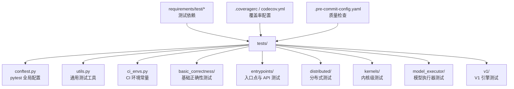
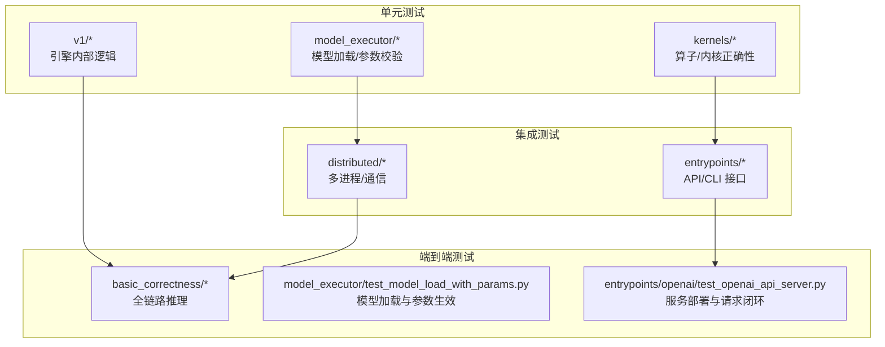
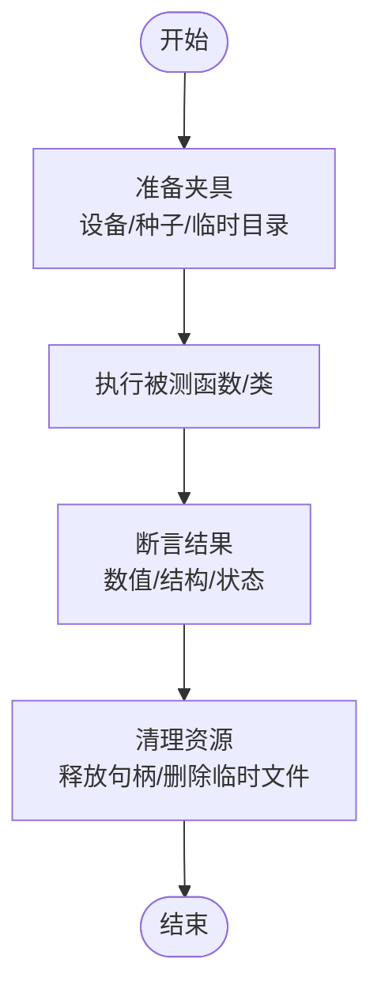
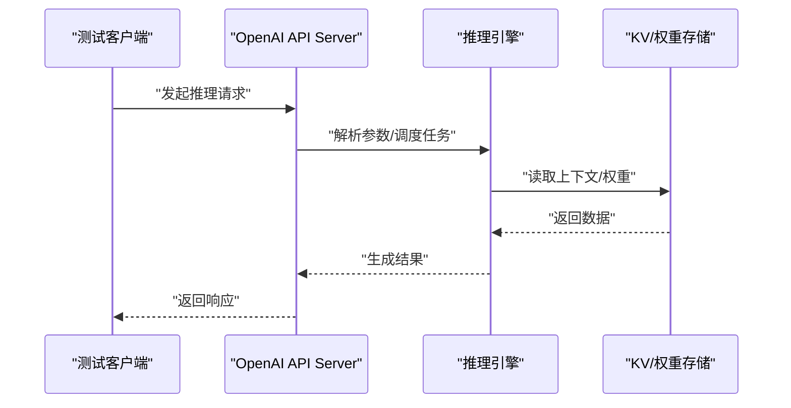
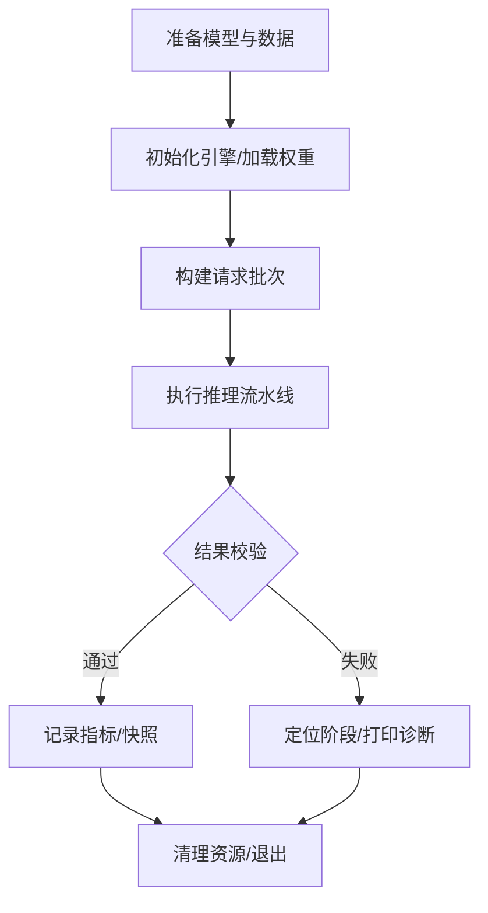
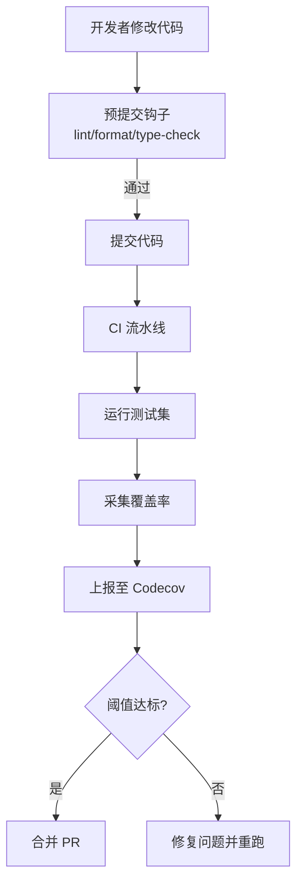
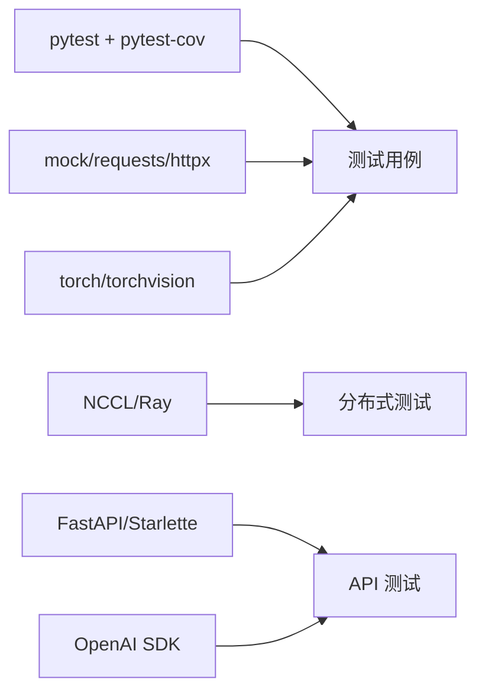

# 测试框架

<cite>
**本文引用的文件**   
- [tests/conftest.py](file://tests/conftest.py)
- [tests/utils.py](file://tests/utils.py)
- [tests/ci_envs.py](file://tests/ci_envs.py)
- [requirements/test/cuda.txt](file://requirements/test/cuda.txt)
- [requirements/test/cpu.txt](file://requirements/test/cpu.txt)
- [.coveragerc](file://.coveragerc)
- [codecov.yml](file://codecov.yml)
- [.pre-commit-config.yaml](file://.pre-commit-config.yaml)
- [tests/basic_correctness/test_basic_correctness.py](file://tests/basic_correctness/test_basic_correctness.py)
- [tests/entrypoints/openai/test_openai_api_server.py](file://tests/entrypoints/openai/test_openai_api_server.py)
- [tests/distributed/test_distributed_oot.py](file://tests/distributed/test_distributed_oot.py)
- [tests/kernels/test_cache_kernels.py](file://tests/kernels/test_cache_kernels.py)
- [tests/v1/engine/test_engine_v1.py](file://tests/v1/engine/test_engine_v1.py)
- [tests/model_executor/test_model_load_with_params.py](file://tests/model_executor/test_model_load_with_params.py)
</cite>

## 目录
1. [简介](#简介)
2. [项目结构](#项目结构)
3. [核心组件](#核心组件)
4. [架构总览](#架构总览)
5. [详细组件分析](#详细组件分析)
6. [依赖关系分析](#依赖关系分析)
7. [性能考量](#性能考量)
8. [故障排查指南](#故障排查指南)
9. [结论](#结论)
10. [附录](#附录)

## 简介
本文件系统性介绍 vLLM 的测试框架架构与使用方法，覆盖单元测试组织、模拟对象与断言规范、集成测试（多组件交互、数据库、API）、端到端测试（完整推理流程、模型加载、服务部署），以及测试环境搭建、覆盖率统计与质量检查配置，并给出常见问题排查方案。内容基于仓库中的测试代码与配置文件进行归纳总结，便于不同技术背景的读者快速上手与维护。

## 项目结构
vLLM 的测试代码集中在 tests 目录下，按功能域与层次划分：
- 顶层 conftest.py：全局 pytest 配置、夹具、命令行选项与环境变量管理
- utils.py：通用测试工具（如 GPU/CPU 检测、随机种子、临时目录等）
- ci_envs.py：CI 环境与平台相关常量与开关
- requirements/test/*：测试依赖清单（CPU/GPU/ROCm/XPU 等）
- .coveragerc 与 codecov.yml：覆盖率采集与上报配置
- .pre-commit-config.yaml：提交前代码质量检查（lint、格式化、类型检查等）
- 各子目录对应模块或特性：basic_correctness、entrypoints、distributed、kernels、model_executor、v1 等

**图示来源** 
- [tests/conftest.py](file://tests/conftest.py)
- [tests/utils.py](file://tests/utils.py)
- [tests/ci_envs.py](file://tests/ci_envs.py)
- [requirements/test/cuda.txt](file://requirements/test/cuda.txt)
- [.coveragerc](file://.coveragerc)
- [codecov.yml](file://codecov.yml)
- [.pre-commit-config.yaml](file://.pre-commit-config.yaml)

**章节来源**
- [tests/conftest.py](file://tests/conftest.py)
- [tests/utils.py](file://tests/utils.py)
- [tests/ci_envs.py](file://tests/ci_envs.py)
- [requirements/test/cuda.txt](file://requirements/test/cuda.txt)
- [requirements/test/cpu.txt](file://requirements/test/cpu.txt)
- [.coveragerc](file://.coveragerc)
- [codecov.yml](file://codecov.yml)
- [.pre-commit-config.yaml](file://.pre-commit-config.yaml)

## 核心组件
- pytest 全局配置与夹具：通过 tests/conftest.py 统一注册 CLI 选项、环境变量注入、共享夹具（如设备选择、随机种子、临时工作区、日志级别等），确保测试可重复性与隔离性
- 通用测试工具：tests/utils.py 提供跨测试复用的辅助函数（如 GPU/CPU 可用性判断、进程/端口管理、数据生成与清理等）
- CI 环境常量：tests/ci_envs.py 集中定义平台与硬件相关的开关，便于在 CI 中按需启用/跳过特定用例
- 测试依赖管理：requirements/test/* 按平台拆分依赖，便于在不同环境中安装最小化测试集
- 覆盖率与质量门禁：.coveragerc 与 codecov.yml 控制覆盖率采集范围与上传；.pre-commit-config.yaml 统一 lint/format/type-check 等前置检查

**章节来源**
- [tests/conftest.py](file://tests/conftest.py)
- [tests/utils.py](file://tests/utils.py)
- [tests/ci_envs.py](file://tests/ci_envs.py)
- [requirements/test/cuda.txt](file://requirements/test/cuda.txt)
- [requirements/test/cpu.txt](file://requirements/test/cpu.txt)
- [.coveragerc](file://.coveragerc)
- [codecov.yml](file://codecov.yml)
- [.pre-commit-config.yaml](file://.pre-commit-config.yaml)

## 架构总览
测试框架采用“分层+分域”的组织方式：
- 单元层：针对具体模块/函数的细粒度测试，强调确定性、快速反馈
- 集成层：跨模块协作（如 entrypoints、distributed、kernels）验证接口契约与数据流
- 端到端层：从模型加载到推理服务的全链路验证，关注稳定性与性能基线

**图示来源** 
- [tests/kernels/test_cache_kernels.py](file://tests/kernels/test_cache_kernels.py)
- [tests/model_executor/test_model_load_with_params.py](file://tests/model_executor/test_model_load_with_params.py)
- [tests/v1/engine/test_engine_v1.py](file://tests/v1/engine/test_engine_v1.py)
- [tests/entrypoints/openai/test_openai_api_server.py](file://tests/entrypoints/openai/test_openai_api_server.py)
- [tests/distributed/test_distributed_oot.py](file://tests/distributed/test_distributed_oot.py)
- [tests/basic_correctness/test_basic_correctness.py](file://tests/basic_correctness/test_basic_correctness.py)

## 详细组件分析

### 单元测试组织与规范
- 用例命名与结构：以 test_*.py 为文件命名约定，类内方法以 test_ 开头；每个用例聚焦单一职责，保证幂等与可并行执行
- 夹具与资源管理：通过 conftest.py 提供设备、随机种子、临时目录、日志级别等夹具，避免重复样板代码
- 断言方法：优先使用 pytest 内置断言与自定义数值比较（考虑浮点误差容忍），对输出结构进行 schema 校验
- 模拟对象：对外部依赖（网络、文件系统、GPU 设备）使用 mock/patch 隔离副作用，确保测试稳定

**章节来源**
- [tests/conftest.py](file://tests/conftest.py)
- [tests/utils.py](file://tests/utils.py)

### 集成测试实施
- 多组件交互：entrypoints 与 engine 之间的调用链、分布式通信与同步机制，通过 fixtures 启动轻量服务或进程模拟真实场景
- 数据库/存储：若涉及持久化（如 KV Cache、权重缓存），使用内存或临时文件系统替代，确保隔离与快速回滚
- API 接口测试：构造 HTTP/gRPC 请求，校验响应码、字段与语义一致性，必要时加入超时与重试策略

**图示来源** 
- [tests/entrypoints/openai/test_openai_api_server.py](file://tests/entrypoints/openai/test_openai_api_server.py)
- [tests/distributed/test_distributed_oot.py](file://tests/distributed/test_distributed_oot.py)

**章节来源**
- [tests/entrypoints/openai/test_openai_api_server.py](file://tests/entrypoints/openai/test_openai_api_server.py)
- [tests/distributed/test_distributed_oot.py](file://tests/distributed/test_distributed_oot.py)

### 端到端测试执行
- 完整推理流程：从输入预处理、模型加载、注意力计算到输出解码的全链路验证，关注吞吐与时延基线
- 模型加载测试：校验权重加载路径、量化/LoRA 插件、参数合并与设备映射的正确性
- 服务部署测试：拉起服务进程，发送典型负载，验证健康检查、错误恢复与资源回收

**章节来源**
- [tests/basic_correctness/test_basic_correctness.py](file://tests/basic_correctness/test_basic_correctness.py)
- [tests/model_executor/test_model_load_with_params.py](file://tests/model_executor/test_model_load_with_params.py)
- [tests/entrypoints/openai/test_openai_api_server.py](file://tests/entrypoints/openai/test_openai_api_server.py)

### 测试环境搭建指南
- 依赖安装：根据目标平台选择 requirements/test/*.txt（如 cuda.txt、cpu.txt、rocm.txt、xpu.txt），使用 pip 安装
- 测试数据准备：准备模型权重、示例文本/图像、KV Cache 基准数据；建议使用本地缓存目录与只读挂载
- 环境配置：设置必要的环境变量（如 CUDA_VISIBLE_DEVICES、NCCL_*、VLLM_*），并通过 conftest 的 CLI 选项控制行为

**章节来源**
- [requirements/test/cuda.txt](file://requirements/test/cuda.txt)
- [requirements/test/cpu.txt](file://requirements/test/cpu.txt)
- [tests/conftest.py](file://tests/conftest.py)

### 覆盖率统计与质量检查
- 覆盖率采集：.coveragerc 指定源目录、排除规则与输出格式；运行 pytest --cov 生成报告
- 覆盖率上报：codecov.yml 配置分支、阈值与上传 token，CI 中自动聚合与展示
- 质量门禁：.pre-commit-config.yaml 集成 flake8/black/mypy/ruff 等工具，提交前自动检查

**图示来源** 
- [.coveragerc](file://.coveragerc)
- [codecov.yml](file://codecov.yml)
- [.pre-commit-config.yaml](file://.pre-commit-config.yaml)

**章节来源**
- [.coveragerc](file://.coveragerc)
- [codecov.yml](file://codecov.yml)
- [.pre-commit-config.yaml](file://.pre-commit-config.yaml)

## 依赖关系分析
测试套件依赖 Python 包管理与平台特定库，关键依赖包括：
- 测试框架与工具：pytest、pytest-cov、mock、requests/httpx 等
- 平台驱动：CUDA/ROCm/XPU 相关库与 torch/torchvision
- 分布式通信：NCCL、Ray、torch.distributed
- 服务与协议：FastAPI/Starlette、gRPC、OpenAI SDK

**图示来源** 
- [requirements/test/cuda.txt](file://requirements/test/cuda.txt)
- [requirements/test/cpu.txt](file://requirements/test/cpu.txt)
- [tests/distributed/test_distributed_oot.py](file://tests/distributed/test_distributed_oot.py)
- [tests/entrypoints/openai/test_openai_api_server.py](file://tests/entrypoints/openai/test_openai_api_server.py)

**章节来源**
- [requirements/test/cuda.txt](file://requirements/test/cuda.txt)
- [requirements/test/cpu.txt](file://requirements/test/cpu.txt)
- [tests/distributed/test_distributed_oot.py](file://tests/distributed/test_distributed_oot.py)
- [tests/entrypoints/openai/test_openai_api_server.py](file://tests/entrypoints/openai/test_openai_api_server.py)

## 性能考量
- 测试隔离与并行：合理拆分测试集，避免共享状态冲突；使用 pytest-xdist 提升并发效率
- 资源上限控制：限制 GPU 显存占用、进程数与超时时间，防止 CI 资源耗尽
- 基准与回归：对关键路径（如注意力、KV Cache、采样）建立性能基线，定期回归检测
- 数据复用：缓存模型权重与中间结果，减少 IO 开销

[本节为通用指导，不直接分析具体文件]

## 故障排查指南
- 常见环境问题：CUDA/ROCm 版本不匹配、NCCL 初始化失败、端口占用；可通过环境变量与日志级别定位
- 依赖缺失：确认 requirements/test/*.txt 已安装，必要时升级 torch 与第三方库
- 测试不稳定：检查随机种子、异步操作与资源清理；增加重试与超时保护
- 覆盖率异常：核对 .coveragerc 的 include/exclude 规则，确保源文件路径正确

**章节来源**
- [tests/ci_envs.py](file://tests/ci_envs.py)
- [tests/conftest.py](file://tests/conftest.py)
- [.coveragerc](file://.coveragerc)

## 结论
vLLM 的测试框架以 pytest 为核心，结合清晰的目录结构与统一的夹具/工具，实现了从单元到端到端的分层验证。通过严格的依赖管理、覆盖率与质量门禁，保障了代码质量与持续交付效率。建议在新功能开发时遵循现有规范，完善对应层级的测试用例，并在 CI 中保持稳定的质量门槛。

[本节为总结性内容，不直接分析具体文件]

## 附录
- 常用命令参考：
  - 安装测试依赖：pip install -r requirements/test/cuda.txt（或 cpu.txt）
  - 运行单测：pytest tests/... -v --cov=vllm --cov-report=html
  - 仅运行某类测试：pytest tests/kernels -k cache
  - 预提交检查：pre-commit run --all-files
- 调试技巧：
  - 提高日志级别：设置 VLLM_LOG_LEVEL=DEBUG
  - 限制设备：CUDA_VISIBLE_DEVICES=0 pytest ...
  - 捕获堆栈：pytest --tb=long -s

[本节为补充信息，不直接分析具体文件]