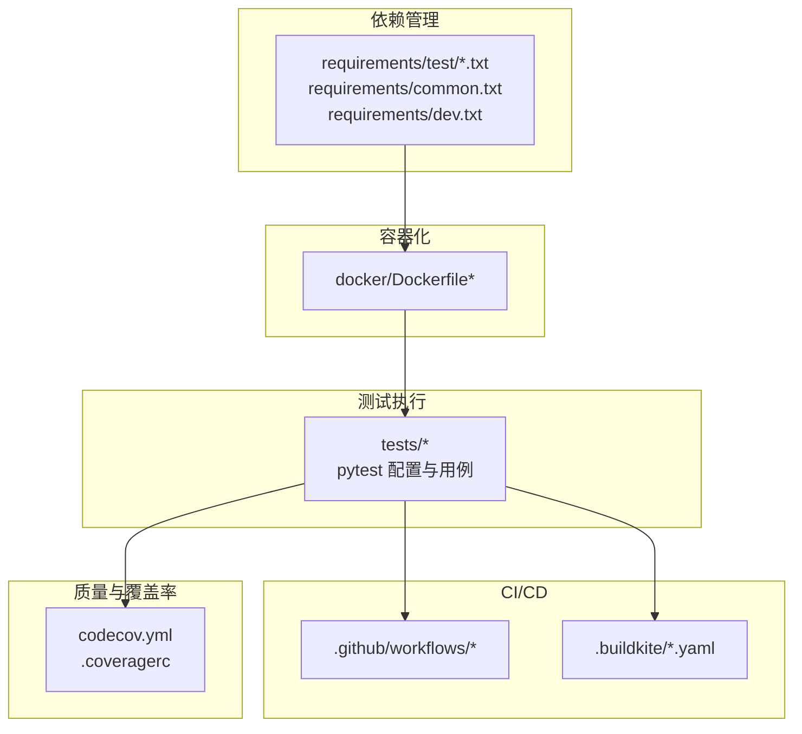
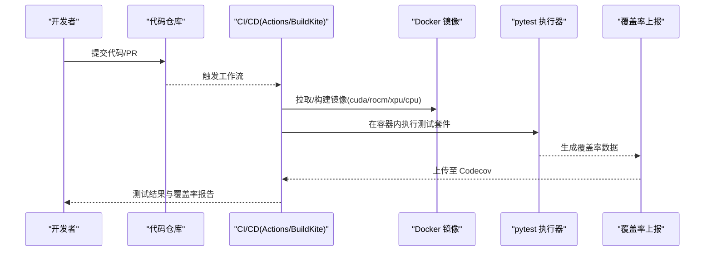
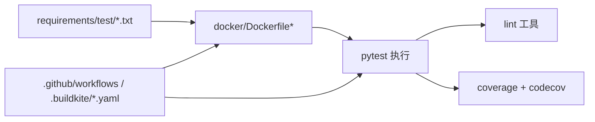

# 测试环境

<cite>
**本文引用的文件**   
- [requirements/test/cuda.txt](file://requirements/test/cuda.txt)
- [requirements/test/cuda.in](file://requirements/test/cuda.in)
- [requirements/test/rocm.txt](file://requirements/test/rocm.txt)
- [requirements/test/rocm.in](file://requirements/test/rocm.in)
- [requirements/test/xpu.txt](file://requirements/test/xpu.txt)
- [requirements/test/xpu.in](file://requirements/test/xpu.in)
- [requirements/test/cpu.txt](file://requirements/test/cpu.txt)
- [requirements/common.txt](file://requirements/common.txt)
- [requirements/dev.txt](file://requirements/dev.txt)
- [requirements/lint.txt](file://requirements/lint.txt)
- [.github/workflows](file://.github/workflows)
- [.buildkite/test-pipeline.yaml](file://.buildkite/test-pipeline.yaml)
- [.buildkite/ci_config.yaml](file://.buildkite/ci_config.yaml)
- [.buildkite/ci_config_rocm.yaml](file://.buildkite/ci_config_rocm.yaml)
- [docker/Dockerfile](file://docker/Dockerfile)
- [docker/Dockerfile.rocm](file://docker/Dockerfile.rocm)
- [docker/Dockerfile.cpu](file://docker/Dockerfile.cpu)
- [tests/conftest.py](file://tests/conftest.py)
- [tests/ci_envs.py](file://tests/ci_envs.py)
- [codecov.yml](file://codecov.yml)
- [.coveragerc](file://.coveragerc)
- [pyproject.toml](file://pyproject.toml)
- [setup.py](file://setup.py)
</cite>

## 目录
1. [简介](#简介)
2. [项目结构](#项目结构)
3. [核心组件](#核心组件)
4. [架构总览](#架构总览)
5. [详细组件分析](#详细组件分析)
6. [依赖关系分析](#依赖关系分析)
7. [性能考虑](#性能考虑)
8. [故障排查指南](#故障排查指南)
9. [结论](#结论)
10. [附录](#附录)

## 简介
本文件面向需要在本地或CI环境中搭建与配置 vLLM 测试环境的工程师，系统性说明：
- 测试依赖的安装与管理（CUDA、ROCm、XPU、CPU）
- GPU驱动与运行时环境要求
- 测试数据准备与管理（模型权重、输入数据、预期输出）
- 测试环境隔离与清理机制（临时文件、资源释放）
- CI/CD流水线配置（GitHub Actions 工作流与 BuildKite 流水线）
- 测试覆盖率统计与质量检查工具的配置方法

## 项目结构
vLLM 的测试环境与依赖管理采用“分层需求文件 + 容器镜像 + 多平台构建”的组织方式：
- requirements/test 下按硬件后端划分测试依赖（cuda、rocm、xpu、cpu），并配合 .in/.txt 锁定版本
- docker 目录提供不同后端的 Dockerfile，用于在隔离容器中运行测试
- tests 目录包含 pytest 配置与测试用例；conftest.py 集中管理测试夹具与全局行为
- .github/workflows 与 .buildkite 分别定义 GitHub Actions 与 BuildKite 的自动化流程
- codecov.yml 与 .coveragerc 控制覆盖率采集与报告

图表来源
- [requirements/test/cuda.txt](file://requirements/test/cuda.txt)
- [requirements/test/rocm.txt](file://requirements/test/rocm.txt)
- [requirements/test/xpu.txt](file://requirements/test/xpu.txt)
- [requirements/test/cpu.txt](file://requirements/test/cpu.txt)
- [requirements/common.txt](file://requirements/common.txt)
- [requirements/dev.txt](file://requirements/dev.txt)
- [docker/Dockerfile](file://docker/Dockerfile)
- [docker/Dockerfile.rocm](file://docker/Dockerfile.rocm)
- [docker/Dockerfile.cpu](file://docker/Dockerfile.cpu)
- [tests/conftest.py](file://tests/conftest.py)
- [.github/workflows](file://.github/workflows)
- [.buildkite/test-pipeline.yaml](file://.buildkite/test-pipeline.yaml)
- [.buildkite/ci_config.yaml](file://.buildkite/ci_config.yaml)
- [.buildkite/ci_config_rocm.yaml](file://.buildkite/ci_config_rocm.yaml)
- [codecov.yml](file://codecov.yml)
- [.coveragerc](file://.coveragerc)

章节来源
- [requirements/test/cuda.txt](file://requirements/test/cuda.txt)
- [requirements/test/rocm.txt](file://requirements/test/rocm.txt)
- [requirements/test/xpu.txt](file://requirements/test/xpu.txt)
- [requirements/test/cpu.txt](file://requirements/test/cpu.txt)
- [requirements/common.txt](file://requirements/common.txt)
- [requirements/dev.txt](file://requirements/dev.txt)
- [docker/Dockerfile](file://docker/Dockerfile)
- [docker/Dockerfile.rocm](file://docker/Dockerfile.rocm)
- [docker/Dockerfile.cpu](file://docker/Dockerfile.cpu)
- [tests/conftest.py](file://tests/conftest.py)
- [.github/workflows](file://.github/workflows)
- [.buildkite/test-pipeline.yaml](file://.buildkite/test-pipeline.yaml)
- [.buildkite/ci_config.yaml](file://.buildkite/ci_config.yaml)
- [.buildkite/ci_config_rocm.yaml](file://.buildkite/ci_config_rocm.yaml)
- [codecov.yml](file://codecov.yml)
- [.coveragerc](file://.coveragerc)

## 核心组件
- 依赖管理
  - 使用 requirements/test 下的分平台文本文件安装测试依赖，确保 CUDA/ROCm/XPU/CPU 环境一致性与可复现性
  - common.txt 与 dev.txt 提供通用与开发期依赖，lint.txt 提供代码质量检查工具
- 容器化
  - 通过 docker/Dockerfile* 为不同后端构建镜像，内置 CUDA/ROCm/XPU 运行时与必要系统库
- 测试框架
  - 基于 pytest，tests/conftest.py 提供统一的夹具、标记与环境探测逻辑
- CI/CD
  - GitHub Actions 与 BuildKite 双通道触发测试，BuildKite 侧重多硬件矩阵与并行执行
- 覆盖率与质量
  - 使用 coverage 与 codecov 进行覆盖率收集与上传；.coveragerc 与 codecov.yml 控制采集范围与报告格式

章节来源
- [requirements/test/cuda.txt](file://requirements/test/cuda.txt)
- [requirements/test/rocm.txt](file://requirements/test/rocm.txt)
- [requirements/test/xpu.txt](file://requirements/test/xpu.txt)
- [requirements/test/cpu.txt](file://requirements/test/cpu.txt)
- [requirements/common.txt](file://requirements/common.txt)
- [requirements/dev.txt](file://requirements/dev.txt)
- [requirements/lint.txt](file://requirements/lint.txt)
- [docker/Dockerfile](file://docker/Dockerfile)
- [docker/Dockerfile.rocm](file://docker/Dockerfile.rocm)
- [docker/Dockerfile.cpu](file://docker/Dockerfile.cpu)
- [tests/conftest.py](file://tests/conftest.py)
- [codecov.yml](file://codecov.yml)
- [.coveragerc](file://.coveragerc)

## 架构总览
下图展示了从依赖安装到测试执行的端到端流程，以及容器化与 CI 的集成点。

图表来源
- [.github/workflows](file://.github/workflows)
- [.buildkite/test-pipeline.yaml](file://.buildkite/test-pipeline.yaml)
- [docker/Dockerfile](file://docker/Dockerfile)
- [docker/Dockerfile.rocm](file://docker/Dockerfile.rocm)
- [docker/Dockerfile.cpu](file://docker/Dockerfile.cpu)
- [tests/conftest.py](file://tests/conftest.py)
- [codecov.yml](file://codecov.yml)

## 详细组件分析

### 依赖管理与安装
- 分平台依赖
  - requirements/test/cuda.txt、requirements/test/rocm.txt、requirements/test/xpu.txt、requirements/test/cpu.txt 分别指定对应后端的测试依赖版本
  - 配套 .in 文件用于生成 .txt 锁定文件，保证依赖一致性
- 通用与开发依赖
  - requirements/common.txt 提供跨平台基础依赖
  - requirements/dev.txt 提供开发期依赖（如调试、测试辅助库）
  - requirements/lint.txt 提供 lint 工具链（如 flake8、black、ruff 等）
- 安装建议
  - 优先使用容器镜像安装依赖，避免宿主机环境差异
  - 在 CI 中按平台选择对应的 .txt 文件安装

章节来源
- [requirements/test/cuda.txt](file://requirements/test/cuda.txt)
- [requirements/test/cuda.in](file://requirements/test/cuda.in)
- [requirements/test/rocm.txt](file://requirements/test/rocm.txt)
- [requirements/test/rocm.in](file://requirements/test/rocm.in)
- [requirements/test/xpu.txt](file://requirements/test/xpu.txt)
- [requirements/test/xpu.in](file://requirements/test/xpu.in)
- [requirements/test/cpu.txt](file://requirements/test/cpu.txt)
- [requirements/common.txt](file://requirements/common.txt)
- [requirements/dev.txt](file://requirements/dev.txt)
- [requirements/lint.txt](file://requirements/lint.txt)

### CUDA/ROCm/XPU/CPU 环境配置
- CUDA
  - 需要 NVIDIA 驱动与匹配的 CUDA Toolkit
  - 使用 docker/Dockerfile 构建镜像，预装 CUDA 运行时与 cuDNN 等依赖
- ROCm
  - 需要 AMD GPU 驱动与 ROCm 运行时
  - 使用 docker/Dockerfile.rocm 构建镜像，预装 ROCm 相关库
- XPU
  - 需要 Intel XPU 驱动与运行时
  - 使用 docker/Dockerfile.xpu（若存在）或相应镜像构建
- CPU
  - 无需 GPU，使用 docker/Dockerfile.cpu 构建轻量镜像

章节来源
- [docker/Dockerfile](file://docker/Dockerfile)
- [docker/Dockerfile.rocm](file://docker/Dockerfile.rocm)
- [docker/Dockerfile.cpu](file://docker/Dockerfile.cpu)

### 测试数据准备与管理
- 模型权重
  - 测试通常通过 HuggingFace Hub 或本地路径加载模型权重
  - 建议在 CI 中缓存常用小模型权重以减少下载时间
- 输入数据与预期输出
  - 输入数据与预期输出通常以 JSON/YAML/文本形式存放在 tests 目录下
  - 建议使用 fixtures 或数据生成脚本动态构造输入，减少静态数据膨胀
- 数据隔离
  - 将测试数据与代码分离，便于独立更新与权限控制
  - 对敏感数据使用环境变量或密钥管理服务注入

章节来源
- [tests/conftest.py](file://tests/conftest.py)

### 测试环境隔离与清理机制
- 容器隔离
  - 所有测试在容器内执行，避免污染宿主环境
  - 每个任务使用独立容器实例，确保状态隔离
- 临时文件处理
  - 使用 pytest 的 tmp_path 或自定义夹具创建临时目录
  - 在 teardown 阶段清理临时文件与进程资源
- 资源释放
  - 显式关闭 GPU 上下文、句柄与共享内存
  - 在异常路径中也确保资源释放（try/finally 模式）

章节来源
- [tests/conftest.py](file://tests/conftest.py)

### CI/CD 流水线配置
- GitHub Actions
  - 工作流位于 .github/workflows，支持 PR 触发、分支保护与并行矩阵
  - 可按平台（cuda/rocm/xpu/cpu）并行执行测试
- BuildKite
  - .buildkite/test-pipeline.yaml 定义测试步骤与并行策略
  - .buildkite/ci_config.yaml 与 .buildkite/ci_config_rocm.yaml 提供平台特定配置
- 缓存与加速
  - 缓存 Python 包与模型权重，缩短构建与测试时间
  - 使用镜像层缓存提升重复构建效率

章节来源
- [.github/workflows](file://.github/workflows)
- [.buildkite/test-pipeline.yaml](file://.buildkite/test-pipeline.yaml)
- [.buildkite/ci_config.yaml](file://.buildkite/ci_config.yaml)
- [.buildkite/ci_config_rocm.yaml](file://.buildkite/ci_config_rocm.yaml)

### 测试覆盖率统计与质量检查
- 覆盖率采集
  - 使用 coverage 收集测试覆盖率，输出 XML/JSON 供 Codecov 消费
  - .coveragerc 控制采集范围、忽略规则与报告格式
  - codecov.yml 配置上传参数与分支策略
- 质量检查
  - lint.txt 提供代码风格与静态检查工具
  - 在 CI 中先执行 lint 再运行测试，快速失败原则

章节来源
- [codecov.yml](file://codecov.yml)
- [.coveragerc](file://.coveragerc)
- [requirements/lint.txt](file://requirements/lint.txt)

## 依赖关系分析
下图展示测试依赖、容器镜像与 CI 之间的依赖关系。

图表来源
- [requirements/test/cuda.txt](file://requirements/test/cuda.txt)
- [requirements/test/rocm.txt](file://requirements/test/rocm.txt)
- [requirements/test/xpu.txt](file://requirements/test/xpu.txt)
- [requirements/test/cpu.txt](file://requirements/test/cpu.txt)
- [docker/Dockerfile](file://docker/Dockerfile)
- [docker/Dockerfile.rocm](file://docker/Dockerfile.rocm)
- [docker/Dockerfile.cpu](file://docker/Dockerfile.cpu)
- [.github/workflows](file://.github/workflows)
- [.buildkite/test-pipeline.yaml](file://.buildkite/test-pipeline.yaml)

章节来源
- [requirements/test/cuda.txt](file://requirements/test/cuda.txt)
- [requirements/test/rocm.txt](file://requirements/test/rocm.txt)
- [requirements/test/xpu.txt](file://requirements/test/xpu.txt)
- [requirements/test/cpu.txt](file://requirements/test/cpu.txt)
- [docker/Dockerfile](file://docker/Dockerfile)
- [docker/Dockerfile.rocm](file://docker/Dockerfile.rocm)
- [docker/Dockerfile.cpu](file://docker/Dockerfile.cpu)
- [.github/workflows](file://.github/workflows)
- [.buildkite/test-pipeline.yaml](file://.buildkite/test-pipeline.yaml)

## 性能考虑
- 依赖安装优化
  - 使用离线缓存与镜像层缓存，减少网络与构建时间
- 测试执行优化
  - 合理拆分测试套件，按模块并行执行
  - 使用 pytest-xdist 或 CI 矩阵并行
- 资源利用优化
  - 限制单任务 GPU 数量，避免 OOM
  - 使用混合精度与量化测试时注意数值稳定性

[本节为通用指导，不直接分析具体文件]

## 故障排查指南
- 依赖冲突
  - 检查 requirements/test/*.txt 与 requirements/common.txt 的版本兼容性
  - 使用 pip 的 --no-deps 或虚拟环境隔离
- GPU 环境问题
  - 确认驱动与 CUDA/ROCm 版本匹配
  - 在容器内验证 nvidia-smi 或 rocm-smi 输出
- 测试失败定位
  - 启用详细日志与断点调试
  - 使用最小复现用例缩小问题范围
- 覆盖率缺失
  - 检查 .coveragerc 的 include/exclude 规则
  - 确认 CI 中正确生成并上传覆盖率文件

章节来源
- [tests/conftest.py](file://tests/conftest.py)
- [codecov.yml](file://codecov.yml)
- [.coveragerc](file://.coveragerc)

## 结论
通过分层依赖管理、容器化隔离与多平台 CI 流水线，vLLM 的测试环境具备高可复现性与可扩展性。建议持续维护依赖锁定文件、优化缓存策略，并完善测试数据与覆盖率配置，以提升整体质量与交付效率。

[本节为总结性内容，不直接分析具体文件]

## 附录
- 快速启动清单
  - 选择平台镜像（cuda/rocm/xpu/cpu）
  - 安装对应 requirements/test/*.txt 依赖
  - 准备测试数据（模型权重、输入/输出）
  - 在容器内执行 pytest
  - 查看覆盖率报告与 CI 结果

[本节为补充信息，不直接分析具体文件]