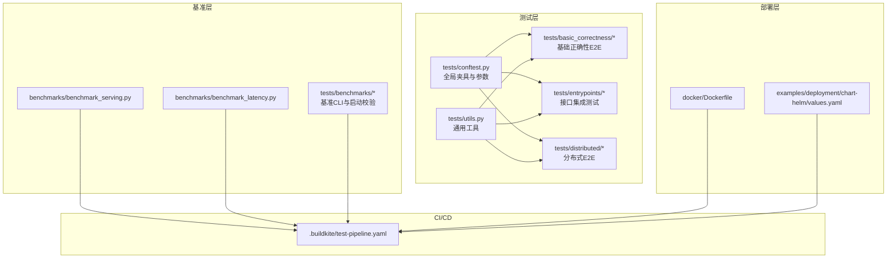
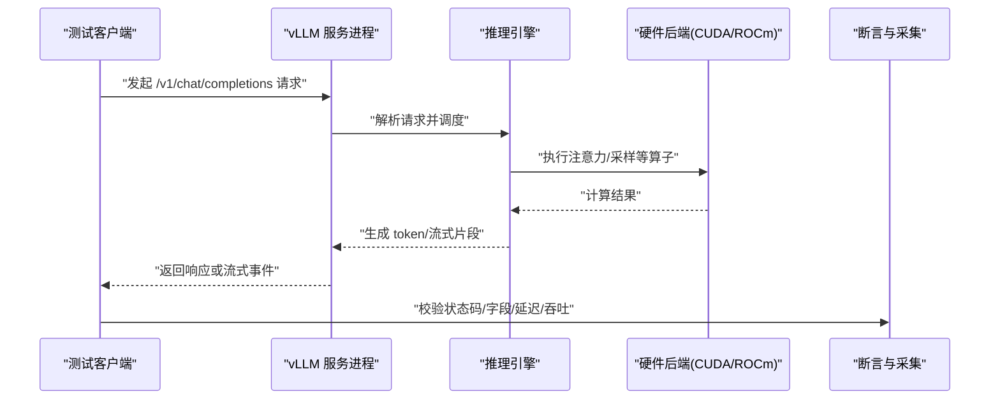
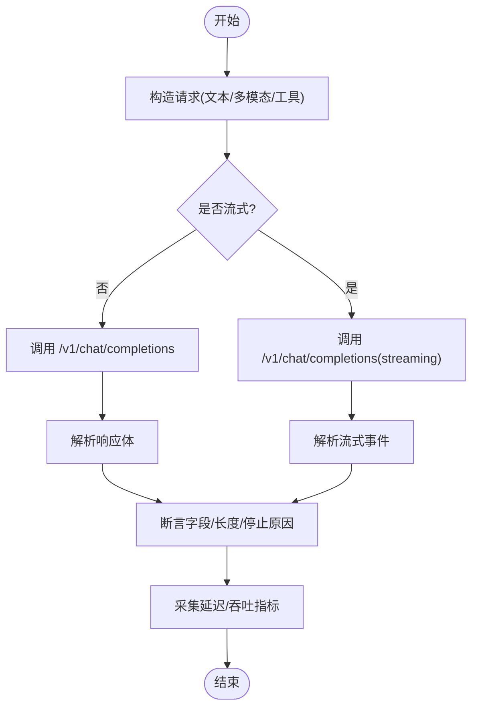
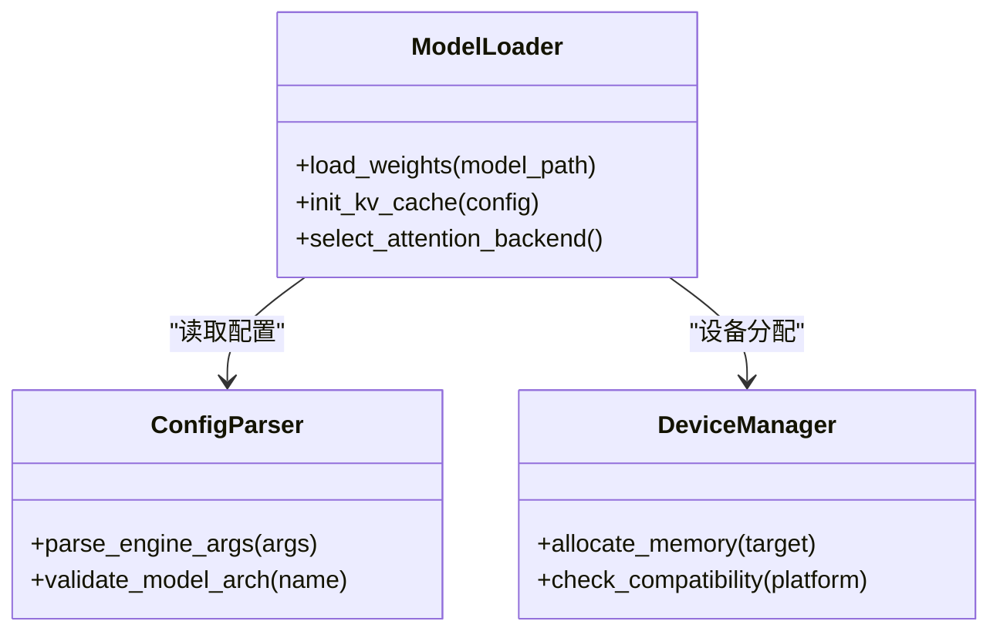
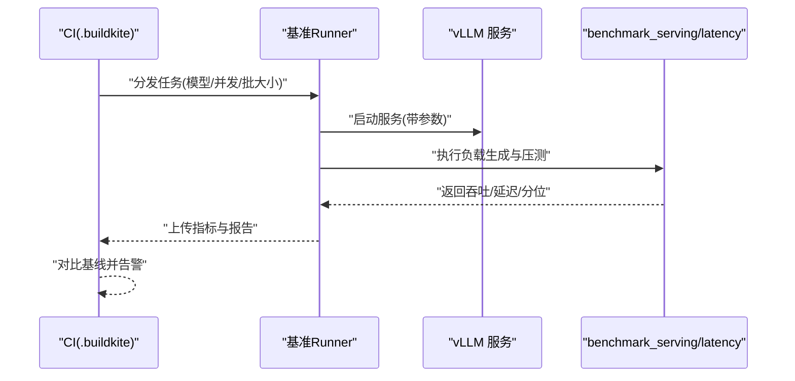
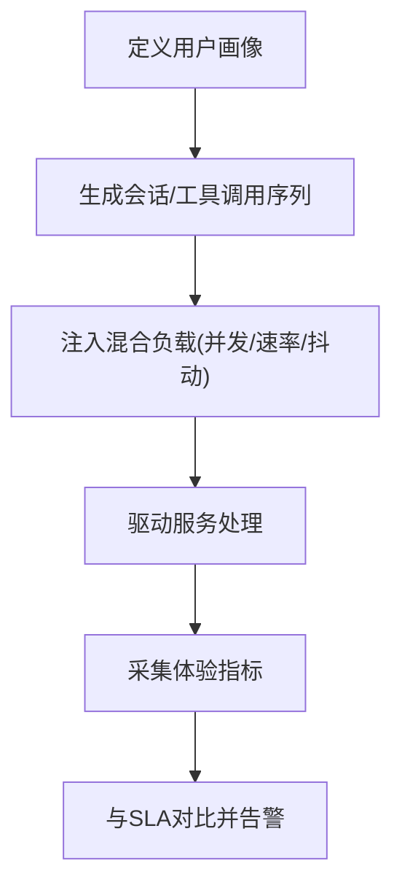
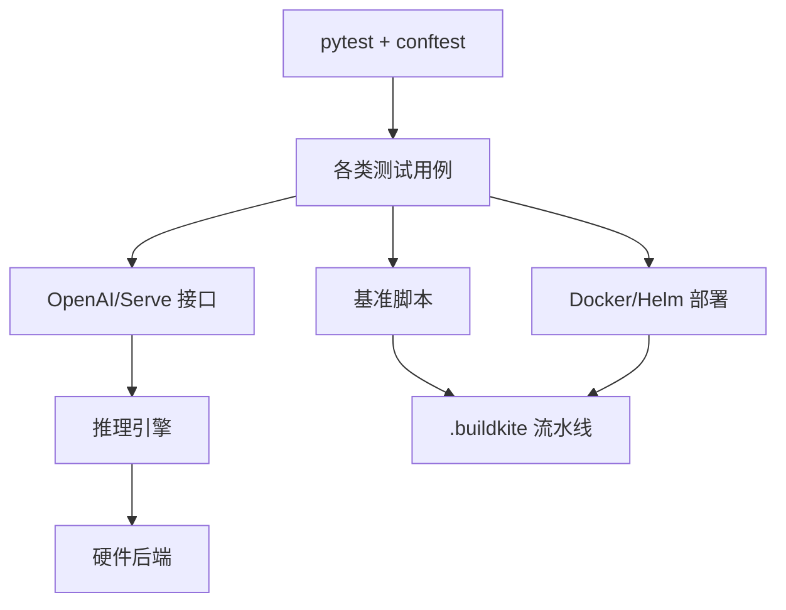

# 端到端测试

<cite>
**本文引用的文件**   
- [tests/conftest.py](file://tests/conftest.py)
- [tests/utils.py](file://tests/utils.py)
- [tests/basic_correctness/test_basic_correctness.py](file://tests/basic_correctness/test_basic_correctness.py)
- [tests/entrypoints/openai/test_openai_api.py](file://tests/entrypoints/openai/test_openai_api.py)
- [tests/entrypoints/serve/test_serving.py](file://tests/entrypoints/serve/test_serving.py)
- [docker/Dockerfile](file://docker/Dockerfile)
- [.buildkite/test-pipeline.yaml](file://.buildkite/test-pipeline.yaml)
- [benchmarks/benchmark_serving.py](file://benchmarks/benchmark_serving.py)
- [benchmarks/benchmark_latency.py](file://benchmarks/benchmark_latency.py)
- [tests/benchmarks/test_bench_startup.py](file://tests/benchmarks/test_bench_startup.py)
- [tests/benchmarks/test_throughput_cli.py](file://tests/benchmarks/test_throughput_cli.py)
- [tests/distributed/test_ray_v2_executor_e2e.py](file://tests/distributed/test_ray_v2_executor_e2e.py)
- [examples/deployment/chart-helm/values.yaml](file://examples/deployment/chart-helm/values.yaml)
</cite>

## 目录
1. [简介](#简介)
2. [项目结构](#项目结构)
3. [核心组件](#核心组件)
4. [架构总览](#架构总览)
5. [详细组件分析](#详细组件分析)
6. [依赖关系分析](#依赖关系分析)
7. [性能考量](#性能考量)
8. [故障排查指南](#故障排查指南)
9. [结论](#结论)
10. [附录](#附录)

## 简介
本文件系统性阐述 vLLM 的端到端（E2E）测试框架与执行策略，覆盖从请求接收到响应返回的全链路验证、模型加载与初始化兼容性、服务部署（Docker/Kubernetes）、性能基准与回归自动化、以及真实场景模拟与用户行为测试。文档面向不同技术背景的读者，提供分层说明、可视化图示与可操作的实践建议。

## 项目结构
vLLM 的测试体系围绕 pytest 组织，按功能域划分目录：基础正确性、入口点（OpenAI/serve 等）、分布式、内核、编译、量化、推理引擎、多模态、工具链等。关键目录与职责如下：
- tests/: 所有测试用例与夹具，包含 conftest.py 全局配置与 utils.py 通用工具
- tests/basic_correctness/: 基础正确性与内存/卸载等端到端路径
- tests/entrypoints/: 针对 OpenAI API、serve 等接口的集成测试
- tests/distributed/: 分布式与并行执行器 E2E 验证
- benchmarks/: 性能基准脚本（吞吐、延迟、前缀缓存等）
- docker/: Docker 构建与镜像定义
- .buildkite/: CI/CD 流水线配置，驱动测试与基准自动化

图表来源
- [tests/conftest.py](file://tests/conftest.py)
- [tests/utils.py](file://tests/utils.py)
- [tests/basic_correctness/test_basic_correctness.py](file://tests/basic_correctness/test_basic_correctness.py)
- [tests/entrypoints/openai/test_openai_api.py](file://tests/entrypoints/openai/test_openai_api.py)
- [tests/entrypoints/serve/test_serving.py](file://tests/entrypoints/serve/test_serving.py)
- [tests/distributed/test_ray_v2_executor_e2e.py](file://tests/distributed/test_ray_v2_executor_e2e.py)
- [benchmarks/benchmark_serving.py](file://benchmarks/benchmark_serving.py)
- [benchmarks/benchmark_latency.py](file://benchmarks/benchmark_latency.py)
- [tests/benchmarks/test_bench_startup.py](file://tests/benchmarks/test_bench_startup.py)
- [tests/benchmarks/test_throughput_cli.py](file://tests/benchmarks/test_throughput_cli.py)
- [docker/Dockerfile](file://docker/Dockerfile)
- [examples/deployment/chart-helm/values.yaml](file://examples/deployment/chart-helm/values.yaml)
- [.buildkite/test-pipeline.yaml](file://.buildkite/test-pipeline.yaml)

章节来源
- [tests/conftest.py](file://tests/conftest.py)
- [tests/utils.py](file://tests/utils.py)
- [tests/basic_correctness/test_basic_correctness.py](file://tests/basic_correctness/test_basic_correctness.py)
- [tests/entrypoints/openai/test_openai_api.py](file://tests/entrypoints/openai/test_openai_api.py)
- [tests/entrypoints/serve/test_serving.py](file://tests/entrypoints/serve/test_serving.py)
- [tests/distributed/test_ray_v2_executor_e2e.py](file://tests/distributed/test_ray_v2_executor_e2e.py)
- [benchmarks/benchmark_serving.py](file://benchmarks/benchmark_serving.py)
- [benchmarks/benchmark_latency.py](file://benchmarks/benchmark_latency.py)
- [tests/benchmarks/test_bench_startup.py](file://tests/benchmarks/test_bench_startup.py)
- [tests/benchmarks/test_throughput_cli.py](file://tests/benchmarks/test_throughput_cli.py)
- [docker/Dockerfile](file://docker/Dockerfile)
- [examples/deployment/chart-helm/values.yaml](file://examples/deployment/chart-helm/values.yaml)
- [.buildkite/test-pipeline.yaml](file://.buildkite/test-pipeline.yaml)

## 核心组件
- 测试夹具与参数化（conftest.py）
  - 集中管理测试环境、设备选择、随机种子、超时、重试、日志级别等
  - 提供跨模块共享的 fixture，如 HTTP 客户端、服务进程生命周期、模型参数模板
- 通用工具（utils.py）
  - 封装常用断言、等待逻辑、端口探测、HTTP 调用封装、结果比对
- 基础正确性 E2E（basic_correctness）
  - 覆盖最小可用推理路径、内存/卸载、预取等关键路径
- 入口点集成测试（entrypoints）
  - OpenAI API、serve CLI 等接口的端到端请求-响应验证
- 分布式 E2E（distributed）
  - Ray v2 执行器、多节点通信、一致性校验
- 基准与回归（benchmarks + tests/benchmarks）
  - 吞吐、延迟、启动时间、CLI 行为稳定性

章节来源
- [tests/conftest.py](file://tests/conftest.py)
- [tests/utils.py](file://tests/utils.py)
- [tests/basic_correctness/test_basic_correctness.py](file://tests/basic_correctness/test_basic_correctness.py)
- [tests/entrypoints/openai/test_openai_api.py](file://tests/entrypoints/openai/test_openai_api.py)
- [tests/entrypoints/serve/test_serving.py](file://tests/entrypoints/serve/test_serving.py)
- [tests/distributed/test_ray_v2_executor_e2e.py](file://tests/distributed/test_ray_v2_executor_e2e.py)
- [benchmarks/benchmark_serving.py](file://benchmarks/benchmark_serving.py)
- [benchmarks/benchmark_latency.py](file://benchmarks/benchmark_latency.py)
- [tests/benchmarks/test_bench_startup.py](file://tests/benchmarks/test_bench_startup.py)
- [tests/benchmarks/test_throughput_cli.py](file://tests/benchmarks/test_throughput_cli.py)

## 架构总览
端到端测试贯穿“客户端 → 服务进程 → 推理引擎 → 硬件后端”全链路。下图展示典型 OpenAI 接口请求在测试中的流转与断言点。

图表来源
- [tests/entrypoints/openai/test_openai_api.py](file://tests/entrypoints/openai/test_openai_api.py)
- [tests/entrypoints/serve/test_serving.py](file://tests/entrypoints/serve/test_serving.py)
- [benchmarks/benchmark_serving.py](file://benchmarks/benchmark_serving.py)
- [benchmarks/benchmark_latency.py](file://benchmarks/benchmark_latency.py)

## 详细组件分析

### 端到端推理流程测试（请求→响应）
- 设计要点
  - 构造多样化请求（短上下文、长上下文、多模态、结构化输出、工具调用等）
  - 覆盖同步与流式两种模式，验证首 token 时延、TTFT、TPOT、总时延
  - 断言响应结构与语义一致性（停止条件、logprobs、usage 统计）
- 实现位置
  - OpenAI 接口 E2E：[tests/entrypoints/openai/test_openai_api.py](file://tests/entrypoints/openai/test_openai_api.py)
  - Serve 接口 E2E：[tests/entrypoints/serve/test_serving.py](file://tests/entrypoints/serve/test_serving.py)
  - 基础正确性路径：[tests/basic_correctness/test_basic_correctness.py](file://tests/basic_correctness/test_basic_correctness.py)

章节来源
- [tests/entrypoints/openai/test_openai_api.py](file://tests/entrypoints/openai/test_openai_api.py)
- [tests/entrypoints/serve/test_serving.py](file://tests/entrypoints/serve/test_serving.py)
- [tests/basic_correctness/test_basic_correctness.py](file://tests/basic_correctness/test_basic_correctness.py)

### 模型加载与初始化测试（含多架构兼容）
- 设计要点
  - 覆盖主流架构（Llama、Qwen、Mixtral、DeepSeek 等），验证权重加载、KV Cache 初始化、注意力后端选择
  - 参数化不同精度（bf16/fp16/fp8）、量化方案、LoRA/PEFT、MoE 路由
  - 断言模型元信息、设备分配、内存占用阈值
- 实现位置
  - 基础正确性与内存/卸载路径：[tests/basic_correctness/test_basic_correctness.py](file://tests/basic_correctness/test_basic_correctness.py)
  - 分布式加载与一致性：[tests/distributed/test_ray_v2_executor_e2e.py](file://tests/distributed/test_ray_v2_executor_e2e.py)

图表来源
- [tests/basic_correctness/test_basic_correctness.py](file://tests/basic_correctness/test_basic_correctness.py)
- [tests/distributed/test_ray_v2_executor_e2e.py](file://tests/distributed/test_ray_v2_executor_e2e.py)

章节来源
- [tests/basic_correctness/test_basic_correctness.py](file://tests/basic_correctness/test_basic_correctness.py)
- [tests/distributed/test_ray_v2_executor_e2e.py](file://tests/distributed/test_ray_v2_executor_e2e.py)

### 服务部署测试（Docker 与 Kubernetes）
- Docker 容器测试
  - 使用 docker/Dockerfile 构建镜像，启动服务进程，暴露端口，进行健康检查与接口调用
  - 支持 CPU/GPU/ROCm/XPU 等多平台镜像变体
- Kubernetes 集群测试
  - 通过 Helm Chart values.yaml 配置副本数、资源限制、探针、环境变量
  - 结合 CI 拉起临时集群，执行冒烟测试与回归

图表来源
- [docker/Dockerfile](file://docker/Dockerfile)
- [examples/deployment/chart-helm/values.yaml](file://examples/deployment/chart-helm/values.yaml)

章节来源
- [docker/Dockerfile](file://docker/Dockerfile)
- [examples/deployment/chart-helm/values.yaml](file://examples/deployment/chart-helm/values.yaml)

### 性能基准测试与回归自动化
- 基准脚本
  - 吞吐基准：[benchmarks/benchmark_serving.py](file://benchmarks/benchmark_serving.py)
  - 延迟基准：[benchmarks/benchmark_latency.py](file://benchmarks/benchmark_latency.py)
- CLI 与启动校验
  - 启动耗时、CLI 参数解析、错误路径：[tests/benchmarks/test_bench_startup.py](file://tests/benchmarks/test_bench_startup.py)、[tests/benchmarks/test_throughput_cli.py](file://tests/benchmarks/test_throughput_cli.py)
- 自动化执行
  - 通过 .buildkite/test-pipeline.yaml 编排任务矩阵（模型×硬件×参数），产出报告与回归告警

图表来源
- [benchmarks/benchmark_serving.py](file://benchmarks/benchmark_serving.py)
- [benchmarks/benchmark_latency.py](file://benchmarks/benchmark_latency.py)
- [tests/benchmarks/test_bench_startup.py](file://tests/benchmarks/test_bench_startup.py)
- [tests/benchmarks/test_throughput_cli.py](file://tests/benchmarks/test_throughput_cli.py)
- [.buildkite/test-pipeline.yaml](file://.buildkite/test-pipeline.yaml)

章节来源
- [benchmarks/benchmark_serving.py](file://benchmarks/benchmark_serving.py)
- [benchmarks/benchmark_latency.py](file://benchmarks/benchmark_latency.py)
- [tests/benchmarks/test_bench_startup.py](file://tests/benchmarks/test_bench_startup.py)
- [tests/benchmarks/test_throughput_cli.py](file://tests/benchmarks/test_throughput_cli.py)
- [.buildkite/test-pipeline.yaml](file://.buildkite/test-pipeline.yaml)

### 真实场景模拟与用户行为测试
- 场景设计
  - 多轮对话、工具调用、结构化输出、多模态输入、长上下文拼接
  - 混合负载（突发流量、长尾延迟、优先级队列）
- 实现方式
  - 基于 entrypoints 测试扩展构造用户画像与请求序列
  - 结合 metrics 与 tracing 采集端到端体验指标（P95/P99 时延、错误率、降级）

章节来源
- [tests/entrypoints/openai/test_openai_api.py](file://tests/entrypoints/openai/test_openai_api.py)
- [tests/entrypoints/serve/test_serving.py](file://tests/entrypoints/serve/test_serving.py)

## 依赖关系分析
测试与基准对底层组件的依赖包括：
- pytest 与 fixtures（conftest.py）
- HTTP 客户端与服务进程（entrypoints）
- 推理引擎与后端（CUDA/ROCm/XPU）
- 分布式执行器（Ray v2）
- 容器与编排（Docker/Helm）
- CI 编排（Buildkite）

图表来源
- [tests/conftest.py](file://tests/conftest.py)
- [tests/entrypoints/openai/test_openai_api.py](file://tests/entrypoints/openai/test_openai_api.py)
- [tests/entrypoints/serve/test_serving.py](file://tests/entrypoints/serve/test_serving.py)
- [benchmarks/benchmark_serving.py](file://benchmarks/benchmark_serving.py)
- [tests/distributed/test_ray_v2_executor_e2e.py](file://tests/distributed/test_ray_v2_executor_e2e.py)
- [docker/Dockerfile](file://docker/Dockerfile)
- [examples/deployment/chart-helm/values.yaml](file://examples/deployment/chart-helm/values.yaml)
- [.buildkite/test-pipeline.yaml](file://.buildkite/test-pipeline.yaml)

章节来源
- [tests/conftest.py](file://tests/conftest.py)
- [tests/entrypoints/openai/test_openai_api.py](file://tests/entrypoints/openai/test_openai_api.py)
- [tests/entrypoints/serve/test_serving.py](file://tests/entrypoints/serve/test_serving.py)
- [benchmarks/benchmark_serving.py](file://benchmarks/benchmark_serving.py)
- [tests/distributed/test_ray_v2_executor_e2e.py](file://tests/distributed/test_ray_v2_executor_e2e.py)
- [docker/Dockerfile](file://docker/Dockerfile)
- [examples/deployment/chart-helm/values.yaml](file://examples/deployment/chart-helm/values.yaml)
- [.buildkite/test-pipeline.yaml](file://.buildkite/test-pipeline.yaml)

## 性能考量
- 负载建模
  - 合理设置并发度、批大小、请求长度分布，避免热路径瓶颈掩盖
- 指标采集
  - 关注 TTFT、TPOT、P95/P99 时延、吞吐、显存峰值、GC 停顿
- 回归策略
  - 建立基线数据集与阈值，CI 自动对比并告警
- 环境隔离
  - 固定随机种子、禁用无关服务、预热模型与 KV Cache

## 故障排查指南
- 常见问题定位
  - 服务启动失败：检查端口占用、镜像依赖、环境变量、GPU 可见性
  - 接口超时/错误：查看服务端日志、请求体合法性、模型配置
  - 性能退化：对比基线报告、观察热点路径、检查内核版本与驱动
- 调试手段
  - 启用详细日志与 tracing
  - 使用独立容器/命名空间隔离环境
  - 逐步缩小问题范围（单请求 vs 批量、短上下文 vs 长上下文）

章节来源
- [tests/entrypoints/openai/test_openai_api.py](file://tests/entrypoints/openai/test_openai_api.py)
- [tests/entrypoints/serve/test_serving.py](file://tests/entrypoints/serve/test_serving.py)
- [tests/benchmarks/test_bench_startup.py](file://tests/benchmarks/test_bench_startup.py)

## 结论
vLLM 的端到端测试体系以 pytest 为核心，结合入口点集成、分布式验证、基准与回归、容器与编排，形成从代码到部署的闭环质量保障。通过参数化与矩阵化执行，覆盖多模型、多硬件与多部署形态；借助指标采集与基线对比，持续守护性能与稳定性。建议在新增特性时同步完善对应 E2E 用例与基准，确保变更可观测、可回归。

## 附录
- 快速运行建议
  - 本地冒烟：选取最小模型与单卡，运行基础正确性与 OpenAI 接口测试
  - 性能回归：在目标硬件上执行 benchmark_serving/latency，并与基线对比
  - 部署验证：构建镜像并在本地 Docker/K8s 中完成健康检查与接口冒烟
- 参考文件
  - 测试夹具与工具：[tests/conftest.py](file://tests/conftest.py)、[tests/utils.py](file://tests/utils.py)
  - 接口 E2E：[tests/entrypoints/openai/test_openai_api.py](file://tests/entrypoints/openai/test_openai_api.py)、[tests/entrypoints/serve/test_serving.py](file://tests/entrypoints/serve/test_serving.py)
  - 基准脚本：[benchmarks/benchmark_serving.py](file://benchmarks/benchmark_serving.py)、[benchmarks/benchmark_latency.py](file://benchmarks/benchmark_latency.py)
  - 部署与 CI：[docker/Dockerfile](file://docker/Dockerfile)、[examples/deployment/chart-helm/values.yaml](file://examples/deployment/chart-helm/values.yaml)、[.buildkite/test-pipeline.yaml](file://.buildkite/test-pipeline.yaml)