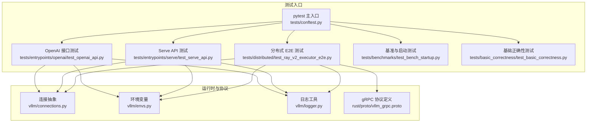
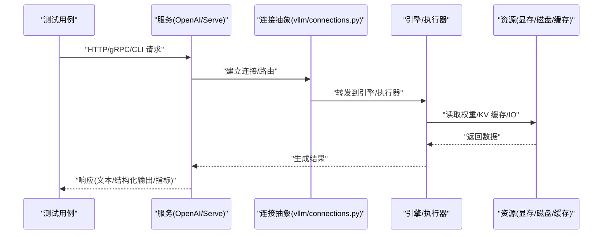
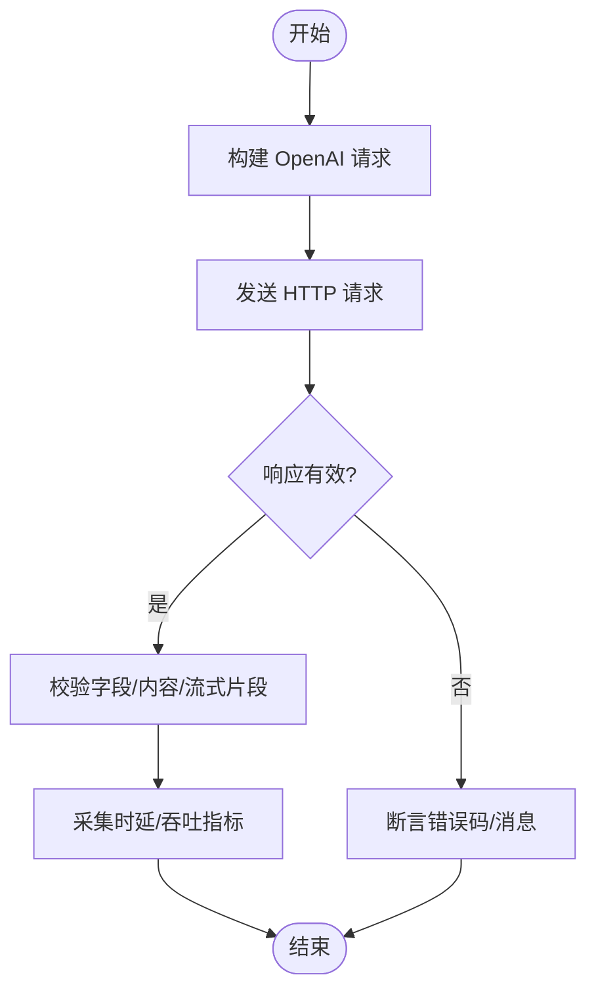
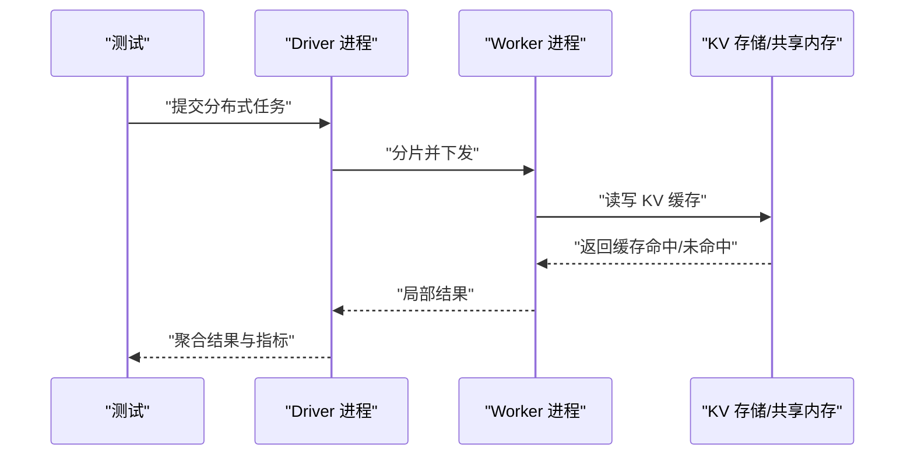
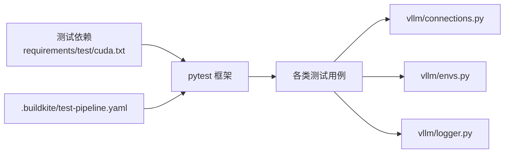

# 集成测试

<cite>
**本文引用的文件**   
- [tests/conftest.py](file://tests/conftest.py)
- [tests/entrypoints/openai/test_openai_api.py](file://tests/entrypoints/openai/test_openai_api.py)
- [tests/entrypoints/serve/test_serve_api.py](file://tests/entrypoints/serve/test_serve_api.py)
- [tests/distributed/test_ray_v2_executor_e2e.py](file://tests/distributed/test_ray_v2_executor_e2e.py)
- [tests/benchmarks/test_bench_startup.py](file://tests/benchmarks/test_bench_startup.py)
- [tests/basic_correctness/test_basic_correctness.py](file://tests/basic_correctness/test_basic_correctness.py)
- [tests/engine/test_arg_utils.py](file://tests/engine/test_arg_utils.py)
- [tests/config/test_config_generation.py](file://tests/config/test_config_generation.py)
- [tests/plugins_tests/test_plugin_registry.py](file://tests/plugins_tests/test_plugin_registry.py)
- [rust/proto/vllm_grpc.proto](file://rust/proto/vllm_grpc.proto)
- [vllm/connections.py](file://vllm/connections.py)
- [vllm/envs.py](file://vllm/envs.py)
- [vllm/logger.py](file://vllm/logger.py)
- [requirements/test/cuda.txt](file://requirements/test/cuda.txt)
- [.buildkite/test-pipeline.yaml](file://.buildkite/test-pipeline.yaml)
</cite>

## 目录
1. [简介](#简介)
2. [项目结构](#项目结构)
3. [核心组件](#核心组件)
4. [架构总览](#架构总览)
5. [详细组件分析](#详细组件分析)
6. [依赖分析](#依赖分析)
7. [性能考虑](#性能考虑)
8. [故障排查指南](#故障排查指南)
9. [结论](#结论)
10. [附录](#附录)

## 简介
本文件系统性梳理 vLLM 的集成测试框架与实施方法，覆盖多组件交互测试、服务间通信、分布式推理与插件集成的测试策略；详解 OpenAI 兼容 API、gRPC 接口与 CLI 工具的测试实现；给出数据库与缓存测试的最佳实践；并提供端到端工作流（完整推理流程与服务部署）以及并发与负载均衡测试的实现方案。文档面向不同技术背景的读者，既提供高层概览，也包含代码级分析与图示。

## 项目结构
vLLM 的测试体系以 pytest 为核心组织，按功能域划分目录：
- tests/entrypoints：各入口（OpenAI、Serve、Speech-to-Text、Tool Parsers 等）的集成测试
- tests/distributed：分布式执行器、通信原语、并行策略与端到端场景
- tests/benchmarks：基准与启动时延、吞吐等指标验证
- tests/basic_correctness：基础正确性与内存/卸载等关键路径
- tests/engine、tests/config、tests/plugins_tests：引擎参数、配置生成与插件注册表
- rust/proto：gRPC 协议定义，支撑 gRPC 接口测试
- vllm/*：运行时连接、环境变量、日志等基础设施，被测试广泛引用
- .buildkite：CI 流水线配置，驱动测试运行

图表来源 
- [tests/conftest.py](file://tests/conftest.py)
- [tests/entrypoints/openai/test_openai_api.py](file://tests/entrypoints/openai/test_openai_api.py)
- [tests/entrypoints/serve/test_serve_api.py](file://tests/entrypoints/serve/test_serve_api.py)
- [tests/distributed/test_ray_v2_executor_e2e.py](file://tests/distributed/test_ray_v2_executor_e2e.py)
- [tests/benchmarks/test_bench_startup.py](file://tests/benchmarks/test_bench_startup.py)
- [tests/basic_correctness/test_basic_correctness.py](file://tests/basic_correctness/test_basic_correctness.py)
- [vllm/connections.py](file://vllm/connections.py)
- [vllm/envs.py](file://vllm/envs.py)
- [vllm/logger.py](file://vllm/logger.py)
- [rust/proto/vllm_grpc.proto](file://rust/proto/vllm_grpc.proto)

章节来源
- [tests/conftest.py](file://tests/conftest.py)
- [tests/entrypoints/openai/test_openai_api.py](file://tests/entrypoints/openai/test_openai_api.py)
- [tests/entrypoints/serve/test_serve_api.py](file://tests/entrypoints/serve/test_serve_api.py)
- [tests/distributed/test_ray_v2_executor_e2e.py](file://tests/distributed/test_ray_v2_executor_e2e.py)
- [tests/benchmarks/test_bench_startup.py](file://tests/benchmarks/test_bench_startup.py)
- [tests/basic_correctness/test_basic_correctness.py](file://tests/basic_correctness/test_basic_correctness.py)
- [vllm/connections.py](file://vllm/connections.py)
- [vllm/envs.py](file://vllm/envs.py)
- [vllm/logger.py](file://vllm/logger.py)
- [rust/proto/vllm_grpc.proto](file://rust/proto/vllm_grpc.proto)

## 核心组件
- 测试编排与夹具：通过 conftest.py 集中管理测试环境、端口分配、模型加载、服务生命周期与清理，确保用例可重复与隔离。
- 接口层测试：OpenAI 兼容 API 与 Serve API 分别通过 HTTP 客户端发起请求，断言响应结构与延迟阈值。
- 分布式与执行器：基于 Ray v2 的执行器端到端测试，覆盖多进程/多节点推理、任务调度与结果一致性。
- 基准与启动：验证服务冷启动时间、首 token 时延与吞吐基线，保障回归不劣化。
- 基础正确性：校验核心推理路径、内存占用与卸载行为，保证基本功能稳定。
- 引擎与配置：参数解析、配置生成与默认值覆盖的单元测试与集成测试结合。
- 插件系统：插件注册、发现与调用链路的集成验证。
- gRPC 协议：基于 proto 定义的接口契约测试，确保跨语言兼容性。

章节来源
- [tests/conftest.py](file://tests/conftest.py)
- [tests/engine/test_arg_utils.py](file://tests/engine/test_arg_utils.py)
- [tests/config/test_config_generation.py](file://tests/config/test_config_generation.py)
- [tests/plugins_tests/test_plugin_registry.py](file://tests/plugins_tests/test_plugin_registry.py)

## 架构总览
下图展示集成测试在 vLLM 中的整体交互：测试驱动通过 HTTP/gRPC/CLI 调用服务，服务内部经由连接抽象与环境变量控制，最终进入引擎与执行器完成推理。

图表来源 
- [tests/entrypoints/openai/test_openai_api.py](file://tests/entrypoints/openai/test_openai_api.py)
- [tests/entrypoints/serve/test_serve_api.py](file://tests/entrypoints/serve/test_serve_api.py)
- [vllm/connections.py](file://vllm/connections.py)

## 详细组件分析

### OpenAI 兼容 API 测试
- 目标：验证 /v1/chat/completions、/v1/completions 等接口的语义、错误处理、流式输出与限流。
- 方法：使用 HTTP 客户端构造请求，断言状态码、字段存在性与内容一致性；对超时、重试与降级路径进行覆盖。
- 关键点：会话上下文、工具调用、结构化输出、采样参数与停止条件。

章节来源
- [tests/entrypoints/openai/test_openai_api.py](file://tests/entrypoints/openai/test_openai_api.py)

### Serve API 测试
- 目标：验证 vLLM Serve 暴露的 REST 接口，包括批处理、异步与流式能力。
- 方法：模拟真实负载，检查请求排队、优先级与取消逻辑；验证中间态与最终态的一致性。
- 关键点：请求生命周期、资源配额、背压与熔断。

章节来源
- [tests/entrypoints/serve/test_serve_api.py](file://tests/entrypoints/serve/test_serve_api.py)

### 分布式推理与执行器测试（Ray v2）
- 目标：验证多进程/多节点推理的正确性与可扩展性，包括任务分发、结果聚合与容错。
- 方法：构造分布式场景，注入失败与恢复，断言端到端一致性与性能退化阈值。
- 关键点：并行策略（张量/流水线/专家）、通信开销、KV 缓存共享与迁移。

章节来源
- [tests/distributed/test_ray_v2_executor_e2e.py](file://tests/distributed/test_ray_v2_executor_e2e.py)

### gRPC 接口测试
- 目标：基于 proto 定义验证 gRPC 服务的接口契约、序列化/反序列化与流式传输。
- 方法：生成客户端 stub，构造请求流与错误场景，断言响应与异常类型。
- 关键点：版本兼容、向后兼容字段、超时与重试策略。

章节来源
- [rust/proto/vllm_grpc.proto](file://rust/proto/vllm_grpc.proto)

### CLI 工具测试
- 目标：验证命令行参数解析、子命令行为与输出格式。
- 方法：模拟标准输入/输出，断 exit code 与关键输出片段；覆盖帮助信息与错误提示。

章节来源
- [tests/benchmarks/test_bench_startup.py](file://tests/benchmarks/test_bench_startup.py)

### 基础正确性与内存/卸载测试
- 目标：确保核心推理路径、量化、卸载与显存管理的正确性。
- 方法：构造边界用例，监控内存峰值与回收时机，断言数值误差范围。

章节来源
- [tests/basic_correctness/test_basic_correctness.py](file://tests/basic_correctness/test_basic_correctness.py)

### 引擎参数与配置生成测试
- 目标：验证引擎参数合并、默认值覆盖与配置文件的生成逻辑。
- 方法：对比期望配置与实际配置，断言关键字段与约束。

章节来源
- [tests/engine/test_arg_utils.py](file://tests/engine/test_arg_utils.py)
- [tests/config/test_config_generation.py](file://tests/config/test_config_generation.py)

### 插件系统集成测试
- 目标：验证插件注册、发现与调用链路，确保扩展点稳定。
- 方法：注册自定义插件，触发对应钩子，断言行为与副作用。

章节来源
- [tests/plugins_tests/test_plugin_registry.py](file://tests/plugins_tests/test_plugin_registry.py)

## 依赖分析
- 测试依赖：CUDA/ROCm/XPU 相关依赖由 requirements/test 管理，确保在不同硬件平台上的可运行性。
- 运行时依赖：vllm/connections.py、vllm/envs.py、vllm/logger.py 为测试与运行时的关键依赖，贯穿各模块。
- CI 依赖：.buildkite/test-pipeline.yaml 驱动测试矩阵，按平台与特性组合执行。

图表来源 
- [requirements/test/cuda.txt](file://requirements/test/cuda.txt)
- [vllm/connections.py](file://vllm/connections.py)
- [vllm/envs.py](file://vllm/envs.py)
- [vllm/logger.py](file://vllm/logger.py)
- [.buildkite/test-pipeline.yaml](file://.buildkite/test-pipeline.yaml)

章节来源
- [requirements/test/cuda.txt](file://requirements/test/cuda.txt)
- [.buildkite/test-pipeline.yaml](file://.buildkite/test-pipeline.yaml)

## 性能考虑
- 冷启动与首 token 时延：通过基准测试捕获启动时间与首 token 时延，设置回归阈值。
- 吞吐与并发：在高并发下评估队列长度、丢弃率与尾延迟，确保 SLA。
- 资源利用：监控显存峰值、CPU/GPU 利用率与 IO 瓶颈，识别热点路径。
- 稳定性：长时间压力测试与故障注入，验证服务自愈与降级能力。

[本节为通用指导，无需特定文件来源]

## 故障排查指南
- 日志定位：统一使用 vllm/logger.py 输出结构化日志，结合请求 ID 追踪链路。
- 环境变量：通过 vllm/envs.py 调整调试开关（如详细日志、性能剖析），快速定位问题。
- 连接问题：检查 vllm/connections.py 的连接池、超时与重试策略，确认网络与端口可用性。
- 常见错误：超时、OOM、权限不足、端口冲突、依赖缺失等，需结合日志与指标综合判断。

章节来源
- [vllm/logger.py](file://vllm/logger.py)
- [vllm/envs.py](file://vllm/envs.py)
- [vllm/connections.py](file://vllm/connections.py)

## 结论
vLLM 的集成测试体系以 pytest 为中心，围绕接口、分布式、基准与正确性构建多层验证。通过连接抽象与环境变量统一管理运行时行为，结合 CI 矩阵覆盖多平台与特性。建议持续完善端到端工作流、并发与负载均衡测试，强化数据库与缓存测试最佳实践，提升系统在复杂场景下的稳定性与性能。

[本节为总结性内容，无需特定文件来源]

## 附录
- 端到端工作流构建要点：
  - 服务部署：容器化或进程内启动，预加载模型与初始化缓存。
  - 请求编排：构造典型对话、工具调用与结构化输出场景。
  - 验证策略：断言响应完整性、时延阈值与资源占用。
- 并发与负载均衡：
  - 并发模型：线程/进程/协程混合，合理设置连接池大小。
  - 负载均衡：轮询/加权/一致性哈希，避免热点与倾斜。
- 数据库与缓存测试：
  - 数据一致性：事务与回滚、幂等性、冲突解决。
  - 缓存策略：命中率、失效与预热、容量与淘汰。
- gRPC 与 CLI：
  - 契约优先：proto 变更需保持向后兼容，生成客户端同步更新。
  - CLI 易用性：参数校验、错误提示与帮助信息完善。

[本节为概念性内容，无需特定文件来源]