# C++/CUDA内核开发

<cite>
**本文引用的文件**   
- [CMakeLists.txt](file://CMakeLists.txt)
- [setup.py](file://setup.py)
- [csrc/torch_bindings.cpp](file://csrc/torch_bindings.cpp)
- [csrc/libtorch_stable/torch_bindings.cpp](file://csrc/libtorch_stable/torch_bindings.cpp)
- [csrc/cpu/torch_bindings.cpp](file://csrc/cpu/torch_bindings.cpp)
- [csrc/rocm/torch_bindings.cpp](file://csrc/rocm/torch_bindings.cpp)
- [csrc/cuda_utils.h](file://csrc/cuda_utils.h)
- [csrc/dispatch_utils.h](file://csrc/dispatch_utils.h)
- [csrc/ops.h](file://csrc/ops.h)
- [csrc/custom_all_reduce.cuh](file://csrc/custom_all_reduce.cuh)
- [csrc/custom_quickreduce.cu](file://csrc/custom_quickreduce.cu)
- [csrc/cumem_allocator.cpp](file://csrc/cumem_allocator.cpp)
- [csrc/fs_io.cpp](file://csrc/fs_io.cpp)
- [csrc/spinloop.cpp](file://csrc/spinloop.cpp)
- [csrc/attention/attention_generic.cuh](file://csrc/attention/attention_generic.cuh)
- [csrc/attention/dtype_bfloat16.cuh](file://csrc/attention/dtype_bfloat16.cuh)
- [csrc/attention/dtype_float16.cuh](file://csrc/attention/dtype_float16.cuh)
- [csrc/attention/dtype_float32.cuh](file://csrc/attention/dtype_float32.cuh)
- [csrc/attention/dtype_fp8.cuh](file://csrc/attention/dtype_fp8.cuh)
- [csrc/libtorch_stable/activation_kernels.cu](file://csrc/libtorch_stable/activation_kernels.cu)
- [csrc/libtorch_stable/cache_kernels.cu](file://csrc/libtorch_stable/cache_kernels.cu)
- [csrc/libtorch_stable/cache_kernels_fused.cu](file://csrc/libtorch_stable/cache_kernels_fused.cu)
- [csrc/libtorch_stable/layernorm_kernels.cu](file://csrc/libtorch_stable/layernorm_kernels.cu)
- [csrc/libtorch_stable/pos_encoding_kernels.cu](file://csrc/libtorch_stable/pos_encoding_kernels.cu)
- [csrc/libtorch_stable/sampler.cu](file://csrc/libtorch_stable/sampler.cu)
- [csrc/libtorch_stable/topk.cu](file://csrc/libtorch_stable/topk.cu)
- [csrc/libtorch_stable/nvfp4_kv_cache_kernels.cu](file://csrc/libtorch_stable/nvfp4_kv_cache_kernels.cu)
- [csrc/libtorch_stable/fp32_router_gemm.cu](file://csrc/libtorch_stable/fp32_router_gemm.cu)
- [csrc/libtorch_stable/fp32_router_gemm_entry.cu](file://csrc/libtorch_stable/fp32_router_gemm_entry.cu)
- [csrc/libtorch_stable/dsv3_fused_a_gemm.cu](file://csrc/libtorch_stable/dsv3_fused_a_gemm.cu)
- [csrc/libtorch_stable/fused_qknorm_rope_kernel.cu](file://csrc/libtorch_stable/fused_qknorm_rope_kernel.cu)
- [csrc/libtorch_stable/fused_deepseek_v4_qnorm_rope_kv_insert_kernel.cu](file://csrc/libtorch_stable/fused_deepseek_v4_qnorm_rope_kv_insert_kernel.cu)
- [csrc/libtorch_stable/fused_minimax_m3_qnorm_rope_kv_insert_kernel.cu](file://csrc/libtorch_stable/fused_minimax_m3_qnorm_rope_kv_insert_kernel.cu)
- [csrc/libtorch_stable/permute_cols.cu](file://csrc/libtorch_stable/permute_cols.cu)
- [csrc/libtorch_stable/cuda_vec_utils.cuh](file://csrc/libtorch_stable/cuda_vec_utils.cuh)
- [csrc/libtorch_stable/cub_helpers.h](file://csrc/libtorch_stable/cub_helpers.h)
- [csrc/libtorch_stable/launch_bounds_utils.h](file://csrc/libtorch_stable/launch_bounds_utils.h)
- [csrc/libtorch_stable/type_convert.cuh](file://csrc/libtorch_stable/type_convert.cuh)
- [csrc/libtorch_stable/async_util.cuh](file://csrc/libtorch_stable/async_util.cuh)
- [csrc/libtorch_stable/persistent_topk.cuh](file://csrc/libtorch_stable/persistent_topk.cuh)
- [csrc/libtorch_stable/cooperative_topk.cu](file://csrc/libtorch_stable/cooperative_topk.cu)
- [csrc/libtorch_stable/cooperative_topk.cuh](file://csrc/libtorch_stable/cooperative_topk.cuh)
- [csrc/libtorch_stable/topk_histogram_4096.cuh](file://csrc/libtorch_stable/topk_histogram_4096.cuh)
- [csrc/libtorch_stable/quantization/*](file://csrc/libtorch_stable/quantization/)
- [csrc/libtorch_stable/moe/*](file://csrc/libtorch_stable/moe/)
- [csrc/libtorch_stable/attention/*](file://csrc/libtorch_stable/attention/)
- [csrc/libtorch_stable/mamba/*](file://csrc/libtorch_stable/mamba/)
- [csrc/quickreduce/base.h](file://csrc/quickreduce/base.h)
- [csrc/quickreduce/quick_reduce.h](file://csrc/quickreduce/quick_reduce.h)
- [csrc/quickreduce/quick_reduce_impl.cuh](file://csrc/quickreduce/quick_reduce_impl.cuh)
- [csrc/cutlass_extensions/vllm_cutlass_library_extension.py](file://csrc/cutlass_extensions/vllm_cutlass_library_extension.py)
- [csrc/cutlass_extensions/cute_utils.cuh](file://csrc/cutlass_extensions/cute_utils.cuh)
- [csrc/cutlass_extensions/vllm_type_utils.cuh](file://csrc/cutlass_extensions/vllm_type_utils.cuh)
- [cmake/utils.cmake](file://cmake/utils.cmake)
- [cmake/external_projects/triton_kernels.cmake](file://cmake/external_projects/triton_kernels.cmake)
- [cmake/hipify.py](file://cmake/hipify.py)
- [tools/profiler/*](file://tools/profiler/)
- [benchmarks/kernels/benchmark_activation.py](file://benchmarks/kernels/benchmark_activation.py)
- [benchmarks/kernels/benchmark_layernorm.py](file://benchmarks/kernels/benchmark_layernorm.py)
- [benchmarks/kernels/benchmark_paged_attention.py](file://benchmarks/kernels/benchmark_paged_attention.py)
- [tests/kernels/test_cache_kernels.py](file://tests/kernels/test_cache_kernels.py)
- [tests/kernels/test_apply_repetition_penalties.py](file://tests/kernels/test_apply_repetition_penalties.py)
- [tests/kernels/test_ll_bf16_gemm.py](file://tests/kernels/test_ll_bf16_gemm.py)
- [tests/kernels/test_top_k_per_row.py](file://tests/kernels/test_top_k_per_row.py)
- [vllm/_custom_ops.py](file://vllm/_custom_ops.py)
- [vllm/_xpu_ops.py](file://vllm/_xpu_ops.py)
- [vllm/_aiter_ops.py](file://vllm/_aiter_ops.py)
- [vllm/triton_utils/*](file://vllm/triton_utils/)
- [vllm/kernels/*](file://vllm/kernels/)
- [vllm/compilation/*](file://vllm/compilation/)
</cite>

## 目录
1. [简介](#简介)
2. [项目结构](#项目结构)
3. [核心组件](#核心组件)
4. [架构总览](#架构总览)
5. [详细组件分析](#详细组件分析)
6. [依赖关系分析](#依赖关系分析)
7. [性能考量](#性能考量)
8. [故障排查指南](#故障排查指南)
9. [结论](#结论)
10. [附录](#附录)

## 简介
本文件面向在 vLLM 中开发与优化 C++/CUDA/Triton 内核的工程师，系统性讲解：
- CUDA 编程基础与优化技巧（内存管理、并行计算、性能调优）
- 自定义算子实现流程（接口定义、内核编写、Python 绑定）
- Triton 内核的开发方法与优化策略
- CMake 构建系统与自定义编译规则
- 调试技巧与性能分析工具使用
- 常见 CUDA 陷阱与解决方案
- 与 PyTorch 集成的最佳实践
- 实际代码示例路径与性能对比分析方法

## 项目结构
vLLM 将高性能内核集中在 csrc 目录，按平台与功能分层组织；Python 侧通过 vllm 包暴露接口；构建系统由 CMake + setup.py 驱动；测试与基准位于 tests 与 benchmarks。

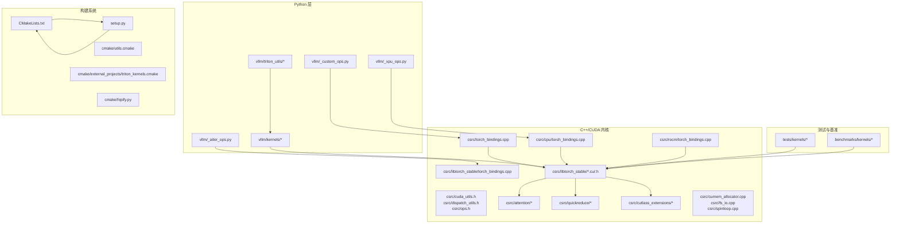

图表来源
- [CMakeLists.txt:1-100](file://CMakeLists.txt#L1-L100)
- [setup.py:1-200](file://setup.py#L1-L200)
- [csrc/torch_bindings.cpp:1-200](file://csrc/torch_bindings.cpp#L1-L200)
- [csrc/libtorch_stable/torch_bindings.cpp:1-200](file://csrc/libtorch_stable/torch_bindings.cpp#L1-L200)
- [csrc/cpu/torch_bindings.cpp:1-200](file://csrc/cpu/torch_bindings.cpp#L1-L200)
- [csrc/rocm/torch_bindings.cpp:1-200](file://csrc/rocm/torch_bindings.cpp#L1-L200)
- [csrc/cuda_utils.h:1-100](file://csrc/cuda_utils.h#L1-L100)
- [csrc/dispatch_utils.h:1-100](file://csrc/dispatch_utils.h#L1-L100)
- [csrc/ops.h:1-100](file://csrc/ops.h#L1-L100)
- [csrc/attention/attention_generic.cuh:1-100](file://csrc/attention/attention_generic.cuh#L1-L100)
- [csrc/libtorch_stable/activation_kernels.cu:1-100](file://csrc/libtorch_stable/activation_kernels.cu#L1-L100)
- [csrc/libtorch_stable/cache_kernels.cu:1-100](file://csrc/libtorch_stable/cache_kernels.cu#L1-L100)
- [csrc/libtorch_stable/layernorm_kernels.cu:1-100](file://csrc/libtorch_stable/layernorm_kernels.cu#L1-L100)
- [csrc/libtorch_stable/pos_encoding_kernels.cu:1-100](file://csrc/libtorch_stable/pos_encoding_kernels.cu#L1-L100)
- [csrc/libtorch_stable/sampler.cu:1-100](file://csrc/libtorch_stable/sampler.cu#L1-L100)
- [csrc/libtorch_stable/topk.cu:1-100](file://csrc/libtorch_stable/topk.cu#L1-L100)
- [csrc/libtorch_stable/nvfp4_kv_cache_kernels.cu:1-100](file://csrc/libtorch_stable/nvfp4_kv_cache_kernels.cu#L1-L100)
- [csrc/libtorch_stable/fp32_router_gemm.cu:1-100](file://csrc/libtorch_stable/fp32_router_gemm.cu#L1-L100)
- [csrc/libtorch_stable/fp32_router_gemm_entry.cu:1-100](file://csrc/libtorch_stable/fp32_router_gemm_entry.cu#L1-L100)
- [csrc/libtorch_stable/dsv3_fused_gemm.cu:1-100](file://csrc/libtorch_stable/dsv3_fused_a_gemm.cu#L1-L100)
- [csrc/libtorch_stable/fused_qknorm_rope_kernel.cu:1-100](file://csrc/libtorch_stable/fused_qknorm_rope_kernel.cu#L1-L100)
- [csrc/libtorch_stable/fused_deepseek_v4_qnorm_rope_kv_insert_kernel.cu:1-100](file://csrc/libtorch_stable/fused_deepseek_v4_qnorm_rope_kv_insert_kernel.cu#L1-L100)
- [csrc/libtorch_stable/fused_minimax_m3_qnorm_rope_kv_insert_kernel.cu:1-100](file://csrc/libtorch_stable/fused_minimax_m3_qnorm_rope_kv_insert_kernel.cu#L1-L100)
- [csrc/libtorch_stable/permute_cols.cu:1-100](file://csrc/libtorch_stable/permute_cols.cu#L1-L100)
- [csrc/libtorch_stable/cuda_vec_utils.cuh:1-100](file://csrc/libtorch_stable/cuda_vec_utils.cuh#L1-L100)
- [csrc/libtorch_stable/cub_helpers.h:1-100](file://csrc/libtorch_stable/cub_helpers.h#L1-L100)
- [csrc/libtorch_stable/launch_bounds_utils.h:1-100](file://csrc/libtorch_stable/launch_bounds_utils.h#L1-L100)
- [csrc/libtorch_stable/type_convert.cuh:1-100](file://csrc/libtorch_stable/type_convert.cuh#L1-L100)
- [csrc/libtorch_stable/async_util.cuh:1-100](file://csrc/libtorch_stable/async_util.cuh#L1-L100)
- [csrc/libtorch_stable/persistent_topk.cuh:1-100](file://csrc/libtorch_stable/persistent_topk.cuh#L1-L100)
- [csrc/libtorch_stable/cooperative_topk.cu:1-100](file://csrc/libtorch_stable/cooperative_topk.cu#L1-L100)
- [csrc/libtorch_stable/cooperative_topk.cuh:1-100](file://csrc/libtorch_stable/cooperative_topk.cuh#L1-L100)
- [csrc/libtorch_stable/topk_histogram_4096.cuh:1-100](file://csrc/libtorch_stable/topk_histogram_4096.cuh#L1-L100)
- [csrc/quickreduce/base.h:1-100](file://csrc/quickreduce/base.h#L1-L100)
- [csrc/quickreduce/quick_reduce.h:1-100](file://csrc/quickreduce/quick_reduce.h#L1-L100)
- [csrc/quickreduce/quick_reduce_impl.cuh:1-100](file://csrc/quickreduce/quick_reduce_impl.cuh#L1-L100)
- [csrc/cutlass_extensions/vllm_cutlass_library_extension.py:1-100](file://csrc/cutlass_extensions/vllm_cutlass_library_extension.py#L1-L100)
- [csrc/cutlass_extensions/cute_utils.cuh:1-100](file://csrc/cutlass_extensions/cute_utils.cuh#L1-L100)
- [csrc/cutlass_extensions/vllm_type_utils.cuh:1-100](file://csrc/cutlass_extensions/vllm_type_utils.cuh#L1-L100)
- [cmake/utils.cmake:1-100](file://cmake/utils.cmake#L1-L100)
- [cmake/external_projects/triton_kernels.cmake:1-100](file://cmake/external_projects/triton_kernels.cmake#L1-L100)
- [cmake/hipify.py:1-100](file://cmake/hipify.py#L1-L100)
- [vllm/_custom_ops.py:1-100](file://vllm/_custom_ops.py#L1-L100)
- [vllm/_xpu_ops.py:1-100](file://vllm/_xpu_ops.py#L1-L100)
- [vllm/_aiter_ops.py:1-100](file://vllm/_aiter_ops.py#L1-L100)
- [tests/kernels/test_cache_kernels.py:1-100](file://tests/kernels/test_cache_kernels.py#L1-L100)
- [benchmarks/kernels/benchmark_activation.py:1-100](file://benchmarks/kernels/benchmark_activation.py#L1-L100)
- [benchmarks/kernels/benchmark_layernorm.py:1-100](file://benchmarks/kernels/benchmark_layernorm.py#L1-L100)
- [benchmarks/kernels/benchmark_paged_attention.py:1-100](file://benchmarks/kernels/benchmark_paged_attention.py#L1-L100)

章节来源
- [CMakeLists.txt:1-100](file://CMakeLists.txt#L1-L100)
- [setup.py:1-200](file://setup.py#L1-L200)
- [csrc/torch_bindings.cpp:1-200](file://csrc/torch_bindings.cpp#L1-L200)
- [csrc/libtorch_stable/torch_bindings.cpp:1-200](file://csrc/libtorch_stable/torch_bindings.cpp#L1-L200)
- [csrc/cpu/torch_bindings.cpp:1-200](file://csrc/cpu/torch_bindings.cpp#L1-L200)
- [csrc/rocm/torch_bindings.cpp:1-200](file://csrc/rocm/torch_bindings.cpp#L1-L200)
- [csrc/cuda_utils.h:1-100](file://csrc/cuda_utils.h#L1-L100)
- [csrc/dispatch_utils.h:1-100](file://csrc/dispatch_utils.h#L1-L100)
- [csrc/ops.h:1-100](file://csrc/ops.h#L1-L100)
- [csrc/attention/attention_generic.cuh:1-100](file://csrc/attention/attention_generic.cuh#L1-L100)
- [csrc/libtorch_stable/activation_kernels.cu:1-100](file://csrc/libtorch_stable/activation_kernels.cu#L1-L100)
- [csrc/libtorch_stable/cache_kernels.cu:1-100](file://csrc/libtorch_stable/cache_kernels.cu#L1-L100)
- [csrc/libtorch_stable/layernorm_kernels.cu:1-100](file://csrc/libtorch_stable/layernorm_kernels.cu#L1-L100)
- [csrc/libtorch_stable/pos_encoding_kernels.cu:1-100](file://csrc/libtorch_stable/pos_encoding_kernels.cu#L1-L100)
- [csrc/libtorch_stable/sampler.cu:1-100](file://csrc/libtorch_stable/sampler.cu#L1-L100)
- [csrc/libtorch_stable/topk.cu:1-100](file://csrc/libtorch_stable/topk.cu#L1-L100)
- [csrc/libtorch_stable/nvfp4_kv_cache_kernels.cu:1-100](file://csrc/libtorch_stable/nvfp4_kv_cache_kernels.cu#L1-L100)
- [csrc/libtorch_stable/fp32_router_gemm.cu:1-100](file://csrc/libtorch_stable/fp32_router_gemm.cu#L1-L100)
- [csrc/libtorch_stable/fp32_router_gemm_entry.cu:1-100](file://csrc/libtorch_stable/fp32_router_gemm_entry.cu#L1-L100)
- [csrc/libtorch_stable/dsv3_fused_a_gemm.cu:1-100](file://csrc/libtorch_stable/dsv3_fused_a_gemm.cu#L1-L100)
- [csrc/libtorch_stable/fused_qknorm_rope_kernel.cu:1-100](file://csrc/libtorch_stable/fused_qknorm_rope_kernel.cu#L1-L100)
- [csrc/libtorch_stable/fused_deepseek_v4_qnorm_rope_kv_insert_kernel.cu:1-100](file://csrc/libtorch_stable/fused_deepseek_v4_qnorm_rope_kv_insert_kernel.cu#L1-L100)
- [csrc/libtorch_stable/fused_minimax_m3_qnorm_rope_kv_insert_kernel.cu:1-100](file://csrc/libtorch_stable/fused_minimax_m3_qnorm_rope_kv_insert_kernel.cu#L1-L100)
- [csrc/libtorch_stable/permute_cols.cu:1-100](file://csrc/libtorch_stable/permute_cols.cu#L1-L100)
- [csrc/libtorch_stable/cuda_vec_utils.cuh:1-100](file://csrc/libtorch_stable/cuda_vec_utils.cuh#L1-L100)
- [csrc/libtorch_stable/cub_helpers.h:1-100](file://csrc/libtorch_stable/cub_helpers.h#L1-L100)
- [csrc/libtorch_stable/launch_bounds_utils.h:1-100](file://csrc/libtorch_stable/launch_bounds_utils.h#L1-L100)
- [csrc/libtorch_stable/type_convert.cuh:1-1100](file://csrc/libtorch_stable/type_convert.cuh#L1-L100)
- [csrc/libtorch_stable/async_util.cuh:1-100](file://csrc/libtorch_stable/async_util.cuh#L1-L100)
- [csrc/libtorch_stable/persistent_topk.cuh:1-100](file://csrc/libtorch_stable/persistent_topk.cuh#L1-L100)
- [csrc/libtorch_stable/cooperative_topk.cu:1-100](file://csrc/libtorch_stable/cooperative_topk.cu#L1-L100)
- [csrc/libtorch_stable/cooperative_topk.cuh:1-100](file://csrc/libtorch_stable/cooperative_topk.cuh#L1-L100)
- [csrc/libtorch_stable/topk_histogram_4096.cuh:1-100](file://csrc/libtorch_stable/topk_histogram_4096.cuh#L1-L100)
- [csrc/quickreduce/base.h:1-100](file://csrc/quickreduce/base.h#L1-L100)
- [csrc/quickreduce/quick_reduce.h:1-100](file://csrc/quickreduce/quick_reduce.h#L1-L100)
- [csrc/quickreduce/quick_reduce_impl.cuh:1-100](file://csrc/quickreduce/quick_reduce_impl.cuh#L1-L100)
- [csrc/cutlass_extensions/vllm_cutlass_library_extension.py:1-100](file://csrc/cutlass_extensions/vllm_cutlass_library_extension.py#L1-L100)
- [csrc/cutlass_extensions/cute_utils.cuh:1-100](file://csrc/cutlass_extensions/cute_utils.cuh#L1-L100)
- [csrc/cutlass_extensions/vllm_type_utils.cuh:1-100](file://csrc/cutlass_extensions/vllm_type_utils.cuh#L1-L100)
- [cmake/utils.cmake:1-100](file://cmake/utils.cmake#L1-L100)
- [cmake/external_projects/triton_kernels.cmake:1-100](file://cmake/external_projects/triton_kernels.cmake#L1-L100)
- [cmake/hipify.py:1-100](file://cmake/hipify.py#L1-L100)
- [vllm/_custom_ops.py:1-100](file://vllm/_custom_ops.py#L1-L100)
- [vllm/_xpu_ops.py:1-100](file://vllm/_xpu_ops.py#L1-L100)
- [vllm/_aiter_ops.py:1-100](file://vllm/_aiter_ops.py#L1-L100)
- [tests/kernels/test_cache_kernels.py:1-100](file://tests/kernels/test_cache_kernels.py#L1-L100)
- [benchmarks/kernels/benchmark_activation.py:1-100](file://benchmarks/kernels/benchmark_activation.py#L1-L100)
- [benchmarks/kernels/benchmark_layernorm.py:1-100](file://benchmarks/kernels/benchmark_layernorm.py#L1-L100)
- [benchmarks/kernels/benchmark_paged_attention.py:1-100](file://benchmarks/kernels/benchmark_paged_attention.py#L1-L100)

## 核心组件
- 内核实现层
  - CUDA/C++ 内核：csrc/libtorch_stable/*.cu 与 csrc/attention/*、csrc/quickreduce/*、csrc/cutlass_extensions/*
  - 类型与分发：csrc/dispatch_utils.h、csrc/ops.h、csrc/cuda_utils.h
  - 专用内核：激活、归一化、位置编码、采样、Top-K、KV Cache、FP8/NVFP4、GEMM、Permute 等
- Python 绑定层
  - csrc/torch_bindings.cpp、csrc/libtorch_stable/torch_bindings.cpp、csrc/cpu/torch_bindings.cpp、csrc/rocm/torch_bindings.cpp
  - vllm/_custom_ops.py、vllm/_xpu_ops.py、vllm/_aiter_ops.py
- 构建系统
  - CMakeLists.txt、setup.py、cmake/utils.cmake、cmake/external_projects/triton_kernels.cmake、cmake/hipify.py
- 测试与基准
  - tests/kernels/*、benchmarks/kernels/*

章节来源
- [csrc/libtorch_stable/activation_kernels.cu:1-100](file://csrc/libtorch_stable/activation_kernels.cu#L1-L100)
- [csrc/libtorch_stable/layernorm_kernels.cu:1-100](file://csrc/libtorch_stable/layernorm_kernels.cu#L1-L100)
- [csrc/libtorch_stable/pos_encoding_kernels.cu:1-100](file://csrc/libtorch_stable/pos_encoding_kernels.cu#L1-L100)
- [csrc/libtorch_stable/sampler.cu:1-100](file://csrc/libtorch_stable/sampler.cu#L1-L100)
- [csrc/libtorch_stable/topk.cu:1-100](file://csrc/libtorch_stable/topk.cu#L1-L100)
- [csrc/libtorch_stable/cache_kernels.cu:1-100](file://csrc/libtorch_stable/cache_kernels.cu#L1-L100)
- [csrc/libtorch_stable/nvfp4_kv_cache_kernels.cu:1-100](file://csrc/libtorch_stable/nvfp4_kv_cache_kernels.cu#L1-L100)
- [csrc/libtorch_stable/fp32_router_gemm.cu:1-100](file://csrc/libtorch_stable/fp32_router_gemm.cu#L1-L100)
- [csrc/libtorch_stable/fp32_router_gemm_entry.cu:1-100](file://csrc/libtorch_stable/fp32_router_gemm_entry.cu#L1-L100)
- [csrc/libtorch_stable/dsv3_fused_a_gemm.cu:1-100](file://csrc/libtorch_stable/dsv3_fused_a_gemm.cu#L1-L100)
- [csrc/libtorch_stable/fused_qknorm_rope_kernel.cu:1-100](file://csrc/libtorch_stable/fused_qknorm_rope_kernel.cu#L1-L100)
- [csrc/libtorch_stable/fused_deepseek_v4_qnorm_rope_kv_insert_kernel.cu:1-100](file://csrc/libtorch_stable/fused_deepseek_v4_qnorm_rope_kv_insert_kernel.cu#L1-L100)
- [csrc/libtorch_stable/fused_minimax_m3_qnorm_rope_kv_insert_kernel.cu:1-100](file://csrc/libtorch_stable/fused_minimax_m3_qnorm_rope_kv_insert_kernel.cu#L1-L100)
- [csrc/libtorch_stable/permute_cols.cu:1-100](file://csrc/libtorch_stable/permute_cols.cu#L1-L100)
- [csrc/dispatch_utils.h:1-100](file://csrc/dispatch_utils.h#L1-L100)
- [csrc/ops.h:1-100](file://csrc/ops.h#L1-L100)
- [csrc/cuda_utils.h:1-100](file://csrc/cuda_utils.h#L1-L100)
- [csrc/torch_bindings.cpp:1-200](file://csrc/torch_bindings.cpp#L1-L200)
- [csrc/libtorch_stable/torch_bindings.cpp:1-200](file://csrc/libtorch_stable/torch_bindings.cpp#L1-L200)
- [csrc/cpu/torch_bindings.cpp:1-200](file://csrc/cpu/torch_bindings.cpp#L1-L200)
- [csrc/rocm/torch_bindings.cpp:1-200](file://csrc/rocm/torch_bindings.cpp#L1-L200)
- [vllm/_custom_ops.py:1-100](file://vllm/_custom_ops.py#L1-L100)
- [vllm/_xpu_ops.py:1-100](file://vllm/_xpu_ops.py#L1-L100)
- [vllm/_aiter_ops.py:1-100](file://vllm/_aiter_ops.py#L1-L100)
- [CMakeLists.txt:1-100](file://CMakeLists.txt#L1-L100)
- [setup.py:1-200](file://setup.py#L1-L200)
- [cmake/utils.cmake:1-100](file://cmake/utils.cmake#L1-L100)
- [cmake/external_projects/triton_kernels.cmake:1-100](file://cmake/external_projects/triton_kernels.cmake#L1-L100)
- [cmake/hipify.py:1-100](file://cmake/hipify.py#L1-L100)

## 架构总览
下图展示从 Python 调用到 CUDA 内核执行的典型路径，以及关键构建与分发机制。

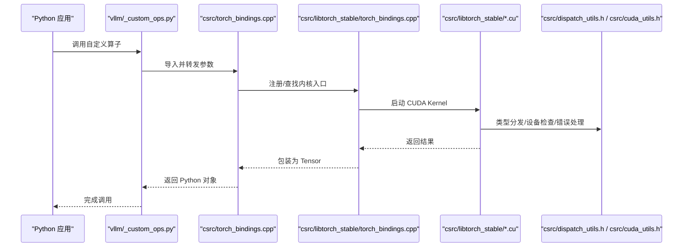

图表来源
- [vllm/_custom_ops.py:1-100](file://vllm/_custom_ops.py#L1-L100)
- [csrc/torch_bindings.cpp:1-200](file://csrc/torch_bindings.cpp#L1-L200)
- [csrc/libtorch_stable/torch_bindings.cpp:1-200](file://csrc/libtorch_stable/torch_bindings.cpp#L1-L200)
- [csrc/libtorch_stable/activation_kernels.cu:1-100](file://csrc/libtorch_stable/activation_kernels.cu#L1-L100)
- [csrc/dispatch_utils.h:1-100](file://csrc/dispatch_utils.h#L1-L100)
- [csrc/cuda_utils.h:1-100](file://csrc/cuda_utils.h#L1-L100)

## 详细组件分析

### CUDA 内核与类型分发
- 类型与设备分发
  - csrc/dispatch_utils.h 提供模板化分发与类型映射，确保不同 dtype 与设备路径正确选择
  - csrc/cuda_utils.h 封装常用 CUDA 工具函数（如流、错误检查、对齐、块/线程配置）
- 注意力与数据类型
  - csrc/attention/attention_generic.cuh 提供通用注意力模板
  - csrc/attention/dtype_* 系列头文件定义 BF16/F16/F32/FP8 等类型特化

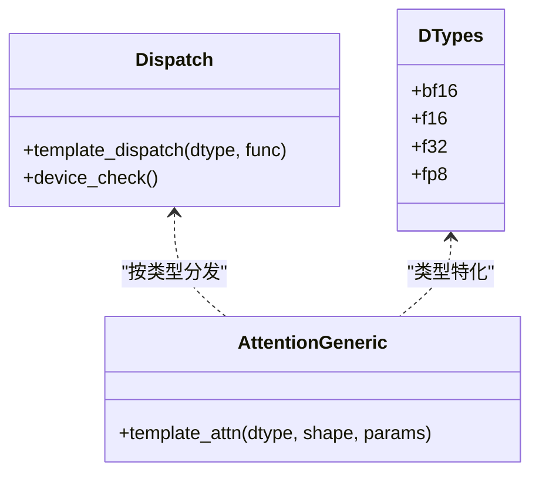

图表来源
- [csrc/dispatch_utils.h:1-100](file://csrc/dispatch_utils.h#L1-L100)
- [csrc/cuda_utils.h:1-100](file://csrc/cuda_utils.h#L1-L100)
- [csrc/attention/attention_generic.cuh:1-100](file://csrc/attention/attention_generic.cuh#L1-L100)
- [csrc/attention/dtype_bfloat16.cuh:1-100](file://csrc/attention/dtype_bfloat16.cuh#L1-L100)
- [csrc/attention/dtype_float16.cuh:1-100](file://csrc/attention/dtype_float16.cuh#L1-L100)
- [csrc/attention/dtype_float32.cuh:1-100](file://csrc/attention/dtype_float32.cuh#L1-L100)
- [csrc/attention/dtype_fp8.cuh:1-100](file://csrc/attention/dtype_fp8.cuh#L1-L100)

章节来源
- [csrc/dispatch_utils.h:1-100](file://csrc/dispatch_utils.h#L1-L100)
- [csrc/cuda_utils.h:1-100](file://csrc/cuda_utils.h#L1-L100)
- [csrc/attention/attention_generic.cuh:1-100](file://csrc/attention/attention_generic.cuh#L1-L100)
- [csrc/attention/dtype_bfloat16.cuh:1-100](file://csrc/attention/dtype_bfloat16.cuh#L1-L100)
- [csrc/attention/dtype_float16.cuh:1-100](file://csrc/attention/dtype_float16.cuh#L1-L100)
- [csrc/attention/dtype_float32.cuh:1-100](file://csrc/attention/dtype_float32.cuh#L1-L100)
- [csrc/attention/dtype_fp8.cuh:1-100](file://csrc/attention/dtype_fp8.cuh#L1-L100)

### 激活与归一化内核
- 激活函数：csrc/libtorch_stable/activation_kernels.cu
- LayerNorm/RMSNorm：csrc/libtorch_stable/layernorm_kernels.cu
- 位置编码：csrc/libtorch_stable/pos_encoding_kernels.cu
- 采样器：csrc/libtorch_stable/sampler.cu
- Top-K/Top-P：csrc/libtorch_stable/topk.cu、csrc/libtorch_stable/persistent_topk.cuh、csrc/libtorch_stable/cooperative_topk.cu

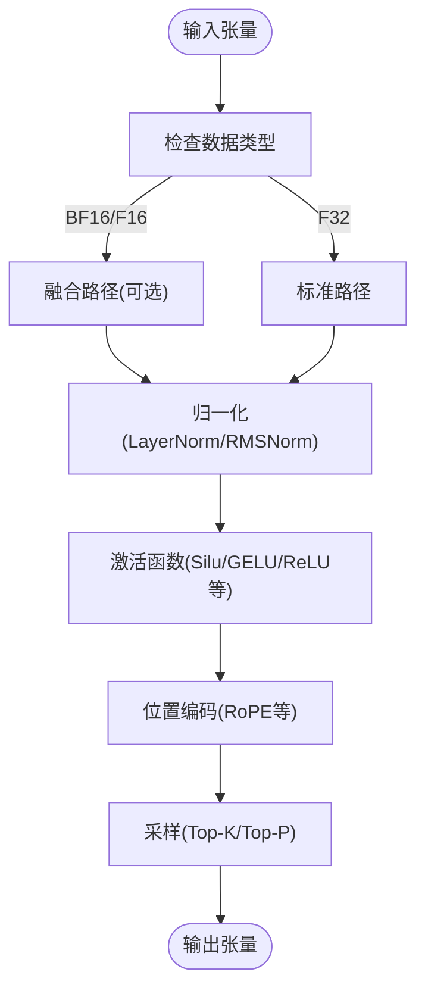

图表来源
- [csrc/libtorch_stable/activation_kernels.cu:1-100](file://csrc/libtorch_stable/activation_kernels.cu#L1-L100)
- [csrc/libtorch_stable/layernorm_kernels.cu:1-100](file://csrc/libtorch_stable/layernorm_kernels.cu#L1-L100)
- [csrc/libtorch_stable/pos_encoding_kernels.cu:1-100](file://csrc/libtorch_stable/pos_encoding_kernels.cu#L1-L100)
- [csrc/libtorch_stable/sampler.cu:1-100](file://csrc/libtorch_stable/sampler.cu#L1-L100)
- [csrc/libtorch_stable/topk.cu:1-100](file://csrc/libtorch_stable/topk.cu#L1-L100)
- [csrc/libtorch_stable/persistent_topk.cuh:1-100](file://csrc/libtorch_stable/persistent_topk.cuh#L1-L100)
- [csrc/libtorch_stable/cooperative_topk.cu:1-100](file://csrc/libtorch_stable/cooperative_topk.cu#L1-L100)

章节来源
- [csrc/libtorch_stable/activation_kernels.cu:1-100](file://csrc/libtorch_stable/activation_kernels.cu#L1-L100)
- [csrc/libtorch_stable/layernorm_kernels.cu:1-100](file://csrc/libtorch_stable/layernorm_kernels.cu#L1-L100)
- [csrc/libtorch_stable/pos_encoding_kernels.cu:1-100](file://csrc/libtorch_stable/pos_encoding_kernels.cu#L1-L100)
- [csrc/libtorch_stable/sampler.cu:1-100](file://csrc/libtorch_stable/sampler.cu#L1-L100)
- [csrc/libtorch_stable/topk.cu:1-100](file://csrc/libtorch_stable/topk.cu#L1-L100)
- [csrc/libtorch_stable/persistent_topk.cuh:1-100](file://csrc/libtorch_stable/persistent_topk.cuh#L1-L100)
- [csrc/libtorch_stable/cooperative_topk.cu:1-100](file://csrc/libtorch_stable/cooperative_topk.cu#L1-L100)

### KV Cache 与量化内核
- KV Cache：csrc/libtorch_stable/cache_kernels.cu、csrc/libtorch_stable/cache_kernels_fused.cu
- NVFP4 KV Cache：csrc/libtorch_stable/nvfp4_kv_cache_kernels.cu
- 量化相关：csrc/libtorch_stable/quantization/*（按模块组织）

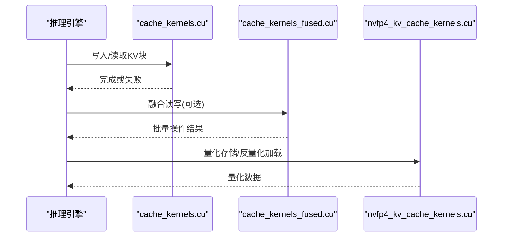

图表来源
- [csrc/libtorch_stable/cache_kernels.cu:1-100](file://csrc/libtorch_stable/cache_kernels.cu#L1-L100)
- [csrc/libtorch_stable/cache_kernels_fused.cu:1-100](file://csrc/libtorch_stable/cache_kernels_fused.cu#L1-L100)
- [csrc/libtorch_stable/nvfp4_kv_cache_kernels.cu:1-100](file://csrc/libtorch_stable/nvfp4_kv_cache_kernels.cu#L1-L100)

章节来源
- [csrc/libtorch_stable/cache_kernels.cu:1-100](file://csrc/libtorch_stable/cache_kernels.cu#L1-L100)
- [csrc/libtorch_stable/cache_kernels_fused.cu:1-100](file://csrc/libtorch_stable/cache_kernels_fused.cu#L1-L100)
- [csrc/libtorch_stable/nvfp4_kv_cache_kernels.cu:1-100](file://csrc/libtorch_stable/nvfp4_kv_cache_kernels.cu#L1-L100)

### GEMM 与路由内核
- FP32 路由 GEMM：csrc/libtorch_stable/fp32_router_gemm.cu、csrc/libtorch_stable/fp32_router_gemm_entry.cu
- DSV3 融合 GEMM：csrc/libtorch_stable/dsv3_fused_a_gemm.cu
- Permute 列重排：csrc/libtorch_stable/permute_cols.cu

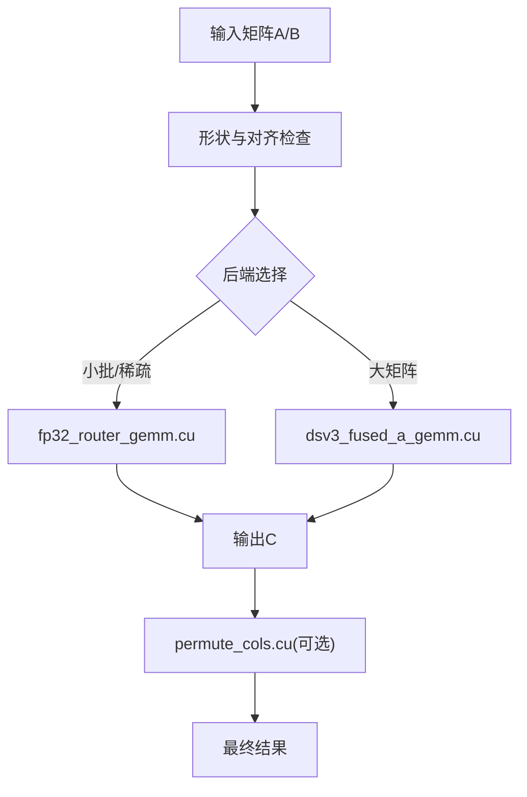

图表来源
- [csrc/libtorch_stable/fp32_router_gemm.cu:1-100](file://csrc/libtorch_stable/fp32_router_gemm.cu#L1-L100)
- [csrc/libtorch_stable/fp32_router_gemm_entry.cu:1-100](file://csrc/libtorch_stable/fp32_router_gemm_entry.cu#L1-L100)
- [csrc/libtorch_stable/dsv3_fused_a_gemm.cu:1-100](file://csrc/libtorch_stable/dsv3_fused_a_gemm.cu#L1-L100)
- [csrc/libtorch_stable/permute_cols.cu:1-100](file://csrc/libtorch_stable/permute_cols.cu#L1-L100)

章节来源
- [csrc/libtorch_stable/fp32_router_gemm.cu:1-100](file://csrc/libtorch_stable/fp32_router_gemm.cu#L1-L100)
- [csrc/libtorch_stable/fp32_router_gemm_entry.cu:1-100](file://csrc/libtorch_stable/fp32_router_gemm_entry.cu#L1-L100)
- [csrc/libtorch_stable/dsv3_fused_a_gemm.cu:1-100](file://csrc/libtorch_stable/dsv3_fused_a_gemm.cu#L1-L100)
- [csrc/libtorch_stable/permute_cols.cu:1-100](file://csrc/libtorch_stable/permute_cols.cu#L1-L100)

### 融合内核与向量工具
- 融合 QKNorm+RoPE+KV Insert：csrc/libtorch_stable/fused_qknorm_rope_kernel.cu、csrc/libtorch_stable/fused_deepseek_v4_qnorm_rope_kv_insert_kernel.cu、csrc/libtorch_stable/fused_minimax_m3_qnorm_rope_kv_insert_kernel.cu
- 向量工具与辅助：csrc/libtorch_stable/cuda_vec_utils.cuh、csrc/libtorch_stable/cub_helpers.h、csrc/libtorch_stable/launch_bounds_utils.h、csrc/libtorch_stable/type_convert.cuh、csrc/libtorch_stable/async_util.cuh

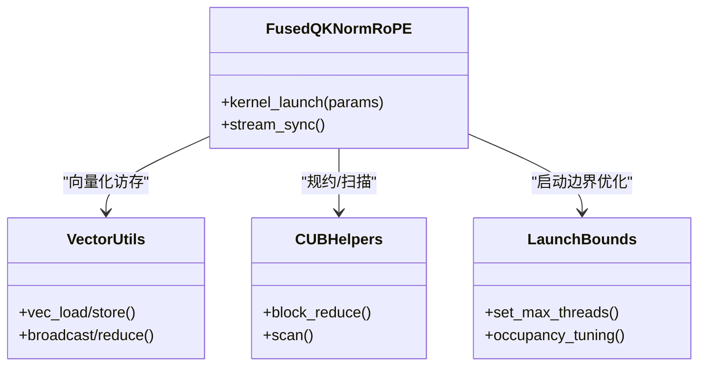

图表来源
- [csrc/libtorch_stable/fused_qknorm_rope_kernel.cu:1-100](file://csrc/libtorch_stable/fused_qknorm_rope_kernel.cu#L1-L100)
- [csrc/libtorch_stable/fused_deepseek_v4_qnorm_rope_kv_insert_kernel.cu:1-100](file://csrc/libtorch_stable/fused_deepseek_v4_qnorm_rope_kv_insert_kernel.cu#L1-L100)
- [csrc/libtorch_stable/fused_minimax_m3_qnorm_rope_kv_insert_kernel.cu:1-100](file://csrc/libtorch_stable/fused_minimax_m3_qnorm_rope_kv_insert_kernel.cu#L1-L100)
- [csrc/libtorch_stable/cuda_vec_utils.cuh:1-100](file://csrc/libtorch_stable/cuda_vec_utils.cuh#L1-L100)
- [csrc/libtorch_stable/cub_helpers.h:1-100](file://csrc/libtorch_stable/cub_helpers.h#L1-L100)
- [csrc/libtorch_stable/launch_bounds_utils.h:1-100](file://csrc/libtorch_stable/launch_bounds_utils.h#L1-L100)
- [csrc/libtorch_stable/type_convert.cuh:1-100](file://csrc/libtorch_stable/type_convert.cuh#L1-L100)
- [csrc/libtorch_stable/async_util.cuh:1-100](file://csrc/libtorch_stable/async_util.cuh#L1-L100)

章节来源
- [csrc/libtorch_stable/fused_qknorm_rope_kernel.cu:1-100](file://csrc/libtorch_stable/fused_qknorm_rope_kernel.cu#L1-L100)
- [csrc/libtorch_stable/fused_deepseek_v4_qnorm_rope_kv_insert_kernel.cu:1-100](file://csrc/libtorch_stable/fused_deepseek_v4_qnorm_rope_kv_insert_kernel.cu#L1-L100)
- [csrc/libtorch_stable/fused_minimax_m3_qnorm_rope_kv_insert_kernel.cu:1-100](file://csrc/libtorch_stable/fused_minimax_m3_qnorm_rope_kv_insert_kernel.cu#L1-L100)
- [csrc/libtorch_stable/cuda_vec_utils.cuh:1-100](file://csrc/libtorch_stable/cuda_vec_utils.cuh#L1-L100)
- [csrc/libtorch_stable/cub_helpers.h:1-100](file://csrc/libtorch_stable/cub_helpers.h#L1-L100)
- [csrc/libtorch_stable/launch_bounds_utils.h:1-100](file://csrc/libtorch_stable/launch_bounds_utils.h#L1-L100)
- [csrc/libtorch_stable/type_convert.cuh:1-100](file://csrc/libtorch_stable/type_convert.cuh#L1-L100)
- [csrc/libtorch_stable/async_util.cuh:1-100](file://csrc/libtorch_stable/async_util.cuh#L1-L100)

### 自定义算子：接口、内核与 Python 绑定
- 接口定义
  - csrc/ops.h 声明算子原型与参数约束
- 内核实现
  - csrc/libtorch_stable/*.cu 中的具体 CUDA 内核
- Python 绑定
  - csrc/torch_bindings.cpp、csrc/libtorch_stable/torch_bindings.cpp、csrc/cpu/torch_bindings.cpp、csrc/rocm/torch_bindings.cpp
  - vllm/_custom_ops.py、vllm/_xpu_ops.py、vllm/_aiter_ops.py

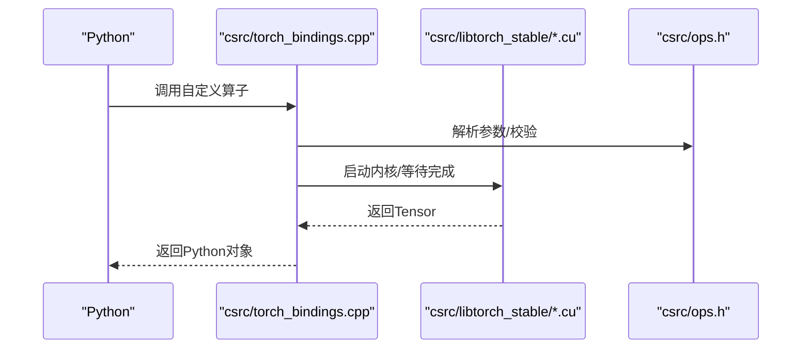

图表来源
- [csrc/ops.h:1-100](file://csrc/ops.h#L1-L100)
- [csrc/torch_bindings.cpp:1-200](file://csrc/torch_bindings.cpp#L1-L200)
- [csrc/libtorch_stable/torch_bindings.cpp:1-200](file://csrc/libtorch_stable/torch_bindings.cpp#L1-L200)
- [csrc/libtorch_stable/activation_kernels.cu:1-100](file://csrc/libtorch_stable/activation_kernels.cu#L1-L100)
- [vllm/_custom_ops.py:1-100](file://vllm/_custom_ops.py#L1-L100)

章节来源
- [csrc/ops.h:1-100](file://csrc/ops.h#L1-L100)
- [csrc/torch_bindings.cpp:1-200](file://csrc/torch_bindings.cpp#L1-L200)
- [csrc/libtorch_stable/torch_bindings.cpp:1-200](file://csrc/libtorch_stable/torch_bindings.cpp#L1-L200)
- [csrc/libtorch_stable/activation_kernels.cu:1-100](file://csrc/libtorch_stable/activation_kernels.cu#L1-L100)
- [vllm/_custom_ops.py:1-100](file://vllm/_custom_ops.py#L1-L100)

### Triton 内核开发
- 构建集成
  - cmake/external_projects/triton_kernels.cmake 负责 Triton 内核的编译与链接
- Python 侧工具
  - vllm/triton_utils/* 提供 Triton 工具与调度
- 建议
  - 使用 Triton 的 tile 与 block 抽象提升访存局部性
  - 利用 shared memory 减少全局内存访问
  - 结合 vLLM 的分发机制进行 dtype 与设备选择

章节来源
- [cmake/external_projects/triton_kernels.cmake:1-100](file://cmake/external_projects/triton_kernels.cmake#L1-L100)
- [vllm/triton_utils/*:1-100](file://vllm/triton_utils/)

### CMake 构建系统与自定义编译规则
- 顶层构建
  - CMakeLists.txt 定义目标、编译器选项、依赖库
  - setup.py 驱动 Python 扩展构建与安装
- 工具脚本
  - cmake/utils.cmake 提供通用宏与规则
  - cmake/hipify.py 用于 ROCm 适配转换
- 外部项目
  - triton_kernels.cmake 集成 Triton 内核构建

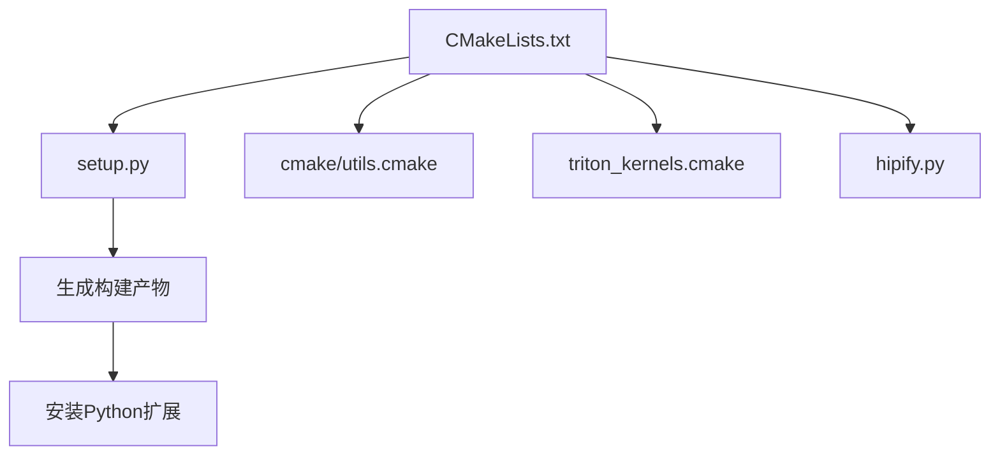

图表来源
- [CMakeLists.txt:1-100](file://CMakeLists.txt#L1-L100)
- [setup.py:1-200](file://setup.py#L1-L200)
- [cmake/utils.cmake:1-100](file://cmake/utils.cmake#L1-L100)
- [cmake/external_projects/triton_kernels.cmake:1-100](file://cmake/external_projects/triton_kernels.cmake#L1-L100)
- [cmake/hipify.py:1-100](file://cmake/hipify.py#L1-L100)

章节来源
- [CMakeLists.txt:1-100](file://CMakeLists.txt#L1-L100)
- [setup.py:1-200](file://setup.py#L1-L200)
- [cmake/utils.cmake:1-100](file://cmake/utils.cmake#L1-L100)
- [cmake/external_projects/triton_kernels.cmake:1-100](file://cmake/external_projects/triton_kernels.cmake#L1-L100)
- [cmake/hipify.py:1-100](file://cmake/hipify.py#L1-L100)

### 内存管理与通信
- 内存分配
  - csrc/cumem_allocator.cpp 提供 CUDA 内存分配器
- I/O 与同步
  - csrc/fs_io.cpp 文件系统操作
  - csrc/spinloop.cpp 自旋锁实现
- 通信与规约
  - csrc/custom_all_reduce.cuh、csrc/custom_quickreduce.cu、csrc/quickreduce/*

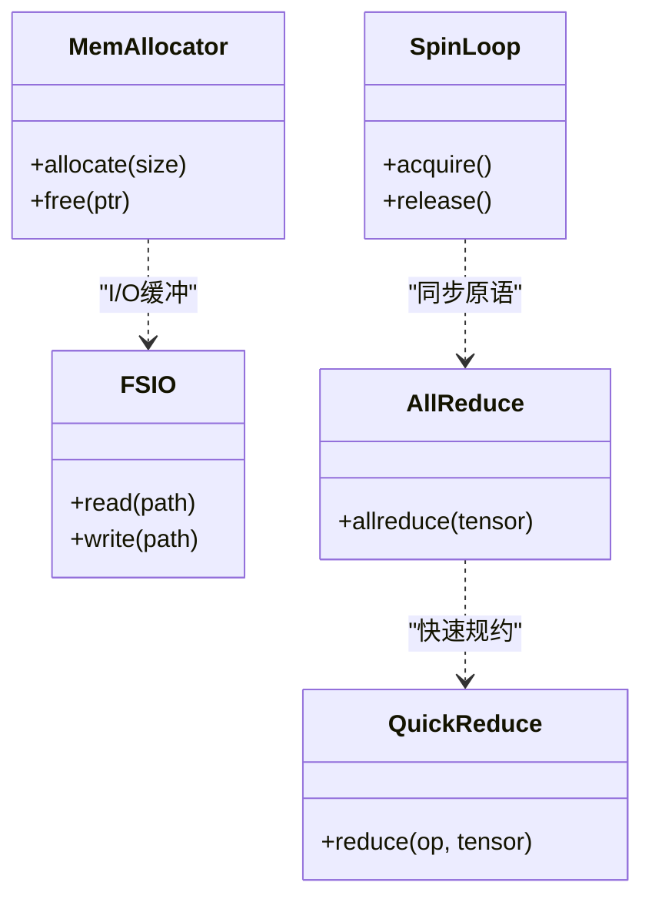

图表来源
- [csrc/cumem_allocator.cpp:1-100](file://csrc/cumem_allocator.cpp#L1-L100)
- [csrc/fs_io.cpp:1-100](file://csrc/fs_io.cpp#L1-L100)
- [csrc/spinloop.cpp:1-100](file://csrc/spinloop.cpp#L1-L100)
- [csrc/custom_all_reduce.cuh:1-100](file://csrc/custom_all_reduce.cuh#L1-L100)
- [csrc/custom_quickreduce.cu:1-100](file://csrc/custom_quickreduce.cu#L1-L100)
- [csrc/quickreduce/base.h:1-100](file://csrc/quickreduce/base.h#L1-L100)
- [csrc/quickreduce/quick_reduce.h:1-100](file://csrc/quickreduce/quick_reduce.h#L1-L100)
- [csrc/quickreduce/quick_reduce_impl.cuh:1-100](file://csrc/quickreduce/quick_reduce_impl.cuh#L1-L100)

章节来源
- [csrc/cumem_allocator.cpp:1-100](file://csrc/cumem_allocator.cpp#L1-L100)
- [csrc/fs_io.cpp:1-100](file://csrc/fs_io.cpp#L1-L100)
- [csrc/spinloop.cpp:1-100](file://csrc/spinloop.cpp#L1-L100)
- [csrc/custom_all_reduce.cuh:1-100](file://csrc/custom_all_reduce.cuh#L1-L100)
- [csrc/custom_quickreduce.cu:1-100](file://csrc/custom_quickreduce.cu#L1-L100)
- [csrc/quickreduce/base.h:1-100](file://csrc/quickreduce/base.h#L1-L100)
- [csrc/quickreduce/quick_reduce.h:1-100](file://csrc/quickreduce/quick_reduce.h#L1-L100)
- [csrc/quickreduce/quick_reduce_impl.cuh:1-100](file://csrc/quickreduce/quick_reduce_impl.cuh#L1-L100)

### Cutlass 扩展与类型工具
- 扩展入口：csrc/cutlass_extensions/vllm_cutlass_library_extension.py
- 工具头文件：csrc/cutlass_extensions/cute_utils.cuh、csrc/cutlass_extensions/vllm_type_utils.cuh

章节来源
- [csrc/cutlass_extensions/vllm_cutlass_library_extension.py:1-100](file://csrc/cutlass_extensions/vllm_cutlass_library_extension.py#L1-L100)
- [csrc/cutlass_extensions/cute_utils.cuh:1-100](file://csrc/cutlass_extensions/cute_utils.cuh#L1-L100)
- [csrc/cutlass_extensions/vllm_type_utils.cuh:1-100](file://csrc/cutlass_extensions/vllm_type_utils.cuh#L1-L100)

## 依赖关系分析
- 内核与工具链
  - 内核依赖 dispatch 与 cuda_utils 进行类型与设备分发
  - 注意力与量化内核依赖 cutlass 与 quickreduce
- Python 绑定与构建
  - torch_bindings.cpp 依赖 ops.h 与内核实现
  - setup.py 与 CMakeLists.txt 协调构建流程

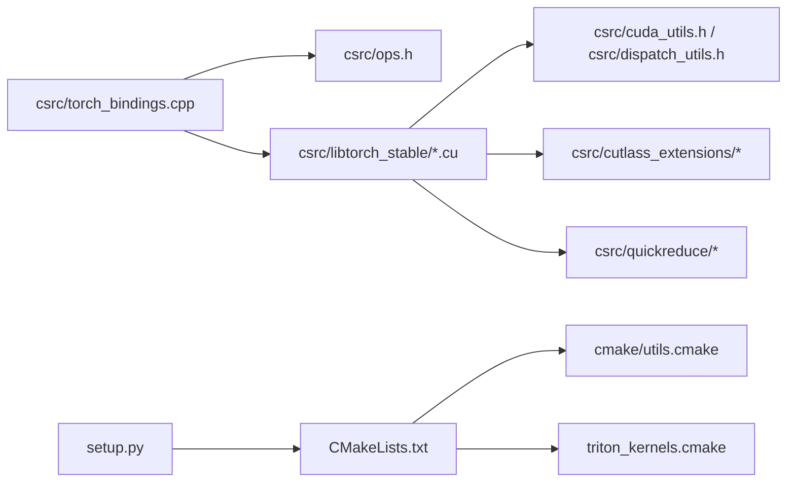

图表来源
- [csrc/torch_bindings.cpp:1-200](file://csrc/torch_bindings.cpp#L1-L200)
- [csrc/ops.h:1-100](file://csrc/ops.h#L1-L100)
- [csrc/libtorch_stable/activation_kernels.cu:1-100](file://csrc/libtorch_stable/activation_kernels.cu#L1-L100)
- [csrc/cuda_utils.h:1-100](file://csrc/cuda_utils.h#L1-L100)
- [csrc/dispatch_utils.h:1-100](file://csrc/dispatch_utils.h#L1-L100)
- [csrc/cutlass_extensions/vllm_cutlass_library_extension.py:1-100](file://csrc/cutlass_extensions/vllm_cutlass_library_extension.py#L1-L100)
- [csrc/quickreduce/quick_reduce.h:1-100](file://csrc/quickreduce/quick_reduce.h#L1-L100)
- [setup.py:1-200](file://setup.py#L1-L200)
- [CMakeLists.txt:1-100](file://CMakeLists.txt#L1-L100)
- [cmake/utils.cmake:1-100](file://cmake/utils.cmake#L1-L100)
- [cmake/external_projects/triton_kernels.cmake:1-100](file://cmake/external_projects/triton_kernels.cmake#L1-L100)

章节来源
- [csrc/torch_bindings.cpp:1-200](file://csrc/torch_bindings.cpp#L1-L200)
- [csrc/ops.h:1-100](file://csrc/ops.h#L1-L100)
- [csrc/libtorch_stable/activation_kernels.cu:1-100](file://csrc/libtorch_stable/activation_kernels.cu#L1-L100)
- [csrc/cuda_utils.h:1-100](file://csrc/cuda_utils.h#L1-L100)
- [csrc/dispatch_utils.h:1-100](file://csrc/dispatch_utils.h#L1-L100)
- [csrc/cutlass_extensions/vllm_cutlass_library_extension.py:1-100](file://csrc/cutlass_extensions/vllm_cutlass_library_extension.py#L1-L100)
- [csrc/quickreduce/quick_reduce.h:1-100](file://csrc/quickreduce/quick_reduce.h#L1-L100)
- [setup.py:1-200](file://setup.py#L1-L200)
- [CMakeLists.txt:1-100](file://CMakeLists.txt#L1-L100)
- [cmake/utils.cmake:1-100](file://cmake/utils.cmake#L1-L100)
- [cmake/external_projects/triton_kernels.cmake:1-100](file://cmake/external_projects/triton_kernels.cmake#L1-L100)

## 性能考量
- 访存优化
  - 合并访存与向量化（参考 csrc/libtorch_stable/cuda_vec_utils.cuh）
  - Shared Memory 缓存热点数据（参考 csrc/libtorch_stable/cub_helpers.h）
- 并行度与占用率
  - 使用 launch bounds 调整线程块大小（参考 csrc/libtorch_stable/launch_bounds_utils.h）
- 融合与流水线
  - 将多步操作融合以减少内核启动开销（参考 fused_qknorm_rope_kernel.cu 等）
- 量化与低精度
  - 使用 BF16/F16/FP8/NVFP4 降低带宽压力（参考 attention/dtype_* 与 nvfp4_kv_cache_kernels.cu）
- 异步与流
  - 合理划分 CUDA Stream 提高吞吐（参考 csrc/libtorch_stable/async_util.cuh）

[本节为通用指导，不直接分析具体文件]

## 故障排查指南
- 常见问题
  - 类型不匹配：检查 dispatch 与 dtype 特化（csrc/dispatch_utils.h、csrc/attention/dtype_*）
  - 内存越界：核对张量形状与对齐（csrc/cuda_utils.h）
  - 内核未找到：确认 torch_bindings.cpp 是否正确注册（csrc/torch_bindings.cpp、csrc/libtorch_stable/torch_bindings.cpp）
  - 构建失败：检查 CMakeLists.txt 与 setup.py 配置（CMakeLists.txt、setup.py）
- 调试技巧
  - 使用 Nsight Systems/Compute 定位瓶颈
  - 打印关键中间值与断点调试（谨慎在生产环境）
  - 使用单元测试验证正确性（tests/kernels/*）
- 性能分析
  - 使用 benchmarks/kernels/* 进行基准测试
  - 对比不同 kernel 实现的吞吐与延迟

章节来源
- [csrc/dispatch_utils.h:1-100](file://csrc/dispatch_utils.h#L1-L100)
- [csrc/attention/dtype_bfloat16.cuh:1-100](file://csrc/attention/dtype_bfloat16.cuh#L1-L100)
- [csrc/cuda_utils.h:1-100](file://csrc/cuda_utils.h#L1-L100)
- [csrc/torch_bindings.cpp:1-200](file://csrc/torch_bindings.cpp#L1-L200)
- [csrc/libtorch_stable/torch_bindings.cpp:1-200](file://csrc/libtorch_stable/torch_bindings.cpp#L1-L200)
- [CMakeLists.txt:1-100](file://CMakeLists.txt#L1-L100)
- [setup.py:1-200](file://setup.py#L1-L200)
- [tests/kernels/test_cache_kernels.py:1-100](file://tests/kernels/test_cache_kernels.py#L1-L100)
- [benchmarks/kernels/benchmark_activation.py:1-100](file://benchmarks/kernels/benchmark_activation.py#L1-L100)
- [benchmarks/kernels/benchmark_layernorm.py:1-100](file://benchmarks/kernels/benchmark_layernorm.py#L1-L100)
- [benchmarks/kernels/benchmark_paged_attention.py:1-100](file://benchmarks/kernels/benchmark_paged_attention.py#L1-L100)

## 结论
vLLM 的内核体系以清晰的层次与模块化设计为基础，通过类型分发、融合内核、量化与通信优化实现了高性能推理。开发者可依据本文档的流程与最佳实践，快速实现与优化自定义算子，并通过构建系统与测试基准保障质量与性能。

[本节为总结，不直接分析具体文件]

## 附录
- 常见 CUDA 陷阱与解决方案
  - 未初始化变量导致不确定行为：确保所有路径初始化
  - 非法内存访问：严格检查索引与边界
  - 竞态条件：合理使用原子操作与同步
  - 内核启动失败：检查返回值与错误码
- 与 PyTorch 集成最佳实践
  - 使用 torch::autograd 扩展时保持梯度一致性
  - 避免不必要的 host-device 拷贝
  - 使用统一内存或显式管理生命周期
- 实际示例与性能对比
  - 激活函数：benchmarks/kernels/benchmark_activation.py
  - 归一化：benchmarks/kernels/benchmark_layernorm.py
  - 注意力：benchmarks/kernels/benchmark_paged_attention.py
  - 单元测试：tests/kernels/test_cache_kernels.py、tests/kernels/test_ll_bf16_gemm.py、tests/kernels/test_top_k_per_row.py

[本节为补充信息，不直接分析具体文件]