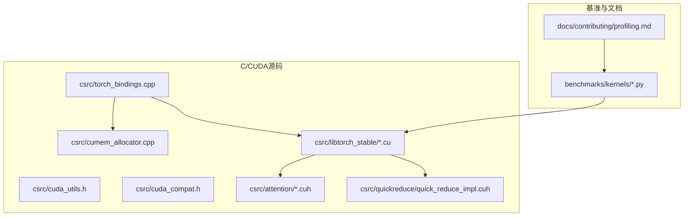
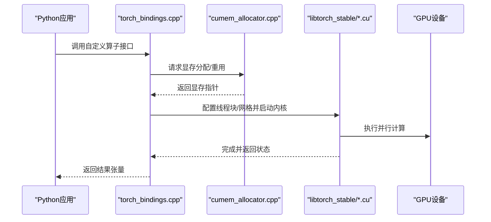
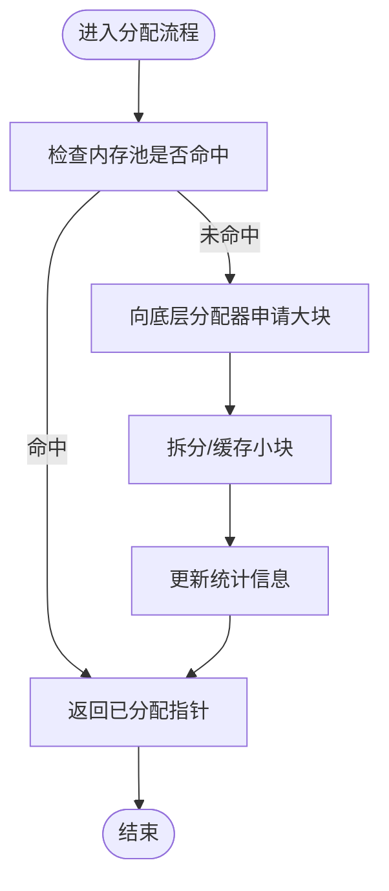
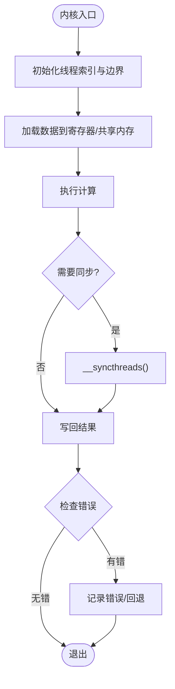
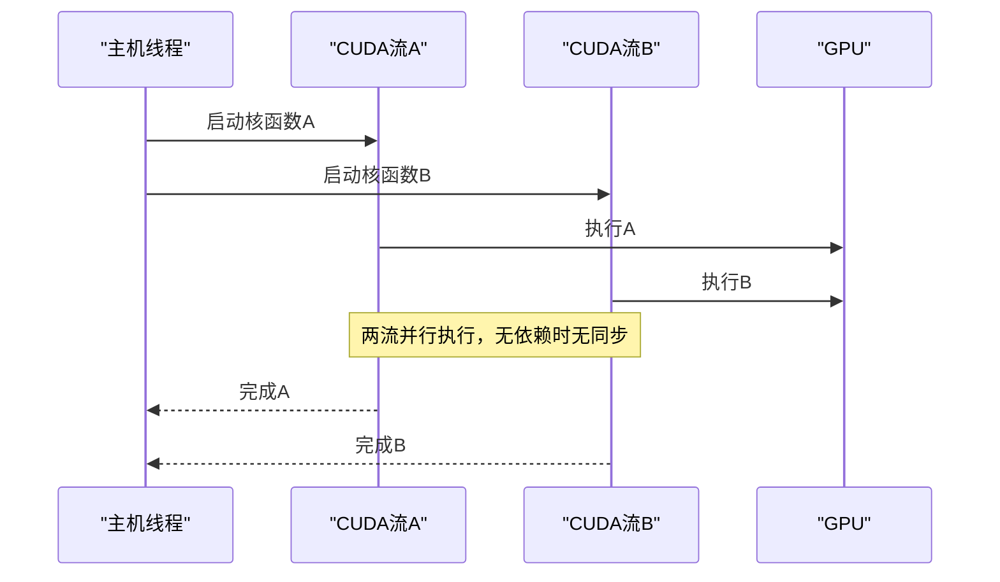
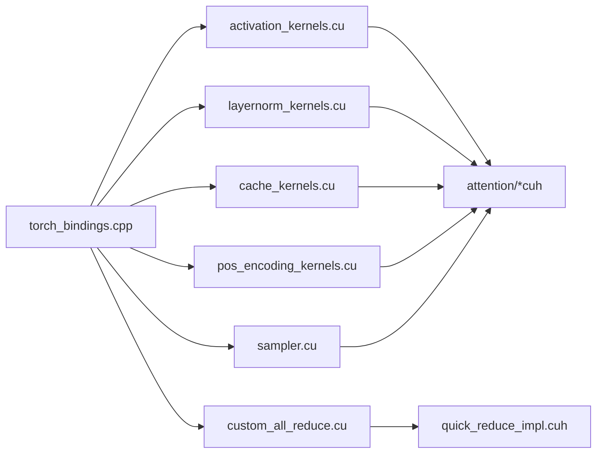

# CUDA编程基础

<cite>
**本文引用的文件**   
- [cumem_allocator.cpp](file://csrc/cumem_allocator.cpp)
- [cuda_utils.h](file://csrc/cuda_utils.h)
- [cuda_compat.h](file://csrc/cuda_compat.h)
- [torch_bindings.cpp](file://csrc/torch_bindings.cpp)
- [activation_kernels.cu](file://csrc/libtorch_stable/activation_kernels.cu)
- [layernorm_kernels.cu](file://csrc/libtorch_stable/layernorm_kernels.cu)
- [cache_kernels.cu](file://csrc/libtorch_stable/cache_kernels.cu)
- [pos_encoding_kernels.cu](file://csrc/libtorch_stable/pos_encoding_kernels.cu)
- [sampler.cu](file://csrc/libtorch_stable/sampler.cu)
- [custom_all_reduce.cu](file://csrc/custom_all_reduce.cu)
- [quick_reduce_impl.cuh](file://csrc/quickreduce/quick_reduce_impl.cuh)
- [dispatch_utils.h](file://csrc/dispatch_utils.h)
- [launch_bounds_utils.h](file://csrc/libtorch_stable/launch_bounds_utils.h)
- [cuda_vec_utils.cuh](file://csrc/libtorch_stable/cuda_vec_utils.cuh)
- [type_convert.cuh](file://csrc/libtorch_stable/type_convert.cuh)
- [attention_generic.cuh](file://csrc/attention/attention_generic.cuh)
- [dtype_bfloat16.cuh](file://csrc/attention/dtype_bfloat16.cuh)
- [dtype_float16.cuh](file://csrc/attention/dtype_float16.cuh)
- [dtype_float32.cuh](file://csrc/attention/dtype_float32.cuh)
- [dtype_fp8.cuh](file://csrc/attention/dtype_fp8.cuh)
- [bench_paged_attention.py](file://benchmarks/kernels/benchmark_paged_attention.py)
- [bench_layernorm.py](file://benchmarks/kernels/benchmark_layernorm.py)
- [bench_rope.py](file://benchmarks/kernels/benchmark_rope.py)
- [profiling.md](file://docs/contributing/profiling.md)
</cite>

## 目录
1. [简介](#简介)
2. [项目结构](#项目结构)
3. [核心组件](#核心组件)
4. [架构总览](#架构总览)
5. [详细组件分析](#详细组件分析)
6. [依赖关系分析](#依赖关系分析)
7. [性能考量](#性能考量)
8. [故障排查指南](#故障排查指南)
9. [结论](#结论)
10. [附录](#附录)

## 简介
本文件面向希望在vLLM中深入理解并实践CUDA编程的读者，系统讲解CUDA线程模型、内存层次结构与并行计算模式，并结合vLLM中的实际实现与基准测试，给出GPU显存管理策略（分配、拷贝优化、内存池）、内核编写规范（线程块组织、同步机制、错误处理）、CUDA流与多流异步执行、以及性能优化的关键技巧（访存模式、寄存器使用、指令级并行）。文档同时提供可定位的代码路径与基准脚本，帮助读者快速复现实验与验证优化效果。

## 项目结构
vLLM中与CUDA相关的代码主要分布在以下位置：
- csrc: C++/CUDA底层实现，包含自定义CUDA分配器、内核绑定、通用工具与类型定义等
- csrc/libtorch_stable: 基于libtorch封装的CUDA内核集合（激活、层归一化、缓存、位置编码、采样等）
- csrc/attention: 注意力相关的数据类型与通用模板
- benchmarks/kernels: 针对各类内核的基准测试脚本
- docs/contributing/profiling.md: 性能分析与调试指南

图表来源 
- [cumem_allocator.cpp](file://csrc/cumem_allocator.cpp)
- [cuda_utils.h](file://csrc/cuda_utils.h)
- [cuda_compat.h](file://csrc/cuda_compat.h)
- [torch_bindings.cpp](file://csrc/torch_bindings.cpp)
- [activation_kernels.cu](file://csrc/libtorch_stable/activation_kernels.cu)
- [layernorm_kernels.cu](file://csrc/libtorch_stable/layernorm_kernels.cu)
- [cache_kernels.cu](file://csrc/libtorch_stable/cache_kernels.cu)
- [pos_encoding_kernels.cu](file://csrc/libtorch_stable/pos_encoding_kernels.cu)
- [sampler.cu](file://csrc/libtorch_stable/sampler.cu)
- [attention_generic.cuh](file://csrc/attention/attention_generic.cuh)
- [dtype_bfloat16.cuh](file://csrc/attention/dtype_bfloat16.cuh)
- [dtype_float16.cuh](file://csrc/attention/dtype_float16.cuh)
- [dtype_float32.cuh](file://csrc/attention/dtype_float32.cuh)
- [dtype_fp8.cuh](file://csrc/attention/dtype_fp8.cuh)
- [quick_reduce_impl.cuh](file://csrc/quickreduce/quick_reduce_impl.cuh)
- [bench_paged_attention.py](file://benchmarks/kernels/benchmark_paged_attention.py)
- [bench_layernorm.py](file://benchmarks/kernels/benchmark_layernorm.py)
- [bench_rope.py](file://benchmarks/kernels/benchmark_rope.py)
- [profiling.md](file://docs/contributing/profiling.md)

章节来源
- [cumem_allocator.cpp](file://csrc/cumem_allocator.cpp)
- [cuda_utils.h](file://csrc/cuda_utils.h)
- [cuda_compat.h](file://csrc/cuda_compat.h)
- [torch_bindings.cpp](file://csrc/torch_bindings.cpp)
- [activation_kernels.cu](file://csrc/libtorch_stable/activation_kernels.cu)
- [layernorm_kernels.cu](file://csrc/libtorch_stable/layernorm_kernels.cu)
- [cache_kernels.cu](file://csrc/libtorch_stable/cache_kernels.cu)
- [pos_encoding_kernels.cu](file://csrc/libtorch_stable/pos_encoding_kernels.cu)
- [sampler.cu](file://csrc/libtorch_stable/sampler.cu)
- [attention_generic.cuh](file://csrc/attention/attention_generic.cuh)
- [dtype_bfloat16.cuh](file://csrc/attention/dtype_bfloat16.cuh)
- [dtype_float16.cuh](file://csrc/attention/dtype_float16.cuh)
- [dtype_float32.cuh](file://csrc/attention/dtype_float32.cuh)
- [dtype_fp8.cuh](file://csrc/attention/dtype_fp8.cuh)
- [quick_reduce_impl.cuh](file://csrc/quickreduce/quick_reduce_impl.cuh)
- [bench_paged_attention.py](file://benchmarks/kernels/benchmark_paged_attention.py)
- [bench_layernorm.py](file://benchmarks/kernels/benchmark_layernorm.py)
- [bench_rope.py](file://benchmarks/kernels/benchmark_rope.py)
- [profiling.md](file://docs/contributing/profiling.md)

## 核心组件
- CUDA分配器与内存池
  - vLLM通过自定义CUDA分配器对显存进行集中管理，减少碎片并提升复用率，适合大模型推理场景下频繁的小块分配与释放。
  - 典型职责包括：显存分配/释放、对齐策略、统计信息收集、与PyTorch/Tensor分配器的集成。
- CUDA内核集合
  - 激活函数、层归一化、KV缓存操作、位置编码、采样等高频算子均以CUDA内核实现，追求高吞吐与低延迟。
- 类型与工具
  - 统一的数值类型定义（BF16/F16/F32/FP8）、向量化工具、类型转换、调度与启动边界控制等。
- 通信与规约
  - 自定义AllReduce与快速规约实现，用于分布式场景下的参数或中间结果聚合。

章节来源
- [cumem_allocator.cpp](file://csrc/cumem_allocator.cpp)
- [activation_kernels.cu](file://csrc/libtorch_stable/activation_kernels.cu)
- [layernorm_kernels.cu](file://csrc/libtorch_stable/layernorm_kernels.cu)
- [cache_kernels.cu](file://csrc/libtorch_stable/cache_kernels.cu)
- [pos_encoding_kernels.cu](file://csrc/libtorch_stable/pos_encoding_kernels.cu)
- [sampler.cu](file://csrc/libtorch_stable/sampler.cu)
- [attention_generic.cuh](file://csrc/attention/attention_generic.cuh)
- [dtype_bfloat16.cuh](file://csrc/attention/dtype_bfloat16.cuh)
- [dtype_float16.cuh](file://csrc/attention/dtype_float16.cuh)
- [dtype_float32.cuh](file://csrc/attention/dtype_float32.cuh)
- [dtype_fp8.cuh](file://csrc/attention/dtype_fp8.cuh)
- [cuda_vec_utils.cuh](file://csrc/libtorch_stable/cuda_vec_utils.cuh)
- [type_convert.cuh](file://csrc/libtorch_stable/type_convert.cuh)
- [dispatch_utils.h](file://csrc/dispatch_utils.h)
- [launch_bounds_utils.h](file://csrc/libtorch_stable/launch_bounds_utils.h)
- [custom_all_reduce.cu](file://csrc/custom_all_reduce.cu)
- [quick_reduce_impl.cuh](file://csrc/quickreduce/quick_reduce_impl.cuh)

## 架构总览
下图展示了从Python调用到CUDA内核执行的典型路径，以及内存分配与内核调度的关键节点。

图表来源 
- [torch_bindings.cpp](file://csrc/torch_bindings.cpp)
- [cumem_allocator.cpp](file://csrc/cumem_allocator.cpp)
- [activation_kernels.cu](file://csrc/libtorch_stable/activation_kernels.cu)
- [layernorm_kernels.cu](file://csrc/libtorch_stable/layernorm_kernels.cu)
- [cache_kernels.cu](file://csrc/libtorch_stable/cache_kernels.cu)
- [pos_encoding_kernels.cu](file://csrc/libtorch_stable/pos_encoding_kernels.cu)
- [sampler.cu](file://csrc/libtorch_stable/sampler.cu)

## 详细组件分析

### CUDA线程模型与并行模式
- 线程模型
  - 核函数以“网格-块-线程”三级组织，合理划分线程块大小与网格维度是性能关键。
  - 常用模式包括：元素级并行（逐元素激活/归一化）、矩阵乘/规约（GEMM/AllReduce）、分块访存（Tile-based加载）。
- 并行模式
  - 数据并行：每个线程处理不同数据元素，适用于访存连续、计算独立的场景。
  - 任务并行：将任务分解为多个核函数，通过CUDA流并发执行。
  - 流水线并行：将长计算拆分为阶段，重叠I/O与计算。

章节来源
- [dispatch_utils.h](file://csrc/dispatch_utils.h)
- [launch_bounds_utils.h](file://csrc/libtorch_stable/launch_bounds_utils.h)
- [activation_kernels.cu](file://csrc/libtorch_stable/activation_kernels.cu)
- [layernorm_kernels.cu](file://csrc/libtorch_stable/layernorm_kernels.cu)
- [cache_kernels.cu](file://csrc/libtorch_stable/cache_kernels.cu)
- [pos_encoding_kernels.cu](file://csrc/libtorch_stable/pos_encoding_kernels.cu)
- [sampler.cu](file://csrc/libtorch_stable/sampler.cu)

### 内存层次结构与访问优化
- 层次结构
  - 全局内存（显存）、共享内存、L1/L2缓存、寄存器。
  - 合理使用共享内存做tile缓存，避免bank冲突；利用向量化访存（如float4）提高带宽利用率。
- 访存模式
  - 合并访存（coalesced access）优先，保证相邻线程访问连续地址。
  - 预取与重排：在需要时进行数据重排以减少随机访存。
- 类型与精度
  - BF16/F16/FP8在注意力与激活中广泛使用，配合类型转换工具减少精度损失。

章节来源
- [cuda_vec_utils.cuh](file://csrc/libtorch_stable/cuda_vec_utils.cuh)
- [type_convert.cuh](file://csrc/libtorch_stable/type_convert.cuh)
- [dtype_bfloat16.cuh](file://csrc/attention/dtype_bfloat16.cuh)
- [dtype_float16.cuh](file://csrc/attention/dtype_float16.cuh)
- [dtype_float32.cuh](file://csrc/attention/dtype_float32.cuh)
- [dtype_fp8.cuh](file://csrc/attention/dtype_fp8.cuh)
- [cache_kernels.cu](file://csrc/libtorch_stable/cache_kernels.cu)

### 显存管理与内存池
- 分配策略
  - 自定义分配器支持大块分配与小对象缓存，降低分配开销与碎片。
  - 对齐与页对齐策略确保高效DMA与核函数访存。
- 拷贝优化
  - 批量拷贝、零拷贝（pinned memory）与异步拷贝结合，减少CPU-GPU往返。
- 内存池技术
  - 按尺寸分类的内存池，命中率高时显著降低分配延迟。
  - 统计与监控：记录命中率、碎片率、峰值占用，辅助容量规划。

图表来源 
- [cumem_allocator.cpp](file://csrc/cumem_allocator.cpp)

章节来源
- [cumem_allocator.cpp](file://csrc/cumem_allocator.cpp)

### CUDA内核编写规范
- 线程块组织
  - 根据问题规模选择合适block size，兼顾 occupancy 与访存效率。
  - 使用动态共享内存时需评估最大占用与边界条件。
- 同步机制
  - __syncthreads()用于块内同步，注意避免死锁与分支发散。
  - 跨块同步应通过原子操作或外部同步点（事件/流）。
- 错误处理
  - 内核启动后检查错误码，必要时回退到安全路径。
  - 日志与断言结合，便于定位异常。

图表来源 
- [activation_kernels.cu](file://csrc/libtorch_stable/activation_kernels.cu)
- [layernorm_kernels.cu](file://csrc/libtorch_stable/layernorm_kernels.cu)
- [cache_kernels.cu](file://csrc/libtorch_stable/cache_kernels.cu)
- [pos_encoding_kernels.cu](file://csrc/libtorch_stable/pos_encoding_kernels.cu)
- [sampler.cu](file://csrc/libtorch_stable/sampler.cu)

章节来源
- [activation_kernels.cu](file://csrc/libtorch_stable/activation_kernels.cu)
- [layernorm_kernels.cu](file://csrc/libtorch_stable/layernorm_kernels.cu)
- [cache_kernels.cu](file://csrc/libtorch_stable/cache_kernels.cu)
- [pos_encoding_kernels.cu](file://csrc/libtorch_stable/pos_encoding_kernels.cu)
- [sampler.cu](file://csrc/libtorch_stable/sampler.cu)

### CUDA流与多流异步执行
- 单流顺序执行：默认流保证顺序性，适合简单链路。
- 多流并行：将独立任务分配到不同流，提升吞吐；需关注资源竞争与同步点。
- 异步拷贝与核函数：使用非默认流与事件实现重叠，最大化隐藏延迟。

图表来源 
- [torch_bindings.cpp](file://csrc/torch_bindings.cpp)
- [custom_all_reduce.cu](file://csrc/custom_all_reduce.cu)

章节来源
- [torch_bindings.cpp](file://csrc/torch_bindings.cpp)
- [custom_all_reduce.cu](file://csrc/custom_all_reduce.cu)

### 通信与规约（AllReduce与快速规约）
- AllReduce用于分布式训练/推理中的梯度或权重聚合。
- 快速规约实现针对特定硬件优化，减少通信开销。

章节来源
- [custom_all_reduce.cu](file://csrc/custom_all_reduce.cu)
- [quick_reduce_impl.cuh](file://csrc/quickreduce/quick_reduce_impl.cuh)

## 依赖关系分析
- torch_bindings.cpp作为Python与CUDA内核的桥接层，负责参数解析、内存分配与内核启动。
- libtorch_stable下的*.cu文件依赖类型与工具头文件（如cuda_vec_utils.cuh、type_convert.cuh），并通过dispatch_utils.h进行调度。
- attention模块的类型定义被多个内核复用，确保一致性。
- quickreduce与custom_all_reduce提供通信原语，供上层分布式逻辑调用。

图表来源 
- [torch_bindings.cpp](file://csrc/torch_bindings.cpp)
- [activation_kernels.cu](file://csrc/libtorch_stable/activation_kernels.cu)
- [layernorm_kernels.cu](file://csrc/libtorch_stable/layernorm_kernels.cu)
- [cache_kernels.cu](file://csrc/libtorch_stable/cache_kernels.cu)
- [pos_encoding_kernels.cu](file://csrc/libtorch_stable/pos_encoding_kernels.cu)
- [sampler.cu](file://csrc/libtorch_stable/sampler.cu)
- [attention_generic.cuh](file://csrc/attention/attention_generic.cuh)
- [dtype_bfloat16.cuh](file://csrc/attention/dtype_bfloat16.cuh)
- [dtype_float16.cuh](file://csrc/attention/dtype_float16.cuh)
- [dtype_float32.cuh](file://csrc/attention/dtype_float32.cuh)
- [dtype_fp8.cuh](file://csrc/attention/dtype_fp8.cuh)
- [custom_all_reduce.cu](file://csrc/custom_all_reduce.cu)
- [quick_reduce_impl.cuh](file://csrc/quickreduce/quick_reduce_impl.cuh)

章节来源
- [torch_bindings.cpp](file://csrc/torch_bindings.cpp)
- [activation_kernels.cu](file://csrc/libtorch_stable/activation_kernels.cu)
- [layernorm_kernels.cu](file://csrc/libtorch_stable/layernorm_kernels.cu)
- [cache_kernels.cu](file://csrc/libtorch_stable/cache_kernels.cu)
- [pos_encoding_kernels.cu](file://csrc/libtorch_stable/pos_encoding_kernels.cu)
- [sampler.cu](file://csrc/libtorch_stable/sampler.cu)
- [attention_generic.cuh](file://csrc/attention/attention_generic.cuh)
- [dtype_bfloat16.cuh](file://csrc/attention/dtype_bfloat16.cuh)
- [dtype_float16.cuh](file://csrc/attention/dtype_float16.cuh)
- [dtype_float32.cuh](file://csrc/attention/dtype_float32.cuh)
- [dtype_fp8.cuh](file://csrc/attention/dtype_fp8.cuh)
- [custom_all_reduce.cu](file://csrc/custom_all_reduce.cu)
- [quick_reduce_impl.cuh](file://csrc/quickreduce/quick_reduce_impl.cuh)

## 性能考量
- 访存优化
  - 合并访存、向量化加载（float4）、共享内存tile缓存、避免bank冲突。
- 寄存器与占用率
  - 控制寄存器使用数量以提升occupancy，但需权衡局部性与溢出风险。
- 指令级并行
  - 利用SIMT特性，减少分支发散；使用内在函数与数学库加速。
- 流与事件
  - 重叠拷贝与计算，减少空闲时间；合理设置同步点避免过度串行化。
- 精度与数据类型
  - 在注意力与激活中使用BF16/F16/FP8，平衡精度与带宽。
- 基准与测量
  - 使用benchmarks/kernels下的脚本对不同形状与批大小进行测量，结合docs/contributing/profiling.md进行深度分析。

章节来源
- [bench_paged_attention.py](file://benchmarks/kernels/benchmark_paged_attention.py)
- [bench_layernorm.py](file://benchmarks/kernels/benchmark_layernorm.py)
- [bench_rope.py](file://benchmarks/kernels/benchmark_rope.py)
- [profiling.md](file://docs/contributing/profiling.md)

## 故障排查指南
- 常见错误
  - 非法内存访问（越界、未对齐）、同步死锁、共享内存不足、核函数启动失败。
- 诊断方法
  - 启用CUDA错误检查与日志；使用nsight/compute与nvprof进行热点分析。
  - 逐步缩小问题规模，定位具体内核与线程块。
- 修复建议
  - 修正边界条件与索引计算；减少__syncthreads()使用频率；调整block/grid尺寸；增加内存对齐。

章节来源
- [cuda_utils.h](file://csrc/cuda_utils.h)
- [cuda_compat.h](file://csrc/cuda_compat.h)
- [profiling.md](file://docs/contributing/profiling.md)

## 结论
vLLM在CUDA层面通过自定义分配器、丰富的内核实现与完善的工具链，构建了高性能推理基础设施。掌握线程模型、内存层次、并行模式与流式异步执行，是进一步优化与扩展的关键。借助基准脚本与性能分析文档，开发者可以系统化地定位瓶颈并实施针对性优化。

## 附录
- 实用参考
  - 类型与工具：cuda_vec_utils.cuh、type_convert.cuh、dispatch_utils.h、launch_bounds_utils.h
  - 注意力类型：dtype_bfloat16.cuh、dtype_float16.cuh、dtype_float32.cuh、dtype_fp8.cuh
  - 通信与规约：custom_all_reduce.cu、quick_reduce_impl.cuh
- 基准脚本
  - 分页注意力、层归一化、RoPE位置编码等基准，覆盖多种形状与批大小