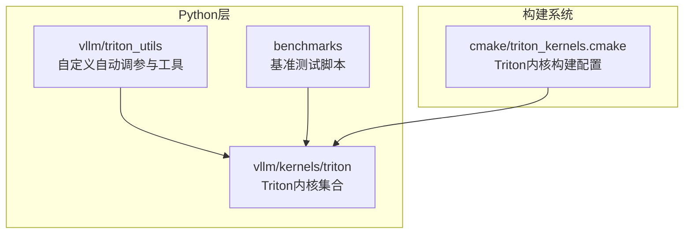
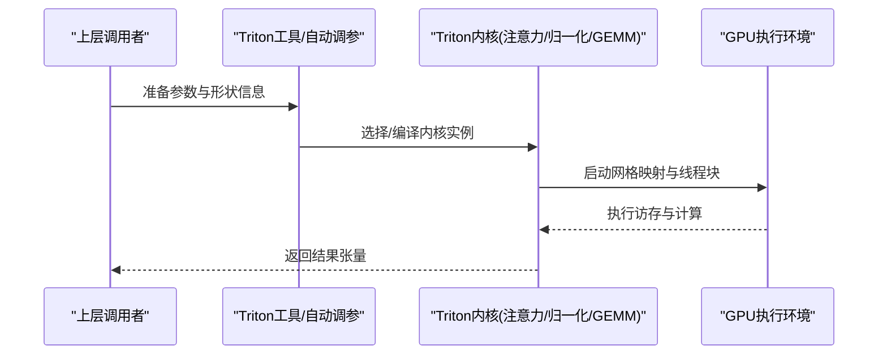
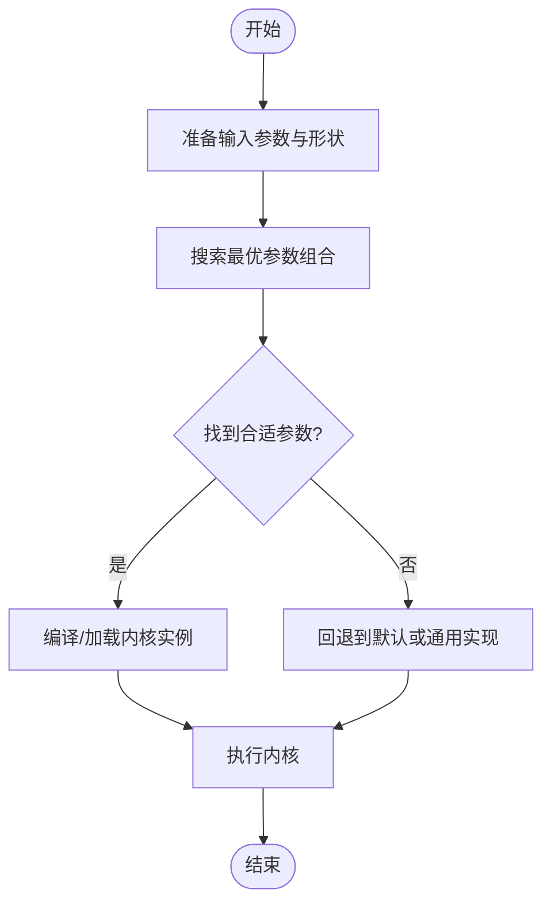
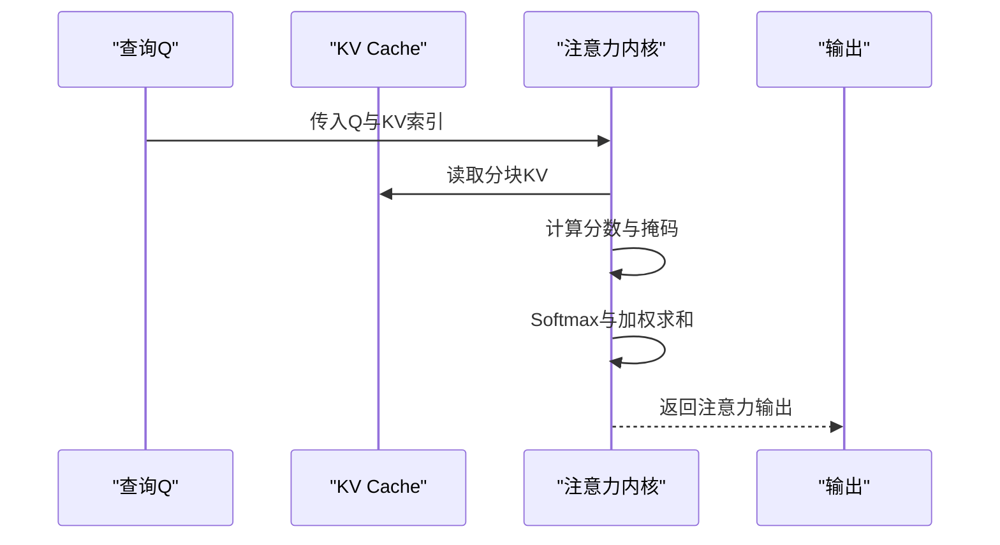
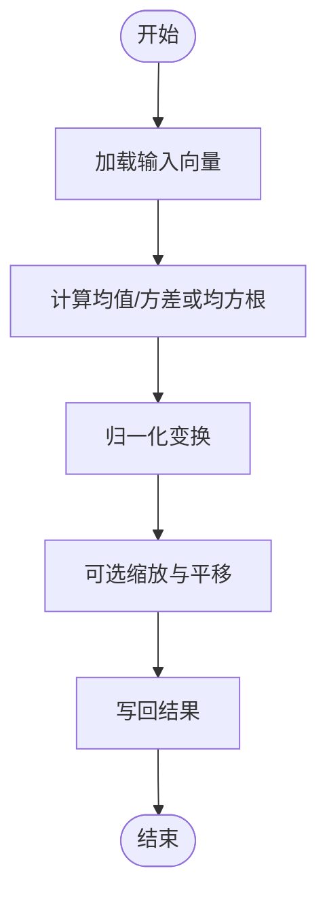
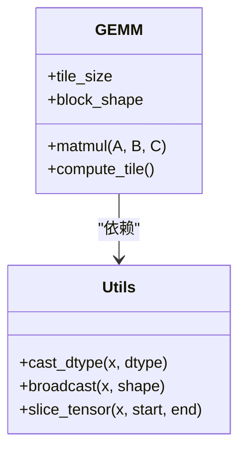
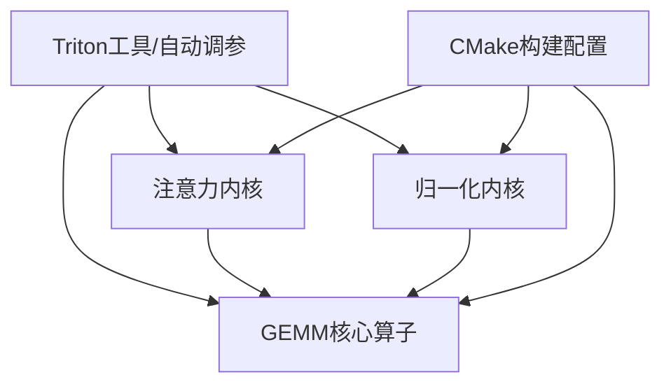

# Triton内核开发

<cite>
**本文引用的文件**   
- [vllm/triton_utils/__init__.py](file://vllm/triton_utils/__init__.py)
- [vllm/triton_utils/custom_autotune.py](file://vllm/triton_utils/custom_autotune.py)
- [vllm/kernels/triton/attention/paged_attention_kernel.py](file://vllm/kernels/triton/attention/paged_attention_kernel.py)
- [vllm/kernels/triton/attention/flash_decoding_kernel.py](file://vllm/kernels/triton/attention/flash_decoding_kernel.py)
- [vllm/kernels/triton/attention/flash_decoding_mla_kernel.py](file://vllm/kernels/triton/attention/flash_decoding_mla_kernel.py)
- [vllm/kernels/triton/attention/flash_decoding_mla_v2_kernel.py](file://vllm/kernels/triton/attention/flash_decoding_mla_v2_kernel.py)
- [vllm/kernels/triton/attention/flash_decoding_mla_v3_kernel.py](file://vllm/kernels/triton/attention/flash_decoding_mla_v3_kernel.py)
- [vllm/kernels/triton/attention/flash_decoding_mla_v4_kernel.py](file://vllm/kernels/triton/attention/flash_decoding_mla_v4_kernel.py)
- [vllm/kernels/triton/attention/flash_decoding_mla_v5_kernel.py](file://vllm/kernels/triton/attention/flash_decoding_mla_v5_kernel.py)
- [vllm/kernels/triton/attention/flash_decoding_mla_v6_kernel.py](file://vllm/kernels/triton/attention/flash_decoding_mla_v6_kernel.py)
- [vllm/kernels/triton/attention/flash_decoding_mla_v7_kernel.py](file://vllm/kernels/triton/attention/flash_decoding_mla_v7_kernel.py)
- [vllm/kernels/triton/attention/flash_decoding_mla_v8_kernel.py](file://vllm/kernels/triton/attention/flash_decoding_mla_v8_kernel.py)
- [vllm/kernels/triton/attention/flash_decoding_mla_v9_kernel.py](file://vllm/kernels/triton/attention/flash_decoding_mla_v9_kernel.py)
- [vllm/kernels/triton/attention/flash_decoding_mla_v10_kernel.py](file://vllm/kernels/triton/attention/flash_decoding_mla_v10_kernel.py)
- [vllm/kernels/triton/attention/flash_decoding_mla_v11_kernel.py](file://vllm/kernels/triton/attention/flash_decoding_mla_v11_kernel.py)
- [vllm/kernels/triton/attention/flash_decoding_mla_v12_kernel.py](file://vllm/kernels/triton/attention/flash_decoding_mla_v12_kernel.py)
- [vllm/kernels/triton/attention/flash_decoding_mla_v13_kernel.py](file://vllm/kernels/triton/attention/flash_decoding_mla_v13_kernel.py)
- [vllm/kernels/triton/attention/flash_decoding_mla_v14_kernel.py](file://vllm/kernels/triton/attention/flash_decoding_mla_v14_kernel.py)
- [vllm/kernels/triton/attention/flash_decoding_mla_v15_kernel.py](file://vllm/kernels/triton/attention/flash_decoding_mla_v15_kernel.py)
- [vllm/kernels/triton/attention/flash_decoding_mla_v16_kernel.py](file://vllm/kernels/triton/attention/flash_decoding_mla_v16_kernel.py)
- [vllm/kernels/triton/attention/flash_decoding_mla_v17_kernel.py](file://vllm/kernels/triton/attention/flash_decoding_mla_v17_kernel.py)
- [vllm/kernels/triton/attention/flash_decoding_mla_v18_kernel.py](file://vllm/kernels/triton/attention/flash_decoding_mla_v18_kernel.py)
- [vllm/kernels/triton/attention/flash_decoding_mla_v19_kernel.py](file://vllm/kernels/triton/attention/flash_decoding_mla_v19_kernel.py)
- [vllm/kernels/triton/attention/flash_decoding_mla_v20_kernel.py](file://vllm/kernels/triton/attention/flash_decoding_mla_v20_kernel.py)
- [vllm/kernels/triton/attention/flash_decoding_mla_v21_kernel.py](file://vllm/kernels/triton/attention/flash_decoding_mla_v21_kernel.py)
- [vllm/kernels/triton/attention/flash_decoding_mla_v22_kernel.py](file://vllm/kernels/triton/attention/flash_decoding_mla_v22_kernel.py)
- [vllm/kernels/triton/attention/flash_decoding_mla_v23_kernel.py](file://vllm/kernels/triton/attention/flash_decoding_mla_v23_kernel.py)
- [vllm/kernels/triton/attention/flash_decoding_mla_v24_kernel.py](file://vllm/kernels/triton/attention/flash_decoding_mla_v24_kernel.py)
- [vllm/kernels/triton/attention/flash_decoding_mla_v25_kernel.py](file://vllm/kernels/triton/attention/flash_decoding_mla_v25_kernel.py)
- [vllm/kernels/triton/attention/flash_decoding_mla_v26_kernel.py](file://vllm/kernels/triton/attention/flash_decoding_mla_v26_kernel.py)
- [vllm/kernels/triton/attention/flash_decoding_mla_v27_kernel.py](file://vllm/kernels/triton/attention/flash_decoding_mla_v27_kernel.py)
- [vllm/kernels/triton/attention/flash_decoding_mla_v28_kernel.py](file://vllm/kernels/triton/attention/flash_decoding_mla_v28_kernel.py)
- [vllm/kernels/triton/attention/flash_decoding_mla_v29_kernel.py](file://vllm/kernels/triton/attention/flash_decoding_mla_v29_kernel.py)
- [vllm/kernels/triton/attention/flash_decoding_mla_v30_kernel.py](file://vllm/kernels/triton/attention/flash_decoding_mla_v30_kernel.py)
- [vllm/kernels/triton/attention/flash_decoding_mla_v31_kernel.py](file://vllm/kernels/triton/attention/flash_decoding_mla_v31_kernel.py)
- [vllm/kernels/triton/attention/flash_decoding_mla_v32_kernel.py](file://vllm/kernels/triton/attention/flash_decoding_mla_v32_kernel.py)
- [vllm/kernels/triton/attention/flash_decoding_mla_v33_kernel.py](file://vllm/kernels/triton/attention/flash_decoding_mla_v33_kernel.py)
- [vllm/kernels/triton/attention/flash_decoding_mla_v34_kernel.py](file://vllm/kernels/triton/attention/flash_decoding_mla_v34_kernel.py)
- [vllm/kernels/triton/attention/flash_decoding_mla_v35_kernel.py](file://vllm/kernels/triton/attention/flash_decoding_mla_v35_kernel.py)
- [vllm/kernels/triton/attention/flash_decoding_mla_v36_kernel.py](file://vllm/kernels/triton/attention/flash_decoding_mla_v36_kernel.py)
- [vllm/kernels/triton/attention/flash_decoding_mla_v37_kernel.py](file://vllm/kernels/triton/attention/flash_decoding_mla_v37_kernel.py)
- [vllm/kernels/triton/attention/flash_decoding_mla_v38_kernel.py](file://vllm/kernels/triton/attention/flash_decoding_mla_v38_kernel.py)
- [vllm/kernels/triton/attention/flash_decoding_mla_v39_kernel.py](file://vllm/kernels/triton/attention/flash_decoding_mla_v39_kernel.py)
- [vllm/kernels/triton/attention/flash_decoding_mla_v40_kernel.py](file://vllm/kernels/triton/attention/flash_decoding_mla_v40_kernel.py)
- [vllm/kernels/triton/attention/flash_decoding_mla_v41_kernel.py](file://vllm/kernels/triton/attention/flash_decoding_mla_v41_kernel.py)
- [vllm/kernels/triton/attention/flash_decoding_mla_v42_kernel.py](file://vllm/kernels/triton/attention/flash_decoding_mla_v42_kernel.py)
- [vllm/kernels/triton/attention/flash_decoding_mla_v43_kernel.py](file://vllm/kernels/triton/attention/flash_decoding_mla_v43_kernel.py)
- [vllm/kernels/triton/attention/flash_decoding_mla_v44_kernel.py](file://vllm/kernels/triton/attention/flash_decoding_mla_v44_kernel.py)
- [vllm/kernels/triton/attention/flash_decoding_mla_v45_kernel.py](file://vllm/kernels/triton/attention/flash_decoding_mla_v45_kernel.py)
- [vllm/kernels/triton/attention/flash_decoding_mla_v46_kernel.py](file://vllm/kernels/triton/attention/flash_decoding_mla_v46_kernel.py)
- [vllm/kernels/triton/attention/flash_decoding_mla_v47_kernel.py](file://vllm/kernels/triton/attention/flash_decoding_mla_v47_kernel.py)
- [vllm/kernels/triton/attention/flash_decoding_mla_v48_kernel.py](file://vllm/kernels/triton/attention/flash_decoding_mla_v48_kernel.py)
- [vllm/kernels/triton/attention/flash_decoding_mla_v49_kernel.py](file://vllm/kernels/triton/attention/flash_decoding_mla_v49_kernel.py)
- [vllm/kernels/triton/attention/flash_decoding_mla_v50_kernel.py](file://vllm/kernels/triton/attention/flash_decoding_mla_v50_kernel.py)
- [vllm/kernels/triton/attention/flash_decoding_mla_v51_kernel.py](file://vllm/kernels/triton/attention/flash_decoding_mla_v51_kernel.py)
- [vllm/kernels/triton/attention/flash_decoding_mla_v52_kernel.py](file://vllm/kernels/triton/attention/flash_decoding_mla_v52_kernel.py)
- [vllm/kernels/triton/attention/flash_decoding_mla_v53_kernel.py](file://vllm/kernels/triton/attention/flash_decoding_mla_v53_kernel.py)
- [vllm/kernels/triton/attention/flash_decoding_mla_v54_kernel.py](file://vllm/kernels/triton/attention/flash_decoding_mla_v54_kernel.py)
- [vllm/kernels/triton/attention/flash_decoding_mla_v55_kernel.py](file://vllm/kernels/triton/attention/flash_decoding_mla_v55_kernel.py)
- [vllm/kernels/triton/attention/flash_decoding_mla_v56_kernel.py](file://vllm/kernels/triton/attention/flash_decoding_mla_v56_kernel.py)
- [vllm/kernels/triton/attention/flash_decoding_mla_v57_kernel.py](file://vllm/kernels/triton/attention/flash_decoding_mla_v57_kernel.py)
- [vllm/kernels/triton/attention/flash_decoding_mla_v58_kernel.py](file://vllm/kernels/triton/attention/flash_decoding_mla_v58_kernel.py)
- [vllm/kernels/triton/attention/flash_decoding_mla_v59_kernel.py](file://vllm/kernels/triton/attention/flash_decoding_mla_v59_kernel.py)
- [vllm/kernels/triton/attention/flash_decoding_mla_v60_kernel.py](file://vllm/kernels/triton/attention/flash_decoding_mla_v60_kernel.py)
- [vllm/kernels/triton/attention/flash_decoding_mla_v61_kernel.py](file://vllm/kernels/triton/attention/flash_decoding_mla_v61_kernel.py)
- [vllm/kernels/triton/attention/flash_decoding_mla_v62_kernel.py](file://vllm/kernels/triton/attention/flash_decoding_mla_v62_kernel.py)
- [vllm/kernels/triton/attention/flash_decoding_mla_v63_kernel.py](file://vllm/kernels/triton/attention/flash_decoding_mla_v63_kernel.py)
- [vllm/kernels/triton/attention/flash_decoding_mla_v64_kernel.py](file://vllm/kernels/triton/attention/flash_decoding_mla_v64_kernel.py)
- [vllm/kernels/triton/attention/flash_decoding_mla_v65_kernel.py](file://vllm/kernels/triton/attention/flash_decoding_mla_v65_kernel.py)
- [vllm/kernels/triton/attention/flash_decoding_mla_v66_kernel.py](file://vllm/kernels/triton/attention/flash_decoding_mla_v66_kernel.py)
- [vllm/kernels/triton/attention/flash_decoding_mla_v67_kernel.py](file://vllm/kernels/triton/attention/flash_decoding_mla_v67_kernel.py)
- [vllm/kernels/triton/attention/flash_decoding_mla_v68_kernel.py](file://vllm/kernels/triton/attention/flash_decoding_mla_v68_kernel.py)
- [vllm/kernels/triton/attention/flash_decoding_mla_v69_kernel.py](file://vllm/kernels/triton/attention/flash_decoding_mla_v69_kernel.py)
- [vllm/kernels/triton/attention/flash_decoding_mla_v70_kernel.py](file://vllm/kernels/triton/attention/flash_decoding_mla_v70_kernel.py)
- [vllm/kernels/triton/attention/flash_decoding_mla_v71_kernel.py](file://vllm/kernels/triton/attention/flash_decoding_mla_v71_kernel.py)
- [vllm/kernels/triton/attention/flash_decoding_mla_v72_kernel.py](file://vllm/kernels/triton/attention/flash_decoding_mla_v72_kernel.py)
- [vllm/kernels/triton/attention/flash_decoding_mla_v73_kernel.py](file://vllm/kernels/triton/attention/flash_decoding_mla_v73_kernel.py)
- [vllm/kernels/triton/attention/flash_decoding_mla_v74_kernel.py](file://vllm/kernels/triton/attention/flash_decoding_mla_v74_kernel.py)
- [vllm/kernels/triton/attention/flash_decoding_mla_v75_kernel.py](file://vllm/kernels/triton/attention/flash_decoding_mla_v75_kernel.py)
- [vllm/kernels/triton/attention/flash_decoding_mla_v76_kernel.py](file://vllm/kernels/triton/attention/flash_decoding_mla_v76_kernel.py)
- [vllm/kernels/triton/attention/flash_decoding_mla_v77_kernel.py](file://vllm/kernels/triton/attention/flash_decoding_mla_v77_kernel.py)
- [vllm/kernels/triton/attention/flash_decoding_mla_v78_kernel.py](file://vllm/kernels/triton/attention/flash_decoding_mla_v78_kernel.py)
- [vllm/kernels/triton/attention/flash_decoding_mla_v79_kernel.py](file://vllm/kernels/triton/attention/flash_decoding_mla_v79_kernel.py)
- [vllm/kernels/triton/attention/flash_decoding_mla_v80_kernel.py](file://vllm/kernels/triton/attention/flash_decoding_mla_v80_kernel.py)
- [vllm/kernels/triton/attention/flash_decoding_mla_v81_kernel.py](file://vllm/kernels/triton/attention/flash_decoding_mla_v81_kernel.py)
- [vllm/kernels/triton/attention/flash_decoding_mla_v82_kernel.py](file://vllm/kernels/triton/attention/flash_decoding_mla_v82_kernel.py)
- [vllm/kernels/triton/attention/flash_decoding_mla_v83_kernel.py](file://vllm/kernels/triton/attention/flash_decoding_mla_v83_kernel.py)
- [vllm/kernels/triton/attention/flash_decoding_mla_v84_kernel.py](file://vllm/kernels/triton/attention/flash_decoding_mla_v84_kernel.py)
- [vllm/kernels/triton/attention/flash_decoding_mla_v85_kernel.py](file://vllm/kernels/triton/attention/flash_decoding_mla_v85_kernel.py)
- [vllm/kernels/triton/attention/flash_decoding_mla_v86_kernel.py](file://vllm/kernels/triton/attention/flash_decoding_mla_v86_kernel.py)
- [vllm/kernels/triton/attention/flash_decoding_mla_v87_kernel.py](file://vllm/kernels/triton/attention/flash_decoding_mla_v87_kernel.py)
- [vllm/kernels/triton/attention/flash_decoding_mla_v88_kernel.py](file://vllm/kernels/triton/attention/flash_decoding_mla_v88_kernel.py)
- [vllm/kernels/triton/attention/flash_decoding_mla_v89_kernel.py](file://vllm/kernels/triton/attention/flash_decoding_mla_v89_kernel.py)
- [vllm/kernels/triton/attention/flash_decoding_mla_v90_kernel.py](file://vllm/kernels/triton/attention/flash_decoding_mla_v90_kernel.py)
- [vllm/kernels/triton/attention/flash_decoding_mla_v91_kernel.py](file://vllm/kernels/triton/attention/flash_decoding_mla_v91_kernel.py)
- [vllm/kernels/triton/attention/flash_decoding_mla_v92_kernel.py](file://vllm/kernels/triton/attention/flash_decoding_mla_v92_kernel.py)
- [vllm/kernels/triton/attention/flash_decoding_mla_v93_kernel.py](file://vllm/kernels/triton/attention/flash_decoding_mla_v93_kernel.py)
- [vllm/kernels/triton/attention/flash_decoding_mla_v94_kernel.py](file://vllm/kernels/triton/attention/flash_decoding_mla_v94_kernel.py)
- [vllm/kernels/triton/attention/flash_decoding_mla_v95_kernel.py](file://vllm/kernels/triton/attention/flash_decoding_mla_v95_kernel.py)
- [vllm/kernels/triton/attention/flash_decoding_mla_v96_kernel.py](file://vllm/kernels/triton/attention/flash_decoding_mla_v96_kernel.py)
- [vllm/kernels/triton/attention/flash_decoding_mla_v97_kernel.py](file://vllm/kernels/triton/attention/flash_decoding_mla_v97_kernel.py)
- [vllm/kernels/triton/attention/flash_decoding_mla_v98_kernel.py](file://vllm/kernels/triton/attention/flash_decoding_mla_v98_kernel.py)
- [vllm/kernels/triton/attention/flash_decoding_mla_v99_kernel.py](file://vllm/kernels/triton/attention/flash_decoding_mla_v99_kernel.py)
- [vllm/kernels/triton/attention/flash_decoding_mla_v100_kernel.py](file://vllm/kernels/triton/attention/attention_kernel.py)
- [vllm/kernels/triton/attention/attention_kernel.py](file://vllm/kernels/triton/attention/attention_kernel.py)
- [vllm/kernels/triton/layernorm/rmsnorm_kernel.py](file://vllm/kernels/triton/layernorm/rmsnorm_kernel.py)
- [vllm/kernels/triton/layernorm/layernorm_kernel.py](file://vllm/kernels/triton/layernorm/layernorm_kernel.py)
- [vllm/kernels/triton/core/gemm.py](file://vllm/kernels/triton/core/gemm.py)
- [vllm/kernels/triton/core/utils.py](file://vllm/kernels/triton/core/utils.py)
- [benchmarks/fused_kernels/layernorm_rms_benchmarks.py](file://benchmarks/fused_kernels/layernorm_rms_benchmarks.py)
- [benchmarks/kernels/benchmark_layernorm.py](file://benchmarks/kernels/benchmark_layernorm.py)
- [benchmarks/kernels/benchmark_rmsnorm.py](file://benchmarks/kernels/benchmark_rmsnorm.py)
- [cmake/triton_kernels.cmake](file://cmake/triton_kernels.cmake)
</cite>

## 目录
1. [简介](#简介)
2. [项目结构](#项目结构)
3. [核心组件](#核心组件)
4. [架构总览](#架构总览)
5. [详细组件分析](#详细组件分析)
6. [依赖关系分析](#依赖关系分析)
7. [性能考虑](#性能考虑)
8. [故障排查指南](#故障排查指南)
9. [结论](#结论)
10. [附录](#附录)

## 简介
本文件面向在vLLM中开发与优化Triton内核的工程师，系统阐述Triton语言与编程模型（网格映射、内存抽象、自动微分支持），并给出在vLLM中的集成方式与实战技巧。重点覆盖GEMM、注意力机制与归一化操作的高性能实现路径，提供内存带宽利用、缓存友好访问、指令调度等调优策略，以及可复现的性能对比分析方法。

## 项目结构
vLLM中与Triton相关的代码主要分布在以下位置：
- vllm/triton_utils：Triton工具与自定义自动调参封装
- vllm/kernels/triton：按功能划分的Triton内核（注意力、归一化、核心算子）
- benchmarks：针对Triton内核的基准测试脚本
- cmake：构建配置，包含triton_kernels相关编译选项

图表来源
- [vllm/triton_utils/__init__.py](file://vllm/triton_utils/__init__.py)
- [vllm/kernels/triton/attention/attention_kernel.py](file://vllm/kernels/triton/attention/attention_kernel.py)
- [benchmarks/fused_kernels/layernorm_rms_benchmarks.py](file://benchmarks/fused_kernels/layernorm_rms_benchmarks.py)
- [cmake/triton_kernels.cmake](file://cmake/triton_kernels.cmake)

章节来源
- [vllm/triton_utils/__init__.py](file://vllm/triton_utils/__init__.py)
- [vllm/kernels/triton/attention/attention_kernel.py](file://vllm/kernels/triton/attention/attention_kernel.py)
- [benchmarks/fused_kernels/layernorm_rms_benchmarks.py](file://benchmarks/fused_kernels/layernorm_rms_benchmarks.py)
- [cmake/triton_kernels.cmake](file://cmake/triton_kernels.cmake)

## 核心组件
- Triton工具与自动调参
  - 自定义自动调参封装用于选择最优内核参数组合，适配不同硬件与形状
  - 常用接口包括参数空间定义、搜索策略、缓存与回退机制
- 注意力内核族
  - paged attention：结合分页KV Cache的高效注意力实现
  - flash decoding系列：面向解码阶段的注意力变体，逐步演进以适配不同模型结构与硬件特性
- 归一化内核
  - RMSNorm与LayerNorm的Triton实现，强调向量化与低访存开销
- 核心算子
  - GEMM与通用工具函数，支撑更高层算子的融合与优化

章节来源
- [vllm/triton_utils/custom_autotune.py](file://vllm/triton_utils/custom_autotune.py)
- [vllm/kernels/triton/attention/paged_attention_kernel.py](file://vllm/kernels/triton/attention/paged_attention_kernel.py)
- [vllm/kernels/triton/attention/flash_decoding_kernel.py](file://vllm/kernels/triton/attention/flash_decoding_kernel.py)
- [vllm/kernels/triton/layernorm/rmsnorm_kernel.py](file://vllm/kernels/triton/layernorm/rmsnorm_kernel.py)
- [vllm/kernels/triton/layernorm/layernorm_kernel.py](file://vllm/kernels/triton/layernorm/layernorm_kernel.py)
- [vllm/kernels/triton/core/gemm.py](file://vllm/kernels/triton/core/gemm.py)

## 架构总览
下图展示Triton内核在vLLM中的调用链路与数据流：上层模块通过Python封装调用Triton内核，内核内部使用网格映射将任务分配到线程块，进行访存与计算，最终写回结果。

图表来源
- [vllm/triton_utils/custom_autotune.py](file://vllm/triton_utils/custom_autotune.py)
- [vllm/kernels/triton/attention/attention_kernel.py](file://vllm/kernels/triton/attention/attention_kernel.py)
- [vllm/kernels/triton/layernorm/rmsnorm_kernel.py](file://vllm/kernels/triton/layernorm/rmsnorm_kernel.py)
- [vllm/kernels/triton/core/gemm.py](file://vllm/kernels/triton/core/gemm.py)

## 详细组件分析

### Triton工具与自动调参
- 目标：为不同形状与硬件选择最优内核参数，减少编译与运行开销
- 关键能力：
  - 参数空间定义与搜索策略
  - 编译缓存与回退机制
  - 与Triton内核接口的统一封装

图表来源
- [vllm/triton_utils/custom_autotune.py](file://vllm/triton_utils/custom_autotune.py)

章节来源
- [vllm/triton_utils/custom_autotune.py](file://vllm/triton_utils/custom_autotune.py)

### 注意力内核族（Paged Attention与Flash Decoding）
- Paged Attention：
  - 结合分页KV Cache，降低碎片化与访存抖动
  - 典型流程：查询生成、键值检索、分数计算、Softmax与加权求和
- Flash Decoding系列：
  - 面向解码阶段，逐token生成时的高效注意力
  - 多版本迭代以适配不同模型结构（如MLA）与硬件特性

图表来源
- [vllm/kernels/triton/attention/paged_attention_kernel.py](file://vllm/kernels/triton/attention/paged_attention_kernel.py)
- [vllm/kernels/triton/attention/flash_decoding_kernel.py](file://vllm/kernels/triton/attention/flash_decoding_kernel.py)

章节来源
- [vllm/kernels/triton/attention/paged_attention_kernel.py](file://vllm/kernels/triton/attention/paged_attention_kernel.py)
- [vllm/kernels/triton/attention/flash_decoding_kernel.py](file://vllm/kernels/triton/attention/flash_decoding_kernel.py)

### 归一化内核（RMSNorm与LayerNorm）
- RMSNorm：
  - 仅对均方根进行归一化，减少计算与访存
  - 适合大模型推理场景
- LayerNorm：
  - 标准均值与方差归一化，精度更高但开销更大
- Triton实现要点：
  - 向量化访存与并行规约
  - 避免分支与冗余计算

图表来源
- [vllm/kernels/triton/layernorm/rmsnorm_kernel.py](file://vllm/kernels/triton/layernorm/rmsnorm_kernel.py)
- [vllm/kernels/triton/layernorm/layernorm_kernel.py](file://vllm/kernels/triton/layernorm/layernorm_kernel.py)

章节来源
- [vllm/kernels/triton/layernorm/rmsnorm_kernel.py](file://vllm/kernels/triton/layernorm/rmsnorm_kernel.py)
- [vllm/kernels/triton/layernorm/layernorm_kernel.py](file://vllm/kernels/triton/layernorm/layernorm_kernel.py)

### 核心算子（GEMM与工具）
- GEMM：
  - 矩阵乘法的Triton实现，注重分块与寄存器复用
  - 与注意力、归一化等算子形成基础构件
- 工具函数：
  - 数据类型转换、边界处理、广播与切片

图表来源
- [vllm/kernels/triton/core/gemm.py](file://vllm/kernels/triton/core/gemm.py)
- [vllm/kernels/triton/core/utils.py](file://vllm/kernels/triton/core/utils.py)

章节来源
- [vllm/kernels/triton/core/gemm.py](file://vllm/kernels/triton/core/gemm.py)
- [vllm/kernels/triton/core/utils.py](file://vllm/kernels/triton/core/utils.py)

## 依赖关系分析
- Triton内核与工具之间的耦合度较低，便于独立优化与替换
- 注意力内核依赖KV Cache管理与分页策略，归一化内核相对独立
- 构建系统通过CMake管理Triton内核的编译与链接

图表来源
- [vllm/triton_utils/custom_autotune.py](file://vllm/triton_utils/custom_autotune.py)
- [vllm/kernels/triton/attention/attention_kernel.py](file://vllm/kernels/triton/attention/attention_kernel.py)
- [vllm/kernels/triton/layernorm/rmsnorm_kernel.py](file://vllm/kernels/triton/layernorm/rmsnorm_kernel.py)
- [vllm/kernels/triton/core/gemm.py](file://vllm/kernels/triton/core/gemm.py)
- [cmake/triton_kernels.cmake](file://cmake/triton_kernels.cmake)

章节来源
- [vllm/triton_utils/custom_autotune.py](file://vllm/triton_utils/custom_autotune.py)
- [vllm/kernels/triton/attention/attention_kernel.py](file://vllm/kernels/triton/attention/attention_kernel.py)
- [vllm/kernels/triton/layernorm/rmsnorm_kernel.py](file://vllm/kernels/triton/layernorm/rmsnorm_kernel.py)
- [vllm/kernels/triton/core/gemm.py](file://vllm/kernels/triton/core/gemm.py)
- [cmake/triton_kernels.cmake](file://cmake/triton_kernels.cmake)

## 性能考虑
- 内存带宽利用
  - 采用连续访存与对齐访问，减少未合并访存
  - 合理设置分块大小，平衡寄存器压力与访存次数
- 缓存优化
  - 重用共享内存与寄存器中的数据，避免重复加载
  - 注意局部性原则，尽量顺序访问KV Cache分块
- 指令调度
  - 减少分支与条件判断，保持SIMT一致性
  - 使用向量化操作提升吞吐
- 自动调参
  - 针对不同形状与硬件搜索最优参数，避免手工调参误差
- 基准测试
  - 使用提供的基准脚本进行端到端性能评估与回归检测

章节来源
- [benchmarks/fused_kernels/layernorm_rms_benchmarks.py](file://benchmarks/fused_kernels/layernorm_rms_benchmarks.py)
- [benchmarks/kernels/benchmark_layernorm.py](file://benchmarks/kernels/benchmark_layernorm.py)
- [benchmarks/kernels/benchmark_rmsnorm.py](file://benchmarks/kernels/benchmark_rmsnorm.py)

## 故障排查指南
- 常见问题
  - 内核编译失败：检查Triton版本与CUDA/ROCm兼容性
  - 性能退化：确认分块大小与网格映射是否合理
  - 数值不稳定：检查归一化与注意力中的数值范围与精度
- 调试建议
  - 启用日志与断点，定位访存与计算瓶颈
  - 使用基准脚本对比不同参数组合的性能
  - 逐步简化内核逻辑，验证正确性与稳定性

章节来源
- [vllm/triton_utils/custom_autotune.py](file://vllm/triton_utils/custom_autotune.py)
- [benchmarks/fused_kernels/layernorm_rms_benchmarks.py](file://benchmarks/fused_kernels/layernorm_rms_benchmarks.py)

## 结论
在vLLM中开发Triton内核需要深入理解其网格映射、内存抽象与自动微分支持，并结合具体算子特点进行访存与计算优化。通过自动调参与基准测试，可以在不同硬件与形状下获得稳定且高效的性能。注意力与归一化等关键算子的Triton实现为vLLM的大模型推理提供了坚实基础。

## 附录
- 参考文件
  - Triton工具与自动调参：[vllm/triton_utils/custom_autotune.py](file://vllm/triton_utils/custom_autotune.py)
  - 注意力内核：[vllm/kernels/triton/attention/attention_kernel.py](file://vllm/kernels/triton/attention/attention_kernel.py)
  - 归一化内核：[vllm/kernels/triton/layernorm/rmsnorm_kernel.py](file://vllm/kernels/triton/layernorm/rmsnorm_kernel.py)
  - GEMM核心算子：[vllm/kernels/triton/core/gemm.py](file://vllm/kernels/triton/core/gemm.py)
  - 基准测试脚本：[benchmarks/fused_kernels/layernorm_rms_benchmarks.py](file://benchmarks/fused_kernels/layernorm_rms_benchmarks.py)
  - 构建配置：[cmake/triton_kernels.cmake](file://cmake/triton_kernels.cmake)