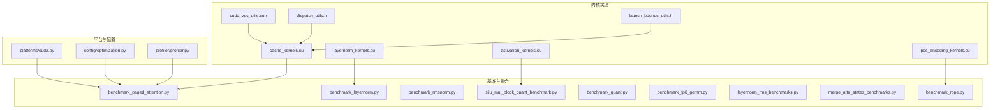
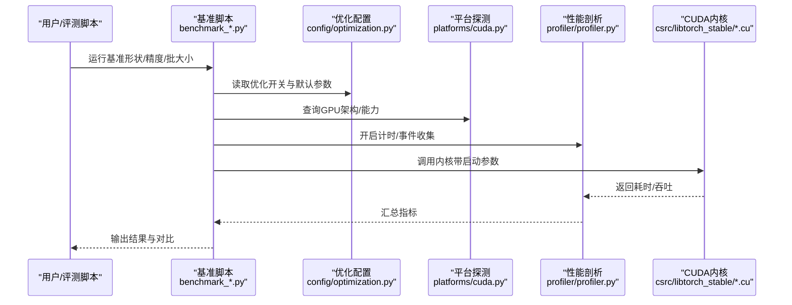
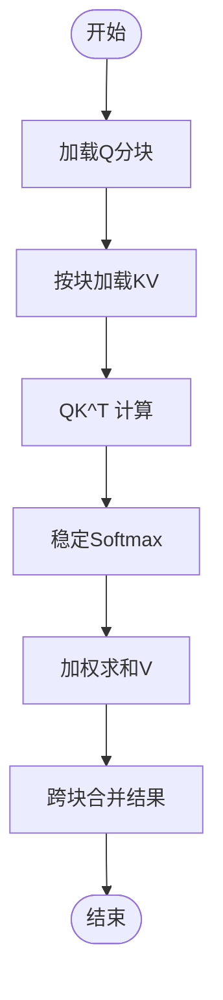
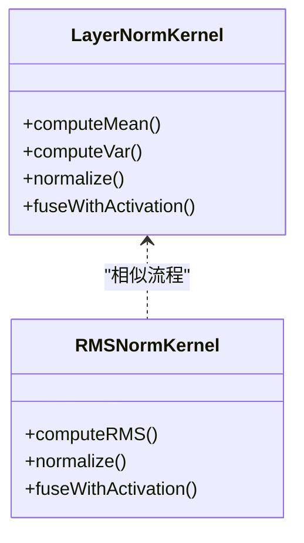
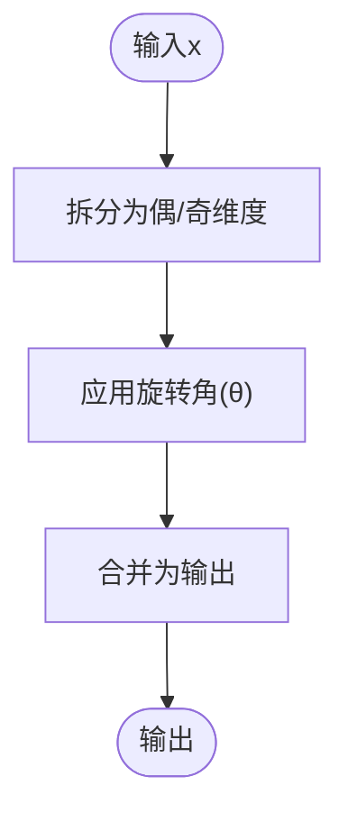
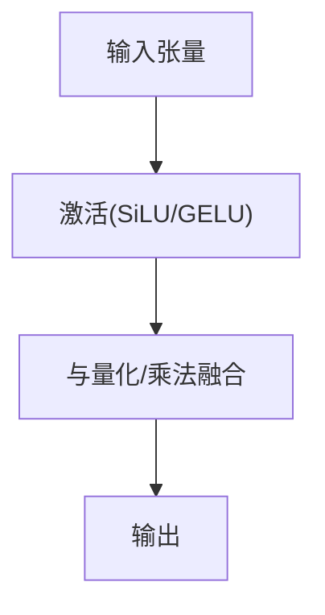
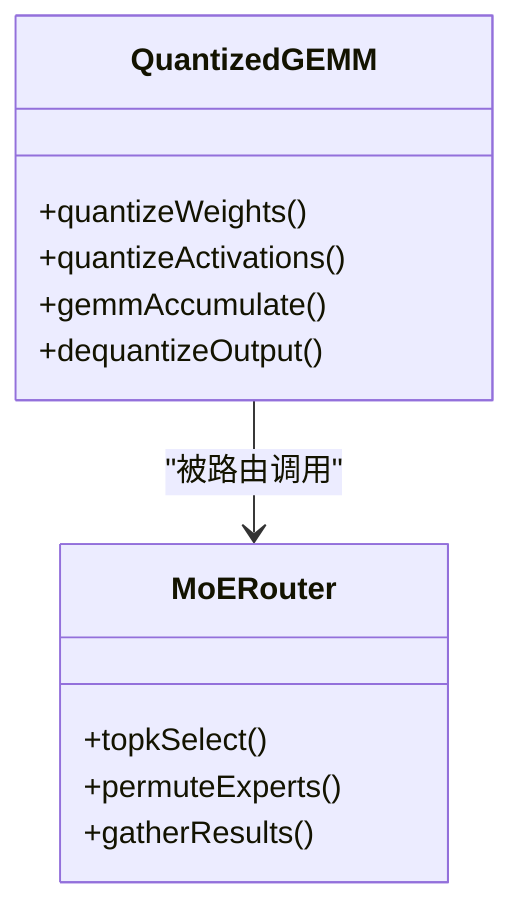
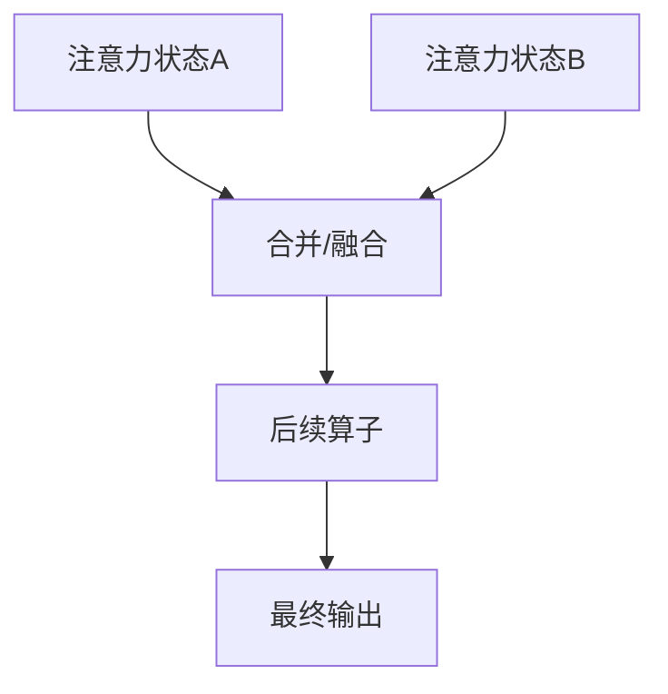
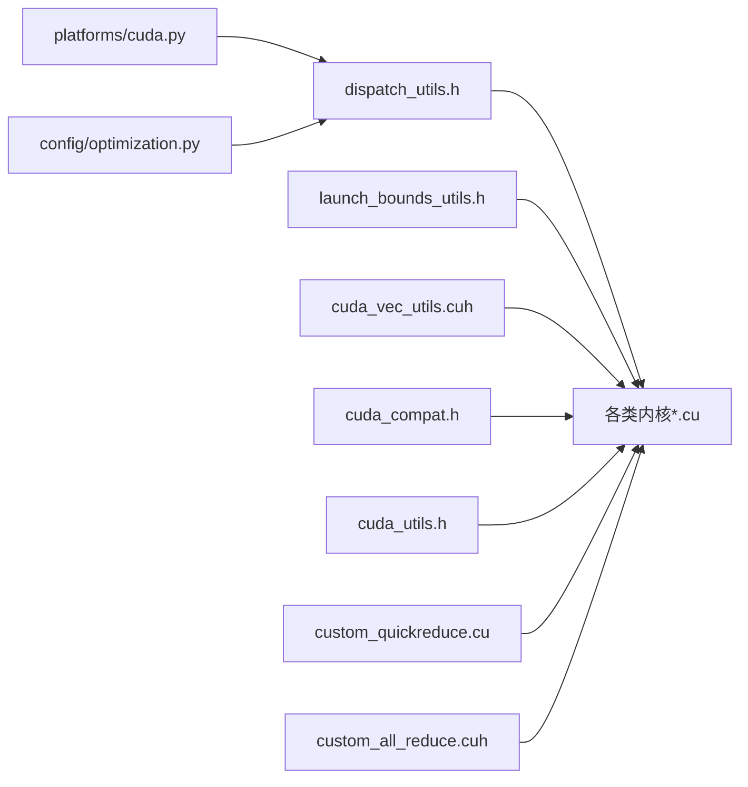

# 性能优化技术

<cite>
**本文引用的文件**   
- [benchmarks/README.md](file://benchmarks/README.md)
- [benchmarks/kernels/benchmark_paged_attention.py](file://benchmarks/kernels/benchmark_paged_attention.py)
- [benchmarks/kernels/benchmark_layernorm.py](file://benchmarks/kernels/benchmark_layernorm.py)
- [benchmarks/kernels/benchmark_rmsnorm.py](file://benchmarks/kernels/benchmark_rmsnorm.py)
- [benchmarks/kernels/benchmark_rope.py](file://benchmarks/kernels/benchmark_rope.py)
- [benchmarks/kernels/benchmark_quant.py](file://benchmarks/kernels/benchmark_quant.py)
- [benchmarks/kernels/benchmark_fp8_gemm.py](file://benchmarks/kernels/benchmark_fp8_gemm.py)
- [benchmarks/kernels/benchmark_cutlass_moe_fp8.py](file://benchmarks/kernels/benchmark_cutlass_moe_fp8.py)
- [benchmarks/fused_kernels/layernorm_rms_benchmarks.py](file://benchmarks/fused_kernels/layernorm_rms_benchmarks.py)
- [benchmarks/fused_kernels/merge_attn_states_benchmarks.py](file://benchmarks/fused_kernels/merge_attn_states_benchmarks.py)
- [benchmarks/fused_kernels/silu_mul_block_quant_benchmark.py](file://benchmarks/fused_kernels/silu_mul_block量化基准.py)
- [csrc/libtorch_stable/cache_kernels.cu](file://csrc/libtorch_stable/cache_kernels.cu)
- [csrc/libtorch_stable/layernorm_kernels.cu](file://csrc/libtorch_stable/layernorm_kernels.cu)
- [csrc/libtorch_stable/activation_kernels.cu](file://csrc/libtorch_stable/activation_kernels.cu)
- [csrc/libtorch_stable/pos_encoding_kernels.cu](file://csrc/libtorch_stable/pos_encoding_kernels.cu)
- [csrc/libtorch_stable/cuda_vec_utils.cuh](file://csrc/libtorch_stable/cuda_vec_utils.cuh)
- [csrc/libtorch_stable/dispatch_utils.h](file://csrc/libtorch_stable/dispatch_utils.h)
- [csrc/libtorch_stable/launch_bounds_utils.h](file://csrc/libtorch_stable/launch_bounds_utils.h)
- [csrc/cuda_compat.h](file://csrc/cuda_compat.h)
- [csrc/cuda_utils.h](file://csrc/cuda_utils.h)
- [csrc/custom_quickreduce.cu](file://csrc/custom_quickreduce.cu)
- [csrc/custom_all_reduce.cuh](file://csrc/custom_all_reduce.cuh)
- [vllm/config/optimization.py](file://vllm/config/optimization.py)
- [vllm/platforms/cuda.py](file://vllm/platforms/cuda.py)
- [vllm/profiler/profiler.py](file://vllm/profiler/profiler.py)
- [benchmarks/benchmark_throughput.py](file://benchmarks/benchmark_throughput.py)
- [benchmarks/benchmark_latency.py](file://benchmarks/benchmark_latency.py)
</cite>

## 目录
1. [简介](#简介)
2. [项目结构](#项目结构)
3. [核心组件](#核心组件)
4. [架构总览](#架构总览)
5. [详细组件分析](#详细组件分析)
6. [依赖关系分析](#依赖关系分析)
7. [性能考量](#性能考量)
8. [故障排查指南](#故障排查指南)
9. [结论](#结论)
10. [附录](#附录)

## 简介
本文件聚焦于vLLM中CUDA内核的性能优化技术与最佳实践，围绕以下主题展开：
- 内存访问模式优化：合并访问、共享内存使用与缓存友好设计
- 并行计算优化策略：线程束（warp）级操作、SIMD指令利用
- 算法优化技巧：数值稳定性、精度权衡与计算复杂度降低
- 特定硬件优化：不同GPU架构特性与优势利用
- 性能分析方法与基准测试策略
- 实际优化案例与性能提升效果分析

## 项目结构
vLLM在CUDA内核与基准方面采用“内核实现 + 基准工具 + 配置与平台适配”的分层组织方式：
- csrc/libtorch_stable：核心CUDA/C++内核实现（注意力、归一化、激活、位置编码、向量工具、调度与启动参数等）
- benchmarks/kernels：面向各算子的独立基准脚本（PagedAttention、LayerNorm/RMSNorm、RoPE、量化、FP8 GEMM、MoE等）
- benchmarks/fused_kernels：融合算子基准（如Layernorm+RMSNorm融合、注意力状态合并、SiLU乘块量化等）
- vllm/config 与 vllm/platforms：优化开关与平台探测（CUDA能力、架构特性）
- vllm/profiler：性能剖析与指标采集
- 自定义通信内核：custom_quickreduce.cu、custom_all_reduce.cuh

图表来源
- [csrc/libtorch_stable/cache_kernels.cu](file://csrc/libtorch_stable/cache_kernels.cu)
- [csrc/libtorch_stable/layernorm_kernels.cu](file://csrc/libtorch_stable/layernorm_kernels.cu)
- [csrc/libtorch_stable/activation_kernels.cu](file://csrc/libtorch_stable/activation_kernels.cu)
- [csrc/libtorch_stable/pos_encoding_kernels.cu](file://csrc/libtorch_stable/pos_encoding_kernels.cu)
- [csrc/libtorch_stable/cuda_vec_utils.cuh](file://csrc/libtorch_stable/cuda_vec_utils.cuh)
- [csrc/libtorch_stable/dispatch_utils.h](file://csrc/libtorch_stable/dispatch_utils.h)
- [csrc/libtorch_stable/launch_bounds_utils.h](file://csrc/libtorch_stable/launch_bounds_utils.h)
- [benchmarks/kernels/benchmark_paged_attention.py](file://benchmarks/kernels/benchmark_paged_attention.py)
- [benchmarks/kernels/benchmark_layernorm.py](file://benchmarks/kernels/benchmark_layernorm.py)
- [benchmarks/kernels/benchmark_rmsnorm.py](file://benchmarks/kernels/benchmark_rmsnorm.py)
- [benchmarks/kernels/benchmark_rope.py](file://benchmarks/kernels/benchmark_rope.py)
- [benchmarks/kernels/benchmark_quant.py](file://benchmarks/kernels/benchmark_quant.py)
- [benchmarks/kernels/benchmark_fp8_gemm.py](file://benchmarks/kernels/benchmark_fp8_gemm.py)
- [benchmarks/fused_kernels/layernorm_rms_benchmarks.py](file://benchmarks/fused_kernels/layernorm_rms_benchmarks.py)
- [benchmarks/fused_kernels/merge_attn_states_benchmarks.py](file://benchmarks/fused_kernels/merge_attn_states_benchmarks.py)
- [benchmarks/fused_kernels/silu_mul_block_quant_benchmark.py](file://benchmarks/fused_kernels/silu_mul_block_quant_benchmark.py)
- [vllm/platforms/cuda.py](file://vllm/platforms/cuda.py)
- [vllm/config/optimization.py](file://vllm/config/optimization.py)
- [vllm/profiler/profiler.py](file://vllm/profiler/profiler.py)

章节来源
- [benchmarks/README.md](file://benchmarks/README.md)

## 核心组件
- 内存访问与缓存友好设计
  - 页式KV Cache的合并读写与分块访问，减少碎片与跨页跳转
  - 向量化加载/存储（如float4/int4打包），提高带宽利用率
  - 共享内存tile与寄存器重排，降低全局内存访问次数
- 并行与warp级优化
  - warp内shuffle与广播，避免同步开销
  - 按warp粒度规约（reduction）与原子累加，降低竞争
  - 基于SIMD的向量运算（如half/bfloat16/FP8路径）
- 算法与数值优化
  - 稳定softmax与logsumexp，避免溢出/下溢
  - FP8/INT4量化路径下的缩放与反量化融合，减少中间精度
  - 低复杂度近似（如RoPE分段计算、GELU/SiLU查表或近似）
- 硬件特性利用
  - 针对A100/H100的Tensor Core矩阵单元与WGMMA
  - SM计数、寄存器占用与启动参数的自动调优
  - 多SM并发与流水线隐藏延迟

章节来源
- [csrc/libtorch_stable/cache_kernels.cu](file://csrc/libtorch_stable/cache_kernels.cu)
- [csrc/libtorch_stable/layernorm_kernels.cu](file://csrc/libtorch_stable/layernorm_kernels.cu)
- [csrc/libtorch_stable/activation_kernels.cu](file://csrc/libtorch_stable/activation_kernels.cu)
- [csrc/libtorch_stable/pos_encoding_kernels.cu](file://csrc/libtorch_stable/pos_encoding_kernels.cu)
- [csrc/libtorch_stable/cuda_vec_utils.cuh](file://csrc/libtorch_stable/cuda_vec_utils.cuh)
- [csrc/libtorch_stable/dispatch_utils.h](file://csrc/libtorch_stable/dispatch_utils.h)
- [csrc/libtorch_stable/launch_bounds_utils.h](file://csrc/libtorch_stable/launch_bounds_utils.h)

## 架构总览
下图展示了从Python层到CUDA内核与基准工具的调用链，以及平台与配置如何影响内核选择与启动参数。

图表来源
- [benchmarks/kernels/benchmark_paged_attention.py](file://benchmarks/kernels/benchmark_paged_attention.py)
- [benchmarks/kernels/benchmark_layernorm.py](file://benchmarks/kernels/benchmark_layernorm.py)
- [benchmarks/kernels/benchmark_rmsnorm.py](file://benchmarks/kernels/benchmark_rmsnorm.py)
- [benchmarks/kernels/benchmark_rope.py](file://benchmarks/kernels/benchmark_rope.py)
- [benchmarks/kernels/benchmark_quant.py](file://benchmarks/kernels/benchmark_quant.py)
- [benchmarks/kernels/benchmark_fp8_gemm.py](file://benchmarks/kernels/benchmark_fp8_gemm.py)
- [vllm/config/optimization.py](file://vllm/config/optimization.py)
- [vllm/platforms/cuda.py](file://vllm/platforms/cuda.py)
- [vllm/profiler/profiler.py](file://vllm/profiler/profiler.py)
- [csrc/libtorch_stable/cache_kernels.cu](file://csrc/libtorch_stable/cache_kernels.cu)
- [csrc/libtorch_stable/layernorm_kernels.cu](file://csrc/libtorch_stable/layernorm_kernels.cu)
- [csrc/libtorch_stable/activation_kernels.cu](file://csrc/libtorch_stable/activation_kernels.cu)
- [csrc/libtorch_stable/pos_encoding_kernels.cu](file://csrc/libtorch_stable/pos_encoding_kernels.cu)

## 详细组件分析

### 页式注意力（PagedAttention）内核与基准
- 内存访问模式
  - KV Cache分页管理，按块（block）合并访问，减少随机访存
  - 通过索引映射将逻辑序列ID映射到物理块，保证连续加载
- 并行与warp级
  - 每个warp处理一个query tile，内部做QK^T与Softmax规约
  - warp shuffle用于局部求和，降低同步成本
- 数值与精度
  - 稳定softmax（减去最大值）、半精度/FP8路径下的缩放
- 基准要点
  - 覆盖不同batch size、seq len、head dim、dtype组合
  - 记录吞吐、时延、显存带宽利用率

图表来源
- [benchmarks/kernels/benchmark_paged_attention.py](file://benchmarks/kernels/benchmark_paged_attention.py)
- [csrc/libtorch_stable/cache_kernels.cu](file://csrc/libtorch_stable/cache_kernels.cu)

章节来源
- [benchmarks/kernels/benchmark_paged_attention.py](file://benchmarks/kernels/benchmark_paged_attention.py)
- [csrc/libtorch_stable/cache_kernels.cu](file://csrc/libtorch_stable/cache_kernels.cu)

### LayerNorm / RMSNorm 内核与基准
- 内存访问模式
  - 行归一化，顺序遍历特征维度，合并写入
  - 使用共享内存暂存tile，减少重复访存
- 并行与warp级
  - 先求均值/方差，再归一化；warp内规约加速
- 数值与精度
  - 数值稳定的方差计算（避免除零/NaN）
  - 支持BF16/FP16/FP8路径
- 基准要点
  - 不同hidden size、batch size、dtype组合
  - 对比融合与非融合版本

图表来源
- [csrc/libtorch_stable/layernorm_kernels.cu](file://csrc/libtorch_stable/layernorm_kernels.cu)
- [benchmarks/kernels/benchmark_layernorm.py](file://benchmarks/kernels/benchmark_layernorm.py)
- [benchmarks/kernels/benchmark_rmsnorm.py](file://benchmarks/kernels/benchmark_rmsnorm.py)
- [benchmarks/fused_kernels/layernorm_rms_benchmarks.py](file://benchmarks/fused_kernels/layernorm_rms_benchmarks.py)

章节来源
- [csrc/libtorch_stable/layernorm_kernels.cu](file://csrc/libtorch_stable/layernorm_kernels.cu)
- [benchmarks/kernels/benchmark_layernorm.py](file://benchmarks/kernels/benchmark_layernorm.py)
- [benchmarks/kernels/benchmark_rmsnorm.py](file://benchmarks/kernels/benchmark_rmsnorm.py)
- [benchmarks/fused_kernels/layernorm_rms_benchmarks.py](file://benchmarks/fused_kernels/layernorm_rms_benchmarks.py)

### RoPE 位置编码内核与基准
- 内存访问模式
  - 对每维成对旋转，顺序访问，利于预取
- 并行与warp级
  - 每warp处理多个token，向量化sin/cos计算
- 数值与精度
  - 半精度下角度裁剪与舍入控制
- 基准要点
  - 覆盖不同seq_len、head_dim、dtype

图表来源
- [csrc/libtorch_stable/pos_encoding_kernels.cu](file://csrc/libtorch_stable/pos_encoding_kernels.cu)
- [benchmarks/kernels/benchmark_rope.py](file://benchmarks/kernels/benchmark_rope.py)

章节来源
- [csrc/libtorch_stable/pos_encoding_kernels.cu](file://csrc/libtorch_stable/pos_encoding_kernels.cu)
- [benchmarks/kernels/benchmark_rope.py](file://benchmarks/kernels/benchmark_rope.py)

### 激活函数内核与融合
- 内存访问模式
  - 逐元素操作，顺序读写，适合合并到前/后算子
- 并行与warp级
  - 向量化加载/存储，减少指令数
- 数值与精度
  - SiLU/GELU的近似或查表，平衡精度与速度
- 基准要点
  - 融合前后对比（如SiLU×量化）

图表来源
- [csrc/libtorch_stable/activation_kernels.cu](file://csrc/libtorch_stable/activation_kernels.cu)
- [benchmarks/fused_kernels/silu_mul_block_quant_benchmark.py](file://benchmarks/fused_kernels/silu_mul_block_quant_benchmark.py)

章节来源
- [csrc/libtorch_stable/activation_kernels.cu](file://csrc/libtorch_stable/activation_kernels.cu)
- [benchmarks/fused_kernels/silu_mul_block_quant_benchmark.py](file://benchmarks/fused_kernels/silu_mul_block_quant_benchmark.py)

### 量化与FP8 GEMM/MoE内核
- 内存访问模式
  - 权重与激活的块量化，压缩存储，按需反量化
- 并行与warp级
  - 利用Tensor Core/WGMMA进行FP8/INT4矩阵乘
- 数值与精度
  - 动态缩放、累积精度保护（如FP32累加）
- 基准要点
  - 不同shape、dtype、稀疏度（MoE专家路由）

图表来源
- [benchmarks/kernels/benchmark_quant.py](file://benchmarks/kernels/benchmark_quant.py)
- [benchmarks/kernels/benchmark_fp8_gemm.py](file://benchmarks/kernels/benchmark_fp8_gemm.py)
- [benchmarks/kernels/benchmark_cutlass_moe_fp8.py](file://benchmarks/kernels/benchmark_cutlass_moe_fp8.py)

章节来源
- [benchmarks/kernels/benchmark_quant.py](file://benchmarks/kernels/benchmark_quant.py)
- [benchmarks/kernels/benchmark_fp8_gemm.py](file://benchmarks/kernels/benchmark_fp8_gemm.py)
- [benchmarks/kernels/benchmark_cutlass_moe_fp8.py](file://benchmarks/kernels/benchmark_cutlass_moe_fp8.py)

### 注意力状态合并与融合算子
- 目标
  - 减少内核启动与中间写回，合并多次访存
- 方法
  - 将注意力状态更新与后续算子融合，避免额外缓存
- 基准
  - 对比融合前后的时延与带宽占用

图表来源
- [benchmarks/fused_kernels/merge_attn_states_benchmarks.py](file://benchmarks/fused_kernels/merge_attn_states_benchmarks.py)

章节来源
- [benchmarks/fused_kernels/merge_attn_states_benchmarks.py](file://benchmarks/fused_kernels/merge_attn_states_benchmarks.py)

## 依赖关系分析
- 内核与工具链
  - dispatch_utils.h：运行时分发（按dtype/架构选择最优实现）
  - launch_bounds_utils.h：启动参数（寄存器/线程数）调优
  - cuda_vec_utils.cuh：向量化数据结构与操作
  - cuda_compat.h/cuda_utils.h：CUDA API兼容与通用工具
- 平台与配置
  - platforms/cuda.py：检测GPU能力（架构、SM数量、寄存器限制）
  - config/optimization.py：优化开关（是否启用FP8、融合、图编译等）
- 通信与扩展
  - custom_quickreduce.cu：快速规约内核
  - custom_all_reduce.cuh：集合通信优化

图表来源
- [csrc/libtorch_stable/dispatch_utils.h](file://csrc/libtorch_stable/dispatch_utils.h)
- [csrc/libtorch_stable/launch_bounds_utils.h](file://csrc/libtorch_stable/launch_bounds_utils.h)
- [csrc/libtorch_stable/cuda_vec_utils.cuh](file://csrc/libtorch_stable/cuda_vec_utils.cuh)
- [csrc/cuda_compat.h](file://csrc/cuda_compat.h)
- [csrc/cuda_utils.h](file://csrc/cuda_utils.h)
- [vllm/platforms/cuda.py](file://vllm/platforms/cuda.py)
- [vllm/config/optimization.py](file://vllm/config/optimization.py)
- [csrc/custom_quickreduce.cu](file://csrc/custom_quickreduce.cu)
- [csrc/custom_all_reduce.cuh](file://csrc/custom_all_reduce.cuh)

章节来源
- [csrc/libtorch_stable/dispatch_utils.h](file://csrc/libtorch_stable/dispatch_utils.h)
- [csrc/libtorch_stable/launch_bounds_utils.h](file://csrc/libtorch_stable/launch_bounds_utils.h)
- [csrc/libtorch_stable/cuda_vec_utils.cuh](file://csrc/libtorch_stable/cuda_vec_utils.cuh)
- [csrc/cuda_compat.h](file://csrc/cuda_compat.h)
- [csrc/cuda_utils.h](file://csrc/cuda_utils.h)
- [vllm/platforms/cuda.py](file://vllm/platforms/cuda.py)
- [vllm/config/optimization.py](file://vllm/config/optimization.py)
- [csrc/custom_quickreduce.cu](file://csrc/custom_quickreduce.cu)
- [csrc/custom_all_reduce.cuh](file://csrc/custom_all_reduce.cuh)

## 性能考量
- 内存带宽瓶颈
  - 优先合并访问与向量化加载，减少未对齐与跨步访问
  - 使用共享内存tile与寄存器重用，降低全局内存压力
- 计算密度与SM利用率
  - 合理设置block/grid尺寸，最大化SM占用
  - 利用Tensor Core/WGMMA路径（FP8/INT4）
- 数值稳定性与精度
  - 稳定softmax/logsumexp，避免溢出
  - 量化路径中保持累加精度（如FP32累加）
- 启动与同步开销
  - 融合算子减少kernel launch
  - 使用异步流与重叠计算/通信
- 平台差异
  - 根据GPU架构调整tile大小、寄存器占用与warp调度策略

[本节为通用指导，不直接分析具体文件]

## 故障排查指南
- 常见问题定位
  - 内核崩溃：检查边界条件、非法索引、越界访存
  - 精度异常：核对量化缩放、累加精度、数值稳定项
  - 性能退化：确认是否命中最优路径（dtype/架构分支）、是否存在频繁同步
- 诊断工具
  - 使用profiler记录事件与时间线，定位热点内核
  - 结合基准脚本对比不同形状/精度的表现
- 建议步骤
  - 逐步缩小问题范围（最小可复现用例）
  - 切换非融合版本验证是否为融合引入的问题
  - 检查平台探测与配置是否正确（如FP8启用、图编译开关）

章节来源
- [vllm/profiler/profiler.py](file://vllm/profiler/profiler.py)
- [benchmarks/benchmark_throughput.py](file://benchmarks/benchmark_throughput.py)
- [benchmarks/benchmark_latency.py](file://benchmarks/benchmark_latency.py)

## 结论
vLLM在CUDA内核层面通过内存访问优化、warp级并行、数值稳定与精度权衡、以及针对特定GPU架构的利用，实现了高吞吐与低时延的推理性能。配合完善的基准体系与平台/配置抽象，能够在不同硬件与模型规模上持续优化。建议在实际工程中：
- 以基准驱动优化，关注带宽与计算密度的平衡
- 优先融合与向量化，减少启动与访存开销
- 依据平台能力选择最优路径，并持续回归验证数值稳定性

[本节为总结性内容，不直接分析具体文件]

## 附录
- 常用基准命令与场景
  - 注意力：覆盖不同batch/seq_len/head_dim/dtype
  - 归一化：对比LayerNorm/RMSNorm与融合变体
  - 位置编码：RoPE在不同长度与精度下的表现
  - 量化与GEMM：FP8/INT4路径与MoE路由
- 关键文件参考
  - 内核实现：csrc/libtorch_stable/*.cu
  - 基准脚本：benchmarks/kernels/*.py、benchmarks/fused_kernels/*.py
  - 平台与配置：vllm/platforms/cuda.py、vllm/config/optimization.py
  - 性能剖析：vllm/profiler/profiler.py

[本节为补充信息，不直接分析具体文件]