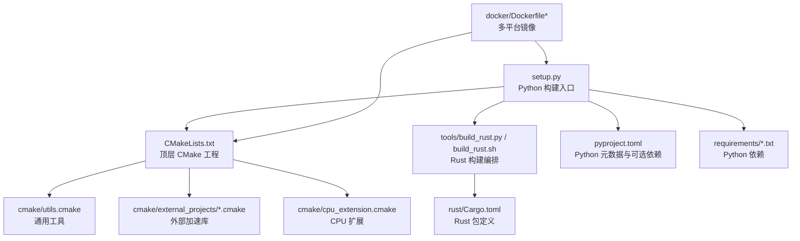
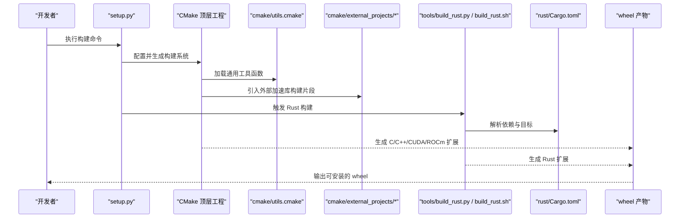
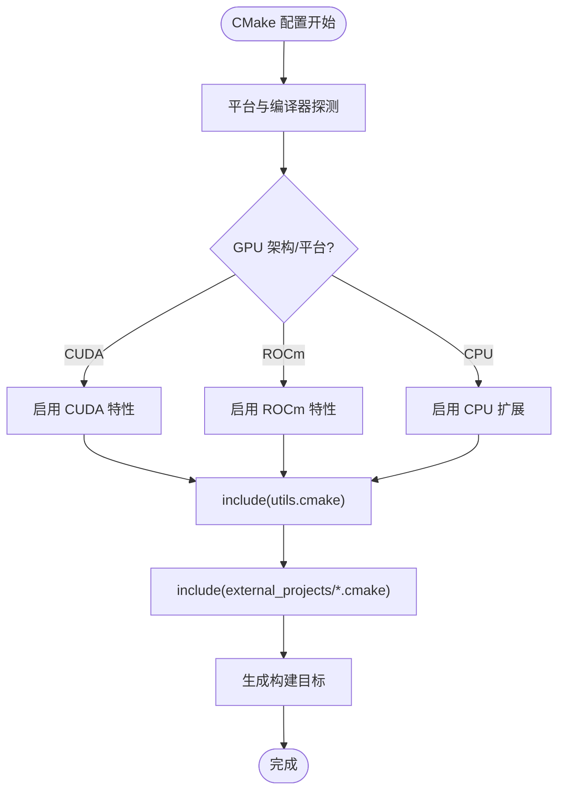
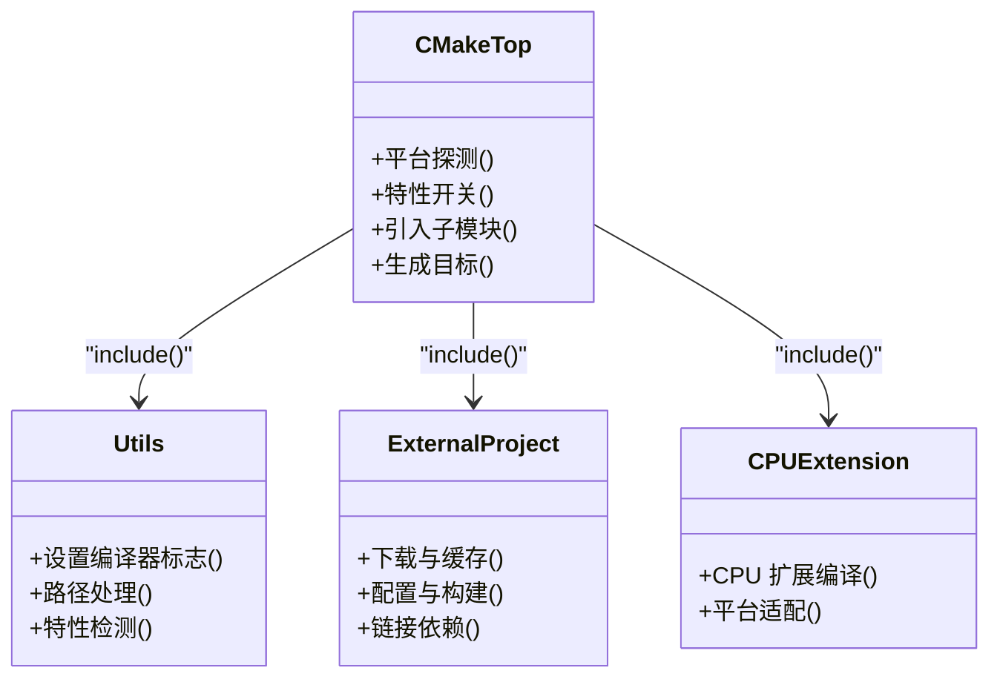
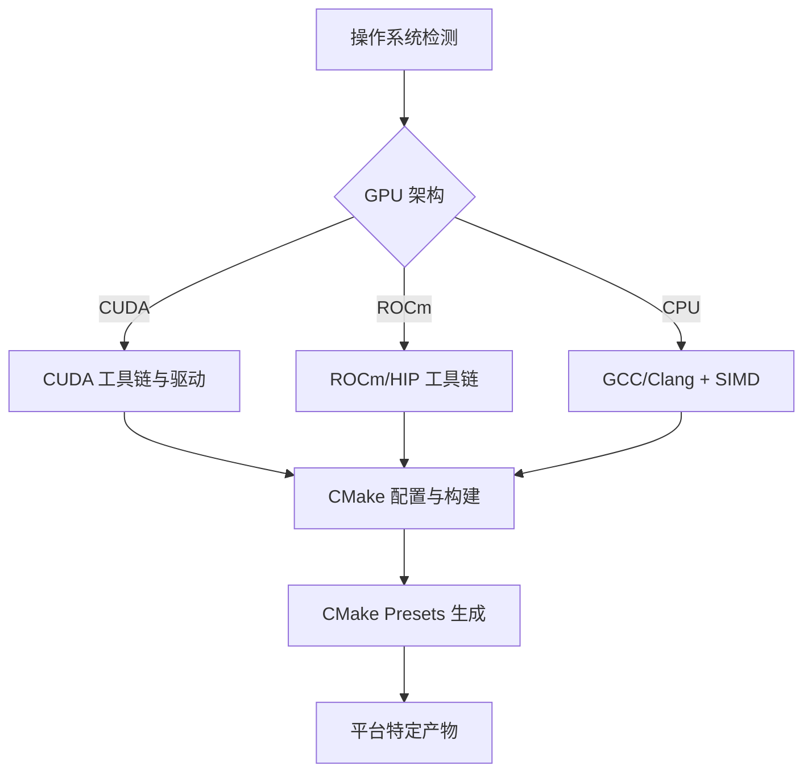
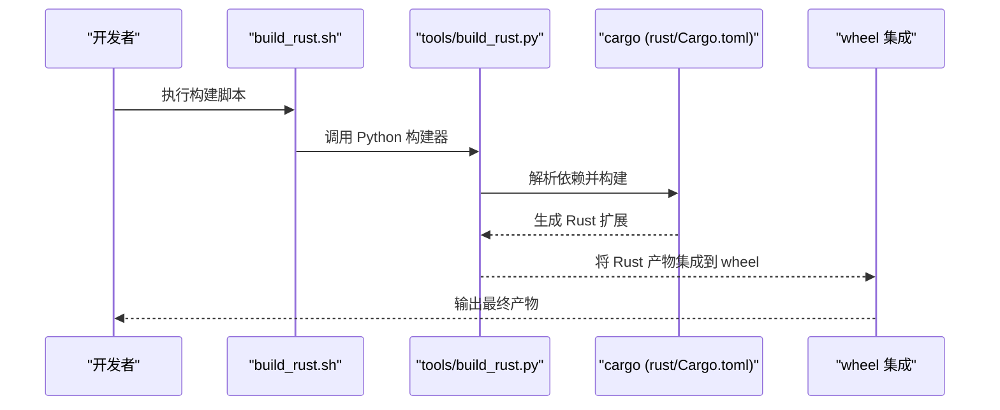
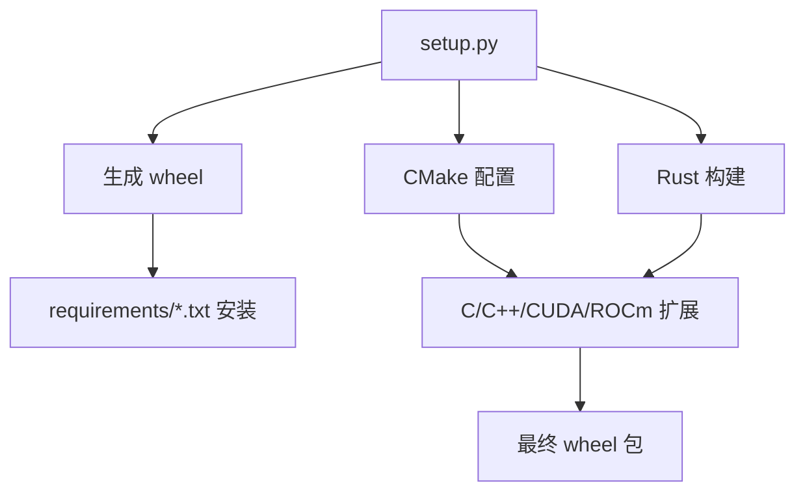
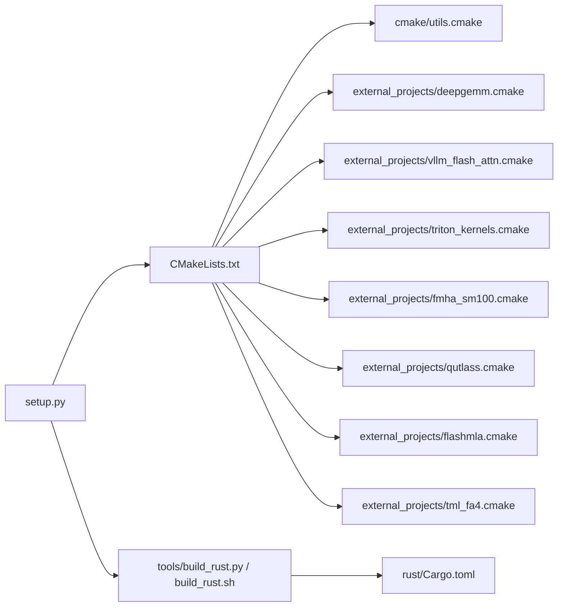

# 构建系统配置

<cite>
**本文引用的文件**   
- [CMakeLists.txt](file://CMakeLists.txt)
- [setup.py](file://setup.py)
- [pyproject.toml](file://pyproject.toml)
- [cmake/utils.cmake](file://cmake/utils.cmake)
- [cmake/external_projects/deepgemm.cmake](file://cmake/external_projects/deepgemm.cmake)
- [cmake/external_projects/vllm_flash_attn.cmake](file://cmake/external_projects/vllm_flash_attn.cmake)
- [cmake/external_projects/triton_kernels.cmake](file://cmake/external_projects/triton_kernels.cmake)
- [cmake/external_projects/fmha_sm100.cmake](file://cmake/external_projects/fmha_sm100.cmake)
- [cmake/external_projects/qutlass.cmake](file://cmake/external_projects/qutlass.cmake)
- [cmake/external_projects/flashmla.cmake](file://cmake/external_projects/flashmla.cmake)
- [cmake/external_projects/tml_fa4.cmake](file://cmake/external_projects/tml_fa4.cmake)
- [cmake/cpu_extension.cmake](file://cmake/cpu_extension.cmake)
- [tools/build_rust.py](file://tools/build_rust.py)
- [build_rust.sh](file://build_rust.sh)
- [rust/Cargo.toml](file://rust/Cargo.toml)
- [rust-toolchain.toml](file://rust-toolchain.toml)
- [docker/Dockerfile](file://docker/Dockerfile)
- [docker/Dockerfile.rocm](file://docker/Dockerfile.rocm)
- [docker/Dockerfile.cpu](file://docker/Dockerfile.cpu)
- [requirements/cuda.txt](file://requirements/cuda.txt)
- [requirements/rocm.txt](file://requirements/rocm.txt)
- [requirements/common.txt](file://requirements/common.txt)
- [scripts/generate_cmake_presets.py](file://scripts/generate_cmake_presets.py)
</cite>

## 目录
1. [简介](#简介)
2. [项目结构](#项目结构)
3. [核心组件](#核心组件)
4. [架构总览](#架构总览)
5. [详细组件分析](#详细组件分析)
6. [依赖关系分析](#依赖关系分析)
7. [性能与优化](#性能与优化)
8. [故障排查指南](#故障排查指南)
9. [结论](#结论)
10. [附录](#附录)

## 简介
本文件系统性说明 vLLM 的构建系统与编译流程，重点覆盖：
- CMake 构建系统的组织方式、模块划分与依赖管理
- 自定义编译规则（编译器选项、链接参数、库依赖）
- 多平台支持（不同 GPU 架构与操作系统兼容性）
- Rust 组件集成与构建过程
- 构建优化技巧（增量编译、并行构建、缓存策略）
- 常见构建问题与解决方案

## 项目结构
vLLM 的构建体系由 Python 打包入口、CMake 构建脚本、外部子项目脚本、Docker 环境与工具链组成。关键目录与职责如下：
- 根级构建入口
  - setup.py：Python 包构建与扩展模块编译入口，协调 CMake 与 Rust 构建
  - pyproject.toml：现代 Python 构建元数据与可选依赖声明
  - CMakeLists.txt：顶层 CMake 工程定义，包含平台检测、子模块引入与目标生成
- CMake 辅助与外部项目
  - cmake/utils.cmake：通用工具函数（路径处理、编译器探测、特性开关）
  - cmake/external_projects/*.cmake：各外部加速库的下载、配置与构建封装
  - cmake/cpu_extension.cmake：CPU 后端扩展的构建配置
- Rust 组件
  - rust/Cargo.toml：Rust 包定义与依赖
  - tools/build_rust.py、build_rust.sh：Rust 构建编排与脚本
  - rust-toolchain.toml：Rust 工具链版本锁定
- Docker 环境
  - docker/Dockerfile*：多平台镜像（CUDA/ROCm/CPU/XPU/TPU），固化构建依赖与工具链
- 依赖清单
  - requirements/*.txt：Python 依赖（CUDA/ROCm/通用等）
- 工具与脚本
  - scripts/generate_cmake_presets.py：生成 CMake Presets，便于跨平台快速配置

**图示来源** 
- [CMakeLists.txt](file://CMakeLists.txt)
- [setup.py](file://setup.py)
- [pyproject.toml](file://pyproject.toml)
- [cmake/utils.cmake](file://cmake/utils.cmake)
- [cmake/external_projects/deepgemm.cmake](file://cmake/external_projects/deepgemm.cmake)
- [cmake/external_projects/vllm_flash_attn.cmake](file://cmake/external_projects/vllm_flash_attn.cmake)
- [cmake/external_projects/triton_kernels.cmake](file://cmake/external_projects/triton_kernels.cmake)
- [cmake/external_projects/fmha_sm100.cmake](file://cmake/external_projects/fmha_sm100.cmake)
- [cmake/external_projects/qutlass.cmake](file://cmake/external_projects/qutlass.cmake)
- [cmake/external_projects/flashmla.cmake](file://cmake/external_projects/flashmla.cmake)
- [cmake/external_projects/tml_fa4.cmake](file://cmake/external_projects/tml_fa4.cmake)
- [cmake/cpu_extension.cmake](file://cmake/cpu_extension.cmake)
- [tools/build_rust.py](file://tools/build_rust.py)
- [build_rust.sh](file://build_rust.sh)
- [rust/Cargo.toml](file://rust/Cargo.toml)
- [docker/Dockerfile](file://docker/Dockerfile)
- [docker/Dockerfile.rocm](file://docker/Dockerfile.rocm)
- [docker/Dockerfile.cpu](file://docker/Dockerfile.cpu)
- [requirements/cuda.txt](file://requirements/cuda.txt)
- [requirements/rocm.txt](file://requirements/rocm.txt)
- [requirements/common.txt](file://requirements/common.txt)
- [scripts/generate_cmake_presets.py](file://scripts/generate_cmake_presets.py)

**章节来源**
- [CMakeLists.txt](file://CMakeLists.txt)
- [setup.py](file://setup.py)
- [pyproject.toml](file://pyproject.toml)
- [cmake/utils.cmake](file://cmake/utils.cmake)
- [cmake/external_projects/deepgemm.cmake](file://cmake/external_projects/deepgemm.cmake)
- [cmake/external_projects/vllm_flash_attn.cmake](file://cmake/external_projects/vllm_flash_attn.cmake)
- [cmake/external_projects/triton_kernels.cmake](file://cmake/external_projects/triton_kernels.cmake)
- [cmake/external_projects/fmha_sm100.cmake](file://cmake/external_projects/fmha_sm100.cmake)
- [cmake/external_projects/qutlass.cmake](file://cmake/external_projects/qutlass.cmake)
- [cmake/external_projects/flashmla.cmake](file://cmake/external_projects/flashmla.cmake)
- [cmake/external_projects/tml_fa4.cmake](file://cmake/external_projects/tml_fa4.cmake)
- [cmake/cpu_extension.cmake](file://cmake/cpu_extension.cmake)
- [tools/build_rust.py](file://tools/build_rust.py)
- [build_rust.sh](file://build_rust.sh)
- [rust/Cargo.toml](file://rust/Cargo.toml)
- [docker/Dockerfile](file://docker/Dockerfile)
- [docker/Dockerfile.rocm](file://docker/Dockerfile.rocm)
- [docker/Dockerfile.cpu](file://docker/Dockerfile.cpu)
- [requirements/cuda.txt](file://requirements/cuda.txt)
- [requirements/rocm.txt](file://requirements/rocm.txt)
- [requirements/common.txt](file://requirements/common.txt)
- [scripts/generate_cmake_presets.py](file://scripts/generate_cmake_presets.py)

## 核心组件
- CMake 顶层工程与模块
  - 顶层 CMakeLists.txt 负责平台探测、GPU 架构选择、外部项目引入与最终目标生成
  - cmake/utils.cmake 提供通用函数（如编译器探测、路径拼接、特性开关）
  - cmake/external_projects/*.cmake 将各外部加速库封装为可复用的构建片段
  - cmake/cpu_extension.cmake 统一 CPU 后端扩展的编译与链接
- Python 构建入口
  - setup.py 协调 CMake 与 Rust 构建，解析环境变量与可选功能，生成 wheel
  - pyproject.toml 声明构建后端、可选依赖与元数据
- Rust 组件
  - rust/Cargo.toml 定义 Rust 包与依赖
  - tools/build_rust.py 与 build_rust.sh 负责 Rust 工具链安装、交叉编译与产物集成
- 容器化与环境
  - docker/Dockerfile* 固定 CUDA/ROCm/CPU/XPU/TPU 构建环境，确保可重复性
- 依赖管理
  - requirements/*.txt 按平台拆分 Python 依赖；CUDA/ROCm 相关依赖在对应文件中声明

**章节来源**
- [CMakeLists.txt](file://CMakeLists.txt)
- [cmake/utils.cmake](file://cmake/utils.cmake)
- [cmake/external_projects/deepgemm.cmake](file://cmake/external_projects/deepgemm.cmake)
- [cmake/external_projects/vllm_flash_attn.cmake](file://cmake/external_projects/vllm_flash_attn.cmake)
- [cmake/external_projects/triton_kernels.cmake](file://cmake/external_projects/triton_kernels.cmake)
- [cmake/external_projects/fmha_sm100.cmake](file://cmake/external_projects/fmha_sm100.cmake)
- [cmake/external_projects/qutlass.cmake](file://cmake/external_projects/qutlass.cmake)
- [cmake/external_projects/flashmla.cmake](file://cmake/external_projects/flashmla.cmake)
- [cmake/external_projects/tml_fa4.cmake](file://cmake/external_projects/tml_fa4.cmake)
- [cmake/cpu_extension.cmake](file://cmake/cpu_extension.cmake)
- [setup.py](file://setup.py)
- [pyproject.toml](file://pyproject.toml)
- [rust/Cargo.toml](file://rust/Cargo.toml)
- [tools/build_rust.py](file://tools/build_rust.py)
- [build_rust.sh](file://build_rust.sh)
- [docker/Dockerfile](file://docker/Dockerfile)
- [docker/Dockerfile.rocm](file://docker/Dockerfile.rocm)
- [docker/Dockerfile.cpu](file://docker/Dockerfile.cpu)
- [requirements/cuda.txt](file://requirements/cuda.txt)
- [requirements/rocm.txt](file://requirements/rocm.txt)
- [requirements/common.txt](file://requirements/common.txt)

## 架构总览
下图展示从 Python 构建入口到 CMake/Rust 构建以及外部依赖的整体调用关系。

**图示来源** 
- [setup.py](file://setup.py)
- [CMakeLists.txt](file://CMakeLists.txt)
- [cmake/utils.cmake](file://cmake/utils.cmake)
- [cmake/external_projects/deepgemm.cmake](file://cmake/external_projects/deepgemm.cmake)
- [cmake/external_projects/vllm_flash_attn.cmake](file://cmake/external_projects/vllm_flash_attn.cmake)
- [cmake/external_projects/triton_kernels.cmake](file://cmake/external_projects/triton_kernels.cmake)
- [cmake/external_projects/fmha_sm100.cmake](file://cmake/external_projects/fmha_sm100.cmake)
- [cmake/external_projects/qutlass.cmake](file://cmake/external_projects/qutlass.cmake)
- [cmake/external_projects/flashmla.cmake](file://cmake/external_projects/flashmla.cmake)
- [cmake/external_projects/tml_fa4.cmake](file://cmake/external_projects/tml_fa4.cmake)
- [tools/build_rust.py](file://tools/build_rust.py)
- [build_rust.sh](file://build_rust.sh)
- [rust/Cargo.toml](file://rust/Cargo.toml)

## 详细组件分析

### CMake 构建系统组织与模块划分
- 顶层 CMakeLists.txt
  - 负责平台与编译器探测、GPU 架构选择、启用/禁用特性开关、引入子模块与生成最终目标
  - 通过 include() 引入 cmake/utils.cmake 与 external_projects/*.cmake，实现模块化
- cmake/utils.cmake
  - 提供通用函数：路径处理、编译器标志设置、特性检测、条件分支逻辑
- cmake/external_projects/*.cmake
  - 每个外部加速库一个 cmake 片段，封装下载、配置、编译与安装步骤
  - 典型模块包括 deepgemm、vllm_flash_attn、triton_kernels、fmha_sm100、qutlass、flashmla、tml_fa4
- cmake/cpu_extension.cmake
  - 统一 CPU 后端扩展的编译与链接，屏蔽平台差异

**图示来源** 
- [CMakeLists.txt](file://CMakeLists.txt)
- [cmake/utils.cmake](file://cmake/utils.cmake)
- [cmake/external_projects/deepgemm.cmake](file://cmake/external_projects/deepgemm.cmake)
- [cmake/external_projects/vllm_flash_attn.cmake](file://cmake/external_projects/vllm_flash_attn.cmake)
- [cmake/external_projects/triton_kernels.cmake](file://cmake/external_projects/triton_kernels.cmake)
- [cmake/external_projects/fmha_sm100.cmake](file://cmake/external_projects/fmha_sm100.cmake)
- [cmake/external_projects/qutlass.cmake](file://cmake/external_projects/qutlass.cmake)
- [cmake/external_projects/flashmla.cmake](file://cmake/external_projects/flashmla.cmake)
- [cmake/external_projects/tml_fa4.cmake](file://cmake/external_projects/tml_fa4.cmake)
- [cmake/cpu_extension.cmake](file://cmake/cpu_extension.cmake)

**章节来源**
- [CMakeLists.txt](file://CMakeLists.txt)
- [cmake/utils.cmake](file://cmake/utils.cmake)
- [cmake/external_projects/deepgemm.cmake](file://cmake/external_projects/deepgemm.cmake)
- [cmake/external_projects/vllm_flash_attn.cmake](file://cmake/external_projects/vllm_flash_attn.cmake)
- [cmake/external_projects/triton_kernels.cmake](file://cmake/external_projects/triton_kernels.cmake)
- [cmake/external_projects/fmha_sm100.cmake](file://cmake/external_projects/fmha_sm100.cmake)
- [cmake/external_projects/qutlass.cmake](file://cmake/external_projects/qutlass.cmake)
- [cmake/external_projects/flashmla.cmake](file://cmake/external_projects/flashmla.cmake)
- [cmake/external_projects/tml_fa4.cmake](file://cmake/external_projects/tml_fa4.cmake)
- [cmake/cpu_extension.cmake](file://cmake/cpu_extension.cmake)

### 自定义编译规则配置（编译器选项、链接参数、库依赖）
- 编译器选项
  - 通过 cmake/utils.cmake 中的工具函数设置 C/C++/CUDA/ROCm 编译器标志
  - 依据平台与 GPU 架构动态启用优化开关（如向量化、SIMD、特定指令集）
- 链接参数
  - 在外部项目片段中集中声明库依赖与链接顺序，避免循环依赖
  - 使用 target_link_libraries 与 INTERFACE/PRIVATE/PUBLIC 语义控制可见性
- 库依赖
  - 外部加速库通过 external_projects/*.cmake 统一管理，支持离线缓存与本地路径覆盖
  - 依赖版本与路径可通过环境变量或 CMake 变量注入

**图示来源** 
- [CMakeLists.txt](file://CMakeLists.txt)
- [cmake/utils.cmake](file://cmake/utils.cmake)
- [cmake/external_projects/deepgemm.cmake](file://cmake/external_projects/deepgemm.cmake)
- [cmake/external_projects/vllm_flash_attn.cmake](file://cmake/external_projects/vllm_flash_attn.cmake)
- [cmake/external_projects/triton_kernels.cmake](file://cmake/external_projects/triton_kernels.cmake)
- [cmake/external_projects/fmha_sm100.cmake](file://cmake/external_projects/fmha_sm100.cmake)
- [cmake/external_projects/qutlass.cmake](file://cmake/external_projects/qutlass.cmake)
- [cmake/external_projects/flashmla.cmake](file://cmake/external_projects/flashmla.cmake)
- [cmake/external_projects/tml_fa4.cmake](file://cmake/external_projects/tml_fa4.cmake)
- [cmake/cpu_extension.cmake](file://cmake/cpu_extension.cmake)

**章节来源**
- [cmake/utils.cmake](file://cmake/utils.cmake)
- [cmake/external_projects/deepgemm.cmake](file://cmake/external_projects/deepgemm.cmake)
- [cmake/external_projects/vllm_flash_attn.cmake](file://cmake/external_projects/vllm_flash_attn.cmake)
- [cmake/external_projects/triton_kernels.cmake](file://cmake/external_projects/triton_kernels.cmake)
- [cmake/external_projects/fmha_sm100.cmake](file://cmake/external_projects/fmha_sm100.cmake)
- [cmake/external_projects/qutlass.cmake](file://cmake/external_projects/qutlass.cmake)
- [cmake/external_projects/flashmla.cmake](file://cmake/external_projects/flashmla.cmake)
- [cmake/external_projects/tml_fa4.cmake](file://cmake/external_projects/tml_fa4.cmake)
- [cmake/cpu_extension.cmake](file://cmake/cpu_extension.cmake)

### 多平台构建支持（GPU 架构与操作系统）
- GPU 架构
  - CUDA：通过顶层 CMake 与外部项目片段启用相应架构（如 sm_XX）
  - ROCm：启用 HIP/ROCm 工具链与内核编译
  - CPU：启用 SIMD/向量化优化（x86/ARM/RISC-V/VSX/VXE 等）
- 操作系统
  - Linux 为主，Docker 镜像覆盖 x86_64、ppc64le、s390x、XPU、TPU 等
- 构建预设
  - scripts/generate_cmake_presets.py 生成 CMake Presets，简化跨平台配置

**图示来源** 
- [CMakeLists.txt](file://CMakeLists.txt)
- [docker/Dockerfile](file://docker/Dockerfile)
- [docker/Dockerfile.rocm](file://docker/Dockerfile.rocm)
- [docker/Dockerfile.cpu](file://docker/Dockerfile.cpu)
- [requirements/cuda.txt](file://requirements/cuda.txt)
- [requirements/rocm.txt](file://requirements/rocm.txt)
- [scripts/generate_cmake_presets.py](file://scripts/generate_cmake_presets.py)

**章节来源**
- [CMakeLists.txt](file://CMakeLists.txt)
- [docker/Dockerfile](file://docker/Dockerfile)
- [docker/Dockerfile.rocm](file://docker/Dockerfile.rocm)
- [docker/Dockerfile.cpu](file://docker/Dockerfile.cpu)
- [requirements/cuda.txt](file://requirements/cuda.txt)
- [requirements/rocm.txt](file://requirements/rocm.txt)
- [scripts/generate_cmake_presets.py](file://scripts/generate_cmake_presets.py)

### Rust 组件集成与构建过程
- 构建编排
  - tools/build_rust.py：解析构建参数、安装/切换 Rust 工具链、执行 cargo 构建
  - build_rust.sh：Shell 脚本封装，便于 CI/CD 与本地快速构建
- 包定义与依赖
  - rust/Cargo.toml：定义 crate、依赖与目标平台
- 工具链锁定
  - rust-toolchain.toml：固定 Rust 版本与组件，确保一致性

**图示来源** 
- [tools/build_rust.py](file://tools/build_rust.py)
- [build_rust.sh](file://build_rust.sh)
- [rust/Cargo.toml](file://rust/Cargo.toml)
- [rust-toolchain.toml](file://rust-toolchain.toml)

**章节来源**
- [tools/build_rust.py](file://tools/build_rust.py)
- [build_rust.sh](file://build_rust.sh)
- [rust/Cargo.toml](file://rust/Cargo.toml)
- [rust-toolchain.toml](file://rust-toolchain.toml)

### Python 构建入口与依赖管理
- setup.py
  - 协调 CMake 与 Rust 构建，解析环境变量与可选功能，生成 wheel
  - 根据平台与依赖选择启用/禁用特性
- pyproject.toml
  - 声明构建后端、可选依赖与元数据
- requirements/*.txt
  - 按平台拆分依赖（CUDA/ROCm/通用），确保可重复安装

**图示来源** 
- [setup.py](file://setup.py)
- [pyproject.toml](file://pyproject.toml)
- [requirements/cuda.txt](file://requirements/cuda.txt)
- [requirements/rocm.txt](file://requirements/rocm.txt)
- [requirements/common.txt](file://requirements/common.txt)

**章节来源**
- [setup.py](file://setup.py)
- [pyproject.toml](file://pyproject.toml)
- [requirements/cuda.txt](file://requirements/cuda.txt)
- [requirements/rocm.txt](file://requirements/rocm.txt)
- [requirements/common.txt](file://requirements/common.txt)

## 依赖关系分析
- 内部依赖
  - CMake 顶层工程依赖 utils.cmake 与 external_projects/*.cmake
  - setup.py 依赖 CMake 与 Rust 构建工具
- 外部依赖
  - 加速库（deepgemm、flash-attn、triton-kernels、fmha-sm100、qutlass、flashmla、tml-fa4）通过 cmake 片段管理
  - CUDA/ROCm 工具链与驱动由 Docker 镜像与 requirements 文件约束
- 潜在循环依赖
  - 通过分层 include 与明确的目标依赖避免循环

**图示来源** 
- [setup.py](file://setup.py)
- [CMakeLists.txt](file://CMakeLists.txt)
- [cmake/utils.cmake](file://cmake/utils.cmake)
- [cmake/external_projects/deepgemm.cmake](file://cmake/external_projects/deepgemm.cmake)
- [cmake/external_projects/vllm_flash_attn.cmake](file://cmake/external_projects/vllm_flash_attn.cmake)
- [cmake/external_projects/triton_kernels.cmake](file://cmake/external_projects/triton_kernels.cmake)
- [cmake/external_projects/fmha_sm100.cmake](file://cmake/external_projects/fmha_sm100.cmake)
- [cmake/external_projects/qutlass.cmake](file://cmake/external_projects/qutlass.cmake)
- [cmake/external_projects/flashmla.cmake](file://cmake/external_projects/flashmla.cmake)
- [cmake/external_projects/tml_fa4.cmake](file://cmake/external_projects/tml_fa4.cmake)
- [tools/build_rust.py](file://tools/build_rust.py)
- [build_rust.sh](file://build_rust.sh)
- [rust/Cargo.toml](file://rust/Cargo.toml)

**章节来源**
- [setup.py](file://setup.py)
- [CMakeLists.txt](file://CMakeLists.txt)
- [cmake/utils.cmake](file://cmake/utils.cmake)
- [cmake/external_projects/deepgemm.cmake](file://cmake/external_projects/deepgemm.cmake)
- [cmake/external_projects/vllm_flash_attn.cmake](file://cmake/external_projects/vllm_flash_attn.cmake)
- [cmake/external_projects/triton_kernels.cmake](file://cmake/external_projects/triton_kernels.cmake)
- [cmake/external_projects/fmha_sm100.cmake](file://cmake/external_projects/fmha_sm100.cmake)
- [cmake/external_projects/qutlass.cmake](file://cmake/external_projects/qutlass.cmake)
- [cmake/external_projects/flashmla.cmake](file://cmake/external_projects/flashmla.cmake)
- [cmake/external_projects/tml_fa4.cmake](file://cmake/external_projects/tml_fa4.cmake)
- [tools/build_rust.py](file://tools/build_rust.py)
- [build_rust.sh](file://build_rust.sh)
- [rust/Cargo.toml](file://rust/Cargo.toml)

## 性能与优化
- 增量编译
  - 利用 CMake/Ninja 的增量构建机制，仅重编译变更源文件
  - 合理拆分模块与目标，减少不必要的重新链接
- 并行构建
  - 使用 -j 或 Ninja 的并行任务提升构建速度
  - 平衡 CPU 核心数与内存占用，避免 OOM
- 缓存策略
  - 外部项目片段支持本地缓存与离线构建，减少网络依赖
  - 使用 CMake Presets 与构建目录隔离，提高缓存命中率
- 编译器优化
  - 针对目标架构启用合适的优化开关（如 -O3、LTO、向量化）
  - 在调试与发布构建间切换，平衡速度与可调试性

[本节为通用指导，不直接分析具体文件]

## 故障排查指南
- 常见问题定位
  - 编译器/工具链缺失：检查 Docker 镜像与 requirements 文件是否匹配
  - GPU 架构不匹配：确认 CUDA/ROCm 工具链与内核编译参数
  - 外部依赖下载失败：检查网络与缓存路径，必要时手动放置依赖
  - Rust 构建失败：核对 rust-toolchain.toml 版本与 cargo 环境
- 建议步骤
  - 清理构建目录后重试
  - 逐步启用/禁用外部项目以定位问题
  - 查看构建日志与错误输出，定位具体阶段

**章节来源**
- [docker/Dockerfile](file://docker/Dockerfile)
- [docker/Dockerfile.rocm](file://docker/Dockerfile.rocm)
- [docker/Dockerfile.cpu](file://docker/Dockerfile.cpu)
- [requirements/cuda.txt](file://requirements/cuda.txt)
- [requirements/rocm.txt](file://requirements/rocm.txt)
- [rust-toolchain.toml](file://rust-toolchain.toml)

## 结论
vLLM 的构建系统以 CMake 为核心，结合 Python 构建入口与 Rust 组件，形成模块化、可扩展且多平台支持的编译体系。通过外部项目片段与工具链锁定，确保了依赖管理与构建一致性。配合合理的优化策略与故障排查方法，可在不同硬件与操作系统上高效构建高质量产物。

[本节为总结，不直接分析具体文件]

## 附录
- 常用命令与提示
  - 使用 CMake Presets 快速配置与构建
  - 在 Docker 环境中执行构建以确保环境一致
  - 按需启用/禁用外部加速库以减少构建时间

[本节为补充信息，不直接分析具体文件]