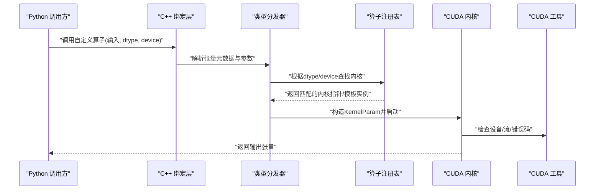
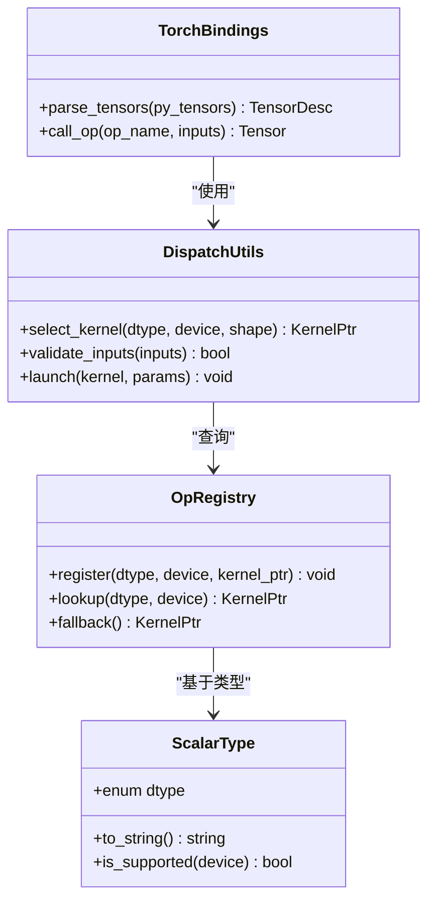
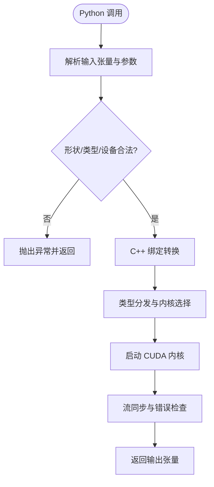
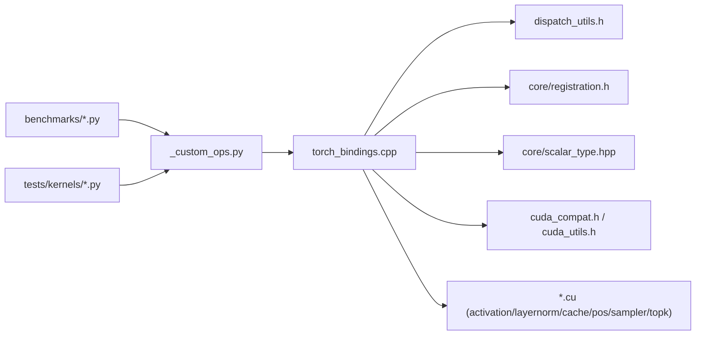

# 自定义算子开发

<cite>
**本文引用的文件**   
- [vllm/_custom_ops.py](file://vllm/_custom_ops.py)
- [csrc/torch_bindings.cpp](file://csrc/torch_bindings.cpp)
- [csrc/ops.h](file://csrc/ops.h)
- [csrc/libtorch_stable/torch_bindings.cpp](file://csrc/libtorch_stable/torch_bindings.cpp)
- [csrc/libtorch_stable/ops.h](file://csrc/libtorch_stable/ops.h)
- [csrc/dispatch_utils.h](file://csrc/dispatch_utils.h)
- [csrc/core/registration.h](file://csrc/core/registration.h)
- [csrc/core/scalar_type.hpp](file://csrc/core/scalar_type.hpp)
- [csrc/cuda_compat.h](file://csrc/cuda_compat.h)
- [csrc/cuda_utils.h](file://csrc/cuda_utils.h)
- [csrc/libtorch_stable/activation_kernels.cu](file://csrc/libtorch_stable/activation_kernels.cu)
- [csrc/libtorch_stable/layernorm_kernels.cu](file://csrc/libtorch_stable/layernorm_kernels.cu)
- [csrc/libtorch_stable/cache_kernels.cu](file://csrc/libtorch_stable/cache_kernels.cu)
- [csrc/libtorch_stable/pos_encoding_kernels.cu](file://csrc/libtorch_stable/pos_encoding_kernels.cu)
- [csrc/libtorch_stable/sampler.cu](file://csrc/libtorch_stable/sampler.cu)
- [csrc/libtorch_stable/topk.cu](file://csrc/libtorch_stable/topk.cu)
- [benchmarks/fused_kernels/layernorm_rms_benchmarks.py](file://benchmarks/fused_kernels/layernorm_rms_benchmarks.py)
- [benchmarks/kernels/benchmark_activation.py](file://benchmarks/kernels/benchmark_activation.py)
- [benchmarks/kernels/benchmark_layernorm.py](file://benchmarks/kernels/benchmark_layernorm.py)
- [tests/kernels/test_fused_quant_activation.py](file://tests/kernels/test_fused_quant_activation.py)
- [tests/kernels/test_cache_kernels.py](file://tests/kernels/test_cache_kernels.py)
- [tests/kernels/test_top_k_per_row.py](file://tests/kernels/test_top_k_per_row.py)
- [docs/design/custom_op.md](file://docs/design/custom_op.md)
</cite>

## 目录
1. [简介](#简介)
2. [项目结构](#项目结构)
3. [核心组件](#核心组件)
4. [架构总览](#架构总览)
5. [详细组件分析](#详细组件分析)
6. [依赖关系分析](#依赖关系分析)
7. [性能考量](#性能考量)
8. [故障排查指南](#故障排查指南)
9. [结论](#结论)
10. [附录](#附录)

## 简介
本文件面向希望在 vLLM 中开发自定义 CUDA 算子的工程师，系统阐述从 PyTorch 扩展的创建、C++ 接口定义、CUDA 内核实现到 Python 绑定的完整流程；解释 vLLM 中的算子注册机制与类型分发系统；给出张量操作的最佳实践（内存布局、数据类型处理、边界检查）；说明如何集成到 vLLM 的算子调度系统；并提供从简单向量操作到复杂注意力机制的示例路径、调试技巧与性能验证方法。

## 项目结构
vLLM 的自定义算子相关代码主要分布在以下区域：
- C++/CUDA 源码：csrc 及其子目录（libtorch_stable、core、dispatch_utils 等）
- Python 绑定入口：vllm/_custom_ops.py
- 基准测试与性能验证：benchmarks/*
- 单元测试与正确性验证：tests/kernels/*
- 设计文档：docs/design/custom_op.md

```mermaid
graph TB
subgraph "Python层"
PY_CUSTOM["vllm/_custom_ops.py"]
BENCH_BF["benchmarks/fused_kernels/layernorm_rms_benchmarks.py"]
BENCH_ACT["benchmarks/kernels/benchmark_activation.py"]
BENCH_LN["benchmarks/kernels/benchmark_layernorm.py"]
end
subgraph "C++/CUDA层"
BIND_CPP["csrc/torch_bindings.cpp"]
OPS_H["csrc/ops.h"]
LIB_BIND["csrc/libtorch_stable/torch_bindings.cpp"]
LIB_OPS["csrc/libtorch_stable/ops.h"]
DISPATCH["csrc/dispatch_utils.h"]
REG["csrc/core/registration.h"]
TYPEH["csrc/core/scalar_type.hpp"]
CU_ACT["csrc/libtorch_stable/activation_kernels.cu"]
CU_LN["csrc/libtorch_stable/layernorm_kernels.cu"]
CU_CACHE["csrc/libtorch_stable/cache_kernels.cu"]
CU_POS["csrc/libtorch_stable/pos_encoding_kernels.cu"]
CU_SAMP["csrc/libtorch_stable/sampler.cu"]
CU_TOPK["csrc/libtorch_stable/topk.cu"]
UTILS["csrc/cuda_compat.h<br/>csrc/cuda_utils.h"]
end
subgraph "测试与文档"
T_ACT["tests/kernels/test_fused_quant_activation.py"]
T_CACHE["tests/kernels/test_cache_kernels.py"]
T_TOPK["tests/kernels/test_top_k_per_row.py"]
DOC["docs/design/custom_op.md"]
end
PY_CUSTOM --> BIND_CPP
PY_CUSTOM --> LIB_BIND
BIND_CPP --> OPS_H
LIB_BIND --> LIB_OPS
LIB_BIND --> DISPATCH
LIB_BIND --> REG
LIB_BIND --> TYPEH
LIB_BIND --> CU_ACT
LIB_BIND --> CU_LN
LIB_BIND --> CU_CACHE
LIB_BIND --> CU_POS
LIB_BIND --> CU_SAMP
LIB_BIND --> CU_TOPK
LIB_BIND --> UTILS
BENCH_BF --> PY_CUSTOM
BENCH_ACT --> PY_CUSTOM
BENCH_LN --> PY_CUSTOM
T_ACT --> PY_CUSTOM
T_CACHE --> PY_CUSTOM
T_TOPK --> PY_CUSTOM
DOC --> PY_CUSTOM
```

图表来源
- [vllm/_custom_ops.py](file://vllm/_custom_ops.py)
- [csrc/torch_bindings.cpp](file://csrc/torch_bindings.cpp)
- [csrc/ops.h](file://csrc/ops.h)
- [csrc/libtorch_stable/torch_bindings.cpp](file://csrc/libtorch_stable/torch_bindings.cpp)
- [csrc/libtorch_stable/ops.h](file://csrc/libtorch_stable/ops.h)
- [csrc/dispatch_utils.h](file://csrc/dispatch_utils.h)
- [csrc/core/registration.h](file://csrc/core/registration.h)
- [csrc/core/scalar_type.hpp](file://csrc/core/scalar_type.hpp)
- [csrc/cuda_compat.h](file://csrc/cuda_compat.h)
- [csrc/cuda_utils.h](file://csrc/cuda_utils.h)
- [csrc/libtorch_stable/activation_kernels.cu](file://csrc/libtorch_stable/activation_kernels.cu)
- [csrc/libtorch_stable/layernorm_kernels.cu](file://csrc/libtorch_stable/layernorm_kernels.cu)
- [csrc/libtorch_stable/cache_kernels.cu](file://csrc/libtorch_stable/cache_kernels.cu)
- [csrc/libtorch_stable/pos_encoding_kernels.cu](file://csrc/libtorch_stable/pos_encoding_kernels.cu)
- [csrc/libtorch_stable/sampler.cu](file://csrc/libtorch_stable/sampler.cu)
- [csrc/libtorch_stable/topk.cu](file://csrc/libtorch_stable/topk.cu)
- [benchmarks/fused_kernels/layernorm_rms_benchmarks.py](file://benchmarks/fused_kernels/layernorm_rms_benchmarks.py)
- [benchmarks/kernels/benchmark_activation.py](file://benchmarks/kernels/benchmark_activation.py)
- [benchmarks/kernels/benchmark_layernorm.py](file://benchmarks/kernels/benchmark_layernorm.py)
- [tests/kernels/test_fused_quant_activation.py](file://tests/kernels/test_fused_quant_activation.py)
- [tests/kernels/test_cache_kernels.py](file://tests/kernels/test_cache_kernels.py)
- [tests/kernels/test_top_k_per_row.py](file://tests/kernels/test_top_k_per_row.py)
- [docs/design/custom_op.md](file://docs/design/custom_op.md)

章节来源
- [docs/design/custom_op.md](file://docs/design/custom_op.md)

## 核心组件
- Python 绑定入口：统一暴露算子给 Python 侧调用，负责参数校验、设备与类型选择、流管理以及错误传播。
- C++ 绑定层：将 Python 张量转换为 ATen/Tensor 描述，解析 dtype/device/shape，并分派到具体内核。
- 内核实现：以 .cu 文件组织 CUDA 核函数，按数据类型和形状进行模板化或宏展开，保证高性能。
- 类型分发与注册：通过类型枚举与注册表，实现按 dtype/device/kernel 变体的自动选择与回退。
- 工具与兼容性：提供 CUDA 版本兼容、设备信息获取、流同步、错误码检查等通用能力。

章节来源
- [vllm/_custom_ops.py](file://vllm/_custom_ops.py)
- [csrc/torch_bindings.cpp](file://csrc/torch_bindings.cpp)
- [csrc/libtorch_stable/torch_bindings.cpp](file://csrc/libtorch_stable/torch_bindings.cpp)
- [csrc/dispatch_utils.h](file://csrc/dispatch_utils.h)
- [csrc/core/registration.h](file://csrc/core/registration.h)
- [csrc/core/scalar_type.hpp](file://csrc/core/scalar_type.hpp)
- [csrc/cuda_compat.h](file://csrc/cuda_compat.h)
- [csrc/cuda_utils.h](file://csrc/cuda_utils.h)

## 架构总览
下图展示了从 Python 调用到 CUDA 内核执行的典型路径，包括类型分发、注册查找与内核启动。

图表来源
- [csrc/torch_bindings.cpp](file://csrc/torch_bindings.cpp)
- [csrc/libtorch_stable/torch_bindings.cpp](file://csrc/libtorch_stable/torch_bindings.cpp)
- [csrc/dispatch_utils.h](file://csrc/dispatch_utils.h)
- [csrc/core/registration.h](file://csrc/core/registration.h)
- [csrc/cuda_compat.h](file://csrc/cuda_compat.h)
- [csrc/cuda_utils.h](file://csrc/cuda_utils.h)

## 详细组件分析

### 算子注册机制与类型分发系统
- 类型枚举与映射：通过 scalar_type.hpp 定义支持的 dtype 枚举，并在绑定层将其映射为内核可识别的类型标识。
- 注册表：registration.h 提供统一的注册接口，允许在模块初始化时登记各 dtype/device 组合对应的内核实现。
- 分发策略：dispatch_utils.h 提供按 dtype/device/shape 的分发逻辑，支持模板特化、宏展开与运行时分支。
- 回退与兼容性：当特定变体不可用时，自动回退到通用实现或 CPU 路径，确保稳定性。

图表来源
- [csrc/core/scalar_type.hpp](file://csrc/core/scalar_type.hpp)
- [csrc/core/registration.h](file://csrc/core/registration.h)
- [csrc/dispatch_utils.h](file://csrc/dispatch_utils.h)
- [csrc/libtorch_stable/torch_bindings.cpp](file://csrc/libtorch_stable/torch_bindings.cpp)

章节来源
- [csrc/core/scalar_type.hpp](file://csrc/core/scalar_type.hpp)
- [csrc/core/registration.h](file://csrc/core/registration.h)
- [csrc/dispatch_utils.h](file://csrc/dispatch_utils.h)
- [csrc/libtorch_stable/torch_bindings.cpp](file://csrc/libtorch_stable/torch_bindings.cpp)

### C++ 接口定义与 Python 绑定
- Python 入口：_custom_ops.py 暴露统一的 Python API，封装参数校验、设备切换、流管理与异常处理。
- C++ 绑定：torch_bindings.cpp 将 Python 张量转为 ATen/Tensor，解析 dtype/device/stride/contiguous 状态，并调用分发器。
- 头文件约定：ops.h 声明对外可调用的算子函数原型，便于跨模块引用与测试。

图表来源
- [vllm/_custom_ops.py](file://vllm/_custom_ops.py)
- [csrc/torch_bindings.cpp](file://csrc/torch_bindings.cpp)
- [csrc/ops.h](file://csrc/ops.h)

章节来源
- [vllm/_custom_ops.py](file://vllm/_custom_ops.py)
- [csrc/torch_bindings.cpp](file://csrc/torch_bindings.cpp)
- [csrc/ops.h](file://csrc/ops.h)

### CUDA 内核实现最佳实践
- 内存布局：优先使用连续内存（contiguous），避免跨步访问；必要时在绑定层做拷贝或视图变换。
- 数据类型处理：对半精度/低精度进行显式转换与溢出保护，注意舍入模式与数值稳定性。
- 边界条件：严格检查维度大小、索引范围、空张量与广播语义，防止越界与未定义行为。
- 并行粒度：合理设置线程块/网格尺寸，利用共享内存与向量化加载提升吞吐。
- 错误处理：捕获 CUDA 错误码，提供清晰的诊断信息与回退路径。

章节来源
- [csrc/libtorch_stable/activation_kernels.cu](file://csrc/libtorch_stable/activation_kernels.cu)
- [csrc/libtorch_stable/layernorm_kernels.cu](file://csrc/libtorch_stable/layernorm_kernels.cu)
- [csrc/libtorch_stable/cache_kernels.cu](file://csrc/libtorch_stable/cache_kernels.cu)
- [csrc/libtorch_stable/pos_encoding_kernels.cu](file://csrc/libtorch_stable/pos_encoding_kernels.cu)
- [csrc/libtorch_stable/sampler.cu](file://csrc/libtorch_stable/sampler.cu)
- [csrc/libtorch_stable/topk.cu](file://csrc/libtorch_stable/topk.cu)
- [csrc/cuda_compat.h](file://csrc/cuda_compat.h)
- [csrc/cuda_utils.h](file://csrc/cuda_utils.h)

### 算子调度系统集成
- 统一入口：所有自定义算子通过 _custom_ops.py 暴露，保持与 vLLM 其他组件一致的调用方式。
- 调度策略：根据 dtype/device/shape 动态选择最优内核，必要时启用图优化或融合。
- 流与上下文：遵循 vLLM 的 forward_context 与流管理约定，确保并发安全与资源复用。

章节来源
- [vllm/_custom_ops.py](file://vllm/_custom_ops.py)
- [csrc/libtorch_stable/torch_bindings.cpp](file://csrc/libtorch_stable/torch_bindings.cpp)

### 开发示例路径
- 简单向量操作：参考激活函数与逐元素运算的实现，学习参数校验、类型分发与内核启动。
- 归一化与缓存：参考 layernorm 与 cache kernels，理解共享内存使用与批量处理。
- 位置编码与采样：参考 pos_encoding 与 sampler，掌握索引计算与随机数生成。
- Top-K 与稀疏选择：参考 topk 实现，学习堆/直方图等数据结构在 GPU 上的高效实现。

章节来源
- [csrc/libtorch_stable/activation_kernels.cu](file://csrc/libtorch_stable/activation_kernels.cu)
- [csrc/libtorch_stable/layernorm_kernels.cu](file://csrc/libtorch_stable/layernorm_kernels.cu)
- [csrc/libtorch_stable/cache_kernels.cu](file://csrc/libtorch_stable/cache_kernels.cu)
- [csrc/libtorch_stable/pos_encoding_kernels.cu](file://csrc/libtorch_stable/pos_encoding_kernels.cu)
- [csrc/libtorch_stable/sampler.cu](file://csrc/libtorch_stable/sampler.cu)
- [csrc/libtorch_stable/topk.cu](file://csrc/libtorch_stable/topk.cu)

## 依赖关系分析
- Python 层依赖 C++ 绑定，C++ 绑定依赖类型分发与注册表，最终调用 CUDA 内核。
- 工具库提供设备与流管理能力，确保跨平台与多设备一致性。
- 基准与测试用例覆盖正确性与性能回归，保障新算子稳定集成。

图表来源
- [vllm/_custom_ops.py](file://vllm/_custom_ops.py)
- [csrc/torch_bindings.cpp](file://csrc/torch_bindings.cpp)
- [csrc/libtorch_stable/torch_bindings.cpp](file://csrc/libtorch_stable/torch_bindings.cpp)
- [csrc/dispatch_utils.h](file://csrc/dispatch_utils.h)
- [csrc/core/registration.h](file://csrc/core/registration.h)
- [csrc/core/scalar_type.hpp](file://csrc/core/scalar_type.hpp)
- [csrc/cuda_compat.h](file://csrc/cuda_compat.h)
- [csrc/cuda_utils.h](file://csrc/cuda_utils.h)
- [csrc/libtorch_stable/activation_kernels.cu](file://csrc/libtorch_stable/activation_kernels.cu)
- [csrc/libtorch_stable/layernorm_kernels.cu](file://csrc/libtorch_stable/layernorm_kernels.cu)
- [csrc/libtorch_stable/cache_kernels.cu](file://csrc/libtorch_stable/cache_kernels.cu)
- [csrc/libtorch_stable/pos_encoding_kernels.cu](file://csrc/libtorch_stable/pos_encoding_kernels.cu)
- [csrc/libtorch_stable/sampler.cu](file://csrc/libtorch_stable/sampler.cu)
- [csrc/libtorch_stable/topk.cu](file://csrc/libtorch_stable/topk.cu)
- [benchmarks/fused_kernels/layernorm_rms_benchmarks.py](file://benchmarks/fused_kernels/layernorm_rms_benchmarks.py)
- [benchmarks/kernels/benchmark_activation.py](file://benchmarks/kernels/benchmark_activation.py)
- [benchmarks/kernels/benchmark_layernorm.py](file://benchmarks/kernels/benchmark_layernorm.py)
- [tests/kernels/test_fused_quant_activation.py](file://tests/kernels/test_fused_quant_activation.py)
- [tests/kernels/test_cache_kernels.py](file://tests/kernels/test_cache_kernels.py)
- [tests/kernels/test_top_k_per_row.py](file://tests/kernels/test_top_k_per_row.py)

章节来源
- [benchmarks/fused_kernels/layernorm_rms_benchmarks.py](file://benchmarks/fused_kernels/layernorm_rms_benchmarks.py)
- [benchmarks/kernels/benchmark_activation.py](file://benchmarks/kernels/benchmark_activation.py)
- [benchmarks/kernels/benchmark_layernorm.py](file://benchmarks/kernels/benchmark_layernorm.py)
- [tests/kernels/test_fused_quant_activation.py](file://tests/kernels/test_fused_quant_activation.py)
- [tests/kernels/test_cache_kernels.py](file://tests/kernels/test_cache_kernels.py)
- [tests/kernels/test_top_k_per_row.py](file://tests/kernels/test_top_k_per_row.py)

## 性能考量
- 内存访问模式：合并访问、减少全局内存读写次数，充分利用共享内存与寄存器。
- 数据类型与精度：在满足数值精度的前提下尽量使用半精度/低精度，提高带宽利用率。
- 批处理与并行度：根据硬件特性调整线程块大小与网格配置，避免 warp 分歧。
- 流与异步：合理使用 CUDA 流与事件，重叠计算与通信，降低延迟。
- 基准与回归：使用 benchmarks 目录下的脚本进行端到端性能测量，结合 tests 进行正确性回归。

[本节为通用指导，不直接分析具体文件]

## 故障排查指南
- 常见错误：
  - 形状/类型不匹配：检查 Python 绑定层的参数校验与类型映射。
  - 设备不一致：确保输入张量与内核运行在同一设备，必要时进行拷贝。
  - 越界与非法索引：在内核中加入边界检查与断言，定位问题输入。
  - 流与同步：确认流顺序与事件同步，避免竞态条件。
- 调试手段：
  - 使用 CUDA 调试工具（如 nsight）定位内核崩溃与内存错误。
  - 打印关键中间结果与统计信息，辅助定位数值不稳定。
  - 逐步缩小问题规模，复现最小可重现案例。
- 回归测试：
  - 新增或修改内核后，运行对应 tests 与 benchmarks，确保正确性与性能无退化。

章节来源
- [csrc/cuda_compat.h](file://csrc/cuda_compat.h)
- [csrc/cuda_utils.h](file://csrc/cuda_utils.h)
- [tests/kernels/test_fused_quant_activation.py](file://tests/kernels/test_fused_quant_activation.py)
- [tests/kernels/test_cache_kernels.py](file://tests/kernels/test_cache_kernels.py)
- [tests/kernels/test_top_k_per_row.py](file://tests/kernels/test_top_k_per_row.py)

## 结论
通过统一的 Python 绑定、C++ 分发与注册机制，vLLM 为自定义 CUDA 算子提供了清晰、可扩展的开发框架。遵循内存布局、类型处理与边界检查的最佳实践，并结合基准与测试，可高效实现从简单向量操作到复杂注意力机制的高性能算子。建议在新算子开发过程中，始终关注数值稳定性、性能回归与可维护性，确保与 vLLM 调度系统的无缝集成。

[本节为总结性内容，不直接分析具体文件]

## 附录
- 设计文档：docs/design/custom_op.md 提供了更详细的自定义算子设计与集成规范。
- 参考实现：activation、layernorm、cache、pos_encoding、sampler、topk 等内核可作为模板与灵感来源。
- 基准与测试：benchmarks 与 tests 目录提供了完整的性能与正确性验证套件。

章节来源
- [docs/design/custom_op.md](file://docs/design/custom_op.md)
- [csrc/libtorch_stable/activation_kernels.cu](file://csrc/libtorch_stable/activation_kernels.cu)
- [csrc/libtorch_stable/layernorm_kernels.cu](file://csrc/libtorch_stable/layernorm_kernels.cu)
- [csrc/libtorch_stable/cache_kernels.cu](file://csrc/libtorch_stable/cache_kernels.cu)
- [csrc/libtorch_stable/pos_encoding_kernels.cu](file://csrc/libtorch_stable/pos_encoding_kernels.cu)
- [csrc/libtorch_stable/sampler.cu](file://csrc/libtorch_stable/sampler.cu)
- [csrc/libtorch_stable/topk.cu](file://csrc/libtorch_stable/topk.cu)
- [benchmarks/fused_kernels/layernorm_rms_benchmarks.py](file://benchmarks/fused_kernels/layernorm_rms_benchmarks.py)
- [benchmarks/kernels/benchmark_activation.py](file://benchmarks/kernels/benchmark_activation.py)
- [benchmarks/kernels/benchmark_layernorm.py](file://benchmarks/kernels/benchmark_layernorm.py)
- [tests/kernels/test_fused_quant_activation.py](file://tests/kernels/test_fused_quant_activation.py)
- [tests/kernels/test_cache_kernels.py](file://tests/kernels/test_cache_kernels.py)
- [tests/kernels/test_top_k_per_row.py](file://tests/kernels/test_top_k_per_row.py)