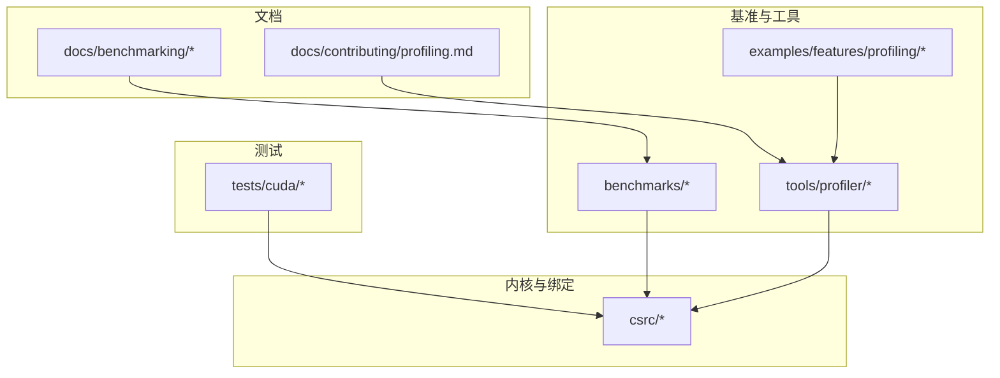
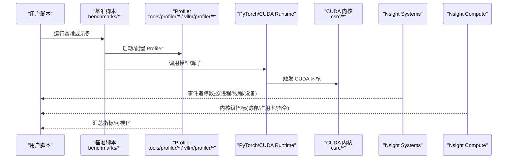
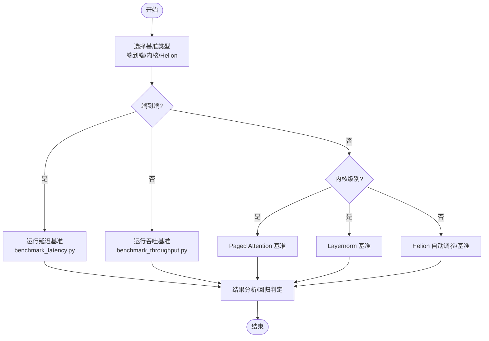
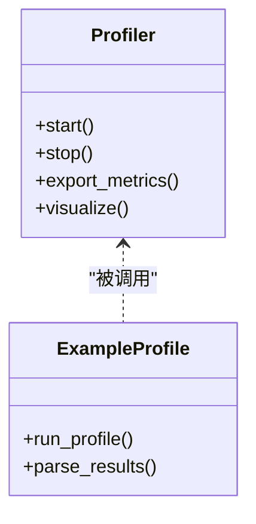
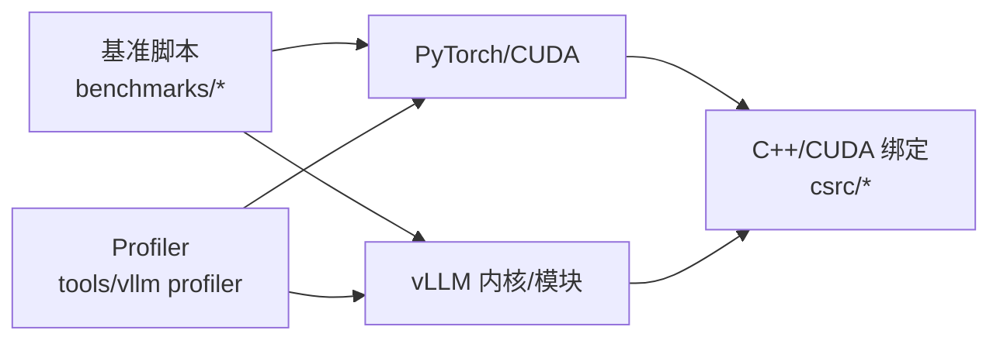

# 调试和性能分析工具

<cite>
**本文引用的文件**   
- [README.md](file://README.md)
- [benchmarks/README.md](file://benchmarks/README.md)
- [benchmarks/benchmark_latency.py](file://benchmarks/benchmark_latency.py)
- [benchmarks/benchmark_throughput.py](file://benchmarks/benchmark_throughput.py)
- [benchmarks/kernels/benchmark_paged_attention.py](file://benchmarks/kernels/benchmark_paged_attention.py)
- [benchmarks/kernels/benchmark_layernorm.py](file://benchmarks/kernels/benchmark_layernorm.py)
- [benchmarks/fused_kernels/layernorm_rms_benchmarks.py](file://benchmarks/fused_kernels/layernorm_rms_benchmarks.py)
- [scripts/autotune_helion_kernels.py](file://scripts/autotune_helion_kernels.py)
- [scripts/benchmark_helion_kernels.py](file://scripts/benchmark_helion_kernels.py)
- [tools/profiler/profiler.py](file://tools/profiler/profiler.py)
- [vllm/profiler/__init__.py](file://vllm/profiler/__init__.py)
- [vllm/profiler/profiler.py](file://vllm/profiler/profiler.py)
- [examples/features/profiling/profile_example.py](file://examples/features/profiling/profile_example.py)
- [docs/contributing/profiling.md](file://docs/contributing/profiling.md)
- [docs/benchmarking/cli.md](file://docs/benchmarking/cli.md)
- [docs/benchmarking/dashboard.md](file://docs/benchmarking/dashboard.md)
- [docs/benchmarking/sweeps.md](file://docs/benchmarking/sweeps.md)
- [tests/cuda/test_cuda_context.py](file://tests/cuda/test_cuda_context.py)
- [tests/cuda/scripts/run_cuda_tests.sh](file://tests/cuda/scripts/run_cuda_tests.sh)
- [csrc/torch_bindings.cpp](file://csrc/torch_bindings.cpp)
- [csrc/libtorch_stable/torch_bindings.cpp](file://csrc/libtorch_stable/torch_bindings.cpp)
</cite>

## 目录
1. [简介](#简介)
2. [项目结构](#项目结构)
3. [核心组件](#核心组件)
4. [架构总览](#架构总览)
5. [详细组件分析](#详细组件分析)
6. [依赖关系分析](#依赖关系分析)
7. [性能注意事项](#性能注意事项)
8. [故障排查指南](#故障排查指南)
9. [结论](#结论)
10. [附录](#附录)

## 简介
本文件面向需要在 vLLM 中调试 CUDA 内核与进行性能分析的工程师，系统性地介绍：
- 使用 NVIDIA Nsight Systems（事件追踪）与 Nsight Compute（内存与指令级分析）的技巧
- 使用 gdb 对 CUDA 内核进行断点、变量检查与调用栈分析
- 基于仓库内基准测试框架编写自定义用例与分析结果
- 实施内存泄漏检测与性能回归测试
- 结合真实优化案例与问题排查经验

## 项目结构
与调试和性能分析相关的代码与文档主要分布在以下位置：
- benchmarks：各类内核与端到端基准脚本，覆盖注意力、归一化、量化等场景
- tools/profiler：内置性能分析工具与示例
- examples/features/profiling：官方 profiling 示例
- docs/benchmarking 与 docs/contributing/profiling.md：基准与 profiling 文档
- tests/cuda：CUDA 相关测试与脚本
- csrc：C++/CUDA 绑定与内核入口

图表来源
- [benchmarks/README.md](file://benchmarks/README.md)
- [tools/profiler/profiler.py](file://tools/profiler/profiler.py)
- [examples/features/profiling/profile_example.py](file://examples/features/profiling/profile_example.py)
- [docs/benchmarking/cli.md](file://docs/benchmarking/cli.md)
- [docs/contributing/profiling.md](file://docs/contributing/profiling.md)
- [tests/cuda/test_cuda_context.py](file://tests/cuda/test_cuda_context.py)
- [csrc/torch_bindings.cpp](file://csrc/torch_bindings.cpp)

章节来源
- [benchmarks/README.md](file://benchmarks/README.md)
- [docs/benchmarking/cli.md](file://docs/benchmarking/cli.md)
- [docs/contributing/profiling.md](file://docs/contributing/profiling.md)

## 核心组件
- 基准测试框架
  - 端到端延迟/吞吐：benchmark_latency.py、benchmark_throughput.py
  - 内核级基准：kernels 目录下针对 paged attention、layernorm 等的独立脚本
  - 融合算子基准：fused_kernels 下的 layernorm_rms_benchmarks.py
- 自动调参与基准脚本
  - autotune_helion_kernels.py：Helion 内核自动搜索
  - benchmark_helion_kernels.py：Helion 内核基准对比
- 内置 Profiler
  - tools/profiler/profiler.py：统一采集与导出接口
  - vllm/profiler/*：Profiler 模块封装
  - examples/features/profiling/profile_example.py：官方示例
- 文档与配置
  - docs/benchmarking/*：CLI、Dashboard、Sweeps 说明
  - docs/contributing/profiling.md：贡献者 profiling 指南

章节来源
- [benchmarks/benchmark_latency.py](file://benchmarks/benchmark_latency.py)
- [benchmarks/benchmark_throughput.py](file://benchmarks/benchmark_throughput.py)
- [benchmarks/kernels/benchmark_paged_attention.py](file://benchmarks/kernels/benchmark_paged_attention.py)
- [benchmarks/kernels/benchmark_layernorm.py](file://benchmarks/kernels/benchmark_layernorm.py)
- [benchmarks/fused_kernels/layernnorm_rms_benchmarks.py](file://benchmarks/fused_kernels/layernorm_rms_benchmarks.py)
- [scripts/autotune_helion_kernels.py](file://scripts/autotune_helion_kernels.py)
- [scripts/benchmark_helion_kernels.py](file://scripts/benchmark_helion_kernels.py)
- [tools/profiler/profiler.py](file://tools/profiler/profiler.py)
- [vllm/profiler/__init__.py](file://vllm/profiler/__init__.py)
- [vllm/profiler/profiler.py](file://vllm/profiler/profiler.py)
- [examples/features/profiling/profile_example.py](file://examples/features/profiling/profile_example.py)
- [docs/benchmarking/cli.md](file://docs/benchmarking/cli.md)
- [docs/benchmarking/dashboard.md](file://docs/benchmarking/dashboard.md)
- [docs/benchmarking/sweeps.md](file://docs/benchmarking/sweeps.md)
- [docs/contributing/profiling.md](file://docs/contributing/profiling.md)

## 架构总览
下图展示了从 Python 层到 CUDA 内核的调用路径，以及各分析工具的接入点。

图表来源
- [benchmarks/benchmark_latency.py](file://benchmarks/benchmark_latency.py)
- [benchmarks/benchmark_throughput.py](file://benchmarks/benchmark_throughput.py)
- [tools/profiler/profiler.py](file://tools/profiler/profiler.py)
- [vllm/profiler/profiler.py](file://vllm/profiler/profiler.py)
- [examples/features/profiling/profile_example.py](file://examples/features/profiling/profile_example.py)
- [csrc/torch_bindings.cpp](file://csrc/torch_bindings.cpp)

## 详细组件分析

### Nsight Systems：事件追踪与瓶颈定位
- 适用场景
  - 识别 CPU/GPU 调度、通信、同步热点
  - 观察 kernel launch 时序、队列阻塞、跨进程/线程交互
- 使用要点
  - 在目标进程启动前设置环境变量以启用收集
  - 选择“应用”模式捕获完整生命周期，或使用“采样”模式降低开销
  - 关注 GPU 时间线中的空闲段、kernel 重叠、PCIe/NVLink 带宽
- 常见问题
  - 未对齐的 kernel launch 导致 CPU 侧等待
  - 大量小 kernel 造成 launch overhead
  - 通信与计算未有效重叠

章节来源
- [docs/contributing/profiling.md](file://docs/contributing/profiling.md)
- [examples/features/profiling/profile_example.py](file://examples/features/profiling/profile_example.py)

### Nsight Compute：内存分析与内核级优化
- 适用场景
  - 分析 L1/L2/DRAM 命中率、寄存器占用、SM 利用率
  - 定位访存模式不连续、bank conflict、warp divergence
- 使用要点
  - 针对具体 kernel 名称或函数名进行聚焦分析
  - 开启 Memory Workload Analysis 与 Occupancy 视图
  - 比较不同参数/形状下的访存与占用变化
- 常见问题
  - 非合并访问导致带宽浪费
  - 共享内存不足引发溢出回退
  - 分支发散导致有效并行度下降

章节来源
- [docs/contributing/profiling.md](file://docs/contributing/profiling.md)

### gdb：CUDA 内核调试
- 适用场景
  - 内核崩溃、数值异常、条件分支错误
- 使用要点
  - 在 Python 层设置断点，进入内核前切换到 CUDA 上下文
  - 使用 cuda-gdb 设置 kernel 断点与变量检查
  - 通过调用栈回溯定位 kernel 入口与调用方
- 常见问题
  - 异步执行导致断点时机不当，需显式同步
  - 多进程/多线程环境需正确附加到目标进程

章节来源
- [tests/cuda/test_cuda_context.py](file://tests/cuda/test_cuda_context.py)
- [tests/cuda/scripts/run_cuda_tests.sh](file://tests/cuda/scripts/run_cuda_tests.sh)

### 基准测试框架：端到端与内核级
- 端到端基准
  - 延迟：benchmark_latency.py
  - 吞吐：benchmark_throughput.py
- 内核级基准
  - Paged Attention：benchmarks/kernels/benchmark_paged_attention.py
  - Layernorm：benchmarks/kernels/benchmark_layernorm.py
  - 融合算子：benchmarks/fused_kernels/layernorm_rms_benchmarks.py
- 自动调参与 Helion 基准
  - autotune_helion_kernels.py
  - benchmark_helion_kernels.py

图表来源
- [benchmarks/benchmark_latency.py](file://benchmarks/benchmark_latency.py)
- [benchmarks/benchmark_throughput.py](file://benchmarks/benchmark_throughput.py)
- [benchmarks/kernels/benchmark_paged_attention.py](file://benchmarks/kernels/benchmark_paged_attention.py)
- [benchmarks/kernels/benchmark_layernorm.py](file://benchmarks/kernels/benchmark_layernorm.py)
- [benchmarks/fused_kernels/layernorm_rms_benchmarks.py](file://benchmarks/fused_kernels/layernorm_rms_benchmarks.py)
- [scripts/autotune_helion_kernels.py](file://scripts/autotune_helion_kernels.py)
- [scripts/benchmark_helion_kernels.py](file://scripts/benchmark_helion_kernels.py)

章节来源
- [benchmarks/README.md](file://benchmarks/README.md)
- [docs/benchmarking/cli.md](file://docs/benchmarking/cli.md)
- [docs/benchmarking/dashboard.md](file://docs/benchmarking/dashboard.md)
- [docs/benchmarking/sweeps.md](file://docs/benchmarking/sweeps.md)

### 内置 Profiler 与示例
- tools/profiler/profiler.py：提供统一的采集、聚合与导出能力
- vllm/profiler/*：封装常用 profiling 流程
- examples/features/profiling/profile_example.py：演示如何集成与使用

图表来源
- [tools/profiler/profiler.py](file://tools/profiler/profiler.py)
- [vllm/profiler/__init__.py](file://vllm/profiler/__init__.py)
- [vllm/profiler/profiler.py](file://vllm/profiler/profiler.py)
- [examples/features/profiling/profile_example.py](file://examples/features/profiling/profile_example.py)

章节来源
- [tools/profiler/profiler.py](file://tools/profiler/profiler.py)
- [vllm/profiler/__init__.py](file://vllm/profiler/__init__.py)
- [vllm/profiler/profiler.py](file://vllm/profiler/profiler.py)
- [examples/features/profiling/profile_example.py](file://examples/features/profiling/profile_example.py)

### 内核绑定与入口
- csrc/torch_bindings.cpp 与 csrc/libtorch_stable/torch_bindings.cpp：Python 与 C++/CUDA 的绑定入口，便于定位 kernel 调用链

章节来源
- [csrc/torch_bindings.cpp](file://csrc/torch_bindings.cpp)
- [csrc/libtorch_stable/torch_bindings.cpp](file://csrc/libtorch_stable/torch_bindings.cpp)

## 依赖关系分析
- 基准脚本依赖 PyTorch/CUDA 运行时与 vLLM 内部算子
- Profiler 模块依赖底层 CUDA 事件与统计接口
- 内核绑定将 Python API 映射到 C++/CUDA 实现

图表来源
- [benchmarks/benchmark_latency.py](file://benchmarks/benchmark_latency.py)
- [benchmarks/benchmark_throughput.py](file://benchmarks/benchmark_throughput.py)
- [tools/profiler/profiler.py](file://tools/profiler/profiler.py)
- [vllm/profiler/profiler.py](file://vllm/profiler/profiler.py)
- [csrc/torch_bindings.cpp](file://csrc/torch_bindings.cpp)

章节来源
- [benchmarks/README.md](file://benchmarks/README.md)
- [docs/benchmarking/cli.md](file://docs/benchmarking/cli.md)

## 性能注意事项
- 减少小 kernel 数量，合并频繁调用
- 确保内存访问合并，避免 bank conflict
- 合理设置 block/grid 维度以提升占用率
- 利用 Nsight Compute 的访存与占用视图指导优化
- 在端到端场景中，注意 CPU-GPU 同步与通信重叠

[本节为通用建议，不直接引用具体文件]

## 故障排查指南
- 常见症状
  - 内核崩溃或超时
  - 吞吐显著下降
  - 内存占用异常增长
- 排查步骤
  - 使用 Nsight Systems 查看事件时间线与 GPU 活动
  - 使用 Nsight Compute 聚焦可疑 kernel，检查访存与占用
  - 使用 gdb/cuda-gdb 设置断点并检查变量与调用栈
  - 运行最小可复现的基准脚本隔离问题
- 参考资源
  - docs/contributing/profiling.md：profiling 实践与技巧
  - tests/cuda/*：CUDA 测试与脚本，帮助复现环境问题

章节来源
- [docs/contributing/profiling.md](file://docs/contributing/profiling.md)
- [tests/cuda/test_cuda_context.py](file://tests/cuda/test_cuda_context.py)
- [tests/cuda/scripts/run_cuda_tests.sh](file://tests/cuda/scripts/run_cuda_tests.sh)

## 结论
通过结合 Nsight Systems、Nsight Compute、gdb 与 vLLM 内置基准与 Profiler，可以系统化地完成 CUDA 内核的调试与性能优化。建议在每次改动后运行基准回归，确保性能稳定；在关键路径上使用 Nsight 系列工具深入分析，定位瓶颈并迭代优化。

[本节为总结性内容，不直接引用具体文件]

## 附录
- 快速命令清单
  - Nsight Systems：在进程启动前设置环境变量并运行目标脚本
  - Nsight Compute：指定 kernel 名称或函数名进行分析
  - gdb/cuda-gdb：附加进程并在内核入口设置断点
- 基准脚本参考
  - 端到端：benchmarks/benchmark_latency.py、benchmarks/benchmark_throughput.py
  - 内核：benchmarks/kernels/benchmark_paged_attention.py、benchmarks/kernels/benchmark_layernorm.py
  - 融合算子：benchmarks/fused_kernels/layernorm_rms_benchmarks.py
  - Helion：scripts/autotune_helion_kernels.py、scripts/benchmark_helion_kernels.py
- 文档参考
  - docs/benchmarking/cli.md、docs/benchmarking/dashboard.md、docs/benchmarking/sweeps.md
  - docs/contributing/profiling.md

[本节为补充信息，不直接引用具体文件]