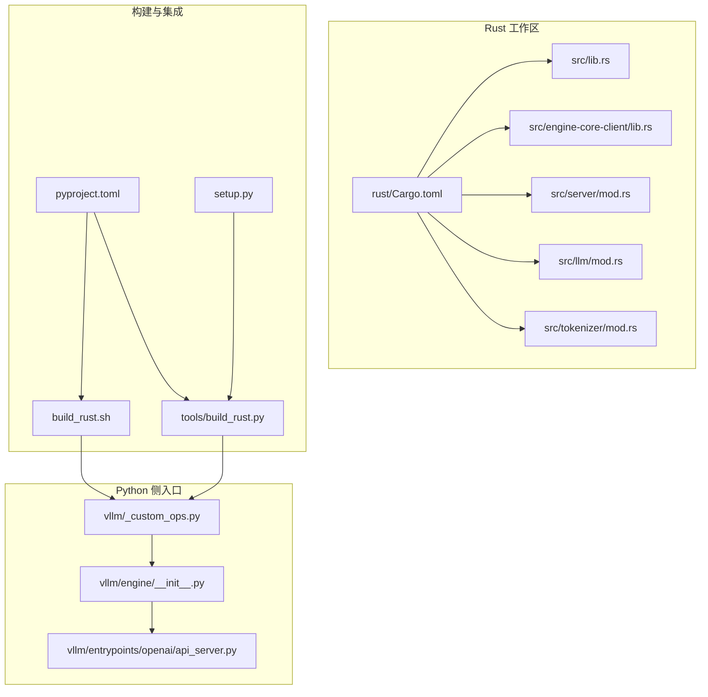
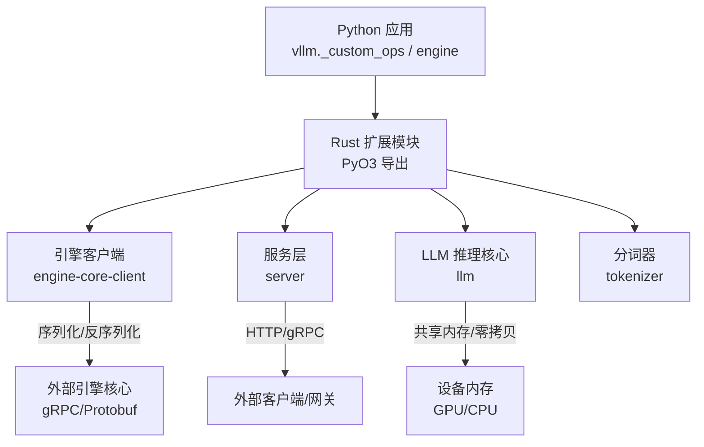
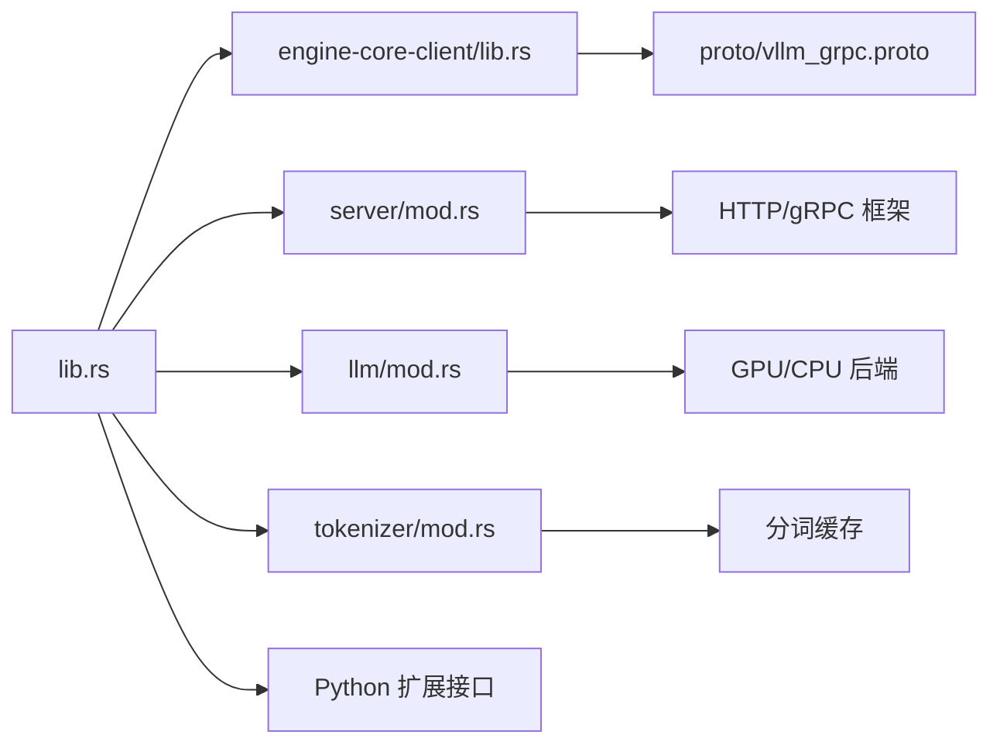

# Rust组件开发

<cite>
**本文档引用的文件**
- [rust/Cargo.toml](file://rust/Cargo.toml)
- [rust/README.md](file://rust/README.md)
- [rust/src/lib.rs](file://rust/src/lib.rs)
- [rust/src/engine-core-client/lib.rs](file://rust/src/engine-core-client/lib.rs)
- [rust/src/server/mod.rs](file://rust/src/server/mod.rs)
- [rust/src/llm/mod.rs](file://rust/src/llm/mod.rs)
- [rust/src/tokenizer/mod.rs](file://rust/src/tokenizer/mod.rs)
- [tools/build_rust.py](file://tools/build_rust.py)
- [build_rust.sh](file://build_rust.sh)
- [pyproject.toml](file://pyproject.toml)
- [setup.py](file://setup.py)
- [vllm/_custom_ops.py](file://vllm/_custom_ops.py)
- [vllm/engine/__init__.py](file://vllm/engine/__init__.py)
- [vllm/entrypoints/openai/api_server.py](file://vllm/entrypoints/openai/api_server.py)
</cite>

## 目录
1. [简介](#简介)
2. [项目结构](#项目结构)
3. [核心组件](#核心组件)
4. [架构总览](#架构总览)
5. [详细组件分析](#详细组件分析)
6. [依赖关系分析](#依赖关系分析)
7. [性能考量](#性能考量)
8. [故障排查指南](#故障排查指南)
9. [结论](#结论)
10. [附录](#附录)

## 简介
本文件面向希望在 vLLM 中开发与集成 Rust 组件的工程师，系统阐述 Rust 在 vLLM 中的作用与优势（内存安全、并发模型、零成本抽象与高性能），并给出 Rust 代码的组织方式、Python 与 Rust 的绑定方法（PyO3）、构建与发布流程、与现有 Python 代码的集成模式、错误处理与异常管理最佳实践，以及性能优化与调试技巧。文档同时提供实际开发示例与常见问题解决方案，帮助读者快速上手并在生产环境中稳定使用 Rust 组件。

## 项目结构
vLLM 的 Rust 源码位于 rust/ 目录，采用 Cargo workspace 组织多个 crate，涵盖引擎客户端、服务端、LLM 推理相关逻辑、分词器、指标采集等模块。顶层 pyproject.toml 与 setup.py 负责 Python 侧的构建与打包，tools/build_rust.py 与 build_rust.sh 提供跨平台构建脚本。

图表来源
- [rust/Cargo.toml](file://rust/Cargo.toml)
- [rust/src/lib.rs](file://rust/src/lib.rs)
- [tools/build_rust.py](file://tools/build_rust.py)
- [build_rust.sh](file://build_rust.sh)
- [pyproject.toml](file://pyproject.toml)
- [setup.py](file://setup.py)
- [vllm/_custom_ops.py](file://vllm/_custom_ops.py)
- [vllm/engine/__init__.py](file://vllm/engine/__init__.py)
- [vllm/entrypoints/openai/api_server.py](file://vllm/entrypoints/openai/api_server.py)

章节来源
- [rust/README.md](file://rust/README.md)
- [rust/Cargo.toml](file://rust/Cargo.toml)
- [tools/build_rust.py](file://tools/build_rust.py)
- [build_rust.sh](file://build_rust.sh)
- [pyproject.toml](file://pyproject.toml)
- [setup.py](file://setup.py)

## 核心组件
- Rust 库入口：定义 PyO3 模块导出与公共 API，暴露给 Python 调用。
- 引擎客户端：封装对 vLLM 引擎核心的异步调用与序列化协议（如 gRPC/Protobuf）。
- 服务端：提供 HTTP/gRPC 接口，承载请求路由、鉴权、限流与监控。
- LLM 模块：实现推理关键路径中的高性能计算与调度逻辑。
- 分词器：高效文本预处理与 token 化，支持多后端与缓存策略。
- 指标与日志：统一埋点、度量收集与结构化日志输出。

章节来源
- [rust/src/lib.rs](file://rust/src/lib.rs)
- [rust/src/engine-core-client/lib.rs](file://rust/src/engine-core-client/lib.rs)
- [rust/src/server/mod.rs](file://rust/src/server/mod.rs)
- [rust/src/llm/mod.rs](file://rust/src/llm/mod.rs)
- [rust/src/tokenizer/mod.rs](file://rust/src/tokenizer/mod.rs)

## 架构总览
下图展示 Python 与 Rust 组件的交互边界与数据流向。Python 通过自定义操作或模块导入 Rust 扩展；Rust 内部按职责划分为客户端、服务层与推理核心；外部通过 HTTP/gRPC 接入，最终由 Rust 高性能内核执行。

图表来源
- [vllm/_custom_ops.py](file://vllm/_custom_ops.py)
- [rust/src/lib.rs](file://rust/src/lib.rs)
- [rust/src/engine-core-client/lib.rs](file://rust/src/engine-core-client/lib.rs)
- [rust/src/server/mod.rs](file://rust/src/server/mod.rs)
- [rust/src/llm/mod.rs](file://rust/src/llm/mod.rs)
- [rust/src/tokenizer/mod.rs](file://rust/src/tokenizer/mod.rs)

## 详细组件分析

### Rust 库入口与 PyO3 绑定
- 作用：作为 Python 可导入的扩展模块，集中导出函数与类型，完成 Python 到 Rust 的类型转换与生命周期管理。
- 关键点：
  - 使用 PyO3 宏注册函数/类，声明参数与返回值的 Python 类型映射。
  - 处理 Python 对象与 Rust 值之间的所有权与借用，避免悬垂引用。
  - 将 Rust 错误转换为 Python 异常，确保异常传播一致。
- 建议：
  - 将复杂数据结构以 DTO（数据传输对象）形式在边界处转换，保持内层纯 Rust 类型简洁。
  - 对耗时操作使用异步接口，配合 Python asyncio 提升吞吐。

章节来源
- [rust/src/lib.rs](file://rust/src/lib.rs)

### 引擎客户端（engine-core-client）
- 作用：封装与 vLLM 引擎核心的通信，包括请求构造、序列化和响应解析。
- 关键点：
  - 基于 Protobuf 定义消息格式，保证跨语言兼容性。
  - 连接池与重试机制，提高稳定性与可用性。
  - 超时与取消语义，防止阻塞与资源泄漏。
- 建议：
  - 对大对象采用零拷贝或内存映射，减少序列化开销。
  - 使用背压与批处理提升吞吐。

章节来源
- [rust/src/engine-core-client/lib.rs](file://rust/src/engine-core-client/lib.rs)

### 服务层（server）
- 作用：对外暴露 HTTP/gRPC 接口，处理认证、鉴权、限流、监控与错误码。
- 关键点：
  - 路由与中间件链，便于扩展功能。
  - 请求体校验与输入规范化，降低下游压力。
  - 结构化日志与指标上报，便于观测与排障。
- 建议：
  - 使用连接池与线程池隔离不同任务，避免热点阻塞。
  - 对慢查询进行采样与告警。

章节来源
- [rust/src/server/mod.rs](file://rust/src/server/mod.rs)

### LLM 推理核心（llm）
- 作用：实现注意力、前向计算、KV 缓存管理等关键路径的高性能逻辑。
- 关键点：
  - 使用 SIMD/并行原语与内存对齐优化。
  - 避免不必要的分配与拷贝，利用切片与视图。
  - 针对 GPU/CPU 的不同特性做分支优化。
- 建议：
  - 使用基准测试驱动优化，定位热点。
  - 对关键路径添加火焰图与性能计数器。

章节来源
- [rust/src/llm/mod.rs](file://rust/src/llm/mod.rs)

### 分词器（tokenizer）
- 作用：文本预处理、token 化、缓存与批量处理。
- 关键点：
  - 支持多种分词后端与规则组合。
  - 缓存命中策略与失效控制。
  - 流式处理与增量更新。
- 建议：
  - 对长文本进行分段与并行处理。
  - 使用内存池减少频繁分配。

章节来源
- [rust/src/tokenizer/mod.rs](file://rust/src/tokenizer/mod.rs)

### Python 与 Rust 集成模式
- 入口点：
  - vllm/_custom_ops.py：加载 Rust 扩展并提供 Python 友好的 API。
  - vllm/engine/__init__.py：引擎初始化与配置注入。
  - vllm/entrypoints/openai/api_server.py：OpenAI 兼容接口对接。
- 类型转换：
  - 使用 PyO3 提供的类型映射（如列表、字典、字符串、数值）与自定义类型。
  - 对大型张量使用零拷贝视图，避免数据复制。
- 异常管理：
  - Rust 侧使用 Result 与自定义错误类型，抛出时转换为 Python 异常。
  - 在 Python 侧捕获并记录上下文信息，便于定位问题。

章节来源
- [vllm/_custom_ops.py](file://vllm/_custom_ops.py)
- [vllm/engine/__init__.py](file://vllm/engine/__init__.py)
- [vllm/entrypoints/openai/api_server.py](file://vllm/entrypoints/openai/api_server.py)

### 构建与发布流程
- 构建脚本：
  - tools/build_rust.py：跨平台构建 Rust 扩展，处理依赖与编译选项。
  - build_rust.sh：Shell 脚本用于 CI/CD 环境一键构建。
- 打包与分发：
  - pyproject.toml：定义 Python 包元数据与构建钩子。
  - setup.py：传统构建入口，兼容旧工具链。
- 建议：
  - 使用预编译 wheel 加速安装。
  - 为不同平台生成独立二进制，避免运行时依赖冲突。

章节来源
- [tools/build_rust.py](file://tools/build_rust.py)
- [build_rust.sh](file://build_rust.sh)
- [pyproject.toml](file://pyproject.toml)
- [setup.py](file://setup.py)

## 依赖关系分析
下图展示 Rust 各模块间的依赖关系以及与 Python 侧的耦合点。

图表来源
- [rust/src/lib.rs](file://rust/src/lib.rs)
- [rust/src/engine-core-client/lib.rs](file://rust/src/engine-core-client/lib.rs)
- [rust/src/server/mod.rs](file://rust/src/server/mod.rs)
- [rust/src/llm/mod.rs](file://rust/src/llm/mod.rs)
- [rust/src/tokenizer/mod.rs](file://rust/src/tokenizer/mod.rs)
- [rust/proto/vllm_grpc.proto](file://rust/proto/vllm_grpc.proto)

章节来源
- [rust/Cargo.toml](file://rust/Cargo.toml)
- [rust/proto/vllm_grpc.proto](file://rust/proto/vllm_grpc.proto)

## 性能考量
- 内存管理：
  - 使用 Rc/Arc 与 RefCell/Mutex 管理共享状态，避免重复分配。
  - 对大对象采用零拷贝与内存映射，减少序列化与拷贝开销。
- 并发模型：
  - 使用 tokio 异步运行时处理高并发请求，合理设置线程数与队列长度。
  - 对 CPU/GPU 混合任务进行流水线编排，最大化资源利用率。
- 算法优化：
  - 热点路径使用 SIMD 指令与循环展开。
  - 缓存热点数据，减少重复计算。
- 测量与调优：
  - 使用 perf、flamegraph、tracing 定位瓶颈。
  - 建立基准测试套件，持续回归验证优化效果。

[本节为通用指导，不直接分析具体文件]

## 故障排查指南
- 常见错误：
  - 类型转换失败：检查 PyO3 类型映射与输入校验。
  - 内存泄漏：使用 Valgrind/AddressSanitizer 检测未释放资源。
  - 死锁与竞态：审查锁粒度与异步任务调度。
- 调试技巧：
  - 启用详细日志与追踪，结合上下文 ID 关联请求链路。
  - 使用断点与单步调试，逐步缩小问题范围。
- 恢复策略：
  - 对关键服务增加熔断与降级逻辑。
  - 对不可恢复错误进行告警与自动重启。

章节来源
- [rust/src/server/mod.rs](file://rust/src/server/mod.rs)
- [rust/src/engine-core-client/lib.rs](file://rust/src/engine-core-client/lib.rs)

## 结论
通过在 vLLM 中引入 Rust 组件，可以在保证内存安全与并发正确性的前提下显著提升性能与稳定性。合理的模块划分、清晰的绑定边界、完善的构建与发布流程，以及系统的性能优化与调试策略，是成功落地的关键。建议团队遵循本文档的最佳实践，逐步推进 Rust 组件的开发与集成。

[本节为总结性内容，不直接分析具体文件]

## 附录
- 开发示例：
  - 创建一个简单的 PyO3 函数，接收 Python 字符串并返回处理结果。
  - 在 Python 侧导入并调用该函数，验证类型转换与异常处理。
- 常见问题：
  - 构建失败：检查 Rust 工具链版本与依赖库是否满足要求。
  - 运行时崩溃：使用调试符号与核心转储分析堆栈。
  - 性能不达预期：对比基准测试结果，定位热点函数。

[本节为补充信息，不直接分析具体文件]